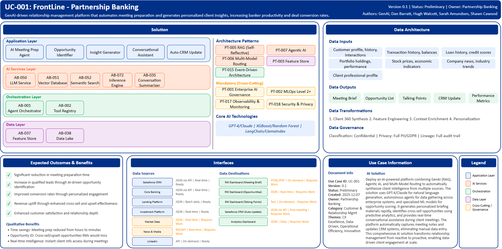

# UC-001: FrontLine - Partnership Banking

## Document Control

| Property | Value |
|----------|-------|
| **Use Case ID** | `UC-001` |
| **Version** | `0.1` |
| **Status** | `Preliminary` |
| **Created Date** | `2025-12-07` |
| **Last Modified** | `2025-12-07` |
| **Owner** | Partnership Banking |
| **Author(s)** | GenAI, Dan Barratt, Hugh Walcott, Sarah Amundsen, Shawn Cawood |
| **Product Owner** | TBD |
| **Executive Sponsor** | TBD |

## 1. Executive Summary

### 1.1 Use Case Overview

**One-Line Summary**: 
GenAI-driven relationship management platform that automates meeting preparation and generates personalized client insights, increasing banker productivity and deal conversion rates.

**Business Problem**:
Partnership Banking relationship managers spend significant time manually preparing for client meetings, gathering data from multiple disparate systems. This time-consuming process limits the number of client interactions and reduces the quality of insights that can be delivered, impacting cross-sell effectiveness and customer satisfaction.

**AI Solution**:
Deploy an AI-powered platform combining GenAI (RAG), Agentic AI, and Multi-Model Routing to automatically synthesize client intelligence from multiple sources. The solution uses GPT-4/Claude for natural language generation, autonomous agents for data gathering across enterprise systems, and specialized ML models for opportunity scoring. It generates personalized briefing materials rapidly, identifies cross-sell opportunities using predictive analytics, and provides real-time conversational assistance during client meetings. The platform automatically captures meeting notes and updates CRM systems, eliminating manual data entry. This comprehensive AI solution transforms relationship management from reactive to proactive, enabling data-driven client engagement at scale.

**Expected Outcomes**:

- Significant reduction in meeting preparation time
- Increase in qualified leads through AI-driven opportunity identification
- Improved conversion rates through personalized engagement strategies
- Revenue uplift through enhanced cross-sell and upsell effectiveness
- Enhanced customer satisfaction and relationship depth

### 1.2 Strategic Alignment

**Business Category**: 
Customer & Relationship Management

**Strategic Themes** (select all that apply):

- [x] Customer Experience Excellence
- [x] Operational Efficiency & Automation
- [ ] Risk & Compliance Excellence
- [x] Data-Driven Decision Making
- [x] Innovation & Competitive Differentiation

**Alignment Statement**:
This use case directly supports BNZ's Customer Experience Excellence pillar by enabling relationship managers to deliver personalized, insight-driven interactions. It drives Revenue Growth through improved cross-sell effectiveness and demonstrates Innovation & Competitive Differentiation by positioning BNZ as a technology-enabled banking partner. The use case enables the shift from reactive to proactive relationship management, a key strategic objective for 2025-2027.

## 2. Business Case

### 2.1 Business Value

**Value Type** (select all that apply):

- [x] Revenue Growth
- [x] Cost Reduction
- [ ] Risk Reduction
- [x] Customer Experience Improvement
- [ ] Regulatory Compliance
- [x] Competitive Advantage

**Qualitative Benefits**:

| Benefit Type | Description | AI Accelerant | Evidence / Indicator |
|--------------|----------|--------|--------|
| Time savings | Meeting preparation dramatically reduced from hours to rapid generation per client | Agentic AI autonomously gathers data from multiple enterprise sources; GenAI synthesizes into structured briefs | Task completion time, process cycle time, RM productivity metrics |
| Opportunity identification | Cross-sell/upsell opportunities identified that RMs would miss manually | ML models analyze client behavior patterns and propensity scores; Multi-model routing for specialized analysis | Qualified leads per RM, conversion rates, revenue per customer |
| Personalized engagement | Tailored talking points and value propositions for each client meeting | GenAI generates customized content based on client profile, history, and preferences | Customer satisfaction scores, relationship depth metrics, engagement quality |
| Real-time intelligence | Instant access to client information during meetings via conversational AI | RAG-enabled Q&A provides factual answers with source citations rapidly | Response time, accuracy of information, RM confidence scores |
| Automated CRM updates | Meeting notes captured and CRM updated automatically, eliminating manual data entry | NLP extracts key points, actions, and outcomes; Auto-populates CRM fields | Data entry time savings, CRM data completeness and quality |

## 3. Target State Solution

### 3.1 Solution Overview

**AI/ML Approach**:
Deploy an AI-powered platform combining GenAI (RAG) for knowledge synthesis using GPT-4/Claude, Agentic AI for autonomous multi-system data gathering across enterprise sources, and Multi-Model Routing for intelligent task distribution to specialized models (financial analysis, market insights, sentiment analysis). The solution leverages real-time ML through a feature store for client signals and propensity scores, enabling predictive opportunity identification. RAG (LangChain/LlamaIndex) grounds LLM outputs with factual client data, while autonomous agents orchestrate complex workflows. XGBoost and Random Forest models provide opportunity scoring and churn prediction. The platform includes conversational AI for real-time meeting support and NLP-based auto-summarization for CRM updates.

**Solution Components**:

1. **AI Meeting Prep Agent**: Automatically gathers client data from multiple sources (CRM, banking systems, market data, news), synthesizes into comprehensive structured brief rapidly
2. **Opportunity Identifier**: ML models (XGBoost, Random Forest) identify and rank cross-sell/upsell opportunities based on client profile, behavior patterns, and propensity scores
3. **Insight Generator**: GenAI creates personalized talking points, strategic questions, and customized value propositions tailored to each client's situation
4. **Conversational Assistant**: Real-time Q&A during meetings with instant access to client history, providing answers with source citations via RAG
5. **Auto-CRM Update**: NLP automatically captures meeting notes, extracts actions/outcomes, and updates Salesforce CRM without manual intervention

### 3.2 Data Architecture

**Data Inputs**:

| Dataset | Description | Source | Volume | Frequency | Format | Interface Status |
|-----------|--------|-----------|--------|--------------|--------------|--------------|
| Customer profile, history, interactions | Customer relationship and interaction data | Salesforce CRM | Large | Real-time | JSON via API | Ready |
| Transaction history, balances | Banking transaction and account balance data | Core Banking | Very large | Real-time | JSON via API | Ready |
| Loan history, credit scores | Lending portfolio and credit assessment data | Lending Platform | Large | Batch daily | JSON | Ready |
| Portfolio holdings, performance | Investment account and performance data | Investment Platform | Large | Real-time | JSON | Ready |
| Stock prices, economic indicators | Market data and economic indicators | Market Data | Streaming | Real-time | JSON | Requires Work |
| Company news, industry trends | News feeds and industry analysis | News & Media | Streaming | Real-time | RSS/API | Requires Work |
| Client professional profile, company updates | Professional networking and company information | LinkedIn | On-demand | On-demand | API | Ready |

**Data Transformations**:
1. **Client 360 Synthesis**: Aggregate data from multiple sources into unified client profile with comprehensive relationship view
2. **Feature Engineering**: Calculate client signals (engagement score, churn risk, propensity scores for product categories)
3. **Context Enrichment**: Add market context, industry insights, competitive intelligence, and relevant news to client profile
4. **Personalization**: Generate customized content based on client preferences, communication history, and interaction patterns

**Data Outputs**:

| Dataset | Description | Destination | Volume | Frequency | Format | Interface Status |  |
|-------------|-------------|-------------|--------|-----------|-----------|-----------|-----------|
| Meeting Brief | AI-generated client briefing with insights, opportunities, and talking points | RM Dashboard | Large | On-demand | HTML/PDF | Requires Work |  |
| Opportunity List | Ranked cross-sell/upsell opportunities with reasoning and next best actions | RM Dashboard | Large | Real-time | JSON | Requires Work |  |
| Talking Points | Personalized questions, value propositions, and strategic discussion topics | RM Dashboard | Large | On-demand | Text | Requires Work |  |
| CRM Update | Auto-captured meeting notes, action items, and relationship updates | Salesforce CRM | Large | Post-meeting | JSON via API | Requires Work |  |
| Performance Metrics | RM productivity, conversion rates, opportunity pipeline, and usage analytics | Analytics Dashboard | Large | Daily | JSON | Requires Work |  |

**Data Quality Requirements**:

- **Accuracy**: Very high accuracy required for client financial data and AI-generated insights
- **Completeness**: No missing critical client information (profile, holdings, recent interactions)
- **Timeliness**: Real-time for transactions and market data, batch processing for historical analytics
- **Consistency**: Standardized formats across all sources with unified data schema

**Data Governance**:
- **Classification**: Confidential (contains client financial data and PII)
- **Retention**: Client data per regulatory requirements, AI-generated content and meeting notes per retention policy
- **Privacy**: Full PII protection, consent-based data usage, GDPR compliance, privacy-by-design architecture
- **Lineage**: Full data lineage from source systems through AI processing to outputs, complete audit trail for all decisions

### 3.3 Architecture Patterns

**Primary Patterns Used**:

| Pattern ID | Pattern Name | Usage in Use Case |
|-----------|-------------|-------------------|
| [PT-005](../../../../03-building-blocks/patterns/PT-005/PT-005-Retrieval-Augmented-Generation-v1.0.0.md) | Retrieval Augmented Generation (Self-Reflective RAG) | Knowledge base retrieval for grounding client insights with factual data; conversational Q&A during meetings |
| [PT-007](../../../../03-building-blocks/patterns/PT-007/PT-007-Agentic-AI-v1.0.0.md) | Agentic AI Pattern | Autonomous agents for multi-system data gathering, research orchestration, and workflow automation |
| [PT-006](../../../../03-building-blocks/patterns/PT-006/PT-006-Multi-Model-Routing-v1.0.0.md) | Multi-Model Routing | Intelligent routing between specialized models for financial analysis, market insights, and sentiment analysis |
| [PT-003](../../../../03-building-blocks/patterns/PT-003/PT-003-Feature-Store-v1.0.0.md) | Feature Store (Dual-Store) | Real-time client signals, propensity scores, and behavioral features for opportunity identification |
| [PT-015](../../../../03-building-blocks/patterns/PT-015/PT-015-Event-Driven-Architecture-v1.0.0.md) | Event-Driven Architecture | Real-time client activity triggers for proactive alerts and opportunity notifications |
| [PT-001](../../../../03-building-blocks/patterns/PT-001/PT-001-Enterprise-AI-Governance-v1.0.0.md) | Enterprise AI Governance | Model risk management, compliance monitoring, and governance framework |
| [PT-002](../../../../03-building-blocks/patterns/PT-002/PT-002-MLOps-Level-2-Plus-v1.0.0.md) | MLOps Level 2+ | Continuous training and deployment for opportunity scoring models |
| [PT-017](../../../../03-building-blocks/patterns/PT-017/PT-017-Observability-Monitoring-v1.0.0.md) | Observability & Monitoring | Platform and model observability, performance tracking, and alerting |
| [PT-018](../../../../03-building-blocks/patterns/PT-018/PT-018-Security-Privacy-v1.0.0.md) | Security & Privacy | Data protection, access control, encryption, and privacy controls |

**Architecture Building Blocks (ABBs)**:

| ABB ID | ABB Name | Purpose in Use Case | Criticality |
|--------|----------|-------------------|-------------|
| [AB-050](../../../../03-building-blocks/architecture-building-blocks/abbs/AB-050/AB-050-Large-Language-Model-Service-v1.0.0.md) | Large Language Model Service | Meeting brief generation, Q&A, and content creation | Critical |
| [AB-051](../../../../03-building-blocks/architecture-building-blocks/abbs/AB-051/AB-051-Vector-Database-v1.0.0.md) | Vector Database | Client document embeddings for RAG-based retrieval | Critical |
| [AB-052](../../../../03-building-blocks/architecture-building-blocks/abbs/AB-052/AB-052-Semantic-Search-Engine-v1.0.0.md) | Semantic Search Engine | Retrieve relevant client information for context | Critical |
| [AB-001](../../../../03-building-blocks/architecture-building-blocks/abbs/AB-001/AB-001-Agent-Orchestrator-v1.0.0.md) | Agent Orchestrator | Coordinate autonomous data gathering agents | Critical |
| [AB-002](../../../../03-building-blocks/architecture-building-blocks/abbs/AB-002/AB-002-Tool-Registry-v1.0.0.md) | Tool Registry | Available tools and APIs for agent access | High |
| [AB-037](../../../../03-building-blocks/architecture-building-blocks/abbs/AB-037/AB-037-Feature-Store-v1.0.0.md) | Feature Store | Real-time client features and propensity scores | Critical |
| [AB-038](../../../../03-building-blocks/architecture-building-blocks/abbs/AB-038/AB-038-Data-Lake-v1.0.0.md) | Data Lake | Centralized client data repository | High |
| [AB-072](../../../../03-building-blocks/architecture-building-blocks/abbs/AB-072/AB-072-Inference-Engine-v1.0.0.md) | Inference Engine | ML opportunity scoring in real-time | High |
| [AB-035](../../../../03-building-blocks/architecture-building-blocks/abbs/AB-035/AB-035-Conversation-Summarizer-v1.0.0.md) | Conversation Summarizer | Auto-capture meeting notes for CRM | High |

## 4. Prioritization Scoring

TBD - Prioritization scoring to be completed during portfolio planning.

## 5. Risk Management

TBD - Risk assessment to be completed during detailed planning phase.

## 6. Success Metrics & KPIs

Track business and technical KPIs (details TBD).
