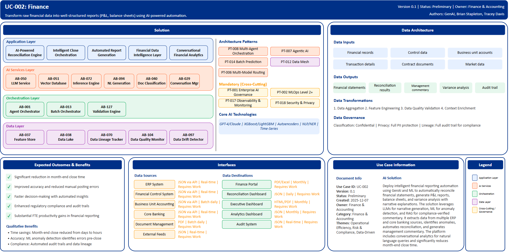

# UC-002: Finance

## Document Control

| Property | Value |
|----------|-------|
| **Use Case ID** | `UC-002` |
| **Version** | `0.1` |
| **Status** | `Preliminary` |
| **Created Date** | `2025-12-07` |
| **Last Modified** | `2025-12-07` |
| **Owner** | Finance & Accounting |
| **Author(s)** | GenAI, Brian Stapleton, Tracey Davis |
| **Product Owner** | TBD |
| **Executive Sponsor** | TBD |

## 1. Executive Summary

### 1.1 Use Case Overview

**One-Line Summary**: 
Transform raw financial data into well-structured reports (P&L, balance sheets) using AI-powered automation.

**Business Problem**:
Finance teams face extended month-end close cycles, manual data reconciliation errors, and slow report generation processes. Multiple disparate systems require manual data extraction and consolidation, leading to delayed decision-making and increased FTE costs in financial reporting. Manual variance analysis is time-consuming and inconsistent across business units.

**AI Solution**:
Deploy intelligent financial reporting automation that uses GenAI and ML to automatically reconcile financial statements, generate P&L reports, balance sheets, and variance analysis with narrative explanations. The solution leverages Large Language Models for narrative generation, machine learning for anomaly detection and account classification, and RAG architecture for compliance-verified financial commentary. It extracts and integrates data from multiple ERP and core banking sources with high accuracy, identifies anomalies through pattern recognition, automates reconciliation with confidence-based routing, and generates management commentary. The platform includes conversational analytics for natural language financial queries and significantly reduces month-end close time through intelligent orchestration.

**Expected Outcomes**:

- Significant reduction in month-end close time
- Improved accuracy and reduced manual posting errors
- Faster decision-making with automated insights
- Enhanced regulatory compliance and audit trails
- Substantial FTE productivity gains in financial reporting

### 1.2 Strategic Alignment

**Business Category**: 
Finance & Accounting

**Strategic Themes** (select all that apply):

- [ ] Customer Experience Excellence
- [x] Operational Efficiency & Automation
- [x] Risk & Compliance Excellence
- [x] Data-Driven Decision Making
- [ ] Innovation & Competitive Differentiation

**Alignment Statement**:
This use case supports BNZ's Operational Efficiency & Automation pillar by transforming manual financial processes into intelligent, automated workflows. It enables Data-Driven Decision Making through real-time financial insights and conversational analytics. The solution enhances Risk & Compliance Excellence by providing comprehensive audit trails, data lineage tracking, and automated compliance validation for regulatory reporting requirements.

## 2. Business Case

### 2.1 Business Value

**Value Type** (select all that apply):

- [ ] Revenue Growth
- [x] Cost Reduction
- [ ] Risk Reduction
- [ ] Customer Experience Improvement
- [x] Regulatory Compliance
- [x] Competitive Advantage

**Qualitative Benefits**:

| Benefit Type | Description | AI Accelerant | Evidence / Indicator |
|--------------|----------|--------|--------|
| Time savings | Month-end close cycle dramatically reduced from days to hours | Agentic AI orchestrates close workflows; ML automates reconciliation matching and variance identification | Close cycle time, reconciliation processing time, report generation time |
| Accuracy improvement | Significant reduction in manual posting errors and reconciliation exceptions | ML anomaly detection identifies errors pre-close; Auto-encoders detect complex data quality issues | Error rates, audit adjustments, first-pass accuracy metrics |
| Regulatory compliance | Enhanced compliance through automated audit trails and data lineage | Data lineage tracker captures complete end-to-end traceability; Automated validation ensures regulatory accuracy | Compliance audit findings, regulatory submission accuracy |
| Capacity reallocation | Finance team capacity shifted from manual processing to value-added analysis | AI handles routine reconciliation and report generation; GenAI automates narrative creation | Staff time allocation, analysis depth, strategic initiative contribution |
| Decision speed | Faster executive decision-making with real-time financial insights and conversational analytics | Conversational AI provides instant answers to financial queries; Continuous close enables on-demand reporting | Query response time, insights delivery speed, decision cycle time |

## 3. Target State Solution

### 3.1 Solution Overview

**AI/ML Approach**:
The solution leverages a hybrid AI architecture combining Generative AI (LLMs), traditional Machine Learning, Natural Language Processing (NLP), and Intelligent Document Processing (IDP) to transform financial reporting processes. Large Language Models (GPT-4/Claude) generate narrative commentary and variance explanations. RAG architecture combines vector databases with LLMs for compliance-verified financial narratives. Gradient Boosting models (XGBoost, LightGBM) perform anomaly detection on transactions and data quality checks. Random Forests enable automated account classification. Autoencoders detect complex patterns and anomalies through unsupervised learning. NLP/NER models extract financial obligations and key terms from contracts. Time-series models provide trend analysis and forecasting. This multi-modal approach enables automated reconciliation, intelligent variance analysis, and predictive insights.

**Solution Components**:

1. **AI-Powered Reconciliation Engine**: Multi-source data matching using ML algorithms, automated variance identification with root cause analysis, intelligent exception handling with confidence-based routing, GenAI-generated reconciliation explanations for auditors
2. **Intelligent Close Orchestration**: AI-driven task scheduling and dependency management, predictive analytics for close duration and bottleneck identification, automated status tracking and stakeholder notifications, real-time progress dashboards
3. **Automated Report Generation**: Template-driven P&L, balance sheet, and cash flow assembly, LLM-powered narrative generation for management commentary, dynamic variance analysis with natural language explanations, multi-format output generation
4. **Financial Data Intelligence Layer**: Unified data integration from ERP and core banking systems, real-time feature store for financial signals and aggregations, data quality validation and enrichment pipeline, comprehensive audit trail and lineage tracking
5. **Conversational Financial Analytics**: Natural language Q&A interface for financial queries, context-aware responses grounded in actual financial data, drill-down capabilities from summary to transaction level, executive access for high-pressure decision periods

### 3.2 Data Architecture

**Data Inputs**:

| Dataset | Description | Source | Volume | Frequency | Format | Interface Status |
|-----------|--------|-----------|--------|--------------|--------------|--------------|
| Financial records | General ledger, trial balance, account balances | ERP System | Very large | Real-time | JSON via API | Requires Work |
| Control data | Reconciliation records, control activities | Financial Control System | Large | Real-time | JSON via API | Requires Work |
| Business unit accounts | Department-level accounting data | Business Unit Accounting | Large | Batch daily | JSON via API | Requires Work |
| Transaction details | Individual financial transactions | Core Banking | Very large | Real-time | JSON via API | Requires Work |
| Contract documents | Financial obligations, revenue terms | Document Management | Large | Batch daily | PDF | Requires Work |
| Market data | Exchange rates, interest rates | External Feeds | Streaming | Real-time | JSON | Requires Work |

**Data Transformations**:
1. **Data Aggregation**: Combine data from multiple BIAN Service Domains into unified financial view across business units
2. **Feature Engineering**: Calculate derived financial features including variance indicators, trend signals, and anomaly scores for ML models
3. **Data Quality Validation**: Apply comprehensive business rules and quality checks to ensure data integrity pre-close
4. **Context Enrichment**: Add business context from reference data domains including organizational hierarchy and account metadata

**Data Outputs**:

| Dataset | Description | Destination | Volume | Frequency | Format | Interface Status |  |
|-------------|-------------|-------------|--------|-----------|-----------|-----------|-----------|
| Financial statements | P&L, balance sheets, cash flow statements | Finance Portal | Large | Monthly | PDF/Excel | Requires Work |  |
| Reconciliation results | Automated matching results and exceptions | Reconciliation Dashboard | Large | Daily | JSON | Requires Work |  |
| Management commentary | AI-generated narrative explanations | Executive Dashboard | Large | Monthly | HTML/PDF | Requires Work |  |
| Variance analysis | Detailed variance breakdowns with explanations | Analytics Dashboard | Large | Monthly | JSON | Requires Work |  |
| Audit trail | Complete lineage and decision logs | Audit System | Very large | Real-time | JSON | Requires Work |  |

**Data Quality Requirements**:

- **Accuracy**: Very high accuracy required for financial data and regulatory reporting
- **Completeness**: No missing critical financial records or account balances
- **Timeliness**: Real-time for operational transactions, batch processing for monthly close
- **Consistency**: Standardized formats across all financial data sources with unified chart of accounts

**Data Governance**:
- **Classification**: Confidential (contains business-sensitive financial data)
- **Retention**: Per regulatory requirements and BNZ data retention policy for financial records
- **Privacy**: Full PII protection where applicable in financial records, consent-based data usage
- **Lineage**: Full data lineage from source systems through AI processing to final reports for audit compliance

### 3.3 Architecture Patterns

**Primary Patterns Used**:

| Pattern ID | Pattern Name | Usage in Use Case |
|-----------|-------------|-------------------|
| [PT-008](../../../../03-building-blocks/patterns/PT-008/PT-008-Multi-Agent-Orchestration-v1.0.0.md) | Multi-Agent Orchestration | Coordinating multiple AI agents for close workflow automation |
| [PT-007](../../../../03-building-blocks/patterns/PT-007/PT-007-Agentic-AI-v1.0.0.md) | Agentic AI | Autonomous agents managing reconciliation and task scheduling |
| [PT-014](../../../../03-building-blocks/patterns/PT-014/PT-014-Batch-Prediction-v1.0.0.md) | Batch Prediction | Monthly close processing and report generation |
| [PT-012](../../../../03-building-blocks/patterns/PT-012/PT-012-Data-Mesh-v1.0.0.md) | Data Mesh | Decentralized financial data architecture across business units |
| [PT-006](../../../../03-building-blocks/patterns/PT-006/PT-006-Multi-Model-Routing-v1.0.0.md) | Multi-Model Routing | Routing between specialized models for different financial tasks |
| [PT-002](../../../../03-building-blocks/patterns/PT-002/PT-002-MLOps-Level-2-Plus-v1.0.0.md) | MLOps Level 2+ | Continuous training for anomaly detection and classification models |
| [PT-001](../../../../03-building-blocks/patterns/PT-001/PT-001-Enterprise-AI-Governance-v1.0.0.md) | Enterprise AI Governance | Model risk management for financial reporting AI |
| [PT-017](../../../../03-building-blocks/patterns/PT-017/PT-017-Observability-Monitoring-v1.0.0.md) | Observability & Monitoring | Close process monitoring and performance tracking |
| [PT-018](../../../../03-building-blocks/patterns/PT-018/PT-018-Security-Privacy-v1.0.0.md) | Security & Privacy | Financial data protection and access control |

**Architecture Building Blocks (ABBs)**:

| ABB ID | ABB Name | Purpose in Use Case | Criticality |
|--------|----------|-------------------|-------------|
| [AB-072](../../../../03-building-blocks/architecture-building-blocks/abbs/AB-072/AB-072-Inference-Engine-v1.0.0.md) | Inference Engine | ML-based variance identification and matching | Critical |
| [AB-037](../../../../03-building-blocks/architecture-building-blocks/abbs/AB-037/AB-037-Feature-Store-v1.0.0.md) | Feature Store | Financial signals and aggregations | Critical |
| [AB-127](../../../../03-building-blocks/architecture-building-blocks/abbs/AB-127/AB-127-Validation-Engine-v1.0.0.md) | Validation Engine | Automated data quality validation | Critical |
| [AB-001](../../../../03-building-blocks/architecture-building-blocks/abbs/AB-001/AB-001-Agent-Orchestrator-v1.0.0.md) | Agent Orchestrator | AI-driven task scheduling and dependency management | Critical |
| [AB-013](../../../../03-building-blocks/architecture-building-blocks/abbs/AB-013/AB-013-Batch-Orchestrator-v1.0.0.md) | Batch Orchestrator | Close process workflow automation | High |
| [AB-097](../../../../03-building-blocks/architecture-building-blocks/abbs/AB-097/AB-097-Data-Drift-Detector-v1.0.0.md) | Data Drift Detector | Predictive bottleneck identification | High |
| [AB-050](../../../../03-building-blocks/architecture-building-blocks/abbs/AB-050/AB-050-Large-Language-Model-Service-v1.0.0.md) | Large Language Model Service | Narrative generation for management commentary | Critical |
| [AB-094](../../../../03-building-blocks/architecture-building-blocks/abbs/AB-094/AB-094-Natural-Language-Generation-v1.0.0.md) | Natural Language Generation | Variance analysis explanations | High |
| [AB-040](../../../../03-building-blocks/architecture-building-blocks/abbs/AB-040/AB-040-Document-Classification-Engine-v1.0.0.md) | Document Classification Engine | Multi-format output generation | High |
| [AB-038](../../../../03-building-blocks/architecture-building-blocks/abbs/AB-038/AB-038-Data-Lake-v1.0.0.md) | Data Lake | Unified data integration | Critical |
| [AB-070](../../../../03-building-blocks/architecture-building-blocks/abbs/AB-070/AB-070-Data-Lineage-Tracker-v1.0.0.md) | Data Lineage Tracker | Audit trail and lineage tracking | Critical |
| [AB-104](../../../../03-building-blocks/architecture-building-blocks/abbs/AB-104/AB-104-Data-Quality-Monitor-v1.0.0.md) | Data Quality Monitor | Data quality validation pipeline | High |
| [AB-029](../../../../03-building-blocks/architecture-building-blocks/abbs/AB-029/AB-029-Conversation-State-Manager-v1.0.0.md) | Conversation State Manager | Multi-turn Q&A context | High |
| [AB-051](../../../../03-building-blocks/architecture-building-blocks/abbs/AB-051/AB-051-Vector-Database-v1.0.0.md) | Vector Database | Financial knowledge retrieval | Critical |

## 4. Prioritization Scoring

TBD - Prioritization scoring to be completed during portfolio planning.

## 5. Risk Management

TBD - Risk assessment to be completed during detailed planning phase.

## 6. Success Metrics & KPIs

Track business and technical KPIs (details TBD).
