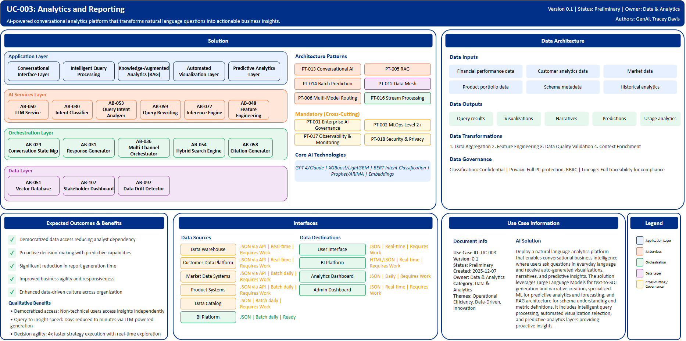

# UC-003: Analytics and Reporting

## Document Control

| Property | Value |
|----------|-------|
| **Use Case ID** | `UC-003` |
| **Version** | `0.1` |
| **Status** | `Preliminary` |
| **Created Date** | `2025-12-07` |
| **Last Modified** | `2025-12-07` |
| **Owner** | Data & Analytics |
| **Author(s)** | GenAI, Tracey Davis |
| **Product Owner** | TBD |
| **Executive Sponsor** | TBD |

## 1. Executive Summary

### 1.1 Use Case Overview

**One-Line Summary**: 
AI-powered conversational analytics platform that transforms natural language questions into actionable business insights with automated visualizations.

**Business Problem**:
Business users across BNZ struggle with traditional BI tools that require technical expertise in SQL, data modeling, and visualization design. Generating insights from data currently requires analyst intervention, creating bottlenecks and delays. Report generation takes significant time, limiting agility in decision-making. This technical barrier prevents democratized data access and reduces organizational data-driven culture, with business users dependent on analysts for routine queries.

**AI Solution**:
Deploy a natural language analytics platform that enables conversational business intelligence where users ask questions in everyday language and receive auto-generated visualizations, narratives, and predictive insights. The solution leverages Large Language Models for text-to-SQL generation and narrative creation, specialized ML for predictive analytics and forecasting, and RAG architecture for schema understanding and metric definitions. It integrates chat-style AI assistants directly into analytics platforms for back-and-forth dialogue with data, eliminating technical requirements. The platform includes intelligent query processing that interprets analytical intent, automated visualization selection based on data characteristics, and predictive analytics layers providing proactive insights. Multi-turn conversations maintain context across queries, while citation generators ensure transparency in data sources.

**Expected Outcomes**:

- Democratized data access reducing analyst dependency
- Proactive decision-making with predictive capabilities
- Significant reduction in report generation time
- Improved business agility and responsiveness
- Enhanced data-driven culture across organization

### 1.2 Strategic Alignment

**Business Category**: 
Data & Analytics

**Strategic Themes** (select all that apply):

- [ ] Customer Experience Excellence
- [x] Operational Efficiency & Automation
- [ ] Risk & Compliance Excellence
- [x] Data-Driven Decision Making
- [x] Innovation & Competitive Differentiation

**Alignment Statement**:
This use case directly supports BNZ's Data-Driven Decision Making pillar by democratizing access to enterprise data through conversational interfaces. It drives Operational Efficiency & Automation by eliminating analyst bottlenecks and reducing query-to-insight time dramatically. The solution demonstrates Innovation & Competitive Differentiation by positioning BNZ at the forefront of generative AI-powered business intelligence, enabling business users to interact with data naturally without technical barriers.

## 2. Business Case

### 2.1 Business Value

**Value Type** (select all that apply):

- [ ] Revenue Growth
- [x] Cost Reduction
- [ ] Risk Reduction
- [ ] Customer Experience Improvement
- [ ] Regulatory Compliance
- [x] Competitive Advantage

**Qualitative Benefits**:

| Benefit Type | Description | AI Accelerant | Evidence / Indicator |
|--------------|----------|--------|--------|
| Democratized data access | Non-technical users access insights independently without SQL knowledge or analyst support | GenAI text-to-SQL translates natural language to queries; RAG retrieves schema context automatically | Self-service adoption rate, analyst request volume reduction |
| Query-to-insight speed | Dramatic reduction in time from question to actionable insight | LLM-powered query generation and narrative creation; automated visualization selection | Query response time, report generation speed |
| Analyst productivity | Analysts focus on complex analysis rather than routine query requests | Conversational AI handles routine queries autonomously; automated dashboard generation | Analyst time allocation, high-value project contribution |
| Predictive capabilities | Proactive insights identifying trends and anomalies before manual discovery | ML forecasting models, time-series analysis, anomaly detection algorithms | Prediction accuracy, early problem detection rate |
| Decision agility | Faster strategy execution with real-time data exploration | Streaming analytics, event-driven dashboard updates, instant drill-down capabilities | Decision cycle time, strategic initiative velocity |

## 3. Target State Solution

### 3.1 Solution Overview

**AI/ML Approach**:
The solution leverages a hybrid AI approach combining Generative AI for natural language understanding and response generation, traditional ML for predictive analytics, and specialized NLP techniques for query interpretation. Large Language Models (GPT-4, Claude) enable natural language query interpretation and text-to-SQL generation, translating business questions into optimized database queries automatically. Text-to-SQL generation creates queries from conversational input without technical expertise. XGBoost and LightGBM provide predictive analytics including forecasting, trend analysis, and anomaly detection. BERT-based classifiers perform intent classification to understand analytical intent such as comparison, trend analysis, or ranking. Embedding models enable semantic search for finding relevant data products and schemas. Time-series models (Prophet, ARIMA) automate prediction of business metrics. The platform implements RAG pattern for knowledge-augmented analytics, vector databases for schema embeddings, and conversational state management for multi-turn dialogues.

**Solution Components**:

1. **Conversational Interface Layer**: Natural language query interface with multi-turn conversation support, conversation state manager maintaining context across dialogue sessions, response generator creating human-readable narratives, multi-channel orchestrator delivering analytics across platforms
2. **Intelligent Query Processing**: Query intent analyzer determining analytical intent (comparison, trend, ranking, distribution), text-to-SQL engine generating optimized SQL automatically, query rewriting engine reformulating ambiguous queries, automatic join resolution and temporal understanding
3. **Knowledge-Augmented Analytics (RAG)**: Vector database storing embeddings of data schemas and metric definitions, hybrid search engine combining semantic and keyword retrieval, document processing pipeline indexing business glossaries, citation generator providing source attribution
4. **Automated Visualization Layer**: AI-driven chart type selection based on data characteristics and intent, dynamic dashboard assembly based on user role and context, interactive drill-down with automated hierarchical navigation, responsive design adapting to device
5. **Predictive Analytics Layer**: ML training pipeline for automated forecasting and predictive models, feature engineering pipeline deriving analytical features, anomaly detection using isolation forests, what-if analysis for scenario planning

### 3.2 Data Architecture

**Data Inputs**:

| Dataset | Description | Source | Volume | Frequency | Format | Interface Status |
|-----------|--------|-----------|--------|--------------|--------------|--------------|
| Financial performance data | Business unit financials, P&L, metrics | Data Warehouse | Very large | Real-time | JSON via API | Requires Work |
| Customer analytics data | Customer portfolio, behavior, segmentation | Customer Data Platform | Very large | Real-time | JSON via API | Requires Work |
| Market data | Market analysis, trends, benchmarks | Market Data Systems | Large | Batch daily | JSON via API | Requires Work |
| Product portfolio data | Product performance, adoption, metrics | Product Systems | Large | Batch daily | JSON via API | Requires Work |
| Schema metadata | Table definitions, metric calculations, glossary | Data Catalog | Large | Batch daily | JSON | Requires Work |
| Historical analytics | Past reports, queries, usage patterns | BI Platform | Very large | Batch daily | JSON | Ready |

**Data Transformations**:
1. **Data Aggregation**: Combine data from multiple BIAN Service Domains into unified analytical view across dimensions
2. **Feature Engineering**: Calculate derived analytical features including KPIs, metrics, trends for ML model consumption
3. **Data Quality Validation**: Apply comprehensive business rules and quality checks to ensure analytical accuracy
4. **Context Enrichment**: Add business context from reference data including organizational hierarchy and business glossaries

**Data Outputs**:

| Dataset | Description | Destination | Volume | Frequency | Format | Interface Status |  |
|-------------|-------------|-------------|--------|-----------|-----------|-----------|-----------|
| Query results | Natural language query responses with data | User Interface | Large | Real-time | JSON | Requires Work |  |
| Visualizations | Auto-generated charts, dashboards, reports | BI Platform | Large | Real-time | HTML/JSON | Requires Work |  |
| Narratives | AI-generated insights and explanations | User Interface | Large | Real-time | Text/HTML | Requires Work |  |
| Predictions | Forecasts, trends, anomaly alerts | Analytics Dashboard | Large | Daily | JSON | Requires Work |  |
| Usage analytics | Query patterns, user behavior, system performance | Admin Dashboard | Large | Real-time | JSON | Requires Work |  |

**Data Quality Requirements**:

- **Accuracy**: Very high accuracy required for business analytics and predictive models
- **Completeness**: No missing critical business metrics or dimensional attributes
- **Timeliness**: Real-time for operational queries, batch processing for complex analytics
- **Consistency**: Standardized formats across all data sources with unified semantic layer

**Data Governance**:
- **Classification**: Confidential (contains business-sensitive analytical data)
- **Retention**: Per regulatory requirements and BNZ data retention policy for analytical outputs
- **Privacy**: Full PII protection in query results, consent-based data usage, role-based access control
- **Lineage**: Full data lineage from source systems through transformations to insights for traceability

### 3.3 Architecture Patterns

**Primary Patterns Used**:

| Pattern ID | Pattern Name | Usage in Use Case |
|-----------|-------------|-------------------|
| [PT-013](../../../../03-building-blocks/patterns/PT-013/PT-013-Conversational-AI-v1.0.0.md) | Conversational AI | Natural language interface for data queries and multi-turn dialogue |
| [PT-005](../../../../03-building-blocks/patterns/PT-005/PT-005-Retrieval-Augmented-Generation-v1.0.0.md) | Retrieval-Augmented Generation | Schema understanding and metric definition retrieval |
| [PT-014](../../../../03-building-blocks/patterns/PT-014/PT-014-Batch-Prediction-v1.0.0.md) | Batch Prediction | Predictive analytics and forecasting models |
| [PT-012](../../../../03-building-blocks/patterns/PT-012/PT-012-Data-Mesh-v1.0.0.md) | Data Mesh | Decentralized data product architecture |
| [PT-006](../../../../03-building-blocks/patterns/PT-006/PT-006-Multi-Model-Routing-v1.0.0.md) | Multi-Model Routing | Routing between specialized LLMs and ML models |
| [PT-016](../../../../03-building-blocks/patterns/PT-016/PT-016-Stream-Processing-v1.0.0.md) | Stream Processing | Real-time dashboard updates and streaming analytics |
| [PT-001](../../../../03-building-blocks/patterns/PT-001/PT-001-Enterprise-AI-Governance-v1.0.0.md) | Enterprise AI Governance | Governance for analytics AI models |
| [PT-002](../../../../03-building-blocks/patterns/PT-002/PT-002-MLOps-Level-2-Plus-v1.0.0.md) | MLOps Level 2+ | Continuous training for predictive models |
| [PT-017](../../../../03-building-blocks/patterns/PT-017/PT-017-Observability-Monitoring-v1.0.0.md) | Observability & Monitoring | Platform performance and query monitoring |
| [PT-018](../../../../03-building-blocks/patterns/PT-018/PT-018-Security-Privacy-v1.0.0.md) | Security & Privacy | Data access control and privacy protection |

**Architecture Building Blocks (ABBs)**:

| ABB ID | ABB Name | Purpose in Use Case | Criticality |
|--------|----------|-------------------|-------------|
| [AB-029](../../../../03-building-blocks/architecture-building-blocks/abbs/AB-029/AB-029-Conversation-State-Manager-v1.0.0.md) | Conversation State Manager | Multi-turn dialogue context management | Critical |
| [AB-030](../../../../03-building-blocks/architecture-building-blocks/abbs/AB-030/AB-030-Intent-Classifier-v1.0.0.md) | Intent Classifier | Analytical intent understanding | Critical |
| [AB-031](../../../../03-building-blocks/architecture-building-blocks/abbs/AB-031/AB-031-Response-Generator-v1.0.0.md) | Response Generator | Human-readable narrative generation | Critical |
| [AB-036](../../../../03-building-blocks/architecture-building-blocks/abbs/AB-036/AB-036-Multi-Channel-Orchestrator-v1.0.0.md) | Multi-Channel Orchestrator | Cross-platform delivery | High |
| [AB-053](../../../../03-building-blocks/architecture-building-blocks/abbs/AB-053/AB-053-Query-Intent-Analyzer-v1.0.0.md) | Query Intent Analyzer | Analytical intent determination | Critical |
| [AB-059](../../../../03-building-blocks/architecture-building-blocks/abbs/AB-059/AB-059-Query-Rewriting-Engine-v1.0.0.md) | Query Rewriting Engine | Ambiguous query reformulation | High |
| [AB-050](../../../../03-building-blocks/architecture-building-blocks/abbs/AB-050/AB-050-Large-Language-Model-Service-v1.0.0.md) | Large Language Model Service | Text-to-SQL generation and narrative creation | Critical |
| [AB-051](../../../../03-building-blocks/architecture-building-blocks/abbs/AB-051/AB-051-Vector-Database-v1.0.0.md) | Vector Database | Schema and metric embeddings | Critical |
| [AB-054](../../../../03-building-blocks/architecture-building-blocks/abbs/AB-054/AB-054-Hybrid-Search-Engine-v1.0.0.md) | Hybrid Search Engine | Combined semantic and keyword retrieval | High |
| [AB-058](../../../../03-building-blocks/architecture-building-blocks/abbs/AB-058/AB-058-Citation-Generator-v1.0.0.md) | Citation Generator | Source attribution for insights | High |
| [AB-107](../../../../03-building-blocks/architecture-building-blocks/abbs/AB-107/AB-107-Stakeholder-Dashboard-v1.0.0.md) | Stakeholder Dashboard | Dynamic dashboard assembly | High |
| [AB-072](../../../../03-building-blocks/architecture-building-blocks/abbs/AB-072/AB-072-Inference-Engine-v1.0.0.md) | Inference Engine | Forecasting and prediction models | Critical |
| [AB-048](../../../../03-building-blocks/architecture-building-blocks/abbs/AB-048/AB-048-Feature-Engineering-Pipeline-v1.0.0.md) | Feature Engineering Pipeline | Analytical feature derivation | High |
| [AB-097](../../../../03-building-blocks/architecture-building-blocks/abbs/AB-097/AB-097-Data-Drift-Detector-v1.0.0.md) | Data Drift Detector | Anomaly and pattern detection | High |

## 4. Prioritization Scoring

TBD - Prioritization scoring to be completed during portfolio planning.

## 5. Risk Management

TBD - Risk assessment to be completed during detailed planning phase.

## 6. Success Metrics & KPIs

Track business and technical KPIs (details TBD).
