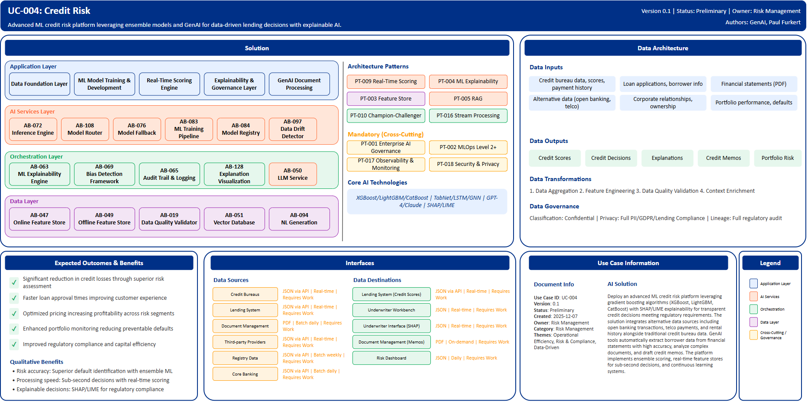

# UC-004: Credit Risk

## Document Control

| Property | Value |
|----------|-------|
| **Use Case ID** | `UC-004` |
| **Version** | `0.1` |
| **Status** | `Preliminary` |
| **Created Date** | `2025-12-07` |
| **Last Modified** | `2025-12-07` |
| **Owner** | Risk Management |
| **Author(s)** | GenAI, Paul Furkert |
| **Product Owner** | TBD |
| **Executive Sponsor** | TBD |

## 1. Executive Summary

### 1.1 Use Case Overview

**One-Line Summary**: 
Advanced ML credit risk platform leveraging ensemble models and GenAI for data-driven lending decisions with explainable AI.

**Business Problem**:
Traditional credit risk assessment relies heavily on historical credit scores and limited data sources, resulting in credit losses that could be prevented with better risk assessment capabilities. Manual processing of loan applications creates extended approval times that negatively impact customer experience and competitive positioning. Pricing optimization is limited by rule-based approaches that don't capture nuanced risk profiles. Portfolio monitoring lacks proactive early warning systems to identify deteriorating credit before defaults occur. Regulatory compliance and capital efficiency requirements demand transparent, explainable decision-making processes that traditional models struggle to provide.

**AI Solution**:
Deploy an advanced ML credit risk platform leveraging gradient boosting algorithms (XGBoost, LightGBM, CatBoost) with SHAP/LIME explainability for transparent credit decisions meeting regulatory requirements. The solution integrates alternative data sources including open banking transactions, telco payments, and rental history alongside traditional credit bureau data to improve risk assessment accuracy. GenAI tools automatically extract borrower data from financial statements with high accuracy, analyze complex documents, and draft credit memos with significant underwriter time savings. The platform implements ensemble scoring combining multiple specialized models, real-time feature stores for sub-second decisions, and continuous learning systems that adapt to emerging patterns. Graph Neural Networks detect fraud rings and relationship networks. The solution achieves substantially improved identification of potential defaults compared to traditional approaches while maintaining full audit trails for regulatory compliance.

**Expected Outcomes**:

- Significant reduction in credit losses through superior risk assessment
- Faster loan approval times improving customer experience
- Optimized pricing increasing profitability across risk segments
- Enhanced portfolio monitoring reducing preventable defaults
- Improved regulatory compliance and capital efficiency

### 1.2 Strategic Alignment

**Business Category**: 
Risk Management

**Strategic Themes** (select all that apply):

- [ ] Customer Experience Excellence
- [x] Operational Efficiency & Automation
- [x] Risk & Compliance Excellence
- [x] Data-Driven Decision Making
- [ ] Innovation & Competitive Differentiation

**Alignment Statement**:
This use case directly supports BNZ's Risk & Compliance Excellence pillar by deploying advanced AI/ML capabilities for superior credit risk assessment and management. It enables Data-Driven Decision Making through alternative data integration and predictive analytics that identify risks traditional models miss. The solution drives Operational Efficiency & Automation through automated document processing, straight-through application processing, and underwriter productivity improvements while maintaining comprehensive audit trails and regulatory compliance.

## 2. Business Case

### 2.1 Business Value

**Value Type** (select all that apply):

- [ ] Revenue Growth
- [x] Cost Reduction
- [x] Risk Reduction
- [x] Customer Experience Improvement
- [x] Regulatory Compliance
- [ ] Competitive Advantage

**Qualitative Benefits**:

| Benefit Type | Description | AI Accelerant | Evidence / Indicator |
|--------------|----------|--------|--------|
| Risk assessment accuracy | Superior identification of potential defaults and credit deterioration | Ensemble ML models (XGBoost, LightGBM, CatBoost) with alternative data; Graph Neural Networks for relationship analysis | Credit loss rates, bad debt identification accuracy, model AUC-ROC |
| Processing speed | Dramatic reduction in loan application processing time enabling competitive customer experience | Real-time scoring engine with sub-second inference; automated document extraction via GenAI | Application processing time, straight-through processing rate |
| Underwriter productivity | Significant time savings through automated data extraction and credit memo generation | GenAI financial statement analysis; automated credit memo drafting with regulatory-compliant language | Underwriter time per application, manual data entry reduction |
| Explainable decisions | Transparent credit decisions with feature attribution meeting regulatory requirements | SHAP/LIME explainability providing real-time feature contributions; counterfactual explanations for adverse actions | Regulatory audit compliance, adverse action notice quality |
| Portfolio monitoring | Proactive identification of deteriorating credit quality before defaults occur | Continuous learning models adapting to emerging patterns; drift detection triggering alerts | Early warning accuracy, preventable default reduction |

## 3. Target State Solution

### 3.1 Solution Overview

**AI/ML Approach**:
The platform employs a hybrid AI architecture combining gradient boosting frameworks (XGBoost, LightGBM, CatBoost) as primary production models optimized for tabular credit data. Deep learning approaches including TabNet for complex pattern recognition, LSTM networks for time-series payment behavior, and Graph Neural Networks for fraud ring detection and corporate relationship mapping. Generative AI capabilities using GPT-4 and Claude provide document intelligence, extracting structured data from financial statements with high accuracy and generating credit memos. Retrieval-Augmented Generation (RAG) systems offer policy guidance and historical case retrieval for underwriter decision support. The feature store architecture provides dual-mode serving with online features delivered in sub-millisecond latency for real-time scoring and offline features for batch training. Ensemble scoring combines risk signals from multiple specialized models. SHAP and LIME provide real-time explainability with TreeSHAP for gradient boosting models and Deep SHAP for neural networks. AutoML pipelines enable rapid prototyping. The solution implements continuous learning with automated drift detection and retraining triggers.

**Solution Components**:

1. **Data Foundation Layer**: Feature store with dual-mode serving (online sub-millisecond latency for real-time scoring, offline for batch training), alternative data integration from open banking and telco sources, data quality validation with automated cleansing, point-in-time feature correctness
2. **ML Model Training & Development Layer**: Distributed training using GPU-accelerated clusters, AutoML pipelines for rapid prototyping and hyperparameter optimization, synthetic data generation for privacy-preserving training, continuous training with automated drift detection
3. **Real-Time Scoring Engine**: Sub-second latency for credit decisions, horizontal autoscaling, multi-model ensemble combining risk signals from multiple specialized models, fallback mechanisms with circuit breakers
4. **Explainability & Governance Layer**: Real-time SHAP value computation, counterfactual explanations providing actionable guidance, model cards and comprehensive audit trails for regulatory compliance, bias detection across demographics
5. **GenAI Document Processing Layer**: Vision Language Models for financial statement analysis, RAG pipeline with credit policy knowledge base, automated credit memo generation with full audit trail, natural language query interface for underwriter assistance

### 3.2 Data Architecture

**Data Inputs**:

| Dataset | Description | Source | Volume | Frequency | Format | Interface Status |
|-----------|--------|-----------|--------|--------------|--------------|--------------|
| Credit bureau data | Credit scores, payment history, inquiries | Credit Bureaus | Very large | Real-time | JSON via API | Requires Work |
| Loan applications | Application details, borrower information | Lending System | Large | Real-time | JSON via API | Requires Work |
| Financial statements | Income statements, balance sheets, cash flow | Document Management | Large | Batch daily | PDF | Requires Work |
| Alternative data | Open banking transactions, telco payments | Third-party Providers | Very large | Real-time | JSON via API | Requires Work |
| Corporate relationships | Ownership structures, beneficial owners | Registry Data | Large | Batch weekly | JSON via API | Requires Work |
| Portfolio performance | Loan performance, defaults, recoveries | Core Banking | Very large | Batch daily | JSON via API | Requires Work |

**Data Transformations**:
1. **Data Aggregation**: Combine traditional credit data with alternative data sources into unified borrower profiles
2. **Feature Engineering**: Calculate risk features including payment behavior patterns, cash flow analysis, relationship network metrics
3. **Data Quality Validation**: Apply comprehensive validation rules ensuring accuracy and completeness for credit decisions
4. **Context Enrichment**: Add industry context, economic indicators, and geographic risk factors to borrower profiles

**Data Outputs**:

| Dataset | Description | Destination | Volume | Frequency | Format | Interface Status |  |
|-------------|-------------|-------------|--------|-----------|-----------|-----------|-----------|
| Credit scores | ML-generated risk scores with confidence intervals | Lending System | Large | Real-time | JSON via API | Requires Work |  |
| Credit decisions | Approval/decline recommendations with reasoning | Underwriter Workbench | Large | Real-time | JSON | Requires Work |  |
| Explanations | SHAP values and counterfactual explanations | Underwriter Interface | Large | Real-time | JSON | Requires Work |  |
| Credit memos | Auto-generated credit memos with supporting analysis | Document Management | Large | On-demand | PDF | Requires Work |  |
| Portfolio risk metrics | Aggregated risk metrics and early warnings | Risk Dashboard | Large | Daily | JSON | Requires Work |  |

**Data Quality Requirements**:

- **Accuracy**: Very high accuracy required for credit data and alternative data sources
- **Completeness**: No missing critical borrower information or financial metrics
- **Timeliness**: Real-time for credit scoring, batch processing for portfolio analytics
- **Consistency**: Standardized formats across all data sources with unified data schema

**Data Governance**:
- **Classification**: Confidential (contains sensitive borrower financial and personal data)
- **Retention**: Per regulatory requirements for credit data and lending compliance
- **Privacy**: Full PII protection, consent-based alternative data usage, GDPR and lending compliance
- **Lineage**: Full data lineage from sources through models to credit decisions for regulatory audit

### 3.3 Architecture Patterns

**Primary Patterns Used**:

| Pattern ID | Pattern Name | Usage in Use Case |
|-----------|-------------|-------------------|
| [PT-009](../../../../03-building-blocks/patterns/PT-009/PT-009-Real-Time-Scoring-v1.0.0.md) | Real-Time Scoring | Sub-second credit decision inference |
| [PT-004](../../../../03-building-blocks/patterns/PT-004/PT-004-Explainability-v1.0.0.md) | ML Explainability | SHAP/LIME explanations for regulatory compliance |
| [PT-003](../../../../03-building-blocks/patterns/PT-003/PT-003-Feature-Store-v1.0.0.md) | Feature Store | Dual-mode feature serving for real-time and batch |
| [PT-005](../../../../03-building-blocks/patterns/PT-005/PT-005-Retrieval-Augmented-Generation-v1.0.0.md) | Retrieval-Augmented Generation | Credit policy Q&A and document analysis |
| [PT-010](../../../../03-building-blocks/patterns/PT-010/PT-010-Champion-Challenger-v1.0.0.md) | Champion-Challenger | Model performance testing and gradual rollout |
| [PT-016](../../../../03-building-blocks/patterns/PT-016/PT-016-Stream-Processing-v1.0.0.md) | Stream Processing | Real-time portfolio monitoring and drift detection |
| [PT-002](../../../../03-building-blocks/patterns/PT-002/PT-002-MLOps-Level-2-Plus-v1.0.0.md) | MLOps Level 2+ | Continuous training and automated retraining |
| [PT-001](../../../../03-building-blocks/patterns/PT-001/PT-001-Enterprise-AI-Governance-v1.0.0.md) | Enterprise AI Governance | Model risk management and regulatory compliance |

**Architecture Building Blocks (ABBs)**:

| ABB ID | ABB Name | Purpose in Use Case | Criticality |
|--------|----------|-------------------|-------------|
| [AB-047](../../../../03-building-blocks/architecture-building-blocks/abbs/AB-047/AB-047-Online-Feature-Store-v1.0.0.md) | Online Feature Store | Sub-millisecond real-time feature serving | Critical |
| [AB-049](../../../../03-building-blocks/architecture-building-blocks/abbs/AB-049/AB-049-Offline-Feature-Store-v1.0.0.md) | Offline Feature Store | Batch training and backtesting | Critical |
| [AB-019](../../../../03-building-blocks/architecture-building-blocks/abbs/AB-019/AB-019-Data-Quality-Validator-v1.0.0.md) | Data Quality Validator | Automated data cleansing pipelines | Critical |
| [AB-083](../../../../03-building-blocks/architecture-building-blocks/abbs/AB-083/AB-083-ML-Training-Pipeline-v1.0.0.md) | ML Training Pipeline | Distributed GPU-accelerated training | Critical |
| [AB-084](../../../../03-building-blocks/architecture-building-blocks/abbs/AB-084/AB-084-Model-Registry-v1.0.0.md) | Model Registry | Model versioning and experiment tracking | High |
| [AB-097](../../../../03-building-blocks/architecture-building-blocks/abbs/AB-097/AB-097-Data-Drift-Detector-v1.0.0.md) | Data Drift Detector | Automated drift detection and retraining triggers | Critical |
| [AB-072](../../../../03-building-blocks/architecture-building-blocks/abbs/AB-072/AB-072-Inference-Engine-v1.0.0.md) | Inference Engine | Sub-second credit scoring decisions | Critical |
| [AB-108](../../../../03-building-blocks/architecture-building-blocks/abbs/AB-108/AB-108-Model-Router-v1.0.0.md) | Model Router | Multi-model ensemble routing | High |
| [AB-076](../../../../03-building-blocks/architecture-building-blocks/abbs/AB-076/AB-076-Model-Fallback-Logic-v1.0.0.md) | Model Fallback Logic | Circuit breaker resilience | High |
| [AB-063](../../../../03-building-blocks/architecture-building-blocks/abbs/AB-063/AB-063-ML-Model-Explainability-Engine-v1.0.0.md) | ML Model Explainability Engine | SHAP/LIME real-time explanations | Critical |
| [AB-128](../../../../03-building-blocks/architecture-building-blocks/abbs/AB-128/AB-128-Explanation-Visualization-Layer-v1.0.0.md) | Explanation Visualization Layer | Counterfactual explanations | High |
| [AB-069](../../../../03-building-blocks/architecture-building-blocks/abbs/AB-069/AB-069-Bias-Detection-Framework-v1.0.0.md) | Bias Detection Framework | Fairness testing across demographics | Critical |
| [AB-065](../../../../03-building-blocks/architecture-building-blocks/abbs/AB-065/AB-065-Audit-Trail-and-Logging-v1.0.0.md) | Audit Trail & Logging | Regulatory compliance audit trails | Critical |
| [AB-050](../../../../03-building-blocks/architecture-building-blocks/abbs/AB-050/AB-050-Large-Language-Model-Service-v1.0.0.md) | Large Language Model Service | Financial statement analysis | Critical |
| [AB-051](../../../../03-building-blocks/architecture-building-blocks/abbs/AB-051/AB-051-Vector-Database-v1.0.0.md) | Vector Database | Credit policy knowledge base | High |
| [AB-094](../../../../03-building-blocks/architecture-building-blocks/abbs/AB-094/AB-094-Natural-Language-Generation-v1.0.0.md) | Natural Language Generation | Automated credit memo generation | High |

## 4. Prioritization Scoring

TBD - Prioritization scoring to be completed during portfolio planning.

## 5. Risk Management

TBD - Risk assessment to be completed during detailed planning phase.

## 6. Success Metrics & KPIs

Track business and technical KPIs (details TBD).
