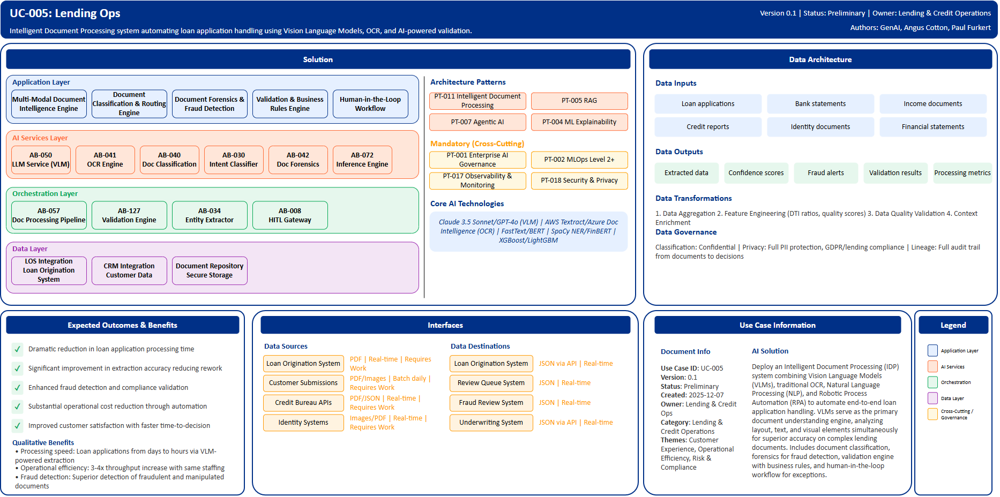

# UC-005: Lending Ops

## Document Control

| Property | Value |
|----------|-------|
| **Use Case ID** | `UC-005` |
| **Version** | `0.1` |
| **Status** | `Preliminary` |
| **Created Date** | `2025-12-07` |
| **Last Modified** | `2025-12-07` |
| **Owner** | Lending & Credit Operations |
| **Author(s)** | GenAI, Angus Cotton, Paul Furkert |
| **Product Owner** | TBD |
| **Executive Sponsor** | TBD |

## 1. Executive Summary

### 1.1 Use Case Overview

**One-Line Summary**: 
Intelligent Document Processing system automating loan application handling using Vision Language Models, OCR, and AI-powered validation.

**Business Problem**:
Loan application processing at BNZ is heavily manual with staff spending substantial time extracting data from applications, bank statements, credit reports, and income verification documents. This manual processing creates extended application approval times that negatively impact customer satisfaction and competitive positioning. Human data entry errors cause rework and processing delays. Document fraud detection is inconsistent across manual reviewers. Operational costs are high due to labor-intensive processing requirements. The volume of applications that can be handled is constrained by available staffing.

**AI Solution**:
Deploy an Intelligent Document Processing (IDP) system combining Vision Language Models (VLMs), traditional OCR, Natural Language Processing (NLP), and Robotic Process Automation (RPA) to automate end-to-end loan application handling. The solution leverages VLMs as the primary document understanding engine, analyzing layout, text, and visual elements simultaneously for superior accuracy on complex lending documents. Multi-modal document intelligence processes text, tables, and images in parallel. Document classification automatically routes to appropriate extraction pipelines. Document forensics detects digital manipulation, font inconsistencies, and forged documents. Validation engine applies business rules, cross-document consistency checks, and confidence-based routing. Human-in-the-loop workflow handles exceptions with progressive disclosure UI. The platform achieves very high extraction accuracy, dramatically reduces processing time, enables substantially more applications with the same staff, cuts operational costs, and improves fraud detection capabilities.

**Expected Outcomes**:

- Dramatic reduction in loan application processing time
- Significant improvement in extraction accuracy reducing rework
- Enhanced fraud detection and compliance validation
- Substantial operational cost reduction through automation
- Improved customer satisfaction with faster time-to-decision

### 1.2 Strategic Alignment

**Business Category**: 
Lending & Credit Operations

**Strategic Themes** (select all that apply):

- [x] Customer Experience Excellence
- [x] Operational Efficiency & Automation
- [x] Risk & Compliance Excellence
- [ ] Data-Driven Decision Making
- [ ] Innovation & Competitive Differentiation

**Alignment Statement**:
This use case supports BNZ's Customer Experience Excellence pillar by dramatically reducing application processing times and improving time-to-decision for borrowers. It drives Operational Efficiency & Automation through intelligent document processing that eliminates manual data entry and substantially increases processing capacity. The solution enhances Risk & Compliance Excellence through automated fraud detection, document forensics, and comprehensive validation ensuring regulatory compliance with full audit trails.

## 2. Business Case

### 2.1 Business Value

**Value Type** (select all that apply):

- [ ] Revenue Growth
- [x] Cost Reduction
- [x] Risk Reduction
- [x] Customer Experience Improvement
- [x] Regulatory Compliance
- [ ] Competitive Advantage

**Qualitative Benefits**:

| Benefit Type | Description | AI Accelerant | Evidence / Indicator |
|--------------|----------|--------|--------|
| Processing speed | Loan application processing time dramatically reduced from days to hours | VLM-powered extraction processing complex documents rapidly; straight-through processing for high-confidence cases | Application processing time, straight-through processing rate |
| Operational efficiency | Substantial throughput increase with same staffing enabling capacity growth | Multi-modal document intelligence eliminating manual data entry; automated classification and routing | Throughput per FTE, manual data entry reduction, operational cost |
| Accuracy improvement | Extraction accuracy improvement over manual entry reducing rework | VLMs analyzing layout, text, and visual elements simultaneously; ensemble OCR for optimal results | Extraction accuracy, rework rate, customer complaints |
| Fraud detection | Superior detection of fraudulent and manipulated documents | Document forensics analyzing pixel-level manipulation artifacts; font matching and metadata forensics | Fraud detection rate, false positive reduction |
| Customer experience | Faster time-to-decision reducing application abandonment | Real-time mobile quality feedback; rapid document processing; automated status updates | Application abandonment rate, customer satisfaction, time-to-decision |

## 3. Target State Solution

### 3.1 Solution Overview

**AI/ML Approach**:
The solution employs a multi-modal AI architecture combining Vision Language Models (VLMs) including Claude 3.5 Sonnet and GPT-4o as the primary document understanding engines, analyzing layout, text, and visual elements simultaneously for superior accuracy on complex lending documents. Traditional OCR services (AWS Textract, Azure Document Intelligence) provide managed table extraction with high accuracy. FastText and BERT-based classifiers perform document classification routing to appropriate extraction pipelines across multiple document types. NLP entity extraction using SpaCy NER and domain-specific FinBERT models identify financial entities, amounts, and obligations. Document forensics ML models detect digital manipulation artifacts, font inconsistencies, and forged documents through pixel-level analysis. XGBoost and LightGBM models provide validation scoring with confidence-based routing. The platform implements ensemble OCR approach with intelligent routing based on document complexity and quality. Human-in-the-loop workflow provides progressive disclosure UI for exception handling. Continuous feedback loops enable model improvement.

**Solution Components**:

1. **Multi-Modal Document Intelligence Engine**: VLM-powered extraction processing text, tables, and visual elements simultaneously, ensemble OCR approach with AWS Textract/Azure Document Intelligence and Tesseract fallback, intelligent routing based on document complexity and quality, high accuracy processing
2. **Document Classification & Routing Engine**: FastText/Logistic Regression for structured documents with low latency, BERT-based classifiers for complex financial documents, automatic routing to appropriate extraction pipelines, support for multiple document types including applications and financial statements
3. **Document Forensics & Fraud Detection**: Pixel-level analysis for digital manipulation artifacts, font matching and template consistency validation, metadata forensics with EXIF data and MRZ verification, biometric verification with liveness detection, improved detection rate for fraudulent documents
4. **Validation & Business Rules Engine**: Field-level validation checking format, range, and required fields, cross-document consistency checks ensuring data integrity, automated calculations including DTI ratios, AML/PEP screening integration, confidence-based routing for auto-approve/review/reject decisions
5. **Human-in-the-Loop Workflow**: Progressive disclosure UI highlighting only low-confidence fields, side-by-side document viewer with extracted data overlay, significant reduction in review time versus full manual review, continuous feedback loop improving model accuracy

### 3.2 Data Architecture

**Data Inputs**:

| Dataset | Description | Source | Volume | Frequency | Format | Interface Status |
|-----------|--------|-----------|--------|--------------|--------------|--------------|
| Loan applications | Application forms, borrower information | Loan Origination System | Large | Real-time | PDF | Requires Work |
| Bank statements | Transaction history, account balances | Customer Submissions | Very large | Batch daily | PDF | Requires Work |
| Income documents | Pay stubs, tax returns, employment letters | Customer Submissions | Large | Batch daily | PDF/Images | Requires Work |
| Credit reports | Credit bureau reports, credit scores | Credit Bureau APIs | Large | Real-time | PDF/JSON | Requires Work |
| Identity documents | Driver's licenses, passports, national IDs | Customer Submissions | Large | Real-time | Images/PDF | Requires Work |
| Financial statements | Business financial statements for commercial loans | Customer Submissions | Large | Batch daily | PDF | Requires Work |

**Data Transformations**:
1. **Data Aggregation**: Combine extracted data from multiple document types into unified loan application profiles
2. **Feature Engineering**: Calculate derived features including DTI ratios, income consistency metrics, document quality scores
3. **Data Quality Validation**: Apply comprehensive validation rules ensuring accuracy, completeness, and consistency across documents
4. **Context Enrichment**: Add business context including policy rules, regulatory requirements, and historical performance data

**Data Outputs**:

| Dataset | Description | Destination | Volume | Frequency | Format | Interface Status |  |
|-------------|-------------|-------------|--------|-----------|-----------|-----------|-----------|
| Extracted data | Structured data extracted from all documents | Loan Origination System | Large | Real-time | JSON via API | Requires Work |  |
| Confidence scores | Field-level confidence scores for review prioritization | Review Queue System | Large | Real-time | JSON | Requires Work |  |
| Fraud alerts | Suspicious document alerts with forensics analysis | Fraud Review System | Large | Real-time | JSON | Requires Work |  |
| Validation results | Business rule validation outcomes | Underwriting System | Large | Real-time | JSON via API | Requires Work |  |
| Processing metrics | Extraction accuracy, processing time, throughput | Analytics Dashboard | Large | Daily | JSON | Requires Work |  |

**Data Quality Requirements**:

- **Accuracy**: Very high accuracy required for critical loan application data extraction
- **Completeness**: No missing critical borrower information or financial data from documents
- **Timeliness**: Real-time processing for immediate application progression
- **Consistency**: Standardized formats across all extracted data with unified schema

**Data Governance**:
- **Classification**: Confidential (contains sensitive borrower PII and financial data)
- **Retention**: Per lending regulatory requirements and BNZ data retention policy
- **Privacy**: Full PII protection, consent-based processing, GDPR and lending compliance
- **Lineage**: Full data lineage from source documents through extraction to loan decisions for audit

### 3.3 Architecture Patterns

**Primary Patterns Used**:

| Pattern ID | Pattern Name | Usage in Use Case |
|-----------|-------------|-------------------|
| [PT-011](../../../../03-building-blocks/patterns/PT-011/PT-011-Intelligent-Document-Processing-v1.0.0.md) | Intelligent Document Processing | End-to-end document extraction and processing |
| [PT-005](../../../../03-building-blocks/patterns/PT-005/PT-005-Retrieval-Augmented-Generation-v1.0.0.md) | Retrieval-Augmented Generation | Policy-guided extraction and validation |
| [PT-007](../../../../03-building-blocks/patterns/PT-007/PT-007-Agentic-AI-v1.0.0.md) | Agentic AI | Autonomous exception handling and cross-referencing |
| [PT-018](../../../../03-building-blocks/patterns/PT-018/PT-018-Security-Privacy-v1.0.0.md) | Security & Privacy | Document and data protection |
| [PT-001](../../../../03-building-blocks/patterns/PT-001/PT-001-Enterprise-AI-Governance-v1.0.0.md) | Enterprise AI Governance | Model governance and compliance |
| [PT-002](../../../../03-building-blocks/patterns/PT-002/PT-002-MLOps-Level-2-Plus-v1.0.0.md) | MLOps Level 2+ | Continuous model improvement |
| [PT-004](../../../../03-building-blocks/patterns/PT-004/PT-004-Explainability-v1.0.0.md) | ML Explainability | Extraction explanations for compliance |
| [PT-017](../../../../03-building-blocks/patterns/PT-017/PT-017-Observability-Monitoring-v1.0.0.md) | Observability & Monitoring | Processing monitoring and quality tracking |

**Architecture Building Blocks (ABBs)**:

| ABB ID | ABB Name | Purpose in Use Case | Criticality |
|--------|----------|-------------------|-------------|
| [AB-050](../../../../03-building-blocks/architecture-building-blocks/abbs/AB-050/AB-050-Large-Language-Model-Service-v1.0.0.md) | Large Language Model Service | VLM-powered document analysis | Critical |
| [AB-041](../../../../03-building-blocks/architecture-building-blocks/abbs/AB-041/AB-041-OCR-Engine-v1.0.0.md) | OCR Engine | Ensemble OCR extraction | Critical |
| [AB-057](../../../../03-building-blocks/architecture-building-blocks/abbs/AB-057/AB-057-Document-Processing-Pipeline-v1.0.0.md) | Document Processing Pipeline | Intelligent routing based on complexity | Critical |
| [AB-040](../../../../03-building-blocks/architecture-building-blocks/abbs/AB-040/AB-040-Document-Classification-Engine-v1.0.0.md) | Document Classification Engine | Multi-type document classification | Critical |
| [AB-030](../../../../03-building-blocks/architecture-building-blocks/abbs/AB-030/AB-030-Intent-Classifier-v1.0.0.md) | Intent Classifier | BERT-based complex document classification | High |
| [AB-042](../../../../03-building-blocks/architecture-building-blocks/abbs/AB-042/AB-042-Document-Forensics-Engine-v1.0.0.md) | Document Forensics Engine | Digital manipulation detection | Critical |
| [AB-072](../../../../03-building-blocks/architecture-building-blocks/abbs/AB-072/AB-072-Inference-Engine-v1.0.0.md) | Inference Engine | Fraud detection scoring | High |
| [AB-127](../../../../03-building-blocks/architecture-building-blocks/abbs/AB-127/AB-127-Validation-Engine-v1.0.0.md) | Validation Engine | Field-level and cross-document validation | Critical |
| [AB-034](../../../../03-building-blocks/architecture-building-blocks/abbs/AB-034/AB-034-Entity-Extractor-v1.0.0.md) | Entity Extractor | Financial entity extraction | High |
| [AB-008](../../../../03-building-blocks/architecture-building-blocks/abbs/AB-008/AB-008-Human-in-the-Loop-Gateway-v1.0.0.md) | Human-in-the-Loop Gateway | Progressive disclosure review UI | High |

## 4. Prioritization Scoring

TBD - Prioritization scoring to be completed during portfolio planning.

## 5. Risk Management

TBD - Risk assessment to be completed during detailed planning phase.

## 6. Success Metrics & KPIs

Track business and technical KPIs (details TBD).
