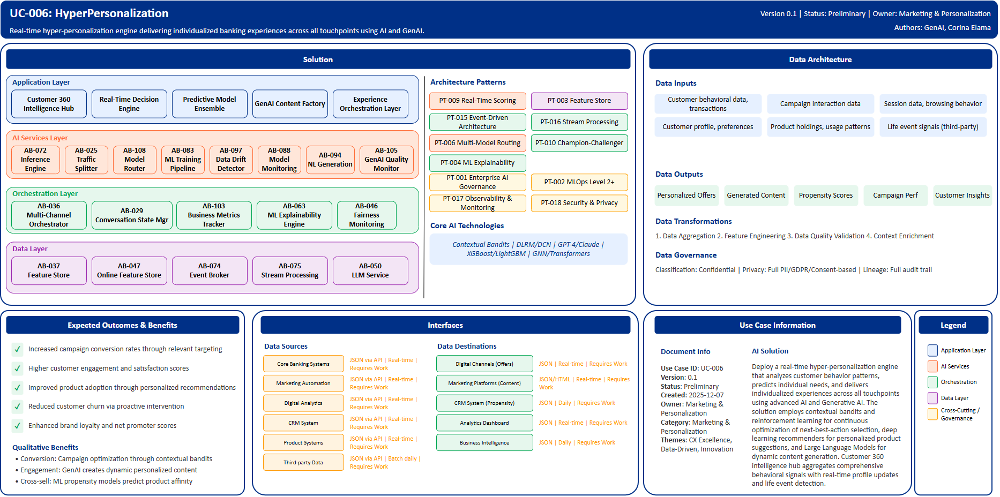

# UC-006: HyperPersonalization

## Document Control

| Property | Value |
|----------|-------|
| **Use Case ID** | `UC-006` |
| **Version** | `0.1` |
| **Status** | `Preliminary` |
| **Created Date** | `2025-12-07` |
| **Last Modified** | `2025-12-07` |
| **Owner** | Marketing & Personalization |
| **Author(s)** | GenAI, Corina Elama |
| **Product Owner** | TBD |
| **Executive Sponsor** | TBD |

## 1. Executive Summary

### 1.1 Use Case Overview

**One-Line Summary**: 
Real-time hyper-personalization engine delivering individualized banking experiences across all touchpoints using AI and GenAI.

**Business Problem**:
BNZ's current marketing and customer engagement approach relies on broad segmentation and batch campaign processing, resulting in generic customer experiences that fail to address individual needs and preferences. Campaign conversion rates are suboptimal due to poorly timed or irrelevant offers. Customer engagement scores lag competitors who deliver more personalized experiences. Product adoption suffers from one-size-fits-all recommendations that don't account for individual financial situations or life stages. Customer churn occurs when needs aren't anticipated proactively. Brand loyalty and customer satisfaction scores are constrained by impersonal interactions across digital and physical channels.

**AI Solution**:
Deploy a real-time hyper-personalization engine that analyzes customer behavior patterns, predicts individual needs, and delivers individualized experiences across all touchpoints using advanced AI and Generative AI. The solution employs contextual bandits and reinforcement learning for continuous optimization of next-best-action selection, deep learning recommenders for personalized product suggestions, and Large Language Models for dynamic content generation. It creates personalized messages, emails, and offers in real-time based on micro-segments, life events, and individual preferences. Customer 360 intelligence hub aggregates comprehensive behavioral signals with real-time profile updates and life event detection. Predictive model ensemble provides churn propensity, product affinity scoring, and customer lifetime value predictions. GenAI content factory generates thousands of personalized variants with brand voice consistency and compliance checking. Experience orchestration layer coordinates omnichannel journeys with frequency management and attribution tracking. The platform achieves substantial improvement in customer satisfaction and significant increase in cross-selling success through AI-driven insights and advanced analytics.

**Expected Outcomes**:

- Increased campaign conversion rates through relevant targeting
- Higher customer engagement and satisfaction scores
- Improved product adoption through personalized recommendations
- Reduced customer churn via proactive intervention
- Enhanced brand loyalty and net promoter scores

### 1.2 Strategic Alignment

**Business Category**: 
Marketing & Personalization

**Strategic Themes** (select all that apply):

- [x] Customer Experience Excellence
- [ ] Operational Efficiency & Automation
- [ ] Risk & Compliance Excellence
- [x] Data-Driven Decision Making
- [x] Innovation & Competitive Differentiation

**Alignment Statement**:
This use case directly supports BNZ's Customer Experience Excellence pillar by delivering hyper-personalized banking experiences that anticipate individual customer needs and preferences across all touchpoints. It enables Data-Driven Decision Making through real-time behavioral analytics and predictive modeling that optimize engagement strategies. The solution demonstrates Innovation & Competitive Differentiation by positioning BNZ at the forefront of AI-powered personalization, creating distinctive customer experiences that drive loyalty and competitive advantage.

## 2. Business Case

### 2.1 Business Value

**Value Type** (select all that apply):

- [x] Revenue Growth
- [ ] Cost Reduction
- [ ] Risk Reduction
- [x] Customer Experience Improvement
- [ ] Regulatory Compliance
- [x] Competitive Advantage

**Qualitative Benefits**:

| Benefit Type | Description | AI Accelerant | Evidence / Indicator |
|--------------|----------|--------|--------|
| Conversion improvement | Campaign and offer conversion rates significantly improved through relevance | Contextual bandits optimize offer selection in real-time; deep learning recommenders provide personalized product suggestions | Offer conversion rate, email open rate, click-through rate |
| Customer engagement | Substantial increase in customer engagement and interaction frequency | GenAI creates dynamic personalized content; predictive models identify optimal engagement moments | Customer satisfaction scores, interaction frequency, engagement metrics |
| Cross-sell success | Enhanced cross-selling effectiveness through intelligent product recommendations | ML propensity models predict product affinity; next-best-action engine optimizes timing | Cross-sell rate, product adoption, revenue per customer |
| Churn reduction | Proactive retention through early churn prediction and intervention | Churn propensity models identify at-risk customers; life event prediction enables preemptive action | Customer retention rate, churn rate, lifetime value |
| Operational agility | Dramatic reduction in campaign setup time enabling rapid market response | GenAI generates content variants at scale; automated testing optimizes performance | Campaign setup time, time-to-market, marketing ROI |

## 3. Target State Solution

### 3.1 Solution Overview

**AI/ML Approach**:
The platform employs a multi-layered AI architecture combining real-time decisioning engines, predictive ML models, and Generative AI for dynamic content creation. Contextual bandits using Thompson Sampling enable next-best-action selection that balances exploration and exploitation in real-time offer optimization. Deep Learning Recommenders (DLRM, DCN) provide personalized product suggestions based on behavioral embeddings. Large Language Models (GPT-4, Claude) enable dynamic generation of personalized messages, emails, and offers with brand voice consistency. XGBoost and LightGBM power propensity models for likelihood scoring across product adoption, churn, and engagement dimensions. Graph Neural Networks analyze relationship patterns for household modeling and social influence. Transformer models enable sequence prediction for customer journey forecasting and next-action prediction. Event-driven architecture enables sub-second personalization across all digital touchpoints, processing extensive customer interactions to deliver truly individualized banking experiences. The solution includes continuous learning through multi-armed bandit optimization, champion-challenger testing at individual customer level, and real-time feedback loops.

**Solution Components**:

1. **Customer 360 Intelligence Hub**: Unified customer profile aggregating comprehensive behavioral signals, real-time profile updates with low latency, life event detection identifying major life changes, financial wellness scoring and goal tracking, cross-channel interaction history preservation
2. **Real-Time Decision Engine**: Rapid offer selection from extensive eligible actions, multi-armed bandit optimization for continuous learning, business rule integration ensuring eligibility and compliance, champion-challenger testing at individual level, context-aware routing based on channel and customer state
3. **Predictive Model Ensemble**: Churn propensity models across multiple time horizons, product affinity scoring across complete product range, customer lifetime value prediction, engagement propensity by channel preference, life event prediction with advance notice capability
4. **GenAI Content Factory**: Dynamic message generation with brand voice consistency, personalized offer copy and creative variants, multi-language support with cultural adaptation, compliance-checked content with automatic review triggers, A/B testing integration for message optimization
5. **Experience Orchestration Layer**: Omnichannel journey coordination across all touchpoints, frequency and fatigue management preventing over-communication, real-time trigger detection and response, session context preservation across channels, attribution tracking for conversion analysis

### 3.2 Data Architecture

**Data Inputs**:

| Dataset | Description | Source | Volume | Frequency | Format | Interface Status |
|-----------|--------|-----------|--------|--------------|--------------|--------------|
| Customer behavioral data | Transaction history, product usage, digital interactions | Core Banking Systems | Very large | Real-time | JSON via API | Requires Work |
| Campaign interaction data | Email opens, clicks, offer responses | Marketing Automation | Large | Real-time | JSON via API | Requires Work |
| Session data | Website and app interactions, browsing behavior | Digital Analytics | Very large | Real-time | JSON via API | Requires Work |
| Customer profile data | Demographics, preferences, communication settings | CRM System | Large | Real-time | JSON via API | Requires Work |
| Product holdings | Current products, balances, usage patterns | Product Systems | Large | Real-time | JSON via API | Requires Work |
| Life event signals | External data indicating major life changes | Third-party Data | Large | Batch daily | JSON via API | Requires Work |

**Data Transformations**:
1. **Data Aggregation**: Combine behavioral signals from multiple BIAN Service Domains into unified customer intelligence profiles
2. **Feature Engineering**: Calculate derived features including engagement scores, product affinity metrics, churn risk indicators, lifetime value
3. **Data Quality Validation**: Apply comprehensive validation ensuring accuracy and completeness of customer behavioral data
4. **Context Enrichment**: Add business context including current campaigns, product eligibility, regulatory constraints, channel preferences

**Data Outputs**:

| Dataset | Description | Destination | Volume | Frequency | Format | Interface Status |  |
|-------------|-------------|-------------|--------|-----------|-----------|-----------|-----------|
| Personalized offers | Real-time next-best-action recommendations | Digital Channels | Very large | Real-time | JSON | Requires Work |  |
| Generated content | Personalized messages and creative variants | Marketing Platforms | Large | Real-time | JSON/HTML | Requires Work |  |
| Propensity scores | Churn, affinity, engagement predictions | CRM System | Large | Daily | JSON | Requires Work |  |
| Campaign performance | Conversion metrics, attribution data | Analytics Dashboard | Large | Real-time | JSON | Requires Work |  |
| Customer insights | Segment analysis, journey analytics | Business Intelligence | Large | Daily | JSON | Requires Work |  |

**Data Quality Requirements**:

- **Accuracy**: Very high accuracy required for customer behavioral data and propensity predictions
- **Completeness**: No missing critical customer interaction data or preference information
- **Timeliness**: Real-time for behavioral signals and offer delivery, batch processing for analytical models
- **Consistency**: Standardized formats across all customer data sources with unified customer identifiers

**Data Governance**:
- **Classification**: Confidential (contains sensitive customer behavioral and PII data)
- **Retention**: Per marketing regulatory requirements and BNZ data retention policy
- **Privacy**: Full PII protection, consent-based marketing, GDPR compliance, opt-out management
- **Lineage**: Full data lineage from sources through models to personalized experiences for compliance

### 3.3 Architecture Patterns

**Primary Patterns Used**:

| Pattern ID | Pattern Name | Usage in Use Case |
|-----------|-------------|-------------------|
| [PT-009](../../../../03-building-blocks/patterns/PT-009/PT-009-Real-Time-Scoring-v1.0.0.md) | Real-Time Scoring | Sub-second offer selection and recommendation |
| [PT-003](../../../../03-building-blocks/patterns/PT-003/PT-003-Feature-Store-v1.0.0.md) | Feature Store | Real-time customer feature serving |
| [PT-015](../../../../03-building-blocks/patterns/PT-015/PT-015-Event-Driven-Architecture-v1.0.0.md) | Event-Driven Architecture | Real-time behavioral event processing |
| [PT-016](../../../../03-building-blocks/patterns/PT-016/PT-016-Stream-Processing-v1.0.0.md) | Stream Processing | Continuous behavioral signal analysis |
| [PT-006](../../../../03-building-blocks/patterns/PT-006/PT-006-Multi-Model-Routing-v1.0.0.md) | Multi-Model Routing | Context-aware propensity model selection |
| [PT-010](../../../../03-building-blocks/patterns/PT-010/PT-010-Champion-Challenger-v1.0.0.md) | Champion-Challenger | Individual-level A/B testing |
| [PT-004](../../../../03-building-blocks/patterns/PT-004/PT-004-Explainability-v1.0.0.md) | ML Explainability | Recommendation transparency |
| [PT-002](../../../../03-building-blocks/patterns/PT-002/PT-002-MLOps-Level-2-Plus-v1.0.0.md) | MLOps Level 2+ | Continuous model retraining |
| [PT-001](../../../../03-building-blocks/patterns/PT-001/PT-001-Enterprise-AI-Governance-v1.0.0.md) | Enterprise AI Governance | Personalization governance |
| [PT-017](../../../../03-building-blocks/patterns/PT-017/PT-017-Observability-Monitoring-v1.0.0.md) | Observability & Monitoring | Performance and fairness monitoring |
| [PT-018](../../../../03-building-blocks/patterns/PT-018/PT-018-Security-Privacy-v1.0.0.md) | Security & Privacy | Customer data protection |

**Architecture Building Blocks (ABBs)**:

| ABB ID | ABB Name | Purpose in Use Case | Criticality |
|--------|----------|-------------------|-------------|
| [AB-037](../../../../03-building-blocks/architecture-building-blocks/abbs/AB-037/AB-037-Feature-Store-v1.0.0.md) | Feature Store | Unified customer profile features | Critical |
| [AB-047](../../../../03-building-blocks/architecture-building-blocks/abbs/AB-047/AB-047-Online-Feature-Store-v1.0.0.md) | Online Feature Store | Real-time profile updates | Critical |
| [AB-074](../../../../03-building-blocks/architecture-building-blocks/abbs/AB-074/AB-074-Event-Broker-v1.0.0.md) | Event Broker | Life event detection streaming | Critical |
| [AB-075](../../../../03-building-blocks/architecture-building-blocks/abbs/AB-075/AB-075-Stream-Processing-Engine-v1.0.0.md) | Stream Processing Engine | Behavioral signal processing | Critical |
| [AB-072](../../../../03-building-blocks/architecture-building-blocks/abbs/AB-072/AB-072-Inference-Engine-v1.0.0.md) | Inference Engine | Fast offer selection scoring | Critical |
| [AB-025](../../../../03-building-blocks/architecture-building-blocks/abbs/AB-025/AB-025-Traffic-Splitter-v1.0.0.md) | Traffic Splitter | Champion-challenger testing | High |
| [AB-108](../../../../03-building-blocks/architecture-building-blocks/abbs/AB-108/AB-108-Model-Router-v1.0.0.md) | Model Router | Context-aware model routing | High |
| [AB-083](../../../../03-building-blocks/architecture-building-blocks/abbs/AB-083/AB-083-ML-Training-Pipeline-v1.0.0.md) | ML Training Pipeline | Propensity model training | Critical |
| [AB-097](../../../../03-building-blocks/architecture-building-blocks/abbs/AB-097/AB-097-Data-Drift-Detector-v1.0.0.md) | Data Drift Detector | Churn and engagement prediction | High |
| [AB-088](../../../../03-building-blocks/architecture-building-blocks/abbs/AB-088/AB-088-Model-Monitoring-Platform-v1.0.0.md) | Model Monitoring Platform | Model performance tracking | High |
| [AB-050](../../../../03-building-blocks/architecture-building-blocks/abbs/AB-050/AB-050-Large-Language-Model-Service-v1.0.0.md) | Large Language Model Service | Dynamic message generation | Critical |
| [AB-094](../../../../03-building-blocks/architecture-building-blocks/abbs/AB-094/AB-094-Natural-Language-Generation-v1.0.0.md) | Natural Language Generation | Personalized offer copy | High |
| [AB-105](../../../../03-building-blocks/architecture-building-blocks/abbs/AB-105/AB-105-GenAI-Quality-Monitor-v1.0.0.md) | GenAI Quality Monitor | Compliance-checked content | High |
| [AB-036](../../../../03-building-blocks/architecture-building-blocks/abbs/AB-036/AB-036-Multi-Channel-Orchestrator-v1.0.0.md) | Multi-Channel Orchestrator | Omnichannel journey coordination | Critical |
| [AB-029](../../../../03-building-blocks/architecture-building-blocks/abbs/AB-029/AB-029-Conversation-State-Manager-v1.0.0.md) | Conversation State Manager | Session context preservation | High |
| [AB-103](../../../../03-building-blocks/architecture-building-blocks/abbs/AB-103/AB-103-Business-Metrics-Tracker-v1.0.0.md) | Business Metrics Tracker | Attribution tracking | High |
| [AB-063](../../../../03-building-blocks/architecture-building-blocks/abbs/AB-063/AB-063-ML-Model-Explainability-Engine-v1.0.0.md) | ML Model Explainability Engine | Recommendation explanations | High |
| [AB-046](../../../../03-building-blocks/architecture-building-blocks/abbs/AB-046/AB-046-Fairness-Monitoring-Engine-v1.0.0.md) | Fairness Monitoring Engine | Bias detection in personalization | High |

## 4. Prioritization Scoring

TBD - Prioritization scoring to be completed during portfolio planning.

## 5. Risk Management

TBD - Risk assessment to be completed during detailed planning phase.

## 6. Success Metrics & KPIs

Track business and technical KPIs (details TBD).
