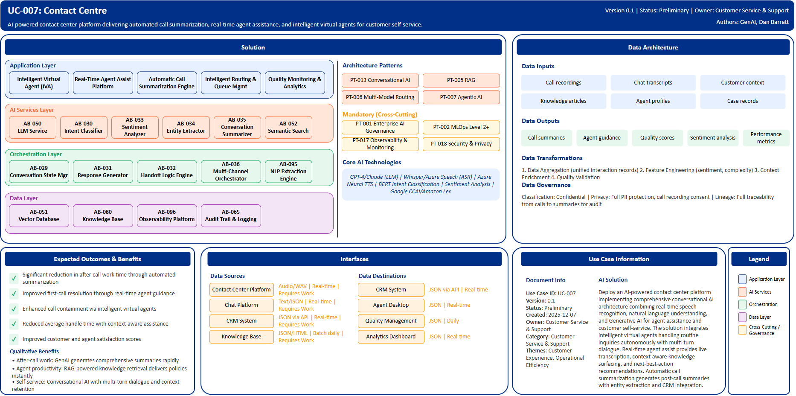

# UC-007: Contact Centre

## Document Control

| Property | Value |
|----------|-------|
| **Use Case ID** | `UC-007` |
| **Version** | `0.1` |
| **Status** | `Preliminary` |
| **Created Date** | `2025-12-07` |
| **Last Modified** | `2025-12-07` |
| **Owner** | Customer Service & Support |
| **Author(s)** | GenAI, Dan Barratt |
| **Product Owner** | TBD |
| **Executive Sponsor** | TBD |

## 1. Executive Summary

### 1.1 Use Case Overview

**One-Line Summary**: 
AI-powered contact center platform delivering automated call summarization, real-time agent assistance, and intelligent virtual agents for customer self-service.

**Business Problem**:
BNZ's contact center operations face challenges with agents spending extensive time on after-call work manually documenting call details and outcomes. Knowledge search during calls creates delays as agents navigate multiple systems seeking policy information and product details. Routine inquiries consume agent capacity that could be directed to complex customer needs. Customer wait times and first-call resolution rates lag industry benchmarks due to inefficient routing and limited agent guidance. Training new agents is time-consuming and costly. Quality monitoring relies on call sampling providing incomplete visibility into compliance and customer experience. Agent satisfaction suffers from repetitive work and inadequate support tools.

**AI Solution**:
Deploy an AI-powered contact center platform implementing comprehensive conversational AI architecture combining real-time speech recognition, natural language understanding, and Generative AI for agent assistance and customer self-service. The solution integrates intelligent virtual agents handling routine inquiries autonomously with multi-turn dialogue and banking-specific NLU. Real-time agent assist provides live transcription, context-aware knowledge surfacing, next-best-action recommendations, and compliance monitoring with supervisor alerts. Automatic call summarization engine generates post-call summaries rapidly with structured entity extraction and CRM integration. Intelligent routing uses AI-predicted complexity scoring, sentiment analysis for priority handling, and skills-based agent matching. Quality monitoring analyzes all calls comprehensively with automated scoring and trend analysis. The platform leverages Large Language Models for real-time guidance and summarization, RAG architecture for knowledge retrieval, and sentiment analysis for emotion detection triggering proactive escalation.

**Expected Outcomes**:

- Significant reduction in after-call work time through automated summarization
- Improved first-call resolution through real-time agent guidance
- Enhanced call containment via intelligent virtual agents
- Reduced average handle time with context-aware assistance
- Improved customer and agent satisfaction scores

### 1.2 Strategic Alignment

**Business Category**: 
Customer Service & Support

**Strategic Themes** (select all that apply):

- [x] Customer Experience Excellence
- [x] Operational Efficiency & Automation
- [ ] Risk & Compliance Excellence
- [ ] Data-Driven Decision Making
- [ ] Innovation & Competitive Differentiation

**Alignment Statement**:
This use case directly supports BNZ's Customer Experience Excellence pillar by transforming contact center interactions with AI-powered assistance that improves response quality, reduces wait times, and enhances first-call resolution. It drives Operational Efficiency & Automation through intelligent virtual agents automating routine inquiries, automated call summarization eliminating manual documentation, and real-time agent assist reducing knowledge search time. The solution positions BNZ competitively through advanced conversational AI capabilities delivering superior customer service.

## 2. Business Case

### 2.1 Business Value

**Value Type** (select all that apply):

- [ ] Revenue Growth
- [x] Cost Reduction
- [ ] Risk Reduction
- [x] Customer Experience Improvement
- [x] Regulatory Compliance
- [ ] Competitive Advantage

**Qualitative Benefits**:

| Benefit Type | Description | AI Accelerant | Evidence / Indicator |
|--------------|----------|--------|--------|
| After-call work reduction | Dramatic reduction in time spent documenting calls through automated summarization | GenAI generates comprehensive call summaries rapidly; NLP extracts entities and action items automatically | After-call work time, documentation quality, agent capacity |
| Agent productivity | Substantial improvement in handle time through real-time knowledge surfacing and guidance | RAG-powered knowledge retrieval delivers relevant policies instantly; LLM provides next-best-action recommendations | Average handle time, knowledge search time, first-call resolution |
| Self-service automation | Significant call containment through intelligent virtual agents handling routine inquiries | Conversational AI with multi-turn dialogue; banking-specific NLU; seamless escalation with context transfer | Call containment rate, IVA completion rate, agent workload |
| Customer experience | Enhanced satisfaction through reduced wait times and improved resolution | AI-powered routing prioritizes urgent calls; real-time agent assist improves response quality | Customer satisfaction scores, net promoter score, customer effort score |
| Compliance monitoring | Comprehensive quality assurance through automated analysis of all calls | Sentiment analysis detects compliance issues; automated scoring against criteria; complete audit trail | Compliance adherence rate, quality scores, regulatory audit findings |

## 3. Target State Solution

### 3.1 Solution Overview

**AI/ML Approach**:
The platform implements comprehensive conversational AI architecture combining real-time speech recognition using Automatic Speech Recognition (Whisper, Azure Speech) with high accuracy for banking terminology, natural language understanding through Intent Classification (BERT, DistilBERT) for customer intent recognition, and Generative AI powered by Large Language Models (GPT-4, Claude) for agent assistance and summarization. RAG architecture enables real-time policy and procedure lookup. Sentiment Analysis monitors customer emotion in real-time triggering supervisor alerts. Text-to-Speech with Neural TTS provides natural-sounding voice responses for virtual agents. The solution integrates voice AI, virtual agents, and intelligent routing to transform customer interactions while providing agents with real-time guidance, automatic call summarization, and next-best-action recommendations. Multi-modal AI processes voice, chat, and digital channels through unified platform. The architecture includes conversation state management for multi-turn dialogues, entity extraction for structured data capture, and knowledge base integration for agent support.

**Solution Components**:

1. **Intelligent Virtual Agent (IVA)**: Conversational AI handling substantial portion of routine inquiries autonomously, multi-turn dialogue with context retention across sessions, banking-specific NLU trained on account inquiries and transactions, seamless escalation to human agent with full context transfer, consistent voice and digital channel support
2. **Real-Time Agent Assist Platform**: Live transcription with low latency, real-time knowledge surfacing based on conversation context, next-best-action recommendations during calls, compliance monitoring with real-time script adherence alerts, customer sentiment indicators with supervisor escalation triggers
3. **Automatic Call Summarization Engine**: GenAI-powered post-call summaries generated rapidly, structured extraction of key entities including account numbers and issues, CRM integration for automatic case note population, action item identification and follow-up task creation, significant reduction in after-call work time
4. **Intelligent Routing & Queue Management**: Skills-based routing with AI-predicted complexity scoring, customer sentiment analysis for priority handling, agent capacity and expertise matching, predictive wait time estimation with callback scheduling, multi-channel orchestration across voice and digital
5. **Quality Monitoring & Analytics**: Comprehensive call analysis versus traditional sampling approaches, automated quality scoring against defined criteria, trend analysis identifying training needs, customer effort score prediction, compliance and regulatory adherence monitoring

### 3.2 Data Architecture

**Data Inputs**:

| Dataset | Description | Source | Volume | Frequency | Format | Interface Status |
|-----------|--------|-----------|--------|--------------|--------------|--------------|
| Call recordings | Voice recordings from customer calls | Contact Center Platform | Very large | Real-time | Audio/WAV | Requires Work |
| Chat transcripts | Digital chat conversation logs | Chat Platform | Large | Real-time | Text/JSON | Requires Work |
| Customer context | Account details, interaction history | CRM System | Large | Real-time | JSON via API | Requires Work |
| Knowledge articles | Policies, procedures, product information | Knowledge Base | Large | Batch daily | JSON/HTML | Requires Work |
| Agent profiles | Skills, performance, availability | Workforce Management | Large | Real-time | JSON via API | Requires Work |
| Case records | Historical case resolutions | Case Management | Very large | Batch daily | JSON via API | Requires Work |

**Data Transformations**:
1. **Data Aggregation**: Combine conversation data from multiple channels into unified interaction records
2. **Feature Engineering**: Calculate derived features including sentiment scores, complexity indicators, resolution patterns
3. **Data Quality Validation**: Apply validation rules ensuring transcription accuracy and entity extraction completeness
4. **Context Enrichment**: Add customer context, agent skills, and historical interaction patterns to real-time conversations

**Data Outputs**:

| Dataset | Description | Destination | Volume | Frequency | Format | Interface Status |  |
|-------------|-------------|-------------|--------|-----------|-----------|-----------|-----------|
| Call summaries | AI-generated call summaries with structured data | CRM System | Very large | Real-time | JSON via API | Requires Work |  |
| Agent guidance | Real-time knowledge and recommendations | Agent Desktop | Very large | Real-time | JSON | Requires Work |  |
| Quality scores | Automated quality assessment results | Quality Management | Large | Daily | JSON | Requires Work |  |
| Sentiment analysis | Customer emotion and satisfaction indicators | Analytics Dashboard | Large | Real-time | JSON | Requires Work |  |
| Performance metrics | Agent productivity, resolution rates, containment | Workforce Analytics | Large | Daily | JSON | Requires Work |  |

**Data Quality Requirements**:

- **Accuracy**: Very high accuracy required for speech transcription and entity extraction
- **Completeness**: No missing critical conversation context or customer information
- **Timeliness**: Real-time processing for agent assist and routing decisions
- **Consistency**: Standardized formats across all conversation channels with unified schema

**Data Governance**:
- **Classification**: Confidential (contains customer PII and call recordings)
- **Retention**: Per contact center regulatory requirements and BNZ data retention policy
- **Privacy**: Full PII protection in recordings and transcripts, consent-based processing, call recording disclosures
- **Lineage**: Full data lineage from calls through AI processing to summaries for compliance audit

### 3.3 Architecture Patterns

**Primary Patterns Used**:

| Pattern ID | Pattern Name | Usage in Use Case |
|-----------|-------------|-------------------|
| [PT-013](../../../../03-building-blocks/patterns/PT-013/PT-013-Conversational-AI-v1.0.0.md) | Conversational AI | Virtual agent and multi-turn dialogue management |
| [PT-005](../../../../03-building-blocks/patterns/PT-005/PT-005-Retrieval-Augmented-Generation-v1.0.0.md) | Retrieval-Augmented Generation | Real-time knowledge retrieval for agent assist |
| [PT-006](../../../../03-building-blocks/patterns/PT-006/PT-006-Multi-Model-Routing-v1.0.0.md) | Multi-Model Routing | Routing between NLU, sentiment, and LLM models |
| [PT-007](../../../../03-building-blocks/patterns/PT-007/PT-007-Agentic-AI-v1.0.0.md) | Agentic AI | Autonomous handling of multi-step processes |
| [PT-017](../../../../03-building-blocks/patterns/PT-017/PT-017-Observability-Monitoring-v1.0.0.md) | Observability & Monitoring | Call quality and performance monitoring |
| [PT-001](../../../../03-building-blocks/patterns/PT-001/PT-001-Enterprise-AI-Governance-v1.0.0.md) | Enterprise AI Governance | Conversational AI governance and compliance |
| [PT-002](../../../../03-building-blocks/patterns/PT-002/PT-002-MLOps-Level-2-Plus-v1.0.0.md) | MLOps Level 2+ | Continuous model improvement for NLU and sentiment |
| [PT-018](../../../../03-building-blocks/patterns/PT-018/PT-018-Security-Privacy-v1.0.0.md) | Security & Privacy | Call recording and transcript protection |

**Architecture Building Blocks (ABBs)**:

| ABB ID | ABB Name | Purpose in Use Case | Criticality |
|--------|----------|-------------------|-------------|
| [AB-029](../../../../03-building-blocks/architecture-building-blocks/abbs/AB-029/AB-029-Conversation-State-Manager-v1.0.0.md) | Conversation State Manager | Multi-turn dialogue context across sessions | Critical |
| [AB-030](../../../../03-building-blocks/architecture-building-blocks/abbs/AB-030/AB-030-Intent-Classifier-v1.0.0.md) | Intent Classifier | Customer intent classification for routing | Critical |
| [AB-031](../../../../03-building-blocks/architecture-building-blocks/abbs/AB-031/AB-031-Response-Generator-v1.0.0.md) | Response Generator | Conversational responses for virtual agent | Critical |
| [AB-034](../../../../03-building-blocks/architecture-building-blocks/abbs/AB-034/AB-034-Entity-Extractor-v1.0.0.md) | Entity Extractor | Extract account numbers and transaction details | High |
| [AB-032](../../../../03-building-blocks/architecture-building-blocks/abbs/AB-032/AB-032-Handoff-Logic-Engine-v1.0.0.md) | Handoff Logic Engine | Seamless escalation to human agents | High |
| [AB-050](../../../../03-building-blocks/architecture-building-blocks/abbs/AB-050/AB-050-Large-Language-Model-Service-v1.0.0.md) | Large Language Model Service | Real-time guidance and summarization | Critical |
| [AB-051](../../../../03-building-blocks/architecture-building-blocks/abbs/AB-051/AB-051-Vector-Database-v1.0.0.md) | Vector Database | Policy and procedure embeddings | Critical |
| [AB-052](../../../../03-building-blocks/architecture-building-blocks/abbs/AB-052/AB-052-Semantic-Search-Engine-v1.0.0.md) | Semantic Search Engine | Real-time knowledge search | Critical |
| [AB-033](../../../../03-building-blocks/architecture-building-blocks/abbs/AB-033/AB-033-Sentiment-Analyzer-v1.0.0.md) | Sentiment Analyzer | Customer sentiment monitoring | Critical |
| [AB-080](../../../../03-building-blocks/architecture-building-blocks/abbs/AB-080/AB-080-Knowledge-Base-v1.0.0.md) | Knowledge Base | Policies and procedures storage | High |
| [AB-035](../../../../03-building-blocks/architecture-building-blocks/abbs/AB-035/AB-035-Conversation-Summarizer-v1.0.0.md) | Conversation Summarizer | Automated call summaries | Critical |
| [AB-095](../../../../03-building-blocks/architecture-building-blocks/abbs/AB-095/AB-095-NLP-Extraction-Engine-v1.0.0.md) | NLP Extraction Engine | Entity and action item extraction | High |
| [AB-036](../../../../03-building-blocks/architecture-building-blocks/abbs/AB-036/AB-036-Multi-Channel-Orchestrator-v1.0.0.md) | Multi-Channel Orchestrator | Omnichannel coordination | High |
| [AB-096](../../../../03-building-blocks/architecture-building-blocks/abbs/AB-096/AB-096-Observability-Platform-v1.0.0.md) | Observability Platform | Call analytics monitoring | High |
| [AB-103](../../../../03-building-blocks/architecture-building-blocks/abbs/AB-103/AB-103-Business-Metrics-Tracker-v1.0.0.md) | Business Metrics Tracker | Quality to business outcomes tracking | High |
| [AB-065](../../../../03-building-blocks/architecture-building-blocks/abbs/AB-065/AB-065-Audit-Trail-and-Logging-v1.0.0.md) | Audit Trail & Logging | Compliance monitoring and audit | Critical |

## 4. Prioritization Scoring

TBD - Prioritization scoring to be completed during portfolio planning.

## 5. Risk Management

TBD - Risk assessment to be completed during detailed planning phase.

## 6. Success Metrics & KPIs

Track business and technical KPIs (details TBD).
