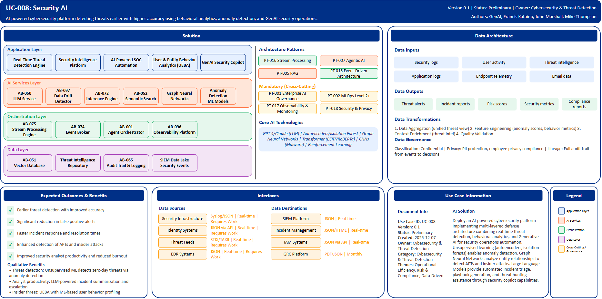

# UC-008: Security AI

## Document Control

| Property | Value |
|----------|-------|
| **Use Case ID** | `UC-008` |
| **Version** | `0.1` |
| **Status** | `Preliminary` |
| **Created Date** | `2025-12-07` |
| **Last Modified** | `2025-12-07` |
| **Owner** | Cybersecurity & Threat Detection |
| **Author(s)** | GenAI, Francis Kataino, John Marshall, Mike Thompson |
| **Product Owner** | TBD |
| **Executive Sponsor** | TBD |

## 1. Executive Summary

### 1.1 Use Case Overview

**One-Line Summary**: 
AI-powered cybersecurity platform detecting threats earlier with higher accuracy using behavioral analytics, anomaly detection, and GenAI security operations.

**Business Problem**:
Traditional cybersecurity approaches rely on signature-based detection that fails against zero-day threats and advanced persistent threats. Security operations centers are overwhelmed with high volumes of alerts creating analyst fatigue and delayed response times. Manual threat hunting is time-consuming and misses sophisticated attack patterns. Insider threats and privilege abuse are difficult to detect with rule-based systems. Incident response and triage require significant analyst time for investigation and documentation. Vulnerability management struggles to prioritize risks effectively across large attack surfaces. Security talent shortage limits organizational defensive capabilities.

**AI Solution**:
Deploy an AI-powered cybersecurity platform implementing multi-layered defense architecture combining real-time threat detection, behavioral analytics, and Generative AI for security operations automation. The solution leverages unsupervised learning including autoencoders and isolation forests for anomaly detection identifying unusual network behavior and access patterns. Graph Neural Networks analyze entity relationships to detect advanced persistent threats and insider attacks across the enterprise. Transformer models process security logs with natural language processing for alert correlation. Large Language Models provide automated incident triage, playbook generation, and threat hunting assistance through security copilot capabilities. Deep learning performs malware analysis and classification. Reinforcement learning enables adaptive defense with dynamic security policy optimization. The platform implements real-time threat detection with stream processing, security intelligence correlation, AI-powered SOC automation, User and Entity Behavior Analytics (UEBA) for insider threat detection, and GenAI security copilot for analyst assistance.

**Expected Outcomes**:

- Earlier threat detection with improved accuracy
- Significant reduction in false positive alerts
- Faster incident response and resolution times
- Enhanced detection of advanced persistent threats and insider attacks
- Improved security analyst productivity and reduced burnout

### 1.2 Strategic Alignment

**Business Category**: 
Cybersecurity & Threat Detection

**Strategic Themes** (select all that apply):

- [ ] Customer Experience Excellence
- [x] Operational Efficiency & Automation
- [x] Risk & Compliance Excellence
- [x] Data-Driven Decision Making
- [ ] Innovation & Competitive Differentiation

**Alignment Statement**:
This use case directly supports BNZ's Risk & Compliance Excellence pillar by deploying advanced AI/ML capabilities for superior threat detection and response protecting critical banking systems and customer data. It enables Data-Driven Decision Making through behavioral analytics and predictive threat modeling that identify risks traditional signature-based systems miss. The solution drives Operational Efficiency & Automation through automated alert triage, incident response orchestration, and GenAI-powered security operations reducing analyst workload while improving threat detection capabilities.

## 2. Business Case

### 2.1 Business Value

**Value Type** (select all that apply):

- [ ] Revenue Growth
- [x] Cost Reduction
- [x] Risk Reduction
- [ ] Customer Experience Improvement
- [x] Regulatory Compliance
- [ ] Competitive Advantage

**Qualitative Benefits**:

| Benefit Type | Description | AI Accelerant | Evidence / Indicator |
|--------------|----------|--------|--------|
| Threat detection | Earlier identification of threats with superior accuracy compared to signature-based approaches | Unsupervised ML (autoencoders, isolation forests) detects zero-day threats; Graph Neural Networks identify APTs | Mean time to detect, detection accuracy, false positive rate |
| Analyst productivity | Substantial reduction in alert investigation time through automated triage | LLM-powered incident summarization and escalation; automated playbook execution; natural language threat hunting | Analyst time per incident, alert investigation time, analyst satisfaction |
| Insider threat detection | Enhanced identification of malicious insider activity and privilege abuse | UEBA with ML-based user behavior profiling; peer group analysis; session analytics | Insider threat detection rate, privileged access monitoring effectiveness |
| Incident response | Faster containment and resolution of security incidents | Automated SOAR integration; AI-powered response recommendations; adaptive defense policies | Mean time to respond, incident resolution time, containment effectiveness |
| Security posture | Proactive vulnerability management and attack surface reduction | Predictive threat modeling; vulnerability prioritization; attack path analysis | Vulnerability remediation time, attack surface size, security audit scores |

## 3. Target State Solution

### 3.1 Solution Overview

**AI/ML Approach**:
The platform implements multi-layered defense architecture combining real-time threat detection, behavioral analytics, and Generative AI for security operations automation. Unsupervised learning using autoencoders and isolation forests enables anomaly detection identifying unusual network behavior and access patterns without requiring labeled threat data. Graph Neural Networks analyze entity relationships across users, devices, and applications to detect advanced persistent threats, insider attacks, and lateral movement patterns. Transformer models including BERT and RoBERTa provide natural language processing of security logs enabling intelligent alert correlation across disparate systems. Large Language Models (GPT-4, Claude) power security copilot capabilities including automated incident triage, playbook generation, threat hunting assistance, and security report generation. Convolutional Neural Networks perform static and dynamic malware analysis and classification. Reinforcement Learning enables adaptive defense with dynamic security policy optimization based on evolving threat landscape. The solution implements stream processing for high-volume security event analysis, behavioral baseline modeling for all entities, zero-day threat detection, and SOAR integration for automated response orchestration.

**Solution Components**:

1. **Real-Time Threat Detection Engine**: Stream processing of high-volume security events with rapid anomaly detection, multi-vector threat correlation across network and endpoint layers, behavioral baseline modeling for all entities, zero-day threat detection using unsupervised ML
2. **Security Intelligence Platform**: Graph-based threat intelligence connecting indicators of compromise, tactics and techniques, automated threat feed ingestion and correlation, attack surface visualization and vulnerability prioritization, predictive threat modeling, dark web monitoring with GenAI intelligence summarization
3. **AI-Powered Security Operations Center (SOC)**: Automated alert triage significantly reducing analyst workload, LLM-powered incident summarization and escalation recommendations, playbook automation with human oversight for critical decisions, natural language query interface for threat hunting, automated SOAR integration for response orchestration
4. **User & Entity Behavior Analytics (UEBA)**: ML-based user behavior profiling detecting insider threats, peer group analysis identifying anomalous access patterns, privileged access monitoring with real-time alerting, session analytics detecting account takeover attempts, risk scoring for identity and access management
5. **GenAI Security Copilot**: Automated security report generation for executives and regulators, code review assistance for vulnerability detection, phishing email analysis and threat explanation, policy compliance assessment with remediation guidance, training content generation for security awareness

### 3.2 Data Architecture

**Data Inputs**:

| Dataset | Description | Source | Volume | Frequency | Format | Interface Status |
|-----------|--------|-----------|--------|--------------|--------------|--------------|
| Security logs | Network traffic, firewall, IDS/IPS, endpoint logs | Security Infrastructure | Very large | Real-time | Syslog/JSON | Requires Work |
| User activity | Authentication, access, privileged actions | Identity Systems | Very large | Real-time | JSON via API | Requires Work |
| Threat intelligence | IOCs, threat actor TTPs, vulnerability data | Threat Feeds | Streaming | Real-time | STIX/TAXII | Requires Work |
| Application logs | Application events, API calls, errors | Application Infrastructure | Very large | Real-time | JSON | Requires Work |
| Endpoint telemetry | Process execution, file activity, registry changes | EDR Systems | Very large | Real-time | JSON | Requires Work |
| Email data | Email headers, content for phishing detection | Email Gateway | Large | Real-time | MIME/JSON | Requires Work |

**Data Transformations**:
1. **Data Aggregation**: Combine security events from multiple sources into unified threat intelligence view
2. **Feature Engineering**: Calculate behavioral features, anomaly scores, entity relationship metrics for threat detection
3. **Data Quality Validation**: Apply validation rules ensuring log completeness and accuracy for reliable threat detection
4. **Context Enrichment**: Add threat intelligence context, asset criticality, user risk profiles to security events

**Data Outputs**:

| Dataset | Description | Destination | Volume | Frequency | Format | Interface Status |  |
|-------------|-------------|-------------|--------|-----------|-----------|-----------|-----------|
| Threat alerts | Prioritized security alerts with risk scores | SIEM Platform | Large | Real-time | JSON | Requires Work |  |
| Incident reports | AI-generated incident summaries | Incident Management | Large | Real-time | JSON/HTML | Requires Work |  |
| Risk scores | User, device, and application risk assessments | IAM Systems | Large | Real-time | JSON via API | Requires Work |  |
| Security metrics | Threat metrics, detection rates, response times | Security Dashboard | Large | Daily | JSON | Requires Work |  |
| Compliance reports | Automated compliance and audit reports | GRC Platform | Large | Monthly | PDF/JSON | Requires Work |  |

**Data Quality Requirements**:

- **Accuracy**: Very high accuracy required for threat detection and behavioral analytics
- **Completeness**: No missing critical security events or user activity logs
- **Timeliness**: Real-time processing for immediate threat detection and response
- **Consistency**: Standardized formats across all security data sources with unified schema

**Data Governance**:
- **Classification**: Confidential (contains sensitive security and infrastructure data)
- **Retention**: Per security regulatory requirements and incident investigation needs
- **Privacy**: PII protection in security logs, consent-based monitoring, employee privacy compliance
- **Lineage**: Full data lineage from security events through AI processing to threat decisions for audit

### 3.3 Architecture Patterns

**Primary Patterns Used**:

| Pattern ID | Pattern Name | Usage in Use Case |
|-----------|-------------|-------------------|
| [PT-016](../../../../03-building-blocks/patterns/PT-016/PT-016-Stream-Processing-v1.0.0.md) | Stream Processing | Real-time security event processing and correlation |
| [PT-007](../../../../03-building-blocks/patterns/PT-007/PT-007-Agentic-AI-v1.0.0.md) | Agentic AI | Autonomous incident response and threat hunting |
| [PT-005](../../../../03-building-blocks/patterns/PT-005/PT-005-Retrieval-Augmented-Generation-v1.0.0.md) | Retrieval-Augmented Generation | Threat intelligence retrieval and security copilot |
| [PT-015](../../../../03-building-blocks/patterns/PT-015/PT-015-Event-Driven-Architecture-v1.0.0.md) | Event-Driven Architecture | Event-driven threat detection and response |
| [PT-017](../../../../03-building-blocks/patterns/PT-017/PT-017-Observability-Monitoring-v1.0.0.md) | Observability & Monitoring | Security monitoring and alerting |
| [PT-001](../../../../03-building-blocks/patterns/PT-001/PT-001-Enterprise-AI-Governance-v1.0.0.md) | Enterprise AI Governance | AI security model governance |
| [PT-018](../../../../03-building-blocks/patterns/PT-018/PT-018-Security-Privacy-v1.0.0.md) | Security & Privacy | Data protection and access control |
| [PT-002](../../../../03-building-blocks/patterns/PT-002/PT-002-MLOps-Level-2-Plus-v1.0.0.md) | MLOps Level 2+ | Continuous model retraining for evolving threats |

**Architecture Building Blocks (ABBs)**:

| ABB ID | ABB Name | Purpose in Use Case | Criticality |
|--------|----------|-------------------|-------------|
| [AB-075](../../../../03-building-blocks/architecture-building-blocks/abbs/AB-075/AB-075-Stream-Processing-Engine-v1.0.0.md) | Stream Processing Engine | High-volume security event processing | Critical |
| [AB-097](../../../../03-building-blocks/architecture-building-blocks/abbs/AB-097/AB-097-Data-Drift-Detector-v1.0.0.md) | Data Drift Detector | Anomaly detection for threat identification | Critical |
| [AB-072](../../../../03-building-blocks/architecture-building-blocks/abbs/AB-072/AB-072-Inference-Engine-v1.0.0.md) | Inference Engine | Real-time threat scoring | Critical |
| [AB-050](../../../../03-building-blocks/architecture-building-blocks/abbs/AB-050/AB-050-Large-Language-Model-Service-v1.0.0.md) | Large Language Model Service | Security copilot and incident triage | Critical |
| [AB-051](../../../../03-building-blocks/architecture-building-blocks/abbs/AB-051/AB-051-Vector-Database-v1.0.0.md) | Vector Database | Threat intelligence embeddings | High |
| [AB-052](../../../../03-building-blocks/architecture-building-blocks/abbs/AB-052/AB-052-Semantic-Search-Engine-v1.0.0.md) | Semantic Search Engine | Threat intelligence search | High |
| [AB-074](../../../../03-building-blocks/architecture-building-blocks/abbs/AB-074/AB-074-Event-Broker-v1.0.0.md) | Event Broker | Security event streaming | Critical |
| [AB-096](../../../../03-building-blocks/architecture-building-blocks/abbs/AB-096/AB-096-Observability-Platform-v1.0.0.md) | Observability Platform | Security monitoring dashboards | High |
| [AB-001](../../../../03-building-blocks/architecture-building-blocks/abbs/AB-001/AB-001-Agent-Orchestrator-v1.0.0.md) | Agent Orchestrator | Autonomous incident response | High |
| [AB-065](../../../../03-building-blocks/architecture-building-blocks/abbs/AB-065/AB-065-Audit-Trail-and-Logging-v1.0.0.md) | Audit Trail & Logging | Security audit and compliance | Critical |

## 4. Prioritization Scoring

TBD - Prioritization scoring to be completed during portfolio planning.

## 5. Risk Management

TBD - Risk assessment to be completed during detailed planning phase.

## 6. Success Metrics & KPIs

Track business and technical KPIs (details TBD).
