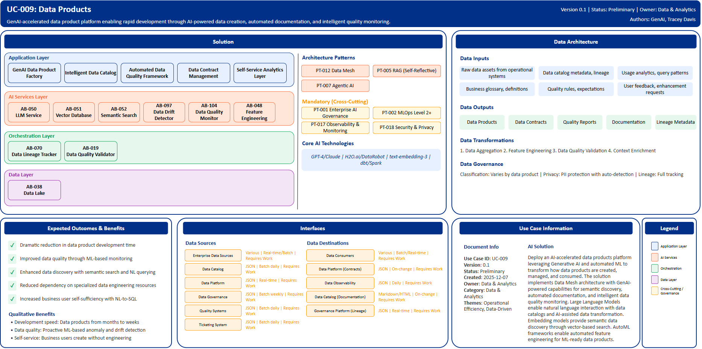

# UC-009: Data Products

## Document Control

| Property | Value |
|----------|-------|
| **Use Case ID** | `UC-009` |
| **Version** | `0.1` |
| **Status** | `Preliminary` |
| **Created Date** | `2025-12-07` |
| **Last Modified** | `2025-12-07` |
| **Owner** | Data & Analytics |
| **Author(s)** | GenAI, Tracey Davis |
| **Product Owner** | TBD |
| **Executive Sponsor** | TBD |

## 1. Executive Summary

### 1.1 Use Case Overview

**One-Line Summary**: 
GenAI-accelerated data product creation platform enabling rapid development, automated documentation, and intelligent quality monitoring.

**Business Problem**:
Data product creation at BNZ is time-consuming and requires specialized data engineering expertise, creating bottlenecks in delivering data to business consumers. Traditional approaches take months from requirements to production-ready data products. Manual schema design and transformation logic development is error-prone. Data quality monitoring relies on manual rule creation that misses emerging data issues. Documentation becomes outdated quickly and requires extensive manual effort. Discovery of existing data assets is difficult across large data estates. Business users depend on data engineers for routine data requests. Data product governance and contract management is manual and inconsistent.

**AI Solution**:
Deploy an AI-accelerated data products platform leveraging Generative AI and automated ML to transform how data products are created, managed, and consumed. The solution implements Data Mesh architecture with GenAI-powered capabilities for semantic discovery, automated documentation, and intelligent data quality monitoring. Large Language Models enable natural language interaction with data catalogs, automated schema inference, and AI-assisted data transformation. Embedding models provide semantic data discovery through vector-based search across catalogs and schemas. AutoML frameworks enable automated feature engineering for ML-ready data products. Data quality ML performs anomaly detection and validation. Knowledge graphs enable semantic understanding of data relationships and lineage. The platform includes GenAI data product factory for natural language specification, intelligent data catalog with semantic search, automated data quality framework with self-healing pipelines, data contract management with AI-assisted generation, and self-service analytics layer. Development time is reduced from months to days through AI acceleration.

**Expected Outcomes**:

- Dramatic reduction in data product development time
- Improved data quality through automated monitoring
- Enhanced data discovery and accessibility
- Reduced dependency on specialized data engineering resources
- Increased business user self-sufficiency with data

### 1.2 Strategic Alignment

**Business Category**: 
Data & Analytics

**Strategic Themes** (select all that apply):

- [ ] Customer Experience Excellence
- [x] Operational Efficiency & Automation
- [ ] Risk & Compliance Excellence
- [x] Data-Driven Decision Making
- [ ] Innovation & Competitive Differentiation

**Alignment Statement**:
This use case directly supports BNZ's Data-Driven Decision Making pillar by democratizing data product creation and enabling rapid delivery of trusted data to business consumers. It drives Operational Efficiency & Automation through GenAI-powered automation of data engineering tasks including schema design, transformation logic, documentation, and quality monitoring. The solution accelerates BNZ's data mesh implementation, enabling domain-oriented data ownership with centralized AI-powered governance and quality assurance.

## 2. Business Case

### 2.1 Business Value

**Value Type** (select all that apply):

- [ ] Revenue Growth
- [x] Cost Reduction
- [ ] Risk Reduction
- [ ] Customer Experience Improvement
- [ ] Regulatory Compliance
- [x] Competitive Advantage

**Qualitative Benefits**:

| Benefit Type | Description | AI Accelerant | Evidence / Indicator |
|--------------|----------|--------|--------|
| Development speed | Data product development time dramatically reduced from months to days | GenAI generates schema, transformations, and tests from natural language requirements; automated code generation for pipelines | Time to production, development cycle time, backlog size |
| Data quality | Proactive identification of data quality issues before impacting consumers | ML-based anomaly detection monitors drift; automated expectation generation from patterns | Data quality incidents, consumer complaints, SLA breaches |
| Data discovery | Enhanced findability and understanding of existing data assets | Semantic search using embeddings; automated metadata enrichment; natural language catalog querying | Time to find data, reusable asset discovery, duplicate data product reduction |
| Self-service enablement | Business users create and consume data products without engineering dependency | Natural language to SQL; automated visualization; AI-assisted data transformation | Self-service adoption rate, engineering request volume, time to insight |
| Governance automation | Automated data contract management and compliance monitoring | AI-assisted contract generation; automated compatibility checking; impact analysis | Contract completeness, schema evolution incidents, compliance adherence |

## 3. Target State Solution

### 3.1 Solution Overview

**AI/ML Approach**:
The platform leverages Generative AI and automated ML to transform data product lifecycle management. Large Language Models (GPT-4, Claude) enable natural language to SQL conversion, automated schema inference, and AI-assisted data transformation specification. Embedding models (text-embedding-3) provide semantic data discovery through vector-based search across data catalogs and schemas. AutoML frameworks (H2O.ai, DataRobot) enable automated feature engineering creating ML-ready data products. Data quality ML models perform anomaly detection identifying data drift and quality issues proactively. Knowledge graphs enable semantic understanding of data relationships and lineage tracking. NLP classification provides automated metadata extraction, tagging, and categorization of data assets. The solution implements Data Mesh architecture with domain-oriented ownership, federated computational governance, and centralized AI-powered quality assurance. Code generation capabilities create ETL/ELT pipelines in dbt and Spark automatically from business requirements.

**Solution Components**:

1. **GenAI Data Product Factory**: Natural language interface for data product specification, automated schema inference and validation, AI-generated data transformations from business requirements, code generation for ETL/ELT pipelines, automated testing and validation generation
2. **Intelligent Data Catalog**: Semantic search across extensive data assets, automated metadata extraction and enrichment, AI-powered data classification for PII and sensitivity levels, natural language querying of data dictionary, usage analytics and popularity ranking
3. **Automated Data Quality Framework**: ML-based anomaly detection for data drift identification, automated data profiling and statistics generation, expectation generation from historical patterns, real-time quality monitoring with alerting, self-healing data pipelines for common issues
4. **Data Contract Management**: AI-assisted contract generation from schemas, automated compatibility checking for schema evolution, SLA monitoring and prediction, consumer impact analysis for changes, version management with semantic versioning
5. **Self-Service Analytics Layer**: Natural language to SQL for business users, automated visualization recommendations, AI-generated insights and narratives, personalized data recommendations based on role, collaborative data product development

### 3.2 Data Architecture

**Data Inputs**:

| Dataset | Description | Source | Volume | Frequency | Format | Interface Status |
|-----------|--------|-----------|--------|--------------|--------------|--------------|
| Raw data assets | Source data from operational systems | Enterprise Data Sources | Very large | Real-time/Batch | Various | Requires Work |
| Data catalog metadata | Schema definitions, lineage, ownership | Data Catalog | Large | Batch daily | JSON | Requires Work |
| Usage analytics | Query patterns, access logs, performance | Data Platform | Very large | Real-time | JSON | Requires Work |
| Business glossary | Business terms, definitions, mappings | Data Governance | Large | Batch weekly | JSON | Requires Work |
| Quality rules | Existing validation rules and expectations | Quality Systems | Large | Batch daily | JSON/SQL | Requires Work |
| User feedback | Data quality issues, enhancement requests | Ticketing System | Large | Batch daily | JSON | Requires Work |

**Data Transformations**:
1. **Data Aggregation**: Combine data from multiple source systems into unified data product views
2. **Feature Engineering**: AI-generated feature derivation for ML-ready data products using AutoML
3. **Data Quality Validation**: ML-based quality rules automatically generated and applied continuously
4. **Context Enrichment**: Automated metadata enrichment including business glossary terms and semantic tags

**Data Outputs**:

| Dataset | Description | Destination | Volume | Frequency | Format | Interface Status |  |
|-------------|-------------|-------------|--------|-----------|-----------|-----------|-----------|
| Data products | Curated, documented, quality-assured datasets | Data Consumers | Large | Batch/Real-time | Various | Requires Work |  |
| Data contracts | Schema definitions, SLAs, compatibility specs | Data Platform | Large | On-change | JSON | Requires Work |  |
| Quality reports | Data quality scores, anomaly alerts | Data Observability | Large | Daily | JSON | Requires Work |  |
| Documentation | Auto-generated data product documentation | Data Catalog | Large | On-change | Markdown/HTML | Requires Work |  |
| Lineage metadata | End-to-end data lineage and impact analysis | Governance Platform | Large | Real-time | JSON | Requires Work |  |

**Data Quality Requirements**:

- **Accuracy**: Very high accuracy required for data product outputs and metadata
- **Completeness**: No missing critical schema information or lineage tracking
- **Timeliness**: Real-time for operational data products, batch for analytical products
- **Consistency**: Standardized formats across all data products with unified data contracts

**Data Governance**:
- **Classification**: Varies by data product (follows source classification)
- **Retention**: Per regulatory requirements and BNZ data retention policy by data domain
- **Privacy**: PII protection with automated detection and masking, consent management integration
- **Lineage**: Full data lineage from source through transformations to consumption for transparency

### 3.3 Architecture Patterns

**Primary Patterns Used**:

| Pattern ID | Pattern Name | Usage in Use Case |
|-----------|-------------|-------------------|
| [PT-012](../../../../03-building-blocks/patterns/PT-012/PT-012-Data-Mesh-v1.0.0.md) | Data Mesh | Domain-oriented data product architecture |
| [PT-005](../../../../03-building-blocks/patterns/PT-005/PT-005-Retrieval-Augmented-Generation-v1.0.0.md) | Retrieval-Augmented Generation | Semantic data discovery and catalog search |
| [PT-007](../../../../03-building-blocks/patterns/PT-007/PT-007-Agentic-AI-v1.0.0.md) | Agentic AI | Autonomous data quality monitoring and pipeline healing |
| [PT-002](../../../../03-building-blocks/patterns/PT-002/PT-002-MLOps-Level-2-Plus-v1.0.0.md) | MLOps Level 2+ | Automated ML pipeline for data quality models |
| [PT-017](../../../../03-building-blocks/patterns/PT-017/PT-017-Observability-Monitoring-v1.0.0.md) | Observability & Monitoring | Data observability and quality monitoring |
| [PT-001](../../../../03-building-blocks/patterns/PT-001/PT-001-Enterprise-AI-Governance-v1.0.0.md) | Enterprise AI Governance | Data product governance framework |
| [PT-018](../../../../03-building-blocks/patterns/PT-018/PT-018-Security-Privacy-v1.0.0.md) | Security & Privacy | Data product access control and privacy |

**Architecture Building Blocks (ABBs)**:

| ABB ID | ABB Name | Purpose in Use Case | Criticality |
|--------|----------|-------------------|-------------|
| [AB-050](../../../../03-building-blocks/architecture-building-blocks/abbs/AB-050/AB-050-Large-Language-Model-Service-v1.0.0.md) | Large Language Model Service | Natural language data product creation | Critical |
| [AB-051](../../../../03-building-blocks/architecture-building-blocks/abbs/AB-051/AB-051-Vector-Database-v1.0.0.md) | Vector Database | Semantic catalog search embeddings | Critical |
| [AB-052](../../../../03-building-blocks/architecture-building-blocks/abbs/AB-052/AB-052-Semantic-Search-Engine-v1.0.0.md) | Semantic Search Engine | Data asset discovery | Critical |
| [AB-038](../../../../03-building-blocks/architecture-building-blocks/abbs/AB-038/AB-038-Data-Lake-v1.0.0.md) | Data Lake | Centralized data storage | Critical |
| [AB-097](../../../../03-building-blocks/architecture-building-blocks/abbs/AB-097/AB-097-Data-Drift-Detector-v1.0.0.md) | Data Drift Detector | Data quality anomaly detection | Critical |
| [AB-104](../../../../03-building-blocks/architecture-building-blocks/abbs/AB-104/AB-104-Data-Quality-Monitor-v1.0.0.md) | Data Quality Monitor | Continuous quality monitoring | Critical |
| [AB-070](../../../../03-building-blocks/architecture-building-blocks/abbs/AB-070/AB-070-Data-Lineage-Tracker-v1.0.0.md) | Data Lineage Tracker | End-to-end lineage tracking | High |
| [AB-019](../../../../03-building-blocks/architecture-building-blocks/abbs/AB-019/AB-019-Data-Quality-Validator-v1.0.0.md) | Data Quality Validator | Automated validation rules | High |
| [AB-048](../../../../03-building-blocks/architecture-building-blocks/abbs/AB-048/AB-048-Feature-Engineering-Pipeline-v1.0.0.md) | Feature Engineering Pipeline | AutoML feature generation | High |

## 4. Prioritization Scoring

TBD - Prioritization scoring to be completed during portfolio planning.

## 5. Risk Management

TBD - Risk assessment to be completed during detailed planning phase.

## 6. Success Metrics & KPIs

Track business and technical KPIs (details TBD).
