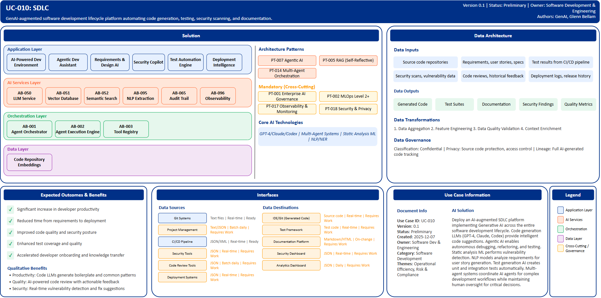

# UC-010: SDLC

## Document Control

| Property | Value |
|----------|-------|
| **Use Case ID** | `UC-010` |
| **Version** | `0.1` |
| **Status** | `Preliminary` |
| **Created Date** | `2025-12-07` |
| **Last Modified** | `2025-12-07` |
| **Owner** | Software Development & Engineering |
| **Author(s)** | GenAI, Glenn Bellam |
| **Product Owner** | TBD |
| **Executive Sponsor** | TBD |

## 1. Executive Summary

### 1.1 Use Case Overview

**One-Line Summary**: 
GenAI-augmented software development lifecycle platform automating code generation, testing, security scanning, and documentation.

**Business Problem**:
Software development at BNZ faces productivity challenges with developers spending significant time on repetitive coding tasks, boilerplate code creation, and documentation. Code review processes are manual and time-consuming. Security vulnerabilities are often discovered late in development cycles. Test creation and maintenance requires substantial effort. Requirements translation to technical specifications involves manual interpretation. Documentation becomes outdated quickly. Developer onboarding and knowledge transfer takes extensive time. Technical debt accumulates as refactoring is deprioritized.

**AI Solution**:
Deploy an AI-augmented SDLC platform implementing Generative AI across the entire software development lifecycle from requirements gathering through deployment and maintenance. The solution combines code generation Large Language Models (GPT-4, Claude, Codex) for intelligent code suggestions and generation from requirements. Agentic AI frameworks enable autonomous multi-step task completion including debugging, refactoring, and testing. Static analysis ML performs AI-powered vulnerability detection and code quality assessment. NLP models analyze requirements for user story generation and acceptance criteria extraction. Test generation AI creates unit tests, integration tests, and test data automatically. Multi-agent systems coordinate AI agents for complex development workflows. The platform includes AI-powered development environment with context-aware code completion, agentic development assistant for autonomous bug diagnosis, requirements and design AI for user story generation, security copilot for vulnerability detection, test automation engine for comprehensive test generation, and deployment intelligence for release automation. Developer productivity improvements are achieved while maintaining human oversight for critical decisions.

**Expected Outcomes**:

- Significant increase in developer productivity
- Reduced time from requirements to deployment
- Improved code quality and security
- Enhanced test coverage and quality
- Accelerated developer onboarding and knowledge transfer

### 1.2 Strategic Alignment

**Business Category**: 
Software Development & Engineering

**Strategic Themes** (select all that apply):

- [ ] Customer Experience Excellence
- [x] Operational Efficiency & Automation
- [x] Risk & Compliance Excellence
- [ ] Data-Driven Decision Making
- [ ] Innovation & Competitive Differentiation

**Alignment Statement**:
This use case directly supports BNZ's Operational Efficiency & Automation pillar by leveraging GenAI to automate repetitive software development tasks, code generation, testing, and documentation, enabling developers to focus on high-value problem solving. It supports Risk & Compliance Excellence through AI-powered security vulnerability detection, automated compliance checking, and comprehensive test coverage. The solution accelerates BNZ's digital transformation by improving software delivery velocity while maintaining quality and security standards.

## 2. Business Case

### 2.1 Business Value

**Value Type** (select all that apply):

- [ ] Revenue Growth
- [x] Cost Reduction
- [x] Risk Reduction
- [ ] Customer Experience Improvement
- [ ] Regulatory Compliance
- [ ] Competitive Advantage

**Qualitative Benefits**:

| Benefit Type | Description | AI Accelerant | Evidence / Indicator |
|--------------|----------|--------|--------|
| Developer productivity | Substantial increase in code output and feature delivery velocity | Code LLMs generate boilerplate and common patterns; agentic AI automates debugging and refactoring | Lines of code per developer, feature delivery time, velocity metrics |
| Code quality | Improved software quality through automated review and best practice enforcement | AI-powered code review with actionable feedback; real-time quality suggestions; refactoring recommendations | Code quality scores, defect density, technical debt metrics |
| Security posture | Earlier vulnerability detection and remediation | Static analysis ML detects vulnerabilities in real-time; security copilot provides fix suggestions | Vulnerabilities found in development vs production, remediation time |
| Test coverage | Comprehensive automated test generation increasing confidence | AI generates unit tests, integration tests, and test data from code changes | Test coverage percentage, regression rate, test creation time |
| Onboarding speed | Faster developer onboarding and knowledge transfer | AI-generated code explanations; automated documentation; intelligent code search | Time to productivity, onboarding duration, knowledge retention |

## 3. Target State Solution

### 3.1 Solution Overview

**AI/ML Approach**:
The platform implements Generative AI across the entire software development lifecycle. Code generation Large Language Models (GPT-4, Claude, Codex) provide intelligent code suggestions and generation from natural language requirements with context awareness across files and repositories. Agentic AI frameworks enable autonomous multi-step task completion including bug diagnosis, code refactoring, test generation, and documentation updates. Static analysis ML models perform AI-powered security vulnerability detection, code quality assessment, and compliance checking integrated into IDE and CI/CD pipelines. NLP models analyze requirements documents and user stories for acceptance criteria extraction and technical specification generation. Test generation AI creates comprehensive unit tests, integration tests, and realistic test data automatically from code changes. Multi-agent systems coordinate specialized AI agents for complex development workflows including feature implementation, code review, testing, and deployment. The solution maintains human oversight for architectural decisions and critical code paths while automating repetitive tasks.

**Solution Components**:

1. **AI-Powered Development Environment**: Intelligent code completion with context awareness achieving high acceptance rates, natural language to code generation for common patterns, automated code explanation and documentation, real-time security vulnerability detection, cross-file refactoring with dependency awareness
2. **Agentic Development Assistant**: Autonomous bug diagnosis and fix suggestions, automated code review with actionable feedback, test case generation from code changes, documentation generation synchronized with code, automated PR descriptions and commit messages
3. **Requirements & Design AI**: User story generation from business requirements, acceptance criteria extraction and validation, architecture diagram generation from specifications, API design assistance with OpenAPI generation, data model design from business entities
4. **Security Copilot**: Real-time vulnerability scanning in IDE integrated workflows, AI-explained security findings with remediation guidance, Automated dependency vulnerability management, Compliance checking for coding standards and regulatory requirements, Secret detection and exposure prevention
5. **Test Automation Engine**: Comprehensive unit test generation from code, Integration test scenario creation, Realistic test data generation, Mutation testing for test quality validation, Visual regression testing for UI components
6. **Deployment Intelligence**: Automated release note generation, Deployment risk assessment and rollback recommendations, Infrastructure as code generation, Performance regression prediction, Automated runbook generation for operations

### 3.2 Data Architecture

**Data Inputs**:

| Dataset | Description | Source | Volume | Frequency | Format | Interface Status |
|-----------|--------|-----------|--------|--------------|--------------|--------------|
| Source code | Application code repositories | Git Systems | Very large | Real-time | Text files | Ready |
| Requirements | User stories, specifications, business requirements | Project Management | Large | Batch daily | Text/JSON | Requires Work |
| Test results | Unit, integration, and system test outcomes | CI/CD Pipeline | Very large | Real-time | JSON/XML | Ready |
| Security scans | Vulnerability assessment results | Security Tools | Large | Real-time | JSON | Requires Work |
| Code reviews | Historical review comments and feedback | Code Review Tools | Large | Batch daily | JSON | Requires Work |
| Deployment logs | Release history, incidents, rollbacks | Deployment Systems | Very large | Real-time | JSON | Requires Work |

**Data Transformations**:
1. **Data Aggregation**: Combine code, tests, requirements, and reviews into unified development context
2. **Feature Engineering**: Calculate code complexity metrics, test coverage scores, security risk indicators
3. **Data Quality Validation**: Validate code syntax, test completeness, documentation accuracy
4. **Context Enrichment**: Add historical patterns, team conventions, architecture context to AI assistance

**Data Outputs**:

| Dataset | Description | Destination | Volume | Frequency | Format | Interface Status |  |
|-------------|-------------|-------------|--------|-----------|-----------|-----------|-----------|
| Generated code | AI-generated code suggestions and implementations | IDE/Git | Very large | Real-time | Source code | Requires Work |  |
| Test suites | Auto-generated test cases and data | Test Framework | Very large | Real-time | Test code | Requires Work |  |
| Documentation | Auto-generated technical documentation | Documentation Platform | Large | On-change | Markdown/HTML | Requires Work |  |
| Security findings | Vulnerability reports with remediation | Security Dashboard | Large | Real-time | JSON | Requires Work |  |
| Quality metrics | Code quality, coverage, technical debt metrics | Analytics Dashboard | Large | Daily | JSON | Requires Work |  |

**Data Quality Requirements**:

- **Accuracy**: Very high accuracy required for generated code and security findings
- **Completeness**: No missing critical code context or dependency information
- **Timeliness**: Real-time for IDE assistance, batch acceptable for reporting
- **Consistency**: Standardized code formatting and documentation structure

**Data Governance**:
- **Classification**: Confidential (contains proprietary source code and intellectual property)
- **Retention**: Per software development lifecycle policy and audit requirements
- **Privacy**: Source code protection, access control by team and project
- **Lineage**: Full tracking of AI-generated code for audit and quality assurance

### 3.3 Architecture Patterns

**Primary Patterns Used**:

| Pattern ID | Pattern Name | Usage in Use Case |
|-----------|-------------|-------------------|
| [PT-007](../../../../03-building-blocks/patterns/PT-007/PT-007-Agentic-AI-v1.0.0.md) | Agentic AI | Autonomous development task completion |
| [PT-005](../../../../03-building-blocks/patterns/PT-005/PT-005-Retrieval-Augmented-Generation-v1.0.0.md) | Retrieval-Augmented Generation | Code search and knowledge retrieval |
| [PT-014](../../../../03-building-blocks/patterns/PT-014/PT-014-Multi-Agent-Orchestration-v1.0.0.md) | Multi-Agent Orchestration | Coordinated development workflow agents |
| [PT-002](../../../../03-building-blocks/patterns/PT-002/PT-002-MLOps-Level-2-Plus-v1.0.0.md) | MLOps Level 2+ | Continuous improvement of AI code models |
| [PT-017](../../../../03-building-blocks/patterns/PT-017/PT-017-Observability-Monitoring-v1.0.0.md) | Observability & Monitoring | Development metrics and AI performance |
| [PT-001](../../../../03-building-blocks/patterns/PT-001/PT-001-Enterprise-AI-Governance-v1.0.0.md) | Enterprise AI Governance | AI-generated code governance |
| [PT-018](../../../../03-building-blocks/patterns/PT-018/PT-018-Security-Privacy-v1.0.0.md) | Security & Privacy | Source code and IP protection |

**Architecture Building Blocks (ABBs)**:

| ABB ID | ABB Name | Purpose in Use Case | Criticality |
|--------|----------|-------------------|-------------|
| [AB-050](../../../../03-building-blocks/architecture-building-blocks/abbs/AB-050/AB-050-Large-Language-Model-Service-v1.0.0.md) | Large Language Model Service | Code generation and assistance | Critical |
| [AB-051](../../../../03-building-blocks/architecture-building-blocks/abbs/AB-051/AB-051-Vector-Database-v1.0.0.md) | Vector Database | Code search and retrieval embeddings | High |
| [AB-052](../../../../03-building-blocks/architecture-building-blocks/abbs/AB-052/AB-052-Semantic-Search-Engine-v1.0.0.md) | Semantic Search Engine | Intelligent code search | High |
| [AB-001](../../../../03-building-blocks/architecture-building-blocks/abbs/AB-001/AB-001-Agent-Orchestrator-v1.0.0.md) | Agent Orchestrator | Multi-agent development workflow | Critical |
| [AB-002](../../../../03-building-blocks/architecture-building-blocks/abbs/AB-002/AB-002-Agent-Execution-Engine-v1.0.0.md) | Agent Execution Engine | Autonomous task execution | Critical |
| [AB-003](../../../../03-building-blocks/architecture-building-blocks/abbs/AB-003/AB-003-Tool-Registry-v1.0.0.md) | Tool Registry | Development tool integration | High |
| [AB-095](../../../../03-building-blocks/architecture-building-blocks/abbs/AB-095/AB-095-NLP-Extraction-Engine-v1.0.0.md) | NLP Extraction Engine | Requirements analysis | High |
| [AB-096](../../../../03-building-blocks/architecture-building-blocks/abbs/AB-096/AB-096-Observability-Platform-v1.0.0.md) | Observability Platform | Development metrics monitoring | High |
| [AB-065](../../../../03-building-blocks/architecture-building-blocks/abbs/AB-065/AB-065-Audit-Trail-and-Logging-v1.0.0.md) | Audit Trail & Logging | AI code generation tracking | High |

## 4. Prioritization Scoring

TBD - Prioritization scoring to be completed during portfolio planning.

## 5. Risk Management

TBD - Risk assessment to be completed during detailed planning phase.

## 6. Success Metrics & KPIs

Track business and technical KPIs (details TBD).
