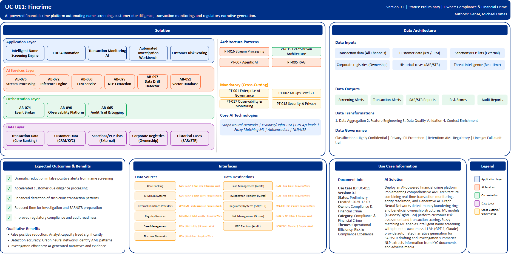

# UC-011: Fincrime

## Document Control

| Property | Value |
|----------|-------|
| **Use Case ID** | `UC-011` |
| **Version** | `0.1` |
| **Status** | `Preliminary` |
| **Created Date** | `2025-12-07` |
| **Last Modified** | `2025-12-07` |
| **Owner** | Compliance & Financial Crime |
| **Author(s)** | GenAI, Michael Lomas |
| **Product Owner** | TBD |
| **Executive Sponsor** | TBD |

## 1. Executive Summary

### 1.1 Use Case Overview

**One-Line Summary**: 
AI-powered financial crime platform automating name screening, customer due diligence, transaction monitoring, and regulatory narrative generation.

**Business Problem**:
Financial crime compliance operations face challenges with traditional name screening systems generating high volumes of false positive alerts requiring manual review. Customer due diligence processes including OCDD (Ongoing Customer Due Diligence) and ECDD (Enhanced Customer Due Diligence) are labor-intensive, involving manual adverse media searches and document review. Transaction monitoring rules produce alert volumes that overwhelm investigation teams. Suspicious Activity Report (SAR) and Suspicious Transaction Report (STR) narrative writing is time-consuming and inconsistent. Complex beneficial ownership structures and money laundering networks are difficult to visualize and analyze. Regulatory reporting deadlines create pressure on compliance teams. False negatives risk significant regulatory penalties and reputational damage.

**AI Solution**:
Deploy an AI-powered financial crime platform implementing comprehensive anti-money laundering and compliance architecture combining real-time transaction monitoring, entity resolution, and Generative AI for case investigation automation. The solution uses Graph Neural Networks for network analysis detecting money laundering rings and beneficial ownership structures. Machine learning models (XGBoost/LightGBM) perform customer risk assessment and transaction scoring. Fuzzy matching ML enables intelligent name screening against sanctions and PEP lists with phonetic and transliteration awareness. Large Language Models (GPT-4, Claude) provide automated narrative generation for SAR/STR drafting and investigation summaries. Unsupervised learning discovers novel suspicious patterns. NLP and Named Entity Recognition extract information from KYC documents and adverse media. The platform includes intelligent name screening engine significantly reducing false positives, Enhanced Due Diligence automation for adverse media summarization and beneficial ownership extraction, transaction monitoring AI with behavioral analytics and network analysis, automated investigation workbench with AI-generated narratives, and customer risk scoring with dynamic profiling.

**Expected Outcomes**:

- Dramatic reduction in false positive alerts from name screening
- Accelerated customer due diligence processing
- Enhanced detection of suspicious transaction patterns
- Reduced time for investigation and SAR/STR preparation
- Improved regulatory compliance and audit readiness

### 1.2 Strategic Alignment

**Business Category**: 
Compliance & Financial Crime

**Strategic Themes** (select all that apply):

- [ ] Customer Experience Excellence
- [x] Operational Efficiency & Automation
- [x] Risk & Compliance Excellence
- [ ] Data-Driven Decision Making
- [ ] Innovation & Competitive Differentiation

**Alignment Statement**:
This use case directly supports BNZ's Risk & Compliance Excellence pillar by deploying advanced AI/ML capabilities for superior financial crime detection while reducing false positives and investigation time. It enables Operational Efficiency & Automation through intelligent name screening, automated due diligence, and AI-generated regulatory narratives that reduce manual workload. The solution ensures BNZ meets stringent AML/CFT regulatory requirements while optimizing compliance operations efficiency.

## 2. Business Case

### 2.1 Business Value

**Value Type** (select all that apply):

- [ ] Revenue Growth
- [x] Cost Reduction
- [x] Risk Reduction
- [x] Customer Experience Improvement
- [x] Regulatory Compliance
- [ ] Competitive Advantage

**Qualitative Benefits**:

| Benefit Type | Description | AI Accelerant | Evidence / Indicator |
|--------------|----------|--------|--------|
| False positive reduction | Substantial decrease in false positive name screening alerts freeing analyst capacity | ML-powered fuzzy matching with phonetic awareness; risk-based thresholds by segment; automated clear match disposition | False positive rate, alert review time, analyst productivity |
| Due diligence speed | Accelerated customer due diligence processing for faster onboarding | AI-powered adverse media search and summarization; automated beneficial ownership extraction; GenAI-generated EDD narratives | Due diligence cycle time, customer onboarding time, documentation quality |
| Detection accuracy | Enhanced identification of suspicious activity patterns and networks | Graph neural networks identify money laundering networks; behavioral analytics detect anomalies; unsupervised ML finds novel patterns | Detection rate, SAR quality, regulatory findings |
| Investigation efficiency | Reduced time for case investigation and regulatory reporting | AI-powered investigation narratives; automated evidence assembly; SAR/STR auto-drafting with field population | Investigation time per case, SAR preparation time, submission quality |
| Regulatory compliance | Improved audit readiness and regulatory examination outcomes | Comprehensive audit trail; consistent documentation; automated quality assurance; full transaction monitoring | Regulatory examination findings, audit issues, compliance confidence |

## 3. Target State Solution

### 3.1 Solution Overview

**AI/ML Approach**:
The platform implements comprehensive AML and compliance architecture using multiple AI/ML techniques. Graph Neural Networks perform network analysis identifying money laundering rings, smurfing patterns, and complex beneficial ownership structures across entities and transactions. Gradient boosting models (XGBoost/LightGBM) provide customer risk assessment and transaction scoring with high accuracy. Fuzzy matching ML enables intelligent name screening with phonetic similarity, transliteration handling, and contextual matching reducing false positives significantly. Large Language Models (GPT-4, Claude) generate investigation narratives, EDD summaries, and SAR/STR reports with regulatory field population automatically. Unsupervised learning including autoencoders and isolation forests discovers novel suspicious patterns not captured by rules. NLP and Named Entity Recognition extract structured information from unstructured KYC documents, adverse media articles, and beneficial ownership registries. Behavioral analytics establish customer transaction baselines enabling anomaly detection. The solution provides real-time and batch transaction monitoring, dynamic threshold optimization, and automated investigation support.

**Solution Components**:

1. **Intelligent Name Screening Engine**: ML-powered fuzzy matching with phonetic and transliteration awareness, real-time screening against global sanctions and PEP lists, configurable risk-based thresholds by customer segment, automated false positive disposition for clear matches, significant reduction in false positives
2. **Enhanced Due Diligence (EDD) Automation**: AI-powered adverse media search and summarization, automated beneficial ownership extraction from corporate registries, source of wealth and funds verification using document AI, risk-based EDD trigger detection, GenAI-generated EDD narratives for analyst review
3. **Transaction Monitoring AI Platform**: Real-time and batch monitoring across all payment channels, ML models detecting structuring and layering patterns, behavioral analytics establishing customer transaction baselines, network analysis identifying coordinated suspicious activity, dynamic threshold optimization reducing alert fatigue
4. **Automated Investigation Workbench**: Case aggregation across related alerts and entities, AI-powered investigation narrative generation, evidence package assembly with document citations, SAR/STR auto-drafting with regulatory field population, quality assurance scoring before submission
5. **Customer Risk Scoring**: Continuous risk profiling incorporating transaction patterns and relationship networks, automated risk rating updates triggering due diligence requirements, segment-specific risk factors and thresholds, explainable risk scores for regulatory transparency, proactive high-risk customer identification

### 3.2 Data Architecture

**Data Inputs**:

| Dataset | Description | Source | Volume | Frequency | Format | Interface Status |
|-----------|--------|-----------|--------|--------------|--------------|--------------|
| Transaction data | Payment transactions across all channels | Core Banking | Very large | Real-time | JSON via API | Requires Work |
| Customer data | KYC information, profiles, relationships | CRM/KYC Systems | Large | Batch daily | JSON via API | Requires Work |
| Sanctions lists | Global sanctions, PEP, adverse media lists | External Providers | Large | Daily updates | CSV/JSON | Requires Work |
| Corporate registries | Beneficial ownership, company structures | Registry Services | Large | Batch weekly | JSON/XML | Requires Work |
| Historical cases | Prior SAR/STR filings and investigations | Case Management | Large | Batch daily | JSON | Requires Work |
| External intelligence | Threat intelligence, typology updates | Fincrime Networks | Streaming | Real-time | JSON | Requires Work |

**Data Transformations**:
1. **Data Aggregation**: Combine transactions, customer data, and external intelligence into unified view
2. **Feature Engineering**: Calculate transaction velocity, network features, behavioral patterns for ML models
3. **Data Quality Validation**: Validate transaction completeness, customer data accuracy for reliable detection
4. **Context Enrichment**: Add sanctions list matches, risk indicators, relationship network context to transactions

**Data Outputs**:

| Dataset | Description | Destination | Volume | Frequency | Format | Interface Status |  |
|-------------|-------------|-------------|--------|-----------|-----------|-----------|-----------|
| Screening alerts | Name screening match alerts with risk scores | Case Management | Large | Real-time | JSON | Requires Work |  |
| Transaction alerts | Suspicious activity alerts with evidence | Investigation Platform | Large | Real-time | JSON | Requires Work |  |
| SAR/STR reports | Regulatory filings with supporting documentation | Regulatory Systems | Streaming | On-trigger | XML/PDF | Requires Work |  |
| Risk scores | Customer and transaction risk assessments | Risk Management | Large | Daily | JSON via API | Requires Work |  |
| Audit reports | Compliance metrics, case histories | GRC Platform | Large | Monthly | JSON/PDF | Requires Work |  |

**Data Quality Requirements**:

- **Accuracy**: Very high accuracy required for transaction and customer data to ensure reliable detection
- **Completeness**: No missing critical transaction or KYC information for comprehensive monitoring
- **Timeliness**: Real-time for transaction monitoring, daily updates for customer risk profiles
- **Consistency**: Standardized formats across all payment channels and customer touchpoints

**Data Governance**:
- **Classification**: Highly confidential (contains customer PII, financial transactions, investigation details)
- **Retention**: Per AML regulatory requirements for transaction and case history
- **Privacy**: PII protection with strict access controls, regulatory disclosure requirements
- **Lineage**: Full audit trail from transactions through detection to regulatory filing for compliance

### 3.3 Architecture Patterns

**Primary Patterns Used**:

| Pattern ID | Pattern Name | Usage in Use Case |
|-----------|-------------|-------------------|
| [PT-016](../../../../03-building-blocks/patterns/PT-016/PT-016-Stream-Processing-v1.0.0.md) | Stream Processing | Real-time transaction monitoring |
| [PT-015](../../../../03-building-blocks/patterns/PT-015/PT-015-Event-Driven-Architecture-v1.0.0.md) | Event-Driven Architecture | Alert generation and case workflow |
| [PT-007](../../../../03-building-blocks/patterns/PT-007/PT-007-Agentic-AI-v1.0.0.md) | Agentic AI | Autonomous investigation and narrative generation |
| [PT-005](../../../../03-building-blocks/patterns/PT-005/PT-005-Retrieval-Augmented-Generation-v1.0.0.md) | Retrieval-Augmented Generation | Adverse media search and SAR generation |
| [PT-017](../../../../03-building-blocks/patterns/PT-017/PT-017-Observability-Monitoring-v1.0.0.md) | Observability & Monitoring | Compliance monitoring and alerting |
| [PT-001](../../../../03-building-blocks/patterns/PT-001/PT-001-Enterprise-AI-Governance-v1.0.0.md) | Enterprise AI Governance | AML AI model governance |
| [PT-018](../../../../03-building-blocks/patterns/PT-018/PT-018-Security-Privacy-v1.0.0.md) | Security & Privacy | Customer data and investigation protection |
| [PT-002](../../../../03-building-blocks/patterns/PT-002/PT-002-MLOps-Level-2-Plus-v1.0.0.md) | MLOps Level 2+ | Continuous model improvement for detection |

**Architecture Building Blocks (ABBs)**:

| ABB ID | ABB Name | Purpose in Use Case | Criticality |
|--------|----------|-------------------|-------------|
| [AB-075](../../../../03-building-blocks/architecture-building-blocks/abbs/AB-075/AB-075-Stream-Processing-Engine-v1.0.0.md) | Stream Processing Engine | Real-time transaction monitoring | Critical |
| [AB-072](../../../../03-building-blocks/architecture-building-blocks/abbs/AB-072/AB-072-Inference-Engine-v1.0.0.md) | Inference Engine | Transaction and customer risk scoring | Critical |
| [AB-050](../../../../03-building-blocks/architecture-building-blocks/abbs/AB-050/AB-050-Large-Language-Model-Service-v1.0.0.md) | Large Language Model Service | Narrative generation and EDD automation | Critical |
| [AB-095](../../../../03-building-blocks/architecture-building-blocks/abbs/AB-095/AB-095-NLP-Extraction-Engine-v1.0.0.md) | NLP Extraction Engine | KYC document and adverse media extraction | High |
| [AB-051](../../../../03-building-blocks/architecture-building-blocks/abbs/AB-051/AB-051-Vector-Database-v1.0.0.md) | Vector Database | Adverse media and entity embeddings | High |
| [AB-052](../../../../03-building-blocks/architecture-building-blocks/abbs/AB-052/AB-052-Semantic-Search-Engine-v1.0.0.md) | Semantic Search Engine | Intelligent adverse media search | High |
| [AB-097](../../../../03-building-blocks/architecture-building-blocks/abbs/AB-097/AB-097-Data-Drift-Detector-v1.0.0.md) | Data Drift Detector | Behavioral anomaly detection | Critical |
| [AB-074](../../../../03-building-blocks/architecture-building-blocks/abbs/AB-074/AB-074-Event-Broker-v1.0.0.md) | Event Broker | Alert and case event streaming | Critical |
| [AB-096](../../../../03-building-blocks/architecture-building-blocks/abbs/AB-096/AB-096-Observability-Platform-v1.0.0.md) | Observability Platform | Compliance dashboards | High |
| [AB-065](../../../../03-building-blocks/architecture-building-blocks/abbs/AB-065/AB-065-Audit-Trail-and-Logging-v1.0.0.md) | Audit Trail & Logging | Full audit trail for regulatory compliance | Critical |

## 4. Prioritization Scoring

TBD - Prioritization scoring to be completed during portfolio planning.

## 5. Risk Management

TBD - Risk assessment to be completed during detailed planning phase.

## 6. Success Metrics & KPIs

Track business and technical KPIs (details TBD).
