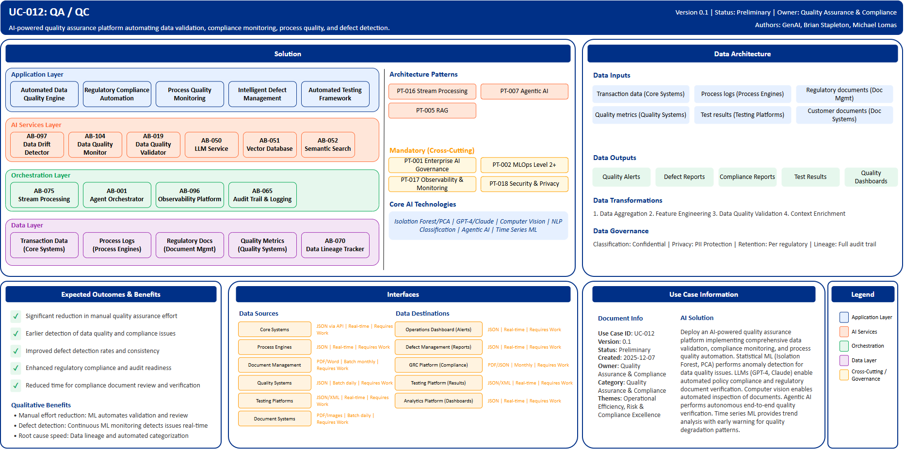

# UC-012: QA/QC

## Document Control

| Property | Value |
|----------|-------|
| **Use Case ID** | `UC-012` |
| **Version** | `0.1` |
| **Status** | `Preliminary` |
| **Created Date** | `2025-12-07` |
| **Last Modified** | `2025-12-07` |
| **Owner** | Quality Assurance & Compliance |
| **Author(s)** | GenAI, Brian Stapleton, Michael Lomas |
| **Product Owner** | TBD |
| **Executive Sponsor** | TBD |

## 1. Executive Summary

### 1.1 Use Case Overview

**One-Line Summary**: 
AI-powered quality assurance platform automating data validation, compliance monitoring, process quality, and defect detection.

**Business Problem**:
Quality assurance and compliance operations at BNZ rely heavily on manual inspection and validation processes that are time-consuming and error-prone. Data quality issues are often discovered late in processing pipelines causing downstream system failures. Regulatory compliance document review requires specialized expertise and extensive manual effort. Process quality monitoring depends on sampling approaches that miss systemic issues. Defect detection and categorization is inconsistent across teams. Audit preparation involves manual evidence collection. Quality metrics and trend analysis lack real-time visibility. Root cause analysis for quality issues is time-intensive. Manual testing coverage is incomplete leaving gaps in quality verification.

**AI Solution**:
Deploy an AI-powered quality assurance platform implementing comprehensive data validation, compliance monitoring, and process quality automation using ML-based anomaly detection, Generative AI for documentation review, and agentic AI for autonomous testing. The solution combines statistical ML (Isolation Forest, PCA) for anomaly detection identifying data quality issues and process deviations. Large Language Models (GPT-4, Claude) enable automated policy compliance and regulatory document verification. NLP classification provides automated defect categorization and routing. Computer vision enables automated inspection of documents, signatures, and forms. Agentic AI performs autonomous end-to-end quality verification workflows. Time series ML provides trend analysis with early warning for quality degradation patterns. The platform includes automated data quality engine with ML-based anomaly detection, regulatory compliance automation with LLM-powered document review, process quality monitoring with predictive alerts, intelligent defect management with automated classification, and automated testing framework with agentic test execution.

**Expected Outcomes**:

- Significant reduction in manual quality assurance effort
- Earlier detection of data quality and compliance issues
- Improved defect detection rates and consistency
- Enhanced regulatory compliance and audit readiness
- Reduced time for compliance document review and verification

### 1.2 Strategic Alignment

**Business Category**: 
Quality Assurance & Compliance

**Strategic Themes** (select all that apply):

- [ ] Customer Experience Excellence
- [x] Operational Efficiency & Automation
- [x] Risk & Compliance Excellence
- [ ] Data-Driven Decision Making
- [ ] Innovation & Competitive Differentiation

**Alignment Statement**:
This use case directly supports BNZ's Risk & Compliance Excellence pillar by deploying AI/ML capabilities for automated compliance verification, regulatory document review, and comprehensive quality monitoring ensuring adherence to banking regulations. It drives Operational Efficiency & Automation through ML-powered data quality validation, automated defect detection, and agentic testing reducing manual QA workload while improving coverage and consistency.

## 2. Business Case

### 2.1 Business Value

**Value Type** (select all that apply):

- [ ] Revenue Growth
- [x] Cost Reduction
- [x] Risk Reduction
- [ ] Customer Experience Improvement
- [x] Regulatory Compliance
- [ ] Competitive Advantage

**Qualitative Benefits**:

| Benefit Type | Description | AI Accelerant | Evidence / Indicator |
|--------------|----------|--------|--------|
| Manual effort reduction | Substantial decrease in manual quality assurance and validation activities | ML anomaly detection automates data validation; LLMs review regulatory documents; agentic AI executes tests | QA team capacity, manual review hours, automation coverage |
| Defect detection | Earlier and more comprehensive identification of quality issues | Continuous ML-based monitoring detects issues in real-time; computer vision inspects all documents vs sampling | Defect escape rate, mean time to detection, production incidents |
| Compliance assurance | Enhanced regulatory compliance and audit readiness | LLM-powered document review against regulations; automated evidence collection; gap analysis | Regulatory findings, audit issues, compliance confidence |
| Process quality | Improved process consistency and performance | Process mining with ML bottleneck detection; predictive SLA monitoring; trend analysis with early warnings | SLA breaches, process cycle time, quality metrics trends |
| Root cause speed | Faster identification and resolution of quality issues | Data lineage tracking; automated defect categorization; self-healing pipelines for common issues | Root cause analysis time, issue resolution time, recurrence rate |

## 3. Target State Solution

### 3.1 Solution Overview

**AI/ML Approach**:
The platform implements comprehensive quality assurance automation using multiple AI/ML techniques. Statistical ML models including Isolation Forest and PCA perform anomaly detection identifying data quality issues and process deviations across all data pipelines. Large Language Models (GPT-4, Claude) enable automated document review verifying policy compliance and regulatory requirements, performing gap analysis between procedures and regulations. NLP classification provides automated defect categorization and intelligent routing of quality issues to appropriate teams. Computer vision models perform automated inspection of documents, signatures, forms, and images replacing manual visual verification. Agentic AI executes autonomous end-to-end quality verification workflows including test case generation, execution, and result analysis. Time series ML analyzes quality metrics trends providing early warning indicators for quality degradation patterns. The solution provides schema drift detection, data lineage tracking for root cause analysis, self-healing pipelines, and predictive SLA monitoring.

**Solution Components**:

1. **Automated Data Quality Engine**: ML-based anomaly detection across all data pipelines, statistical validation rules with adaptive thresholds, schema drift detection and alerting, data lineage tracking for root cause analysis, self-healing pipelines for common quality issues
2. **Regulatory Compliance Automation**: LLM-powered document review against regulatory requirements, automated policy compliance checking, gap analysis between procedures and regulations, evidence collection for audit preparation, regulatory change impact assessment
3. **Process Quality Monitoring**: Real-time SLA monitoring with predictive alerts, process mining with ML-powered bottleneck detection, quality trend analysis with early warning indicators, automated root cause analysis, performance dashboards with actionable insights
4. **Intelligent Defect Management**: Automated defect detection and classification, Severity and priority scoring using ML, Defect clustering and pattern analysis, Predictive defect prevention recommendations, Integration with development and operations workflows
5. **Automated Testing Framework**: Agentic AI for autonomous test execution, AI-generated test cases from requirements, Visual regression testing using computer vision, Test data generation and management, Self-healing test scripts adapting to application changes

### 3.2 Data Architecture

**Data Inputs**:

| Dataset | Description | Source | Volume | Frequency | Format | Interface Status |
|-----------|--------|-----------|--------|--------------|--------------|--------------|
| Transaction data | Business transaction records for validation | Core Systems | Very large | Real-time | JSON via API | Requires Work |
| Process logs | Workflow execution logs and audit trails | Process Engines | Very large | Real-time | JSON | Requires Work |
| Regulatory documents | Policies, procedures, compliance requirements | Document Management | Large | Batch monthly | PDF/Word | Requires Work |
| Quality metrics | Historical quality KPIs and defect data | Quality Systems | Large | Batch daily | JSON | Requires Work |
| Test results | Automated and manual test outcomes | Testing Platforms | Very large | Real-time | JSON/XML | Requires Work |
| Customer documents | Forms, applications, identification documents | Document Systems | Very large | Batch daily | PDF/Images | Requires Work |

**Data Transformations**:
1. **Data Aggregation**: Combine quality metrics, process logs, and defect data into unified quality view
2. **Feature Engineering**: Calculate statistical features, trend indicators, anomaly scores for ML models
3. **Data Quality Validation**: Meta-validation ensuring quality of quality data itself
4. **Context Enrichment**: Add regulatory requirements, business context, historical patterns to quality analysis

**Data Outputs**:

| Dataset | Description | Destination | Volume | Frequency | Format | Interface Status |  |
|-------------|-------------|-------------|--------|-----------|-----------|-----------|-----------|
| Quality alerts | Data quality and compliance issue alerts | Operations Dashboard | Large | Real-time | JSON | Requires Work |  |
| Defect reports | Automated defect detection and classification | Defect Management | Large | Real-time | JSON | Requires Work |  |
| Compliance reports | Regulatory compliance assessment results | GRC Platform | Large | Monthly | PDF/JSON | Requires Work |  |
| Test results | Automated test outcomes and coverage metrics | Testing Platform | Very large | Real-time | JSON/XML | Requires Work |  |
| Quality dashboards | Quality KPIs, trends, predictive insights | Analytics Platform | Large | Real-time | JSON | Requires Work |  |

**Data Quality Requirements**:

- **Accuracy**: Very high accuracy required for quality validation and compliance verification
- **Completeness**: No missing critical quality metrics or compliance documentation
- **Timeliness**: Real-time for operational quality monitoring, batch acceptable for compliance reporting
- **Consistency**: Standardized quality metrics and validation rules across all business processes

**Data Governance**:
- **Classification**: Confidential (contains operational data and compliance information)
- **Retention**: Per regulatory requirements for audit trail and quality records
- **Privacy**: PII protection in quality validation data, secure handling of customer documents
- **Lineage**: Full audit trail from quality detection through remediation for compliance

### 3.3 Architecture Patterns

**Primary Patterns Used**:

| Pattern ID | Pattern Name | Usage in Use Case |
|-----------|-------------|-------------------|
| [PT-016](../../../../03-building-blocks/patterns/PT-016/PT-016-Stream-Processing-v1.0.0.md) | Stream Processing | Real-time data quality monitoring |
| [PT-007](../../../../03-building-blocks/patterns/PT-007/PT-007-Agentic-AI-v1.0.0.md) | Agentic AI | Autonomous testing and quality verification |
| [PT-005](../../../../03-building-blocks/patterns/PT-005/PT-005-Retrieval-Augmented-Generation-v1.0.0.md) | Retrieval-Augmented Generation | Regulatory document retrieval and compliance |
| [PT-017](../../../../03-building-blocks/patterns/PT-017/PT-017-Observability-Monitoring-v1.0.0.md) | Observability & Monitoring | Quality metrics monitoring and alerting |
| [PT-001](../../../../03-building-blocks/patterns/PT-001/PT-001-Enterprise-AI-Governance-v1.0.0.md) | Enterprise AI Governance | Quality AI model governance |
| [PT-002](../../../../03-building-blocks/patterns/PT-002/PT-002-MLOps-Level-2-Plus-v1.0.0.md) | MLOps Level 2+ | Continuous improvement of quality models |
| [PT-018](../../../../03-building-blocks/patterns/PT-018/PT-018-Security-Privacy-v1.0.0.md) | Security & Privacy | Quality data protection |

**Architecture Building Blocks (ABBs)**:

| ABB ID | ABB Name | Purpose in Use Case | Criticality |
|--------|----------|-------------------|-------------|
| [AB-097](../../../../03-building-blocks/architecture-building-blocks/abbs/AB-097/AB-097-Data-Drift-Detector-v1.0.0.md) | Data Drift Detector | Anomaly detection for quality issues | Critical |
| [AB-104](../../../../03-building-blocks/architecture-building-blocks/abbs/AB-104/AB-104-Data-Quality-Monitor-v1.0.0.md) | Data Quality Monitor | Continuous data quality monitoring | Critical |
| [AB-019](../../../../03-building-blocks/architecture-building-blocks/abbs/AB-019/AB-019-Data-Quality-Validator-v1.0.0.md) | Data Quality Validator | Automated validation rules | Critical |
| [AB-050](../../../../03-building-blocks/architecture-building-blocks/abbs/AB-050/AB-050-Large-Language-Model-Service-v1.0.0.md) | Large Language Model Service | Regulatory document review | Critical |
| [AB-051](../../../../03-building-blocks/architecture-building-blocks/abbs/AB-051/AB-051-Vector-Database-v1.0.0.md) | Vector Database | Regulatory requirement embeddings | High |
| [AB-052](../../../../03-building-blocks/architecture-building-blocks/abbs/AB-052/AB-052-Semantic-Search-Engine-v1.0.0.md) | Semantic Search Engine | Policy and regulation search | High |
| [AB-075](../../../../03-building-blocks/architecture-building-blocks/abbs/AB-075/AB-075-Stream-Processing-Engine-v1.0.0.md) | Stream Processing Engine | Real-time quality monitoring | Critical |
| [AB-001](../../../../03-building-blocks/architecture-building-blocks/abbs/AB-001/AB-001-Agent-Orchestrator-v1.0.0.md) | Agent Orchestrator | Agentic testing orchestration | High |
| [AB-096](../../../../03-building-blocks/architecture-building-blocks/abbs/AB-096/AB-096-Observability-Platform-v1.0.0.md) | Observability Platform | Quality dashboards and metrics | High |
| [AB-065](../../../../03-building-blocks/architecture-building-blocks/abbs/AB-065/AB-065-Audit-Trail-and-Logging-v1.0.0.md) | Audit Trail & Logging | Quality audit trail | Critical |
| [AB-070](../../../../03-building-blocks/architecture-building-blocks/abbs/AB-070/AB-070-Data-Lineage-Tracker-v1.0.0.md) | Data Lineage Tracker | Root cause analysis lineage | High |

## 4. Prioritization Scoring

TBD - Prioritization scoring to be completed during portfolio planning.

## 5. Risk Management

TBD - Risk assessment to be completed during detailed planning phase.

## 6. Success Metrics & KPIs

Track business and technical KPIs (details TBD).
