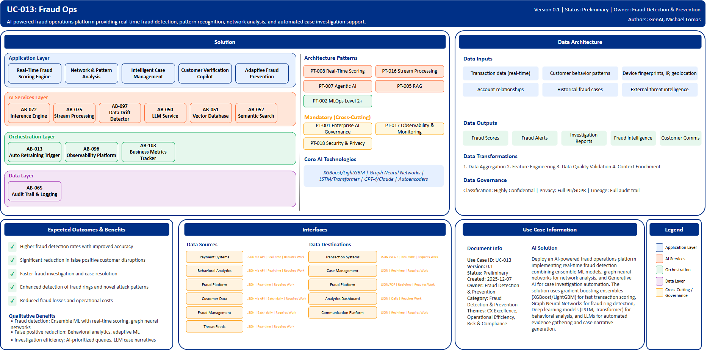

# UC-013: Fraud Ops

## Document Control

| Property | Value |
|----------|-------|
| **Use Case ID** | `UC-013` |
| **Version** | `0.1` |
| **Status** | `Preliminary` |
| **Created Date** | `2025-12-07` |
| **Last Modified** | `2025-12-07` |
| **Owner** | Fraud Detection & Prevention |
| **Author(s)** | GenAI, Michael Lomas |
| **Product Owner** | TBD |
| **Executive Sponsor** | TBD |

## 1. Executive Summary

### 1.1 Use Case Overview

**One-Line Summary**: 
AI-powered fraud operations platform providing real-time fraud detection, pattern recognition, network analysis, and automated case investigation support.

**Business Problem**:
Fraud operations at BNZ face sophisticated fraud attacks that evolve rapidly requiring constant rule updates. Traditional rule-based systems generate high false positive rates disrupting legitimate customer transactions. Fraud investigators manually review extensive transaction histories and relationships consuming significant time. Novel fraud patterns are difficult to detect with existing signature-based approaches. Account takeover and synthetic identity fraud require complex behavioral analysis. Fraud rings and mule networks span multiple accounts challenging manual detection. Case investigation involves manual evidence gathering from multiple systems. Customer friction from declined legitimate transactions impacts satisfaction. Fraud losses and operational costs require balance optimization.

**AI Solution**:
Deploy an AI-powered fraud operations platform implementing real-time fraud detection combining ensemble ML models, graph neural networks for network analysis, and Generative AI for case investigation automation. The solution uses gradient boosting ensembles (XGBoost/LightGBM) for fast transaction scoring across all payment channels achieving high fraud detection rates. Graph Neural Networks perform network analysis identifying fraud rings and coordinated attacks. Deep learning models (LSTM, Transformer) enable behavioral analysis with sequence modeling for unusual transaction patterns. Large Language Models (GPT-4, Claude) provide automated evidence gathering and case narrative generation supporting investigators. Autoencoders perform unsupervised anomaly detection discovering novel fraud patterns. Reinforcement Learning enables adaptive rules that self-optimize based on investigation outcomes. The platform includes real-time fraud scoring engine with device fingerprinting integration, network and pattern analysis platform detecting fraud rings, intelligent case management with AI-prioritized queues, customer verification copilot with behavioral analysis, and adaptive fraud prevention with self-learning rules. Multi-layered detection achieves superior fraud capture while significantly reducing false positives through ML models that learn from investigator decisions.

**Expected Outcomes**:

- Higher fraud detection rates with improved accuracy
- Significant reduction in false positive customer disruptions
- Faster fraud investigation and case resolution
- Enhanced detection of fraud rings and novel attack patterns
- Reduced fraud losses and operational costs

### 1.2 Strategic Alignment

**Business Category**: 
Fraud Detection & Prevention

**Strategic Themes** (select all that apply):

- [x] Customer Experience Excellence
- [x] Operational Efficiency & Automation
- [x] Risk & Compliance Excellence
- [ ] Data-Driven Decision Making
- [ ] Innovation & Competitive Differentiation

**Alignment Statement**:
This use case directly supports BNZ's Risk & Compliance Excellence pillar by deploying advanced AI/ML capabilities for superior fraud detection protecting customers and the bank from financial crime. It enhances Customer Experience Excellence through reduced false positives minimizing friction for legitimate transactions while maintaining strong fraud prevention. The solution drives Operational Efficiency & Automation through AI-powered case investigation, automated evidence gathering, and self-learning fraud models reducing manual investigation workload.

## 2. Business Case

### 2.1 Business Value

**Value Type** (select all that apply):

- [ ] Revenue Growth
- [x] Cost Reduction
- [x] Risk Reduction
- [x] Customer Experience Improvement
- [ ] Regulatory Compliance
- [ ] Competitive Advantage

**Qualitative Benefits**:

| Benefit Type | Description | AI Accelerant | Evidence / Indicator |
|--------------|----------|--------|--------|
| Fraud detection | Superior identification of fraudulent transactions with higher accuracy | Ensemble ML models with real-time scoring; graph neural networks detect fraud rings; autoencoders find novel patterns | Fraud detection rate, true positive rate, fraud losses |
| False positive reduction | Significant decrease in legitimate transactions incorrectly flagged | Behavioral analytics establish customer baselines; adaptive ML learns from investigator feedback; dynamic thresholds | False positive rate, customer complaints, transaction decline rate |
| Investigation efficiency | Faster fraud case investigation and resolution | AI-prioritized investigation queues; automated evidence assembly; LLM-generated case narratives | Investigation time per case, case closure rate, investigator productivity |
| Customer experience | Reduced friction for legitimate customers while maintaining fraud protection | Risk-based authentication reducing challenges for known good customers; rapid fraud decisioning minimizing delays | Customer satisfaction, authentication friction, transaction completion rate |
| Fraud prevention | Proactive prevention of fraud attacks through pattern learning | Reinforcement learning optimizes fraud rules; network analysis identifies emerging threats early | Prevented fraud value, attack vector identification, rule effectiveness |

## 3. Target State Solution

### 3.1 Solution Overview

**AI/ML Approach**:
The platform implements real-time fraud detection using multiple advanced AI/ML techniques. Gradient boosting ensembles (XGBoost/LightGBM) provide fast transaction scoring with sub-second latency across all payment channels. Graph Neural Networks perform network analysis identifying fraud rings, mule networks, and coordinated attacks across accounts and entities. Deep learning models including LSTM and Transformer architectures enable behavioral analysis with sequence modeling detecting unusual transaction patterns. Large Language Models (GPT-4, Claude) provide automated evidence gathering, case summarization, and investigation narrative generation. Autoencoders perform unsupervised anomaly detection discovering novel fraud patterns not captured by supervised models. Reinforcement Learning enables adaptive fraud rules that self-optimize based on investigation outcomes and fraud trends. The solution integrates device fingerprinting, behavioral biometrics, velocity analytics, and cross-channel correlation. Multi-layered detection combines supervised models, unsupervised anomaly detection, rule engines, and network analysis achieving superior fraud capture rates while minimizing false positives.

**Solution Components**:

1. **Real-Time Fraud Scoring Engine**: Sub-second transaction scoring for all payment channels, multi-model ensemble combining specialized fraud models, device fingerprinting and behavioral biometrics integration, dynamic threshold adjustment based on risk context, high fraud detection with minimal customer friction
2. **Network & Pattern Analysis Platform**: Graph analytics detecting fraud rings and mule networks, velocity analytics identifying rapid-fire attacks, cross-channel correlation for multi-vector fraud, synthetic identity detection using ML, account takeover behavioral detection
3. **Intelligent Case Management**: AI-prioritized investigation queue based on fraud likelihood and value, automated evidence package assembly from multiple systems, GenAI-powered case narrative generation, investigation workflow optimization, performance analytics for continuous improvement
4. **Customer Verification Copilot**: Risk-based authentication with step-up verification when needed, Behavioral challenge questions generated by AI, Voice biometric verification integration, Knowledge-based authentication optimization, Customer communication templates for fraud alerts
5. **Adaptive Fraud Prevention**: Self-learning fraud rules updated from investigation outcomes, Reinforcement learning optimizing detection thresholds, Real-time model retraining on new fraud patterns, A/B testing framework for fraud strategies, Fraud trend analysis with predictive intelligence

### 3.2 Data Architecture

**Data Inputs**:

| Dataset | Description | Source | Volume | Frequency | Format | Interface Status |
|-----------|--------|-----------|--------|--------------|--------------|--------------|
| Transaction data | Real-time payment and transfer transactions | Payment Systems | Very large | Real-time | JSON via API | Requires Work |
| Customer behavior | Historical transaction patterns, login activity | Behavioral Analytics | Very large | Real-time | JSON via API | Requires Work |
| Device data | Device fingerprints, IP addresses, geolocation | Fraud Platform | Very large | Real-time | JSON | Requires Work |
| Account relationships | Account linkages, beneficial ownership | Customer Data | Large | Batch daily | JSON via API | Requires Work |
| Historical fraud | Prior fraud cases and investigation outcomes | Fraud Management | Large | Batch daily | JSON | Requires Work |
| External intelligence | Fraud threat intelligence, compromised credentials | Threat Feeds | Streaming | Real-time | JSON | Requires Work |

**Data Transformations**:
1. **Data Aggregation**: Combine transactions, customer behavior, and device data into unified fraud view
2. **Feature Engineering**: Calculate velocity features, network metrics, behavioral anomaly scores for ML models
3. **Data Quality Validation**: Validate transaction completeness and data accuracy for reliable fraud detection
4. **Context Enrichment**: Add historical fraud patterns, relationship networks, threat intelligence to transactions

**Data Outputs**:

| Dataset | Description | Destination | Volume | Frequency | Format | Interface Status |  |
|-------------|-------------|-------------|--------|-----------|-----------|-----------|-----------|
| Fraud scores | Real-time fraud risk scores and decisions | Transaction Systems | Very large | Real-time | JSON via API | Requires Work |  |
| Fraud alerts | High-risk transaction alerts for investigation | Case Management | Large | Real-time | JSON | Requires Work |  |
| Investigation reports | AI-generated case reports with evidence | Fraud Platform | Large | Real-time | JSON/PDF | Requires Work |  |
| Fraud intelligence | Fraud patterns, attack trends, network analysis | Analytics Dashboard | Large | Daily | JSON | Requires Work |  |
| Customer communications | Fraud alert notifications and verification requests | Communication Platform | Large | Real-time | JSON | Requires Work |  |

**Data Quality Requirements**:

- **Accuracy**: Very high accuracy required for transaction and customer data to ensure reliable fraud detection
- **Completeness**: No missing critical transaction or device information for comprehensive fraud analysis
- **Timeliness**: Real-time processing for fraud scoring with minimal latency
- **Consistency**: Standardized formats across all payment channels and customer touchpoints

**Data Governance**:
- **Classification**: Highly confidential (contains customer PII, financial transactions, fraud intelligence)
- **Retention**: Per fraud investigation and regulatory requirements
- **Privacy**: PII protection with strict access controls, fraud case confidentiality
- **Lineage**: Full audit trail from transaction through detection to investigation for compliance

### 3.3 Architecture Patterns

**Primary Patterns Used**:

| Pattern ID | Pattern Name | Usage in Use Case |
|-----------|-------------|-------------------|
| [PT-008](../../../../03-building-blocks/patterns/PT-008/PT-008-Real-Time-Scoring-v1.0.0.md) | Real-Time Scoring | Sub-second fraud transaction scoring |
| [PT-016](../../../../03-building-blocks/patterns/PT-016/PT-016-Stream-Processing-v1.0.0.md) | Stream Processing | Real-time transaction stream analysis |
| [PT-007](../../../../03-building-blocks/patterns/PT-007/PT-007-Agentic-AI-v1.0.0.md) | Agentic AI | Autonomous fraud investigation support |
| [PT-005](../../../../03-building-blocks/patterns/PT-005/PT-005-Retrieval-Augmented-Generation-v1.0.0.md) | Retrieval-Augmented Generation | Evidence retrieval and case narrative generation |
| [PT-002](../../../../03-building-blocks/patterns/PT-002/PT-002-MLOps-Level-2-Plus-v1.0.0.md) | MLOps Level 2+ | Continuous fraud model retraining |
| [PT-017](../../../../03-building-blocks/patterns/PT-017/PT-017-Observability-Monitoring-v1.0.0.md) | Observability & Monitoring | Fraud monitoring and alerting |
| [PT-001](../../../../03-building-blocks/patterns/PT-001/PT-001-Enterprise-AI-Governance-v1.0.0.md) | Enterprise AI Governance | Fraud AI model governance |
| [PT-018](../../../../03-building-blocks/patterns/PT-018/PT-018-Security-Privacy-v1.0.0.md) | Security & Privacy | Fraud data protection |

**Architecture Building Blocks (ABBs)**:

| ABB ID | ABB Name | Purpose in Use Case | Criticality |
|--------|----------|-------------------|-------------|
| [AB-072](../../../../03-building-blocks/architecture-building-blocks/abbs/AB-072/AB-072-Inference-Engine-v1.0.0.md) | Inference Engine | Real-time fraud scoring | Critical |
| [AB-075](../../../../03-building-blocks/architecture-building-blocks/abbs/AB-075/AB-075-Stream-Processing-Engine-v1.0.0.md) | Stream Processing Engine | Transaction stream processing | Critical |
| [AB-097](../../../../03-building-blocks/architecture-building-blocks/abbs/AB-097/AB-097-Data-Drift-Detector-v1.0.0.md) | Data Drift Detector | Behavioral anomaly detection | Critical |
| [AB-050](../../../../03-building-blocks/architecture-building-blocks/abbs/AB-050/AB-050-Large-Language-Model-Service-v1.0.0.md) | Large Language Model Service | Case investigation automation | High |
| [AB-051](../../../../03-building-blocks/architecture-building-blocks/abbs/AB-051/AB-051-Vector-Database-v1.0.0.md) | Vector Database | Fraud pattern embeddings | High |
| [AB-052](../../../../03-building-blocks/architecture-building-blocks/abbs/AB-052/AB-052-Semantic-Search-Engine-v1.0.0.md) | Semantic Search Engine | Evidence and intelligence search | High |
| [AB-013](../../../../03-building-blocks/architecture-building-blocks/abbs/AB-013/AB-013-Automated-Retraining-Trigger-v1.0.0.md) | Automated Retraining Trigger | Fraud model updates on new patterns | Critical |
| [AB-096](../../../../03-building-blocks/architecture-building-blocks/abbs/AB-096/AB-096-Observability-Platform-v1.0.0.md) | Observability Platform | Fraud monitoring dashboards | High |
| [AB-103](../../../../03-building-blocks/architecture-building-blocks/abbs/AB-103/AB-103-Business-Metrics-Tracker-v1.0.0.md) | Business Metrics Tracker | Fraud loss and detection tracking | High |
| [AB-065](../../../../03-building-blocks/architecture-building-blocks/abbs/AB-065/AB-065-Audit-Trail-and-Logging-v1.0.0.md) | Audit Trail & Logging | Fraud investigation audit trail | Critical |

## 4. Prioritization Scoring

TBD - Prioritization scoring to be completed during portfolio planning.

## 5. Risk Management

TBD - Risk assessment to be completed during detailed planning phase.

## 6. Success Metrics & KPIs

Track business and technical KPIs (details TBD).
