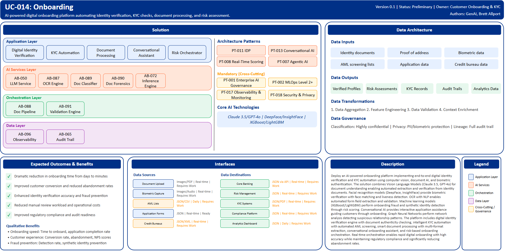

# UC-014: Onboarding

## Document Control

| Property | Value |
|----------|-------|
| **Use Case ID** | `UC-014` |
| **Version** | `0.1` |
| **Status** | `Preliminary` |
| **Created Date** | `2025-12-07` |
| **Last Modified** | `2025-12-07` |
| **Owner** | Customer Onboarding & KYC |
| **Author(s)** | GenAI, Brett Allport |
| **Product Owner** | TBD |
| **Executive Sponsor** | TBD |

## 1. Executive Summary

### 1.1 Use Case Overview

**One-Line Summary**: 
AI-powered digital onboarding platform automating identity verification, KYC checks, document processing, and risk assessment.

**Business Problem**:
Customer onboarding at BNZ requires manual review of identity documents and verification processes creating friction and delays. Traditional approaches take days from application to account activation reducing conversion rates. Manual document review is time-consuming and inconsistent. Identity fraud and synthetic identity creation pose significant risks. KYC (Know Your Customer) compliance requires extensive document collection and verification. Customer abandonment rates are high during lengthy onboarding processes. Manual data entry from documents is error-prone. AML/CFT screening and risk assessment are labor-intensive. Incomplete applications require follow-up creating operational burden. Onboarding capacity constraints limit growth.

**AI Solution**:
Deploy an AI-powered onboarding platform implementing end-to-end digital identity verification and KYC automation using computer vision, document AI, and biometric authentication. The solution combines Vision Language Models (Claude 3.5, GPT-4o) for document understanding enabling automated extraction and verification from identity documents. Facial recognition models (DeepFace, InsightFace) provide biometric verification with face matching and liveness detection. OCR with NLP enables automated form field extraction and validation. Machine learning models (XGBoost/LightGBM) perform onboarding fraud and synthetic identity detection through risk scoring. Conversational AI provides interactive application assistance guiding customers through onboarding. Graph Neural Networks perform network analysis detecting suspicious relationship patterns. The platform includes digital identity verification engine with document authenticity checking, intelligent KYC automation with automated AML screening, smart document processing with multi-format extraction, conversational onboarding assistant, and risk-based onboarding orchestration. Real-time orchestration enables rapid digital onboarding with high accuracy while maintaining regulatory compliance and significantly reducing abandonment rates.

**Expected Outcomes**:

- Dramatic reduction in onboarding time from days to minutes
- Improved customer conversion and reduced abandonment rates
- Enhanced identity verification accuracy and fraud prevention
- Reduced manual review workload and operational costs
- Improved regulatory compliance and audit readiness

### 1.2 Strategic Alignment

**Business Category**: 
Customer Onboarding & KYC

**Strategic Themes** (select all that apply):

- [x] Customer Experience Excellence
- [x] Operational Efficiency & Automation
- [x] Risk & Compliance Excellence
- [ ] Data-Driven Decision Making
- [ ] Innovation & Competitive Differentiation

**Alignment Statement**:
This use case directly supports BNZ's Customer Experience Excellence pillar by delivering fast, seamless digital onboarding reducing friction and abandonment while providing superior customer experience. It drives Operational Efficiency & Automation through AI-powered document processing, automated KYC verification, and intelligent risk assessment eliminating manual review bottlenecks. The solution supports Risk & Compliance Excellence through enhanced identity fraud detection, automated AML/CFT screening, and comprehensive audit trails ensuring regulatory compliance.

## 2. Business Case

### 2.1 Business Value

**Value Type** (select all that apply):

- [x] Revenue Growth
- [x] Cost Reduction
- [x] Risk Reduction
- [x] Customer Experience Improvement
- [x] Regulatory Compliance
- [ ] Competitive Advantage

**Qualitative Benefits**:

| Benefit Type | Description | AI Accelerant | Evidence / Indicator |
|--------------|----------|--------|--------|
| Onboarding speed | Dramatic reduction in time from application to account activation | Vision Language Models extract document data instantly; automated KYC checks complete rapidly; real-time risk assessment | Time to onboard, application completion rate, customer satisfaction |
| Customer experience | Seamless digital onboarding experience increasing conversion | Conversational AI guides customers; instant verification eliminates delays; mobile-first experience | Conversion rate, abandonment rate, NPS scores |
| Fraud prevention | Enhanced detection of identity fraud and synthetic identities | ML risk scoring identifies suspicious patterns; facial recognition with liveness detection; graph analysis detects networks | Fraud detection rate, synthetic identity prevention, false acceptance rate |
| Operational efficiency | Significant reduction in manual document review and verification workload | Automated document extraction and verification; intelligent KYC automation; exception handling prioritization | Manual review hours, cost per onboarding, staff productivity |
| Compliance assurance | Improved regulatory compliance and audit trail completeness | Automated AML/CFT screening; comprehensive documentation; consistent verification standards | Regulatory findings, audit issues, compliance confidence |

## 3. Target State Solution

### 3.1 Solution Overview

**AI/ML Approach**:
The platform implements end-to-end digital identity verification and KYC automation using advanced computer vision and NLP. Vision Language Models (Claude 3.5, GPT-4o) provide document understanding enabling extraction and verification from passports, driver's licenses, utility bills, and various identity documents across multiple countries. Facial recognition models (DeepFace, InsightFace) perform biometric verification with face matching achieving high accuracy and liveness detection preventing presentation attacks. OCR combined with NLP enables automated form field extraction, validation, and data normalization. Gradient boosting models (XGBoost/LightGBM) perform risk scoring identifying onboarding fraud and synthetic identity attempts. Conversational AI provides interactive application assistance with natural language understanding guiding customers through complex onboarding steps. Graph Neural Networks analyze relationship networks detecting suspicious patterns and coordinated fraud. The solution provides real-time orchestration with decision engines routing applications based on risk, automated AML/CFT screening integration, and intelligent exception handling prioritizing manual review when needed.

**Solution Components**:

1. **Digital Identity Verification Engine**: AI-powered document authenticity verification for extensive document types, real-time face matching with high accuracy, liveness detection preventing presentation attacks, multi-factor biometric verification including face and voice, support for numerous document types across many countries
2. **Intelligent KYC Automation**: Automated data extraction from identity documents and forms, Real-time AML/CFT screening against sanctions and PEP lists, Risk-based due diligence workflow automation, Source of wealth and funds verification, Automated adverse media screening with AI summarization
3. **Smart Document Processing**: Multi-format document extraction including PDF and images, Intelligent data validation with consistency checking, Auto-classification of document types, Quality assessment and resubmission requests, Secure document storage with encryption
4. **Conversational Onboarding Assistant**: Natural language application guidance, Context-aware help and clarifications, Document upload assistance with real-time feedback, Progress tracking and completion nudges, Multi-language support for diverse customers
5. **Risk-Based Onboarding Orchestration**: Dynamic onboarding flow based on risk profile, Automated straight-through processing for low-risk applications, Intelligent escalation for manual review, Fraud prevention with real-time alerts, Compliance workflow integration

### 3.2 Data Architecture

**Data Inputs**:

| Dataset | Description | Source | Volume | Frequency | Format | Interface Status |
|-----------|--------|-----------|--------|--------------|--------------|--------------|
| Identity documents | Passports, driver's licenses, ID cards | Customer Upload | Large | Real-time | Images/PDF | Requires Work |
| Proof of address | Utility bills, bank statements | Customer Upload | Large | Real-time | Images/PDF | Requires Work |
| Biometric data | Facial images, voice samples | Capture Apps | Large | Real-time | Images/Audio | Requires Work |
| AML screening lists | Sanctions, PEP, adverse media lists | External Providers | Large | Daily updates | JSON/CSV | Requires Work |
| Application data | Customer-provided information | Application Forms | Large | Real-time | JSON | Ready |
| Credit bureau data | Credit history and verification | Credit Bureaus | Large | Real-time | JSON/XML | Requires Work |

**Data Transformations**:
1. **Data Aggregation**: Combine document data, biometrics, and application information into unified customer profile
2. **Feature Engineering**: Calculate risk features, identity verification confidence scores, document authenticity indicators
3. **Data Quality Validation**: Validate extracted data consistency, completeness checks, cross-verification
4. **Context Enrichment**: Add AML screening results, credit bureau information, risk intelligence to applications

**Data Outputs**:

| Dataset | Description | Destination | Volume | Frequency | Format | Interface Status |  |
|-------------|-------------|-------------|--------|-----------|-----------|-----------|-----------|
| Verified profiles | Completed customer profiles with verification status | Core Banking | Large | Real-time | JSON via API | Requires Work |  |
| Risk assessments | Onboarding fraud risk scores and decisions | Risk Management | Large | Real-time | JSON | Requires Work |  |
| KYC records | Compliance documentation and verification evidence | KYC Systems | Large | Real-time | JSON/PDF | Requires Work |  |
| Audit trails | Complete onboarding process logs | Compliance Platform | Large | Real-time | JSON | Requires Work |  |
| Analytics data | Onboarding metrics, conversion funnels | Analytics Dashboard | Large | Daily | JSON | Requires Work |  |

**Data Quality Requirements**:

- **Accuracy**: Very high accuracy required for identity verification and document extraction
- **Completeness**: No missing critical KYC information or verification evidence
- **Timeliness**: Real-time processing for immediate onboarding decisions
- **Consistency**: Standardized verification standards across all customer segments and channels

**Data Governance**:
- **Classification**: Highly confidential (contains customer PII, identity documents, biometric data)
- **Retention**: Per regulatory requirements for KYC and identity verification records
- **Privacy**: PII protection with encryption, biometric data handling per privacy regulations, consent management
- **Lineage**: Full audit trail from document submission through verification to account activation

### 3.3 Architecture Patterns

**Primary Patterns Used**:

| Pattern ID | Pattern Name | Usage in Use Case |
|-----------|-------------|-------------------|
| [PT-011](../../../../03-building-blocks/patterns/PT-011/PT-011-Intelligent-Document-Processing-v1.0.0.md) | Intelligent Document Processing | Identity document extraction and verification |
| [PT-013](../../../../03-building-blocks/patterns/PT-013/PT-013-Conversational-AI-v1.0.0.md) | Conversational AI | Interactive onboarding assistance |
| [PT-008](../../../../03-building-blocks/patterns/PT-008/PT-008-Real-Time-Scoring-v1.0.0.md) | Real-Time Scoring | Onboarding fraud risk assessment |
| [PT-007](../../../../03-building-blocks/patterns/PT-007/PT-007-Agentic-AI-v1.0.0.md) | Agentic AI | Autonomous KYC verification workflow |
| [PT-017](../../../../03-building-blocks/patterns/PT-017/PT-017-Observability-Monitoring-v1.0.0.md) | Observability & Monitoring | Onboarding metrics and monitoring |
| [PT-001](../../../../03-building-blocks/patterns/PT-001/PT-001-Enterprise-AI-Governance-v1.0.0.md) | Enterprise AI Governance | Identity verification AI governance |
| [PT-018](../../../../03-building-blocks/patterns/PT-018/PT-018-Security-Privacy-v1.0.0.md) | Security & Privacy | Biometric and PII data protection |

**Architecture Building Blocks (ABBs)**:

| ABB ID | ABB Name | Purpose in Use Case | Criticality |
|--------|----------|-------------------|-------------|
| [AB-087](../../../../03-building-blocks/architecture-building-blocks/abbs/AB-087/AB-087-OCR-Engine-v1.0.0.md) | OCR Engine | Document text extraction | Critical |
| [AB-088](../../../../03-building-blocks/architecture-building-blocks/abbs/AB-088/AB-088-Document-Processing-Pipeline-v1.0.0.md) | Document Processing Pipeline | End-to-end document workflow | Critical |
| [AB-089](../../../../03-building-blocks/architecture-building-blocks/abbs/AB-089/AB-089-Document-Classification-Engine-v1.0.0.md) | Document Classification Engine | Document type identification | High |
| [AB-072](../../../../03-building-blocks/architecture-building-blocks/abbs/AB-072/AB-072-Inference-Engine-v1.0.0.md) | Inference Engine | Fraud risk scoring | Critical |
| [AB-050](../../../../03-building-blocks/architecture-building-blocks/abbs/AB-050/AB-050-Large-Language-Model-Service-v1.0.0.md) | Large Language Model Service | Vision Language Model for documents | Critical |
| [AB-030](../../../../03-building-blocks/architecture-building-blocks/abbs/AB-030/AB-030-Intent-Classifier-v1.0.0.md) | Intent Classifier | Conversational assistant intent | High |
| [AB-031](../../../../03-building-blocks/architecture-building-blocks/abbs/AB-031/AB-031-Response-Generator-v1.0.0.md) | Response Generator | Onboarding guidance responses | High |
| [AB-090](../../../../03-building-blocks/architecture-building-blocks/abbs/AB-090/AB-090-Document-Forensics-Engine-v1.0.0.md) | Document Forensics Engine | Document authenticity verification | Critical |
| [AB-091](../../../../03-building-blocks/architecture-building-blocks/abbs/AB-091/AB-091-Validation-Engine-v1.0.0.md) | Validation Engine | Data validation and consistency | High |
| [AB-096](../../../../03-building-blocks/architecture-building-blocks/abbs/AB-096/AB-096-Observability-Platform-v1.0.0.md) | Observability Platform | Onboarding metrics dashboards | High |
| [AB-065](../../../../03-building-blocks/architecture-building-blocks/abbs/AB-065/AB-065-Audit-Trail-and-Logging-v1.0.0.md) | Audit Trail & Logging | Complete onboarding audit trail | Critical |

## 4. Prioritization Scoring

TBD - Prioritization scoring to be completed during portfolio planning.

## 5. Risk Management

TBD - Risk assessment to be completed during detailed planning phase.

## 6. Success Metrics & KPIs

Track business and technical KPIs (details TBD).
