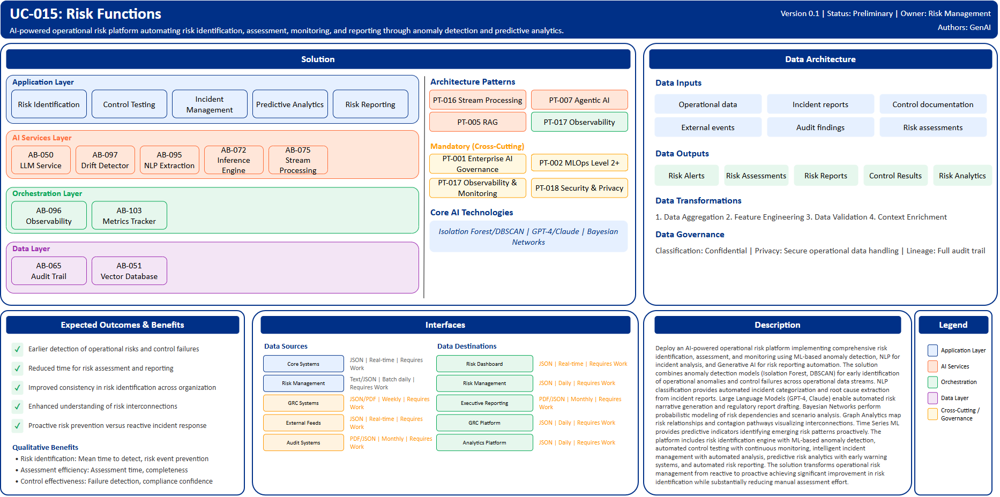

# UC-015: Risk Functions

## Document Control

| Property | Value |
|----------|-------|
| **Use Case ID** | `UC-015` |
| **Version** | `0.1` |
| **Status** | `Preliminary` |
| **Created Date** | `2025-12-07` |
| **Last Modified** | `2025-12-07` |
| **Owner** | Risk Management |
| **Author(s)** | GenAI |
| **Product Owner** | TBD |
| **Executive Sponsor** | TBD |

## 1. Executive Summary

### 1.1 Use Case Overview

**One-Line Summary**: 
AI-powered operational risk platform automating risk identification, assessment, monitoring, and reporting through anomaly detection and predictive analytics.

**Business Problem**:
Operational risk management at BNZ relies on manual processes for risk identification, assessment, and monitoring creating delays in detecting emerging risks. Traditional approaches are reactive discovering risks after incidents occur rather than preventing them. Manual risk assessments are time-consuming and inconsistent across the organization. Control testing is sampling-based missing systematic control failures. Incident analysis requires extensive manual investigation and categorization. Risk reporting and regulatory submissions involve significant manual effort. Interconnections between risks are difficult to visualize and assess. Early warning signals are missed in high volumes of operational data. Risk quantification relies on historical data missing emerging risk patterns.

**AI Solution**:
Deploy an AI-powered operational risk platform implementing comprehensive risk identification, assessment, and monitoring using ML-based anomaly detection, NLP for incident analysis, and Generative AI for risk reporting automation. The solution combines anomaly detection models (Isolation Forest, DBSCAN) for early identification of operational anomalies and control failures across operational data streams. NLP classification provides automated incident categorization and root cause extraction from incident reports. Large Language Models (GPT-4, Claude) enable automated risk narrative generation and regulatory report drafting. Bayesian Networks perform probabilistic modeling of risk dependencies and scenario analysis. Graph Analytics map risk relationships and contagion pathways visualizing interconnections. Time Series ML provides predictive indicators identifying emerging risk patterns proactively. The platform includes risk identification engine with ML-based anomaly detection, automated control testing with continuous monitoring, intelligent incident management with automated analysis, predictive risk analytics with early warning systems, and automated risk reporting. The solution transforms operational risk management from reactive to proactive achieving significant improvement in risk identification while substantially reducing manual assessment effort.

**Expected Outcomes**:

- Earlier detection of operational risks and control failures
- Reduced time for risk assessment and reporting
- Improved consistency in risk identification across organization
- Enhanced understanding of risk interconnections
- Proactive risk prevention versus reactive incident response

### 1.2 Strategic Alignment

**Business Category**: 
Risk Management

**Strategic Themes** (select all that apply):

- [ ] Customer Experience Excellence
- [x] Operational Efficiency & Automation
- [x] Risk & Compliance Excellence
- [x] Data-Driven Decision Making
- [ ] Innovation & Competitive Differentiation

**Alignment Statement**:
This use case directly supports BNZ's Risk & Compliance Excellence pillar by deploying AI/ML capabilities for proactive operational risk identification, automated control monitoring, and comprehensive risk assessment ensuring robust risk management. It enables Data-Driven Decision Making through predictive risk analytics, scenario modeling, and risk interconnection analysis providing insights for strategic risk decisions. The solution drives Operational Efficiency & Automation through automated risk reporting, incident analysis, and continuous control testing reducing manual risk management workload.

## 2. Business Case

### 2.1 Business Value

**Value Type** (select all that apply):

- [ ] Revenue Growth
- [x] Cost Reduction
- [x] Risk Reduction
- [ ] Customer Experience Improvement
- [x] Regulatory Compliance
- [ ] Competitive Advantage

**Qualitative Benefits**:

| Benefit Type | Description | AI Accelerant | Evidence / Indicator |
|--------------|----------|--------|--------|
| Risk identification | Earlier and more comprehensive detection of operational risks | ML anomaly detection monitors all operational data streams continuously; pattern recognition identifies emerging risks | Mean time to detect risks, risk event prevention, near-miss identification |
| Assessment efficiency | Significant reduction in manual risk assessment effort | Automated incident categorization and analysis; AI-generated risk narratives; continuous control monitoring | Assessment time per risk, manual review hours, assessment completeness |
| Control effectiveness | Improved monitoring and testing of operational controls | Continuous automated control testing vs sampling; drift detection for control degradation; effectiveness scoring | Control failure detection, audit findings, compliance confidence |
| Risk reporting | Faster and more consistent risk reporting and regulatory submissions | LLM-generated risk reports and narratives; automated regulatory report drafting; standardized documentation | Reporting cycle time, report quality, regulatory submission timeliness |
| Risk interconnection visibility | Enhanced understanding of risk dependencies and contagion pathways | Graph analytics visualize risk networks; Bayesian modeling quantifies dependencies; scenario analysis assesses cascading impacts | Risk concentration identification, contagion assessment, scenario planning quality |

## 3. Target State Solution

### 3.1 Solution Overview

**AI/ML Approach**:
The platform implements comprehensive operational risk management using multiple AI/ML techniques. Anomaly detection models including Isolation Forest and DBSCAN perform unsupervised monitoring across operational data streams identifying unusual patterns indicating potential risks or control failures. NLP classification models provide automated incident categorization, severity assessment, and root cause extraction from incident reports and near-miss documentation. Large Language Models (GPT-4, Claude) enable automated generation of risk narratives, assessment summaries, and regulatory reports with consistent structure and terminology. Bayesian Networks perform probabilistic risk modeling quantifying dependencies between risks and enabling scenario analysis. Graph Analytics map complex risk relationships, control effectiveness networks, and potential contagion pathways. Time Series ML analyzes operational metrics providing early warning indicators and predictive signals for emerging risk patterns. The solution provides continuous monitoring, real-time alerting, automated control testing, and integrated risk reporting with full audit trails.

**Solution Components**:

1. **Risk Identification Engine**: ML-based anomaly detection across operational data streams, pattern recognition for emerging risk indicators, control effectiveness monitoring with drift detection, external event correlation including market and cyber threats, early warning system with configurable thresholds
2. **Automated Control Testing**: Continuous control monitoring versus traditional sampling, Effectiveness scoring with trend analysis, Exception identification and prioritization, Control remediation tracking, Audit readiness documentation
3. **Intelligent Incident Management**: Automated incident categorization and severity assessment, Root cause analysis using NLP, Similar incident pattern matching, Corrective action recommendation, Lessons learned extraction and sharing
4. **Predictive Risk Analytics**: Emerging risk pattern detection, Scenario modeling and stress testing, Risk concentration analysis, Leading indicator dashboards, Monte Carlo simulation for risk quantification
5. **Automated Risk Reporting**: GenAI-powered risk narrative generation, Regulatory report automation for compliance submissions, Board and executive reporting with visualizations, Risk dashboard with real-time metrics, Audit trail and evidence management

### 3.2 Data Architecture

**Data Inputs**:

| Dataset | Description | Source | Volume | Frequency | Format | Interface Status |
|-----------|--------|-----------|--------|--------------|--------------|--------------|
| Operational data | Transaction logs, system events, process metrics | Core Systems | Very large | Real-time | JSON | Requires Work |
| Incident reports | Historical incidents, near-misses, losses | Risk Management | Large | Batch daily | Text/JSON | Requires Work |
| Control documentation | Control descriptions, test results, effectiveness | GRC Systems | Large | Batch weekly | JSON/PDF | Requires Work |
| External events | Market events, cyber threats, regulatory changes | External Feeds | Streaming | Real-time | JSON | Requires Work |
| Audit findings | Internal and external audit results | Audit Systems | Large | Batch monthly | PDF/JSON | Requires Work |
| Risk assessments | Historical risk assessments and scores | Risk Platform | Large | Batch weekly | JSON | Requires Work |

**Data Transformations**:
1. **Data Aggregation**: Combine operational data, incidents, and control information into unified risk view
2. **Feature Engineering**: Calculate risk indicators, control metrics, trend features for ML models
3. **Data Quality Validation**: Validate incident completeness, control documentation accuracy
4. **Context Enrichment**: Add business context, external events, historical patterns to risk analysis

**Data Outputs**:

| Dataset | Description | Destination | Volume | Frequency | Format | Interface Status |  |
|-------------|-------------|-------------|--------|-----------|-----------|-----------|-----------|
| Risk alerts | Emerging risk and control failure alerts | Risk Dashboard | Large | Real-time | JSON | Requires Work |  |
| Risk assessments | AI-assisted risk assessment results | Risk Management | Large | Daily | JSON | Requires Work |  |
| Risk reports | Automated risk narratives and summaries | Executive Reporting | Large | Monthly | PDF/JSON | Requires Work |  |
| Control test results | Automated control testing outcomes | GRC Platform | Large | Daily | JSON | Requires Work |  |
| Risk analytics | Risk metrics, trends, predictive insights | Analytics Platform | Large | Daily | JSON | Requires Work |  |

**Data Quality Requirements**:

- **Accuracy**: Very high accuracy required for risk identification and control monitoring
- **Completeness**: No missing critical incident information or control test data
- **Timeliness**: Real-time for risk alerting, batch acceptable for reporting
- **Consistency**: Standardized risk categorization and assessment methodology

**Data Governance**:
- **Classification**: Confidential (contains operational risk and control information)
- **Retention**: Per regulatory requirements for operational risk records
- **Privacy**: Secure handling of operational data, incident confidentiality
- **Lineage**: Full audit trail from risk identification through assessment to reporting

### 3.3 Architecture Patterns

**Primary Patterns Used**:

| Pattern ID | Pattern Name | Usage in Use Case |
|-----------|-------------|-------------------|
| [PT-016](../../../../03-building-blocks/patterns/PT-016/PT-016-Stream-Processing-v1.0.0.md) | Stream Processing | Real-time operational data monitoring |
| [PT-007](../../../../03-building-blocks/patterns/PT-007/PT-007-Agentic-AI-v1.0.0.md) | Agentic AI | Autonomous risk assessment and control testing |
| [PT-005](../../../../03-building-blocks/patterns/PT-005/PT-005-Retrieval-Augmented-Generation-v1.0.0.md) | Retrieval-Augmented Generation | Risk report generation with historical context |
| [PT-017](../../../../03-building-blocks/patterns/PT-017/PT-017-Observability-Monitoring-v1.0.0.md) | Observability & Monitoring | Risk metrics monitoring and alerting |
| [PT-001](../../../../03-building-blocks/patterns/PT-001/PT-001-Enterprise-AI-Governance-v1.0.0.md) | Enterprise AI Governance | Risk AI model governance |
| [PT-002](../../../../03-building-blocks/patterns/PT-002/PT-002-MLOps-Level-2-Plus-v1.0.0.md) | MLOps Level 2+ | Continuous improvement of risk models |
| [PT-018](../../../../03-building-blocks/patterns/PT-018/PT-018-Security-Privacy-v1.0.0.md) | Security & Privacy | Risk data protection |

**Architecture Building Blocks (ABBs)**:

| ABB ID | ABB Name | Purpose in Use Case | Criticality |
|--------|----------|-------------------|-------------|
| [AB-097](../../../../03-building-blocks/architecture-building-blocks/abbs/AB-097/AB-097-Data-Drift-Detector-v1.0.0.md) | Data Drift Detector | Operational anomaly detection | Critical |
| [AB-075](../../../../03-building-blocks/architecture-building-blocks/abbs/AB-075/AB-075-Stream-Processing-Engine-v1.0.0.md) | Stream Processing Engine | Real-time operational data processing | Critical |
| [AB-050](../../../../03-building-blocks/architecture-building-blocks/abbs/AB-050/AB-050-Large-Language-Model-Service-v1.0.0.md) | Large Language Model Service | Risk report generation | Critical |
| [AB-095](../../../../03-building-blocks/architecture-building-blocks/abbs/AB-095/AB-095-NLP-Extraction-Engine-v1.0.0.md) | NLP Extraction Engine | Incident analysis and categorization | High |
| [AB-051](../../../../03-building-blocks/architecture-building-blocks/abbs/AB-051/AB-051-Vector-Database-v1.0.0.md) | Vector Database | Risk knowledge embeddings | High |
| [AB-052](../../../../03-building-blocks/architecture-building-blocks/abbs/AB-052/AB-052-Semantic-Search-Engine-v1.0.0.md) | Semantic Search Engine | Historical risk pattern search | High |
| [AB-096](../../../../03-building-blocks/architecture-building-blocks/abbs/AB-096/AB-096-Observability-Platform-v1.0.0.md) | Observability Platform | Risk dashboards and monitoring | High |
| [AB-103](../../../../03-building-blocks/architecture-building-blocks/abbs/AB-103/AB-103-Business-Metrics-Tracker-v1.0.0.md) | Business Metrics Tracker | Risk KPI tracking | High |
| [AB-065](../../../../03-building-blocks/architecture-building-blocks/abbs/AB-065/AB-065-Audit-Trail-and-Logging-v1.0.0.md) | Audit Trail & Logging | Risk audit trail | Critical |
| [AB-072](../../../../03-building-blocks/architecture-building-blocks/abbs/AB-072/AB-072-Inference-Engine-v1.0.0.md) | Inference Engine | Risk scoring and prediction | Critical |

## 4. Prioritization Scoring

TBD - Prioritization scoring to be completed during portfolio planning.

## 5. Risk Management

TBD - Risk assessment to be completed during detailed planning phase.

## 6. Success Metrics & KPIs

Track business and technical KPIs (details TBD).
