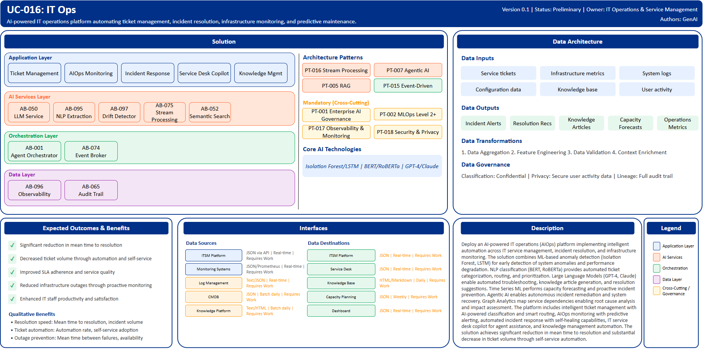

# UC-016: IT Ops

## Document Control

| Property | Value |
|----------|-------|
| **Use Case ID** | `UC-016` |
| **Version** | `0.1` |
| **Status** | `Preliminary` |
| **Created Date** | `2025-12-07` |
| **Last Modified** | `2025-12-07` |
| **Owner** | IT Operations & Service Management |
| **Author(s)** | GenAI |
| **Product Owner** | TBD |
| **Executive Sponsor** | TBD |

## 1. Executive Summary

### 1.1 Use Case Overview

**One-Line Summary**: 
AI-powered IT operations platform automating ticket management, incident resolution, infrastructure monitoring, and predictive maintenance.

**Business Problem**:
IT operations at BNZ face challenges with high volumes of service tickets requiring manual triage and routing. Incident resolution times are lengthy due to manual troubleshooting processes. Service desk agents spend significant time on repetitive tier-1 inquiries. Ticket classification and prioritization is inconsistent impacting SLA adherence. Infrastructure monitoring relies on threshold-based alerts generating alert fatigue from false positives. Root cause analysis is time-consuming requiring manual correlation across systems. Knowledge management is fragmented with documentation becoming outdated. Capacity planning is reactive rather than proactive. System outages impact business operations and customer experience.

**AI Solution**:
Deploy an AI-powered IT operations (AIOps) platform implementing intelligent automation across IT service management, incident resolution, and infrastructure monitoring. The solution combines ML-based anomaly detection (Isolation Forest, LSTM) for early detection of system anomalies and performance degradation. NLP classification (BERT, RoBERTa) provides automated ticket categorization, routing, and prioritization. Large Language Models (GPT-4, Claude) enable automated troubleshooting, knowledge article generation, and resolution suggestions. Time Series ML performs capacity forecasting and proactive incident prevention. Agentic AI enables autonomous incident remediation and system recovery. Graph Analytics map service dependencies enabling root cause analysis and impact assessment. The platform includes intelligent ticket management with AI-powered classification and smart routing, AIOps monitoring with predictive alerting, automated incident response with self-healing capabilities, IT service desk copilot for agent assistance, and knowledge management automation. The solution achieves significant reduction in mean time to resolution and substantial decrease in ticket volume through self-service automation.

**Expected Outcomes**:

- Significant reduction in mean time to resolution
- Decreased ticket volume through automation and self-service
- Improved SLA adherence and service quality
- Reduced infrastructure outages through proactive monitoring
- Enhanced IT staff productivity and satisfaction

### 1.2 Strategic Alignment

**Business Category**: 
IT Operations & Service Management

**Strategic Themes** (select all that apply):

- [ ] Customer Experience Excellence
- [x] Operational Efficiency & Automation
- [ ] Risk & Compliance Excellence
- [ ] Data-Driven Decision Making
- [ ] Innovation & Competitive Differentiation

**Alignment Statement**:
This use case directly supports BNZ's Operational Efficiency & Automation pillar by deploying AIOps capabilities for intelligent ticket management, automated incident resolution, and proactive infrastructure monitoring significantly reducing manual IT operations workload. The solution improves service delivery quality through faster incident resolution, predictive maintenance preventing outages, and enhanced knowledge management enabling IT teams to focus on strategic initiatives.

## 2. Business Case

### 2.1 Business Value

**Value Type** (select all that apply):

- [ ] Revenue Growth
- [x] Cost Reduction
- [x] Risk Reduction
- [ ] Customer Experience Improvement
- [ ] Regulatory Compliance
- [ ] Competitive Advantage

**Qualitative Benefits**:

| Benefit Type | Description | AI Accelerant | Evidence / Indicator |
|--------------|----------|--------|--------|
| Resolution speed | Substantial reduction in mean time to resolution for incidents | Automated troubleshooting with LLM-powered resolution suggestions; agentic AI performs autonomous remediation; knowledge retrieval accelerates diagnosis | Mean time to resolution, incident volume, resolution rate |
| Ticket automation | Significant decrease in manual ticket handling through self-service and automation | NLP classification routes tickets intelligently; duplicate detection reduces redundancy; automated responses handle common inquiries | Ticket volume, automation rate, self-service adoption |
| Outage prevention | Proactive identification and prevention of system failures | Anomaly detection identifies issues early; predictive analytics forecast capacity needs; time series ML predicts failures | Mean time between failures, outage duration, availability |
| Agent productivity | Enhanced IT staff efficiency through intelligent assistance | Service desk copilot provides instant answers; automated knowledge search; resolution recommendation | Agent productivity, handle time, knowledge search time |
| Knowledge management | Improved documentation quality and accessibility | Automated knowledge article generation from resolutions; outdated content identification; intelligent knowledge search | Knowledge base freshness, article usage, knowledge gaps |

## 3. Target State Solution

### 3.1 Solution Overview

**AI/ML Approach**:
The platform implements intelligent automation across IT service management using multiple AI/ML techniques. Anomaly detection models including Isolation Forest and LSTM perform unsupervised monitoring of infrastructure metrics identifying system anomalies and performance degradation before user impact. NLP classification models (BERT, RoBERTa) provide automated ticket categorization, sentiment analysis, and intelligent routing based on content understanding. Large Language Models (GPT-4, Claude) enable automated troubleshooting providing step-by-step resolution guidance, knowledge article generation from resolved incidents, and natural language query interfaces for knowledge search. Time Series ML analyzes historical patterns for capacity forecasting, predictive maintenance, and proactive resource allocation. Agentic AI frameworks enable autonomous incident response executing remediation workflows, system restarts, and configuration adjustments. Graph Analytics map complex service dependencies enabling comprehensive root cause analysis and business impact assessment. The solution provides real-time monitoring, predictive alerting, automated workflows, and continuous learning from resolution outcomes.

**Solution Components**:

1. **Intelligent Ticket Management**: AI-powered ticket classification with high accuracy, smart routing based on skills and historical resolution patterns, duplicate detection and ticket correlation, priority scoring based on business impact, SLA prediction with proactive escalation
2. **AIOps Monitoring & Alerting**: ML-based anomaly detection across infrastructure metrics, predictive alerting reducing false positives, Root cause analysis with service dependency mapping, Capacity forecasting and trending, Performance baseline modeling with drift detection
3. **Automated Incident Response**: Self-healing automation for common incidents, Agentic AI performing autonomous remediation, Runbook automation with workflow orchestration, Change impact analysis and risk assessment, Rollback capabilities with safety controls
4. **IT Service Desk Copilot**: Real-time agent assist with resolution suggestions, Natural language knowledge search with semantic understanding, Automated response generation for common requests, Escalation guidance and handoff support, Performance coaching and quality feedback
5. **Knowledge Management Automation**: Automated knowledge article generation from resolved tickets, Outdated content detection and update suggestions, Knowledge gap identification, Search optimization with AI-powered relevance, Usage analytics and continuous improvement

### 3.2 Data Architecture

**Data Inputs**:

| Dataset | Description | Source | Volume | Frequency | Format | Interface Status |
|-----------|--------|-----------|--------|--------------|--------------|--------------|
| Service tickets | IT support tickets and incident reports | ITSM Platform | Very large | Real-time | JSON via API | Requires Work |
| Infrastructure metrics | Server, network, application performance data | Monitoring Systems | Very large | Real-time | JSON/Prometheus | Requires Work |
| System logs | Application and infrastructure logs | Log Management | Very large | Real-time | Text/JSON | Requires Work |
| Configuration data | System configurations and change records | CMDB | Large | Batch daily | JSON | Requires Work |
| Knowledge base | Historical resolutions, documentation | Knowledge Platform | Large | Batch daily | Text/HTML | Requires Work |
| User activity | Login events, resource usage patterns | Directory Services | Very large | Real-time | JSON | Requires Work |

**Data Transformations**:
1. **Data Aggregation**: Combine tickets, metrics, logs into unified operational intelligence view
2. **Feature Engineering**: Calculate anomaly scores, trend indicators, service dependency features
3. **Data Quality Validation**: Validate metric completeness, log parsing accuracy
4. **Context Enrichment**: Add configuration context, historical patterns, service dependencies to incidents

**Data Outputs**:

| Dataset | Description | Destination | Volume | Frequency | Format | Interface Status |  |
|-------------|-------------|-------------|--------|-----------|-----------|-----------|-----------|
| Incident alerts | AI-detected incidents with root cause analysis | ITSM Platform | Large | Real-time | JSON | Requires Work |  |
| Resolution recommendations | Automated troubleshooting guidance | Service Desk | Large | Real-time | JSON | Requires Work |  |
| Knowledge articles | Auto-generated documentation | Knowledge Base | Large | Daily | HTML/Markdown | Requires Work |  |
| Capacity forecasts | Predictive resource requirements | Capacity Planning | Large | Weekly | JSON | Requires Work |  |
| Operations metrics | IT operations KPIs and analytics | Dashboard | Large | Real-time | JSON | Requires Work |  |

**Data Quality Requirements**:

- **Accuracy**: Very high accuracy required for anomaly detection and incident classification
- **Completeness**: No missing critical infrastructure metrics or ticket information
- **Timeliness**: Real-time for incident detection and alerting
- **Consistency**: Standardized formats across all IT systems and platforms

**Data Governance**:
- **Classification**: Confidential (contains IT infrastructure and security information)
- **Retention**: Per IT operations and audit requirements
- **Privacy**: Secure handling of user activity data, access control
- **Lineage**: Full audit trail from incident detection through resolution for process improvement

### 3.3 Architecture Patterns

**Primary Patterns Used**:

| Pattern ID | Pattern Name | Usage in Use Case |
|-----------|-------------|-------------------|
| [PT-016](../../../../03-building-blocks/patterns/PT-016/PT-016-Stream-Processing-v1.0.0.md) | Stream Processing | Real-time infrastructure monitoring |
| [PT-007](../../../../03-building-blocks/patterns/PT-007/PT-007-Agentic-AI-v1.0.0.md) | Agentic AI | Autonomous incident remediation |
| [PT-005](../../../../03-building-blocks/patterns/PT-005/PT-005-Retrieval-Augmented-Generation-v1.0.0.md) | Retrieval-Augmented Generation | Knowledge search and resolution generation |
| [PT-017](../../../../03-building-blocks/patterns/PT-017/PT-017-Observability-Monitoring-v1.0.0.md) | Observability & Monitoring | Infrastructure observability and alerting |
| [PT-015](../../../../03-building-blocks/patterns/PT-015/PT-015-Event-Driven-Architecture-v1.0.0.md) | Event-Driven Architecture | Incident workflow automation |
| [PT-002](../../../../03-building-blocks/patterns/PT-002/PT-002-MLOps-Level-2-Plus-v1.0.0.md) | MLOps Level 2+ | Continuous improvement of AIOps models |
| [PT-001](../../../../03-building-blocks/patterns/PT-001/PT-001-Enterprise-AI-Governance-v1.0.0.md) | Enterprise AI Governance | AIOps AI governance |
| [PT-018](../../../../03-building-blocks/patterns/PT-018/PT-018-Security-Privacy-v1.0.0.md) | Security & Privacy | IT operations data protection |

**Architecture Building Blocks (ABBs)**:

| ABB ID | ABB Name | Purpose in Use Case | Criticality |
|--------|----------|-------------------|-------------|
| [AB-097](../../../../03-building-blocks/architecture-building-blocks/abbs/AB-097/AB-097-Data-Drift-Detector-v1.0.0.md) | Data Drift Detector | Infrastructure anomaly detection | Critical |
| [AB-075](../../../../03-building-blocks/architecture-building-blocks/abbs/AB-075/AB-075-Stream-Processing-Engine-v1.0.0.md) | Stream Processing Engine | Real-time metrics processing | Critical |
| [AB-050](../../../../03-building-blocks/architecture-building-blocks/abbs/AB-050/AB-050-Large-Language-Model-Service-v1.0.0.md) | Large Language Model Service | Troubleshooting and knowledge generation | Critical |
| [AB-095](../../../../03-building-blocks/architecture-building-blocks/abbs/AB-095/AB-095-NLP-Extraction-Engine-v1.0.0.md) | NLP Extraction Engine | Ticket classification and analysis | Critical |
| [AB-051](../../../../03-building-blocks/architecture-building-blocks/abbs/AB-051/AB-051-Vector-Database-v1.0.0.md) | Vector Database | Knowledge base embeddings | High |
| [AB-052](../../../../03-building-blocks/architecture-building-blocks/abbs/AB-052/AB-052-Semantic-Search-Engine-v1.0.0.md) | Semantic Search Engine | Knowledge search | High |
| [AB-001](../../../../03-building-blocks/architecture-building-blocks/abbs/AB-001/AB-001-Agent-Orchestrator-v1.0.0.md) | Agent Orchestrator | Autonomous remediation orchestration | Critical |
| [AB-074](../../../../03-building-blocks/architecture-building-blocks/abbs/AB-074/AB-074-Event-Broker-v1.0.0.md) | Event Broker | Incident event streaming | Critical |
| [AB-096](../../../../03-building-blocks/architecture-building-blocks/abbs/AB-096/AB-096-Observability-Platform-v1.0.0.md) | Observability Platform | IT operations dashboards | High |
| [AB-065](../../../../03-building-blocks/architecture-building-blocks/abbs/AB-065/AB-065-Audit-Trail-and-Logging-v1.0.0.md) | Audit Trail & Logging | IT operations audit trail | High |

## 4. Prioritization Scoring

TBD - Prioritization scoring to be completed during portfolio planning.

## 5. Risk Management

TBD - Risk assessment to be completed during detailed planning phase.

## 6. Success Metrics & KPIs

Track business and technical KPIs (details TBD).
