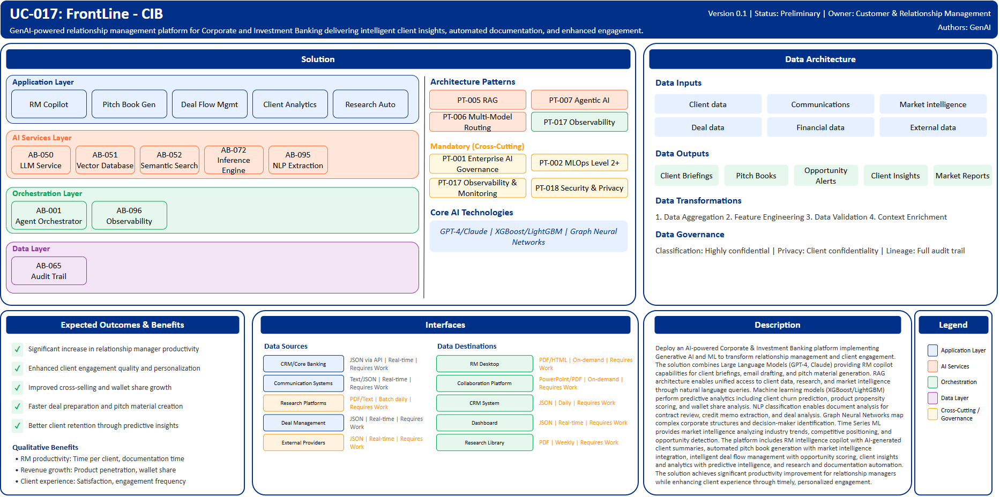

# UC-017: FrontLine - CIB

## Document Control

| Property | Value |
|----------|-------|
| **Use Case ID** | `UC-017` |
| **Version** | `0.1` |
| **Status** | `Preliminary` |
| **Created Date** | `2025-12-07` |
| **Last Modified** | `2025-12-07` |
| **Owner** | Customer & Relationship Management |
| **Author(s)** | GenAI |
| **Product Owner** | TBD |
| **Executive Sponsor** | TBD |

## 1. Executive Summary

### 1.1 Use Case Overview

**One-Line Summary**: 
GenAI-powered relationship management platform for Corporate and Investment Banking delivering intelligent client insights, automated documentation, and enhanced engagement.

**Business Problem**:
Corporate and Investment Banking relationship managers face challenges accessing comprehensive client information scattered across multiple systems. Manual preparation of client briefings, pitch materials, and meeting documentation is time-consuming. Understanding complex corporate structures and identifying decision-makers requires extensive research. Relationship managers lack timely insights into client needs, market opportunities, and competitive threats. Cross-selling opportunities are missed due to incomplete visibility into client wallet share. Deal preparation involves manual research and analysis. Client communication requires careful crafting consuming significant time. Tracking client interactions and follow-up actions is fragmented.

**AI Solution**:
Deploy an AI-powered Corporate & Investment Banking platform implementing Generative AI and ML to transform relationship management and client engagement. The solution combines Large Language Models (GPT-4, Claude) providing RM copilot capabilities for client briefings, email drafting, and pitch material generation. RAG architecture enables unified access to client data, research, and market intelligence through natural language queries. Machine learning models (XGBoost/LightGBM) perform predictive analytics including client churn prediction, product propensity scoring, and wallet share analysis. NLP classification enables document analysis for contract review, credit memo extraction, and deal analysis. Graph Neural Networks map complex corporate structures and decision-maker identification. Time Series ML provides market intelligence analyzing industry trends, competitive positioning, and opportunity detection. The platform includes RM intelligence copilot with AI-generated client summaries, automated pitch book generation with market intelligence integration, intelligent deal flow management with opportunity scoring, client insights and analytics with predictive intelligence, and research and documentation automation. The solution achieves significant productivity improvement for relationship managers while enhancing client experience through timely, personalized engagement.

**Expected Outcomes**:

- Significant increase in relationship manager productivity
- Enhanced client engagement quality and personalization
- Improved cross-selling and wallet share growth
- Faster deal preparation and pitch material creation
- Better client retention through predictive insights

### 1.2 Strategic Alignment

**Business Category**: 
Customer & Relationship Management

**Strategic Themes** (select all that apply):

- [x] Customer Experience Excellence
- [x] Operational Efficiency & Automation
- [ ] Risk & Compliance Excellence
- [x] Data-Driven Decision Making
- [ ] Innovation & Competitive Differentiation

**Alignment Statement**:
This use case directly supports BNZ's Customer Experience Excellence pillar by empowering relationship managers with AI-driven insights and automation enabling personalized, timely client engagement. It drives Operational Efficiency & Automation through automated pitch book generation, research automation, and intelligent documentation reducing manual preparation time. The solution enables Data-Driven Decision Making through predictive client analytics, wallet share analysis, and opportunity intelligence guiding relationship management strategies.

## 2. Business Case

### 2.1 Business Value

**Value Type** (select all that apply):

- [x] Revenue Growth
- [x] Cost Reduction
- [ ] Risk Reduction
- [x] Customer Experience Improvement
- [ ] Regulatory Compliance
- [ ] Competitive Advantage

**Qualitative Benefits**:

| Benefit Type | Description | AI Accelerant | Evidence / Indicator |
|--------------|----------|--------|--------|
| RM productivity | Substantial increase in relationship manager capacity and efficiency | RM copilot automates briefings and communications; RAG provides instant access to client intelligence; automated pitch book generation | Time per client meeting, documentation time, capacity per RM |
| Revenue growth | Enhanced cross-selling and wallet share expansion | Predictive analytics identify product opportunities; next-best-action recommendations; proactive churn prevention | Revenue per client, product penetration, wallet share |
| Client experience | Improved engagement quality through personalization and responsiveness | AI-generated personalized insights; timely market intelligence; proactive outreach on relevant opportunities | Client satisfaction, engagement frequency, relationship strength |
| Deal velocity | Faster deal preparation and execution | Automated research and competitive analysis; intelligent deal flow management; streamlined documentation | Deal cycle time, win rate, pipeline velocity |
| Knowledge accessibility | Democratized access to client and market intelligence | Natural language queries across all data sources; AI-powered research automation; institutional knowledge capture | Information search time, knowledge utilization, insight quality |

## 3. Target State Solution

### 3.1 Solution Overview

**AI/ML Approach**:
The platform implements comprehensive relationship management intelligence using Generative AI and predictive ML. Large Language Models (GPT-4, Claude) power RM copilot capabilities including client briefing generation, email and communication drafting, pitch material creation, and natural language data access. RAG architecture combines vector databases with semantic search enabling unified access to client data, research reports, market intelligence, and internal documentation. Gradient boosting models (XGBoost/LightGBM) perform predictive analytics including client churn prediction, product propensity modeling, and wallet share estimation. NLP classification models analyze documents including contracts, credit memos, and deal documentation extracting key information automatically. Graph Neural Networks map complex corporate ownership structures, subsidiary relationships, and decision-maker networks. Time Series ML analyzes industry trends, competitive intelligence, and market dynamics identifying opportunities and threats. The solution provides real-time client intelligence, automated research aggregation, and intelligent workflow orchestration.

**Solution Components**:

1. **RM Intelligence Copilot**: 360-degree client view with AI-generated summaries, automated client meeting preparation briefings, email drafting and communication assistance, natural language queries across all client data, next-best-action recommendations for engagement
2. **Automated Pitch Book Generation**: AI-powered pitch material creation from templates, Market intelligence integration with industry analysis, Competitive positioning analysis, Automated data population from client records, Version control and collaboration features
3. **Intelligent Deal Flow Management**: Opportunity scoring and prioritization, Deal pipeline visualization with status tracking, Automated deal room setup and document organization, Cross-functional team coordination, Win/loss analysis with insights
4. **Client Insights & Analytics**: Predictive churn modeling with early warning alerts, Product propensity scoring for cross-sell targeting, Wallet share analysis and growth opportunities, Relationship health scoring, Competitor activity detection
5. **Research & Documentation Automation**: Automated market research aggregation, Industry trend analysis and reporting, Credit memo and risk assessment assistance, Contract review and key terms extraction, Regulatory filing analysis and summarization

### 3.2 Data Architecture

**Data Inputs**:

| Dataset | Description | Source | Volume | Frequency | Format | Interface Status |
|-----------|--------|-----------|--------|--------------|--------------|--------------|
| Client data | Account information, relationships, transaction history | CRM/Core Banking | Very large | Real-time | JSON via API | Requires Work |
| Communications | Email, meeting notes, call logs | Communication Systems | Very large | Real-time | Text/JSON | Requires Work |
| Market intelligence | Industry reports, competitive analysis | Research Platforms | Large | Batch daily | PDF/Text | Requires Work |
| Deal data | Pipeline, proposals, contracts | Deal Management | Large | Real-time | JSON | Requires Work |
| Financial data | Credit ratings, financial statements | Credit Systems | Large | Batch monthly | JSON/PDF | Requires Work |
| External data | News, corporate filings, market data | External Providers | Streaming | Real-time | JSON | Requires Work |

**Data Transformations**:
1. **Data Aggregation**: Combine client data, communications, and market intelligence into unified relationship view
2. **Feature Engineering**: Calculate engagement metrics, relationship health indicators, opportunity scores
3. **Data Quality Validation**: Validate client data completeness and accuracy for reliable analytics
4. **Context Enrichment**: Add market intelligence, industry context, competitive positioning to client profiles

**Data Outputs**:

| Dataset | Description | Destination | Volume | Frequency | Format | Interface Status |  |
|-------------|-------------|-------------|--------|-----------|-----------|-----------|-----------|
| Client briefings | AI-generated meeting preparation materials | RM Desktop | Large | On-demand | PDF/HTML | Requires Work |  |
| Pitch books | Automated presentation materials | Collaboration Platform | Large | On-demand | PowerPoint/PDF | Requires Work |  |
| Opportunity alerts | Predictive cross-sell and growth opportunities | CRM System | Large | Daily | JSON | Requires Work |  |
| Client insights | Analytics and intelligence summaries | Dashboard | Large | Real-time | JSON | Requires Work |  |
| Market reports | Automated industry and competitive analysis | Research Library | Large | Weekly | PDF | Requires Work |  |

**Data Quality Requirements**:

- **Accuracy**: Very high accuracy required for client data and financial information
- **Completeness**: No missing critical client relationship or transaction information
- **Timeliness**: Real-time for client interactions, batch acceptable for market intelligence
- **Consistency**: Standardized client data across all banking systems and platforms

**Data Governance**:
- **Classification**: Highly confidential (contains client financial and strategic information)
- **Retention**: Per client relationship and regulatory requirements
- **Privacy**: Client confidentiality, secure handling of sensitive corporate information
- **Lineage**: Full audit trail for client intelligence and recommendations for compliance

### 3.3 Architecture Patterns

**Primary Patterns Used**:

| Pattern ID | Pattern Name | Usage in Use Case |
|-----------|-------------|-------------------|
| [PT-005](../../../../03-building-blocks/patterns/PT-005/PT-005-Retrieval-Augmented-Generation-v1.0.0.md) | Retrieval-Augmented Generation | Client intelligence and research retrieval |
| [PT-007](../../../../03-building-blocks/patterns/PT-007/PT-007-Agentic-AI-v1.0.0.md) | Agentic AI | Autonomous research and documentation generation |
| [PT-006](../../../../03-building-blocks/patterns/PT-006/PT-006-Multi-Model-Routing-v1.0.0.md) | Multi-Model Routing | Routing between LLM, analytics, and NLP models |
| [PT-017](../../../../03-building-blocks/patterns/PT-017/PT-017-Observability-Monitoring-v1.0.0.md) | Observability & Monitoring | RM productivity and engagement metrics |
| [PT-001](../../../../03-building-blocks/patterns/PT-001/PT-001-Enterprise-AI-Governance-v1.0.0.md) | Enterprise AI Governance | Client intelligence AI governance |
| [PT-018](../../../../03-building-blocks/patterns/PT-018/PT-018-Security-Privacy-v1.0.0.md) | Security & Privacy | Client data protection |

**Architecture Building Blocks (ABBs)**:

| ABB ID | ABB Name | Purpose in Use Case | Criticality |
|--------|----------|-------------------|-------------|
| [AB-050](../../../../03-building-blocks/architecture-building-blocks/abbs/AB-050/AB-050-Large-Language-Model-Service-v1.0.0.md) | Large Language Model Service | RM copilot and content generation | Critical |
| [AB-051](../../../../03-building-blocks/architecture-building-blocks/abbs/AB-051/AB-051-Vector-Database-v1.0.0.md) | Vector Database | Client and market intelligence embeddings | Critical |
| [AB-052](../../../../03-building-blocks/architecture-building-blocks/abbs/AB-052/AB-052-Semantic-Search-Engine-v1.0.0.md) | Semantic Search Engine | Intelligent client data search | Critical |
| [AB-072](../../../../03-building-blocks/architecture-building-blocks/abbs/AB-072/AB-072-Inference-Engine-v1.0.0.md) | Inference Engine | Predictive client analytics | High |
| [AB-095](../../../../03-building-blocks/architecture-building-blocks/abbs/AB-095/AB-095-NLP-Extraction-Engine-v1.0.0.md) | NLP Extraction Engine | Document analysis and extraction | High |
| [AB-001](../../../../03-building-blocks/architecture-building-blocks/abbs/AB-001/AB-001-Agent-Orchestrator-v1.0.0.md) | Agent Orchestrator | Research and documentation workflow | High |
| [AB-096](../../../../03-building-blocks/architecture-building-blocks/abbs/AB-096/AB-096-Observability-Platform-v1.0.0.md) | Observability Platform | RM metrics dashboards | High |
| [AB-065](../../../../03-building-blocks/architecture-building-blocks/abbs/AB-065/AB-065-Audit-Trail-and-Logging-v1.0.0.md) | Audit Trail & Logging | Client interaction audit trail | Critical |

## 4. Prioritization Scoring

TBD - Prioritization scoring to be completed during portfolio planning.

## 5. Risk Management

TBD - Risk assessment to be completed during detailed planning phase.

## 6. Success Metrics & KPIs

Track business and technical KPIs (details TBD).
