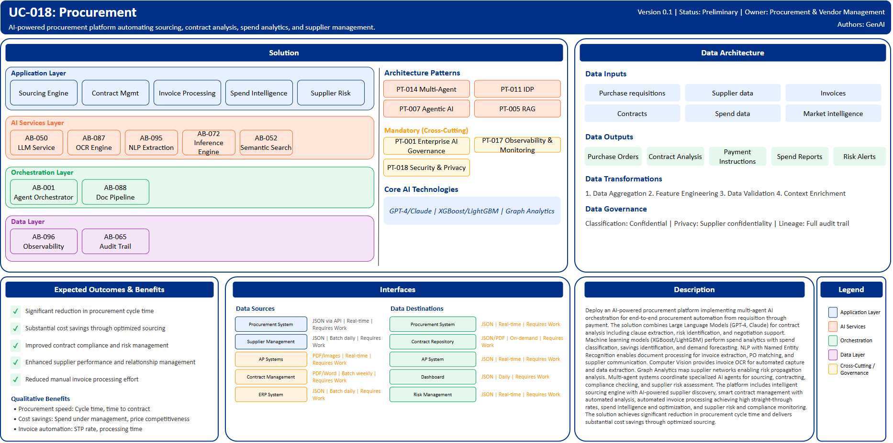

# UC-018: Procurement

## Document Control

| Property | Value |
|----------|-------|
| **Use Case ID** | `UC-018` |
| **Version** | `0.1` |
| **Status** | `Preliminary` |
| **Created Date** | `2025-12-07` |
| **Last Modified** | `2025-12-07` |
| **Owner** | Procurement & Vendor Management |
| **Author(s)** | GenAI |
| **Product Owner** | TBD |
| **Executive Sponsor** | TBD |

## 1. Executive Summary

### 1.1 Use Case Overview

**One-Line Summary**: 
AI-powered procurement platform automating sourcing, contract analysis, spend analytics, and supplier management.

**Business Problem**:
Procurement processes at BNZ are manual and time-consuming from requisition through payment processing. Contract review and analysis requires extensive legal expertise and time. Spend analytics and optimization opportunities are difficult to identify across fragmented data. Supplier discovery and selection involves manual research. Invoice processing relies on manual data entry and three-way matching. Procurement compliance and policy adherence require manual monitoring. Supplier risk assessment is periodic rather than continuous. Negotiation support lacks data-driven insights. Purchase order management involves manual approval workflows.

**AI Solution**:
Deploy an AI-powered procurement platform implementing multi-agent AI orchestration for end-to-end procurement automation from requisition through payment. The solution combines Large Language Models (GPT-4, Claude) for contract analysis including clause extraction, risk identification, and negotiation support. Machine learning models (XGBoost/LightGBM) perform spend analytics with spend classification, savings identification, and demand forecasting. NLP with Named Entity Recognition enables document processing for invoice extraction, PO matching, and supplier communication. Computer Vision provides invoice OCR for automated capture and data extraction. Graph Analytics map supplier networks enabling risk propagation analysis. Multi-agent systems coordinate specialized AI agents for sourcing, contracting, compliance checking, and supplier risk assessment. The platform includes intelligent sourcing engine with AI-powered supplier discovery, smart contract management with automated analysis, automated invoice processing achieving high straight-through rates, spend intelligence and optimization, and supplier risk and compliance monitoring. The solution achieves significant reduction in procurement cycle time and delivers substantial cost savings through optimized sourcing.

**Expected Outcomes**:

- Significant reduction in procurement cycle time
- Substantial cost savings through optimized sourcing
- Improved contract compliance and risk management
- Enhanced supplier performance and relationship management
- Reduced manual invoice processing effort

### 1.2 Strategic Alignment

**Business Category**: 
Procurement & Vendor Management

**Strategic Themes** (select all that apply):

- [ ] Customer Experience Excellence
- [x] Operational Efficiency & Automation
- [x] Risk & Compliance Excellence
- [x] Data-Driven Decision Making
- [ ] Innovation & Competitive Differentiation

**Alignment Statement**:
This use case directly supports BNZ's Operational Efficiency & Automation pillar by automating procurement workflows, contract analysis, and invoice processing significantly reducing manual effort. It enables Data-Driven Decision Making through spend analytics, supplier intelligence, and procurement optimization insights. The solution supports Risk & Compliance Excellence through continuous supplier risk monitoring, contract compliance checking, and automated policy enforcement.

## 2. Business Case

### 2.1 Business Value

**Value Type** (select all that apply):

- [ ] Revenue Growth
- [x] Cost Reduction
- [x] Risk Reduction
- [ ] Customer Experience Improvement
- [x] Regulatory Compliance
- [ ] Competitive Advantage

**Qualitative Benefits**:

| Benefit Type | Description | AI Accelerant | Evidence / Indicator |
|--------------|----------|--------|--------|
| Procurement speed | Dramatic reduction in procurement cycle time from requisition to payment | Multi-agent AI orchestrates end-to-end workflow; automated approvals and routing; smart contract analysis accelerates review | Cycle time, time to contract, payment processing time |
| Cost savings | Substantial procurement cost reduction through optimization | ML-driven spend analytics identify consolidation opportunities; market intelligence enables better pricing; supplier optimization | Cost savings, spend under management, price competitiveness |
| Invoice automation | Significant reduction in manual invoice processing effort | Computer vision extracts invoice data; NLP performs three-way matching; automated exception handling | Invoice processing time, straight-through processing rate, error rate |
| Contract compliance | Improved contract terms and risk management | LLM analyzes contracts for unfavorable terms; identifies compliance risks; provides negotiation recommendations | Contract risk scores, unfavorable term identification, compliance violations |
| Supplier risk management | Enhanced supplier performance and risk monitoring | Continuous supplier risk assessment; graph analytics identify network risks; predictive models forecast issues | Supplier incidents, risk early detection, performance improvement |

## 3. Target State Solution

### 3.1 Solution Overview

**AI/ML Approach**:
The platform implements end-to-end procurement automation using multi-agent AI orchestration coordinating specialized agents for sourcing, contracting, compliance, and supplier management. Large Language Models (GPT-4, Claude) provide contract intelligence including clause extraction, risk term identification, obligation tracking, and negotiation playbook recommendations. Gradient boosting models (XGBoost/LightGBM) perform sophisticated spend analytics with automated categorization, consolidation opportunity identification, and demand forecasting. NLP with Named Entity Recognition enables intelligent document processing extracting structured data from invoices, purchase orders, and contracts. Computer Vision performs OCR on invoices, receipts, and delivery notes with high accuracy. Graph Analytics map complex supplier networks enabling risk contagion analysis and optimization opportunities. The solution provides intelligent workflow routing, automated approvals, policy compliance checking, and continuous supplier monitoring.

**Solution Components**:

1. **Intelligent Sourcing Engine**: AI-powered supplier discovery and recommendation, automated RFP/RFQ generation and evaluation, spend pattern analysis for consolidation opportunities, market intelligence and price benchmarking, supplier diversity and sustainability scoring
2. **Smart Contract Management**: Automated contract analysis and risk identification, Clause extraction and obligation tracking, Contract template generation with best practices, Negotiation playbook recommendations with market benchmarks, Renewal alerting with optimization suggestions
3. **Automated Invoice Processing**: OCR and data extraction from invoices with high accuracy, Three-way matching automation between invoice, PO, and receipt, Exception handling with intelligent routing, Payment scheduling optimization, Fraud detection on invoice patterns
4. **Spend Intelligence & Optimization**: Real-time spend visibility and analytics dashboards, Category management insights and optimization, Maverick spend identification and reduction, Budget tracking with predictive alerts, Savings opportunity identification and tracking
5. **Supplier Risk & Compliance**: Continuous supplier performance monitoring and scoring, Financial health assessment with early warning, Compliance verification including certifications and regulations, Supply chain risk mapping with network analysis, ESG and sustainability tracking

### 3.2 Data Architecture

**Data Inputs**:

| Dataset | Description | Source | Volume | Frequency | Format | Interface Status |
|-----------|--------|-----------|--------|--------------|--------------|--------------|
| Purchase requisitions | Internal purchase requests | Procurement System | Large | Real-time | JSON via API | Requires Work |
| Supplier data | Vendor information, contracts, performance | Supplier Management | Large | Batch daily | JSON | Requires Work |
| Invoices | Supplier invoices for payment | AP Systems | Very large | Real-time | PDF/Images | Requires Work |
| Contracts | Procurement contracts and agreements | Contract Management | Large | Batch weekly | PDF/Word | Requires Work |
| Spend data | Historical spend and transactions | ERP System | Very large | Batch daily | JSON | Requires Work |
| Market intelligence | Pricing, supplier, commodity data | External Providers | Streaming | Daily | JSON | Requires Work |

**Data Transformations**:
1. **Data Aggregation**: Combine spend data, contracts, and supplier information into unified procurement view
2. **Feature Engineering**: Calculate spend patterns, supplier performance metrics, risk indicators
3. **Data Quality Validation**: Validate invoice and PO data completeness and accuracy
4. **Context Enrichment**: Add market intelligence, risk scores, sustainability metrics to procurement data

**Data Outputs**:

| Dataset | Description | Destination | Volume | Frequency | Format | Interface Status |  |
|-------------|-------------|-------------|--------|-----------|-----------|-----------|-----------|
| Purchase orders | Approved POs ready for supplier transmission | Procurement System | Large | Real-time | JSON | Requires Work |  |
| Contract analysis | Risk assessments and term summaries | Contract Repository | Large | On-demand | JSON/PDF | Requires Work |  |
| Payment instructions | Approved invoices for payment processing | AP System | Very large | Real-time | JSON | Requires Work |  |
| Spend reports | Analytics and optimization recommendations | Dashboard | Large | Daily | JSON | Requires Work |  |
| Risk alerts | Supplier risk and compliance alerts | Risk Management | Large | Real-time | JSON | Requires Work |  |

**Data Quality Requirements**:

- **Accuracy**: Very high accuracy required for invoice extraction and financial data
- **Completeness**: No missing critical contract terms or supplier information
- **Timeliness**: Real-time for invoice processing, batch acceptable for analytics
- **Consistency**: Standardized procurement data across all business units

**Data Governance**:
- **Classification**: Confidential (contains supplier and contract information)
- **Retention**: Per procurement and contract retention policies
- **Privacy**: Supplier confidentiality, secure handling of contract terms
- **Lineage**: Full audit trail for procurement decisions and payments

### 3.3 Architecture Patterns

**Primary Patterns Used**:

| Pattern ID | Pattern Name | Usage in Use Case |
|-----------|-------------|-------------------|
| [PT-014](../../../../03-building-blocks/patterns/PT-014/PT-014-Multi-Agent-Orchestration-v1.0.0.md) | Multi-Agent Orchestration | Coordinated procurement workflow agents |
| [PT-011](../../../../03-building-blocks/patterns/PT-011/PT-011-Intelligent-Document-Processing-v1.0.0.md) | Intelligent Document Processing | Invoice and contract processing |
| [PT-007](../../../../03-building-blocks/patterns/PT-007/PT-007-Agentic-AI-v1.0.0.md) | Agentic AI | Autonomous sourcing and compliance |
| [PT-005](../../../../03-building-blocks/patterns/PT-005/PT-005-Retrieval-Augmented-Generation-v1.0.0.md) | Retrieval-Augmented Generation | Contract and market intelligence retrieval |
| [PT-017](../../../../03-building-blocks/patterns/PT-017/PT-017-Observability-Monitoring-v1.0.0.md) | Observability & Monitoring | Procurement metrics monitoring |
| [PT-001](../../../../03-building-blocks/patterns/PT-001/PT-001-Enterprise-AI-Governance-v1.0.0.md) | Enterprise AI Governance | Procurement AI governance |
| [PT-018](../../../../03-building-blocks/patterns/PT-018/PT-018-Security-Privacy-v1.0.0.md) | Security & Privacy | Procurement data protection |

**Architecture Building Blocks (ABBs)**:

| ABB ID | ABB Name | Purpose in Use Case | Criticality |
|--------|----------|-------------------|-------------|
| [AB-001](../../../../03-building-blocks/architecture-building-blocks/abbs/AB-001/AB-001-Agent-Orchestrator-v1.0.0.md) | Agent Orchestrator | Multi-agent procurement workflow | Critical |
| [AB-050](../../../../03-building-blocks/architecture-building-blocks/abbs/AB-050/AB-050-Large-Language-Model-Service-v1.0.0.md) | Large Language Model Service | Contract analysis | Critical |
| [AB-087](../../../../03-building-blocks/architecture-building-blocks/abbs/AB-087/AB-087-OCR-Engine-v1.0.0.md) | OCR Engine | Invoice text extraction | Critical |
| [AB-088](../../../../03-building-blocks/architecture-building-blocks/abbs/AB-088/AB-088-Document-Processing-Pipeline-v1.0.0.md) | Document Processing Pipeline | Invoice workflow | Critical |
| [AB-095](../../../../03-building-blocks/architecture-building-blocks/abbs/AB-095/AB-095-NLP-Extraction-Engine-v1.0.0.md) | NLP Extraction Engine | Document data extraction | Critical |
| [AB-072](../../../../03-building-blocks/architecture-building-blocks/abbs/AB-072/AB-072-Inference-Engine-v1.0.0.md) | Inference Engine | Spend analytics | High |
| [AB-051](../../../../03-building-blocks/architecture-building-blocks/abbs/AB-051/AB-051-Vector-Database-v1.0.0.md) | Vector Database | Contract and market intelligence | High |
| [AB-052](../../../../03-building-blocks/architecture-building-blocks/abbs/AB-052/AB-052-Semantic-Search-Engine-v1.0.0.md) | Semantic Search Engine | Supplier and contract search | High |
| [AB-096](../../../../03-building-blocks/architecture-building-blocks/abbs/AB-096/AB-096-Observability-Platform-v1.0.0.md) | Observability Platform | Procurement dashboards | High |
| [AB-065](../../../../03-building-blocks/architecture-building-blocks/abbs/AB-065/AB-065-Audit-Trail-and-Logging-v1.0.0.md) | Audit Trail & Logging | Procurement audit trail | Critical |

## 4. Prioritization Scoring

TBD - Prioritization scoring to be completed during portfolio planning.

## 5. Risk Management

TBD - Risk assessment to be completed during detailed planning phase.

## 6. Success Metrics & KPIs

Track business and technical KPIs (details TBD).
