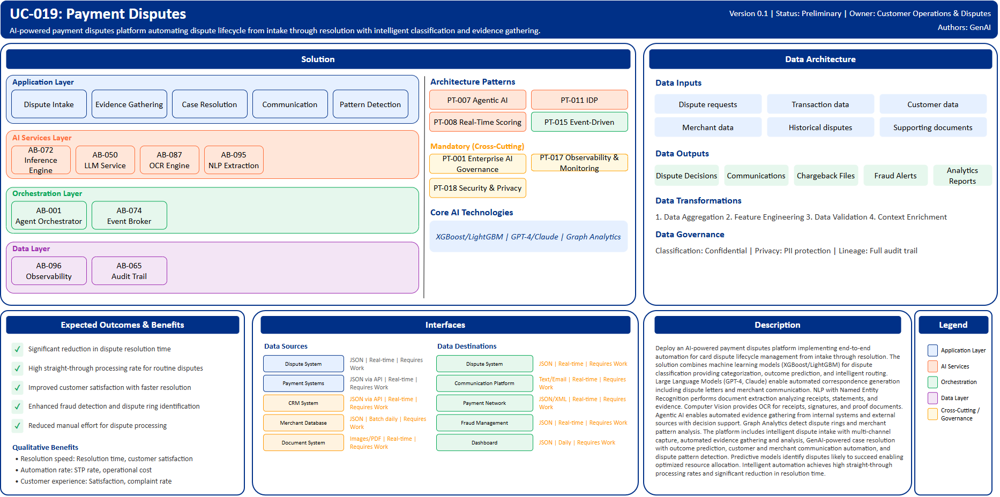

# UC-019: Payment Disputes

## Document Control

| Property | Value |
|----------|-------|
| **Use Case ID** | `UC-019` |
| **Version** | `0.1` |
| **Status** | `Preliminary` |
| **Created Date** | `2025-12-07` |
| **Last Modified** | `2025-12-07` |
| **Owner** | Customer Operations & Disputes |
| **Author(s)** | GenAI |
| **Product Owner** | TBD |
| **Executive Sponsor** | TBD |

## 1. Executive Summary

### 1.1 Use Case Overview

**One-Line Summary**: 
AI-powered payment disputes platform automating dispute lifecycle from intake through resolution with intelligent classification and evidence gathering.

**Business Problem**:
Payment dispute resolution at BNZ is manual and time-consuming requiring extensive customer and merchant interaction. Dispute classification and routing requires specialized knowledge. Evidence gathering from multiple sources involves manual coordination. Dispute correspondence is repetitive yet time-intensive. Resolution decisioning lacks data-driven insights. Customer frustration grows with lengthy resolution times. Dispute outcomes are inconsistent across analysts. Fraud pattern detection in dispute rings requires manual analysis. Merchant communication and chargeback processing is fragmented. Dispute analytics and performance tracking is limited.

**AI Solution**:
Deploy an AI-powered payment disputes platform implementing end-to-end automation for card dispute lifecycle management from intake through resolution. The solution combines machine learning models (XGBoost/LightGBM) for dispute classification providing categorization, outcome prediction, and intelligent routing. Large Language Models (GPT-4, Claude) enable automated correspondence generation including dispute letters and merchant communication. NLP with Named Entity Recognition performs document extraction analyzing receipts, statements, and evidence. Computer Vision provides OCR for receipts, signatures, and proof documents. Agentic AI enables automated evidence gathering from internal systems and external sources with decision support. Graph Analytics detect dispute rings and merchant pattern analysis. The platform includes intelligent dispute intake with multi-channel capture, automated evidence gathering and analysis, GenAI-powered case resolution with outcome prediction, customer and merchant communication automation, and dispute pattern detection. Predictive models identify disputes likely to succeed enabling optimized resource allocation. Intelligent automation achieves high straight-through processing rates and significant reduction in resolution time.

**Expected Outcomes**:

- Significant reduction in dispute resolution time
- High straight-through processing rate for routine disputes
- Improved customer satisfaction with faster resolution
- Enhanced fraud detection and dispute ring identification
- Reduced manual effort for dispute processing

### 1.2 Strategic Alignment

**Business Category**: 
Customer Operations & Disputes

**Strategic Themes** (select all that apply):

- [x] Customer Experience Excellence
- [x] Operational Efficiency & Automation
- [ ] Risk & Compliance Excellence
- [ ] Data-Driven Decision Making
- [ ] Innovation & Competitive Differentiation

**Alignment Statement**:
This use case directly supports BNZ's Customer Experience Excellence pillar by delivering faster dispute resolution, transparent status tracking, and responsive communication improving customer satisfaction. It drives Operational Efficiency & Automation through intelligent dispute classification, automated evidence gathering, and GenAI-powered correspondence reducing manual processing effort while improving consistency.

## 2. Business Case

### 2.1 Business Value

**Value Type** (select all that apply):

- [ ] Revenue Growth
- [x] Cost Reduction
- [x] Risk Reduction
- [x] Customer Experience Improvement
- [ ] Regulatory Compliance
- [ ] Competitive Advantage

**Qualitative Benefits**:

| Benefit Type | Description | AI Accelerant | Evidence / Indicator |
|--------------|----------|--------|--------|
| Resolution speed | Dramatic reduction in dispute resolution time | ML classification routes disputes intelligently; agentic AI gathers evidence automatically; predictive models identify quick-win cases | Average resolution time, time to decision, customer satisfaction |
| Automation rate | High straight-through processing for routine disputes | Automated intake, classification, evidence analysis, and decisioning; correspondence generation; merchant communication | STP rate, manual review volume, operational cost |
| Customer experience | Improved satisfaction through faster resolution and transparency | Real-time status updates; proactive communication; faster fund recovery | Customer satisfaction scores, complaint rate, retention |
| Decisioning consistency | Improved consistency in dispute outcomes | ML-based outcome prediction; standardized decision criteria; automated policy application | Decision accuracy, reversal rate, policy compliance |
| Fraud detection | Enhanced identification of dispute fraud and abuse patterns | Graph analytics detect dispute rings; pattern recognition identifies suspicious behavior; network analysis links cases | Fraud detection rate, false claim identification, chargeback abuse |

## 3. Target State Solution

### 3.1 Solution Overview

**AI/ML Approach**:
The platform implements end-to-end dispute lifecycle automation using multiple AI/ML techniques. Gradient boosting models (XGBoost/LightGBM) provide intelligent dispute classification with automated categorization, outcome probability prediction, and routing decisions. Large Language Models (GPT-4, Claude) generate dispute correspondence, merchant communications, and resolution explanations with consistent tone and messaging. NLP with Named Entity Recognition extracts structured information from receipts, statements, transaction history, and supporting documentation. Computer Vision performs OCR on diverse document types including receipts, signatures, and proof documents with high accuracy. Agentic AI frameworks orchestrate automated evidence gathering workflows accessing transaction systems, merchant databases, and external sources. Graph Analytics map relationships between disputes, customers, merchants, and transactions identifying fraud rings and abuse patterns. The solution provides real-time classification, automated workflows, and intelligent decisioning.

**Solution Components**:

1. **Intelligent Dispute Intake**: Multi-channel dispute capture including app, web, phone, and branch, AI-powered dispute type classification, automated reason code assignment, evidence requirement determination, priority scoring based on value and customer tier
2. **Automated Evidence Gathering & Analysis**: Agentic AI retrieval from internal transaction systems, Merchant data and policy lookup, Receipt and statement analysis with OCR, Transaction pattern analysis, Fraud indicator identification
3. **GenAI-Powered Case Resolution**: Outcome probability prediction guiding resource allocation, Automated decision generation for clear-cut cases, Resolution letter generation with explanations, Quality assurance scoring before customer communication, Escalation routing for complex cases
4. **Customer & Merchant Communication**: Automated status update notifications, Dispute acknowledgment and progress tracking, Merchant chargeback letter generation, Customer resolution communication, Feedback collection and satisfaction tracking
5. **Dispute Pattern Detection**: Graph-based dispute ring identification, Merchant risk scoring and pattern analysis, Customer abuse detection, Seasonal and trending dispute analysis, Proactive merchant outreach for recurring issues

### 3.2 Data Architecture

**Data Inputs**:

| Dataset | Description | Source | Volume | Frequency | Format | Interface Status |
|-----------|--------|-----------|--------|--------------|--------------|--------------|
| Dispute requests | Customer dispute submissions | Dispute System | Large | Real-time | JSON | Requires Work |
| Transaction data | Card transaction history | Payment Systems | Very large | Real-time | JSON via API | Requires Work |
| Customer data | Account and profile information | CRM System | Large | Real-time | JSON via API | Requires Work |
| Merchant data | Merchant profiles, policies, contacts | Merchant Database | Large | Batch daily | JSON | Requires Work |
| Historical disputes | Past dispute outcomes and resolutions | Dispute Management | Very large | Batch daily | JSON | Requires Work |
| Supporting documents | Receipts, statements, proof documents | Document System | Very large | Real-time | Images/PDF | Requires Work |

**Data Transformations**:
1. **Data Aggregation**: Combine disputes, transactions, and customer history into unified case view
2. **Feature Engineering**: Calculate dispute patterns, merchant risk scores, outcome probability features
3. **Data Quality Validation**: Validate evidence completeness, transaction matching accuracy
4. **Context Enrichment**: Add historical patterns, merchant reputation, fraud indicators to disputes

**Data Outputs**:

| Dataset | Description | Destination | Volume | Frequency | Format | Interface Status |  |
|-------------|-------------|-------------|--------|-----------|-----------|-----------|-----------|
| Dispute decisions | Automated resolution decisions | Dispute System | Large | Real-time | JSON | Requires Work |  |
| Customer communications | Automated letters and notifications | Communication Platform | Large | Real-time | Text/Email | Requires Work |  |
| Chargeback files | Merchant chargeback submissions | Payment Network | Large | Real-time | JSON/XML | Requires Work |  |
| Fraud alerts | Dispute pattern and ring detection alerts | Fraud Management | Streaming | Real-time | JSON | Requires Work |  |
| Analytics reports | Dispute metrics, trends, performance | Dashboard | Large | Daily | JSON | Requires Work |  |

**Data Quality Requirements**:

- **Accuracy**: Very high accuracy required for transaction and evidence data
- **Completeness**: No missing critical transaction history or supporting documentation
- **Timeliness**: Real-time for dispute intake and decisioning
- **Consistency**: Standardized dispute data across all dispute channels

**Data Governance**:
- **Classification**: Confidential (contains customer transaction and dispute information)
- **Retention**: Per payment network and regulatory requirements
- **Privacy**: PII protection, secure handling of transaction details
- **Lineage**: Full audit trail from dispute intake through resolution for compliance

### 3.3 Architecture Patterns

**Primary Patterns Used**:

| Pattern ID | Pattern Name | Usage in Use Case |
|-----------|-------------|-------------------|
| [PT-007](../../../../03-building-blocks/patterns/PT-007/PT-007-Agentic-AI-v1.0.0.md) | Agentic AI | Autonomous evidence gathering and case resolution |
| [PT-011](../../../../03-building-blocks/patterns/PT-011/PT-011-Intelligent-Document-Processing-v1.0.0.md) | Intelligent Document Processing | Receipt and document analysis |
| [PT-008](../../../../03-building-blocks/patterns/PT-008/PT-008-Real-Time-Scoring-v1.0.0.md) | Real-Time Scoring | Dispute outcome prediction |
| [PT-015](../../../../03-building-blocks/patterns/PT-015/PT-015-Event-Driven-Architecture-v1.0.0.md) | Event-Driven Architecture | Dispute workflow automation |
| [PT-017](../../../../03-building-blocks/patterns/PT-017/PT-017-Observability-Monitoring-v1.0.0.md) | Observability & Monitoring | Dispute metrics monitoring |
| [PT-001](../../../../03-building-blocks/patterns/PT-001/PT-001-Enterprise-AI-Governance-v1.0.0.md) | Enterprise AI Governance | Dispute AI governance |
| [PT-018](../../../../03-building-blocks/patterns/PT-018/PT-018-Security-Privacy-v1.0.0.md) | Security & Privacy | Dispute data protection |

**Architecture Building Blocks (ABBs)**:

| ABB ID | ABB Name | Purpose in Use Case | Criticality |
|--------|----------|-------------------|-------------|
| [AB-072](../../../../03-building-blocks/architecture-building-blocks/abbs/AB-072/AB-072-Inference-Engine-v1.0.0.md) | Inference Engine | Dispute classification and outcome prediction | Critical |
| [AB-050](../../../../03-building-blocks/architecture-building-blocks/abbs/AB-050/AB-050-Large-Language-Model-Service-v1.0.0.md) | Large Language Model Service | Correspondence generation | Critical |
| [AB-087](../../../../03-building-blocks/architecture-building-blocks/abbs/AB-087/AB-087-OCR-Engine-v1.0.0.md) | OCR Engine | Receipt and document OCR | Critical |
| [AB-088](../../../../03-building-blocks/architecture-building-blocks/abbs/AB-088/AB-088-Document-Processing-Pipeline-v1.0.0.md) | Document Processing Pipeline | Evidence workflow | Critical |
| [AB-095](../../../../03-building-blocks/architecture-building-blocks/abbs/AB-095/AB-095-NLP-Extraction-Engine-v1.0.0.md) | NLP Extraction Engine | Evidence extraction | High |
| [AB-001](../../../../03-building-blocks/architecture-building-blocks/abbs/AB-001/AB-001-Agent-Orchestrator-v1.0.0.md) | Agent Orchestrator | Evidence gathering orchestration | Critical |
| [AB-074](../../../../03-building-blocks/architecture-building-blocks/abbs/AB-074/AB-074-Event-Broker-v1.0.0.md) | Event Broker | Dispute event streaming | High |
| [AB-096](../../../../03-building-blocks/architecture-building-blocks/abbs/AB-096/AB-096-Observability-Platform-v1.0.0.md) | Observability Platform | Dispute analytics dashboards | High |
| [AB-065](../../../../03-building-blocks/architecture-building-blocks/abbs/AB-065/AB-065-Audit-Trail-and-Logging-v1.0.0.md) | Audit Trail & Logging | Dispute audit trail | Critical |

## 4. Prioritization Scoring

TBD - Prioritization scoring to be completed during portfolio planning.

## 5. Risk Management

TBD - Risk assessment to be completed during detailed planning phase.

## 6. Success Metrics & KPIs

Track business and technical KPIs (details TBD).
