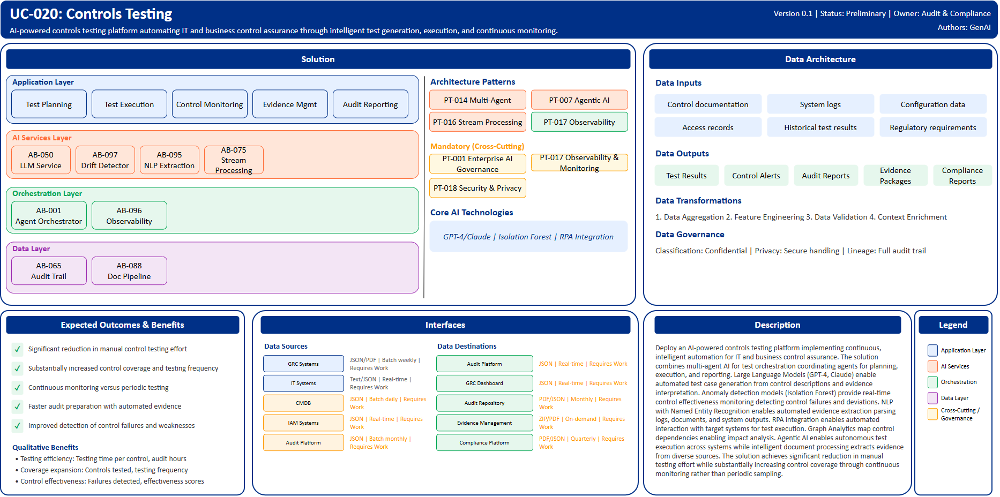

# UC-020: Controls Testing

## Document Control

| Property | Value |
|----------|-------|
| **Use Case ID** | `UC-020` |
| **Version** | `0.1` |
| **Status** | `Preliminary` |
| **Created Date** | `2025-12-07` |
| **Last Modified** | `2025-12-07` |
| **Owner** | Audit & Compliance |
| **Author(s)** | GenAI |
| **Product Owner** | TBD |
| **Executive Sponsor** | TBD |

## 1. Executive Summary

### 1.1 Use Case Overview

**One-Line Summary**: 
AI-powered controls testing platform automating IT and business control assurance through intelligent test generation, execution, and continuous monitoring.

**Business Problem**:
Controls testing at BNZ relies on manual processes that are time-consuming and provide limited coverage. Test case creation requires specialized expertise. Evidence gathering from multiple systems involves manual collection and analysis. Control testing is periodic rather than continuous missing interim control failures. Testing documentation is labor-intensive. Control effectiveness assessment lacks real-time visibility. Root cause analysis for control failures requires manual investigation. Audit preparation involves extensive manual evidence compilation. Testing coverage gaps exist due to resource constraints. Regulatory compliance verification is fragmented across systems.

**AI Solution**:
Deploy an AI-powered controls testing platform implementing continuous, intelligent automation for IT and business control assurance. The solution combines multi-agent AI for test orchestration coordinating agents for planning, execution, and reporting. Large Language Models (GPT-4, Claude) enable automated test case generation from control descriptions and evidence interpretation. Anomaly detection models (Isolation Forest) provide real-time control effectiveness monitoring detecting control failures and deviations. NLP with Named Entity Recognition enables automated evidence extraction parsing logs, documents, and system outputs. RPA integration enables automated interaction with target systems for test execution. Graph Analytics map control dependencies enabling impact analysis. Agentic AI enables autonomous test execution across systems while intelligent document processing extracts evidence from diverse sources. The solution achieves significant reduction in manual testing effort while substantially increasing control coverage through continuous monitoring rather than periodic sampling.

**Expected Outcomes**:

- Significant reduction in manual control testing effort
- Substantially increased control coverage and testing frequency
- Continuous monitoring versus periodic testing
- Faster audit preparation with automated evidence
- Improved detection of control failures and weaknesses

### 1.2 Strategic Alignment

**Business Category**: 
Audit & Compliance

**Strategic Themes** (select all that apply):

- [ ] Customer Experience Excellence
- [x] Operational Efficiency & Automation
- [x] Risk & Compliance Excellence
- [ ] Data-Driven Decision Making
- [ ] Innovation & Competitive Differentiation

**Alignment Statement**:
This use case directly supports BNZ's Risk & Compliance Excellence pillar by deploying AI/ML capabilities for comprehensive, continuous control assurance ensuring robust control effectiveness and regulatory compliance. It drives Operational Efficiency & Automation through automated test generation, execution, and evidence gathering significantly reducing manual audit and compliance workload while improving coverage and quality.

## 2. Business Case

### 2.1 Business Value

**Value Type** (select all that apply):

- [ ] Revenue Growth
- [x] Cost Reduction
- [x] Risk Reduction
- [ ] Customer Experience Improvement
- [x] Regulatory Compliance
- [ ] Competitive Advantage

**Qualitative Benefits**:

| Benefit Type | Description | AI Accelerant | Evidence / Indicator |
|--------------|----------|--------|--------|
| Testing efficiency | Dramatic reduction in manual control testing effort | Multi-agent AI orchestrates end-to-end testing; automated test generation; autonomous execution; evidence extraction | Testing time per control, audit hours, staff capacity |
| Coverage expansion | Substantially increased control coverage and frequency | Continuous monitoring replaces periodic sampling; automated testing enables comprehensive coverage; resource constraints eliminated | Controls tested, testing frequency, coverage percentage |
| Control effectiveness | Enhanced detection of control failures and weaknesses | Real-time anomaly detection monitors continuously; pattern recognition identifies degradation early; automated root cause analysis | Control failures detected, mean time to detection, effectiveness scores |
| Audit readiness | Faster audit preparation with automated evidence compilation | Automated evidence gathering and organization; control testing documentation generated automatically; compliance verification streamlined | Audit prep time, evidence completeness, audit findings |
| Regulatory compliance | Improved regulatory examination outcomes | Comprehensive testing documentation; continuous monitoring evidence; automated compliance verification | Regulatory findings, examination outcomes, compliance confidence |

## 3. Target State Solution

### 3.1 Solution Overview

**AI/ML Approach**:
The platform implements continuous, intelligent controls testing automation using multi-agent AI orchestration coordinating specialized agents for test planning, execution, evidence gathering, and reporting. Large Language Models (GPT-4, Claude) generate test cases automatically from control descriptions and interpret evidence with natural language understanding. Anomaly detection models (Isolation Forest) perform continuous monitoring of control metrics detecting deviations and failures in real-time. NLP with Named Entity Recognition parses diverse evidence sources including system logs, access reports, configuration files, and audit trails extracting structured test results. RPA integration enables automated interaction with target systems simulating manual testing procedures. Graph Analytics map complex control relationships and dependencies enabling impact analysis and prioritization. The solution provides intelligent risk-based test prioritization, automated test execution, real-time control monitoring, and comprehensive audit documentation.

**Solution Components**:

1. **Intelligent Test Planning**: AI-powered risk-based test prioritization, automated test case generation from control descriptions, coverage analysis identifying untested controls, regulatory requirement mapping to test scenarios, dynamic test scheduling based on risk and change events
2. **Automated Test Execution**: Multi-agent orchestration of test workflows, RPA integration for system interaction and verification, Parallel test execution across multiple controls, Self-healing test scripts adapting to application changes, Real-time progress tracking and status reporting
3. **Continuous Control Monitoring**: Anomaly detection for real-time control effectiveness, Statistical process control with automated alerts, Trend analysis identifying control degradation patterns, Automated baseline establishment and maintenance, Exception detection with root cause suggestions
4. **Intelligent Evidence Management**: Automated evidence collection from multiple systems, Document classification and organization, NLP-based evidence interpretation and summarization, Evidence gap identification with collection guidance, Secure evidence storage with tamper protection
5. **Audit Reporting & Analytics**: Automated testing report generation with findings, Control effectiveness dashboards with real-time metrics, Regulatory compliance verification summaries, Audit trail documentation with complete lineage, Trend analysis and predictive control insights

### 3.2 Data Architecture

**Data Inputs**:

| Dataset | Description | Source | Volume | Frequency | Format | Interface Status |
|-----------|--------|-----------|--------|--------------|--------------|--------------|
| Control documentation | Control descriptions, objectives, test procedures | GRC Systems | Large | Batch weekly | JSON/PDF | Requires Work |
| System logs | Application, access, and security logs | IT Systems | Very large | Real-time | Text/JSON | Requires Work |
| Configuration data | System configurations and settings | CMDB | Large | Batch daily | JSON | Requires Work |
| Access records | User access and privilege information | IAM Systems | Very large | Real-time | JSON | Requires Work |
| Historical test results | Prior control test outcomes | Audit Platform | Large | Batch monthly | JSON | Requires Work |
| Regulatory requirements | Compliance framework requirements | Compliance Library | Large | Batch quarterly | PDF/Text | Requires Work |

**Data Transformations**:
1. **Data Aggregation**: Combine control documentation, evidence, and test results into unified testing view
2. **Feature Engineering**: Calculate control effectiveness scores, risk indicators, trend metrics
3. **Data Quality Validation**: Validate evidence completeness, log integrity for reliable testing
4. **Context Enrichment**: Add regulatory requirements, risk assessments, control dependencies

**Data Outputs**:

| Dataset | Description | Destination | Volume | Frequency | Format | Interface Status |  |
|-------------|-------------|-------------|--------|-----------|-----------|-----------|-----------|
| Test results | Automated control test outcomes | Audit Platform | Large | Real-time | JSON | Requires Work |  |
| Control alerts | Real-time control failure and effectiveness alerts | GRC Dashboard | Streaming | Real-time | JSON | Requires Work |  |
| Audit reports | Automated audit documentation and summaries | Audit Repository | Large | Monthly | PDF/JSON | Requires Work |  |
| Evidence packages | Organized evidence collections for audits | Evidence Management | Large | On-demand | ZIP/PDF | Requires Work |  |
| Compliance reports | Regulatory compliance verification results | Compliance Platform | Large | Quarterly | PDF/JSON | Requires Work |  |

**Data Quality Requirements**:

- **Accuracy**: Very high accuracy required for control evidence and test results
- **Completeness**: No missing critical control documentation or evidence
- **Timeliness**: Real-time for control monitoring, batch acceptable for reporting
- **Consistency**: Standardized testing methodology and evidence formats

**Data Governance**:
- **Classification**: Confidential (contains control and audit information)
- **Retention**: Per regulatory audit and compliance requirements
- **Privacy**: Secure handling of access and security data
- **Lineage**: Full audit trail from control testing through evidence to reporting

### 3.3 Architecture Patterns

**Primary Patterns Used**:

| Pattern ID | Pattern Name | Usage in Use Case |
|-----------|-------------|-------------------|
| [PT-014](../../../../03-building-blocks/patterns/PT-014/PT-014-Multi-Agent-Orchestration-v1.0.0.md) | Multi-Agent Orchestration | Coordinated testing workflow agents |
| [PT-007](../../../../03-building-blocks/patterns/PT-007/PT-007-Agentic-AI-v1.0.0.md) | Agentic AI | Autonomous test execution |
| [PT-016](../../../../03-building-blocks/patterns/PT-016/PT-016-Stream-Processing-v1.0.0.md) | Stream Processing | Real-time control monitoring |
| [PT-017](../../../../03-building-blocks/patterns/PT-017/PT-017-Observability-Monitoring-v1.0.0.md) | Observability & Monitoring | Control effectiveness monitoring |
| [PT-001](../../../../03-building-blocks/patterns/PT-001/PT-001-Enterprise-AI-Governance-v1.0.0.md) | Enterprise AI Governance | Controls testing AI governance |
| [PT-018](../../../../03-building-blocks/patterns/PT-018/PT-018-Security-Privacy-v1.0.0.md) | Security & Privacy | Audit data protection |

**Architecture Building Blocks (ABBs)**:

| ABB ID | ABB Name | Purpose in Use Case | Criticality |
|--------|----------|-------------------|-------------|
| [AB-001](../../../../03-building-blocks/architecture-building-blocks/abbs/AB-001/AB-001-Agent-Orchestrator-v1.0.0.md) | Agent Orchestrator | Multi-agent testing orchestration | Critical |
| [AB-050](../../../../03-building-blocks/architecture-building-blocks/abbs/AB-050/AB-050-Large-Language-Model-Service-v1.0.0.md) | Large Language Model Service | Test generation and evidence interpretation | Critical |
| [AB-097](../../../../03-building-blocks/architecture-building-blocks/abbs/AB-097/AB-097-Data-Drift-Detector-v1.0.0.md) | Data Drift Detector | Control anomaly detection | Critical |
| [AB-095](../../../../03-building-blocks/architecture-building-blocks/abbs/AB-095/AB-095-NLP-Extraction-Engine-v1.0.0.md) | NLP Extraction Engine | Evidence extraction from logs | High |
| [AB-075](../../../../03-building-blocks/architecture-building-blocks/abbs/AB-075/AB-075-Stream-Processing-Engine-v1.0.0.md) | Stream Processing Engine | Real-time control monitoring | Critical |
| [AB-096](../../../../03-building-blocks/architecture-building-blocks/abbs/AB-096/AB-096-Observability-Platform-v1.0.0.md) | Observability Platform | Control dashboards | High |
| [AB-065](../../../../03-building-blocks/architecture-building-blocks/abbs/AB-065/AB-065-Audit-Trail-and-Logging-v1.0.0.md) | Audit Trail & Logging | Testing audit trail | Critical |
| [AB-088](../../../../03-building-blocks/architecture-building-blocks/abbs/AB-088/AB-088-Document-Processing-Pipeline-v1.0.0.md) | Document Processing Pipeline | Evidence workflow | High |

## 4. Prioritization Scoring

TBD - Prioritization scoring to be completed during portfolio planning.

## 5. Risk Management

TBD - Risk assessment to be completed during detailed planning phase.

## 6. Success Metrics & KPIs

Track business and technical KPIs (details TBD).
