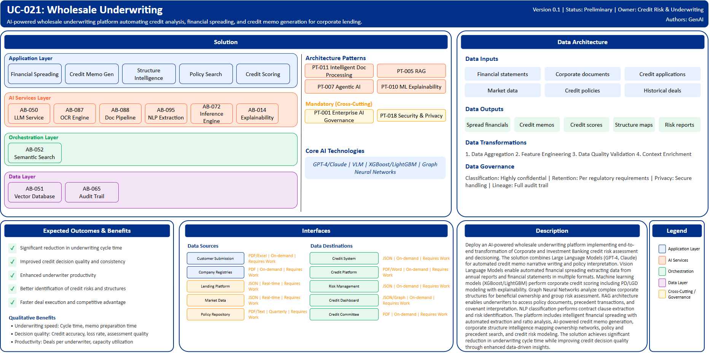

# UC-021: Wholesale Underwriting

## Document Control

| Property | Value |
|----------|-------|
| **Use Case ID** | `UC-021` |
| **Version** | `0.1` |
| **Status** | `Preliminary` |
| **Created Date** | `2025-12-07` |
| **Last Modified** | `2025-12-07` |
| **Owner** | Credit Risk & Underwriting |
| **Author(s)** | GenAI |
| **Product Owner** | TBD |
| **Executive Sponsor** | TBD |

## 1. Executive Summary

### 1.1 Use Case Overview

**One-Line Summary**: 
AI-powered wholesale underwriting platform automating credit analysis, financial spreading, and credit memo generation for corporate lending.

**Business Problem**:
Wholesale underwriting at BNZ is manual and time-intensive requiring extensive analysis of financial statements, corporate structures, and legal documentation. Financial spreading from annual reports and management accounts involves manual data entry consuming significant time. Credit memo writing requires specialized expertise and takes days to complete. Corporate structure analysis for group risk assessment is complex. Credit policy and covenant interpretation requires manual research. Precedent transaction search is fragmented. Credit scoring for complex corporate structures lacks consistency. Underwriting capacity constraints limit deal flow.

**AI Solution**:
Deploy an AI-powered wholesale underwriting platform implementing end-to-end transformation of Corporate and Investment Banking credit risk assessment and decisioning. The solution combines Large Language Models (GPT-4, Claude) for automated credit memo narrative writing and policy interpretation. Vision Language Models enable automated financial spreading extracting data from annual reports and financial statements in multiple formats. Machine learning models (XGBoost/LightGBM) perform corporate credit scoring including PD/LGD modeling with explainability. Graph Neural Networks analyze complex corporate structures for beneficial ownership and group risk assessment. RAG architecture enables underwriters to access policy documents, precedent transactions, and covenant interpretation. NLP classification performs contract clause extraction and risk identification. The platform includes intelligent financial spreading with automated extraction and ratio analysis, AI-powered credit memo generation, corporate structure intelligence mapping ownership networks, policy and precedent search, and credit risk modeling. The solution achieves significant reduction in underwriting cycle time while improving credit decision quality through enhanced data-driven insights.

**Expected Outcomes**:

- Significant reduction in underwriting cycle time
- Improved credit decision quality and consistency
- Enhanced productivity for underwriters
- Better identification of credit risks and structures
- Faster deal execution and competitive advantage

### 1.2 Strategic Alignment

**Business Category**: 
Credit Risk & Underwriting

**Strategic Themes** (select all that apply):

- [ ] Customer Experience Excellence
- [x] Operational Efficiency & Automation
- [x] Risk & Compliance Excellence
- [x] Data-Driven Decision Making
- [ ] Innovation & Competitive Differentiation

**Alignment Statement**:
This use case directly supports BNZ's Risk & Compliance Excellence pillar by deploying AI/ML capabilities for comprehensive credit risk assessment, automated policy compliance checking, and consistent credit decisioning ensuring robust underwriting standards. It drives Operational Efficiency & Automation through automated financial spreading, credit memo generation, and document processing significantly reducing manual underwriting effort. The solution enables Data-Driven Decision Making through ML-based credit scoring, corporate structure analysis, and data-driven risk insights.

## 2. Business Case

### 2.1 Business Value

**Value Type** (select all that apply):

- [x] Revenue Growth
- [x] Cost Reduction
- [x] Risk Reduction
- [ ] Customer Experience Improvement
- [x] Regulatory Compliance
- [ ] Competitive Advantage

**Qualitative Benefits**:

| Benefit Type | Description | AI Accelerant | Evidence / Indicator |
|--------------|----------|--------|--------|
| Underwriting speed | Dramatic reduction in underwriting cycle time | Vision Language Models automate financial spreading; LLMs generate credit memos rapidly; RAG enables instant policy access | Time to decision, memo preparation time, deal velocity |
| Decision quality | Improved credit risk assessment accuracy and consistency | ML credit scoring provides data-driven risk quantification; graph analysis identifies hidden structures; explainable AI supports decisions | Credit decision accuracy, loss rate, risk assessment quality |
| Underwriter productivity | Substantial increase in underwriter capacity | Automated financial spreading eliminates manual data entry; credit memo generation accelerates documentation; precedent search streamlined | Deals per underwriter, capacity utilization, manual hours |
| Risk identification | Enhanced detection of credit risks and corporate structures | Graph neural networks map complex ownership; NLP extracts covenant risks; ML identifies financial deterioration patterns | Risk discovery rate, structure complexity handling, covenant breaches |
| Compliance assurance | Improved credit policy adherence and documentation | RAG verifies policy compliance automatically; standardized credit memo structure; audit trail completeness | Policy exceptions, audit findings, documentation quality |

## 3. Target State Solution

### 3.1 Solution Overview

**AI/ML Approach**:
The platform implements comprehensive underwriting automation using advanced AI/ML. Vision Language Models extract financial data automatically from annual reports, management accounts, and financial statements across multiple formats including PDF, Excel, and images. Large Language Models (GPT-4, Claude) generate credit memo narratives, interpret credit policies, and provide decision rationale with consistent structure. Gradient boosting models (XGBoost/LightGBM) perform corporate credit scoring including probability of default and loss given default modeling with feature importance for explainability. Graph Neural Networks analyze complex corporate structures mapping beneficial ownership, subsidiary relationships, and group exposures. RAG architecture provides instant access to credit policies, precedent transactions, covenant libraries, and regulatory requirements. NLP classification extracts contract clauses, identifies risk terms, and categorizes financial covenants. The solution provides automated ratio calculation, peer benchmarking, trend analysis, and quality validation.

**Solution Components**:

1. **Intelligent Financial Spreading**: Automated extraction from audited and management accounts, multi-format document processing including PDF and images, ratio calculation and trend analysis, peer benchmarking and industry comparison, quality validation with confidence scoring
2. **AI-Powered Credit Memo Generation**: Automated narrative generation for credit committee papers, Company background and business description creation, Financial analysis and covenant summary, Risk assessment and mitigation recommendations, Policy compliance verification and exception handling
3. **Corporate Structure Intelligence**: Graph-based ownership structure visualization, Ultimate beneficial owner identification, Group exposure aggregation and risk concentration, Subsidiary financial health assessment, Intercompany transaction analysis
4. **Policy & Precedent Search**: RAG-powered policy document retrieval, Similar transaction precedent matching, Covenant library with interpretation guidance, Regulatory requirement mapping, Credit committee decision history search
5. **Credit Risk Modeling**: ML-based corporate credit scoring with PD/LGD estimates, Sector-specific risk models, Financial stress testing and scenario analysis, Early warning indicators for deterioration, Explainable AI for model transparency

### 3.2 Data Architecture

**Data Inputs**:

| Dataset | Description | Source | Volume | Frequency | Format | Interface Status |
|-----------|--------|-----------|--------|--------------|--------------|--------------|
| Financial statements | Annual reports, management accounts | Customer Submission | Large | On-demand | PDF/Excel/Images | Requires Work |
| Corporate documents | Legal structures, ownership information | Company Registries | Large | On-demand | PDF | Requires Work |
| Credit applications | Loan requests and supporting documentation | Lending Platform | Large | Real-time | JSON | Requires Work |
| Market data | Industry benchmarks, credit spreads | Market Data Providers | Streaming | Real-time | JSON | Requires Work |
| Credit policies | Underwriting policies and guidelines | Policy Repository | Large | Batch quarterly | PDF/Text | Requires Work |
| Historical deals | Precedent transactions and outcomes | Credit Archive | Very large | Batch monthly | JSON | Requires Work |

**Data Transformations**:
1. **Data Aggregation**: Combine financial data, corporate structures, and credit history into unified credit profile
2. **Feature Engineering**: Calculate financial ratios, credit metrics, risk indicators for ML models
3. **Data Quality Validation**: Validate financial statement accuracy, corporate structure completeness
4. **Context Enrichment**: Add industry benchmarks, market conditions, credit policy requirements

**Data Outputs**:

| Dataset | Description | Destination | Volume | Frequency | Format | Interface Status |  |
|-------------|-------------|-------------|--------|-----------|-----------|-----------|-----------|
| Spread financials | Structured financial data with ratios | Credit System | Large | On-demand | JSON | Requires Work |  |
| Credit memos | AI-generated credit committee papers | Credit Platform | Large | On-demand | PDF/Word | Requires Work |  |
| Credit scores | ML-based credit risk assessments | Risk Management | Large | On-demand | JSON | Requires Work |  |
| Structure maps | Corporate ownership visualizations | Credit Dashboard | Large | On-demand | JSON/Graph | Requires Work |  |
| Risk reports | Credit risk analysis and recommendations | Credit Committee | Large | On-demand | PDF | Requires Work |  |

**Data Quality Requirements**:

- **Accuracy**: Very high accuracy required for financial data and credit analysis
- **Completeness**: No missing critical financial statements or corporate structure information
- **Timeliness**: On-demand for underwriting decisions, batch acceptable for precedents
- **Consistency**: Standardized financial spreading and credit memo formats

**Data Governance**:
- **Classification**: Highly confidential (contains customer financial and corporate information)
- **Retention**: Per credit file and regulatory requirements
- **Privacy**: Customer confidentiality, secure handling of financial statements
- **Lineage**: Full audit trail from source documents through analysis to credit decision

### 3.3 Architecture Patterns

**Primary Patterns Used**:

| Pattern ID | Pattern Name | Usage in Use Case |
|-----------|-------------|-------------------|
| [PT-011](../../../../03-building-blocks/patterns/PT-011/PT-011-Intelligent-Document-Processing-v1.0.0.md) | Intelligent Document Processing | Financial statement extraction |
| [PT-005](../../../../03-building-blocks/patterns/PT-005/PT-005-Retrieval-Augmented-Generation-v1.0.0.md) | Retrieval-Augmented Generation | Policy and precedent retrieval |
| [PT-007](../../../../03-building-blocks/patterns/PT-007/PT-007-Agentic-AI-v1.0.0.md) | Agentic AI | Autonomous credit analysis |
| [PT-010](../../../../03-building-blocks/patterns/PT-010/PT-010-ML-Explainability-v1.0.0.md) | ML Explainability | Credit scoring explainability |
| [PT-001](../../../../03-building-blocks/patterns/PT-001/PT-001-Enterprise-AI-Governance-v1.0.0.md) | Enterprise AI Governance | Credit AI governance |
| [PT-018](../../../../03-building-blocks/patterns/PT-018/PT-018-Security-Privacy-v1.0.0.md) | Security & Privacy | Credit data protection |

**Architecture Building Blocks (ABBs)**:

| ABB ID | ABB Name | Purpose in Use Case | Criticality |
|--------|----------|-------------------|-------------|
| [AB-050](../../../../03-building-blocks/architecture-building-blocks/abbs/AB-050/AB-050-Large-Language-Model-Service-v1.0.0.md) | Large Language Model Service | Credit memo generation | Critical |
| [AB-087](../../../../03-building-blocks/architecture-building-blocks/abbs/AB-087/AB-087-OCR-Engine-v1.0.0.md) | OCR Engine | Financial statement OCR | Critical |
| [AB-088](../../../../03-building-blocks/architecture-building-blocks/abbs/AB-088/AB-088-Document-Processing-Pipeline-v1.0.0.md) | Document Processing Pipeline | Document workflow | Critical |
| [AB-095](../../../../03-building-blocks/architecture-building-blocks/abbs/AB-095/AB-095-NLP-Extraction-Engine-v1.0.0.md) | NLP Extraction Engine | Data extraction from documents | Critical |
| [AB-072](../../../../03-building-blocks/architecture-building-blocks/abbs/AB-072/AB-072-Inference-Engine-v1.0.0.md) | Inference Engine | Credit scoring | Critical |
| [AB-051](../../../../03-building-blocks/architecture-building-blocks/abbs/AB-051/AB-051-Vector-Database-v1.0.0.md) | Vector Database | Policy and precedent embeddings | High |
| [AB-052](../../../../03-building-blocks/architecture-building-blocks/abbs/AB-052/AB-052-Semantic-Search-Engine-v1.0.0.md) | Semantic Search Engine | Policy and precedent search | High |
| [AB-014](../../../../03-building-blocks/architecture-building-blocks/abbs/AB-014/AB-014-ML-Model-Explainability-Engine-v1.0.0.md) | ML Model Explainability Engine | Credit score explainability | High |
| [AB-065](../../../../03-building-blocks/architecture-building-blocks/abbs/AB-065/AB-065-Audit-Trail-and-Logging-v1.0.0.md) | Audit Trail & Logging | Credit decision audit trail | Critical |

## 4. Prioritization Scoring

TBD - Prioritization scoring to be completed during portfolio planning.

## 5. Risk Management

TBD - Risk assessment to be completed during detailed planning phase.

## 6. Success Metrics & KPIs

Track business and technical KPIs (details TBD).
