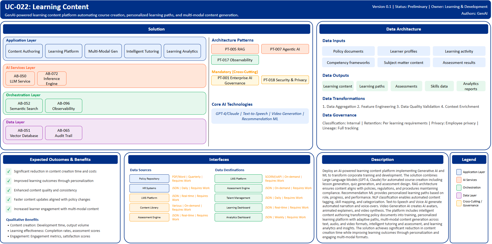

# UC-022: Learning Content

## Document Control

| Property | Value |
|----------|-------|
| **Use Case ID** | `UC-022` |
| **Version** | `0.1` |
| **Status** | `Preliminary` |
| **Created Date** | `2025-12-07` |
| **Last Modified** | `2025-12-07` |
| **Owner** | Learning & Development |
| **Author(s)** | GenAI |
| **Product Owner** | TBD |
| **Executive Sponsor** | TBD |

## 1. Executive Summary

### 1.1 Use Case Overview

**One-Line Summary**: 
GenAI-powered learning content platform automating course creation, personalized learning paths, and multi-modal content generation.

**Business Problem**:
Learning and development at BNZ relies on manual content creation that is time-consuming and resource-intensive. Course development from policies and procedures requires significant subject matter expert time. Quiz and assessment design is labor-intensive. Content personalization for different roles and skill levels is limited. Learning paths are generic rather than adaptive to individual progress. Multi-modal content creation including audio and video requires specialized production resources. Content maintenance and updates lag behind policy changes. Skills mapping and competency tracking is manual. Learning effectiveness measurement is inconsistent.

**AI Solution**:
Deploy an AI-powered learning content platform implementing Generative AI and ML to transform corporate training and development. The solution combines Large Language Models (GPT-4, Claude) for automated course creation including lesson generation, quiz generation, and assessment design. RAG architecture ensures content aligns with policies, regulations, and procedures maintaining compliance. Recommendation ML provides personalized learning paths based on role, progress, and performance. NLP classification enables automated content tagging, skill mapping, and categorization. Text-to-Speech and Voice AI generate automated narration and voice-overs. Video Generation AI creates AI avatars, animated explainers, and video synthesis. The platform includes intelligent content authoring transforming policy documents into training, personalized learning platform with adaptive paths, multi-modal content generation across text, audio, and video formats, intelligent tutoring and assessment, and learning analytics and insights. The solution achieves significant reduction in content creation time while improving learning outcomes through personalization and engaging multi-modal formats.

**Expected Outcomes**:

- Significant reduction in content creation time and costs
- Improved learning outcomes through personalization
- Enhanced content quality and consistency
- Faster content updates aligned with policy changes
- Increased learner engagement with multi-modal content

### 1.2 Strategic Alignment

**Business Category**: 
Learning & Development

**Strategic Themes** (select all that apply):

- [ ] Customer Experience Excellence
- [x] Operational Efficiency & Automation
- [ ] Risk & Compliance Excellence
- [ ] Data-Driven Decision Making
- [ ] Innovation & Competitive Differentiation

**Alignment Statement**:
This use case directly supports BNZ's Operational Efficiency & Automation pillar by automating learning content creation, personalization, and assessment generation significantly reducing manual L&D effort while improving scalability. The solution enhances workforce capability through personalized, adaptive learning experiences that align with role requirements and individual development needs.

## 2. Business Case

### 2.1 Business Value

**Value Type** (select all that apply):

- [ ] Revenue Growth
- [x] Cost Reduction
- [ ] Risk Reduction
- [ ] Customer Experience Improvement
- [ ] Regulatory Compliance
- [ ] Competitive Advantage

**Qualitative Benefits**:

| Benefit Type | Description | AI Accelerant | Evidence / Indicator |
|--------------|----------|--------|--------|
| Content creation speed | Dramatic reduction in course development time | LLMs generate lessons, quizzes, and assessments automatically; policy document transformation into training; multi-modal content generation | Development time per course, content output volume, time to publish |
| Learning effectiveness | Improved learning outcomes through personalization | Adaptive learning paths adjust to individual progress; intelligent tutoring provides targeted support; personalized content recommendations | Learning completion rates, assessment scores, knowledge retention |
| Content maintenance | Faster content updates aligned with policy changes | Automated content refresh from policy updates; version control with change tracking; consistency across materials | Content freshness, update cycle time, policy alignment |
| Engagement | Enhanced learner engagement through multi-modal content | AI-generated audio narration; video avatars; animated explainers; interactive assessments | Engagement metrics, completion rates, satisfaction scores |
| Scalability | Ability to scale learning programs without proportional resource increases | Automated content generation enables rapid expansion; personalization without manual segmentation | Courses per L&D FTE, learner capacity, program coverage |

## 3. Target State Solution

### 3.1 Solution Overview

**AI/ML Approach**:
The platform implements comprehensive learning content automation using Generative AI. Large Language Models (GPT-4, Claude) generate complete learning modules from source materials, create diverse assessment questions with distractors, and design competency-based learning objectives. RAG architecture retrieves relevant policy documents, procedures, and regulatory requirements ensuring content accuracy and compliance. Recommendation ML models analyze learner profiles, progress, and performance providing personalized content suggestions and adaptive learning paths. NLP classification performs automated content tagging, skill taxonomy mapping, and competency alignment. Text-to-Speech engines with neural voice synthesis generate professional narration for courses. Video Generation AI creates AI avatars for instruction, animated explainers for complex concepts, and full video synthesis. The solution provides intelligent content authoring tools, adaptive learning delivery, continuous learning analytics, and automated skills assessment.

**Solution Components**:

1. **Intelligent Content Authoring**: GenAI-powered lesson and module generation, policy and procedure document transformation into training materials, automated quiz and assessment creation with varied question types, multi-format content adaptation including slides and documents, subject matter expert collaboration tools
2. **Personalized Learning Platform**: ML-driven personalized learning path recommendations, Adaptive content difficulty based on performance, Role-based and competency-aligned curriculum, Progress tracking with intelligent nudges, Learning style adaptation for optimal engagement
3. **Multi-Modal Content Generation**: Text-to-speech narration with natural voice synthesis, AI avatar instructors with lip-sync and gestures, Animated video generation for concepts and procedures, Interactive simulations and scenario-based learning, Accessible content with automatic captioning and transcripts
4. **Intelligent Tutoring & Assessment**: AI tutor providing real-time assistance and explanations, Adaptive assessment adjusting difficulty dynamically, Automated grading with feedback generation, Knowledge gap identification and remediation, Competency verification and certification
5. **Learning Analytics & Insights**: Learner progress and performance dashboards, Content effectiveness measurement and optimization, Skills gap analysis at individual and organizational levels, Predictive analytics for learning outcomes, ROI measurement and reporting

### 3.2 Data Architecture

**Data Inputs**:

| Dataset | Description | Source | Volume | Frequency | Format | Interface Status |
|-----------|--------|-----------|--------|--------------|--------------|--------------|
| Policy documents | Policies, procedures, regulations | Policy Repository | Large | Batch quarterly | PDF/Word | Requires Work |
| Learner profiles | Employee roles, skills, development plans | HR Systems | Large | Batch daily | JSON via API | Requires Work |
| Learning activity | Course interactions, assessments, progress | LMS Platform | Very large | Real-time | JSON | Requires Work |
| Competency frameworks | Skills taxonomy, role requirements | Talent Management | Large | Batch quarterly | JSON | Requires Work |
| Subject matter content | Expert-created materials and resources | Content Library | Large | On-demand | Various | Requires Work |
| Assessment results | Quiz scores, test outcomes, certifications | Assessment Engine | Large | Real-time | JSON | Requires Work |

**Data Transformations**:
1. **Data Aggregation**: Combine learner profiles, activities, and assessments into unified learning records
2. **Feature Engineering**: Calculate learning velocity, engagement scores, competency mastery levels
3. **Data Quality Validation**: Validate content accuracy, assessment validity, competency alignment
4. **Context Enrichment**: Add role requirements, skill taxonomies, learning preferences to recommendations

**Data Outputs**:

| Dataset | Description | Destination | Volume | Frequency | Format | Interface Status |  |
|-------------|-------------|-------------|--------|-----------|-----------|-----------|-----------|
| Learning content | AI-generated courses and materials | LMS Platform | Large | On-demand | SCORM/xAPI | Requires Work |  |
| Learning paths | Personalized curriculum recommendations | LMS Platform | Large | Real-time | JSON | Requires Work |  |
| Assessments | AI-generated quizzes and tests | Assessment Engine | Large | On-demand | JSON | Requires Work |  |
| Skills data | Competency assessments and gap analysis | Talent Management | Large | Daily | JSON via API | Requires Work |  |
| Analytics reports | Learning effectiveness and ROI metrics | Dashboard | Large | Weekly | JSON | Requires Work |  |

**Data Quality Requirements**:

- **Accuracy**: Very high accuracy required for policy-based content and assessments
- **Completeness**: No missing critical competency or role requirement information
- **Timeliness**: Real-time for personalization, batch acceptable for content generation
- **Consistency**: Standardized content formats and competency frameworks

**Data Governance**:
- **Classification**: Internal (contains learning and employee development data)
- **Retention**: Per learning records and compliance training requirements
- **Privacy**: Employee privacy protection, secure handling of performance data
- **Lineage**: Full tracking from source policies through content to learning outcomes

### 3.3 Architecture Patterns

**Primary Patterns Used**:

| Pattern ID | Pattern Name | Usage in Use Case |
|-----------|-------------|-------------------|
| [PT-005](../../../../03-building-blocks/patterns/PT-005/PT-005-Retrieval-Augmented-Generation-v1.0.0.md) | Retrieval-Augmented Generation | Policy-compliant content generation |
| [PT-007](../../../../03-building-blocks/patterns/PT-007/PT-007-Agentic-AI-v1.0.0.md) | Agentic AI | Intelligent tutoring and assessment |
| [PT-017](../../../../03-building-blocks/patterns/PT-017/PT-017-Observability-Monitoring-v1.0.0.md) | Observability & Monitoring | Learning analytics monitoring |
| [PT-001](../../../../03-building-blocks/patterns/PT-001/PT-001-Enterprise-AI-Governance-v1.0.0.md) | Enterprise AI Governance | Learning content AI governance |
| [PT-018](../../../../03-building-blocks/patterns/PT-018/PT-018-Security-Privacy-v1.0.0.md) | Security & Privacy | Learner data protection |

**Architecture Building Blocks (ABBs)**:

| ABB ID | ABB Name | Purpose in Use Case | Criticality |
|--------|----------|-------------------|-------------|
| [AB-050](../../../../03-building-blocks/architecture-building-blocks/abbs/AB-050/AB-050-Large-Language-Model-Service-v1.0.0.md) | Large Language Model Service | Content and assessment generation | Critical |
| [AB-051](../../../../03-building-blocks/architecture-building-blocks/abbs/AB-051/AB-051-Vector-Database-v1.0.0.md) | Vector Database | Policy and content embeddings | High |
| [AB-052](../../../../03-building-blocks/architecture-building-blocks/abbs/AB-052/AB-052-Semantic-Search-Engine-v1.0.0.md) | Semantic Search Engine | Content and policy search | High |
| [AB-072](../../../../03-building-blocks/architecture-building-blocks/abbs/AB-072/AB-072-Inference-Engine-v1.0.0.md) | Inference Engine | Learning path recommendations | High |
| [AB-096](../../../../03-building-blocks/architecture-building-blocks/abbs/AB-096/AB-096-Observability-Platform-v1.0.0.md) | Observability Platform | Learning analytics dashboards | High |
| [AB-065](../../../../03-building-blocks/architecture-building-blocks/abbs/AB-065/AB-065-Audit-Trail-and-Logging-v1.0.0.md) | Audit Trail & Logging | Learning activity tracking | High |

## 4. Prioritization Scoring

TBD - Prioritization scoring to be completed during portfolio planning.

## 5. Risk Management

TBD - Risk assessment to be completed during detailed planning phase.

## 6. Success Metrics & KPIs

Track business and technical KPIs (details TBD).
