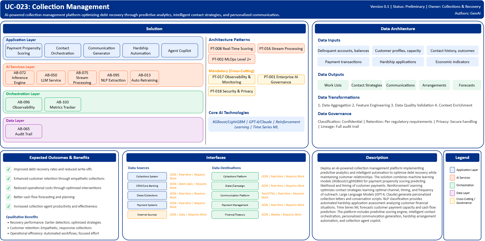

# UC-023: Collection Management

## Document Control

| Property | Value |
|----------|-------|
| **Use Case ID** | `UC-023` |
| **Version** | `0.1` |
| **Status** | `Preliminary` |
| **Created Date** | `2025-12-07` |
| **Last Modified** | `2025-12-07` |
| **Owner** | Collections & Recovery |
| **Author(s)** | GenAI |
| **Product Owner** | TBD |
| **Executive Sponsor** | TBD |

## 1. Executive Summary

### 1.1 Use Case Overview

**One-Line Summary**: 
AI-powered collection management platform optimizing debt recovery through predictive analytics, intelligent contact strategies, and personalized communication.

**Business Problem**:
Collection management at BNZ employs broad-based contact strategies that are inefficient and impact customer relationships. Manual prioritization of collection cases lacks predictive insights. Contact channel, timing, and frequency decisions are rule-based rather than optimized. Communication is generic rather than personalized to customer circumstances. Hardship application assessment is manual and time-consuming. Payment arrangement design lacks data-driven optimization. Collection agent productivity varies significantly. Customer segmentation for collection strategies is simplistic. Recovery rate prediction and cash flow forecasting lack sophistication.

**AI Solution**:
Deploy an AI-powered collection management platform implementing predictive analytics and intelligent automation to optimize debt recovery while maintaining customer relationships. The solution combines machine learning models (XGBoost/LightGBM) for payment propensity scoring predicting likelihood and timing of customer payments. Reinforcement Learning optimizes contact strategies learning optimal channel, timing, and frequency of outreach. Large Language Models (GPT-4, Claude) generate personalized collection letters and conversation scripts. NLP classification provides automated hardship application assessment analyzing customer financial situations. Time Series ML forecasts customer payment capacity and cash flow prediction. Behavioral Analytics enable sophisticated customer segmentation based on journey and response patterns. The platform includes predictive scoring engine with payment propensity and roll-rate prediction, intelligent contact orchestration optimizing outreach strategies, personalized communication generation, hardship and arrangement automation, and collection agent copilot. The solution achieves improved recovery rates with substantial reduction in operational costs through targeted, data-driven interventions.

**Expected Outcomes**:

- Improved debt recovery rates and reduced write-offs
- Enhanced customer retention through empathetic collections
- Reduced operational costs through optimized interventions
- Better cash flow forecasting and planning
- Increased collection agent productivity and effectiveness

### 1.2 Strategic Alignment

**Business Category**: 
Collections & Recovery

**Strategic Themes** (select all that apply):

- [x] Customer Experience Excellence
- [x] Operational Efficiency & Automation
- [ ] Risk & Compliance Excellence
- [x] Data-Driven Decision Making
- [ ] Innovation & Competitive Differentiation

**Alignment Statement**:
This use case directly supports BNZ's Customer Experience Excellence pillar by delivering empathetic, personalized collection experiences that maintain customer relationships while achieving recovery objectives. It enables Data-Driven Decision Making through predictive analytics optimizing contact strategies, payment arrangements, and resource allocation. The solution drives Operational Efficiency & Automation through intelligent case prioritization, automated hardship assessment, and optimized collection workflows.

## 2. Business Case

### 2.1 Business Value

**Value Type** (select all that apply):

- [ ] Revenue Growth
- [x] Cost Reduction
- [x] Risk Reduction
- [x] Customer Experience Improvement
- [ ] Regulatory Compliance
- [ ] Competitive Advantage

**Qualitative Benefits**:

| Benefit Type | Description | AI Accelerant | Evidence / Indicator |
|--------------|----------|--------|--------|
| Recovery performance | Improved debt recovery rates through targeted interventions | ML payment propensity identifies high-probability recoveries; reinforcement learning optimizes contact strategies; predictive models forecast payment timing | Recovery rate, collections per FTE, days sales outstanding |
| Customer retention | Enhanced customer relationships through empathetic collections | Personalized communication reflects customer circumstances; hardship support is responsive; behavioral segmentation enables appropriate strategies | Customer retention, complaint rate, satisfaction in collections |
| Operational efficiency | Reduced collection costs through optimization | Intelligent prioritization focuses effort on recoverable accounts; automated workflows reduce manual tasks; agent copilot improves productivity | Cost per collection, agent productivity, workflow automation rate |
| Cash flow predictability | Better forecasting and planning | Time series ML predicts payment timing; roll-rate models forecast portfolio performance; recovery amount estimation | Forecast accuracy, cash flow variance, planning confidence |
| Strategy effectiveness | Continuous improvement through learning | Reinforcement learning adapts strategies based on outcomes; A/B testing optimizes approaches; behavioral analytics refine segmentation | Strategy conversion rate, contact effectiveness, optimization velocity |

## 3. Target State Solution

### 3.1 Solution Overview

**AI/ML Approach**:
The platform implements intelligent debt recovery optimization using predictive analytics and reinforcement learning. Gradient boosting models (XGBoost/LightGBM) predict payment propensity including likelihood, timing, and amount with confidence intervals. Roll-rate prediction models forecast account progression distinguishing cure versus further delinquency. Reinforcement Learning continuously optimizes contact strategies learning from outcomes to determine optimal channel (phone, SMS, email, letter), timing (day of week, time of day), and frequency of outreach. Large Language Models (GPT-4, Claude) generate personalized collection communications tailored to customer circumstances, financial capacity, and response history. NLP classification analyzes hardship applications extracting financial situation details and assessing eligibility automatically. Time Series ML forecasts individual customer payment capacity and portfolio cash flow. Behavioral Analytics segment customers based on payment patterns, engagement responses, and life circumstances enabling differentiated collection strategies.

**Solution Components**:

1. **Predictive Scoring Engine**: Payment propensity scoring with confidence intervals and timing prediction, roll-rate prediction distinguishing cure versus progression, recovery amount estimation for portfolio planning, customer lifetime value in collections context, hardship likelihood assessment for proactive support
2. **Intelligent Contact Orchestration**: Reinforcement learning for optimal channel, timing, and frequency selection, Multi-channel campaign management across phone, digital, and mail, Automated dialer integration with intelligent list prioritization, Contact suppression for vulnerable customers and optimal times, Real-time strategy adjustment based on responses
3. **Personalized Communication**: GenAI-powered collection letter generation tailored to circumstances, Conversation script generation for agent guidance, SMS and email message personalization, Empathetic tone adaptation based on customer situation, Multi-language support for diverse customers
4. **Hardship & Arrangement Automation**: NLP-based hardship application assessment and eligibility determination, Automated arrangement proposal generation based on payment capacity, Scenario modeling for sustainable repayment plans, Approval workflow with risk-based decision rules, Payment plan monitoring with proactive intervention
5. **Collection Agent Copilot**: Real-time customer insights and payment history during calls, Next-best-action recommendations for agent guidance, Objection handling suggestions and negotiation tactics, Automated note-taking and case documentation, Performance coaching with quality feedback

### 3.2 Data Architecture

**Data Inputs**:

| Dataset | Description | Source | Volume | Frequency | Format | Interface Status |
|-----------|--------|-----------|--------|--------------|--------------|--------------|
| Account data | Delinquent accounts, balances, payment history | Collections System | Large | Real-time | JSON via API | Requires Work |
| Customer profiles | Demographics, employment, financial capacity | CRM/Core Banking | Large | Batch daily | JSON via API | Requires Work |
| Contact history | Previous collection attempts and outcomes | Dialer/Collections | Very large | Real-time | JSON | Requires Work |
| Payment transactions | Payment receipts and broken promises | Payment Systems | Very large | Real-time | JSON via API | Requires Work |
| Hardship applications | Financial hardship requests and documentation | Collections Platform | Large | Real-time | Text/PDF | Requires Work |
| Economic indicators | Unemployment, inflation, regional data | External Sources | Streaming | Daily | JSON | Requires Work |

**Data Transformations**:
1. **Data Aggregation**: Combine account, customer, and contact data into unified collection case view
2. **Feature Engineering**: Calculate payment patterns, contact response rates, financial stress indicators
3. **Data Quality Validation**: Validate contact information accuracy, payment history completeness
4. **Context Enrichment**: Add economic conditions, behavioral segments, life events to customer profiles

**Data Outputs**:

| Dataset | Description | Destination | Volume | Frequency | Format | Interface Status |  |
|-------------|-------------|-------------|--------|-----------|-----------|-----------|-----------|
| Work lists | Prioritized collection cases for agents | Collections Platform | Large | Real-time | JSON | Requires Work |  |
| Contact strategies | Optimal channel, timing, frequency recommendations | Dialer/Campaign | Large | Real-time | JSON | Requires Work |  |
| Communications | Personalized letters, emails, SMS messages | Communication Platform | Very large | Real-time | Text/HTML | Requires Work |  |
| Arrangements | Approved payment plans and terms | Payment Management | Large | Real-time | JSON | Requires Work |  |
| Forecasts | Recovery predictions and cash flow forecasts | Finance/Treasury | Large | Weekly | JSON | Requires Work |  |

**Data Quality Requirements**:

- **Accuracy**: Very high accuracy required for payment history and customer financial data
- **Completeness**: No missing critical contact information or payment capacity indicators
- **Timeliness**: Real-time for contact orchestration, batch acceptable for forecasting
- **Consistency**: Standardized collection data across all account types and channels

**Data Governance**:
- **Classification**: Confidential (contains customer financial and contact information)
- **Retention**: Per collections and regulatory requirements
- **Privacy**: Customer privacy protection, vulnerable customer handling protocols
- **Lineage**: Full audit trail from scoring through contact to recovery for compliance

### 3.3 Architecture Patterns

**Primary Patterns Used**:

| Pattern ID | Pattern Name | Usage in Use Case |
|-----------|-------------|-------------------|
| [PT-008](../../../../03-building-blocks/patterns/PT-008/PT-008-Real-Time-Scoring-v1.0.0.md) | Real-Time Scoring | Payment propensity scoring |
| [PT-016](../../../../03-building-blocks/patterns/PT-016/PT-016-Stream-Processing-v1.0.0.md) | Stream Processing | Real-time contact orchestration |
| [PT-002](../../../../03-building-blocks/patterns/PT-002/PT-002-MLOps-Level-2-Plus-v1.0.0.md) | MLOps Level 2+ | Continuous strategy optimization |
| [PT-017](../../../../03-building-blocks/patterns/PT-017/PT-017-Observability-Monitoring-v1.0.0.md) | Observability & Monitoring | Collections performance monitoring |
| [PT-001](../../../../03-building-blocks/patterns/PT-001/PT-001-Enterprise-AI-Governance-v1.0.0.md) | Enterprise AI Governance | Collections AI governance |
| [PT-018](../../../../03-building-blocks/patterns/PT-018/PT-018-Security-Privacy-v1.0.0.md) | Security & Privacy | Customer data protection |

**Architecture Building Blocks (ABBs)**:

| ABB ID | ABB Name | Purpose in Use Case | Criticality |
|--------|----------|-------------------|-------------|
| [AB-072](../../../../03-building-blocks/architecture-building-blocks/abbs/AB-072/AB-072-Inference-Engine-v1.0.0.md) | Inference Engine | Payment propensity scoring | Critical |
| [AB-050](../../../../03-building-blocks/architecture-building-blocks/abbs/AB-050/AB-050-Large-Language-Model-Service-v1.0.0.md) | Large Language Model Service | Communication generation | Critical |
| [AB-075](../../../../03-building-blocks/architecture-building-blocks/abbs/AB-075/AB-075-Stream-Processing-Engine-v1.0.0.md) | Stream Processing Engine | Real-time contact orchestration | Critical |
| [AB-095](../../../../03-building-blocks/architecture-building-blocks/abbs/AB-095/AB-095-NLP-Extraction-Engine-v1.0.0.md) | NLP Extraction Engine | Hardship application analysis | High |
| [AB-013](../../../../03-building-blocks/architecture-building-blocks/abbs/AB-013/AB-013-Automated-Retraining-Trigger-v1.0.0.md) | Automated Retraining Trigger | Strategy model updates | High |
| [AB-096](../../../../03-building-blocks/architecture-building-blocks/abbs/AB-096/AB-096-Observability-Platform-v1.0.0.md) | Observability Platform | Collections dashboards | High |
| [AB-103](../../../../03-building-blocks/architecture-building-blocks/abbs/AB-103/AB-103-Business-Metrics-Tracker-v1.0.0.md) | Business Metrics Tracker | Recovery metrics tracking | High |
| [AB-065](../../../../03-building-blocks/architecture-building-blocks/abbs/AB-065/AB-065-Audit-Trail-and-Logging-v1.0.0.md) | Audit Trail & Logging | Collections audit trail | Critical |

## 4. Prioritization Scoring

TBD - Prioritization scoring to be completed during portfolio planning.

## 5. Risk Management

TBD - Risk assessment to be completed during detailed planning phase.

## 6. Success Metrics & KPIs

Track business and technical KPIs (details TBD).
