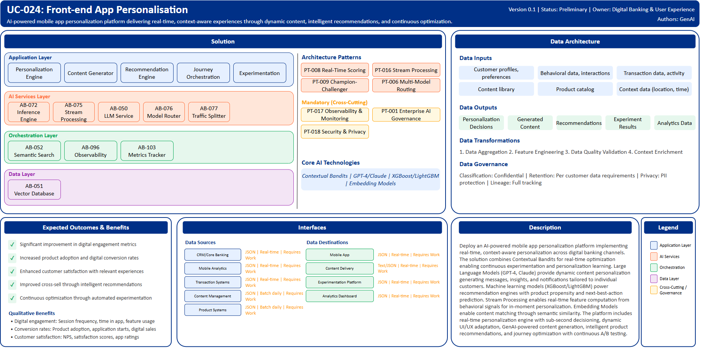

# UC-024: Front-end App Personalisation

## Document Control

| Property | Value |
|----------|-------|
| **Use Case ID** | `UC-024` |
| **Version** | `0.1` |
| **Status** | `Preliminary` |
| **Created Date** | `2025-12-07` |
| **Last Modified** | `2025-12-07` |
| **Owner** | Digital Banking & User Experience |
| **Author(s)** | GenAI |
| **Product Owner** | TBD |
| **Executive Sponsor** | TBD |

## 1. Executive Summary

### 1.1 Use Case Overview

**One-Line Summary**: 
AI-powered mobile app personalization platform delivering real-time, context-aware experiences through dynamic content, intelligent recommendations, and continuous optimization.

**Business Problem**:
Digital banking experiences at BNZ are generic rather than personalized to individual customer needs and contexts. Content, product recommendations, and features are static rather than adaptive. Customer engagement with digital channels plateaus due to lack of relevance. Product discovery is limited by fixed navigation and layouts. Personalization efforts are manual and segment-based rather than individual. Real-time context including location, time, and behavior is underutilized. A/B testing and optimization is manual and slow. Customer journey optimization lacks data-driven insights. Cross-sell opportunities are missed due to generic experiences.

**AI Solution**:
Deploy an AI-powered mobile app personalization platform implementing real-time, context-aware personalization across digital banking channels. The solution combines Contextual Bandits for real-time optimization enabling continuous experimentation and personalization learning. Large Language Models (GPT-4, Claude) provide dynamic content personalization generating messages, insights, and notifications tailored to individual customers. Machine learning models (XGBoost/LightGBM) power recommendation engines with product propensity and next-best-action prediction. Stream Processing enables real-time feature computation from behavioral signals for in-moment personalization. Embedding Models enable content matching through semantic similarity for content recommendations. Reinforcement Learning optimizes customer journeys learning optimal engagement sequences. The platform includes real-time personalization engine with sub-second decisioning, dynamic UI/UX adaptation, GenAI-powered content generation, intelligent product recommendations, and journey optimization with continuous A/B testing. The solution achieves significant improvement in engagement metrics and increased digital conversion through hyper-personalized experiences that adapt in real-time to customer context and behavior.

**Expected Outcomes**:

- Significant improvement in digital engagement metrics
- Increased product adoption and digital conversion rates
- Enhanced customer satisfaction with relevant experiences
- Improved cross-sell effectiveness through intelligent recommendations
- Continuous optimization through automated experimentation

### 1.2 Strategic Alignment

**Business Category**: 
Digital Banking & User Experience

**Strategic Themes** (select all that apply):

- [x] Customer Experience Excellence
- [ ] Operational Efficiency & Automation
- [ ] Risk & Compliance Excellence
- [x] Data-Driven Decision Making
- [ ] Innovation & Competitive Differentiation

**Alignment Statement**:
This use case directly supports BNZ's Customer Experience Excellence pillar by delivering hyper-personalized digital experiences that adapt in real-time to individual customer needs, context, and behavior improving satisfaction and engagement. It enables Data-Driven Decision Making through continuous experimentation, ML-powered recommendations, and behavioral analytics optimizing digital experiences based on data insights.

## 2. Business Case

### 2.1 Business Value

**Value Type** (select all that apply):

- [x] Revenue Growth
- [ ] Cost Reduction
- [ ] Risk Reduction
- [x] Customer Experience Improvement
- [ ] Regulatory Compliance
- [ ] Competitive Advantage

**Qualitative Benefits**:

| Benefit Type | Description | AI Accelerant | Evidence / Indicator |
|--------------|----------|--------|--------|
| Digital engagement | Substantial improvement in customer engagement with digital channels | Real-time personalization adapts content and features to context; dynamic UI optimizes for individual preferences; continuous experimentation improves experiences | Session frequency, time in app, feature usage, engagement scores |
| Conversion rates | Increased product adoption and digital conversion | ML recommendations identify propensity and optimal timing; personalized product messaging improves relevance; journey optimization reduces friction | Conversion rate, application starts, product adoption, digital sales |
| Customer satisfaction | Enhanced satisfaction through relevant, contextual experiences | Context-aware personalization provides timely, useful content; proactive insights demonstrate value; seamless experiences reduce effort | NPS, satisfaction scores, app store ratings, feedback sentiment |
| Cross-sell effectiveness | Improved cross-sell through intelligent recommendations | Propensity models identify likely product interest; next-best-action recommendations optimize timing; personalized messaging improves resonance | Cross-sell rate, product per customer, wallet share, recommendation acceptance |
| Optimization velocity | Faster experience improvement through continuous experimentation | Contextual bandits automate A/B testing; reinforcement learning optimizes journeys continuously; automated winner promotion | Experiments per month, optimization cycle time, performance improvement rate |

## 3. Target State Solution

### 3.1 Solution Overview

**AI/ML Approach**:
The platform implements real-time, context-aware personalization using advanced ML and optimization techniques. Contextual Bandits enable continuous experimentation and personalization learning with automated exploration-exploitation tradeoffs optimizing content, layout, and feature variations in real-time. Large Language Models (GPT-4, Claude) generate dynamic, personalized content including messages, financial insights, notifications, and conversational responses tailored to individual customer circumstances. Gradient boosting models (XGBoost/LightGBM) predict product propensity, next-best-actions, and customer intents with high accuracy. Stream Processing computes real-time behavioral features from customer actions enabling in-moment personalization decisions. Embedding Models create semantic representations of content and customer interests enabling intelligent content matching and recommendations. Reinforcement Learning optimizes multi-step customer journeys learning optimal engagement sequences, notification timing, and feature presentation. The solution provides sub-second personalization decisions at scale, A/B testing with automatic winner promotion, and real-time feature computation from streaming customer data.

**Solution Components**:

1. **Real-Time Personalization Engine**: Sub-second personalization decisions at app launch and throughout session, context-aware content selection based on time, location, and behavior, dynamic UI/UX element adaptation for individual preferences, A/B testing with automatic winner promotion, real-time feature computation from streaming behavioral data
2. **GenAI Content Personalization**: Dynamic message generation tailored to customer circumstances, Personalized financial insights and recommendations with explanations, Smart notification content and timing optimization, Conversational responses adapting tone and complexity, Multi-language content generation
3. **Intelligent Product Recommendations**: Next-best-action prediction with propensity scoring, Product recommendation with timing and channel optimization, Cross-sell opportunity identification based on life events and behavior, Personalized product messaging and positioning, Explainable recommendations building customer trust
4. **Dynamic Journey Orchestration**: Multi-step journey optimization with reinforcement learning, Onboarding personalization reducing time to value, Feature discovery guidance based on usage patterns, Proactive assistance and intervention at friction points, Channel and touchpoint optimization
5. **Continuous Experimentation Platform**: Automated A/B and multivariate testing framework, Contextual bandits for real-time optimization, Causal impact measurement with proper attribution, Segment-based and individual-level testing, Performance monitoring and automatic rollback

### 3.2 Data Architecture

**Data Inputs**:

| Dataset | Description | Source | Volume | Frequency | Format | Interface Status |
|-----------|--------|-----------|--------|--------------|--------------|--------------|
| Customer profiles | Demographics, products, preferences | CRM/Core Banking | Large | Real-time | JSON via API | Requires Work |
| Behavioral data | App interactions, clicks, sessions | Mobile Analytics | Very large | Real-time | JSON | Requires Work |
| Transaction data | Account activity, spending patterns | Transaction Systems | Very large | Real-time | JSON via API | Requires Work |
| Content library | Messages, insights, recommendations | Content Management | Large | Batch daily | JSON | Requires Work |
| Product catalog | Product details, eligibility rules | Product Systems | Large | Batch daily | JSON | Requires Work |
| Context data | Location, time, device, session context | Mobile App | Very large | Real-time | JSON | Requires Work |

**Data Transformations**:
1. **Data Aggregation**: Combine customer profiles, behavior, and transactions into unified personalization context
2. **Feature Engineering**: Calculate real-time behavioral signals, engagement metrics, propensity scores
3. **Data Quality Validation**: Validate event completeness, context accuracy for reliable personalization
4. **Context Enrichment**: Add product eligibility, segment attributes, historical patterns to real-time context

**Data Outputs**:

| Dataset | Description | Destination | Volume | Frequency | Format | Interface Status |  |
|-------------|-------------|-------------|--------|-----------|-----------|-----------|-----------|
| Personalization decisions | Real-time content, layout, recommendation decisions | Mobile App | Very large | Real-time | JSON | Requires Work |  |
| Generated content | AI-generated messages and insights | Content Delivery | Very large | Real-time | Text/JSON | Requires Work |  |
| Recommendations | Product and action recommendations with scoring | Mobile App | Very large | Real-time | JSON | Requires Work |  |
| Experiment results | A/B test outcomes and performance metrics | Experimentation Platform | Large | Real-time | JSON | Requires Work |  |
| Analytics data | Engagement, conversion, personalization effectiveness | Analytics Dashboard | Large | Real-time | JSON | Requires Work |  |

**Data Quality Requirements**:

- **Accuracy**: Very high accuracy required for customer profiles and behavioral data
- **Completeness**: No missing critical context or preference information
- **Timeliness**: Real-time processing for in-moment personalization with low latency
- **Consistency**: Standardized event and context data across all digital touchpoints

**Data Governance**:
- **Classification**: Confidential (contains customer behavioral and preference data)
- **Retention**: Per digital analytics and customer data requirements
- **Privacy**: PII protection, consent-based personalization, opt-out mechanisms
- **Lineage**: Full tracking from behavioral signals through personalization to customer outcomes

### 3.3 Architecture Patterns

**Primary Patterns Used**:

| Pattern ID | Pattern Name | Usage in Use Case |
|-----------|-------------|-------------------|
| [PT-008](../../../../03-building-blocks/patterns/PT-008/PT-008-Real-Time-Scoring-v1.0.0.md) | Real-Time Scoring | Sub-second personalization decisions |
| [PT-016](../../../../03-building-blocks/patterns/PT-016/PT-016-Stream-Processing-v1.0.0.md) | Stream Processing | Real-time behavioral feature computation |
| [PT-009](../../../../03-building-blocks/patterns/PT-009/PT-009-Champion-Challenger-v1.0.0.md) | Champion-Challenger | A/B testing and model comparison |
| [PT-006](../../../../03-building-blocks/patterns/PT-006/PT-006-Multi-Model-Routing-v1.0.0.md) | Multi-Model Routing | Routing between recommendation and content models |
| [PT-017](../../../../03-building-blocks/patterns/PT-017/PT-017-Observability-Monitoring-v1.0.0.md) | Observability & Monitoring | Personalization performance monitoring |
| [PT-001](../../../../03-building-blocks/patterns/PT-001/PT-001-Enterprise-AI-Governance-v1.0.0.md) | Enterprise AI Governance | Personalization AI governance |
| [PT-018](../../../../03-building-blocks/patterns/PT-018/PT-018-Security-Privacy-v1.0.0.md) | Security & Privacy | Customer data and preference protection |

**Architecture Building Blocks (ABBs)**:

| ABB ID | ABB Name | Purpose in Use Case | Criticality |
|--------|----------|-------------------|-------------|
| [AB-072](../../../../03-building-blocks/architecture-building-blocks/abbs/AB-072/AB-072-Inference-Engine-v1.0.0.md) | Inference Engine | Real-time personalization decisions | Critical |
| [AB-075](../../../../03-building-blocks/architecture-building-blocks/abbs/AB-075/AB-075-Stream-Processing-Engine-v1.0.0.md) | Stream Processing Engine | Real-time feature computation | Critical |
| [AB-050](../../../../03-building-blocks/architecture-building-blocks/abbs/AB-050/AB-050-Large-Language-Model-Service-v1.0.0.md) | Large Language Model Service | Dynamic content generation | Critical |
| [AB-076](../../../../03-building-blocks/architecture-building-blocks/abbs/AB-076/AB-076-Model-Router-v1.0.0.md) | Model Router | Multi-model recommendation routing | High |
| [AB-077](../../../../03-building-blocks/architecture-building-blocks/abbs/AB-077/AB-077-Traffic-Splitter-v1.0.0.md) | Traffic Splitter | A/B testing traffic management | Critical |
| [AB-051](../../../../03-building-blocks/architecture-building-blocks/abbs/AB-051/AB-051-Vector-Database-v1.0.0.md) | Vector Database | Content embeddings | High |
| [AB-052](../../../../03-building-blocks/architecture-building-blocks/abbs/AB-052/AB-052-Semantic-Search-Engine-v1.0.0.md) | Semantic Search Engine | Content matching | High |
| [AB-096](../../../../03-building-blocks/architecture-building-blocks/abbs/AB-096/AB-096-Observability-Platform-v1.0.0.md) | Observability Platform | Personalization dashboards | High |
| [AB-103](../../../../03-building-blocks/architecture-building-blocks/abbs/AB-103/AB-103-Business-Metrics-Tracker-v1.0.0.md) | Business Metrics Tracker | Engagement and conversion tracking | High |

## 4. Prioritization Scoring

TBD - Prioritization scoring to be completed during portfolio planning.

## 5. Risk Management

TBD - Risk assessment to be completed during detailed planning phase.

## 6. Success Metrics & KPIs

Track business and technical KPIs (details TBD).
