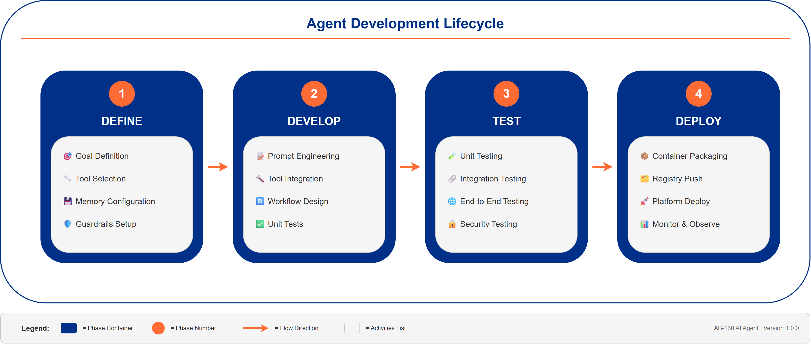
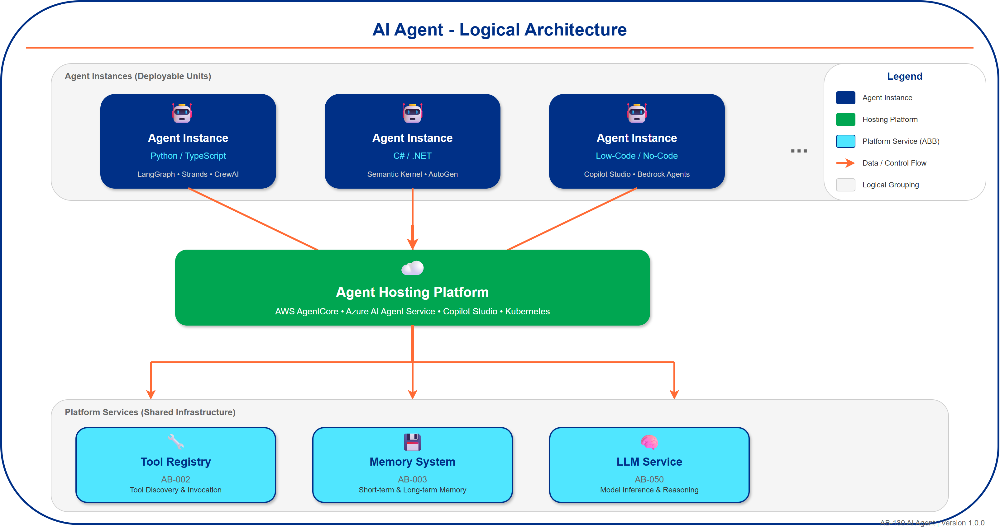

# AI Agent

## Document Control

| Property | Value |
|----------|-------|
| **ABB ID** | `AB-130` |
| **ABB Name** | AI Agent |
| **Version** | `1.0.0` |
| **Status** | `Preliminary` |
| **Category** | `Agentic` |

---

## 1. ABB Overview

### 1.1 Definition

**ABB Name**: AI Agent

**Short Name**: AGT

**Category**: Agentic

**Description**:
A platform-agnostic, autonomous AI agent that executes tasks using LLM-based reasoning, tool invocation, memory access, and structured workflows. Represents the deployable unit of agentic AI functionality, independent of the underlying hosting platform or development framework.

### 1.2 Purpose and Rationale

**Business Purpose**:

Enable the creation and deployment of specialized AI agents that can autonomously perform domain-specific tasks, reducing manual effort and accelerating business processes. Each agent encapsulates business logic, tool access, and reasoning capabilities for a specific use case or domain, regardless of the underlying technology platform.

**Technical Purpose**:

Provide a standardized, vendor-agnostic specification for individual AI agents that can be implemented across multiple hosting platforms and development frameworks. This ABB defines the logical agent capabilities independent of:

- **Hosting Platforms**: AWS AgentCore, Microsoft Azure AI Agent Service, Microsoft Copilot Studio, Google Vertex AI Agent Builder, or self-hosted solutions.
- **Development Frameworks**: LangGraph, Strands, AutoGen, Semantic Kernel, CrewAI, or proprietary frameworks.
- **Runtime Languages**: Python, TypeScript/JavaScript, C#/.NET, Java, or others.

**Key Responsibilities**:
- Execute autonomous reasoning loops using LLM-based inference.
- Invoke tools from the Tool Registry to perform actions.
- Persist and retrieve context from the Agent Memory System.
- Manage conversation state and task progress.
- Report execution status, metrics, and audit events.
- Handle errors, retries, and graceful degradation.

### 1.3 Scope

**In Scope**:

- Agent runtime execution and lifecycle.
- LLM prompt construction and response parsing.
- Tool invocation and result handling.
- Memory read/write operations (short-term and long-term).
- State management within agent execution.
- Error handling and retry logic.
- Metrics and telemetry emission.
- Support for ReAct (Reasoning + Acting), Plan-and-Execute, and custom reasoning patterns.

**Out of Scope**:
- Agent orchestration across multiple agents (handled by Agent Orchestrator AB-001).
- Tool implementation and registration (handled by Tool Registry AB-002).
- Memory storage infrastructure (handled by Agent Memory System AB-003).
- LLM model hosting and inference (handled by LLM Service AB-050).
- Human approval workflows (handled by Human-in-the-Loop Gateway AB-008).
- Agent versioning and deployment (handled by Agent Versioning Manager AB-010).

---

## 2. Functional Specification

### 2.1 Core Capabilities

| Capability ID | Capability Name | Description | Priority |
|---------------|-----------------|-------------|----------|
| CP-105 | Agent Orchestration | Coordinate agent execution. | Must Have |
| CP-107 | Agent Memory | Short and long-term agent memory. | Must Have |
| CP-109 | Tool Use | Agents invoke external tools and APIs. | Must Have |
| CP-111 | Multi-Step Reasoning | Logical inference across steps. | Must Have |
| CP-115 | Agent Specialization | Domain-specific expert agents. | Should Have |
| CP-117 | Guardrails | Safety boundaries for agent actions. | Must Have |
| CP-119 | State Management | Maintain execution state. | Must Have |

### 2.2 Functional Requirements

**Primary Functions**:

| Requirement ID | Requirement | Description | Acceptance Criteria |
|----------------|-------------|-------------|---------------------|
| FR-001 | LLM Reasoning Loop | Execute iterative reasoning using LLM inference. | Agent successfully completes multi-turn reasoning to achieve goal. |
| FR-002 | Tool Invocation | Call registered tools with proper parameters. | Tools invoked correctly with validated inputs and outputs parsed. |
| FR-003 | Memory Integration | Read/write to short-term and long-term memory. | Context persisted and retrieved correctly across interactions. |
| FR-004 | State Persistence | Maintain agent state across execution steps. | State recoverable after interruption or failure. |
| FR-005 | Error Handling | Handle tool failures, LLM errors, and timeouts. | Graceful degradation with appropriate error responses. |
| FR-006 | Guardrail Enforcement | Enforce safety boundaries on actions and outputs. | Blocked actions logged, user notified of guardrail triggers. |
| FR-007 | Telemetry Emission | Emit metrics, traces, and audit logs. | All execution steps traceable in observability platform. |
| FR-008 | Framework Compatibility | Support multiple agent frameworks. | Agents deployable using LangGraph, Strands, AutoGen, Semantic Kernel, CrewAI, or platform-native frameworks. |
| FR-009 | Platform Portability | Deploy across multiple hosting platforms. | Agent logic portable between AWS AgentCore, Azure AI Agent Service, Copilot Studio, and self-hosted environments. |

### 2.3 Non-Functional Requirements

| Category | Requirement | Target | Rationale |
|----------|-------------|--------|-----------|
| **Performance** | Single step latency | <2s p95 (excluding LLM inference) | Responsive agent execution |
| **Performance** | End-to-end task completion | <30s for simple tasks, <5min for complex | User experience |
| **Scalability** | Concurrent executions | 1000+ per agent type | Handle peak load |
| **Availability** | Uptime SLA | 99.9% | Business continuity |
| **Security** | Data encryption | TLS 1.3 in transit, AES-256 at rest | Compliance |
| **Compliance** | Data residency | Configurable per deployment | Regulatory requirements for sensitive data |
| **Reliability** | Task completion rate | >95% for well-defined tasks | Quality of service |
| **Maintainability** | Deployment frequency | Multiple daily deployments | CI/CD agility |

---

## 3. Integration Specification

### 3.1 Dependencies

**Upstream Dependencies** (ABBs this building block depends on):

| ABB ID | ABB Name | Dependency Type | Description |
|--------|----------|-----------------|-------------|
| [AB-050](../AB-050/index.md) | Large Language Model Service | Required | LLM inference for agent reasoning |
| [AB-002](../AB-002/index.md) | Tool Registry | Required | Discovery and invocation of available tools |
| [AB-003](../AB-003/index.md) | Agent Memory System | Required | Short-term and long-term memory storage |
| [AB-004](../AB-004/index.md) | Planning Module | Optional | Strategic planning for complex tasks |
| [AB-006](../AB-006/index.md) | Reflection Module | Optional | Self-critique and learning |
| [AB-080](../AB-080/index.md) | Knowledge Base | Optional | Domain knowledge retrieval |
| [AB-051](../AB-051/index.md) | Vector Database | Optional | Semantic search for RAG patterns |

**Downstream Consumers** (ABBs that depend on this building block):

| ABB ID | ABB Name | Dependency Type | Description |
|--------|----------|-----------------|-------------|
| [AB-001](../AB-001/index.md) | Agent Orchestrator | Required | Orchestrates multiple AI Agents |
| [AB-007](../AB-007/index.md) | Multi Agent Communication Bus | Optional | Inter-agent messaging |
| [AB-008](../AB-008/index.md) | Human in the Loop Gateway | Optional | Human approval integration |
| [AB-009](../AB-009/index.md) | Agent Cost Monitor | Required | Cost tracking per agent |
| [AB-096](../AB-096/index.md) | Observability Platform | Required | Monitoring and tracing |
| [AB-065](../AB-065/index.md) | Audit Trail and Logging | Required | Audit logging for compliance |

### 3.2 Interfaces

**Input Interfaces**:

| Interface ID | Interface Name | Protocol | Data Format | Description |
|--------------|----------------|----------|-------------|-------------|
| IF-IN-001 | Agent Invocation API | REST/gRPC | JSON | Receives task requests with goal, context, and constraints |
| IF-IN-002 | Streaming Input | WebSocket | JSON | Receives streaming input for interactive sessions |
| IF-IN-003 | Event Trigger | Kafka/EventBridge | Avro/JSON | Receives event-driven invocation triggers |
| IF-IN-004 | Orchestrator Callback | gRPC | Protobuf | Receives instructions from Agent Orchestrator |

**Output Interfaces**:

| Interface ID | Interface Name | Protocol | Data Format | Description |
|--------------|----------------|----------|-------------|-------------|
| IF-OUT-001 | Task Response API | REST/gRPC | JSON | Returns task results, status, and artifacts |
| IF-OUT-002 | Streaming Output | WebSocket/SSE | JSON | Streams intermediate results and reasoning steps |
| IF-OUT-003 | Agent Events | Kafka | Avro | Publishes execution events for observability |
| IF-OUT-004 | Tool Invocation | REST/gRPC | JSON | Calls tools via Tool Registry |
| IF-OUT-005 | Memory Operations | REST/gRPC | JSON | Read/write to Agent Memory System |

### 3.3 Data Contracts

**Input Data**:
```yaml
# Agent invocation request schema
agent_invocation_request:
  type: object
  properties:
    invocation_id:
      type: string
      format: uuid
      description: "Unique identifier for this invocation"
    agent_id:
      type: string
      description: "Identifier of the agent to invoke"
    agent_version:
      type: string
      description: "Semantic version of the agent"
    goal:
      type: string
      description: "Natural language description of the task goal"
    context:
      type: object
      properties:
        conversation_id:
          type: string
          description: "ID for conversation continuity"
        user_id:
          type: string
          description: "Requesting user identifier"
        session_context:
          type: object
          description: "Session-specific context data"
        domain_context:
          type: object
          description: "Domain-specific input data"
    constraints:
      type: object
      properties:
        max_steps:
          type: integer
          description: "Maximum reasoning steps allowed"
        max_tokens:
          type: integer
          description: "Maximum tokens to consume"
        timeout_seconds:
          type: integer
          description: "Maximum execution time"
        allowed_tools:
          type: array
          items:
            type: string
          description: "Whitelist of permitted tools"
        require_human_approval:
          type: array
          items:
            type: string
          description: "Actions requiring human approval"
  required:
    - invocation_id
    - agent_id
    - goal
```

**Output Data**:
```yaml
# Agent invocation response schema
agent_invocation_response:
  type: object
  properties:
    invocation_id:
      type: string
      description: "Matching invocation identifier"
    status:
      type: string
      enum: [completed, failed, pending_approval, timeout, cancelled]
      description: "Execution status"
    result:
      type: object
      properties:
        output:
          type: string
          description: "Final output/answer from the agent"
        artifacts:
          type: array
          items:
            type: object
          description: "Generated artifacts (files, data, etc.)"
        confidence:
          type: number
          description: "Agent's confidence in the result (0-1)"
    execution_trace:
      type: array
      items:
        type: object
        properties:
          step_number:
            type: integer
          action:
            type: string
            enum: [think, tool_call, memory_read, memory_write, respond]
          details:
            type: object
          timestamp:
            type: string
            format: date-time
          duration_ms:
            type: integer
    metrics:
      type: object
      properties:
        total_duration_ms:
          type: integer
        llm_calls:
          type: integer
        tokens_consumed:
          type: integer
        tools_invoked:
          type: integer
        memory_operations:
          type: integer
        estimated_cost_usd:
          type: number
    error:
      type: object
      properties:
        code:
          type: string
        message:
          type: string
        recoverable:
          type: boolean
```

---

## 4. Quality Attributes

### 4.1 Performance Characteristics

| Metric | Target | Measurement Method |
|--------|--------|-------------------|
| Latency (p50) | <500ms per step | APM tracing |
| Latency (p95) | <2s per step | APM tracing |
| Throughput | 100 req/s per agent instance | Load testing |
| Error Rate | <1% | Error monitoring |

### 4.2 Reliability Requirements

| Attribute | Requirement | Recovery Strategy |
|-----------|-------------|-------------------|
| Availability | 99.9% | Multi-AZ deployment, auto-scaling |
| Durability | State persisted | Checkpoint to Agent Memory System |
| Recovery Time (RTO) | < 5 minutes | Automatic restart, state recovery |
| Recovery Point (RPO) | < 30 seconds | Frequent state checkpointing |

### 4.3 Security Requirements

| Security Control | Requirement | Implementation Guidance |
|-----------------|-------------|------------------------|
| Authentication | mTLS + API keys | Service mesh with certificate rotation |
| Authorization | RBAC per agent/tool | Policy engine integration |
| Encryption at Rest | AES-256 | KMS-managed keys |
| Encryption in Transit | TLS 1.3 | Certificate pinning |
| Audit Logging | All actions logged | Integration with AB-065 |
| Input Validation | Strict schema validation | JSON Schema validation |
| Output Sanitization | PII detection and masking | Integration with AB-114 |

---

## 5. Governance

### 5.1 Ownership and Accountability

| Role | Responsibility | Contact |
|------|----------------|---------|
| Architecture Owner | Strategic direction, design decisions | AI Platform Architecture Team |
| Technical Owner | Implementation, maintenance | AI Engineering Team |
| Operations Owner | Day-to-day operations, monitoring | Platform Operations Team |

### 5.2 Lifecycle Management

| Phase | Activities | Exit Criteria |
|-------|-----------|---------------|
| Design | Agent specification, capability mapping | Design approved |
| Build | Framework selection, agent code development | Testing complete |
| Deploy | Container packaging, platform deployment | Production validated |
| Operate | Monitoring, tuning, incident response | Ongoing |
| Retire | Migration, deprecation notice | Replacement deployed |

### 5.3 Change Management

**Change Categories**:
- **Minor**: Prompt tuning, configuration changes (no approval required)
- **Standard**: New tool integrations, capability additions (team approval)
- **Major**: Framework changes, security model updates (architecture board approval)

---

## 6. Solution Building Block Options

### 6.1 Agent Hosting Platforms

**Note**: This ABB can be implemented on multiple hosting platforms. The choice depends on existing cloud strategy, integration requirements, and organizational preferences.

| Platform | Vendor | Deployment Model | Key Strengths | Considerations |
|----------|--------|------------------|---------------|----------------|
| **AWS AgentCore** | AWS | PaaS | Native AWS integration, Strands framework support, built-in memory and tools | AWS-centric, newer service |
| **Azure AI Agent Service** | Microsoft | PaaS | Enterprise integration, Azure OpenAI, .NET ecosystem | Azure-centric |
| **Microsoft Copilot Studio** | Microsoft | SaaS/Low-Code | Rapid development, M365 integration, business user friendly | Less flexibility for custom logic |
| **Google Vertex AI Agent Builder** | Google | PaaS | Gemini models, GCP integration | Google-centric |
| **Amazon Bedrock Agents** | AWS | SaaS | Fully managed, quick setup, Bedrock model access | Limited customization |
| **Self-Hosted (Kubernetes)** | Open Source | Self-Managed | Full control, multi-cloud, no vendor lock-in | Operational overhead |

### 6.2 Agent Development Frameworks

| Framework | Vendor/Project | Primary Language | Platform Compatibility | Maturity | Best For |
|-----------|----------------|------------------|------------------------|----------|----------|
| **LangGraph** | LangChain | Python, TypeScript | AgentCore, Azure, Self-hosted | Mature | Complex stateful workflows, graph-based agents |
| **Strands** | AWS | Python | AgentCore (native) | Emerging | AWS-native agents, AgentCore optimization |
| **AutoGen** | Microsoft | Python | Azure, Self-hosted, AgentCore | Emerging | Multi-agent conversations, research |
| **Semantic Kernel** | Microsoft | C#, Python, Java | Azure (native), Self-hosted | Mature | .NET enterprise, Copilot extensions |
| **CrewAI** | CrewAI | Python | Self-hosted, AgentCore | Emerging | Role-based multi-agent teams |
| **Copilot Studio** | Microsoft | Low-Code | Copilot Studio (native) | Mature | Business users, M365 integration |
| **Bedrock Agents** | AWS | Config/SDK | Bedrock (native) | Mature | Quick deployment, managed service |

### 6.3 Language and Runtime Support

| Language | Supported Frameworks | Platform Support | Notes |
|----------|---------------------|------------------|-------|
| **Python 3.11+** | LangGraph, Strands, AutoGen, CrewAI, Semantic Kernel | All platforms | Primary recommendation, richest ecosystem |
| **TypeScript/Node.js** | LangGraph.js, Vercel AI SDK | AgentCore, Azure, Self-hosted | Web-native, streaming-focused |
| **C#/.NET 8+** | Semantic Kernel | Azure (native), Self-hosted | Enterprise .NET, Copilot extensions |
| **Java 17+** | Semantic Kernel (Java) | Self-hosted | Enterprise Java ecosystem |
| **Low-Code** | Copilot Studio, Power Automate | Copilot Studio | Business user development |

### 6.4 Candidate SBBs

| SBB ID | SBB Name | Platform | Framework | Recommendation |
|--------|----------|----------|-----------|----------------|
| SBB-130-001 | LangGraph on AgentCore | AWS AgentCore | LangGraph | Recommended (AWS) |
| SBB-130-002 | Strands on AgentCore | AWS AgentCore | Strands | Recommended (AWS-native) |
| SBB-130-003 | Semantic Kernel on Azure | Azure AI Agent Service | Semantic Kernel | Recommended (Azure/.NET) |
| SBB-130-004 | AutoGen on Azure | Azure AI Agent Service | AutoGen | Alternative (Multi-agent) |
| SBB-130-005 | Copilot Studio Agent | Microsoft Copilot Studio | Low-Code | Recommended (Low-code/M365) |
| SBB-130-006 | LangGraph Self-Hosted | Kubernetes | LangGraph | Alternative (Multi-cloud) |
| SBB-130-007 | Bedrock Agent | AWS Bedrock | Bedrock Native | Alternative (Managed) |
| SBB-130-008 | CrewAI on AgentCore | AWS AgentCore | CrewAI | Alternative (Team agents) |

### 6.5 Platform Selection Criteria

| Criterion | Weight | AWS AgentCore | Azure AI Agent | Copilot Studio | Self-Hosted |
|-----------|--------|---------------|----------------|----------------|-------------|
| Functionality | 25% | 5 | 5 | 3 | 5 |
| Enterprise Integration | 20% | 4 | 5 | 5 | 3 |
| Flexibility | 20% | 4 | 4 | 2 | 5 |
| Operational Overhead | 15% | 4 | 4 | 5 | 2 |
| Cost Efficiency | 10% | 4 | 4 | 4 | 3 |
| Security/Compliance | 10% | 5 | 5 | 5 | 4 |
| **Weighted Total** | 100% | **4.3** | **4.4** | **3.7** | **3.8** |

---

## 7. Traceability

### 7.1 Capability Mapping

| Capability ID | Capability Name | Description | Level | How This ABB Supports |
|---------------|-----------------|-------------|-------|----------------------|
| CP-105 | Agent Orchestration | Coordinate agent execution | L2 | Provides the executable agent unit that orchestrators coordinate |
| CP-107 | Agent Memory | Short and long-term agent memory | L2 | Integrates with memory system for context persistence |
| CP-109 | Tool Use | Agents invoke external tools and APIs | L2 | Executes tool invocations as part of reasoning |
| CP-111 | Multi-Step Reasoning | Logical inference across steps | L2 | Implements reasoning loops (ReAct, Plan-Execute) |
| CP-115 | Agent Specialization | Domain-specific expert agents | L2 | Enables domain-specific agent implementations |
| CP-117 | Guardrails | Safety boundaries for agent actions | L2 | Enforces guardrails during execution |
| CP-119 | State Management | Maintain execution state | L2 | Manages internal state throughout task execution |

### 7.2 Pattern Usage

| Pattern ID | Pattern Name | Description | Role in Pattern |
|------------|--------------|-------------|-----------------|
| PT-007 | Agentic AI Pattern | Enable autonomous AI agents for complex tasks | Primary - The core executable agent |
| PT-008 | Multi-Agent Orchestration | Coordinate multiple specialized agents | Component - Individual agent within multi-agent system |
| PT-021 | Autonomous Operations | Self-managing AI operations | Component - Autonomous task executor |

### 7.3 Use Case Support

| Use Case ID | Use Case Name | Description | How This ABB Supports |
|-------------|---------------|-------------|----------------------|
| [UC-001](../../../../01-motivation/03-use-cases/use-cases/UC-001/index.md) | Customer Relationship Management | GenAI-driven relationship management | RM Copilot agent for meeting prep and client insights |
| [UC-002](../../../../01-motivation/03-use-cases/use-cases/UC-002/index.md) | Finance | Financial report generation | Finance automation agent for report creation |
| [UC-007](../../../../01-motivation/03-use-cases/use-cases/UC-007/index.md) | Customer Service | Customer service automation | Customer service agent for query resolution |
| [UC-010](../../../../01-motivation/03-use-cases/use-cases/UC-010/index.md) | SDLC | Developer productivity | Code assistant agent for development tasks |
| [UC-016](../../../../01-motivation/03-use-cases/use-cases/UC-016/index.md) | IT Operations | IT operations automation | IT support agent for ticket routing and resolution |
| [UC-018](../../../../01-motivation/03-use-cases/use-cases/UC-018/index.md) | Procurement | Procurement automation | Procurement agent for vendor and contract management |
| [UC-019](../../../../01-motivation/03-use-cases/use-cases/UC-019/index.md) | Dispute Resolution | Dispute processing | Dispute resolution agent for case handling |

---

## 8. Implementation Guidance

### 8.1 Agent Development Lifecycle



*Figure 8.1: Agent Development Lifecycle showing the four phases from Definition to Deployment*

### 8.2 Agent Structure Examples

The following examples illustrate agent implementation patterns across different frameworks. All examples are illustrative and should be adapted to specific requirements.

#### 8.2.1 Python/LangGraph (AWS AgentCore, Azure, Self-Hosted)

```python
# LangGraph agent structure - illustrative only
from langgraph.graph import StateGraph, END
from typing import TypedDict

class AgentState(TypedDict):
    messages: list
    context: dict
    tools_called: list
    memory: dict

class PlatformAgent:
    """Base class for AI Agents using LangGraph"""

    def __init__(self, agent_id: str, config: AgentConfig):
        self.agent_id = agent_id
        self.config = config
        self.llm = self._init_llm()
        self.tools = self._load_tools()
        self.memory = self._init_memory()
        self.graph = self._build_graph()

    def _build_graph(self) -> StateGraph:
        """Build the agent execution graph"""
        graph = StateGraph(AgentState)
        graph.add_node("reason", self.reason)
        graph.add_node("act", self.act)
        graph.add_node("reflect", self.reflect)
        graph.add_conditional_edges(...)
        return graph.compile()

    async def invoke(self, goal: str, context: dict) -> AgentResult:
        """Execute the agent with given goal and context"""
        state = AgentState(
            messages=[{"role": "user", "content": goal}],
            context=context,
            tools_called=[],
            memory=await self.memory.load(context.get("session_id"))
        )
        result = await self.graph.ainvoke(state)
        return self._format_result(result)
```

#### 8.2.2 C#/Semantic Kernel (Azure AI Agent Service)

```csharp
// Semantic Kernel agent structure - illustrative only
using Microsoft.SemanticKernel;
using Microsoft.SemanticKernel.Agents;

public class PlatformAgent
{
    private readonly Kernel _kernel;
    private readonly ChatCompletionAgent _agent;

    public PlatformAgent(string agentId, AgentConfig config)
    {
        _kernel = Kernel.CreateBuilder()
            .AddAzureOpenAIChatCompletion(config.ModelId, config.Endpoint, config.ApiKey)
            .Build();

        _agent = new ChatCompletionAgent
        {
            Name = agentId,
            Instructions = config.SystemPrompt,
            Kernel = _kernel,
            Arguments = new KernelArguments(new PromptExecutionSettings { })
        };

        // Register tools as kernel functions
        _kernel.ImportPluginFromType<ToolRegistry>();
    }

    public async Task<AgentResult> InvokeAsync(string goal, AgentContext context)
    {
        var chat = new AgentGroupChat(_agent);
        chat.AddChatMessage(new ChatMessageContent(AuthorRole.User, goal));

        await foreach (var response in chat.InvokeAsync())
        {
            // Process streaming response
        }
        return FormatResult(chat);
    }
}
```

#### 8.2.3 Python/Strands (AWS AgentCore Native)

```python
# Strands agent structure - illustrative only
from strands import Agent, tool
from strands.models import BedrockModel

@tool
def search_knowledge_base(query: str) -> str:
    """Search the knowledge base for relevant information"""
    # Tool implementation
    pass

class PlatformStrandsAgent(Agent):
    """Platform Agent using AWS Strands framework"""

    def __init__(self, agent_id: str, config: AgentConfig):
        model = BedrockModel(model_id=config.model_id)
        super().__init__(
            model=model,
            system_prompt=config.system_prompt,
            tools=[search_knowledge_base],
            memory=config.memory_config
        )

    async def execute(self, goal: str) -> AgentResult:
        response = await self(goal)
        return self._format_result(response)
```

#### 8.2.4 Low-Code (Microsoft Copilot Studio)

For Copilot Studio agents, configuration is done through the visual designer:
- **Topics**: Define conversation flows and triggers
- **Actions**: Connect to Power Automate flows, APIs, or custom connectors
- **Knowledge Sources**: Link SharePoint, Dataverse, or custom knowledge bases
- **Generative AI**: Enable orchestrated responses with GPT models

### 8.3 Deployment Models

#### 8.3.1 Platform-Agnostic Architecture



*Figure 8.2: AI Agent Logical Architecture showing agent instances, hosting platform, and platform services*

#### 8.3.2 Platform-Specific Deployments

| Platform | Compute | Memory | Tools | LLM |
|----------|---------|--------|-------|-----|
| **AWS AgentCore** | ECS Fargate/Lambda | DynamoDB/Redis | MCP Servers | Bedrock |
| **Azure AI Agent** | Azure Functions/AKS | Cosmos DB/Redis | Azure Functions | Azure OpenAI |
| **Copilot Studio** | Microsoft Managed | Dataverse | Power Automate | Azure OpenAI |
| **Self-Hosted** | Kubernetes | PostgreSQL/Redis | REST APIs | Any LLM |

---

## 9. References

### 9.1 Related Documents

- [AB-001 Agent Orchestrator](../AB-001/index.md) - Orchestrates multiple AI Agents
- [AB-002 Tool Registry](../AB-002/index.md) - Tool discovery and invocation
- [AB-003 Agent Memory System](../AB-003/index.md) - Memory persistence
- [AB-050 Large Language Model Service](../AB-050/index.md) - LLM inference
- [PT-007 Agentic AI Pattern](../../../patterns/PT-007-Agentic-AI-Pattern-v1.0.0.md) - Agentic design pattern

### 9.2 External References

**Hosting Platforms**:
- [AWS AgentCore Documentation](https://docs.aws.amazon.com/agentcore/)
- [Azure AI Agent Service](https://learn.microsoft.com/en-us/azure/ai-services/agents/)
- [Microsoft Copilot Studio](https://learn.microsoft.com/en-us/microsoft-copilot-studio/)
- [Google Vertex AI Agent Builder](https://cloud.google.com/vertex-ai/docs/agents)
- [Amazon Bedrock Agents](https://docs.aws.amazon.com/bedrock/latest/userguide/agents.html)

**Development Frameworks**:
- [LangGraph Documentation](https://langchain-ai.github.io/langgraph/)
- [AWS Strands Agents SDK](https://github.com/strands-agents/sdk-python)
- [Microsoft Semantic Kernel](https://learn.microsoft.com/en-us/semantic-kernel/)
- [Microsoft AutoGen](https://microsoft.github.io/autogen/)
- [CrewAI Documentation](https://docs.crewai.com/)

**Research & Best Practices**:
- [Anthropic Agent Patterns](https://www.anthropic.com/research/building-effective-agents)
- [ReAct Paper](https://arxiv.org/abs/2210.03629) - Reasoning and Acting in Language Models
- [Microsoft AI Agents Overview](https://learn.microsoft.com/en-us/azure/ai-services/agents/overview)

---

## Appendix A: Glossary

| Term | Definition |
|------|------------|
| ABB | Architecture Building Block - a vendor-agnostic logical component that defines required capabilities. |
| Agent | An autonomous AI system that perceives its environment, reasons about goals, and takes actions. |
| AgentCore | AWS service for hosting and managing AI agents with built-in memory, tools, and observability. |
| AutoGen | Microsoft framework for building multi-agent conversational AI systems. |
| Azure AI Agent Service | Microsoft Azure platform for deploying and managing AI agents. |
| Copilot Studio | Microsoft low-code platform for building conversational AI agents with M365 integration. |
| Guardrail | Safety boundary that constrains agent actions to prevent harmful or unauthorized behavior. |
| LangGraph | Framework for building stateful, multi-step agent applications using graph-based workflows. |
| ReAct | Reasoning and Acting pattern where agents alternate between thinking and taking actions. |
| SBB | Solution Building Block - a specific technology implementation of an ABB. |
| Semantic Kernel | Microsoft SDK for integrating LLMs into applications with support for agents, memory, and plugins. |
| Strands | AWS-native agent framework optimized for AgentCore deployment. |
| Tool | A function or API that an agent can invoke to perform actions or retrieve information. |

---

## Appendix B: Revision History

| Version | Date | Author | Changes |
|---------|------|--------|---------|
| 1.0.0 | 2025-12-12 | AI Platform Architecture | Initial version |
