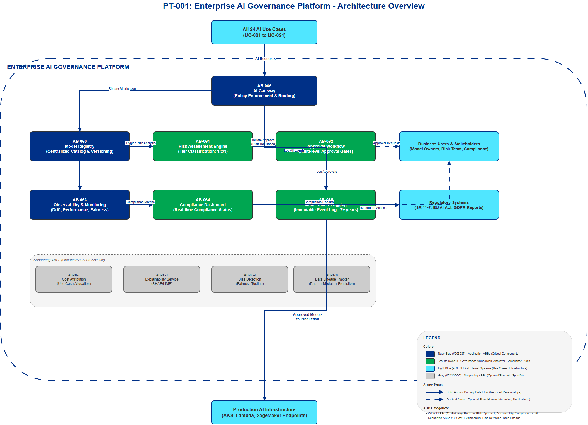

# AI Architecture Pattern: Enterprise AI Governance Platform

## Document Control

| Property | Value |
|----------|-------|
| **Pattern ID** | `PT-001` |
| **Pattern Name** | Enterprise AI Governance Platform |
| **Version** | `1.0.0` |
| **Status** | `Approved` |
| **Created Date** | `2025-12-05` |
| **Last Modified** | `2025-12-05` |
| **Owner** | BNZ Enterprise Architecture |
| **Pattern Category** | `Governance` |
| **Maturity Level** | `Emerging` |

---

## 1. Pattern Overview

### 1.1 Pattern Name and Classification

**Pattern Name**: Enterprise AI Governance Platform (MANDATORY)

**Short Name**: AI Governance Platform

**Pattern Category**: Governance

**Pattern Type**: Cross-Cutting Platform

### 1.2 Intent and Context

**Intent Statement**:
Provide centralized governance, monitoring, and compliance management for all AI models and systems across the enterprise, ensuring responsible AI deployment aligned with regulatory requirements and organizational risk appetite.

**Problem Statement**:
Financial services institutions deploying AI at scale face critical challenges:
- Lack of visibility into AI models across the organization (shadow AI)
- Inconsistent risk assessment and approval processes for model deployment
- Inability to demonstrate compliance with evolving AI regulations (EU AI Act, GDPR, Model Risk Management)
- No unified monitoring for model performance, drift, and fairness
- Difficulty attributing AI costs to business units and use cases
- Incomplete audit trails for regulatory examination

Without a centralized governance platform, organizations face regulatory penalties, reputational damage from biased models, and inability to scale AI responsibly.

**Context**:
This pattern is MANDATORY for all AI deployments in financial services (2025 standard). It applies enterprise-wide across all 24 BNZ AI use cases, from low-risk chatbots to high-risk credit decisioning systems. The platform serves as the central control point for AI governance, sitting between AI use cases and production infrastructure.

**Forces**:
- **Regulatory compliance vs. deployment velocity**: Need to meet strict financial services regulations while enabling rapid AI innovation
- **Centralized control vs. autonomous teams**: Balance governance oversight with team autonomy and self-service capabilities
- **Comprehensive monitoring vs. cost**: Desire for complete observability must be balanced against infrastructure and operational costs
- **Standardization vs. flexibility**: Need standardized governance processes while accommodating diverse AI technologies and use cases
- **Security vs. accessibility**: Protect sensitive model data while enabling appropriate access for development and audit

### 1.3 Pattern Maturity and Industry Adoption

**Maturity Level**: Emerging

**Industry Adoption**:
- **Adoption Rate**: 65% of large financial services institutions have implemented or are implementing enterprise AI governance platforms (2025)
- **Reference Implementations**:
  - JPMorgan Chase - Centralized AI Control Room (2024)
  - Capital One - ML Platform with integrated governance (2023)
  - ING Bank - Responsible AI Framework with automated controls (2024)
- **Timeframe**: Emerging since 2023, becoming mainstream in 2025 driven by EU AI Act and Model Risk Management requirements

**Standards Alignment**:
- **SR 11-7**: Federal Reserve Guidance on Model Risk Management (US) - now explicitly applied to AI, ML, and Generative AI systems (June 2025 update)
- **EU AI Act**: Risk-based classification and conformity assessment - prohibition of unacceptable risk AI systems effective February 1, 2025; AI literacy obligations effective February 2, 2025; high-risk provisions delayed to December 2027
- **GDPR Article 22**: Right to explanation for automated decisions
- **ISO/IEC 42001:2023**: World's first international AI Management System standard - provides certification pathway for AI governance maturity
- **NIST AI RMF 2.0**: Released February 2024 - addresses generative AI, supply chain vulnerabilities, new attack models; four core functions: GOVERN-MAP-MEASURE-MANAGE
- **OCC 2011-12**: Sound Practices for Model Risk Management - four pillars: Validation, Documentation, Governance, Monitoring
- **DORA (Digital Operational Resilience Act)**: EU banking regulation - AI vendors must meet both AI Act fairness/bias requirements AND DORA cybersecurity/resilience requirements
- **SAFe**: Scaled Agile Framework for enterprise architecture governance

---

## 2. Architecture Specification

### 2.1 Architecture Building Blocks (ABBs)

**Primary ABBs** (Core components required):

| ABB ID | ABB Name | Purpose in Pattern | Criticality |
|--------|----------|-------------------|-------------|
| [AB-060](../../architecture-building-blocks/abbs/AB-060/AB-060-AI-Model-Registry-v1.0.0.md) | AI Model Registry | Centralized catalog of all AI models (dev, staging, production) with versioning and metadata | Critical |
| [AB-061](../../architecture-building-blocks/abbs/AB-061/AB-061-Risk-Assessment-Engine-v1.0.0.md) | Risk Assessment Engine | Automated risk scoring and tier classification (Tier 1/2/3) for AI models | Critical |
| [AB-062](../../architecture-building-blocks/abbs/AB-062/AB-062-Approval-Workflow-Orchestrator-v1.0.0.md) | Approval Workflow Orchestrator | Multi-level approval gates for model deployment based on risk tier | Critical |
| [AB-063](../../architecture-building-blocks/abbs/AB-063/AB-063-ML-Model-Explainability-Engine-v1.0.0.md) | Observability & Monitoring Platform | Unified monitoring for model performance, drift, accuracy, and fairness | Critical |
| [AB-064](../../architecture-building-blocks/abbs/AB-064/AB-064-Compliance-Dashboard-v1.0.0.md) | Compliance Dashboard | Real-time compliance status across regulations (GDPR, AML, Model Risk) | Critical |
| [AB-065](../../architecture-building-blocks/abbs/AB-065/AB-065-Audit-Trail-and-Logging-v1.0.0.md) | Audit Trail & Logging | Immutable log of all AI decisions, model changes, and governance events | Critical |
| [AB-066](../../architecture-building-blocks/abbs/AB-066/AB-066-AI-Gateway-v1.0.0.md) | AI Gateway | Central entry point and policy enforcement for all AI requests | Critical |

**Supporting ABBs** (Optional or scenario-specific):

| ABB ID | ABB Name | Purpose in Pattern | When Required |
|--------|----------|-------------------|---------------|
| [AB-067](../../architecture-building-blocks/abbs/AB-067/AB-067-Cost-Attribution-Engine-v1.0.0.md) | Cost Attribution Engine | Track and allocate AI infrastructure costs by use case/business unit | Recommended for enterprise deployments |
| [AB-068](../../architecture-building-blocks/abbs/AB-068/AB-068-Explainability-Service-v1.0.0.md) | Explainability Service | SHAP/LIME analysis for model predictions | MANDATORY for credit, risk, and HR use cases |
| [AB-069](../../architecture-building-blocks/abbs/AB-069/AB-069-Bias-Detection-Framework-v1.0.0.md) | Bias Detection Framework | Fairness testing across demographic groups | MANDATORY for credit decisioning and HR applications |
| [AB-070](../../architecture-building-blocks/abbs/AB-070/AB-070-Data-Lineage-Tracker-v1.0.0.md) | Data Lineage Tracker | Track data → features → model → prediction path | MANDATORY for audit and regulatory compliance |
| [AB-071](../../architecture-building-blocks/abbs/AB-071/AB-071-Model-Performance-Benchmarking-v1.0.0.md) | Model Performance Benchmarking | Champion/Challenger testing and A/B experimentation | Recommended for production model optimization |

**Cross-Cutting ABBs** (Always required):

| ABB ID | ABB Name | Purpose |
|--------|----------|---------|
| [AB-112](../../architecture-building-blocks/abbs/AB-112/AB-112-Data-Encryption-Service-v1.0.0.md) | Security & Identity Management | Authentication, authorization, RBAC for governance platform |
| [AB-096](../../architecture-building-blocks/abbs/AB-096/AB-096-Observability-Platform-v1.0.0.md) | Platform Observability | Monitoring, logging, alerting for governance platform itself |
| [AB-074](../../architecture-building-blocks/abbs/AB-074/AB-074-Event-Broker-v1.0.0.md) | Integration Hub | API management and integration with upstream/downstream systems |

### 2.2 Pattern Structure

**Architectural Diagram**:



**Component Interaction Flow**:
```
[All 24 AI Use Cases]
    ↓
[AI Gateway] (AB-066)
    ↓
┌─────────────────────────────────────────────────────────┐
│         ENTERPRISE AI GOVERNANCE PLATFORM               │
│                                                         │
│  [Model Registry]     [Risk Assessment]                 │
│  (AB-060)        (AB-061)                     │
│         ↓                    ↓                          │
│  [Approval Workflow]  [Compliance Dashboard]            │
│  (AB-062)        (AB-064)                     │
│         ↓                    ↓                          │
│  [Observability]      [Audit Trail]                     │
│  (AB-063)        (AB-065)                     │
│         ↓                    ↓                          │
│  [Cost Attribution]   [Explainability]                  │
│  (AB-067)        (AB-068)                     │
└─────────────────────────────────────────────────────────┘
    ↓
[Production AI Infrastructure]
    ↓
[Business Users / End Customers]
```

**Key Interactions**:

1. **Model Registration**: Data scientist submits new model to Model Registry ([AB-060](../../architecture-building-blocks/abbs/AB-060/AB-060-AI-Model-Registry-v1.0.0.md))
   - Protocol: REST API (POST /api/v1/models)
   - Data Format: Model metadata (JSON) + model artifacts (binary)
   - Latency Target: < 5 seconds for registration
   - Trigger: Automated from CI/CD pipeline or manual submission

2. **Risk Classification**: Risk Assessment Engine ([AB-061](../../architecture-building-blocks/abbs/AB-061/AB-061-Risk-Assessment-Engine-v1.0.0.md)) automatically analyzes model
   - Processing Type: Synchronous analysis
   - Risk Factors: Use case type, data sensitivity, business impact, regulatory scope
   - Output: Risk tier (1/2/3) with confidence score
   - Latency Target: < 30 seconds for classification

3. **Approval Workflow**: Approval Workflow Orchestrator ([AB-062](../../architecture-building-blocks/abbs/AB-062/AB-062-Approval-Workflow-Orchestrator-v1.0.0.md)) routes for review
   - Processing Type: Asynchronous workflow (human-in-the-loop)
   - Workflow Steps: Tier-based approval chain (see section 2.2.1)
   - Error Handling: Notification on timeout, escalation policies
   - SLA: Tier 1 (10 days), Tier 2 (5 days), Tier 3 (2 days)

4. **Runtime Governance**: AI Gateway ([AB-066](../../architecture-building-blocks/abbs/AB-066/AB-066-AI-Gateway-v1.0.0.md)) enforces policies on every AI request
   - Protocol: Synchronous API gateway (REST/gRPC proxy)
   - Policy Checks: Rate limiting, access control, cost quotas, compliance flags
   - Latency Target: < 10ms overhead
   - Delivery Mechanism: Proxy pattern with inline policy enforcement

5. **Continuous Monitoring**: Observability Platform ([AB-063](../../architecture-building-blocks/abbs/AB-063/AB-063-ML-Model-Explainability-Engine-v1.0.0.md)) tracks deployed models
   - Processing Type: Asynchronous streaming analytics
   - Metrics: Accuracy, drift, fairness, latency, cost
   - Alert Mechanism: Threshold-based alerts to model owners and governance team
   - Retention: 24 months for production metrics

6. **Audit Logging**: All governance events logged to Audit Trail ([AB-065](../../architecture-building-blocks/abbs/AB-065/AB-065-Audit-Trail-and-Logging-v1.0.0.md))
   - Protocol: Asynchronous event streaming
   - Event Types: Model changes, approvals, predictions (sampled), policy violations
   - Storage: Immutable append-only log (blockchain or QLDB)
   - Retention: 7+ years for financial services compliance

#### 2.2.1 Model Risk Tiers and Approval Workflows

**Risk Tier Classification**:

| Tier | Description | Impact | Examples | Approval Requirements |
|------|-------------|--------|----------|----------------------|
| **Tier 1** | High impact, regulatory critical | Direct financial/credit decisions affecting customers | Credit decisioning ([UC-004](../../../01-motivation/03-use-cases/use-cases/UC-004/index.md)), AML detection ([UC-011](../../../01-motivation/03-use-cases/use-cases/UC-011/index.md)), Fraud scoring ([UC-013](../../../01-motivation/03-use-cases/use-cases/UC-013/index.md)), Wholesale underwriting ([UC-021](../../../01-motivation/03-use-cases/use-cases/UC-021/index.md)) | Full model validation, quarterly performance review, board-level oversight |
| **Tier 2** | Medium impact, indirect customer effect | Operational decisions, personalization, risk assessment | Partnership banking insights ([UC-001](../../../01-motivation/03-use-cases/use-cases/UC-001/index.md)), Hyper-personalization ([UC-006](../../../01-motivation/03-use-cases/use-cases/UC-006/index.md)), Payment disputes ([UC-019](../../../01-motivation/03-use-cases/use-cases/UC-019/index.md)), Controls testing ([UC-020](../../../01-motivation/03-use-cases/use-cases/UC-020/index.md)) | Validation required, annual review, senior management approval |
| **Tier 3** | Low impact, internal/non-critical | Productivity tools, content generation, analytics | Contact center assist ([UC-007](../../../01-motivation/03-use-cases/use-cases/UC-007/index.md)), Learning content ([UC-022](../../../01-motivation/03-use-cases/use-cases/UC-022/index.md)), IT Ops predictions ([UC-016](../../../01-motivation/03-use-cases/use-cases/UC-016/index.md)), SDLC automation ([UC-010](../../../01-motivation/03-use-cases/use-cases/UC-010/index.md)) | Lightweight validation, self-service deployment, automated monitoring |

**Approval Workflow Example** (Tier 1 - Credit Risk Model):

```
1. Data Scientist trains new credit scoring model
   └─ Model automatically registered in Model Registry

2. Risk Assessment Engine analyzes model
   └─ Classified as Tier 1 (credit decisioning, regulatory impact)
   └─ Risk score: 8.5/10 (high)

3. Approval Workflow triggered:
   Step 1: Model Validation Team reviews (5 days SLA)
           - Technical validation: backtesting, performance metrics
           - Documentation review: model risk document
           - Status: APPROVED

   Step 2: Risk Management Team approves (3 days SLA)
           - Risk assessment: alignment with risk appetite
           - Regulatory review: compliance with SR 11-7
           - Status: APPROVED

   Step 3: Compliance Team approves (2 days SLA)
           - GDPR compliance: data minimization, consent
           - Fairness testing: demographic parity analysis
           - Status: APPROVED WITH CONDITIONS (monthly fairness monitoring)

   Step 4: Model Risk Committee approves (monthly meeting)
           - Executive review: strategic alignment
           - Board reporting: material model inventory update
           - Status: APPROVED

4. Model deployed to production
   └─ Champion/Challenger pattern: 10% traffic to new model
   └─ Continuous monitoring enabled
   └─ All approval steps logged in immutable audit trail

5. Post-Deployment Governance
   └─ Weekly performance monitoring
   └─ Monthly fairness review
   └─ Quarterly model performance review (MRM requirement)
```

### 2.3 Data Flow

**Data Sources**:
- **AI Models**: Model artifacts (pkl, ONNX, TensorFlow SavedModel, PyTorch), metadata, training data references
- **Prediction Requests**: Runtime inference requests (REST API, gRPC, message queues)
- **Prediction Responses**: Model outputs, confidence scores, explanations
- **Model Metrics**: Performance metrics (accuracy, precision, recall, F1), drift metrics, fairness metrics
- **Cost Data**: Infrastructure costs (compute, storage, API calls) from cloud providers
- **User Activity**: Model access logs, approval actions, configuration changes
- **Regulatory Data**: Compliance requirements, audit requests, regulatory reporting templates

**Data Transformations**:

1. **Risk Scoring Transformation**: Model metadata → Risk tier classification
   - Input: Model metadata (use case, data sources, prediction type, business impact)
   - Processing: Rule-based classification + ML-based risk prediction
   - Output: Risk tier (1/2/3), risk score (0-10), justification

2. **Cost Attribution Transformation**: Raw infrastructure costs → Use case cost allocation
   - Input: Cloud billing data (resource tags, usage metrics)
   - Processing: Tag-based allocation, time-series aggregation
   - Output: Cost per use case, cost per prediction, trend analysis

3. **Fairness Analysis Transformation**: Predictions + demographics → Fairness metrics
   - Input: Model predictions, protected attributes (age, gender, ethnicity)
   - Processing: Statistical parity, equal opportunity, disparate impact calculations
   - Output: Fairness scores, demographic performance breakdown, bias alerts

4. **Audit Trail Transformation**: Governance events → Regulatory reports
   - Input: Audit log events (model changes, approvals, predictions)
   - Processing: Query, filter, aggregate, format for regulatory requirements
   - Output: SR 11-7 reports, EU AI Act conformity assessments, GDPR audits

**Data Sinks**:
- **Model Registry Database**: PostgreSQL/MongoDB, stores model metadata and versions, 5-year retention
- **Artifact Storage**: Amazon S3, stores model binaries and training artifacts, 7-year retention
- **Metrics Database**: InfluxDB/TimescaleDB, time-series performance metrics, 24-month retention
- **Audit Log**: Blockchain/AWS QLDB/Append-only DB, immutable audit trail, 7+ year retention (regulatory requirement)
- **Data Warehouse**: Snowflake/BigQuery, aggregated analytics and reporting, indefinite retention
- **Regulatory Reporting**: External systems (OCC, Federal Reserve) via secure file transfer

**Data Governance**:
- **Classification**:
  - Model artifacts: **Confidential** (proprietary IP)
  - Audit logs: **Restricted** (regulatory sensitive)
  - Metrics/dashboards: **Internal** (operational visibility)
  - Anonymized analytics: **Public** (for external sharing)
- **Retention**:
  - Production models: 7 years (financial services requirement)
  - Audit logs: 7+ years (regulatory examination period)
  - Performance metrics: 24 months (operational analysis)
  - Development models: 90 days (ephemeral environments)
- **Lineage**:
  - Full lineage tracking: Data → Features → Training → Model → Predictions
  - Lineage storage: Graph database (Neo4j) or data catalog (Collibra, Alation)
  - Lineage queries: "Which customer data influenced this credit decision?"
- **Quality**:
  - Model validation: Backtesting, cross-validation, holdout testing (Tier 1/2)
  - Data quality checks: Completeness, accuracy, consistency (Great Expectations)
  - Metadata quality: Required fields, schema validation, semantic checks

### 2.4 Interface Specifications

**Inbound Interfaces** (Inputs to pattern):

| Interface ID | Interface Name | Type | Protocol | Data Format | SLA |
|--------------|---------------|------|----------|-------------|-----|
| IF-IN-001 | Model Registration API | REST API | HTTPS | JSON (model metadata) + Binary (model artifacts) | < 5s response |
| IF-IN-002 | AI Inference Gateway | REST/gRPC API | HTTPS/gRPC | JSON/Protobuf | < 10ms overhead |
| IF-IN-003 | Metrics Ingestion | Event Stream | Kafka/Amazon Kinesis | JSON (metrics events) | < 1s latency |
| IF-IN-004 | Approval Actions | REST API | HTTPS | JSON (approval decisions) | < 2s response |
| IF-IN-005 | Cost Data Feed | Batch ETL | SFTP/S3 | CSV/Parquet (billing data) | Daily batch |
| IF-IN-006 | Audit Query API | REST API | HTTPS | JSON (query parameters) | < 30s response |

**Outbound Interfaces** (Outputs from pattern):

| Interface ID | Interface Name | Type | Protocol | Data Format | SLA |
|--------------|---------------|------|----------|-------------|-----|
| IF-OUT-001 | Governance Dashboard API | REST API | HTTPS | JSON (dashboard data) | < 500ms response |
| IF-OUT-002 | Alert Notifications | Event Stream | Email/Slack/PagerDuty | JSON (alert events) | < 5min delivery |
| IF-OUT-003 | Regulatory Reporting | Batch Export | SFTP/S3 | PDF/CSV (compliance reports) | Weekly/Monthly |
| IF-OUT-004 | Model Deployment Approval | Event Stream | Kafka/Amazon Kinesis | JSON (deployment authorization) | < 1min latency |
| IF-OUT-005 | Cost Attribution Report | REST API | HTTPS | JSON (cost breakdown) | < 2s response |
| IF-OUT-006 | Audit Log Export | Batch Export | Amazon S3 | JSON Lines (audit events) | On-demand |

**Internal Interfaces** (Between ABBs within pattern):

| Interface ID | Source ABB | Target ABB | Protocol | Purpose |
|--------------|-----------|-----------|----------|---------|
| IF-INT-001 | [AB-060](../../architecture-building-blocks/abbs/AB-060/AB-060-AI-Model-Registry-v1.0.0.md) (Model Registry) | [AB-061](../../architecture-building-blocks/abbs/AB-061/AB-061-Risk-Assessment-Engine-v1.0.0.md) (Risk Assessment) | Internal API (gRPC) | Trigger risk analysis on model registration |
| IF-INT-002 | [AB-061](../../architecture-building-blocks/abbs/AB-061/AB-061-Risk-Assessment-Engine-v1.0.0.md) (Risk Assessment) | [AB-062](../../architecture-building-blocks/abbs/AB-062/AB-062-Approval-Workflow-Orchestrator-v1.0.0.md) (Approval Workflow) | Internal API (gRPC) | Initiate approval workflow based on risk tier |
| IF-INT-003 | [AB-066](../../architecture-building-blocks/abbs/AB-066/AB-066-AI-Gateway-v1.0.0.md) (AI Gateway) | [AB-063](../../architecture-building-blocks/abbs/AB-063/AB-063-ML-Model-Explainability-Engine-v1.0.0.md) (Observability) | Event Stream (Internal Kafka) | Stream prediction metrics for monitoring |
| IF-INT-004 | [AB-066](../../architecture-building-blocks/abbs/AB-066/AB-066-AI-Gateway-v1.0.0.md) (AI Gateway) | [AB-065](../../architecture-building-blocks/abbs/AB-065/AB-065-Audit-Trail-and-Logging-v1.0.0.md) (Audit Trail) | Event Stream (Internal Kafka) | Log inference requests for audit |
| IF-INT-005 | [AB-063](../../architecture-building-blocks/abbs/AB-063/AB-063-ML-Model-Explainability-Engine-v1.0.0.md) (Observability) | [AB-064](../../architecture-building-blocks/abbs/AB-064/AB-064-Compliance-Dashboard-v1.0.0.md) (Compliance Dashboard) | Internal API (REST) | Provide compliance metrics for dashboard |
| IF-INT-006 | [AB-062](../../architecture-building-blocks/abbs/AB-062/AB-062-Approval-Workflow-Orchestrator-v1.0.0.md) (Approval Workflow) | [AB-065](../../architecture-building-blocks/abbs/AB-065/AB-065-Audit-Trail-and-Logging-v1.0.0.md) (Audit Trail) | Event Stream (Internal Kafka) | Log approval decisions for audit |

---

## 3. Pattern Variants and Options

### 3.1 Pattern Variations

**Variant 1: Federated Governance Model**
- **When to Use**: Large enterprises with autonomous business units requiring local governance autonomy while maintaining enterprise standards
- **Key Differences**:
  - Distributed governance instances per business unit (e.g., Retail Banking, CIB, Wealth)
  - Central governance hub aggregates metrics and enforces minimum standards
  - Local approval workflows with centralized audit trail
- **Trade-offs**:
  - Gain: Business unit autonomy, reduced approval bottlenecks, localized risk management
  - Lose: Increased complexity, potential inconsistency across units, higher operational cost

**Variant 2: Lightweight Governance (Tier 3 Only)**
- **When to Use**: Organizations starting AI journey, only deploying low-risk use cases (chatbots, internal tools)
- **Key Differences**:
  - Simplified model registry (no validation workflow)
  - Automated risk assessment (no manual review)
  - Self-service deployment (no approval gates)
  - Basic observability (uptime, latency only)
- **Trade-offs**:
  - Gain: Faster time-to-market, lower governance overhead, reduced cost
  - Lose: Not suitable for regulated use cases, limited compliance capabilities, manual scaling challenges

**Variant 3: Real-Time Governance**
- **When to Use**: High-frequency, real-time AI systems (fraud detection, payment authorization, trading algorithms)
- **Key Differences**:
  - In-memory policy enforcement (Redis/Hazelcast)
  - Streaming observability (no batch processing)
  - Pre-approved model catalog (instant deployment)
  - Real-time fairness monitoring
- **Trade-offs**:
  - Gain: Sub-millisecond governance overhead, real-time alerting, inline policy enforcement
  - Lose: Higher infrastructure cost, complex streaming architecture, reduced auditability depth

**Variant 4: Open Source Governance Stack**
- **When to Use**: Cost-constrained organizations, avoid vendor lock-in, full customization required
- **Key Differences**:
  - MLflow (model registry) instead of proprietary tools
  - Open Policy Agent (OPA) for policy enforcement
  - Prometheus/Grafana for observability
  - PostgreSQL + Kafka for audit trail
- **Trade-offs**:
  - Gain: No licensing costs, full code visibility, community support, high customization
  - Lose: More operational overhead, integration complexity, limited enterprise support

### 3.2 Composition with Other Patterns

**Commonly Combined With**:

| Pattern | Integration Point | Combined Benefit |
|---------|------------------|------------------|
| PT-002: MLOps Level 2+ | Model Registry + CI/CD Pipeline | Governance platform consumes MLOps pipeline events; automated model registration from CI/CD; deployment gates based on governance approval |
| PT-003: RAG (Retrieval-Augmented Generation) | AI Gateway + Observability | Gateway enforces data access policies for RAG; monitor retrieval quality and LLM hallucinations; audit which documents influenced each response |
| PT-004: Multi-Agent Systems | Agent Registry + Orchestration Monitoring | Track agent behaviors as "models"; monitor inter-agent communication; detect rogue agent behavior; audit agent decision chains |
| PT-005: Real-Time ML Inference | AI Gateway + Low-Latency Monitoring | Inline policy enforcement with <10ms overhead; real-time drift detection; stream governance events to audit trail |
| PT-006: Feature Store | Data Lineage + Feature Monitoring | Track features → model lineage; monitor feature drift; detect feature data quality issues; audit feature usage by models |

**Anti-Patterns** (What NOT to do):

- **Anti-Pattern 1: Shadow AI Registries**
  - **Description**: Teams maintain separate model inventories outside governance platform
  - **Why Problematic**: Incomplete risk visibility, compliance gaps, duplicate effort, inconsistent standards
  - **Better Approach**: Mandatory registration via API integration with CI/CD pipelines; block production deployment without governance approval; provide self-service registration UI

- **Anti-Pattern 2: Governance as Afterthought**
  - **Description**: Add governance controls after models are in production
  - **Why Problematic**: Retrofit compliance is expensive; production disruption; incomplete audit trails; potential regulatory findings
  - **Better Approach**: Shift-left governance; integrate into development workflow; require governance approval before production deployment; automated compliance checks in CI/CD

- **Anti-Pattern 3: Manual Risk Assessment**
  - **Description**: Manually classify model risk tier for every model
  - **Why Problematic**: Bottleneck for deployment velocity; inconsistent classification; human error; doesn't scale
  - **Better Approach**: Automated risk scoring based on metadata; rule-based initial classification; human review only for borderline cases; ML-based risk prediction model

- **Anti-Pattern 4: Separate Governance Silos**
  - **Description**: Different governance tools for GenAI, Traditional ML, and Analytics
  - **Why Problematic**: Fragmented visibility; inconsistent policies; multiple audit trails; high operational overhead
  - **Better Approach**: Unified governance platform covering all AI modalities; common risk framework; single audit trail; technology-agnostic abstractions

- **Anti-Pattern 5: Governance Bottleneck**
  - **Description**: All model deployments queue through single approval committee
  - **Why Problematic**: Weeks/months delay for low-risk models; team frustration; teams bypass governance
  - **Better Approach**: Tier-based approval (self-service for Tier 3); parallel review workflows; automated validation; escalation-based approvals only

---

## 4. Implementation Guidance

### 4.1 Technology Stack Options

**Model Registry**:
- **MLflow**: Open source, Python-native, integrated with ML frameworks, Amazon S3 backend
- **Kubeflow Model Registry**: Kubernetes-native, integrated with Kubeflow pipelines, CRD-based
- **AWS SageMaker Model Registry**: Managed service, integrated with SageMaker, auto-scaling
- **AWS SageMaker Model Registry**: Managed service, integrated with AWS SageMaker, enterprise-grade security
- **Databricks Unity Catalog**: Data + model governance, delta lake integration, lineage tracking
- **Recommendation for BNZ**: MLflow (open source, flexibility) OR AWS SageMaker (if AWS-native strategy)

**Risk Assessment Framework**:
- **Custom Framework**: Rule-based classification (use case type, data sensitivity, regulatory scope) + ML risk model
- **DataRobot Governance**: Automated model validation, risk scoring, bias detection
- **H2O.ai Model Risk Management**: Financial services focus, SR 11-7 compliance, validation workflows
- **Recommendation for BNZ**: Custom framework initially (rules + metadata) → evolve to ML-based risk scoring

**Approval Workflow Engine**:
- **Camunda**: Open source BPMN engine, visual workflow designer, audit trail
- **Temporal**: Modern workflow orchestration, fault-tolerant, versioned workflows
- **Apache Airflow**: Python-based, DAG workflows, extensive integrations
- **AWS Step Functions**: Managed service, low-code designer, enterprise integrations
- **Recommendation for BNZ**: Camunda (flexibility, enterprise-grade) OR Temporal (modern, developer-friendly)

**Observability & Monitoring** (2025 Market Leaders):
- **Evidently AI** (24.8% mindshare, #1): Open-source, practitioner-first modular toolkit; statistical tests for drift; concept drift and model quality evaluation
- **Arize AI** (24.0% mindshare): Purpose-built AI monitoring with comprehensive lifecycle coverage; advanced tracing and automated troubleshooting; open-source flexibility with cloud platform integrations
- **Fiddler AI** (23.6% mindshare): Enterprise-first, responsible AI focus for regulated industries; comprehensive fairness/bias assessment; SOC 2 Type 2 and HIPAA compliance; Fiddler Trust Service for LLM scoring
- **WhyLabs** (9.2% mindshare): Privacy-first architecture; open-sourced under Apache 2 (January 2025); real-time guardrails with built-in prompt injection and jailbreak detection
- **Prometheus + Grafana**: General observability, custom ML metrics, self-hosted
- **Recommendation for BNZ**: Evidently AI or Fiddler (specialized ML monitoring for regulated industries) + Prometheus/Grafana (infrastructure)

**AI Gateway**:
- **Kong**: Open source API gateway, plugin ecosystem, enterprise support
- **AWS API Gateway**: Managed service, integrated with AWS services, auto-scaling
- **Amazon API Gateway**: Managed service, integrated with AWS services, policy framework
- **Apigee**: Enterprise API management, advanced analytics, multi-cloud
- **Custom Gateway**: FastAPI + Redis (policy cache) + Kafka (event streaming)
- **Recommendation for BNZ**: Amazon API Gateway (if AWS-native) OR Kong (flexibility, multi-cloud)

**Audit Trail & Immutable Logging**:
- **AWS QLDB (Quantum Ledger Database)**: Managed ledger database, cryptographic verification, SQL queries
- **Hyperledger Fabric**: Enterprise blockchain, permissioned network, smart contracts
- **PostgreSQL (append-only)**: Standard RDBMS with append-only table pattern, triggers prevent updates/deletes
- **Apache Kafka (log compaction disabled)**: Immutable event stream, long retention, replay capability
- **Recommendation for BNZ**: AWS QLDB (managed, cryptographic proof) OR Kafka + S3 (event streaming + archival)

**Cost Attribution**:
- **Kubecost**: Kubernetes cost monitoring, namespace/label attribution, multi-cloud
- **CloudHealth**: Multi-cloud cost management, custom allocation rules, forecasting
- **AWS Cost Explorer**: Native AWS cost tracking, tag-based allocation, budgets/alerts
- **Custom Dashboard**: Cloud billing API + tag-based allocation + BI tool (Power BI, Tableau)
- **Recommendation for BNZ**: AWS Cost Explorer (if AWS-native) OR Kubecost (Kubernetes-centric)

**Explainability & Bias Detection** (2025 Enterprise Tools):
- **SHAP (SHapley Additive exPlanations)**: Model-agnostic explainability, feature importance, local explanations
- **LIME (Local Interpretable Model-agnostic Explanations)**: Instance-level explanations, intuitive interpretations
- **Fairlearn**: Microsoft open source, fairness metrics, bias mitigation algorithms
- **AI Fairness 360 (AIF360)**: IBM open source, comprehensive fairness metrics (70+ metrics), bias detection/mitigation
- **Fairplay AI**: Finance & lending specialist - credit scoring fairness, US regulatory compliance; reported 78% reduction in compliance violations within 6 months
- **Truera**: Model intelligence platform - explainability + fairness monitoring combined
- **Fiddler AI**: Enterprise bias assessment with Fiddler Trust Service for continuous monitoring
- **Google What-If Tool**: Interactive explainability, fairness testing, visual analysis
- **Recommendation for BNZ**: SHAP (explanations) + Fairlearn or AIF360 (fairness) for open source; Fairplay AI for credit-specific regulatory compliance

### 4.2 Implementation Phases

**Phase 1: Foundation (Months 1-3)**
- Deploy Model Registry (MLflow or AWS SageMaker)
- Implement basic AI Gateway (Kong or Amazon API Gateway)
- Establish Audit Trail (QLDB or Kafka + S3)
- Define risk tier classification rules
- Create initial governance policies
- Onboard Tier 3 use cases (low-risk, self-service)

**Phase 2: Workflow Automation (Months 4-6)**
- Deploy Approval Workflow Engine (Camunda or Temporal)
- Implement automated risk assessment
- Build Compliance Dashboard (Power BI or Grafana)
- Integrate with CI/CD pipelines
- Onboard Tier 2 use cases (medium-risk, approval required)

**Phase 3: Advanced Monitoring (Months 7-9)**
- Deploy Observability Platform (Arize or Fiddler)
- Implement drift detection and alerting
- Add explainability service (SHAP/LIME)
- Add bias detection framework (Fairlearn/AIF360)
- Implement Cost Attribution (Kubecost or AWS Cost Explorer)

**Phase 4: Enterprise Scale (Months 10-12)**
- Onboard Tier 1 use cases (high-risk, full validation)
- Implement data lineage tracking (Neo4j or Collibra)
- Build regulatory reporting automation
- Deploy federated governance (if multi-BU)
- Conduct SR 11-7 / EU AI Act readiness assessment

**Phase 5: Continuous Improvement (Ongoing)**
- ML-based risk scoring (replace rule-based)
- Automated validation testing (reduce manual effort)
- Advanced fairness monitoring (intersectional fairness)
- Predictive drift detection (forecast degradation)
- Integration with external governance tools

### 4.3 Operational Considerations

**Staffing Requirements**:
- **AI Governance Lead** (1 FTE): Define policies, oversee approvals, regulatory liaison
- **ML Platform Engineers** (2-3 FTE): Build and operate governance platform infrastructure
- **Model Risk Analysts** (2-3 FTE): Validate Tier 1/2 models, conduct risk assessments
- **Compliance Specialists** (1-2 FTE): Ensure regulatory compliance, audit support
- **DevOps/SRE** (1-2 FTE): Platform reliability, monitoring, incident response

**Operational Metrics**:
- **Model Inventory Coverage**: % of production models registered (target: 100%)
- **Approval SLA Compliance**: % of approvals within SLA (target: >95%)
- **Risk Assessment Accuracy**: % of risk tiers manually overridden (target: <10%)
- **Policy Enforcement Rate**: % of AI requests passing gateway checks (target: >99%)
- **Audit Completeness**: % of audit events successfully logged (target: 100%)
- **Platform Availability**: Governance platform uptime (target: 99.9%)

**Cost Model** (Annual, Enterprise Deployment):
- **Platform Infrastructure**: $300K-$500K (cloud compute, storage, managed services)
- **Software Licensing**: $200K-$400K (observability, workflow, if not open source)
- **Staffing**: $800K-$1.2M (10-12 FTE blended rate)
- **Training & Change Management**: $100K-$150K (first year)
- **Total Annual Cost**: $1.4M-$2.25M
- **Cost per Use Case**: $58K-$94K (assuming 24 use cases)

### 4.4 Integration Points

**Upstream Integrations** (Systems feeding into governance):
- **CI/CD Pipelines** (GitHub Actions, AWS CodePipeline): Automated model registration on pipeline success
- **ML Development Platforms** (Databricks, SageMaker): Export models to governance registry
- **Data Platforms** (Snowflake, Snowflake (Data Lake)): Data lineage, feature provenance
- **HR Systems** (Workday, SAP): User identity for approval workflows and access control
- **Cloud Cost Management** (AWS Cost Explorer API, AWS Cost Explorer): Cost data for attribution

**Downstream Integrations** (Systems consuming governance data):
- **Production AI Infrastructure** (AKS, Lambda, SageMaker Endpoints): Deploy only approved models
- **Monitoring & Alerting** (PagerDuty, ServiceNow): Governance alerts and incidents
- **Business Intelligence** (Power BI, Tableau): Executive dashboards, compliance reports
- **Regulatory Systems** (OCC reporting, Federal Reserve submissions): Automated compliance exports
- **GRC Platforms** (Archer, ServiceNow GRC): Risk and compliance integration

**Bi-Directional Integrations**:
- **Identity Providers** (AWS IAM, Okta): Authentication, RBAC, SSO
- **Security Systems** (SIEM, DLP): Security events, data access logs
- **Data Catalogs** (Collibra, Alation): Metadata synchronization, lineage tracking

### 4.5 Non-Functional Requirements

**Performance**:
- **AI Gateway Latency Overhead**: < 10ms p99 (inline policy enforcement)
- **Model Registration Response Time**: < 5 seconds p95
- **Dashboard Load Time**: < 2 seconds p95
- **Audit Query Response Time**: < 30 seconds for 90-day queries
- **Risk Assessment Completion**: < 30 seconds for automated classification

**Scalability**:
- **Model Capacity**: 10,000+ models in registry
- **Inference Throughput**: 100,000+ requests/second through AI Gateway
- **Metrics Ingestion**: 1M+ events/second to observability platform
- **Concurrent Users**: 500+ simultaneous governance platform users
- **Audit Log Volume**: 100TB+ over 7-year retention period

**Availability**:
- **Governance Platform SLA**: 99.9% uptime (8.7 hours downtime/year)
- **AI Gateway SLA**: 99.99% uptime (52 minutes downtime/year) - critical path
- **Model Registry SLA**: 99.9% uptime
- **Audit Trail SLA**: 99.99% uptime (compliance critical)

**Security**:
- **Authentication**: Multi-factor authentication (MFA) for governance platform access
- **Authorization**: Role-based access control (RBAC) with least privilege principle
- **Encryption**: At-rest (AES-256) and in-transit (TLS 1.3) for all data
- **Network Isolation**: Private VPC/VNet, no public internet exposure for sensitive components
- **Audit**: All access logged with user identity, timestamp, action, IP address
- **Secrets Management**: AWS Secrets Manager or AWS Secrets Manager for credentials

**Compliance**:
- **Data Residency**: All data stored in New Zealand or approved jurisdictions
- **GDPR Compliance**: Right to explanation, data minimization, consent management
- **SR 11-7 Compliance**: Model risk management framework, validation documentation
- **ISO 27001**: Information security controls
- **SOC 2 Type II**: Security, availability, confidentiality controls
- **Audit Retention**: 7+ years for financial services regulatory examination

**Disaster Recovery**:
- **RTO (Recovery Time Objective)**: < 4 hours for governance platform
- **RPO (Recovery Point Objective)**: < 15 minutes for audit trail (no data loss)
- **Backup Frequency**: Continuous replication for audit trail; daily backups for other components
- **Geographic Redundancy**: Multi-region deployment for critical components (audit trail, AI gateway)

---

## 5. Use Case Mapping

### 5.1 BNZ Use Case Coverage

**ALL 24 BNZ USE CASES** are governed by this pattern. The Enterprise AI Governance Platform is MANDATORY and serves as cross-cutting infrastructure.

**Tier 1 Use Cases** (High-risk, regulatory critical - Full governance):
- **[UC-004](../../../01-motivation/03-use-cases/use-cases/UC-004/index.md)**: Credit Risk - Credit decisioning models (SR 11-7 compliance)
- **[UC-011](../../../01-motivation/03-use-cases/use-cases/UC-011/index.md)**: Fincrime - AML transaction monitoring (regulatory reporting)
- **[UC-013](../../../01-motivation/03-use-cases/use-cases/UC-013/index.md)**: Fraud Ops - Real-time fraud scoring (consumer protection)
- **[UC-021](../../../01-motivation/03-use-cases/use-cases/UC-021/index.md)**: Wholesale Underwriting - Corporate credit models (large exposure risk)

**Tier 2 Use Cases** (Medium-risk - Approval required):
- **[UC-001](../../../01-motivation/03-use-cases/use-cases/UC-001/index.md)**: Partnership Banking - Client insights and account planning (customer-facing)
- **[UC-002](../../../01-motivation/03-use-cases/use-cases/UC-002/index.md)**: Finance - Financial reporting and forecasting (material financial impact)
- **[UC-003](../../../01-motivation/03-use-cases/use-cases/UC-003/index.md)**: Analytics and Reporting - Business intelligence and trend analysis
- **[UC-005](../../../01-motivation/03-use-cases/use-cases/UC-005/index.md)**: Lending Ops - Loan processing automation (operational risk)
- **[UC-006](../../../01-motivation/03-use-cases/use-cases/UC-006/index.md)**: HyperPersonalization - Offer personalization (customer experience impact)
- **[UC-008](../../../01-motivation/03-use-cases/use-cases/UC-008/index.md)**: Security AI - Threat detection and response (security risk)
- **[UC-015](../../../01-motivation/03-use-cases/use-cases/UC-015/index.md)**: Risk Functions - Operational risk assessment (risk management)
- **[UC-019](../../../01-motivation/03-use-cases/use-cases/UC-019/index.md)**: Payment Disputes - Dispute risk assessment (customer satisfaction)
- **[UC-020](../../../01-motivation/03-use-cases/use-cases/UC-020/index.md)**: Controls Testing - IT and business controls automation (audit risk)
- **[UC-023](../../../01-motivation/03-use-cases/use-cases/UC-023/index.md)**: Collection Management - Collections prioritization (customer impact)
- **[UC-024](../../../01-motivation/03-use-cases/use-cases/UC-024/index.md)**: Front-end App Personalisation - UI/content personalization (customer experience)

**Tier 3 Use Cases** (Low-risk - Lightweight governance, self-service):
- **[UC-007](../../../01-motivation/03-use-cases/use-cases/UC-007/index.md)**: Contact Centre - Agent assist and knowledge retrieval (internal tool)
- **[UC-009](../../../01-motivation/03-use-cases/use-cases/UC-009/index.md)**: Data Products - Data quality and metadata management (internal tool)
- **[UC-010](../../../01-motivation/03-use-cases/use-cases/UC-010/index.md)**: SDLC - Code review and documentation generation (productivity tool)
- **[UC-012](../../../01-motivation/03-use-cases/use-cases/UC-012/index.md)**: QA/QC - Quality assurance automation (internal process)
- **[UC-014](../../../01-motivation/03-use-cases/use-cases/UC-014/index.md)**: Onboarding - KYC process guidance (human oversight)
- **[UC-016](../../../01-motivation/03-use-cases/use-cases/UC-016/index.md)**: IT Ops - System health predictions (internal operations)
- **[UC-017](../../../01-motivation/03-use-cases/use-cases/UC-017/index.md)**: FrontLine CIB - Corporate banking research assist (decision support)
- **[UC-018](../../../01-motivation/03-use-cases/use-cases/UC-018/index.md)**: Procurement - Vendor evaluation and contract generation (decision support)
- **[UC-022](../../../01-motivation/03-use-cases/use-cases/UC-022/index.md)**: Learning Content - Training material production (internal content)

### 5.2 Pattern Benefits by Use Case Category

**Regulatory Use Cases** ([UC-004](../../../01-motivation/03-use-cases/use-cases/UC-004/index.md), [UC-011](../../../01-motivation/03-use-cases/use-cases/UC-011/index.md), [UC-013](../../../01-motivation/03-use-cases/use-cases/UC-013/index.md), [UC-021](../../../01-motivation/03-use-cases/use-cases/UC-021/index.md)):
- Automated SR 11-7 compliance reporting
- Explainability for regulatory examination (SHAP/LIME)
- Immutable audit trail for regulatory inquiries
- Model validation workflow with documented approvals

**Customer-Facing Use Cases** ([UC-001](../../../01-motivation/03-use-cases/use-cases/UC-001/index.md), [UC-006](../../../01-motivation/03-use-cases/use-cases/UC-006/index.md), [UC-007](../../../01-motivation/03-use-cases/use-cases/UC-007/index.md), [UC-024](../../../01-motivation/03-use-cases/use-cases/UC-024/index.md)):
- Fairness monitoring across demographic groups
- A/B testing framework for model improvements
- Real-time performance monitoring for customer experience
- Bias detection to prevent discriminatory outcomes

**Operational Use Cases** ([UC-002](../../../01-motivation/03-use-cases/use-cases/UC-002/index.md), [UC-003](../../../01-motivation/03-use-cases/use-cases/UC-003/index.md), [UC-016](../../../01-motivation/03-use-cases/use-cases/UC-016/index.md), [UC-020](../../../01-motivation/03-use-cases/use-cases/UC-020/index.md)):
- Cost attribution to track AI ROI
- Drift detection to prevent operational failures
- Automated deployment approval for low-risk changes
- Self-service governance for productivity tools

**High-Velocity Use Cases** ([UC-008](../../../01-motivation/03-use-cases/use-cases/UC-008/index.md), [UC-013](../../../01-motivation/03-use-cases/use-cases/UC-013/index.md), [UC-019](../../../01-motivation/03-use-cases/use-cases/UC-019/index.md)):
- Low-latency AI Gateway (< 10ms overhead)
- Real-time policy enforcement (rate limiting, quotas)
- Streaming observability for immediate alerting
- Pre-approved model catalog for instant deployment

---

## 6. Best Practices and Lessons Learned

### 6.1 Implementation Best Practices (2025)

**NEW 2025 MANDATORY PRACTICES**:

**AI Red Teaming** (50% of organizations projected to use by end of 2025):
- Structured adversarial testing to uncover AI vulnerabilities before attackers
- Core techniques: Prompt injection attacks, adversarial example generation, model behavior analysis, bias and safety testing
- Tools: Garak (open-source LLM testing), Microsoft PyRIT, Giskard (50+ probes, 20K prompts), NVIDIA Scanner (100+ attack vectors)
- Integrate tests into CI/CD pipelines; measure against OWASP LLM Top 10
- Blend human creativity with automated tooling; document results for regulators

**AI Compliance Automation** (Critical for SEC/OCC active audits starting 2025):
- Centraleyes: Multi-framework management (SOX, GLBA, NYDFS, PCI DSS, DORA), AI-powered risk register
- AgentFlow: Regulatory reporting, model governance, transaction monitoring, audit-readiness
- Wolters Kluwer Compliance Intelligence: Purpose-built for US banking (Q4 2025 launch)
- Key benefit: Proactive monitoring shifts from reactive annual audits to real-time alerts

**Immutable Audit Trail Requirements** (EU AI Act Article 19):
- High-risk AI systems require automatically generated logs
- Minimum 6 months retention (longer if sectoral laws require)
- Cryptographic methods to preserve log data integrity
- SEC Rule 204-2: Retain all records relating to AI-generated advice (outputs, prompts, model versions, supporting data)

**Model Watermarking and Provenance** (Emerging requirement):
- AI laws in 30+ countries mandate provenance tracking (72% of organizations struggle with audits)
- C2PA standards for media provenance
- OWASP AI Model Watermarking Initiative: Zero-knowledge proof-based techniques for ownership verification

**1. Implement AI Gateway as Single Entry Point**
- Enforce all AI requests through centralized gateway (no direct model access)
- Inline policy enforcement: rate limiting, access control, cost quotas, compliance flags
- Benefits: Complete visibility, consistent governance, cost control, security
- Implementation: Kong/Amazon API Gateway with custom policies

**2. Automate Risk Tier Classification**
- Don't rely on manual risk tagging by data scientists
- Rule-based classification: use case type + data sensitivity + business impact + regulatory scope
- ML-based risk model: learn from historical risk assessments and incidents
- Benefits: Consistency, scalability, reduced human error

**3. Require Approval for Tier 1/2 Models Before Production**
- Block production deployment without governance approval (CI/CD gate)
- Tier 1: Full validation workflow (10-day SLA)
- Tier 2: Lightweight validation (5-day SLA)
- Tier 3: Self-service deployment (automated checks only)
- Benefits: Risk mitigation, compliance assurance, audit trail

**4. Monitor Model Performance Continuously**
- Drift detection: data drift, prediction drift, concept drift
- Accuracy monitoring: compare predictions to ground truth (when available)
- Fairness monitoring: demographic parity, equal opportunity, disparate impact
- Benefits: Catch degradation early, prevent customer impact, ensure ongoing compliance

**5. Generate Compliance Reports Automatically**
- Scheduled reports: SR 11-7 quarterly reviews, GDPR annual audits, EU AI Act conformity
- On-demand reports: Regulatory inquiries, board presentations, audit requests
- Template-based: Pre-defined formats for common regulatory requirements
- Benefits: Reduce manual effort, ensure completeness, audit readiness

**6. Maintain Immutable Audit Trail**
- Log all governance events: model registrations, approvals, predictions (sampled), policy violations
- Immutable storage: Blockchain, QLDB, or append-only database
- 7+ year retention: Financial services regulatory examination period
- Benefits: Regulatory compliance, incident investigation, accountability

**7. Shift-Left Governance**
- Integrate governance into development workflow (not after deployment)
- CI/CD integration: Automated model registration, validation checks, deployment gates
- Developer tools: CLI, SDK, IDE plugins for governance APIs
- Benefits: Prevent non-compliant deployments, reduce rework, faster time-to-market

**8. Federated Governance for Scale**
- Local governance instances for business units (autonomy)
- Central governance hub for enterprise standards (consistency)
- Aggregated metrics and audit trail (visibility)
- Benefits: Scale to large enterprises, balance autonomy and control

### 6.2 Common Pitfalls and How to Avoid Them

**Pitfall 1: Governance as Bottleneck**
- **Symptom**: Model deployments delayed weeks/months waiting for approval
- **Root Cause**: Single approval committee, manual validation, no tier-based workflow
- **Solution**: Tier-based approval (self-service for Tier 3), parallel review workflows, automated validation, escalation only for high-risk

**Pitfall 2: Shadow AI Systems**
- **Symptom**: Teams deploy models outside governance platform to avoid delays
- **Root Cause**: Governance too slow/burdensome, lack of enforcement, no value proposition
- **Solution**: Make governance easy (self-service UI, API integration), enforce via CI/CD gates, demonstrate value (cost tracking, incident prevention)

**Pitfall 3: Incomplete Model Inventory**
- **Symptom**: Governance platform doesn't track all production models
- **Root Cause**: Manual registration, no enforcement, legacy systems not integrated
- **Solution**: Automated registration via CI/CD, block deployment without registration, discovery scanning for legacy systems

**Pitfall 4: Alert Fatigue**
- **Symptom**: Teams ignore governance alerts due to high false positive rate
- **Root Cause**: Overly aggressive thresholds, lack of prioritization, no context
- **Solution**: Tune thresholds based on historical data, tier-based alerting (critical vs. warning), actionable alerts with remediation guidance

**Pitfall 5: Manual Risk Assessment at Scale**
- **Symptom**: Risk assessment becomes bottleneck as model count grows
- **Root Cause**: Manual classification for every model, no automation
- **Solution**: Automated risk scoring (rule-based + ML), human review only for borderline cases, continuous model for risk prediction

**Pitfall 6: Governance-Development Disconnect**
- **Symptom**: Governance policies don't reflect development reality (unrealistic requirements)
- **Root Cause**: Governance team doesn't consult data scientists, top-down policy
- **Solution**: Cross-functional governance team (data scientists, risk, compliance), iterative policy development, pilot new policies before enterprise rollout

### 6.3 Success Metrics

**Adoption Metrics**:
- **Model Inventory Coverage**: 100% of production models registered (2025 target)
- **Use Case Coverage**: 24/24 BNZ use cases integrated with governance platform
- **Gateway Adoption**: 100% of AI inference requests routed through AI Gateway
- **Self-Service Adoption**: >80% of Tier 3 models deployed without manual intervention

**Operational Metrics**:
- **Approval SLA Compliance**: >95% of approvals completed within SLA
- **Time to Production**: Average time from model development to production deployment
  - Tier 1: <15 days (target: 10 days)
  - Tier 2: <7 days (target: 5 days)
  - Tier 3: <48 hours (target: same day)
- **Platform Availability**: >99.9% uptime for governance platform
- **AI Gateway Latency**: <10ms p99 overhead

**Risk & Compliance Metrics**:
- **Model Incidents**: Number of production model incidents (drift, bias, performance degradation)
  - Target: <1% of models per quarter
- **Regulatory Findings**: Number of governance-related regulatory findings
  - Target: Zero
- **Policy Violations**: Number of policy violations detected by AI Gateway
  - Target: Detect 100%, prevent >99%
- **Audit Completeness**: 100% of audit events successfully logged

**Business Impact Metrics**:
- **Cost Attribution Accuracy**: % of AI costs accurately allocated to use cases (target: >95%)
- **Compliance Report Automation**: % of compliance reports auto-generated (target: >80%)
- **Risk Mitigation**: Number of high-risk models prevented from production deployment
- **Time Saved**: Hours saved via automated validation and approval workflows

### 6.4 Industry Lessons Learned (2025)

**JPMorgan Chase - AI Control Room (2024)**:
- Lesson: Centralized governance enables AI at scale (300+ models in production)
- Key Success Factor: Executive sponsorship, dedicated governance team, tie to risk management
- Challenge Overcome: Federated model allowed business unit autonomy while maintaining enterprise standards

**Capital One - ML Platform (2023)**:
- Lesson: Developer experience is critical for governance adoption
- Key Success Factor: Self-service governance, API-first design, seamless CI/CD integration
- Challenge Overcome: Addressed "governance as bottleneck" by tier-based approval and automation

**ING Bank - Responsible AI Framework (2024)**:
- Lesson: Fairness monitoring prevents reputational damage
- Key Success Factor: Automated fairness testing in CI/CD, demographic performance tracking
- Challenge Overcome: Detected and mitigated bias in credit models before production deployment

**Industry-Wide Trend (2025)**:
- Governance is shifting from "nice to have" to **regulatory requirement** (EU AI Act)
- 2024 baseline: ~20% of financial institutions had enterprise AI governance
- 2025 target: 100% of financial institutions must have governance for regulated AI systems
- McKinsey finding: Governance is the #1 barrier to AI adoption in financial services

---

## 7. References and Resources

### 7.1 Related Patterns

| Pattern ID | Pattern Name | Relationship | Reference |
|-----------|-------------|--------------|-----------|
| PT-002 | MLOps Level 2+ Pattern | Depends on | Governance consumes MLOps pipeline events; provides deployment gates |
| PT-003 | RAG (Retrieval-Augmented Generation) | Used with | Governance enforces data access policies; audits retrieval decisions |
| PT-004 | Multi-Agent Systems | Used with | Governance tracks agent behaviors; monitors inter-agent communication |
| PT-005 | Real-Time ML Inference | Used with | Governance provides low-latency policy enforcement via AI Gateway |
| PT-006 | Feature Store | Used with | Governance tracks feature lineage; monitors feature drift |

### 7.2 Related ABBs

| ABB ID | ABB Name | Document Link |
|--------|----------|---------------|
| [AB-060](../../architecture-building-blocks/abbs/AB-060/AB-060-AI-Model-Registry-v1.0.0.md) | AI Model Registry | /03-building-blocks/architecture-building-blocks/AB-060-Model-Registry.md |
| [AB-061](../../architecture-building-blocks/abbs/AB-061/AB-061-Risk-Assessment-Engine-v1.0.0.md) | Risk Assessment Engine | /03-building-blocks/architecture-building-blocks/AB-061-Risk-Assessment.md |
| [AB-062](../../architecture-building-blocks/abbs/AB-062/AB-062-Approval-Workflow-Orchestrator-v1.0.0.md) | Approval Workflow Orchestrator | /03-building-blocks/architecture-building-blocks/AB-062-Approval-Workflow.md |
| [AB-063](../../architecture-building-blocks/abbs/AB-063/AB-063-ML-Model-Explainability-Engine-v1.0.0.md) | Observability & Monitoring Platform | /03-building-blocks/architecture-building-blocks/AB-063-Observability.md |
| [AB-064](../../architecture-building-blocks/abbs/AB-064/AB-064-Compliance-Dashboard-v1.0.0.md) | Compliance Dashboard | /03-building-blocks/architecture-building-blocks/AB-064-Compliance-Dashboard.md |
| [AB-065](../../architecture-building-blocks/abbs/AB-065/AB-065-Audit-Trail-and-Logging-v1.0.0.md) | Audit Trail & Logging | /03-building-blocks/architecture-building-blocks/AB-065-Audit-Trail.md |
| [AB-066](../../architecture-building-blocks/abbs/AB-066/AB-066-AI-Gateway-v1.0.0.md) | AI Gateway | /03-building-blocks/architecture-building-blocks/AB-066-AI-Gateway.md |
| [AB-112](../../architecture-building-blocks/abbs/AB-112/AB-112-Data-Encryption-Service-v1.0.0.md) | Security & Identity Management | /03-building-blocks/architecture-building-blocks/AB-112-Security-Identity.md |
| [AB-096](../../architecture-building-blocks/abbs/AB-096/AB-096-Observability-Platform-v1.0.0.md) | Platform Observability | /03-building-blocks/architecture-building-blocks/AB-096-Platform-Observability.md |

### 7.3 Standards and Guidelines

**Regulatory Standards**:
- **SR 11-7**: Federal Reserve Guidance on Model Risk Management (US) - https://www.federalreserve.gov/supervisionreg/srletters/sr1107.htm
- **EU AI Act**: Risk-based regulation of AI systems (EU, 2024) - https://artificialintelligenceact.eu/
- **GDPR Article 22**: Right to explanation for automated decisions - https://gdpr-info.eu/art-22-gdpr/
- **OCC 2011-12**: Sound Practices for Model Risk Management - https://www.occ.gov/news-issuances/bulletins/2011/bulletin-2011-12.html

**Industry Standards**:
- **ISO/IEC 42001:2023**: AI Management System - https://www.iso.org/standard/81230.html
- **NIST AI Risk Management Framework**: Comprehensive risk governance - https://www.nist.gov/itl/ai-risk-management-framework
- **IEEE 7000-2021**: Model Process for Addressing Ethical Concerns During System Design
- **ISO/IEC 23894:2023**: Guidance on Risk Management for AI

**Architecture Frameworks**:
- **TOGAF**: Enterprise architecture framework governance principles
- **SAFe**: Scaled Agile Framework for enterprise architecture alignment

### 7.4 External References

**Industry Research**:
- **Leanware (2025)**: Enterprise AI Architecture 2025 - https://www.leanware.co/insights/enterprise-ai-architecture
- **ZenML (2025)**: MLOps for Financial Services 2025 - https://www.zenml.io/blog/banking-on-ai-implementing-compliant-mlops-for-financial-institutions
- **McKinsey (2025)**: AI Adoption Barriers in Financial Services
- **Gartner (2025)**: Market Guide for AI Governance Platforms

**Technology Documentation**:
- **MLflow**: Model registry and experiment tracking - https://mlflow.org/docs/latest/model-registry.html
- **Kubeflow**: ML platform on Kubernetes - https://www.kubeflow.org/
- **AWS SageMaker**: Managed ML platform - https://docs.aws.amazon.com/sagemaker/
- **AWS SageMaker**: Microsoft managed ML platform - https://docs.microsoft.com/azure/machine-learning/
- **Arize**: ML observability platform - https://arize.com/platform/
- **Fiddler**: ML monitoring and explainability - https://www.fiddler.ai/
- **Camunda**: Workflow orchestration - https://camunda.com/
- **Temporal**: Modern workflow engine - https://temporal.io/

**Vendor Resources**:
- **DataRobot**: AI Governance Whitepaper - https://www.datarobot.com/resources/
- **H2O.ai**: Model Risk Management for Financial Services - https://h2o.ai/platform/
- **Databricks**: Unity Catalog for AI Governance - https://www.databricks.com/product/unity-catalog

**Open Source Tools**:
- **SHAP**: Model explainability - https://github.com/slundberg/shap
- **LIME**: Local interpretable model explanations - https://github.com/marcotcr/lime
- **Fairlearn**: Fairness assessment and mitigation - https://fairlearn.org/
- **AI Fairness 360**: IBM fairness toolkit - https://aif360.mybluemix.net/

---

## 8. Diagram Reference

**Required Diagrams** (to be created using draw.io templates):

1. **PT-001-Architecture-v1.0.0.drawio**: High-level architecture showing all ABBs and their relationships
   - Components: AI Gateway, Model Registry, Risk Assessment, Approval Workflow, Observability, Compliance Dashboard, Audit Trail
   - Data Flows: Model registration flow, inference request flow, monitoring flow, audit flow
   - External Systems: AI use cases, production infrastructure, regulatory systems

2. **PT-001-Data-Flow-v1.0.0.drawio**: Detailed data flow through the governance platform
   - Inbound: Model submissions, inference requests, cost data, metrics
   - Processing: Risk classification, approval routing, policy enforcement, metric aggregation
   - Outbound: Deployment authorizations, compliance reports, alerts, dashboards

3. **PT-001-Approval-Workflow-v1.0.0.drawio**: Tier-based approval workflow diagram
   - Tier 1 Workflow: Full validation, multi-level approval, board oversight
   - Tier 2 Workflow: Validation required, senior approval
   - Tier 3 Workflow: Self-service, automated checks

**Diagram Location**: `d:\Work\BNZ\ai-platform-architecture\01-motivation\03-use-cases\use-case-prioritisation\patterns\`

**Diagram Standards**: All diagrams must comply with BNZ Visual Design Standards:
- **File**: `d:\Work\BNZ\ai-platform-architecture\05-governance\standards\visual-design\visual-design-standard.md`
- **Colors**: BNZ Navy Blue (#003087), BNZ Orange (#FF6B35), BNZ Light Blue (#50E6FF), BNZ Teal (#00A651)
- **Typography**: Helvetica for diagrams
- **Canvas Size**: 2400x1800px (16:9) with 40-50px margins
- **Accessibility**: WCAG 2.1 AA compliance (4.5:1 contrast ratio)
- **Legend**: Every diagram must include a legend explaining colors, shapes, and arrow types

---

## Appendix A: Glossary

| Term | Definition |
|------|------------|
| **ABB** | Architecture Building Block - Logical, vendor-agnostic component |
| **SBB** | Solution Building Block - Concrete, vendor-specific implementation |
| **Model Risk Tier** | Classification of AI model risk level (Tier 1=high, 2=medium, 3=low) |
| **SR 11-7** | Federal Reserve guidance on Model Risk Management for financial institutions |
| **EU AI Act** | European Union regulation on artificial intelligence systems (2024) |
| **GDPR** | General Data Protection Regulation - EU data privacy regulation |
| **Champion/Challenger** | A/B testing pattern where new model (challenger) is tested against current model (champion) |
| **Drift Detection** | Monitoring for changes in data distribution or model performance over time |
| **Explainability** | Ability to explain how an AI model makes predictions (SHAP, LIME) |
| **Fairness** | Ensuring AI models don't discriminate based on protected attributes (age, gender, ethnicity) |
| **Lineage** | Traceability of data from source through transformations to predictions |
| **Immutable Audit Trail** | Append-only log that cannot be modified or deleted after creation |
| **AI Gateway** | Central entry point and policy enforcement for all AI inference requests |
| **Model Registry** | Centralized catalog of all AI models with versioning and metadata |

---

## Appendix B: Change History

| Version | Date | Author | Changes |
|---------|------|--------|---------|
| 1.0.0 | 2025-12-05 | BNZ Enterprise Architecture | Initial version - comprehensive governance pattern for all 24 BNZ use cases |

---

## Appendix C: Review and Approval

| Role | Name | Signature | Date |
|------|------|-----------|------|
| **Pattern Author** | BNZ Enterprise Architecture Team | | 2025-12-05 |
| **Enterprise Architect** | [To be assigned] | | |
| **Security Architect** | [To be assigned] | | |
| **Risk Management** | [To be assigned] | | |
| **Compliance Officer** | [To be assigned] | | |
| **Chief AI Officer** | [To be assigned] | | |

---

## Appendix D: Pattern Usage Examples

### Example 1: Tier 1 Model Deployment (Credit Risk)

**Scenario**: Data science team develops new credit scoring model for retail lending

**Governance Flow**:
1. **Development**: Model trained in Databricks, validated with holdout test set
2. **Registration**: CI/CD pipeline automatically registers model in MLflow Registry
3. **Risk Assessment**: Governance platform classifies as Tier 1 (credit decisioning, regulatory)
4. **Approval Workflow**:
   - Model Validation Team: Review backtesting, performance metrics (5 days)
   - Risk Team: Assess alignment with risk appetite, SR 11-7 compliance (3 days)
   - Compliance Team: GDPR compliance, fairness testing (2 days)
   - Model Risk Committee: Executive review, board reporting (monthly meeting)
5. **Deployment**: Champion/Challenger deployment (10% traffic to new model)
6. **Monitoring**: Daily drift detection, weekly fairness review, monthly performance assessment
7. **Audit**: All steps logged in immutable audit trail for regulatory examination

**Outcome**: Model deployed in 10 days with full compliance assurance

### Example 2: Tier 3 Self-Service Deployment (Contact Centre)

**Scenario**: Contact centre team improves chatbot with new FAQ retrieval model

**Governance Flow**:
1. **Development**: RAG model fine-tuned on updated FAQ corpus
2. **Registration**: Developer runs `bnz-ai register model.pkl --use-case=[UC-007](../../../01-motivation/03-use-cases/use-cases/UC-007/index.md)`
3. **Risk Assessment**: Governance platform auto-classifies as Tier 3 (internal tool, low risk)
4. **Automated Checks**:
   - Security scan: No hardcoded credentials or PII
   - Performance test: Latency < 500ms, accuracy > 85%
   - Policy check: FAQ data sources approved for retrieval
5. **Deployment**: Automated deployment to production (no manual approval)
6. **Monitoring**: Basic observability (uptime, latency, usage)
7. **Audit**: Registration and deployment events logged

**Outcome**: Model deployed same day with minimal governance overhead

### Example 3: Real-Time Governance (Fraud Detection)

**Scenario**: Fraud operations team deploys real-time fraud scoring model

**Governance Flow**:
1. **Pre-Approval**: Model validated and approved as Tier 2 (stored in approved catalog)
2. **Runtime**:
   - Transaction arrives → AI Gateway receives request
   - Gateway enforces policies: Rate limiting (10K TPS), access control (Fraud Ops only)
   - Model inference: Fraud score calculated (< 200ms)
   - Observability: Prediction metrics streamed to monitoring platform
   - Audit: Sampled predictions (1%) logged to audit trail
3. **Monitoring**:
   - Real-time drift detection: Alert if fraud patterns shift
   - Fairness monitoring: Demographic performance tracked
   - Performance: Latency, accuracy, false positive rate
4. **Incident Response**: Alert on drift → automated model rollback → notify fraud team

**Outcome**: Real-time governance with <10ms overhead, immediate drift detection

---

**END OF DOCUMENT**
