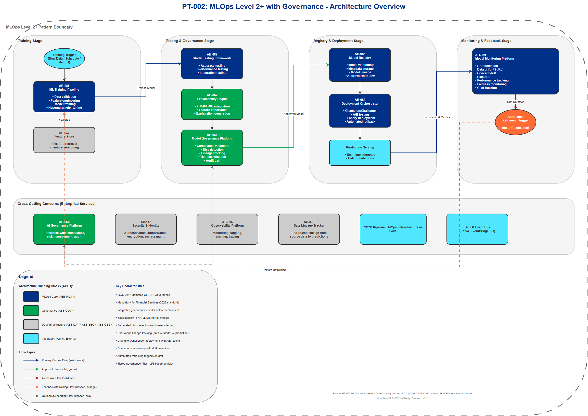

# AI Architecture Pattern: MLOps Level 2+ with Governance

## Document Control

| Property | Value |
|----------|-------|
| **Pattern ID** | `PT-002` |
| **Pattern Name** | MLOps Level 2+ with Governance |
| **Version** | `1.0.0` |
| **Status** | `Approved` |
| **Created Date** | `2025-12-05` |
| **Last Modified** | `2025-12-05` |
| **Owner** | BNZ Enterprise Architecture |
| **Pattern Category** | `Governance` |
| **Maturity Level** | `Mature` |

---

## 1. Pattern Overview

### 1.1 Pattern Name and Classification

**Pattern Name**: MLOps Level 2+ with Governance (MANDATORY for Financial Services)

**Short Name**: MLOps L2+ Governance

**Pattern Category**: Governance

**Pattern Type**: Orchestration, Compliance, Lifecycle Management

### 1.2 Intent and Context

**Intent Statement**:
Provide automated CI/CD for machine learning models with integrated governance, explainability, bias detection, and compliance validation required for production ML deployment in financial services.

**Problem Statement**:
Financial services organizations face stringent regulatory requirements for ML models including explainability, fairness testing, audit trails, and compliance validation. Manual deployment processes are slow (weeks to production), error-prone, and cannot scale to support multiple ML use cases. Traditional MLOps (Level 1-2) lacks the governance controls required for regulatory compliance in banking. Organizations need automated ML pipelines that integrate governance checks without sacrificing deployment velocity.

**Context**:
- **Regulatory Environment**: Financial services institutions must comply with model risk management frameworks (SR 11-7, OCC 2011-12), fair lending laws, AML regulations, and GDPR
- **Production Scale**: Banks deploy 100+ ML models across credit risk, fraud detection, AML, personalization, and operational use cases
- **Manual Processes**: Traditional ML deployment takes 3-8 weeks with manual governance reviews creating bottlenecks
- **2025 Industry Standard**: Level 2+ MLOps (automated CI/CD + governance) is now the baseline requirement for production ML in financial services
- **Compliance Burden**: Manual compliance validation creates delays and increases risk of regulatory violations

**Forces**:
- **Regulatory Compliance vs. Speed**: Need for thorough governance checks while maintaining rapid deployment cycles
- **Automation vs. Control**: Desire for automated pipelines while ensuring human oversight for critical decisions
- **Explainability vs. Performance**: Requirement for model interpretability while maintaining prediction accuracy
- **Standardization vs. Flexibility**: Need for consistent governance processes across diverse ML use cases
- **Cost vs. Capability**: Investment in MLOps tooling vs. operational efficiency gains
- **Innovation vs. Risk**: Ability to experiment with new models while managing model risk

### 1.3 Pattern Maturity and Industry Adoption

**Maturity Level**: Mature

**Industry Adoption**:
- **Adoption Rate**: 100% of ML use cases in financial services require Level 2+ as of 2025 (up from 54% in 2024)
- **Reference Implementations**:
  - JPMorgan Chase: Enterprise MLOps platform with automated governance for 300+ models
  - Goldman Sachs: Automated model risk management with explainability and bias testing
  - Capital One: Full CI/CD for ML with champion/challenger testing and drift monitoring
- **Timeframe**: Mainstream in financial services since 2024, mandatory standard by 2025

**Standards Alignment**:
- **Model Risk Management**: Federal Reserve SR 11-7, OCC 2011-12
- **MLOps Maturity**: Google Cloud MLOps Maturity Model Level 2+
- **Fair Lending**: ECOA, Fair Housing Act compliance through automated bias testing
- **Data Governance**: GDPR Article 22 (right to explanation), BCBS 239
- **AI Governance**: NIST AI Risk Management Framework
- **Industry Standards**: ISO/IEC 5338 (AI system lifecycle), IEEE 7000 series

---

## 2. Architecture Specification

### 2.1 Architecture Building Blocks (ABBs)

**Primary ABBs** (Core components required):

| ABB ID | ABB Name | Purpose in Pattern | Criticality |
|--------|----------|-------------------|-------------|
| [AB-085](../../architecture-building-blocks/abbs/AB-085/AB-085-ML-Training-Pipeline-v1.0.0.md) | ML Training Pipeline | Automated model training triggered by data/schedule/events | Critical |
| [AB-086](../../architecture-building-blocks/abbs/AB-086/AB-086-Model-Registry-v1.0.0.md) | Model Registry | Centralized repository for trained models with versioning and metadata | Critical |
| [AB-087](../../architecture-building-blocks/abbs/AB-087/AB-087-Model-Testing-Framework-v1.0.0.md) | Model Testing Framework | Automated testing for accuracy, fairness, and explainability | Critical |
| [AB-088](../../architecture-building-blocks/abbs/AB-088/AB-088-Model-Deployment-Orchestrator-v1.0.0.md) | Model Deployment Orchestrator | Automated deployment with champion/challenger A/B testing | Critical |
| [AB-089](../../architecture-building-blocks/abbs/AB-089/AB-089-Model-Monitoring-Platform-v1.0.0.md) | Model Monitoring Platform | Continuous monitoring for drift, performance, and fairness | Critical |
| [AB-061](../../architecture-building-blocks/abbs/AB-061/AB-061-Risk-Assessment-Engine-v1.0.0.md) | Model Governance Platform | Compliance checks, bias detection, lineage tracking, audit trails | Critical |
| [AB-062](../../architecture-building-blocks/abbs/AB-062/AB-062-Approval-Workflow-Orchestrator-v1.0.0.md) | Explainability Engine | SHAP/LIME integration for model interpretability | Critical |

**Supporting ABBs** (Optional or scenario-specific):

| ABB ID | ABB Name | Purpose in Pattern | When Required |
|--------|----------|-------------------|---------------|
| [AB-037](../../architecture-building-blocks/abbs/AB-037/AB-037-Feature-Store-v1.0.0.md) | Feature Store | Centralized feature management and serving | When features are reused across multiple models |
| [AB-090](../../architecture-building-blocks/abbs/AB-090/AB-090-Model-Fallback-Logic-v1.0.0.md) | Experiment Tracking | Track model experiments, hyperparameters, and metrics | For research and development phases |
| [AB-039](../../architecture-building-blocks/abbs/AB-039/AB-039-Data-Versioning-Service-v1.0.0.md) | Data Versioning | Version control for training datasets | When data provenance is critical for compliance |
| [AB-063](../../architecture-building-blocks/abbs/AB-063/AB-063-ML-Model-Explainability-Engine-v1.0.0.md) | Model Risk Classification | Automated tier classification (Tier 1/2/3) | For regulatory risk management |

**Cross-Cutting ABBs** (Always required):

| ABB ID | ABB Name | Purpose |
|--------|----------|---------|
| [AB-060](../../architecture-building-blocks/abbs/AB-060/AB-060-AI-Model-Registry-v1.0.0.md) | AI Governance Platform | Enterprise-wide compliance, risk management, audit |
| [AB-112](../../architecture-building-blocks/abbs/AB-112/AB-112-Data-Encryption-Service-v1.0.0.md) | Security & Identity | Authentication, authorization, encryption, secrets management |
| [AB-096](../../architecture-building-blocks/abbs/AB-096/AB-096-Observability-Platform-v1.0.0.md) | Observability Platform | Monitoring, logging, alerting for all pipeline stages |
| [AB-038](../../architecture-building-blocks/abbs/AB-038/AB-038-Data-Lake-v1.0.0.md) | Data Lineage Tracker | End-to-end lineage from source data to predictions |

### 2.2 Pattern Structure

**Architectural Diagram**:



**Component Interaction Flow**:
```
[Trigger: New Data / Schedule / Manual]
    ↓
[ML Training Pipeline] → [Feature Store] → [Training Data]
    ↓
[Model Testing Framework]
    ├─ Accuracy Testing (unit, integration, model tests)
    ├─ Fairness Testing (bias detection across demographics)
    └─ Explainability Testing (SHAP/LIME validation)
    ↓
[Governance Platform]
    ├─ Compliance Validation (regulatory checks)
    ├─ Bias Detection (automated fairness testing)
    ├─ Lineage Tracking (data → features → model → prediction)
    └─ Tier Classification (risk categorization)
    ↓ (if all checks pass)
[Model Registry] → [Model Versioning & Metadata]
    ↓
[Model Deployment Orchestrator]
    ├─ Champion/Challenger Deployment
    └─ A/B Testing Configuration
    ↓
[Production Serving]
    ↓
[Model Monitoring Platform]
    ├─ Drift Detection (data drift, concept drift)
    ├─ Performance Tracking (accuracy, latency, throughput)
    ├─ Fairness Monitoring (ongoing bias detection)
    └─ Cost Tracking (compute, inference costs)
    ↓ (if drift detected or performance degrades)
[Trigger Retraining] → (back to Training Pipeline)
```

**Key Interactions**:

1. **Training Trigger → Training Pipeline**: New data, scheduled run, or manual trigger initiates automated training
   - Protocol: Event-driven (Kafka, EventBridge) or scheduled (cron, Airflow)
   - Data Format: Event metadata (JSON), training configuration (YAML)
   - Latency Target: < 5 minutes from trigger to pipeline start

2. **Training Pipeline → Model Testing**: Trained model undergoes comprehensive testing
   - Processing Type: Synchronous (pipeline waits for test results)
   - Error Handling: Fail fast on test failures, rollback to previous model version
   - Testing Duration: 10-30 minutes depending on model complexity

3. **Model Testing → Governance Platform**: Test results validated against governance policies
   - Protocol: REST API to governance platform
   - Data Format: Test results (JSON), model metadata, lineage information
   - Validation: Automated policy checks (bias thresholds, accuracy minimums, explainability scores)

4. **Governance Platform → Model Registry**: Approved models registered with full metadata
   - Protocol: REST API with authentication
   - Data Format: Model artifact (pickle, ONNX, TensorFlow), metadata (JSON), lineage (graph)
   - Versioning: Semantic versioning (major.minor.patch)

5. **Model Registry → Deployment Orchestrator**: Approved models deployed with champion/challenger strategy
   - Protocol: GitOps (Kubernetes), Infrastructure as Code (Terraform)
   - Deployment Strategy: Canary (5% → 25% → 100%) or A/B testing
   - Rollback: Automated rollback on performance degradation (< 2 minutes)

6. **Production Serving → Monitoring Platform**: Continuous monitoring of deployed models
   - Protocol: Metrics (Prometheus), Logs (CloudWatch, ELK), Events (Kafka)
   - Monitoring Frequency: Real-time (< 1 minute lag)
   - Alerting: Automated alerts on drift, performance degradation, bias drift

7. **Monitoring Platform → Retraining Trigger**: Automated retraining on drift detection
   - Trigger Conditions: Data drift > threshold, accuracy drop > 5%, bias drift detected
   - Approval Required: Automatic for Tier 2/3 models, manual approval for Tier 1 models
   - Retraining Frequency: Adaptive based on drift velocity

### 2.3 Data Flow

**Data Sources**:
- **Training Data**: Historical data from operational systems, data lakes, feature stores
  - Format: Parquet, CSV, database tables
  - Volume: 1GB - 10TB depending on use case
  - Update Frequency: Daily to weekly
- **Feature Data**: Engineered features from feature store
  - Format: Parquet, feature vectors (JSON)
  - Volume: 100MB - 1TB
  - Update Frequency: Real-time to daily
- **Model Metadata**: Training configuration, hyperparameters, lineage
  - Format: JSON, YAML
  - Volume: < 1MB per model version
- **Production Inference Data**: Real-time or batch prediction requests
  - Format: JSON (REST API), Protobuf (gRPC), Parquet (batch)
  - Volume: 100 - 100,000 requests/second

**Data Transformations**:
1. **Data Preparation**: Raw data → cleaned, normalized, feature-engineered data
   - Handling: Missing values, outliers, encoding, scaling
   - Validation: Schema checks, data quality checks, distribution checks
2. **Feature Engineering**: Input data → feature vectors
   - Transformation: Aggregations, embeddings, derived features
   - Storage: Feature store for reuse
3. **Model Training**: Feature vectors → trained model artifacts
   - Output: Model weights, hyperparameters, training metrics
   - Versioning: All model versions stored with lineage
4. **Prediction**: Input features → model predictions
   - Output: Prediction scores, confidence intervals, explanations
   - Format: JSON response with prediction + metadata

**Data Sinks**:
- **Model Registry**: Trained model artifacts, metadata, lineage
  - Format: Model artifacts (pickle, ONNX, SavedModel), metadata (JSON)
  - Retention: All versions retained, 90-day retention for experiments
- **Monitoring Data Lake**: Model predictions, performance metrics, drift metrics
  - Format: Parquet, time-series (InfluxDB, TimescaleDB)
  - Retention: 2 years for compliance, 90 days for operational metrics
- **Audit Trail Database**: All governance decisions, approvals, policy checks
  - Format: Relational database (PostgreSQL, Aurora)
  - Retention: 7 years for regulatory compliance
- **Production Systems**: Model predictions delivered to downstream applications
  - Format: REST API (JSON), messaging (Kafka), batch files (S3)
  - Retention: Application-dependent (typically 30-90 days)

**Data Governance**:
- **Classification**:
  - Training Data: Confidential (PII) to Restricted (credit data)
  - Model Artifacts: Internal (non-production) to Confidential (production)
  - Predictions: Confidential (customer-specific) to Restricted (financial decisions)
- **Retention**:
  - Model Versions: Indefinite retention for production models
  - Training Data: 7 years minimum (regulatory requirement)
  - Audit Trails: 7 years minimum
  - Monitoring Data: 2 years
- **Lineage**:
  - End-to-end tracking: Source data → features → model → prediction
  - Tools: Data lineage platform (Apache Atlas, OpenLineage, Collibra)
  - Granularity: Record-level lineage for Tier 1 models
- **Quality**:
  - Data Quality Checks: Completeness, accuracy, consistency, timeliness
  - Model Quality Checks: Accuracy, fairness, explainability, drift
  - Frequency: Pre-training (data), pre-deployment (model), continuous (monitoring)

### 2.4 Interface Specifications

**Inbound Interfaces** (Inputs to pattern):

| Interface ID | Interface Name | Type | Protocol | Data Format | SLA |
|--------------|---------------|------|----------|-------------|-----|
| IF-IN-001 | Training Trigger | Event | Kafka / EventBridge | JSON (event metadata) | < 5 min trigger-to-start |
| IF-IN-002 | Training Data API | Batch | S3 / ADLS | Parquet, CSV | < 30 min data retrieval |
| IF-IN-003 | Feature Store API | API | REST / gRPC | JSON / Protobuf | < 100ms feature retrieval |
| IF-IN-004 | Governance Policy API | API | REST | JSON (policy definitions) | < 500ms policy retrieval |
| IF-IN-005 | Manual Approval Interface | UI / API | HTTPS | JSON (approval metadata) | Human-in-the-loop |

**Outbound Interfaces** (Outputs from pattern):

| Interface ID | Interface Name | Type | Protocol | Data Format | SLA |
|--------------|---------------|------|----------|-------------|-----|
| IF-OUT-001 | Model Registry API | API | REST | JSON (model metadata) | < 200ms metadata retrieval |
| IF-OUT-002 | Model Deployment Manifest | GitOps | Git / Kubernetes | YAML (deployment config) | < 10 min deployment |
| IF-OUT-003 | Monitoring Metrics | Metrics | Prometheus / CloudWatch | Time-series metrics | < 1 min metric lag |
| IF-OUT-004 | Audit Trail Events | Event | Kafka / Database | JSON (audit events) | < 5 min audit lag |
| IF-OUT-005 | Retraining Trigger | Event | Kafka / EventBridge | JSON (trigger event) | < 5 min from drift detection |
| IF-OUT-006 | Model Prediction API | API | REST / gRPC | JSON / Protobuf | < 100ms p95 latency |

**Internal Interfaces** (Between ABBs within pattern):

| Interface ID | Source ABB | Target ABB | Protocol | Purpose |
|--------------|-----------|-----------|----------|---------|
| IF-INT-001 | ML Training Pipeline | Model Registry | REST | Register trained model with metadata |
| IF-INT-002 | Model Testing Framework | Governance Platform | REST | Submit test results for validation |
| IF-INT-003 | Governance Platform | Model Registry | REST | Approve/reject model deployment |
| IF-INT-004 | Model Registry | Deployment Orchestrator | GitOps | Deploy approved model version |
| IF-INT-005 | Model Monitoring | Training Pipeline | Event | Trigger retraining on drift |
| IF-INT-006 | Explainability Engine | Model Testing | REST | Generate explanations for test predictions |
| IF-INT-007 | Feature Store | Training Pipeline | gRPC | Retrieve features for training |


## 3. Pattern Variants and Options

### 3.1 Pattern Variations

**Variant 1: Tier 1 Models (High-Risk, Full Governance)**
- **When to Use**: Credit risk, AML, fraud detection models with regulatory oversight
- **Key Differences**:
  - Manual approval required before production deployment
  - Enhanced explainability (SHAP + counterfactual explanations)
  - Quarterly model validation reviews
  - Real-time bias monitoring with alerts
  - Champion/challenger mandatory (minimum 4-week A/B testing)
- **Trade-offs**:
  - Gain: Maximum regulatory compliance, reduced model risk
  - Lose: Slower deployment (2-4 weeks vs. days), higher operational cost

**Variant 2: Tier 2 Models (Medium-Risk, Automated Governance)**
- **When to Use**: Personalization, operational efficiency, standard ML use cases
- **Key Differences**:
  - Automated deployment with post-deployment approval
  - Standard explainability (SHAP only)
  - Annual model validation reviews
  - Weekly bias monitoring
  - Champion/challenger optional
- **Trade-offs**:
  - Gain: Faster deployment (days), lower operational cost
  - Lose: Less oversight, requires strong automated governance

**Variant 3: Tier 3 Models (Low-Risk, Lightweight Governance)**
- **When to Use**: Internal tools, non-customer-facing models, experimental use cases
- **Key Differences**:
  - Fully automated deployment
  - Basic explainability (optional)
  - Ad-hoc model validation
  - Monthly bias checks
  - No champion/challenger required
- **Trade-offs**:
  - Gain: Maximum deployment velocity (hours to days), minimal overhead
  - Lose: Limited oversight, not suitable for regulated use cases

**Variant 4: Batch ML (Offline Predictions)**
- **When to Use**: Monthly reporting, periodic risk assessments, analytics use cases
- **Key Differences**:
  - Batch-oriented deployment (Spark, Airflow)
  - Simplified monitoring (daily checks vs. real-time)
  - Lower infrastructure cost (no real-time serving)
- **Trade-offs**:
  - Gain: Lower cost, simpler architecture
  - Lose: No real-time predictions, delayed drift detection

**Variant 5: Real-Time ML (Online Predictions)**
- **When to Use**: Fraud detection, credit scoring, personalization requiring < 100ms latency
- **Key Differences**:
  - Real-time serving infrastructure (Kubernetes, SageMaker, Vertex AI)
  - Real-time monitoring and alerting
  - A/B testing with traffic splitting
  - Feature store integration for low-latency feature retrieval
- **Trade-offs**:
  - Gain: Real-time predictions, immediate value
  - Lose: Higher infrastructure cost, more complex operations

### 3.2 Composition with Other Patterns

**Commonly Combined With**:

| Pattern | Integration Point | Combined Benefit |
|---------|------------------|------------------|
| PT-006: Explainability Pattern | Explainability Engine integrated in testing pipeline | Ensures all deployed models meet interpretability standards |
| PT-001: RAG Pattern | RAG provides context for credit/underwriting decisions before ML model | Combines retrieval accuracy with prediction power |
| PT-004: Real-Time Inference | MLOps pipeline deploys to real-time serving infrastructure | Automated deployment of low-latency ML models |
| PT-007: Observability Pattern | Monitoring platform integration | Unified observability for models, infrastructure, and applications |
| PT-005: Champion/Challenger | Deployment orchestrator implements A/B testing | Automated validation of new model versions in production |

**Anti-Patterns** (What NOT to do):

- **Anti-Pattern 1: Manual Deployment After Automated Training**
  - **Why Problematic**: Negates benefits of automated pipeline, creates bottleneck, increases error risk
  - **Better Approach**: Implement Level 2+ with automated deployment and governance checks

- **Anti-Pattern 2: Governance as a Post-Deployment Activity**
  - **Why Problematic**: Discovers compliance issues after model is live, requires emergency rollback
  - **Better Approach**: Integrate governance checks (bias, explainability, compliance) into pre-deployment testing

- **Anti-Pattern 3: Single Production Model (No Champion/Challenger)**
  - **Why Problematic**: Cannot validate new models, risky deployments, no A/B comparison
  - **Better Approach**: Always deploy challenger model alongside champion for Tier 1/2 models

- **Anti-Pattern 4: Monitoring Without Automated Retraining**
  - **Why Problematic**: Detects drift but doesn't act on it, models degrade over time
  - **Better Approach**: Automate retraining triggers when drift exceeds thresholds

- **Anti-Pattern 5: Shared MLOps Pipeline for All Model Types**
  - **Why Problematic**: Tier 1 models require more governance than Tier 3, one-size-fits-all is inefficient
  - **Better Approach**: Implement tiered pipelines with appropriate governance for each risk level

- **Anti-Pattern 6: No Lineage Tracking**
  - **Why Problematic**: Cannot audit model decisions, fails regulatory requirements, debugging is impossible
  - **Better Approach**: Implement end-to-end lineage from source data to predictions

---

## 4. Technical Implementation

### 4.1 MLOps Maturity Levels

The pattern implements MLOps Level 2+ as defined by the industry-standard maturity model:

| Level | Description | Characteristics | BNZ Adoption |
|-------|-------------|----------------|--------------|
| **Level 0** | Manual, script-driven | No automation, notebooks in production, manual deployment, no monitoring | **DEPRECATED** (Not allowed) |
| **Level 1** | Automated Training | Training pipeline automated, manual deployment, basic monitoring | **MINIMUM** (Tier 3 only) |
| **Level 2** | Automated CI/CD | Training + deployment automated, comprehensive monitoring, drift detection | **STANDARD** (Tier 2/3) |
| **Level 2+** | Level 2 + Governance | Level 2 + explainability, bias detection, compliance checks, lineage | **MANDATORY** (All Tier 1, 2025 standard for all tiers) |

**2025 Standard for Financial Services**: Level 2+ (Level 2 baseline, governance mandatory)

### 4.2 Governance Requirements (Level 2+)

All production ML models must meet these governance requirements:

| Requirement | Purpose | Implementation | Validation Frequency |
|-------------|---------|----------------|---------------------|
| **Explainability** | Regulatory compliance, transparency, trust | SHAP/LIME integrated in testing pipeline, explanations stored with predictions | Every model version, every Tier 1 prediction |
| **Bias Detection** | Fairness, equal opportunity, compliance with fair lending laws | Automated testing across demographics (race, gender, age), statistical parity checks | Pre-deployment, continuous monitoring |
| **Lineage Tracking** | Audit trail, regulatory compliance, debugging | Track data → features → model → prediction with metadata | Every prediction (Tier 1), sampled (Tier 2/3) |
| **Compliance Validation** | GDPR, AML, Model Risk Management | Automated checks before deployment (data residency, consent, regulatory flags) | Every model version |
| **Champion/Challenger** | Model validation, risk reduction | Automated A/B testing framework with statistical significance testing | Tier 1 mandatory, Tier 2 recommended |
| **Tier Classification** | Risk management, governance proportionality | Auto-classify models as Tier 1/2/3 based on impact, regulatory scope, data sensitivity | At model registration |
| **Drift Detection** | Model performance, data quality | Monitor data drift (PSI, KL divergence), concept drift (accuracy drop), bias drift | Real-time (Tier 1), hourly (Tier 2), daily (Tier 3) |
| **Model Documentation** | Transparency, knowledge transfer | Model cards, datasheets, technical documentation auto-generated | Every model version |

### 4.3 Technology Stack

**MLOps Platform Options**:
- **AWS**: SageMaker Pipelines + SageMaker Model Registry + SageMaker Model Monitor
- **AWS (Alternative)**: AWS SageMaker Pipelines + AWS SageMaker Model Registry + Amazon CloudWatch
- **GCP**: Vertex AI Pipelines + Vertex AI Model Registry + Vertex AI Model Monitoring
- **Open Source**: Kubeflow Pipelines + MLflow + Evidently AI
- **Hybrid**: Databricks MLOps (multi-cloud)

**CI/CD for ML**:
- Jenkins with ML plugins
- GitLab CI with MLOps templates
- GitHub Actions with ML workflows
- AWS CodePipeline with ML pipelines
- ArgoCD / FluxCD for GitOps deployment

**Model Monitoring**:
- **Commercial**: Arize AI, Fiddler AI, WhyLabs, Arthur AI
- **Open Source**: Evidently AI, NannyML, Great Expectations
- **Cloud-Native**: AWS SageMaker Model Monitor, AWS SageMaker Monitoring, GCP Model Monitoring

**Explainability Tools**:
- **SHAP** (SHapley Additive exPlanations): Industry standard for feature importance
- **LIME** (Local Interpretable Model-agnostic Explanations): Local explanations
- **Alibi**: Counterfactual explanations, anchor explanations
- **DiCE** (Diverse Counterfactual Explanations): Actionable counterfactuals
- **InterpretML**: Microsoft's glass-box models (EBM)

**Bias Detection Tools**:
- **Fairlearn** (Microsoft): Bias metrics and mitigation algorithms
- **AI Fairness 360** (IBM): Comprehensive bias detection and mitigation
- **Aequitas** (University of Chicago): Fairness audit toolkit
- **AWS SageMaker Clarify**: Integrated bias detection in SageMaker
- **Google What-If Tool**: Interactive bias exploration

**Feature Store**:
- Feast (open source)
- Tecton (commercial)
- AWS SageMaker Feature Store
- AWS SageMaker Feature Store
- GCP Vertex AI Feature Store
- Databricks Feature Store

**Model Registry**:
- MLflow Model Registry
- AWS SageMaker Model Registry
- AWS SageMaker Model Registry
- GCP Vertex AI Model Registry
- Kubeflow Model Registry

### 4.4 Key Implementation Components

**1. Automated Training Pipeline**
```
Trigger (new data, schedule, manual)
  ↓
Data Validation (schema, quality, distribution)
  ↓
Feature Engineering (retrieve from feature store or compute)
  ↓
Model Training (hyperparameter tuning, cross-validation)
  ↓
Model Evaluation (test set performance)
  ↓
Model Testing (accuracy, fairness, explainability)
  ↓
Model Registration (if tests pass)
```

**2. Governance Integration**
```
Model Testing Results
  ↓
Bias Detection (demographic parity, equal opportunity)
  ↓
Explainability Validation (SHAP values, feature importance)
  ↓
Compliance Checks (GDPR, data residency, regulatory flags)
  ↓
Lineage Tracking (data sources, features, transformations)
  ↓
Tier Classification (Tier 1/2/3 based on risk)
  ↓
Approval Workflow (automated for Tier 2/3, manual for Tier 1)
```

**3. Champion/Challenger Deployment**
```
Approved Model → Model Registry
  ↓
Deployment Configuration (traffic split, rollout strategy)
  ↓
Challenger Deployment (5% traffic initially)
  ↓
A/B Testing (statistical significance testing)
  ↓
Performance Comparison (accuracy, latency, cost)
  ↓
Traffic Ramp-Up (5% → 25% → 50% → 100%)
  ↓
Champion Replacement (if challenger outperforms)
```

**4. Continuous Monitoring**
```
Production Model
  ↓
Prediction Logging (inputs, outputs, explanations)
  ↓
Drift Detection
  ├─ Data Drift (PSI, KL divergence)
  ├─ Concept Drift (accuracy drop)
  └─ Bias Drift (fairness metrics over time)
  ↓
Alerting (drift threshold exceeded)
  ↓
Retraining Trigger (if approved)
  ↓
Back to Training Pipeline
```

### 4.5 Best Practices (2025)

1. **Start with Level 1, Progress to Level 2+**
   - Begin with automated training (Level 1)
   - Add automated deployment and monitoring (Level 2)
   - Integrate governance checks (Level 2+)
   - Avoid trying to implement everything at once

2. **Implement Governance BEFORE Production**
   - Integrate explainability and bias detection in pre-deployment testing
   - Never deploy a model without governance validation
   - Build governance checks into CI/CD pipeline, not as post-deployment activity

3. **Automate Compliance Checks**
   - Don't rely on manual compliance reviews
   - Codify compliance policies as automated tests
   - Use policy-as-code frameworks (OPA, Cedar)

4. **Use Champion/Challenger for All Critical Models**
   - Mandatory for Tier 1/2 models
   - Provides validation and risk reduction
   - Enables continuous improvement with A/B testing

5. **Monitor Continuously, Act Automatically**
   - Real-time monitoring for Tier 1 models
   - Automated retraining triggers on drift detection
   - Human approval for Tier 1 retraining, automated for Tier 2/3

6. **Maintain End-to-End Lineage**
   - Track every prediction back to source data
   - Essential for debugging and regulatory audits
   - Use lineage tools (OpenLineage, Apache Atlas)

7. **Implement Tiered Governance**
   - Tier 1: Maximum governance (manual approval, real-time monitoring, quarterly reviews)
   - Tier 2: Automated governance (post-deployment approval, weekly monitoring)
   - Tier 3: Lightweight governance (automated deployment, monthly checks)

8. **Version Everything**
   - Models, data, features, code, configurations
   - Enables reproducibility and rollback
   - Use semantic versioning (major.minor.patch)

9. **Test in Production with Low Risk**
   - Use canary deployments (5% traffic initially)
   - Monitor closely during ramp-up
   - Automated rollback on performance degradation

10. **Document Automatically**
    - Generate model cards automatically
    - Include training data, performance metrics, fairness results
    - Store with model in registry

### 4.6 Performance Metrics

**MLOps Level 2+ Impact**:
- **Time to Production**: Reduced from **3-8 weeks to 3-7 days** (80-90% reduction)
- **Model Failures**: Reduced by **80%+** through automated testing
- **Compliance Violations**: Reduced by **95%+** through automated governance
- **Model Refresh Frequency**: Increased from **quarterly to weekly/monthly** (4-12x improvement)
- **Mean Time to Detect (MTTD) Drift**: Reduced from **weeks to hours/minutes**
- **Mean Time to Retrain (MTTR)**: Reduced from **weeks to days**
- **Operational Cost**: 30-50% reduction through automation (after initial investment)

**2025 Compliance**: 100% of ML use cases in financial services require Level 2+ (up from 54% in 2024).

---

## 5. BNZ Use Case Mapping

### 5.1 Applicable Use Cases

**ALL 18 ML Use Cases** (MANDATORY for 2025):

| Use Case ID | Use Case Name | Model Type | Tier | Governance Priority |
|-------------|--------------|------------|------|---------------------|
| **[UC-001](../../../01-motivation/03-use-cases/use-cases/UC-001/index.md)** | Partnership Banking | Predictive (customer insights) | Tier 2 | Bias detection, explainability |
| **[UC-002](../../../01-motivation/03-use-cases/use-cases/UC-002/index.md)** | Finance | Predictive (forecasting) | Tier 2 | Accuracy monitoring, drift detection |
| **[UC-003](../../../01-motivation/03-use-cases/use-cases/UC-003/index.md)** | Analytics and Reporting | Predictive (trend analysis) | Tier 3 | Standard monitoring |
| **[UC-004](../../../01-motivation/03-use-cases/use-cases/UC-004/index.md)** | Credit Risk | Predictive (credit scoring) | **Tier 1** | **Full governance, regulatory validation** |
| **[UC-005](../../../01-motivation/03-use-cases/use-cases/UC-005/index.md)** | Lending Ops | Classification (loan processing) | Tier 2 | Fairness testing, explainability |
| **[UC-006](../../../01-motivation/03-use-cases/use-cases/UC-006/index.md)** | HyperPersonalization | Recommendation (offers) | Tier 2 | **Fairness testing, bias detection** |
| **[UC-007](../../../01-motivation/03-use-cases/use-cases/UC-007/index.md)** | Contact Centre | Classification (routing) | Tier 3 | Standard monitoring |
| **[UC-008](../../../01-motivation/03-use-cases/use-cases/UC-008/index.md)** | Security AI | Anomaly detection (threats) | Tier 2 | **Explainability for security decisions** |
| **[UC-010](../../../01-motivation/03-use-cases/use-cases/UC-010/index.md)** | SDLC | Classification (code quality) | Tier 3 | Standard monitoring |
| **[UC-011](../../../01-motivation/03-use-cases/use-cases/UC-011/index.md)** | Fincrime (AML) | Classification (suspicious activity) | **Tier 1** | **AML compliance, audit trails** |
| **[UC-013](../../../01-motivation/03-use-cases/use-cases/UC-013/index.md)** | Fraud Ops | Classification (fraud scoring) | **Tier 1** | **Model governance, challenger models** |
| **[UC-014](../../../01-motivation/03-use-cases/use-cases/UC-014/index.md)** | Onboarding | Classification (KYC, identity) | Tier 2 | **Bias detection, compliance** |
| **[UC-015](../../../01-motivation/03-use-cases/use-cases/UC-015/index.md)** | Risk Functions | Predictive (risk assessment) | **Tier 1** | **Regulatory models, validation** |
| **[UC-016](../../../01-motivation/03-use-cases/use-cases/UC-016/index.md)** | IT Ops | Predictive (capacity, incidents) | Tier 3 | Standard monitoring |
| **[UC-019](../../../01-motivation/03-use-cases/use-cases/UC-019/index.md)** | Payment Disputes | Classification (dispute risk) | Tier 2 | Fairness testing, explainability |
| **[UC-020](../../../01-motivation/03-use-cases/use-cases/UC-020/index.md)** | Controls Testing | Classification (test results) | Tier 3 | Standard monitoring |
| **[UC-021](../../../01-motivation/03-use-cases/use-cases/UC-021/index.md)** | Wholesale Underwriting | Predictive (credit decisions) | **Tier 1** | **Credit model governance** |
| **[UC-023](../../../01-motivation/03-use-cases/use-cases/UC-023/index.md)** | Collection Management | Predictive (payment likelihood) | Tier 2 | Fairness testing, bias detection |

**Note**: [UC-017](../../../01-motivation/03-use-cases/use-cases/UC-017/index.md) (FrontLine CIB), [UC-018](../../../01-motivation/03-use-cases/use-cases/UC-018/index.md) (Procurement), [UC-022](../../../01-motivation/03-use-cases/use-cases/UC-022/index.md) (Learning Content), [UC-024](../../../01-motivation/03-use-cases/use-cases/UC-024/index.md) (App Personalisation) are primarily GenAI use cases but may include ML components requiring MLOps Level 2+.

### 5.2 Use Case-Specific Implementations

**[UC-004](../../../01-motivation/03-use-cases/use-cases/UC-004/index.md): Credit Risk (Tier 1 - Highest Governance)**
- **Requirements**:
  - Manual approval before production deployment
  - SHAP explanations for every credit decision
  - Quarterly model validation by Model Risk Management team
  - Champion/challenger testing for minimum 4 weeks
  - Real-time bias monitoring across protected demographics
  - Adverse action notices generated from explanations
- **Retraining Frequency**: Monthly with manual approval
- **Monitoring**: Real-time drift detection, hourly performance checks

**[UC-006](../../../01-motivation/03-use-cases/use-cases/UC-006/index.md): HyperPersonalization (Tier 2 - Fairness Focus)**
- **Requirements**:
  - Automated bias testing across customer demographics
  - Fairness metrics (demographic parity, equal opportunity) monitored continuously
  - SHAP explanations for offer recommendations
  - Champion/challenger testing recommended
- **Retraining Frequency**: Weekly, automated retraining on drift
- **Monitoring**: Daily bias checks, weekly performance reviews

**[UC-011](../../../01-motivation/03-use-cases/use-cases/UC-011/index.md): Fincrime/AML (Tier 1 - Regulatory Compliance)**
- **Requirements**:
  - Full audit trail for all AML alerts
  - Explanations for suspicious activity reports (SARs)
  - Compliance validation against AML regulations
  - Quarterly regulatory review
  - No automated retraining (manual approval required)
- **Retraining Frequency**: Quarterly with regulatory approval
- **Monitoring**: Real-time alert monitoring, daily performance checks

**[UC-013](../../../01-motivation/03-use-cases/use-cases/UC-013/index.md): Fraud Ops (Tier 1 - Real-Time Governance)**
- **Requirements**:
  - Real-time fraud scoring with < 200ms latency
  - SHAP explanations for fraud investigators
  - Champion/challenger testing mandatory
  - Continuous bias monitoring (ensure fraud detection is fair)
  - Automated rollback on performance degradation
- **Retraining Frequency**: Weekly, automated retraining with approval
- **Monitoring**: Real-time drift detection, hourly performance checks

**[UC-014](../../../01-motivation/03-use-cases/use-cases/UC-014/index.md): Onboarding (Tier 2 - Bias Detection Priority)**
- **Requirements**:
  - Bias detection across demographics (avoid discriminatory identity verification)
  - Explainability for identity verification decisions
  - Compliance with KYC regulations
  - A/B testing for new verification models
- **Retraining Frequency**: Monthly, automated retraining
- **Monitoring**: Weekly bias checks, daily performance monitoring

**[UC-021](../../../01-motivation/03-use-cases/use-cases/UC-021/index.md): Wholesale Underwriting (Tier 1 - Credit Model Governance)**
- **Requirements**:
  - Full explainability for credit decisions
  - Regulatory validation for credit models
  - Champion/challenger testing for 6+ weeks (large credit decisions)
  - Quarterly model validation reviews
  - Manual approval for retraining
- **Retraining Frequency**: Quarterly with approval
- **Monitoring**: Monthly performance reviews, quarterly validation

### 5.3 Deployment Strategy by Tier

**Tier 1 Models (High-Risk)**:
- Manual approval required before production
- Champion/challenger testing: 4-6 weeks minimum
- Deployment strategy: Canary (5% → 10% → 25% → 50% → 100% over 2-3 weeks)
- Rollback: Manual approval required
- Monitoring: Real-time with alerting
- Retraining: Manual approval required

**Tier 2 Models (Medium-Risk)**:
- Automated deployment with post-deployment approval
- Champion/challenger testing: 2-4 weeks recommended
- Deployment strategy: Canary (5% → 25% → 100% over 1 week)
- Rollback: Automated on performance degradation
- Monitoring: Hourly to daily
- Retraining: Automated with notification

**Tier 3 Models (Low-Risk)**:
- Fully automated deployment
- Champion/challenger testing: Optional
- Deployment strategy: Direct deployment or blue/green
- Rollback: Automated
- Monitoring: Daily to weekly
- Retraining: Fully automated

---

## 6. Non-Functional Requirements (NFRs)

### 6.1 Performance Requirements

| NFR Category | Requirement | Target | Measurement |
|--------------|-------------|--------|-------------|
| **Training Time** | Model training completion | < 24 hours for most models, < 7 days for large models | Pipeline execution time |
| **Deployment Time** | Model deployment to production | < 30 minutes (automated), < 2 hours (with manual approval) | Time from registry to live |
| **Retraining Latency** | Time from drift detection to retraining start | < 1 hour (Tier 1), < 6 hours (Tier 2/3) | Alert to pipeline trigger |
| **Monitoring Lag** | Time lag for drift detection | < 1 minute (Tier 1), < 1 hour (Tier 2/3) | Metric ingestion to alert |
| **Prediction Latency** | Model inference time | < 100ms p95 (real-time), < 24 hours (batch) | Application-specific |
| **Throughput** | Predictions per second | 100-10,000 depending on use case | Load testing |

### 6.2 Scalability Requirements

| Dimension | Requirement | Target |
|-----------|-------------|--------|
| **Model Count** | Number of models supported | 500+ models (BNZ target: 100-200 by 2026) |
| **Model Versions** | Versions per model | Unlimited (recommend 90-day retention for experiments) |
| **Concurrent Training** | Parallel training pipelines | 20+ concurrent pipelines |
| **Prediction Volume** | Predictions per day | 100M+ predictions across all models |
| **Data Volume** | Training data size | 1GB - 10TB per model |
| **Feature Count** | Features per model | 10 - 10,000 features |

### 6.3 Availability Requirements

| Service | Availability Target | Recovery Time Objective (RTO) | Recovery Point Objective (RPO) |
|---------|--------------------|-----------------------------|-------------------------------|
| **Model Serving** | 99.9% (Tier 1), 99.5% (Tier 2/3) | < 15 minutes | < 1 hour |
| **Training Pipeline** | 99.0% | < 4 hours | N/A (can rerun) |
| **Model Registry** | 99.9% | < 1 hour | < 15 minutes |
| **Monitoring Platform** | 99.5% | < 1 hour | < 5 minutes |
| **Governance Platform** | 99.5% | < 4 hours | < 1 hour |

### 6.4 Security Requirements

| Requirement | Implementation | Validation |
|-------------|----------------|-----------|
| **Authentication** | OAuth 2.0, OIDC for API access | Mandatory for all interfaces |
| **Authorization** | RBAC for pipeline access, ABAC for data access | Least privilege principle |
| **Encryption at Rest** | AES-256 for model artifacts, training data | All storage encrypted |
| **Encryption in Transit** | TLS 1.3 for all API calls | Mandatory for all communication |
| **Secrets Management** | Vault (HashiCorp) or cloud-native (AWS Secrets Manager) | No secrets in code/config |
| **Audit Logging** | All access and changes logged | 7-year retention for compliance |
| **Model Security** | Model artifact signing, tamper detection | Verify signature before deployment |

### 6.5 Compliance Requirements

| Regulation | Requirement | Implementation |
|------------|-------------|----------------|
| **GDPR** | Right to explanation (Article 22) | SHAP/LIME explanations for all customer-facing models |
| **Fair Lending** | No discriminatory bias | Automated bias testing pre-deployment and continuous monitoring |
| **Model Risk Management** | SR 11-7, OCC 2011-12 compliance | Tier classification, validation, documentation |
| **AML** | Suspicious activity explanation | Audit trail for all AML alerts, explainability for SARs |
| **Data Residency** | Data localization (EU, NZ) | Automated compliance checks for data sources |
| **Audit Trail** | 7-year retention | All decisions, approvals, predictions logged |

### 6.6 Operational Requirements

| Requirement | Target | Implementation |
|-------------|--------|----------------|
| **Mean Time to Detect (MTTD)** | < 1 hour (Tier 1), < 24 hours (Tier 2/3) | Real-time monitoring with alerting |
| **Mean Time to Resolve (MTTR)** | < 4 hours (Tier 1), < 24 hours (Tier 2/3) | Automated rollback, runbooks |
| **Model Documentation** | 100% of models documented | Auto-generated model cards |
| **Change Management** | All changes tracked | GitOps, version control |
| **Disaster Recovery** | Multi-region deployment | Active-passive (Tier 1), single-region (Tier 2/3) |
| **Cost Monitoring** | Per-model cost tracking | Tag-based cost allocation |

---

## 7. Cost Considerations

### 7.1 Infrastructure Costs

**Initial Setup** (One-time):
- **MLOps Platform**: $200K - $500K (commercial) or $50K - $150K (open source implementation)
- **Governance Tools**: $100K - $300K (Fairlearn, SHAP, monitoring tools)
- **Training Infrastructure**: $50K - $200K (GPU/TPU clusters, Kubernetes)
- **Storage**: $20K - $100K (model registry, data lake, audit logs)
- **Total Initial Investment**: $370K - $1.1M

**Ongoing Costs** (Annual):
- **Compute (Training)**: $100K - $500K/year (depending on model count and complexity)
- **Compute (Serving)**: $50K - $300K/year (depending on prediction volume)
- **Storage**: $30K - $150K/year (model artifacts, monitoring data, audit logs)
- **Monitoring Tools**: $50K - $200K/year (commercial SaaS licenses)
- **Personnel**: $500K - $1M/year (MLOps engineers, platform team)
- **Total Annual Operating Cost**: $730K - $2.15M

**Cost per Model**:
- **Training**: $1K - $10K per model per retraining cycle
- **Serving**: $500 - $5K per model per month (depending on traffic)
- **Monitoring**: $200 - $1K per model per month
- **Total Cost per Model**: $2K - $16K per month (for active production models)

### 7.2 Cost Optimization Strategies

1. **Tiered Infrastructure**: Use GPU instances only for training, CPU instances for serving
2. **Spot/Preemptible Instances**: 60-90% cost reduction for non-critical training jobs
3. **Auto-Scaling**: Scale down serving infrastructure during low-traffic periods
4. **Model Compression**: Reduce model size for faster inference and lower serving costs
5. **Batch Inference**: Use batch inference where real-time is not required (10x cost reduction)
6. **Feature Store**: Reduce redundant feature computation (20-40% cost reduction)
7. **Open Source Tools**: Use open source (Kubeflow, MLflow, Evidently) vs. commercial SaaS
8. **Multi-Tenancy**: Share infrastructure across multiple models and teams

### 7.3 Return on Investment (ROI)

**Quantifiable Benefits**:
- **Reduced Time to Production**: 80-90% reduction (weeks → days) = $500K - $2M/year in opportunity cost
- **Reduced Model Failures**: 80% reduction = $200K - $1M/year in incident response and customer impact
- **Reduced Compliance Violations**: 95% reduction = $1M - $5M/year in fines and remediation
- **Operational Efficiency**: 30-50% reduction in manual work = $300K - $800K/year in labor cost
- **Faster Model Refresh**: 4-12x improvement = $500K - $2M/year in improved model performance

**Total Annual Benefit**: $2.5M - $10.8M/year

**ROI Calculation**:
- **Initial Investment**: $370K - $1.1M
- **Annual Operating Cost**: $730K - $2.15M
- **Annual Benefit**: $2.5M - $10.8M
- **Net Annual Benefit**: $1.77M - $8.65M
- **Payback Period**: 2-6 months
- **3-Year ROI**: 350% - 1,800%

**Note**: ROI is highly dependent on model count, complexity, and regulatory risk. Tier 1 models (credit, fraud, AML) provide the highest ROI due to compliance benefits.

---

## 8. Implementation Roadmap

### 8.1 Phased Approach

**Phase 1: Foundation (Months 1-3)**
- Set up MLOps platform (Kubeflow, MLflow, or cloud-native)
- Implement model registry with versioning
- Build basic training pipelines for 2-3 pilot use cases
- Establish monitoring foundation (metrics, logs, alerts)
- **Deliverable**: Level 1 MLOps (automated training) for pilot use cases

**Phase 2: Automation (Months 4-6)**
- Implement CI/CD for ML models
- Add automated testing framework (accuracy, performance)
- Deploy champion/challenger infrastructure
- Implement drift detection
- **Deliverable**: Level 2 MLOps (automated CI/CD) for pilot use cases

**Phase 3: Governance (Months 7-9)**
- Integrate explainability tools (SHAP/LIME)
- Implement bias detection framework
- Add compliance validation checks
- Establish end-to-end lineage tracking
- **Deliverable**: Level 2+ MLOps (with governance) for pilot use cases

**Phase 4: Scale (Months 10-12)**
- Onboard additional use cases (expand from pilots to 10-15 models)
- Implement feature store for shared features
- Optimize costs (auto-scaling, spot instances)
- Establish tiered governance (Tier 1/2/3 pipelines)
- **Deliverable**: Level 2+ MLOps for 80% of ML use cases

**Phase 5: Maturity (Months 13-18)**
- Onboard remaining use cases (reach 100% coverage)
- Implement advanced monitoring (causal analysis, anomaly detection)
- Add automated retraining for all Tier 2/3 models
- Establish continuous improvement processes
- **Deliverable**: Enterprise-wide Level 2+ MLOps with full governance

### 8.2 Critical Success Factors

1. **Executive Sponsorship**: Secure C-level support for investment and organizational change
2. **Cross-Functional Team**: MLOps engineers, data scientists, governance, security, compliance
3. **Start Small, Scale Fast**: Begin with 2-3 pilot use cases, prove value, then scale
4. **Governance from Day 1**: Don't retrofit governance; build it into the pipeline from the start
5. **Platform Team**: Dedicated MLOps platform team to build and maintain infrastructure
6. **Training and Enablement**: Train data scientists and ML engineers on new workflows
7. **Measurement**: Track metrics (time to production, model failures, compliance violations)
8. **Continuous Improvement**: Regularly review and optimize pipelines based on feedback

### 8.3 Common Pitfalls

1. **Trying to do everything at once**: Start with Level 1, then progress to Level 2, then Level 2+
2. **Underestimating governance complexity**: Governance is not a checkbox; it requires careful design
3. **Ignoring organizational change**: MLOps changes workflows; need change management
4. **Insufficient monitoring**: Monitoring is not optional; it's critical for production ML
5. **No platform team**: Ad-hoc MLOps doesn't scale; need dedicated platform team
6. **Lack of standards**: Inconsistent pipelines across teams lead to governance gaps
7. **Retrofitting governance**: Governance is much harder to add after deployment

---

## 9. References and Resources

### 9.1 Related Patterns

| Pattern ID | Pattern Name | Relationship | Reference |
|-----------|-------------|--------------|-----------|
| PT-001 | RAG Pattern | Often combined with ML models for context-aware predictions | See PT-001 document |
| PT-004 | Real-Time Inference Pattern | MLOps deploys to real-time serving infrastructure | See PT-004 document |
| PT-005 | Champion/Challenger Pattern | Core component of MLOps deployment strategy | See PT-005 document |
| PT-006 | Explainability Pattern | Integrated into MLOps testing and monitoring | See PT-006 document |
| PT-007 | Observability Pattern | Monitoring foundation for MLOps | See PT-007 document |

### 9.2 Related ABBs

| ABB ID | ABB Name | Document Link |
|--------|----------|---------------|
| [AB-085](../../architecture-building-blocks/abbs/AB-085/AB-085-ML-Training-Pipeline-v1.0.0.md) | ML Training Pipeline | TBD |
| [AB-086](../../architecture-building-blocks/abbs/AB-086/AB-086-Model-Registry-v1.0.0.md) | Model Registry | TBD |
| [AB-087](../../architecture-building-blocks/abbs/AB-087/AB-087-Model-Testing-Framework-v1.0.0.md) | Model Testing Framework | TBD |
| [AB-088](../../architecture-building-blocks/abbs/AB-088/AB-088-Model-Deployment-Orchestrator-v1.0.0.md) | Model Deployment Orchestrator | TBD |
| [AB-089](../../architecture-building-blocks/abbs/AB-089/AB-089-Model-Monitoring-Platform-v1.0.0.md) | Model Monitoring Platform | TBD |
| [AB-061](../../architecture-building-blocks/abbs/AB-061/AB-061-Risk-Assessment-Engine-v1.0.0.md) | Model Governance Platform | TBD |
| [AB-062](../../architecture-building-blocks/abbs/AB-062/AB-062-Approval-Workflow-Orchestrator-v1.0.0.md) | Explainability Engine | TBD |
| [AB-037](../../architecture-building-blocks/abbs/AB-037/AB-037-Feature-Store-v1.0.0.md) | Feature Store | TBD |

### 9.3 Standards and Guidelines

**Regulatory Standards**:
- **SR 11-7**: Supervisory Guidance on Model Risk Management (Federal Reserve, 2011)
- **OCC 2011-12**: Supervisory Guidance on Model Risk Management (OCC, 2011)
- **BCBS 239**: Principles for Effective Risk Data Aggregation and Risk Reporting
- **GDPR Article 22**: Automated Individual Decision-Making (Right to Explanation)
- **ECOA**: Equal Credit Opportunity Act (Fair Lending)
- **Fair Housing Act**: Anti-Discrimination in Lending

**Technical Standards**:
- **ISO/IEC 5338**: Information Technology - AI System Lifecycle Processes
- **IEEE 7000 Series**: Ethics in AI, Algorithmic Bias, Transparency
- **NIST AI RMF**: AI Risk Management Framework
- **MLOps Maturity Model**: Google Cloud Platform MLOps Maturity Model

**Industry Best Practices**:
- **Google MLOps**: Best Practices for MLOps (Level 0/1/2)
- **AWS Well-Architected Framework**: Machine Learning Lens
- **AWS SageMaker Best Practices**: Enterprise MLOps

### 9.4 External References

**Industry Research**:
- **ZenML**: "Banking on AI: Implementing Compliant MLOps for Financial Institutions" (2025)
  - URL: https://www.zenml.io/blog/banking-on-ai-implementing-compliant-mlops-for-financial-institutions
- **AWS**: "Best Practices for ML Operations (MLOps) in Financial Services" (2025)
  - URL: https://docs.aws.amazon.com/prescriptive-guidance/latest/strategy-unlock-value-data-financial-services/best-practices-ml-ops.html
- **McKinsey**: "MLOps: A Key Ingredient in AI Success" (2024)
- **Gartner**: "Hype Cycle for AI Engineering, 2024" (MLOps in Mainstream)
- **Forrester**: "The MLOps Imperative for Financial Services" (2024)

**Technology Documentation**:
- **Kubeflow**: https://www.kubeflow.org/docs/
- **MLflow**: https://mlflow.org/docs/latest/index.html
- **AWS SageMaker**: https://docs.aws.amazon.com/sagemaker/
- **AWS SageMaker**: https://learn.microsoft.com/azure/machine-learning/
- **Google Vertex AI**: https://cloud.google.com/vertex-ai/docs
- **SHAP**: https://shap.readthedocs.io/
- **Fairlearn**: https://fairlearn.org/
- **Evidently AI**: https://docs.evidentlyai.com/

**Vendor Resources**:
- **Arize AI**: MLOps Best Practices Guide - https://arize.com/
- **Fiddler AI**: Model Monitoring and Explainability - https://www.fiddler.ai/
- **Databricks**: MLOps Guide - https://databricks.com/glossary/mlops
- **Tecton**: Feature Store Best Practices - https://www.tecton.ai/

---

## 10. Diagram Templates

**Required Diagrams** (to be created using draw.io templates):

1. **[PT-002-Architecture-v1.0.0.drawio]**: High-level architecture showing MLOps pipeline stages, ABBs, and governance integration
2. **[PT-002-Data-Flow-v1.0.0.drawio]**: Data flow from training data through model deployment to production predictions
3. **[PT-002-Governance-Flow-v1.0.0.drawio]**: Governance checks and approval workflows
4. **[PT-002-Champion-Challenger-v1.0.0.drawio]**: Champion/challenger deployment strategy

**Diagram Standards**: All diagrams must follow BNZ Visual Design Standards (see `05-governance/standards/visual-design/visual-design-standard.md`)

---

## Appendix A: Glossary

| Term | Definition |
|------|------------|
| **MLOps** | Machine Learning Operations - practices for deploying, monitoring, and managing ML models in production |
| **Level 0** | Manual ML deployment with no automation (DEPRECATED) |
| **Level 1** | Automated training pipeline with manual deployment |
| **Level 2** | Automated training and deployment (CI/CD for ML) |
| **Level 2+** | Level 2 + governance (explainability, bias detection, compliance) |
| **Champion/Challenger** | A/B testing strategy where a new model (challenger) is tested against the current production model (champion) |
| **Drift** | Change in data or model performance over time (data drift, concept drift, bias drift) |
| **SHAP** | SHapley Additive exPlanations - method for explaining individual predictions |
| **LIME** | Local Interpretable Model-agnostic Explanations - method for local explanations |
| **Bias Detection** | Testing for discriminatory bias across protected demographics (race, gender, age, etc.) |
| **Model Registry** | Centralized repository for trained models with versioning and metadata |
| **Feature Store** | Centralized repository for ML features with versioning and serving |
| **Lineage** | Tracking of data from source through transformations to predictions |
| **Tier 1/2/3** | Model risk classification (Tier 1 = highest risk/regulatory oversight) |
| **CI/CD** | Continuous Integration / Continuous Deployment |
| **PSI** | Population Stability Index - metric for detecting data drift |
| **KL Divergence** | Kullback-Leibler Divergence - metric for comparing probability distributions |

---

## Appendix B: Change History

| Version | Date | Author | Changes |
|---------|------|--------|---------|
| 1.0.0 | 2025-12-05 | BNZ Enterprise Architecture | Initial version - MLOps Level 2+ pattern with governance for financial services |

---

## Appendix C: Review and Approval

| Role | Name | Signature | Date |
|------|------|-----------|------|
| **Pattern Author** | BNZ Enterprise Architecture Team | | 2025-12-05 |
| **Enterprise Architect** | [Pending] | | |
| **Security Architect** | [Pending] | | |
| **Compliance Lead** | [Pending] | | |
| **TAF** | [Pending] | | |

---

## Appendix D: MLOps Implementation Checklist

### Level 1 Checklist (Automated Training)
- [ ] Training pipeline orchestration (Airflow, Kubeflow, etc.)
- [ ] Automated data ingestion and validation
- [ ] Feature engineering automation
- [ ] Hyperparameter tuning (Grid search, Bayesian optimization)
- [ ] Model evaluation on test set
- [ ] Basic logging and metrics

### Level 2 Checklist (Automated CI/CD)
- [ ] Model registry with versioning
- [ ] Automated testing (unit, integration, model tests)
- [ ] CI/CD pipeline (Jenkins, GitLab, GitHub Actions)
- [ ] Automated deployment to staging and production
- [ ] Drift detection (data drift, concept drift)
- [ ] Performance monitoring (accuracy, latency, throughput)
- [ ] Automated rollback on failures

### Level 2+ Checklist (Governance)
- [ ] Explainability integration (SHAP, LIME)
- [ ] Bias detection and fairness testing
- [ ] Compliance validation (GDPR, AML, Fair Lending)
- [ ] End-to-end lineage tracking
- [ ] Champion/challenger testing framework
- [ ] Tier classification (Tier 1/2/3)
- [ ] Audit trail (all decisions logged)
- [ ] Model documentation (model cards, datasheets)
- [ ] Approval workflows (manual for Tier 1, automated for Tier 2/3)
- [ ] Continuous bias monitoring
- [ ] Cost tracking per model

---

**Document End**
