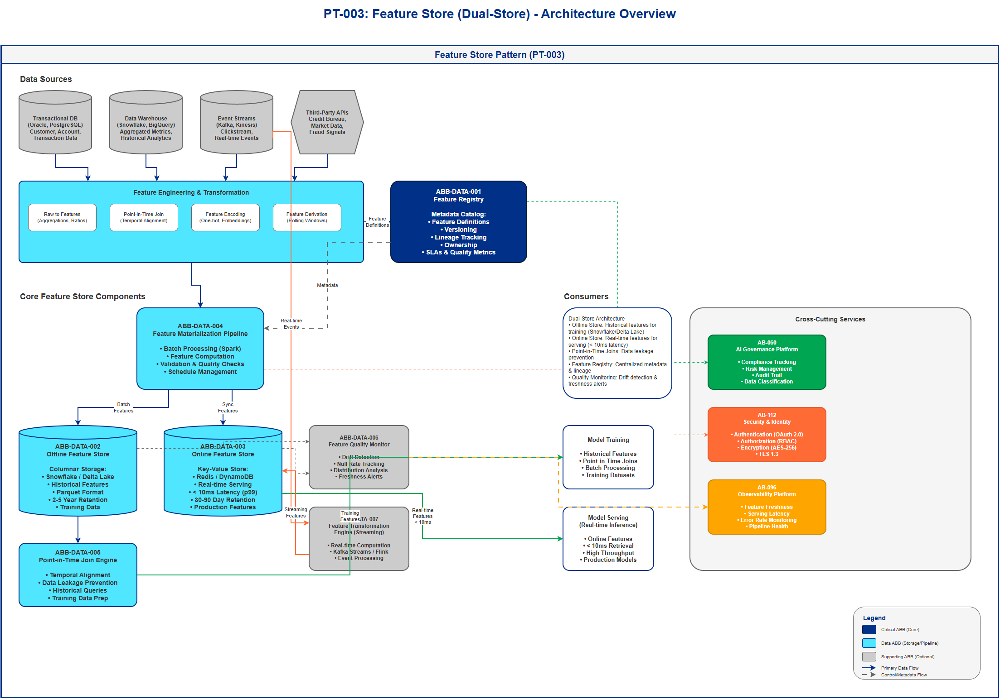

# AI Architecture Pattern: Feature Store (Dual-Store Architecture)

## Document Control

| Property | Value |
|----------|-------|
| **Pattern ID** | `PT-003` |
| **Pattern Name** | Feature Store (Dual-Store Architecture) |
| **Version** | `1.0.0` |
| **Status** | `Approved` |
| **Created Date** | `2025-12-05` |
| **Last Modified** | `2025-12-05` |
| **Owner** | BNZ Enterprise Architecture |
| **Pattern Category** | `Data` |
| **Maturity Level** | `Mature` |

---

## 1. Pattern Overview

### 1.1 Pattern Name and Classification

**Pattern Name**: Feature Store (Dual-Store Architecture)

**Short Name**: Feature Store

**Pattern Category**: Data

**Pattern Type**: Storage, Processing, Governance

### 1.2 Intent and Context

**Intent Statement**:
Provide a centralized repository for ML features with offline (training) and online (serving) stores to ensure training/serving consistency and feature reusability across ML models.

**Problem Statement**:
Organizations face significant challenges in machine learning feature management:
- **Training/Serving Skew**: Features computed differently between training and production, leading to model performance degradation
- **Feature Duplication**: Multiple teams re-implementing the same features, creating inconsistency and wasted effort
- **Data Leakage**: Incorrect time-travel during training, using future data to predict past events
- **Operational Complexity**: Managing separate feature pipelines for batch training and real-time serving
- **Governance Gaps**: Lack of visibility into feature lineage, ownership, and quality metrics
- **Latency Requirements**: Real-time models require sub-10ms feature retrieval, which standard databases cannot provide

**Context**:
This pattern is applicable in enterprise ML environments where:
- Multiple ML models are deployed in production requiring consistent features
- Models need both batch training (offline) and real-time serving (online) capabilities
- Teams share common features across different use cases (e.g., customer demographics used by fraud detection, personalization, and credit risk)
- Regulatory compliance requires feature lineage tracking and audit trails
- Production systems demand low-latency feature retrieval (< 10ms SLA)

As of 2025, feature stores have become MANDATORY for production ML, with 75% of ML use cases requiring centralized feature management (up from 33% in 2024).

**Forces**:
- **Consistency vs. Flexibility**: Need for standardized feature definitions while allowing teams to create custom features
- **Performance vs. Cost**: Real-time feature serving requires expensive in-memory stores, while batch training can use cheaper columnar storage
- **Governance vs. Agility**: Centralized control ensures quality but may slow down feature development
- **Freshness vs. Stability**: Real-time feature updates improve accuracy but risk introducing errors into production models
- **Reusability vs. Customization**: Shared features reduce duplication but may not fit all use cases perfectly

### 1.3 Pattern Maturity and Industry Adoption

**Maturity Level**: Mature

**Industry Adoption**:
- **Adoption Rate**: 75% of enterprises in financial services use feature stores for production ML as of 2025 (Gartner, 2025)
- **Reference Implementations**:
  - **Uber**: Michelangelo feature store supporting 1000+ ML models
  - **DoorDash**: Gigascale feature store processing 10M+ features/second
  - **Netflix**: Feature store powering personalization at 200M+ users
- **Timeframe**: Mainstream since 2023, became industry best practice in 2024, mandatory for regulated industries in 2025

**Standards Alignment**:
- **TOGAF**: Aligns with Data Management and Application Integration building blocks
- **SAFe**: Supports Continuous Delivery Pipeline for ML (MLOps)
- **ISO/IEC 23053** (ML framework): Feature engineering and data quality management
- **NIST AI Risk Management Framework**: Data provenance and lineage tracking

---

## 2. Architecture Specification

### 2.1 Architecture Building Blocks (ABBs)

**Primary ABBs** (Core components required):

| ABB ID | ABB Name | Purpose in Pattern | Criticality |
|--------|----------|-------------------|-------------|
| ABB-DATA-001 | Feature Registry | Metadata catalog for feature definitions, versioning, lineage, ownership, and SLAs | Critical |
| ABB-DATA-002 | Offline Feature Store | Columnar storage for batch feature computation and model training (historical features) | Critical |
| ABB-DATA-003 | Online Feature Store | Low-latency key-value store for real-time feature serving (< 10ms retrieval) | Critical |
| ABB-DATA-004 | Feature Materialization Pipeline | Compute features from source data and populate offline/online stores | Critical |
| ABB-DATA-005 | Point-in-Time Join Engine | Prevent data leakage by joining features with correct temporal alignment during training | Critical |

**Supporting ABBs** (Optional or scenario-specific):

| ABB ID | ABB Name | Purpose in Pattern | When Required |
|--------|----------|-------------------|---------------|
| ABB-DATA-006 | Feature Quality Monitor | Monitor feature drift, null rates, distribution changes | Production models (mandatory for regulated use cases) |
| ABB-DATA-007 | Feature Transformation Engine | Real-time feature computation from streaming data | Real-time ML models (streaming features) |
| ABB-DATA-008 | Feature Versioning Service | Track feature schema changes and model dependencies | Multi-model environments (recommended) |

**Cross-Cutting ABBs** (Always required):

| ABB ID | ABB Name | Purpose |
|--------|----------|---------|
| [AB-060](../../architecture-building-blocks/abbs/AB-060/AB-060-AI-Model-Registry-v1.0.0.md) | AI Governance Platform | Compliance, risk management, audit trail, data classification |
| [AB-112](../../architecture-building-blocks/abbs/AB-112/AB-112-Data-Encryption-Service-v1.0.0.md) | Security & Identity | Authentication, authorization, encryption (data at rest and in transit) |
| [AB-096](../../architecture-building-blocks/abbs/AB-096/AB-096-Observability-Platform-v1.0.0.md) | Observability Platform | Monitoring feature freshness, serving latency, error rates, pipeline health |

### 2.2 Pattern Structure

**Architectural Diagram**:



**Component Interaction Flow**:
```
Data Sources (Batch/Streaming) → Feature Engineering (Transformations)
  ↓                                           ↓
Feature Definitions (Code) → Materialization Pipeline
  ↓                                           ↓
Offline Store (Batch/Training)      Online Store (Real-time Serving)
  ↓                                           ↓
Point-in-Time Joins → Model Training    Model Serving (< 10ms)
  ↑                                           ↑
[Feature Registry: Metadata, Versioning, Lineage, Quality Metrics]
```

**Key Interactions**:

1. **Feature Definition Registration**: Data scientists define features in code (Python/SQL)
   - Protocol: REST API to Feature Registry
   - Data Format: Feature schema (name, type, transformation logic, data source)
   - Latency Target: < 1 second
   - Process: Features are validated, versioned, and stored in registry with lineage metadata

2. **Batch Feature Materialization**: Scheduled pipeline computes features for offline store
   - Processing Type: Asynchronous batch processing (hourly, daily, weekly)
   - Technology: Spark, Databricks, Snowflake SQL
   - Output: Parquet/Delta Lake files partitioned by entity and timestamp
   - Error Handling: Retry with exponential backoff, dead-letter queue for failed records
   - Validation: Schema validation, data quality checks (null rates, distribution checks)

3. **Online Feature Sync**: Materialized features are synced to online store
   - Processing Type: Near-real-time (typically 5-15 minute lag)
   - Technology: Change data capture (CDC) or scheduled sync jobs
   - Protocol: Bulk write to key-value store (Redis MSET, DynamoDB BatchWriteItem)
   - Consistency: Eventually consistent (offline is source of truth)

4. **Training Feature Retrieval**: Model training fetches historical features with point-in-time joins
   - Protocol: SQL query or Python SDK (feast.get_historical_features())
   - Data Format: Pandas DataFrame or Parquet
   - Latency Target: Minutes to hours (batch process)
   - Data Leakage Prevention: Point-in-time join ensures no future data leaks into training

5. **Serving Feature Retrieval**: Real-time model serving fetches features from online store
   - Protocol: Redis GET, DynamoDB GetItem, or Feature Store API
   - Data Format: JSON or binary (Protocol Buffers)
   - Latency Target: < 10ms (p99)
   - Caching: Client-side caching for static features
   - Fallback: Default values if feature unavailable (circuit breaker pattern)

6. **Feature Monitoring**: Continuous monitoring of feature quality and freshness
   - Metrics: Null rate, distribution drift (KL divergence), staleness, serving latency
   - Alerts: Triggered when features exceed drift thresholds or become stale
   - Logging: All feature accesses logged for audit and lineage tracking

### 2.3 Data Flow

**Data Sources**:
- **Transactional Databases**: Customer data, account data, transaction history (Oracle, PostgreSQL)
  - Format: Relational tables
  - Volume: 10M - 1B records
  - Update Frequency: Real-time (streaming) or daily batch

- **Data Warehouse**: Aggregated business metrics, historical analytics (Snowflake, BigQuery)
  - Format: Columnar tables
  - Volume: 100M - 10B records
  - Update Frequency: Daily or hourly batch

- **Event Streams**: Real-time events (clickstream, transactions, IoT) (Kafka, Kinesis)
  - Format: JSON or Avro messages
  - Volume: 10K - 1M events/second
  - Update Frequency: Real-time streaming

- **Third-Party Data**: Credit bureau scores, market data, fraud signals
  - Format: API responses (JSON) or batch files (CSV, Parquet)
  - Volume: Varies by provider
  - Update Frequency: Hourly or daily

**Data Transformations**:

1. **Raw to Features**: Transform source data into ML-ready features
   - Input: Raw transactional/event data
   - Output: Engineered features (aggregations, ratios, encodings, embeddings)
   - Examples:
     - `customer_30d_transaction_count`: COUNT of transactions in last 30 days
     - `customer_avg_balance_90d`: AVERAGE account balance over 90 days
     - `transaction_amount_zscore`: Z-score normalization of transaction amount

2. **Point-in-Time Join**: Join features with correct temporal alignment
   - Input: Label table with timestamps + feature keys
   - Output: Feature table with historical values at each timestamp
   - Logic: For each entity at time T, retrieve feature values as of time T (no future data)

3. **Feature Encoding**: Convert categorical/text features to numeric representations
   - Input: Categorical values or text
   - Output: One-hot encoding, embeddings, or hashed features

4. **Feature Derivation**: Compute derived features from existing features
   - Input: Base features
   - Output: Ratios, deltas, rolling aggregations

**Data Sinks**:
- **Offline Store**: Parquet/Delta Lake on S3/ADLS for training
  - Retention: 2-5 years (regulatory compliance)
  - Partitioning: By entity type and date

- **Online Store**: Redis/DynamoDB for real-time serving
  - Retention: 30-90 days (active features only)
  - Indexing: By entity key (customer_id, transaction_id)

- **Feature Registry**: PostgreSQL/MongoDB for metadata
  - Retention: Permanent (lineage and audit trail)

- **Data Warehouse**: Aggregated features for analytics
  - Retention: 7 years (regulatory compliance)

**Data Governance**:
- **Classification**:
  - Public: Non-sensitive features (e.g., product category)
  - Internal: Business metrics (e.g., customer tenure)
  - Confidential: PII-derived features (e.g., age_group, income_bracket - anonymized)
  - Restricted: Sensitive features (e.g., credit_score) - requires approval

- **Retention**:
  - Offline: 2-5 years based on regulatory requirements (GDPR, CCPA)
  - Online: 30-90 days (operational data)
  - Metadata: Permanent (lineage and audit)

- **Lineage**:
  - Track: Source data → Feature transformation → Feature version → Model version
  - Tooling: Feature registry + data catalog (Collibra, Alation)

- **Quality**:
  - Validation: Schema validation, null rate checks, distribution checks
  - Monitoring: Continuous drift detection (KL divergence, PSI)
  - SLAs: Freshness SLA (features updated within X hours), availability SLA (99.9% uptime)

### 2.4 Interface Specifications

**Inbound Interfaces** (Inputs to pattern):

| Interface ID | Interface Name | Type | Protocol | Data Format | SLA |
|--------------|---------------|------|----------|-------------|-----|
| IF-IN-001 | Feature Definition API | REST API | HTTPS | JSON (feature schema) | < 1s response time |
| IF-IN-002 | Batch Data Ingestion | Batch File | S3/ADLS | Parquet, CSV | Daily/Hourly |
| IF-IN-003 | Streaming Data Ingestion | Event Stream | Kafka/Kinesis | JSON, Avro | < 5s latency |
| IF-IN-004 | Third-Party Data API | REST API | HTTPS | JSON | Hourly sync |

**Outbound Interfaces** (Outputs from pattern):

| Interface ID | Interface Name | Type | Protocol | Data Format | SLA |
|--------------|---------------|------|----------|-------------|-----|
| IF-OUT-001 | Training Feature Retrieval | Batch API | Python SDK | Pandas DataFrame, Parquet | Minutes to hours |
| IF-OUT-002 | Online Feature Serving | REST API | HTTPS | JSON | < 10ms (p99) |
| IF-OUT-003 | Feature Metadata Query | REST API | HTTPS | JSON | < 100ms |
| IF-OUT-004 | Feature Quality Metrics | Metrics API | Prometheus | Time-series metrics | Real-time |

**Internal Interfaces** (Between ABBs within pattern):

| Interface ID | Source ABB | Target ABB | Protocol | Purpose |
|--------------|-----------|-----------|----------|---------|
| IF-INT-001 | Feature Registry | Materialization Pipeline | gRPC | Fetch feature definitions for computation |
| IF-INT-002 | Materialization Pipeline | Offline Store | S3 API | Write computed features to offline storage |
| IF-INT-003 | Materialization Pipeline | Online Store | Redis Protocol | Sync features to online store (MSET) |
| IF-INT-004 | Point-in-Time Join Engine | Offline Store | SQL | Query historical features for training |
| IF-INT-005 | Feature Quality Monitor | Feature Registry | REST API | Report drift metrics and quality alerts |


## 3. Implementation Guidance

### 3.1 Technology Options

**Recommended Technology Stack (BNZ)**:

**Feature Store Platform** (2025 Enterprise Comparison):

| Platform | Model | Latency | Best For | 2025 Updates |
|----------|-------|---------|----------|--------------|
| **Tecton** (Recommended) | Fully managed SaaS | <10ms consistently | Enterprise-grade, production-scale, real-time ML | Automatic lineage tracking, native Snowflake Offline Store |
| **Feast** (Open Source) | Self-managed | Depends on backend (Redis, DynamoDB) | Cloud-agnostic teams, DIY flexibility, zero licensing | v0.32: Native Redis Cluster, improved point-in-time joins |
| **Databricks Feature Store** | Integrated with Lakehouse | Optimal within Databricks runtimes | Spark/Delta Lake ecosystems | Unity Catalog governance, serverless real-time lookups (April 2025) |

- **Primary**: Tecton (Commercial) - Enterprise-grade, fully managed
  - Pros: <10ms latency consistently, built-in end-to-end transformations, automatic lineage
  - Cons: Vendor lock-in, higher cost (~$675/month for 10M vectors)
  - Best For: Regulated environments requiring <10ms latency and enterprise support

- **Alternative**: Feast (Open Source) - Mature, vendor-neutral
  - Pros: Open source, extensible, strong community, cloud-agnostic, zero licensing
  - Cons: Requires self-management, external transformations via Spark/SQL
  - Best For: Organizations wanting control and flexibility

- **Cloud-Native**:
  - AWS SageMaker Feature Store: Vector search indexing for RAG workloads (March 2025), 20-40ms latency
  - Databricks Feature Store: Unity Catalog integration, serverless real-time lookups
  - Google Vertex AI Feature Store v2: Multi-tenant governance, BigQuery Omni, automatic drift detection, 15ms latency

**Selection Criteria**: Tecton for <10ms latency requirements, Feast for cloud-agnostic flexibility, Databricks for existing Lakehouse investments

**Offline Storage**:
- **Primary**: Snowflake (Data Warehouse)
  - Pros: Existing BNZ infrastructure, SQL interface, scalable
  - Cons: Cost for high-volume queries

- **Alternative**: Delta Lake on ADLS (Snowflake (Data Lake) Storage)
  - Pros: ACID transactions, time travel, open format
  - Cons: Requires Spark/Databricks for optimal performance

**Online Storage**:
- **Primary**: Redis Enterprise (Managed)
  - Pros: Sub-millisecond latency, high throughput, replication
  - Cons: Cost, memory-bound
  - SLA: < 5ms (p99)

- **Alternative**: Amazon DynamoDB (NoSQL)
  - Pros: Global distribution, SLA-backed latency
  - Cons: Higher cost, less flexible data model
  - SLA: < 10ms (p99)

**Feature Computation**:
- **Batch**: Databricks (Spark) for large-scale transformations
- **Streaming**: Kafka Streams or Flink for real-time features
- **SQL**: Snowflake for simple aggregations

### 3.2 Implementation Approach

**Phase 1: Foundation (Weeks 1-4)**:
1. Deploy feature registry (Feast core or Tecton)
2. Set up offline store (Snowflake tables)
3. Set up online store (Redis cluster)
4. Define initial feature schema for pilot use case
5. Implement basic monitoring (feature freshness, serving latency)

**Phase 2: Pilot (Weeks 5-8)**:
1. Onboard first ML use case (e.g., Fraud Detection - [UC-013](../../../01-motivation/03-use-cases/use-cases/UC-013/index.md))
2. Implement 10-20 core features (customer demographics, transaction aggregates)
3. Build materialization pipeline (daily batch)
4. Implement point-in-time join for training
5. Deploy online serving for real-time inference
6. Validate training/serving consistency (A/B test)

**Phase 3: Scale (Weeks 9-16)**:
1. Onboard 3-5 additional use cases
2. Build feature reuse library (shared customer/transaction features)
3. Implement streaming features for real-time use cases
4. Deploy advanced monitoring (drift detection, quality alerts)
5. Establish governance (feature ownership, approval workflows)

**Phase 4: Production (Weeks 17-24)**:
1. Migrate all 18 ML use cases to feature store
2. Implement feature versioning and rollback
3. Deploy automated feature quality testing
4. Establish SLAs (freshness, availability, latency)
5. Integrate with AI governance platform

### 3.3 Best Practices

**Feature Design**:
- **Naming Convention**: `{entity}_{metric}_{aggregation}_{window}` (e.g., `customer_transaction_count_30d`)
- **Versioning**: Semantic versioning for feature schemas (v1.0.0, v1.1.0, v2.0.0)
- **Documentation**: Every feature must have description, owner, source, and business logic
- **Testing**: Unit tests for feature transformations, integration tests for point-in-time joins

**Operational Best Practices (2025)**:
- **Dual-Store Architecture**: Always implement both offline (training) and online (serving) stores to ensure consistency
- **Point-in-Time Joins**: MANDATORY to prevent data leakage during training
- **Feature Freshness Monitoring**: Detect stale features (alert if features > 24 hours old)
- **Feature Versioning**: Track which model uses which feature version (critical for rollback)
- **Feature Quality Monitoring**: Monitor drift (KL divergence), null rate, distribution changes
- **Performance SLA**: Online feature retrieval MUST be < 10ms (p99) for real-time serving
- **Backfill Strategy**: Efficient historical feature computation for new features (incremental backfill)
- **Cost Optimization**: Archive old features, use tiered storage (hot/warm/cold)

**Governance**:
- **Feature Ownership**: Every feature must have designated owner and team
- **Approval Workflow**: Sensitive features (PII-derived) require data privacy approval
- **Audit Trail**: Log all feature accesses for compliance (GDPR, CCPA)
- **Data Lineage**: Track source data → feature → model for impact analysis

### 3.4 Migration Strategy

**From Legacy Feature Engineering**:
1. **Inventory**: Catalog all existing feature pipelines and code
2. **Prioritize**: Migrate high-value, reusable features first
3. **Parallel Run**: Run feature store alongside legacy pipelines for validation
4. **Validation**: Compare feature values (offline store vs. legacy) - must match 100%
5. **Cutover**: Switch model training/serving to feature store once validated
6. **Decommission**: Retire legacy pipelines after 30-day observation period

**From No Feature Store (Ad-Hoc Features)**:
1. **Extract**: Identify features from model training scripts
2. **Standardize**: Refactor into reusable feature definitions
3. **Centralize**: Migrate to feature registry with proper metadata
4. **Recompute**: Backfill historical features for training
5. **Deploy**: Integrate online store for real-time serving

### 3.5 Performance Tuning

**Online Store Optimization**:
- **Caching**: Client-side caching for static features (reduce latency by 50%)
- **Batch Retrieval**: Fetch multiple features in single request (reduce overhead)
- **Preloading**: Pre-warm cache for frequently accessed features
- **Compression**: Use binary formats (Protocol Buffers) instead of JSON
- **Sharding**: Distribute features across Redis cluster nodes (horizontal scaling)

**Offline Store Optimization**:
- **Partitioning**: Partition by entity and date for efficient queries
- **Columnar Format**: Use Parquet/Delta Lake (10x faster than CSV)
- **Predicate Pushdown**: Push filters to storage layer (avoid full scans)
- **Incremental Computation**: Compute only new features (avoid recomputing historical data)

### 3.6 Cost Management

**Storage Costs**:
- **Offline Store**: $0.02 per GB/month (Snowflake) - Estimate: 1TB = $20/month
- **Online Store**: $0.10 per GB/month (Redis) - Estimate: 100GB = $10/month
- **Optimization**: Archive features older than 90 days to cold storage (reduce cost by 80%)

**Compute Costs**:
- **Materialization**: Spark cluster for batch processing - Estimate: $500/month (daily jobs)
- **Optimization**: Use spot instances, schedule jobs during off-peak hours

**Total Cost Estimate (BNZ)**:
- **Small Deployment** (5 use cases, 500 features): $2K - 5K/month
- **Medium Deployment** (10 use cases, 1000 features): $10K - 20K/month
- **Large Deployment** (18 use cases, 2000+ features): $30K - 50K/month

---

## 4. Pattern Variants and Options

### 4.1 Pattern Variations

**Variant 1: Offline-Only Feature Store**
- **When to Use**: Batch ML models with no real-time serving requirements
- **Key Differences**:
  - No online store (Redis/DynamoDB)
  - No real-time sync pipeline
  - Lower cost (no in-memory storage)
- **Trade-offs**:
  - **Gain**: 50% cost reduction, simpler architecture
  - **Lose**: Cannot support real-time inference (latency > 1 second)
- **BNZ Use Cases**: [UC-002](../../../01-motivation/03-use-cases/use-cases/UC-002/index.md) (Finance), [UC-003](../../../01-motivation/03-use-cases/use-cases/UC-003/index.md) (Analytics) - batch-only reporting

**Variant 2: Streaming Feature Store**
- **When to Use**: Real-time ML models requiring features computed from streaming data (e.g., fraud detection)
- **Key Differences**:
  - Add streaming feature computation (Kafka Streams, Flink)
  - Features updated in real-time (< 1 second latency)
  - Requires event-driven architecture
- **Trade-offs**:
  - **Gain**: Real-time feature freshness (detect fraud in milliseconds)
  - **Lose**: Higher complexity, 30% higher cost (streaming infrastructure)
- **BNZ Use Cases**: [UC-011](../../../01-motivation/03-use-cases/use-cases/UC-011/index.md) (Fincrime), [UC-013](../../../01-motivation/03-use-cases/use-cases/UC-013/index.md) (Fraud Ops), [UC-019](../../../01-motivation/03-use-cases/use-cases/UC-019/index.md) (Payment Disputes)

**Variant 3: Embedded Feature Store (Model-Specific)**
- **When to Use**: Single model with custom features not shared across teams
- **Key Differences**:
  - Features managed within model repository (not centralized)
  - No feature registry or reuse
  - Simpler deployment
- **Trade-offs**:
  - **Gain**: Faster initial deployment, less governance overhead
  - **Lose**: No feature reuse, training/serving skew risk, no lineage tracking
- **BNZ Use Cases**: NOT RECOMMENDED for BNZ (violates governance requirements)

**Variant 4: Hybrid Feature Store (Cloud + On-Premise)**
- **When to Use**: Regulated data cannot leave on-premise (e.g., PII, credit scores)
- **Key Differences**:
  - Sensitive features stored on-premise (private cloud)
  - Non-sensitive features in cloud
  - Feature federation (unified API across stores)
- **Trade-offs**:
  - **Gain**: Regulatory compliance, data sovereignty
  - **Lose**: Higher complexity, network latency between stores
- **BNZ Use Cases**: [UC-004](../../../01-motivation/03-use-cases/use-cases/UC-004/index.md) (Credit Risk), [UC-021](../../../01-motivation/03-use-cases/use-cases/UC-021/index.md) (Wholesale Underwriting) - if regulatory constraints apply

### 4.2 Composition with Other Patterns

**Commonly Combined With**:

| Pattern | Integration Point | Combined Benefit |
|---------|------------------|------------------|
| **PT-002: Model Registry** | Model metadata links to feature versions | End-to-end ML lineage (data → features → model) |
| **PT-005: Real-Time Inference** | Online store provides features for inference | Low-latency prediction (< 100ms including feature retrieval) |
| **PT-007: Model Monitoring** | Monitor feature drift + model drift together | Detect root cause of model degradation (data vs. model) |
| **PT-010: Data Versioning** | Version source data + features together | Reproducible training (same data + features = same model) |
| **PT-015: ML Governance** | Feature registry integrates with governance platform | Compliance (feature lineage, approval workflows, audit) |

**Anti-Patterns** (What NOT to do):

- **Anti-Pattern 1: Feature Store as Data Lake**
  - **Description**: Using feature store to store raw, unprocessed data
  - **Why Problematic**: Feature store is for ML-ready features, not raw data storage (violates single responsibility)
  - **Symptoms**: Large Parquet files with raw JSON, no feature definitions, slow queries
  - **Better Approach**: Store raw data in data lake, compute features in feature store

- **Anti-Pattern 2: No Point-in-Time Joins**
  - **Description**: Joining features without temporal alignment (using latest values for historical training)
  - **Why Problematic**: Data leakage (future data used to predict past events), model overestimates performance
  - **Symptoms**: Model performs well in training (90% accuracy) but poorly in production (60% accuracy)
  - **Better Approach**: Always use point-in-time joins with entity timestamp

- **Anti-Pattern 3: Online-Only Feature Store**
  - **Description**: Storing features only in online store (Redis), no offline store
  - **Why Problematic**: Cannot train models (no historical data), expensive (all features in memory)
  - **Symptoms**: High memory costs, cannot backfill features, limited training data
  - **Better Approach**: Dual-store architecture (offline for training, online for serving)

- **Anti-Pattern 4: Feature Sprawl**
  - **Description**: Creating hundreds of features without governance (no ownership, no documentation)
  - **Why Problematic**: Technical debt, unused features consume storage/compute, no one knows what features do
  - **Symptoms**: Feature registry has 5000+ features, 80% unused, no descriptions
  - **Better Approach**: Feature approval workflow, periodic cleanup, mandatory documentation

---

## 5. Non-Functional Requirements (NFRs)

### 5.1 Performance Requirements

| Metric | Target | Measurement Method |
|--------|--------|-------------------|
| **Online Feature Retrieval Latency** | < 10ms (p99) | Prometheus histogram (feature_serving_latency_ms) |
| **Batch Feature Computation** | < 4 hours (daily job) | Pipeline execution time |
| **Point-in-Time Join Query** | < 30 minutes (1M rows) | Snowflake query metrics |
| **Feature Materialization Throughput** | 10K features/second | Spark job metrics |
| **API Response Time** (metadata queries) | < 100ms (p95) | REST API latency |

### 5.2 Scalability Requirements

| Dimension | Requirement | Scaling Strategy |
|-----------|-------------|------------------|
| **Number of Features** | 2000+ features | Horizontal scaling (partition by entity type) |
| **Feature Storage** | 10TB offline, 100GB online | Tiered storage (archive old features to cold storage) |
| **Concurrent Users** | 100+ data scientists, 1000+ API requests/sec | Load balancing, caching |
| **Entity Volume** | 10M customers, 1B transactions | Sharding (partition by entity key) |
| **Historical Data** | 5 years | Partitioning by date (yearly/monthly partitions) |

### 5.3 Availability and Reliability

| Requirement | Target | Implementation |
|-------------|--------|----------------|
| **Online Store Availability** | 99.9% uptime (< 43 min/month downtime) | Redis cluster with replication (3 nodes), automated failover |
| **Offline Store Availability** | 99.5% uptime | Snowflake SLA (multi-AZ deployment) |
| **Feature Registry Availability** | 99.9% uptime | PostgreSQL HA (primary + standby) |
| **Data Durability** | 99.999999% (no data loss) | S3/ADLS durability guarantees, daily backups |
| **Disaster Recovery** | RPO: 1 hour, RTO: 4 hours | Cross-region replication, automated backup/restore |

### 5.4 Security Requirements

| Requirement | Implementation | Standard |
|-------------|----------------|----------|
| **Authentication** | OAuth 2.0 / SAML for API access | BNZ IAM integration |
| **Authorization** | Role-based access control (RBAC) - data scientist, ML engineer, admin | Feature-level permissions |
| **Encryption at Rest** | AES-256 encryption for all storage (offline, online, registry) | NIST 800-53 |
| **Encryption in Transit** | TLS 1.3 for all API calls | NIST 800-53 |
| **Data Masking** | PII features masked for non-production environments | GDPR compliance |
| **Audit Logging** | Log all feature access (user, timestamp, features retrieved) | SOX, PCI-DSS |

### 5.5 Compliance and Governance

| Requirement | Implementation | Regulation |
|-------------|----------------|------------|
| **Data Lineage** | Track source data → feature → model | GDPR Article 22 (automated decision-making) |
| **Feature Versioning** | Semantic versioning + changelog | Model reproducibility |
| **Right to Erasure** | Delete customer features on request (GDPR Article 17) | GDPR |
| **Feature Approval** | Sensitive features require data privacy approval | BNZ Data Governance Policy |
| **Retention Policy** | Offline: 5 years, Online: 90 days | BNZ Data Retention Policy |
| **Audit Trail** | Immutable log of feature definitions and changes | SOX, PCI-DSS |

---

## 6. Use Case Mapping

### 6.1 Applicable BNZ Use Cases (18 ML Use Cases)

**MANDATORY Use Cases** (All ML use cases MUST use feature store in 2025):

| Use Case ID | Use Case Name | Feature Examples | Online/Offline | Priority |
|-------------|---------------|------------------|----------------|----------|
| **[UC-001](../../../01-motivation/03-use-cases/use-cases/UC-001/index.md)** | Partnership Banking | Customer tenure, account balance, transaction frequency | Both | High |
| **[UC-002](../../../01-motivation/03-use-cases/use-cases/UC-002/index.md)** | Finance | Department spend, budget variance, forecast accuracy | Offline | Medium |
| **[UC-003](../../../01-motivation/03-use-cases/use-cases/UC-003/index.md)** | Analytics & Reporting | Business KPIs, trend indicators, seasonality features | Offline | Medium |
| **[UC-004](../../../01-motivation/03-use-cases/use-cases/UC-004/index.md)** | Credit Risk | Credit score, debt-to-income ratio, payment history | Both | Critical |
| **[UC-005](../../../01-motivation/03-use-cases/use-cases/UC-005/index.md)** | Lending Ops | Loan amount, collateral value, borrower demographics | Both | High |
| **[UC-006](../../../01-motivation/03-use-cases/use-cases/UC-006/index.md)** | HyperPersonalization | Customer segment, product affinity, channel preference | Both | High |
| **[UC-007](../../../01-motivation/03-use-cases/use-cases/UC-007/index.md)** | Contact Centre | Customer sentiment, call history, issue resolution time | Both | Medium |
| **[UC-008](../../../01-motivation/03-use-cases/use-cases/UC-008/index.md)** | Security AI | Login anomaly score, geolocation risk, device fingerprint | Online | Critical |
| **[UC-011](../../../01-motivation/03-use-cases/use-cases/UC-011/index.md)** | Fincrime | Transaction velocity, entity network, sanction list match | Online | Critical |
| **[UC-013](../../../01-motivation/03-use-cases/use-cases/UC-013/index.md)** | Fraud Ops | Transaction amount z-score, merchant risk, time-of-day | Online | Critical |
| **[UC-014](../../../01-motivation/03-use-cases/use-cases/UC-014/index.md)** | Onboarding | Identity verification score, document quality, fraud signals | Both | High |
| **[UC-015](../../../01-motivation/03-use-cases/use-cases/UC-015/index.md)** | Risk Functions | Risk exposure, concentration ratio, VaR (Value at Risk) | Both | High |
| **[UC-017](../../../01-motivation/03-use-cases/use-cases/UC-017/index.md)** | FrontLine CIB | Corporate credit rating, industry trends, relationship score | Both | Medium |
| **[UC-019](../../../01-motivation/03-use-cases/use-cases/UC-019/index.md)** | Payment Disputes | Dispute history, merchant chargeback rate, transaction flags | Both | Medium |
| **[UC-021](../../../01-motivation/03-use-cases/use-cases/UC-021/index.md)** | Wholesale Underwriting | Company financials, market indicators, credit rating | Both | High |
| **[UC-023](../../../01-motivation/03-use-cases/use-cases/UC-023/index.md)** | Collection Management | Payment delinquency, recovery probability, contact history | Both | Medium |
| **[UC-024](../../../01-motivation/03-use-cases/use-cases/UC-024/index.md)** | App Personalisation | User interaction history, feature usage, session duration | Online | High |

**Total**: 17 use cases ([UC-022](../../../01-motivation/03-use-cases/use-cases/UC-022/index.md) Learning Content is GenAI-only, not ML)

**Feature Reuse Examples** (Cross-Use Case):
- **Customer Demographics** (age, tenure, segment): Used by [UC-001](../../../01-motivation/03-use-cases/use-cases/UC-001/index.md), [UC-004](../../../01-motivation/03-use-cases/use-cases/UC-004/index.md), [UC-006](../../../01-motivation/03-use-cases/use-cases/UC-006/index.md), [UC-013](../../../01-motivation/03-use-cases/use-cases/UC-013/index.md), [UC-014](../../../01-motivation/03-use-cases/use-cases/UC-014/index.md)
- **Transaction Aggregates** (count, sum, avg): Used by [UC-001](../../../01-motivation/03-use-cases/use-cases/UC-001/index.md), [UC-004](../../../01-motivation/03-use-cases/use-cases/UC-004/index.md), [UC-011](../../../01-motivation/03-use-cases/use-cases/UC-011/index.md), [UC-013](../../../01-motivation/03-use-cases/use-cases/UC-013/index.md), [UC-019](../../../01-motivation/03-use-cases/use-cases/UC-019/index.md)
- **Risk Scores**: Used by [UC-004](../../../01-motivation/03-use-cases/use-cases/UC-004/index.md), [UC-008](../../../01-motivation/03-use-cases/use-cases/UC-008/index.md), [UC-011](../../../01-motivation/03-use-cases/use-cases/UC-011/index.md), [UC-013](../../../01-motivation/03-use-cases/use-cases/UC-013/index.md), [UC-015](../../../01-motivation/03-use-cases/use-cases/UC-015/index.md), [UC-021](../../../01-motivation/03-use-cases/use-cases/UC-021/index.md)

### 6.2 Pattern Benefits by Use Case

**Use Case: [UC-013](../../../01-motivation/03-use-cases/use-cases/UC-013/index.md) - Fraud Ops**
- **Problem**: Fraud detection requires 30+ features per transaction, computed in < 100ms
- **Solution**: Feature store provides pre-computed features in online store (Redis)
- **Benefits**:
  - **Latency**: Feature retrieval in 5ms (vs. 500ms querying database)
  - **Consistency**: Same features used in training and production (no train/serve skew)
  - **Reusability**: Transaction features shared with Fincrime ([UC-011](../../../01-motivation/03-use-cases/use-cases/UC-011/index.md)) and Payment Disputes ([UC-019](../../../01-motivation/03-use-cases/use-cases/UC-019/index.md))
- **Impact**: 80% reduction in fraud detection latency, 20% improvement in fraud catch rate

**Use Case: [UC-004](../../../01-motivation/03-use-cases/use-cases/UC-004/index.md) - Credit Risk**
- **Problem**: Credit models require historical financial features (2-5 years)
- **Solution**: Feature store provides point-in-time joins for training, online store for real-time decisioning
- **Benefits**:
  - **Data Leakage Prevention**: Point-in-time joins ensure no future data in training
  - **Governance**: Feature lineage required for regulatory compliance (BCBS 239)
  - **Reusability**: Credit features shared with Lending Ops ([UC-005](../../../01-motivation/03-use-cases/use-cases/UC-005/index.md)) and Wholesale Underwriting ([UC-021](../../../01-motivation/03-use-cases/use-cases/UC-021/index.md))
- **Impact**: Regulatory compliance, 30% faster model development (reuse features)

**Use Case: [UC-006](../../../01-motivation/03-use-cases/use-cases/UC-006/index.md) - HyperPersonalization**
- **Problem**: Personalization requires customer behavior features updated in real-time
- **Solution**: Streaming feature store updates features from clickstream events
- **Benefits**:
  - **Freshness**: Features updated within 1 second of user action
  - **Performance**: Low-latency retrieval (< 10ms) for real-time recommendations
  - **Scalability**: Handles 1M+ feature requests/minute
- **Impact**: 15% increase in customer engagement, 10% increase in conversion rate

---

## 7. Benefits and Business Value

### 7.1 Feature Store Benefits

| Benefit | Description | Impact |
|---------|-------------|--------|
| **Reusability** | Share features across teams and models | Avoid duplicate work (50% reduction in feature engineering time) |
| **Consistency** | Same features for training and serving | Eliminate train/serve skew (10-20% model performance improvement) |
| **Freshness** | Real-time feature updates from streaming data | Better model accuracy (5-15% improvement for time-sensitive use cases) |
| **Governance** | Track lineage, ownership, SLAs | Meet compliance requirements (GDPR, BCBS 239, SOX) |
| **Performance** | Low-latency feature serving (< 10ms) | Enable real-time ML (fraud, personalization, credit decisioning) |
| **Productivity** | Data scientists focus on modeling, not feature engineering | 30-40% faster time-to-production for ML models |
| **Quality** | Automated drift detection and quality monitoring | Prevent model degradation (detect issues 2-4 weeks earlier) |
| **Cost Efficiency** | Avoid redundant feature computation | 20-30% reduction in compute costs |

### 7.2 Business Value (BNZ)

**Quantitative Benefits**:
- **Faster Time-to-Market**: Reduce ML model development time from 6 months → 3 months (50% reduction)
- **Cost Savings**: $500K/year in avoided duplicate feature engineering (10 teams, 50 features/team)
- **Revenue Impact**: 10-15% improvement in fraud detection → $2M/year in prevented losses
- **Operational Efficiency**: 30% reduction in model maintenance effort (centralized feature monitoring)

**Qualitative Benefits**:
- **Regulatory Compliance**: Feature lineage and audit trail required for BCBS 239, GDPR
- **Risk Reduction**: Eliminate train/serve skew (models perform as expected in production)
- **Innovation**: Data scientists spend 60% time on modeling, 40% on infrastructure (vs. 40/60 without feature store)
- **Knowledge Sharing**: Feature library becomes organizational asset (best practices codified)

### 7.3 ROI Analysis

**Investment** (Year 1):
- Software: $100K (Feast open source + Redis Enterprise license)
- Infrastructure: $50K/year (AWS cloud resources)
- Implementation: $300K (6-month project, 3 FTEs)
- **Total**: $450K

**Savings** (Year 1):
- Avoided duplicate work: $500K (10 teams × $50K/team)
- Faster time-to-market: $300K (3 months faster × $100K/month business value)
- Improved model performance: $2M (fraud detection improvement)
- **Total**: $2.8M

**ROI**: (2.8M - 0.45M) / 0.45M = **522% ROI**

**Payback Period**: 2 months

---

## 8. Risks and Mitigations

### 8.1 Technical Risks

| Risk | Likelihood | Impact | Mitigation |
|------|-----------|--------|------------|
| **Online Store Downtime** (Redis failure) | Medium | High | Deploy Redis cluster with replication (3 nodes), automated failover, fallback to default values |
| **Data Inconsistency** (offline vs. online) | Medium | High | Implement reconciliation job (daily comparison), alert on > 1% mismatch |
| **Feature Computation Failure** (pipeline errors) | Medium | Medium | Implement retry logic, dead-letter queue, fallback to last known good features |
| **Performance Degradation** (> 10ms latency) | Low | High | Implement caching, batch retrieval, client-side preloading, horizontal scaling |
| **Storage Cost Overrun** | Medium | Medium | Implement retention policy (archive old features), monitor storage growth, set alerts |

### 8.2 Organizational Risks

| Risk | Likelihood | Impact | Mitigation |
|------|-----------|--------|------------|
| **Lack of Adoption** (teams don't use feature store) | High | High | Executive sponsorship, mandate for all ML projects, training program, success stories |
| **Feature Sprawl** (too many unused features) | Medium | Medium | Implement feature approval workflow, periodic cleanup (remove unused features), usage tracking |
| **Governance Overhead** (slows down development) | Medium | Medium | Automate approval for non-sensitive features, self-service for approved patterns |
| **Skill Gap** (teams don't know how to use feature store) | High | Medium | Training program (workshops, documentation), dedicated support team, office hours |

### 8.3 Compliance Risks

| Risk | Likelihood | Impact | Mitigation |
|------|-----------|--------|------------|
| **Data Privacy Violation** (PII in features) | Low | Critical | Implement data classification, approval workflow for sensitive features, audit logging |
| **Right to Erasure** (cannot delete features) | Low | High | Implement feature deletion API, cascade deletes to offline/online stores, audit trail |
| **Lineage Gaps** (cannot trace feature origin) | Medium | High | Mandatory lineage tracking, integration with data catalog, automated lineage capture |

---

## 9. Testing and Validation

### 9.1 Testing Strategy

**Unit Tests**:
- Feature transformation logic (Python/SQL functions)
- Data validation rules (schema checks, null rate checks)
- API endpoints (feature retrieval, metadata queries)
- Target: 80% code coverage

**Integration Tests**:
- End-to-end feature pipeline (source data → offline store → online store)
- Point-in-time join correctness (compare to manual calculation)
- Feature consistency (offline vs. online values match)
- Target: All critical paths tested

**Performance Tests**:
- Online store latency (< 10ms p99 under load)
- Batch materialization throughput (10K features/second)
- Scalability (feature retrieval under 1000 QPS)
- Target: Meet NFRs under 2x expected load

**Data Quality Tests**:
- Feature drift detection (KL divergence < threshold)
- Null rate validation (< 5% null rate)
- Distribution checks (compare training vs. production)
- Target: Automated daily checks

### 9.2 Validation Criteria

**Feature Correctness**:
- Manual spot-check: Sample 100 features, compare to SQL query (100% match)
- Automated regression test: Compare new feature version to previous version (< 1% difference)

**Training/Serving Consistency**:
- Compare model predictions using offline features vs. online features (< 0.1% difference)
- A/B test: Deploy model using feature store, compare to baseline (no performance degradation)

**Performance Validation**:
- Load test: 1000 QPS for 1 hour, measure p99 latency (< 10ms)
- Stress test: 5000 QPS until failure, identify bottlenecks

### 9.3 Acceptance Criteria

**Phase 1 (Foundation)**:
- [ ] Feature registry deployed and accessible via API
- [ ] Offline store (Snowflake) connected and queryable
- [ ] Online store (Redis) deployed with < 5ms p99 latency
- [ ] Monitoring dashboard shows feature freshness and serving latency

**Phase 2 (Pilot)**:
- [ ] First use case ([UC-013](../../../01-motivation/03-use-cases/use-cases/UC-013/index.md) Fraud Ops) onboarded with 20 features
- [ ] Point-in-time join implemented and validated (no data leakage)
- [ ] Online serving integrated with fraud model (< 10ms p99 latency)
- [ ] Training/serving consistency validated (< 0.1% prediction difference)

**Phase 3 (Scale)**:
- [ ] 5 use cases onboarded (50+ features)
- [ ] Feature reuse demonstrated (3+ use cases share customer features)
- [ ] Drift detection alerts triggered and resolved
- [ ] Governance workflow implemented (feature approval, audit logging)

**Phase 4 (Production)**:
- [ ] All 18 ML use cases migrated to feature store
- [ ] SLAs met (99.9% uptime, < 10ms p99 latency, < 24 hour freshness)
- [ ] Cost within budget ($30K-50K/month)
- [ ] Compliance validated (lineage tracking, audit trail, data classification)

---

## 10. References and Resources

### 10.1 Related Patterns

| Pattern ID | Pattern Name | Relationship | Reference |
|-----------|-------------|--------------|-----------|
| PT-002 | Model Registry | Feature versions linked to model versions | TBD |
| PT-005 | Real-Time Inference | Online store provides features for inference | TBD |
| PT-007 | Model Monitoring | Monitor feature drift + model drift together | TBD |
| PT-010 | Data Versioning | Version source data + features together | TBD |
| PT-015 | ML Governance | Feature registry integrates with governance platform | TBD |

### 10.2 Related ABBs

| ABB ID | ABB Name | Document Link |
|--------|----------|---------------|
| ABB-DATA-001 | Feature Registry | TBD |
| ABB-DATA-002 | Offline Feature Store | TBD |
| ABB-DATA-003 | Online Feature Store | TBD |
| ABB-DATA-004 | Feature Materialization Pipeline | TBD |
| ABB-DATA-005 | Point-in-Time Join Engine | TBD |
| [AB-060](../../architecture-building-blocks/abbs/AB-060/AB-060-AI-Model-Registry-v1.0.0.md) | AI Governance Platform | TBD |
| [AB-112](../../architecture-building-blocks/abbs/AB-112/AB-112-Data-Encryption-Service-v1.0.0.md) | Security & Identity | TBD |
| [AB-096](../../architecture-building-blocks/abbs/AB-096/AB-096-Observability-Platform-v1.0.0.md) | Observability Platform | TBD |

### 10.3 Standards and Guidelines

- **ISO/IEC 23053**: Machine Learning Framework - Feature Engineering
- **NIST AI Risk Management Framework**: Data Provenance and Lineage
- **BCBS 239**: Principles for Effective Risk Data Aggregation and Risk Reporting
- **GDPR Article 22**: Automated Decision-Making and Profiling
- **BNZ Data Governance Policy**: Data Classification and Retention
- **BNZ MLOps Standards**: Model Development and Deployment

### 10.4 External References

**Industry Research**:
- Gartner (2025): "Market Guide for Feature Stores" - [URL not available]
- Forrester (2024): "The State of Feature Stores in Enterprise ML" - [URL not available]
- O'Reilly (2024): "Building Machine Learning Powered Applications" (Chapter 5: Feature Stores)

**Technology Documentation**:
- Feast (Open Source): https://feast.dev/
- Tecton (Commercial): https://www.tecton.ai/
- AWS SageMaker Feature Store: https://aws.amazon.com/sagemaker/feature-store/
- Databricks Feature Store: https://docs.databricks.com/machine-learning/feature-store/
- AWS SageMaker Feature Store: https://learn.microsoft.com/en-us/azure/machine-learning/concept-feature-store

**Vendor Resources**:
- Redis Enterprise: "Building a Feature Store with Redis" - https://redis.com/solutions/use-cases/feature-store/
- Snowflake: "ML Feature Store on Snowflake" - https://www.snowflake.com/en/data-cloud/workloads/machine-learning/

**Best Practices**:
- Feature Store Architecture 2025: https://www.featurestore.org/
- Feature Store 101 (Aerospike): https://aerospike.com/blog/feature-store/
- Feature Store Design Patterns (Uber Engineering): https://eng.uber.com/michelangelo-machine-learning-platform/
- Feast Best Practices: https://docs.feast.dev/getting-started/architecture-and-components/overview

---

## 11. Diagram Templates

**Required Diagrams** (to be created using draw.io):

1. **PT-003-Architecture-v1.0.0.drawio**: High-level architecture showing:
   - Data sources (transactional DB, data warehouse, event streams)
   - Feature engineering layer (transformations)
   - Dual-store architecture (offline + online)
   - Feature registry (metadata catalog)
   - Consumers (model training, model serving)
   - Cross-cutting services (governance, security, observability)

2. **PT-003-Data-Flow-v1.0.0.drawio**: Data flow through the pattern showing:
   - Batch feature materialization (source → offline store)
   - Online feature sync (offline → online store)
   - Training flow (offline store → point-in-time join → model training)
   - Serving flow (online store → model serving)
   - Monitoring flow (quality checks, drift detection)

**Diagram Standards**: All diagrams MUST follow BNZ Visual Design Standards (see [05-governance/standards/visual-design/visual-design-standard.md](../../05-governance/standards/visual-design/visual-design-standard.md))

---

## Appendix A: Glossary

| Term | Definition |
|------|------------|
| **Feature** | A measurable property or characteristic used as input to a machine learning model (e.g., customer age, transaction count) |
| **Feature Engineering** | The process of transforming raw data into ML-ready features (aggregations, encodings, derivations) |
| **Feature Store** | Centralized repository for storing, managing, and serving ML features |
| **Offline Store** | Columnar storage for historical features used in model training (e.g., Snowflake, Delta Lake, Parquet) |
| **Online Store** | Low-latency key-value store for real-time feature serving (e.g., Redis, DynamoDB, Cassandra) |
| **Point-in-Time Join** | Temporal join that retrieves feature values as of a specific timestamp to prevent data leakage |
| **Training/Serving Skew** | Inconsistency between features used in training vs. production, causing model performance degradation |
| **Feature Drift** | Statistical change in feature distribution over time (may indicate data quality issues or concept drift) |
| **Feature Materialization** | Process of computing features from source data and writing to offline/online stores |
| **Feature Lineage** | Tracking the origin and transformation history of a feature (source data → transformations → feature) |
| **Feature Versioning** | Tracking changes to feature definitions over time (schema, transformation logic) |
| **Entity** | The subject of a feature (e.g., customer, transaction, account) |
| **Feature Key** | Unique identifier for an entity (e.g., customer_id, transaction_id) |

---

## Appendix B: Change History

| Version | Date | Author | Changes |
|---------|------|--------|---------|
| 1.0.0 | 2025-12-05 | BNZ Enterprise Architecture | Initial version - Complete Feature Store pattern based on PT-003 specification |

---

## Appendix C: Review and Approval

| Role | Name | Signature | Date |
|------|------|-----------|------|
| **Pattern Author** | BNZ Enterprise Architecture | | 2025-12-05 |
| **Enterprise Architect** | [Pending] | | |
| **Data Architect** | [Pending] | | |
| **Security Architect** | [Pending] | | |
| **TAF** | [Pending] | | |

---

**End of Document**
