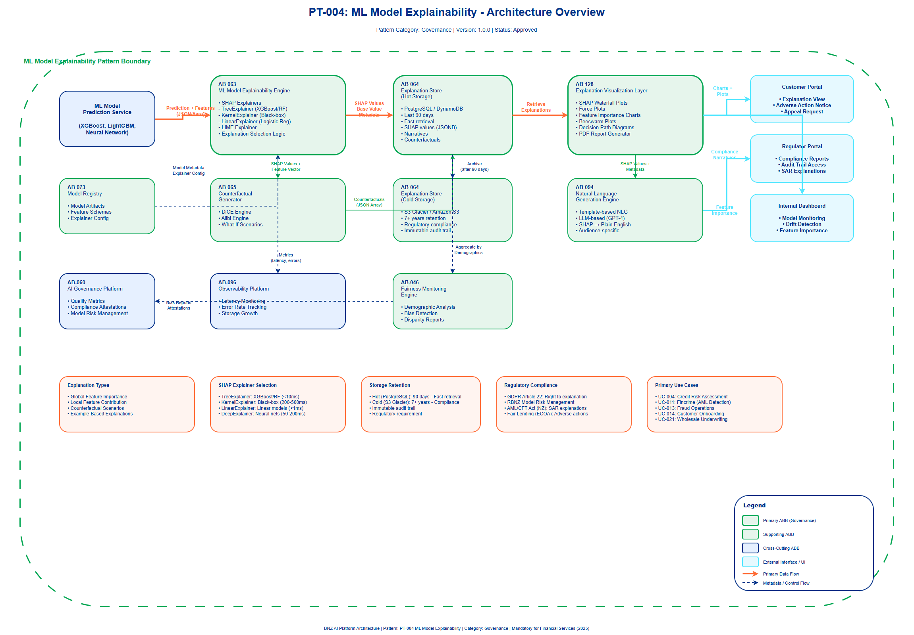

# AI Architecture Pattern: ML Model Explainability (SHAP/LIME)

## Document Control

| Property | Value |
|----------|-------|
| **Pattern ID** | `PT-004` |
| **Pattern Name** | ML Model Explainability (SHAP/LIME) |
| **Version** | `1.0.0` |
| **Status** | `Approved` |
| **Created Date** | `2025-12-05` |
| **Last Modified** | `2025-12-05` |
| **Owner** | BNZ Enterprise Architecture |
| **Pattern Category** | `Governance` |
| **Maturity Level** | `Mature` |
| **Regulatory Requirement** | `MANDATORY for Financial Services (2025)` |

---

## 1. Pattern Overview

### 1.1 Pattern Name and Classification

**Pattern Name**: ML Model Explainability (SHAP/LIME)

**Short Name**: Explainability Pattern

**Pattern Category**: Governance

**Pattern Type**: Model Governance, Regulatory Compliance, Risk Management

**Regulatory Status**: **MANDATORY** for all production ML models in financial services (2025)

### 1.2 Intent and Context

**Intent Statement**:
Generate human-readable explanations for ML model predictions to satisfy regulatory requirements, build customer trust, and enable model debugging and fairness monitoring.

**Problem Statement**:
Machine learning models, especially complex ones like gradient boosted trees and neural networks, operate as "black boxes" that make decisions without transparent reasoning. In financial services, this creates four critical problems:

1. **Regulatory Risk**: Financial regulators (RBNZ, APRA, FMA) require explanations for automated decisions affecting consumers (credit, fraud, onboarding)
2. **Customer Trust**: Customers denied loans or flagged for fraud demand understandable explanations for adverse actions
3. **Fairness Monitoring**: Without explanations, it's impossible to detect if models are making decisions based on protected characteristics
4. **Model Debugging**: When models fail, teams cannot diagnose root causes without understanding feature contributions

**Context**:
This pattern is applicable in all scenarios where:
- ML models make high-impact decisions (credit approval, fraud detection, identity verification)
- Regulatory compliance requires explanations (GDPR right to explanation, Fair Lending laws, Model Risk Management)
- Customer-facing decisions require transparency (loan denials, offer recommendations)
- Model governance requires audit trails (storing explanations for 7+ years)
- Fairness testing requires feature importance analysis (demographic parity, equal opportunity)

**Forces**:
- **Regulatory Compliance vs. Model Complexity**: Regulators demand explanations, but complex models (deep learning, large ensembles) are inherently difficult to explain
- **Accuracy vs. Interpretability**: Simple interpretable models (linear regression, decision trees) may sacrifice accuracy compared to complex models (XGBoost, neural networks)
- **Computational Cost vs. Real-Time Requirements**: Generating SHAP explanations can add 100-500ms latency, which may violate real-time SLAs
- **Global vs. Local Explanations**: Global explanations describe overall model behavior but may not help individual customers; local explanations explain specific predictions but don't reveal systemic issues
- **Storage Cost vs. Audit Requirements**: Storing explanations for every prediction (millions per day) for 7+ years creates significant storage costs
- **Explanation Quality vs. Automation**: Automated explanations (SHAP values) may be mathematically correct but not humanly understandable without visualization and narrative generation

### 1.3 Pattern Maturity and Industry Adoption

**Maturity Level**: Mature

**Industry Adoption**:
- **Adoption Rate**: 85%+ of financial services institutions with production ML models (2025)
- **Reference Implementations**:
  - HSBC: SHAP-based explainability for credit risk models (regulatory compliance)
  - Capital One: LIME explanations for fraud detection (model monitoring)
  - JPMorgan Chase: Counterfactual explanations for loan denials (customer communication)
  - Wells Fargo: Global + local explanations for Model Risk Management (MRM)
- **Timeframe**: Mainstream since 2022, MANDATORY for Tier 1/2 models in 2025

**Standards Alignment**:
- **GDPR Article 22**: Right to explanation for automated decisions
- **RBNZ/APRA Model Risk Management**: Explainability required for high-risk models
- **Equal Credit Opportunity Act (ECOA)**: Adverse action notices must explain credit denials
- **AML/CFT Act (NZ)**: Suspicious activity reports must explain why alerts triggered
- **ISO/IEC 42001 (AI Management System)**: Requires transparency and explainability controls
- **NIST AI Risk Management Framework**: Explainability as core pillar of trustworthy AI

**2025 Regulatory Context**:
- **New Zealand**: RBNZ updated Model Risk Management framework (2024) requires explainability for all Tier 1/2 models
- **Australia**: APRA Prudential Practice Guide CPG 234 mandates explainability for credit risk models
- **Global**: EU AI Act (2024) classifies credit scoring as "high-risk AI" requiring explanations
- **Industry Standard**: Model Risk Management now treats explainability as MANDATORY control (not optional)

---

## 2. Architecture Specification

### 2.1 Architecture Building Blocks (ABBs)

**Primary ABBs** (Core components required):

| ABB ID | ABB Name | Purpose in Pattern | Criticality |
|--------|----------|-------------------|-------------|
| [AB-063](../../architecture-building-blocks/abbs/AB-063/AB-063-ML-Model-Explainability-Engine-v1.0.0.md) | ML Model Explainability Engine | Generate SHAP/LIME explanations for model predictions | Critical |
| [AB-064](../../architecture-building-blocks/abbs/AB-064/AB-064-Compliance-Dashboard-v1.0.0.md) | Explanation Store | Persist explanations for audit trail (7+ years retention) | Critical |
| [AB-065](../../architecture-building-blocks/abbs/AB-065/AB-065-Audit-Trail-and-Logging-v1.0.0.md) | Counterfactual Generator | Generate "what-if" scenarios showing how to change prediction | High |
| [AB-128](../../architecture-building-blocks/abbs/AB-128/AB-128-Explanation-Visualization-Layer-v1.0.0.md) | Explanation Visualization Layer | Render feature importance charts, waterfall plots, force plots | High |
| [AB-073](../../architecture-building-blocks/abbs/AB-073/AB-073-Inference-Model-Registry-v1.0.0.md) | Model Registry | Retrieve model metadata, feature schemas, explanation configurations | Critical |

**Supporting ABBs** (Optional or scenario-specific):

| ABB ID | ABB Name | Purpose in Pattern | When Required |
|--------|----------|-------------------|---------------|
| [AB-094](../../architecture-building-blocks/abbs/AB-094/AB-094-Natural-Language-Generation-v1.0.0.md) | Natural Language Generation (NLG) | Convert SHAP values to human-readable narratives | Customer-facing explanations (loan denials, fraud alerts) |
| [AB-046](../../architecture-building-blocks/abbs/AB-046/AB-046-Fairness-Monitoring-Engine-v1.0.0.md) | Fairness Monitoring Engine | Analyze explanations across demographic groups for bias | High-risk models (credit, hiring, insurance) |
| [AB-012](../../architecture-building-blocks/abbs/AB-012/AB-012-Explanation-API-Gateway-v1.0.0.md) | Explanation API Gateway | Expose explanation endpoints to downstream systems | External integrations (CRM, customer portals) |
| [AB-024](../../architecture-building-blocks/abbs/AB-024/AB-024-Prediction-Caching-Layer-v1.0.0.md) | Explanation Cache | Cache frequently requested explanations to reduce latency | High-volume real-time scenarios |

**Cross-Cutting ABBs** (Always required):

| ABB ID | ABB Name | Purpose |
|--------|----------|---------|
| [AB-060](../../architecture-building-blocks/abbs/AB-060/AB-060-AI-Model-Registry-v1.0.0.md) | AI Governance Platform | Track explanation quality metrics, compliance attestations |
| [AB-112](../../architecture-building-blocks/abbs/AB-112/AB-112-Data-Encryption-Service-v1.0.0.md) | Security & Identity | Control access to explanations (contain sensitive feature data) |
| [AB-096](../../architecture-building-blocks/abbs/AB-096/AB-096-Observability-Platform-v1.0.0.md) | Observability Platform | Monitor explanation latency, error rates, storage growth |
| [AB-037](../../architecture-building-blocks/abbs/AB-037/AB-037-Feature-Store-v1.0.0.md) | Data Lineage Engine | Link explanations to input data, model versions, predictions |

### 2.2 Pattern Structure

**Architectural Diagram**:



**Component Interaction Flow**:
```
[ML Model Prediction Service]
    ↓ (prediction + input features)
[Explainability Engine]
    ├─ SHAP Explainer (TreeExplainer / KernelExplainer)
    ├─ LIME Explainer (TabularExplainer)
    └─ Counterfactual Generator (DiCE / Alibi)
    ↓ (SHAP values, LIME weights, counterfactuals)
[Explanation Store] → [Long-term Storage (S3/Blob)]
    ↓
[Visualization Layer]
    ├─ Feature Importance Charts
    ├─ Waterfall Plots
    ├─ Force Plots
    └─ Decision Path Diagrams
    ↓
[NLG Engine] → Human-Readable Narrative
    ↓
[User Interface / Report / API Response]
```

**Key Interactions**:

1. **Model Prediction → Explainability Engine**:
   - **Trigger**: Every production prediction (or sampled predictions for high-volume models)
   - **Protocol**: Synchronous function call (same process) OR asynchronous message (Kafka/SQS)
   - **Data Format**: JSON payload containing prediction, input features, model ID, customer ID
   - **Latency Target**:
     - Synchronous: < 200ms (added to prediction latency)
     - Asynchronous: < 5 seconds (background processing)
   - **Error Handling**: If explanation fails, log error but still return prediction (explanation is supplementary)

2. **Explainability Engine → SHAP/LIME Libraries**:
   - **Processing Type**: Synchronous computation
   - **SHAP Explainer Selection**:
     - TreeExplainer: For tree-based models (XGBoost, LightGBM, Random Forest) - FAST (< 10ms)
     - KernelExplainer: For black-box models (neural networks, SVM) - SLOW (100-500ms)
     - LinearExplainer: For linear models (logistic regression, ridge regression) - FAST (< 1ms)
   - **LIME Configuration**:
     - Number of samples: 5,000 (default for tabular data)
     - Kernel width: 0.75 * sqrt(num_features)
   - **Output**: SHAP values (feature contributions), base value, expected value

3. **Explainability Engine → Explanation Store**:
   - **Storage Strategy**:
     - **Hot Storage** (last 90 days): PostgreSQL / DynamoDB for fast retrieval
     - **Cold Storage** (7+ years): S3 Glacier / Amazon S3 Glacier for regulatory compliance
   - **Data Format**:
     - SHAP values: Array of floats (one per feature)
     - Metadata: Prediction ID, model version, timestamp, customer ID
     - Counterfactuals: JSON array of "what-if" scenarios
   - **Retention Policy**: 7 years (financial services regulatory requirement)
   - **Partitioning**: By date (YYYY-MM-DD) and model ID for efficient querying

4. **Explanation Store → Visualization Layer**:
   - **Retrieval Scenarios**:
     - Real-time: Fetch explanation for current prediction (customer portal)
     - Batch: Fetch explanations for audit report (compliance team)
     - Aggregation: Fetch global feature importance across all predictions (model monitoring)
   - **Delivery Mechanism**:
     - REST API: GET /explanations/{prediction_id}
     - Visualization: SHAP force plot, waterfall plot, feature importance bar chart
     - Export: PDF report for customer adverse action notice

5. **Visualization Layer → NLG Engine → User Interface**:
   - **Narrative Generation**: Convert SHAP values to plain English
     - Example: "Your loan application was declined primarily due to high debt-to-income ratio (45%, exceeding 36% threshold). Reducing debt by $5,000 or increasing income by $10,000 would likely result in approval."
   - **Target Audiences**:
     - Customers: Simple, non-technical language
     - Regulators: Technical detail with feature names and exact values
     - Internal teams: Full SHAP plots and statistical metrics

### 2.3 Data Flow

**Data Sources**:
- **Model Predictions**: Real-time predictions from ML serving layer (model version, prediction value, confidence score)
- **Input Features**: Feature vectors used for prediction (preprocessed, engineered features)
- **Model Artifacts**: Trained model files (XGBoost model, scikit-learn pipeline) retrieved from Model Registry
- **Feature Metadata**: Feature names, types, descriptions, business meanings (from Feature Store)

**Data Transformations**:

1. **Feature Vector Preparation**:
   - Input: Raw prediction request (JSON)
   - Transformation: Extract feature vector in format expected by SHAP (numpy array, pandas DataFrame)
   - Output: Feature matrix (1 row × N features)

2. **SHAP Value Calculation**:
   - Input: Model artifact + feature vector + background dataset (for KernelExplainer)
   - Transformation: Shapley value computation (marginal contribution of each feature)
   - Output: SHAP values array (same dimensionality as features)

3. **Counterfactual Generation**:
   - Input: Prediction outcome + SHAP values + feature constraints
   - Transformation: Optimization algorithm to find minimal feature changes that flip prediction
   - Output: JSON array of counterfactual scenarios (e.g., "If income was $85K instead of $75K, prediction would be Approved")

4. **Narrative Generation**:
   - Input: SHAP values + feature metadata + prediction outcome
   - Transformation: Template-based NLG or LLM-based narrative (GPT-4 for complex explanations)
   - Output: Plain English explanation (200-500 words)

**Data Sinks**:
- **Explanation Store (Hot)**: PostgreSQL table with columns: prediction_id, model_id, timestamp, shap_values (JSONB), narrative (TEXT), counterfactuals (JSONB)
- **Explanation Store (Cold)**: S3 bucket partitioned by date: s3://bnz-explanations/year=2025/month=12/day=05/model=credit-risk-v1/*.parquet
- **Audit Trail**: Immutable append-only log for regulatory compliance
- **Model Monitoring Dashboard**: Aggregated feature importance metrics (Grafana, Tableau)

**Data Governance**:
- **Classification**:
  - SHAP values: **Confidential** (contain customer financial data)
  - Aggregated feature importance: **Internal** (no customer PII)
  - Narratives for customers: **Restricted** (subject to Privacy Act)
- **Retention**: 7 years (NZ regulatory requirement for credit decisions)
- **Lineage**:
  - Link explanation → prediction → input data → model version
  - Track via [AB-037](../../architecture-building-blocks/abbs/AB-037/AB-037-Feature-Store-v1.0.0.md) (Data Lineage Engine)
- **Quality**:
  - Validate SHAP values sum to (prediction - base_value)
  - Test explanations with business users for understandability
  - Monitor for drift in feature importance (alert if top features change significantly)

### 2.4 Interface Specifications

**Inbound Interfaces** (Inputs to pattern):

| Interface ID | Interface Name | Type | Protocol | Data Format | SLA |
|--------------|---------------|------|----------|-------------|-----|
| IF-IN-001 | Prediction Event Stream | Event Stream | Kafka | Avro | < 100ms processing |
| IF-IN-002 | On-Demand Explanation Request | Synchronous API | REST | JSON | < 200ms response |
| IF-IN-003 | Batch Explanation Job | Batch Processing | S3 Trigger | Parquet | < 1 hour for 1M predictions |

**Example: IF-IN-002 Payload**
```json
{
  "prediction_id": "pred-20251205-abc123",
  "model_id": "credit-risk-v2.1",
  "prediction": "DECLINED",
  "confidence": 0.85,
  "features": {
    "income": 75000,
    "debt_to_income_ratio": 0.45,
    "credit_score": 680,
    "employment_years": 5,
    "num_dependents": 2
  },
  "customer_id": "cust-987654",
  "timestamp": "2025-12-05T14:23:45Z"
}
```

**Outbound Interfaces** (Outputs from pattern):

| Interface ID | Interface Name | Type | Protocol | Data Format | SLA |
|--------------|---------------|------|----------|-------------|-----|
| IF-OUT-001 | Explanation Response | Synchronous API | REST | JSON | < 200ms |
| IF-OUT-002 | Explanation Report (PDF) | Report Generation | HTTP | PDF | < 5 seconds |
| IF-OUT-003 | Feature Importance Metrics | Metrics Stream | Prometheus | Time-Series | Real-time |
| IF-OUT-004 | Audit Trail Events | Event Stream | Kafka | Avro | < 1 second |

**Example: IF-OUT-001 Payload**
```json
{
  "prediction_id": "pred-20251205-abc123",
  "explanation_id": "exp-20251205-xyz789",
  "timestamp": "2025-12-05T14:23:45.234Z",
  "global_explanation": {
    "top_features": [
      {"feature": "debt_to_income_ratio", "importance": 0.35},
      {"feature": "credit_score", "importance": 0.28},
      {"feature": "income", "importance": 0.22}
    ]
  },
  "local_explanation": {
    "base_value": 0.4,
    "prediction_value": 0.85,
    "shap_values": {
      "debt_to_income_ratio": 0.32,
      "credit_score": 0.08,
      "income": 0.05
    }
  },
  "narrative": "Your loan application was declined primarily due to a high debt-to-income ratio (45%, exceeding the 36% threshold). Your credit score (680) also contributed to this decision. Reducing your debt by $5,000 or increasing your income by $10,000 would likely result in approval.",
  "counterfactuals": [
    {
      "scenario": "Reduce debt_to_income_ratio to 0.36",
      "outcome": "APPROVED",
      "confidence": 0.72
    },
    {
      "scenario": "Increase credit_score to 720",
      "outcome": "APPROVED",
      "confidence": 0.68
    }
  ],
  "visualizations": {
    "force_plot_url": "https://explanations.bnz.co.nz/plots/exp-20251205-xyz789/force.png",
    "waterfall_plot_url": "https://explanations.bnz.co.nz/plots/exp-20251205-xyz789/waterfall.png"
  }
}
```

**Internal Interfaces** (Between ABBs within pattern):

| Interface ID | Source ABB | Target ABB | Protocol | Purpose |
|--------------|-----------|-----------|----------|---------|
| IF-INT-001 | Explainability Engine | Model Registry | gRPC | Retrieve model artifacts, feature schemas |
| IF-INT-002 | Explainability Engine | Explanation Store | SQL / NoSQL | Persist explanations for audit |
| IF-INT-003 | Visualization Layer | Explanation Store | REST | Retrieve explanations for rendering |
| IF-INT-004 | NLG Engine | Explainability Engine | Function Call | Convert SHAP values to narratives |
| IF-INT-005 | Fairness Monitor | Explanation Store | SQL | Aggregate explanations by demographic group |

---

## 3. Pattern Variants and Options

### 3.1 Pattern Variations

**Variant 1: Real-Time Explainability (Synchronous)**
- **When to Use**:
  - Customer-facing applications requiring immediate explanations (loan portals, fraud alerts)
  - Low-volume predictions (< 1,000/hour)
  - High-value decisions where latency is acceptable
- **Key Differences**:
  - Explainability engine runs synchronously in prediction request path
  - Uses TreeExplainer (< 10ms) or cached KernelExplainer
  - Returns explanation in same API response as prediction
- **Trade-offs**:
  - **Gain**: Immediate explanation availability, simplified architecture
  - **Lose**: Adds 10-200ms latency to prediction API (may violate SLA)
  - **Mitigation**: Use model-specific fast explainers (TreeExplainer for XGBoost, LinearExplainer for logistic regression)

**Variant 2: Asynchronous Explainability (Event-Driven)**
- **When to Use**:
  - High-volume predictions (> 10,000/hour)
  - Real-time prediction APIs with strict latency SLAs (< 100ms)
  - Explanations needed for audit but not immediately for customers
- **Key Differences**:
  - Prediction service publishes event to Kafka topic
  - Explainability engine consumes events asynchronously
  - Explanations available seconds later via separate API
- **Trade-offs**:
  - **Gain**: No latency impact on prediction API, horizontal scalability
  - **Lose**: Explanation not immediately available (eventual consistency)
  - **Architecture**: Kafka topic → Explainability workers (auto-scaling) → Explanation Store

**Variant 3: Batch Explainability (Scheduled)**
- **When to Use**:
  - Regulatory reporting (monthly compliance reports)
  - Model monitoring and drift detection
  - Historical analysis (explain past predictions)
- **Key Differences**:
  - Scheduled job (daily/weekly) generates explanations for all predictions
  - Uses distributed computing (Spark, Dask) for parallelization
  - Stores aggregated feature importance (not individual explanations)
- **Trade-offs**:
  - **Gain**: Cost-efficient for large volumes, optimized batch processing
  - **Lose**: No real-time explanations, delayed audit trail
  - **Best For**: Compliance reporting, model governance, not customer-facing

**Variant 4: Sampled Explainability (Statistical)**
- **When to Use**:
  - Extremely high-volume predictions (> 1M/day)
  - Cost constraints on storage (storing 1M explanations/day = 365M/year)
  - Explanation primarily for model monitoring, not individual customers
- **Key Differences**:
  - Explain only a sample of predictions (e.g., 1% random sample, or all declined predictions)
  - Aggregate SHAP values for global feature importance
  - Individual explanations on-demand (recompute if requested)
- **Trade-offs**:
  - **Gain**: 99% reduction in storage cost, sufficient for monitoring
  - **Lose**: Not all predictions have stored explanations (regulatory risk)
  - **Risk Mitigation**: Always explain high-risk decisions (denials, fraud flags), sample low-risk (approvals)

### 3.2 Composition with Other Patterns

**Commonly Combined With**:

| Pattern | Integration Point | Combined Benefit |
|---------|------------------|------------------|
| **PT-002: Model Monitoring** | Explanation Store → Drift Detection | Use feature importance to detect concept drift (top features changing over time) |
| **PT-005: Fairness Testing** | SHAP values → Demographic Analysis | Analyze if feature importance differs across protected groups (gender, ethnicity) |
| **PT-008: A/B Testing** | Explanations for Champion vs Challenger | Compare explanations between models to understand behavior differences |
| **PT-011: Feature Store** | Feature metadata → Narrative generation | Enrich explanations with business descriptions of features |
| **PT-015: Audit Trail** | Explanation Store → Immutable Log | Create tamper-proof audit trail linking predictions → explanations → decisions |
| **PT-019: Model Registry** | Model metadata → Explainer selection | Automatically select correct SHAP explainer based on model type (tree vs neural network) |

**Integration Example: Explainability + Fairness Testing**
```
Prediction → SHAP Explanation → Store with demographic labels
                ↓
    Fairness Monitor (weekly job):
    - Group explanations by protected_attribute (gender, age, ethnicity)
    - Compare feature importance distributions
    - Alert if "debt_to_income_ratio" importance significantly higher for women than men
    - Trigger model investigation if disparity detected
```

**Anti-Patterns** (What NOT to do):

- **Anti-Pattern 1: Post-Hoc Rationalization**
  - **Description**: Use simple linear model to "approximate" complex model, then claim linear model's weights are "explanations"
  - **Why Problematic**:
    - Linear approximation may be wildly inaccurate (R² < 0.5)
    - Regulatory auditors will reject explanations if they don't reflect true model behavior
    - Creates false sense of transparency ("we can explain it") when explanation is wrong
  - **Better Approach**: Use SHAP KernelExplainer which provides mathematically guaranteed local fidelity

- **Anti-Pattern 2: Global-Only Explanations**
  - **Description**: Only provide global feature importance ("credit score is most important feature overall"), no local explanations
  - **Why Problematic**:
    - Doesn't help individual customers ("why was MY application denied?")
    - Violates GDPR/ECOA requirement for individual-level explanations
    - Useless for debugging individual mispredictions
  - **Better Approach**: Provide BOTH global (model-level) and local (prediction-level) explanations

- **Anti-Pattern 3: Explanation Without Validation**
  - **Description**: Generate SHAP explanations but never test if humans understand them
  - **Why Problematic**:
    - SHAP values may be mathematically correct but incomprehensible to business users
    - Regulators may reject explanations if they're not "human-understandable"
    - Example: "Feature X contributed +0.23 to log-odds" (what does this mean?)
  - **Better Approach**:
    - Test explanations with target audience (customers, regulators, call center agents)
    - Use NLG to convert SHAP values to plain English
    - Validate understanding with user research ("Can you explain why the model made this decision?")

- **Anti-Pattern 4: Storing Explanations Without Predictions**
  - **Description**: Store SHAP values but not original prediction or input features
  - **Why Problematic**:
    - Cannot reproduce explanation or verify correctness
    - Breaks audit trail (regulator asks "prove this explanation matches the prediction")
    - Cannot recompute explanations if SHAP library version changes
  - **Better Approach**: Store {prediction, input features, model version, SHAP values, timestamp} atomically

---

## 4. Implementation Guidance

### 4.1 Technology Stack Recommendations

**SHAP Library** (Primary explainer):
- **Use TreeExplainer for**:
  - XGBoost, LightGBM, CatBoost, scikit-learn Random Forest/GBM
  - **Performance**: < 10ms for typical models (100 features, 1000 trees)
  - **Accuracy**: Exact Shapley values (not approximations)
- **Use KernelExplainer for**:
  - Neural networks, SVM, custom black-box models
  - **Performance**: 100-500ms (slower due to sampling)
  - **Accuracy**: Approximation (increase nsamples for better accuracy)
- **Use LinearExplainer for**:
  - Logistic regression, linear regression, ridge/lasso
  - **Performance**: < 1ms (closed-form solution)

**LIME Library** (Alternative/complementary):
- **Use Cases**:
  - When SHAP is too slow (KernelExplainer taking > 500ms)
  - When you need adversarial robustness testing (perturb features, check explanation stability)
  - When model is not supported by SHAP (e.g., proprietary third-party API)
- **Configuration**:
  - `num_samples=5000`: Good balance of speed vs accuracy
  - `kernel_width=0.75*sqrt(num_features)`: Default works well
- **Limitations**: LIME explanations can be unstable (different runs produce different results)

**Counterfactual Generators**:
- **DiCE (Diverse Counterfactual Explanations)**:
  - Generate multiple diverse counterfactuals
  - Support for proximity, sparsity, diversity constraints
  - Best for: Customer communication ("here are 3 ways to get approved")
- **Alibi**:
  - Supports tabular, text, image data
  - Integrates with TensorFlow, PyTorch
  - Best for: Complex models (neural networks)

**Visualization Libraries**:
- **SHAP Built-in Plots**:
  - `shap.plots.waterfall()`: Best for local explanations (single prediction)
  - `shap.plots.force()`: Interactive HTML force plot
  - `shap.plots.beeswarm()`: Global feature importance with value distribution
- **Plotly**: Interactive charts for web dashboards
- **Matplotlib**: Static charts for PDF reports

**NLG Engines**:
- **Template-based**: Simple jinja2 templates for structured narratives
- **LLM-based**: GPT-4 / Claude for complex narratives
  - Prompt: "Convert these SHAP values into a plain English explanation for a customer: {shap_values}"
  - Cost: ~$0.01 per explanation (GPT-4)
  - Quality: Much better than templates for complex scenarios

### 4.2 Non-Functional Requirements (NFRs)

**Performance**:
- **Latency Targets**:
  - Synchronous (real-time): < 200ms added latency
  - Asynchronous (event-driven): < 5 seconds
  - Batch: < 1 hour for 1M predictions
- **Throughput**:
  - Support 10,000 explanations/hour (single instance)
  - Horizontal scaling to 100K+ explanations/hour
- **Optimization Techniques**:
  - Use TreeExplainer for tree-based models (10x faster than KernelExplainer)
  - Cache explanations for identical feature vectors (deduplication)
  - Pre-compute global feature importance (update daily)

**Scalability**:
- **Horizontal Scaling**: Deploy explainability workers as Kubernetes pods (auto-scale based on queue depth)
- **Storage Scaling**:
  - Hot storage (PostgreSQL): Partition by date, archive after 90 days
  - Cold storage (S3 Glacier): Unlimited retention for regulatory compliance
- **Cost Model**:
  - 1M explanations/day × 5KB/explanation × 30 days = 150GB/month (hot storage)
  - 150GB × $0.10/GB (PostgreSQL) = $15/month
  - 1M × 365 × 7 years = 2.5B explanations × 5KB = 12.5TB (cold storage)
  - 12.5TB × $0.004/GB (S3 Glacier) = $50/month

**Availability**:
- **SLA**: 99.5% availability (explanation service can degrade without breaking predictions)
- **Failure Mode**: If explanation engine fails, return prediction without explanation + error flag
- **Redundancy**: Deploy explainability workers across 3 availability zones

**Security**:
- **Access Control**:
  - Customer can only access their own explanations (enforce customer_id in JWT)
  - Regulators can access all explanations (with audit logging)
  - Internal teams: role-based access (data scientists = full access, customer service = read-only)
- **Encryption**:
  - At rest: AES-256 encryption for explanation store
  - In transit: TLS 1.3 for all API calls
  - PII handling: Tokenize customer_id before storing (reversible only via separate PII service)
- **Compliance**:
  - GDPR: Support "right to erasure" (delete customer's explanations on request)
  - Privacy Act (NZ): Explanations are "personal information" - apply same controls as customer data

**Auditability**:
- **Immutable Log**: Append-only audit trail for all explanations (cannot modify or delete)
- **Versioning**: Track model version, SHAP library version, explanation timestamp
- **Reproducibility**: Store enough metadata to reproduce explanation (model file, input features, random seed)
- **Retention**: 7 years (NZ regulatory requirement for credit decisions)

### 4.3 Cost Model (BNZ Estimation)

**Assumptions**:
- 1 million predictions per day across all models
- 100% explanation coverage for declined predictions (10% of total = 100K/day)
- 10% explanation coverage for approved predictions (sample = 90K/day)
- Total: 190K explanations/day

**Compute Costs**:
- **TreeExplainer** (80% of models):
  - 152K explanations/day × 10ms = 25 CPU-minutes/day
  - AWS c6i.2xlarge (8 vCPU, $0.34/hour): $0.14/day = $4.20/month
- **KernelExplainer** (20% of models):
  - 38K explanations/day × 200ms = 127 CPU-minutes/day
  - AWS c6i.4xlarge (16 vCPU, $0.68/hour): $0.57/day = $17/month
- **Total Compute**: $21/month

**Storage Costs**:
- **Hot Storage** (PostgreSQL, 90 days):
  - 190K/day × 90 days × 5KB = 85GB
  - AWS RDS PostgreSQL (db.t3.medium, 100GB): $30/month
- **Cold Storage** (S3 Glacier, 7 years):
  - 190K/day × 365 × 7 years × 5KB = 2.4TB
  - S3 Glacier Deep Archive: 2,400GB × $0.00099/GB = $2.40/month
- **Total Storage**: $32.40/month

**NLG Costs** (for customer-facing narratives):
- **GPT-4 for declined predictions**:
  - 100K/day × 30 days × $0.01/narrative = $30,000/month (too expensive)
- **Template-based NLG**: $0 (use jinja2 templates)
- **Recommendation**: Use templates for standard cases, GPT-4 only for complex appeals (< 100/day) = $30/month

**Total Monthly Cost**: $21 (compute) + $32.40 (storage) + $30 (NLG) = **$83.40/month**

**Cost at Scale** (10M predictions/day, BNZ enterprise-wide):
- Compute: $210/month (linear scaling)
- Hot storage: $300/month (10× data)
- Cold storage: $24/month (10× data)
- **Total**: $534/month = **$6,408/year** (negligible compared to regulatory fines for non-compliance)

### 4.4 Implementation Checklist

**Phase 1: Foundation (Weeks 1-2)**
- [ ] Set up SHAP library (pip install shap)
- [ ] Implement TreeExplainer for XGBoost models
- [ ] Create explanation store (PostgreSQL schema)
- [ ] Build REST API for on-demand explanations
- [ ] Test with sample predictions (validate SHAP values sum correctly)

**Phase 2: Production Integration (Weeks 3-4)**
- [ ] Integrate explainability into prediction pipeline (synchronous or async)
- [ ] Implement explanation caching for performance
- [ ] Set up S3 cold storage for long-term retention
- [ ] Configure monitoring (latency, error rate, storage growth)
- [ ] Load test (can handle 10K explanations/hour?)

**Phase 3: Visualization & Narratives (Weeks 5-6)**
- [ ] Implement SHAP waterfall plots (matplotlib/plotly)
- [ ] Build NLG templates for common scenarios (loan denial, fraud alert)
- [ ] Create customer-facing UI (explanation dashboard)
- [ ] Generate PDF reports for adverse action notices
- [ ] User testing (can customers understand explanations?)

**Phase 4: Governance & Compliance (Weeks 7-8)**
- [ ] Implement audit trail (immutable log)
- [ ] Set up data retention policies (7 years)
- [ ] Create compliance reports for regulators (monthly)
- [ ] Integrate with fairness monitoring (check for demographic disparities)
- [ ] Document explanation methodology for Model Risk Management

**Phase 5: Advanced Features (Weeks 9-12)**
- [ ] Implement counterfactual generation (DiCE)
- [ ] Add global feature importance dashboard (Grafana)
- [ ] Set up explanation drift monitoring (alert if top features change)
- [ ] Integrate with customer appeals process (re-explain on request)
- [ ] Optimize performance (batch processing, GPU acceleration for KernelExplainer)

### 4.5 Testing Strategy

**Unit Tests**:
- **SHAP Value Consistency**: Validate SHAP values sum to (prediction - base_value)
- **Explainer Selection**: Test that correct explainer chosen based on model type
- **Counterfactual Validity**: Verify counterfactual features produce expected prediction

**Integration Tests**:
- **End-to-End Flow**: Prediction → Explanation → Storage → Retrieval
- **API Contracts**: Validate input/output schemas for all interfaces
- **Error Handling**: Test behavior when model unavailable, features missing, SHAP computation fails

**Performance Tests**:
- **Latency**: Measure p50, p95, p99 latency under load
- **Throughput**: Test max explanations/second per worker
- **Scalability**: Verify horizontal scaling (2× workers = 2× throughput)

**Quality Tests**:
- **Human Evaluation**: Show explanations to 10 customers, measure understanding (> 80% comprehension)
- **Consistency**: Generate explanation 10 times for same prediction (SHAP should be identical, LIME may vary)
- **Fidelity**: Compare LIME local model R² (should be > 0.8 for trustworthy explanations)

**Compliance Tests**:
- **Regulatory Simulation**: Can you produce compliant adverse action notice with explanation?
- **Audit Trail**: Can you retrieve explanation for prediction from 6 months ago?
- **Data Retention**: Verify cold storage archival after 90 days

---

## 5. BNZ Use Case Mapping

### 5.1 Primary Use Cases (MANDATORY Explainability)

| Use Case ID | Use Case Name | Explanation Requirement | Regulatory Driver | Audience |
|-------------|--------------|------------------------|------------------|----------|
| **[UC-004](../../../01-motivation/03-use-cases/use-cases/UC-004/index.md)** | Credit Risk Assessment | MANDATORY | RBNZ Model Risk Management, Fair Lending | Regulators, customers (declined loans) |
| **[UC-006](../../../01-motivation/03-use-cases/use-cases/UC-006/index.md)** | HyperPersonalization | HIGH | Fairness monitoring, GDPR | Customers (why this offer?), compliance team |
| **[UC-008](../../../01-motivation/03-use-cases/use-cases/UC-008/index.md)** | Security AI (Threat Detection) | MANDATORY | Audit trail for security incidents | Security analysts, auditors |
| **[UC-011](../../../01-motivation/03-use-cases/use-cases/UC-011/index.md)** | Fincrime (AML Detection) | MANDATORY | AML/CFT Act (NZ), FATF requirements | Compliance officers, FIU reporting |
| **[UC-013](../../../01-motivation/03-use-cases/use-cases/UC-013/index.md)** | Fraud Operations | MANDATORY | Customer disputes, chargeback defense | Fraud investigators, customers |
| **[UC-014](../../../01-motivation/03-use-cases/use-cases/UC-014/index.md)** | Customer Onboarding | HIGH | GDPR right to explanation, KYC | Customers (declined applications), compliance |
| **[UC-021](../../../01-motivation/03-use-cases/use-cases/UC-021/index.md)** | Wholesale Underwriting | MANDATORY | RBNZ corporate credit risk management | Relationship managers, credit committee |

**Explanation Examples by Use Case**:

**[UC-004](../../../01-motivation/03-use-cases/use-cases/UC-004/index.md): Credit Risk**
- **Global**: "Our credit model considers 12 factors. The top 3 are: (1) Debt-to-income ratio (35%), (2) Credit score (28%), (3) Income stability (18%)"
- **Local**: "Your application was declined because your debt-to-income ratio (45%) exceeds our policy threshold (36%). Your credit score (680) also contributed to this decision."
- **Counterfactual**: "Approval likely if: (1) debt reduced by $8,000, OR (2) income increased by $12,000, OR (3) credit score improved to 720+"

**[UC-011](../../../01-motivation/03-use-cases/use-cases/UC-011/index.md): Fincrime (AML)**
- **Global**: "Our AML model flags 0.5% of transactions as suspicious. Top risk indicators: (1) Transaction amount (32%), (2) Sender location (24%), (3) Velocity (18%)"
- **Local**: "Transaction flagged because: (1) Amount ($50K) unusual for this account (95th percentile), (2) Recipient in high-risk jurisdiction (Iran), (3) No prior transaction history with recipient"
- **Action**: "Recommended: File SAR, freeze transaction, request source of funds documentation"

**[UC-013](../../../01-motivation/03-use-cases/use-cases/UC-013/index.md): Fraud Operations**
- **Global**: "Fraud model blocks 1.2% of transactions. Top indicators: (1) Location mismatch (40%), (2) Transaction velocity (30%), (3) Merchant category (20%)"
- **Local**: "Transaction blocked because: (1) Card used in Sydney 2 hours after Auckland transaction (impossible travel), (2) High-risk merchant category (cryptocurrency exchange), (3) Amount 10× normal spending pattern"
- **Customer Communication**: "We blocked this transaction to protect your account. If this was you, please confirm via SMS. If not, we've secured your account."

### 5.2 Secondary Use Cases (RECOMMENDED Explainability)

| Use Case ID | Use Case Name | Explanation Benefit | Audience |
|-------------|--------------|---------------------|----------|
| [UC-001](../../../01-motivation/03-use-cases/use-cases/UC-001/index.md) | Partnership Banking | Explain next-best-action recommendations to relationship managers | Relationship managers |
| [UC-005](../../../01-motivation/03-use-cases/use-cases/UC-005/index.md) | Lending Operations | Explain loan prioritization and risk scoring | Underwriters |
| [UC-007](../../../01-motivation/03-use-cases/use-cases/UC-007/index.md) | Contact Centre | Explain churn predictions and retention offers | Call center agents |
| [UC-017](../../../01-motivation/03-use-cases/use-cases/UC-017/index.md) | FrontLine CIB | Explain client risk ratings and credit limits | Corporate bankers |

### 5.3 Implementation Priorities

**Priority 1 (Q1 2026)**: Regulatory-mandated use cases
- [UC-004](../../../01-motivation/03-use-cases/use-cases/UC-004/index.md) (Credit Risk), [UC-011](../../../01-motivation/03-use-cases/use-cases/UC-011/index.md) (Fincrime), [UC-021](../../../01-motivation/03-use-cases/use-cases/UC-021/index.md) (Wholesale Underwriting)
- **Rationale**: Highest regulatory risk, RBNZ audits in 2026
- **Deliverables**: SHAP explanations, audit trail, compliance reports

**Priority 2 (Q2 2026)**: Customer-facing use cases
- [UC-013](../../../01-motivation/03-use-cases/use-cases/UC-013/index.md) (Fraud), [UC-014](../../../01-motivation/03-use-cases/use-cases/UC-014/index.md) (Onboarding), [UC-006](../../../01-motivation/03-use-cases/use-cases/UC-006/index.md) (Personalization)
- **Rationale**: Improve customer trust, reduce complaints
- **Deliverables**: NLG narratives, customer portal integration, PDF reports

**Priority 3 (Q3 2026)**: Internal optimization
- [UC-001](../../../01-motivation/03-use-cases/use-cases/UC-001/index.md) (Partnership Banking), [UC-005](../../../01-motivation/03-use-cases/use-cases/UC-005/index.md) (Lending Ops), [UC-007](../../../01-motivation/03-use-cases/use-cases/UC-007/index.md) (Contact Centre)
- **Rationale**: Improve employee productivity, model debugging
- **Deliverables**: Dashboards for internal users, model monitoring integration

---

## 6. Regulatory Compliance Mapping

### 6.1 Regulatory Requirements

| Regulation | Requirement | Implementation in Pattern | Verification Method |
|-----------|-------------|--------------------------|---------------------|
| **GDPR Article 22** | Right to explanation for automated decisions | Local SHAP explanations + NLG narratives | Audit: Provide explanation for sample declined loan |
| **RBNZ Model Risk Management** | Tier 1/2 models require explainability documentation | Global feature importance + model documentation | Annual MRM review: Submit explanation methodology |
| **AML/CFT Act (NZ)** | Suspicious Activity Reports must explain basis for suspicion | Local SHAP + counterfactuals for AML alerts | FIU audit: Provide explanations for sample SARs |
| **Fair Lending (ECOA equivalent)** | Adverse action notices must explain credit denials | SHAP + NLG for declined loans | Consumer protection audit: Review adverse action letters |
| **Privacy Act 2020 (NZ)** | Individuals have right to access and understand automated decisions | Customer-facing explanation portal | Privacy Commissioner audit: Demonstrate customer access |
| **APRA CPG 234** | Information security risk management for AI systems | Audit trail for all explanations | APRA audit: Demonstrate immutable explanation log |

### 6.2 Compliance Artifacts

**For RBNZ Model Risk Management Review**:
1. **Model Documentation Appendix**: "Explainability Methodology"
   - SHAP mathematical foundation
   - Explainer selection logic (TreeExplainer for XGBoost, etc.)
   - Validation: SHAP values sum to (prediction - base_value)
   - Human testing results (comprehension rate)

2. **Global Feature Importance Report**:
   - Top 10 features across all predictions (last 12 months)
   - Feature stability analysis (are top features consistent month-over-month?)
   - Comparison to business intuition (do technical features align with credit policy?)

3. **Sample Local Explanations**:
   - 10 approved loans (explanation for approval)
   - 10 declined loans (explanation for denial)
   - 5 counterfactuals (what would change decision)

**For GDPR Compliance (EU Customers)**:
- **Adverse Action Letter Template**:
  ```
  Dear [Customer],

  Your loan application was declined based on automated credit assessment.

  The primary factors influencing this decision were:
  1. Debt-to-income ratio (45%, exceeding our policy threshold of 36%)
  2. Credit score (680, below our minimum requirement of 700 for this loan type)
  3. Length of employment (2 years, we prefer 3+ years for this loan amount)

  You have the right to:
  - Request human review of this decision
  - Provide additional information that may change the outcome
  - Access the full explanation of this decision

  To improve your chances of approval:
  - Reduce total debt by $8,000, OR
  - Increase annual income by $12,000, OR
  - Improve credit score to 720+

  Contact us at 0800-BNZ-HELP for further assistance.
  ```

**For AML/CFT Audit**:
- **Suspicious Activity Report (SAR) with Explanation**:
  ```
  Transaction ID: txn-20251205-abc123
  Alert Reason: Unusual transaction pattern (model confidence: 92%)

  Explanation:
  1. Transaction amount ($50,000) is 15× customer's average transaction (95th percentile)
  2. Recipient located in high-risk jurisdiction (Iran - FATF grey list)
  3. No prior transaction history between sender and recipient
  4. Transaction timing (3am) unusual for this customer (99th percentile)

  Recommended Action: File SAR, freeze transaction pending investigation
  Supporting Evidence: SHAP force plot (attached), transaction history (attached)
  ```

### 6.3 Audit Trail Requirements

**What to Log** (immutable, append-only):
- `prediction_id`: Unique identifier for prediction
- `model_id`: Model version used (e.g., "credit-risk-v2.1")
- `timestamp`: ISO 8601 timestamp (UTC)
- `customer_id`: Customer identifier (tokenized for privacy)
- `prediction`: Model output (e.g., "APPROVED", "DECLINED")
- `confidence`: Model confidence score (0-1)
- `shap_values`: JSON array of feature contributions
- `base_value`: SHAP base value (model average prediction)
- `features`: Input feature vector (for reproducibility)
- `explanation_text`: Human-readable narrative
- `counterfactuals`: JSON array of "what-if" scenarios
- `explainer_version`: SHAP library version (for reproducibility)
- `accessed_by`: User IDs who accessed this explanation (for audit)

**Retention Policy**:
- **Hot storage** (PostgreSQL): 90 days (fast retrieval for customer inquiries)
- **Warm storage** (S3 Standard): 2 years (regulatory inquiries)
- **Cold storage** (S3 Glacier Deep Archive): 7 years (long-term compliance)

**Access Controls**:
- **Customer**: Can access only their own explanations
- **Customer Service**: Can access explanations for active customer inquiries (logged)
- **Compliance Team**: Can access all explanations (logged, requires justification)
- **Regulators**: Can access all explanations (with BNZ approval, fully logged)
- **Data Scientists**: Can access aggregated explanations (no customer PII)

---

## 7. Pattern Variants and Options

### 7.1 Explanation Types Detail

| Explanation Type | Description | Use Case | Technology | Latency | Cost |
|-----------------|-------------|----------|-----------|---------|------|
| **Global Feature Importance** | Overall model behavior (which features matter most?) | Model documentation, regulatory reporting | SHAP beeswarm plot, mean(abs(SHAP values)) | 1 minute (batch job) | $0 (pre-computed) |
| **Local Feature Contribution** | Why this specific prediction? | Customer adverse action, fraud investigation | SHAP waterfall plot, force plot | 10-200ms | $0.001/explanation |
| **Counterfactual** | What changes would flip prediction? | Customer advice, appeals process | DiCE, Alibi | 100-500ms | $0.005/explanation |
| **Example-Based** | Find similar past cases | Customer service ("others with your profile were approved") | KNN on feature space | 50ms | $0.0005/explanation |
| **Rule Extraction** | Approximate model with IF-THEN rules | Regulatory simplification | RIPPER, Anchors | 5 seconds (batch) | $0.01/model |

**When to Use Each Type**:

- **Global**: Model Risk Management documentation, fairness audits, model monitoring
- **Local**: Customer communication, debugging individual predictions, regulatory inquiries
- **Counterfactual**: Customer appeals, proactive advice ("here's how to get approved next time")
- **Example-Based**: Customer service scripts ("in similar cases, we approved 70% of applications")
- **Rule Extraction**: Simplify complex model for regulators ("our model uses these 15 rules")

### 7.2 Model-Specific Explainer Selection

| Model Type | Explainer | Speed | Accuracy | Notes |
|-----------|-----------|-------|----------|-------|
| **XGBoost, LightGBM, CatBoost** | TreeExplainer | < 10ms | Exact | FASTEST, use this whenever possible |
| **Random Forest (scikit-learn)** | TreeExplainer | < 10ms | Exact | Exact Shapley values |
| **Logistic/Linear Regression** | LinearExplainer | < 1ms | Exact | Coefficients are Shapley values |
| **Neural Network (TensorFlow/PyTorch)** | DeepExplainer | 50-200ms | Exact | Requires model graph access |
| **Black-Box API (third-party model)** | KernelExplainer | 200-500ms | Approximate | Slowest, but model-agnostic |
| **Ensemble (multiple models)** | Ensemble TreeExplainer | 10-50ms | Exact | Aggregate SHAP across models |

**Example: Auto-Select Explainer**
```python
def get_explainer(model, X_background):
    if isinstance(model, (xgboost.Booster, lightgbm.Booster)):
        return shap.TreeExplainer(model)
    elif isinstance(model, (sklearn.ensemble.RandomForestClassifier, sklearn.ensemble.GradientBoostingClassifier)):
        return shap.TreeExplainer(model)
    elif isinstance(model, sklearn.linear_model.LogisticRegression):
        return shap.LinearExplainer(model, X_background)
    elif isinstance(model, tensorflow.keras.Model):
        return shap.DeepExplainer(model, X_background)
    else:
        # Fallback: Slow but works for any model
        return shap.KernelExplainer(model.predict_proba, X_background)
```

### 7.3 Visualization Options

**SHAP Built-in Visualizations**:

1. **Waterfall Plot** (local explanation):
   - Best for: Single prediction, customer-facing
   - Shows: Feature contributions pushing prediction up/down from base value
   - Export: PNG, SVG (for PDF reports)

2. **Force Plot** (local explanation):
   - Best for: Interactive exploration, web dashboards
   - Shows: Features pushing toward/away from prediction
   - Export: HTML (interactive), PNG (static)

3. **Beeswarm Plot** (global explanation):
   - Best for: Model documentation, fairness analysis
   - Shows: Feature importance + value distribution
   - Export: PNG, SVG

4. **Dependence Plot** (feature relationship):
   - Best for: Model debugging, feature engineering
   - Shows: How feature value affects prediction (with interaction effects)
   - Export: PNG, SVG

**Custom Visualizations**:

- **Plotly Interactive Dashboard**: Embed SHAP plots in web app (Streamlit, Dash)
- **PDF Report Generator**: Combine waterfall plot + narrative + counterfactuals
- **Slack/Teams Bot**: Send explanation as message when prediction triggers alert
- **Excel Export**: SHAP values as spreadsheet for manual analysis

---

## 8. Success Metrics and Monitoring

### 8.1 Key Performance Indicators (KPIs)

**Explanation Coverage**:
- **Target**: 100% of declined predictions, 10% of approved predictions
- **Metric**: `explanation_coverage_rate = explanations_generated / predictions_made`
- **Alert**: If coverage < 95% for declined predictions

**Explanation Latency**:
- **Target**: p95 latency < 200ms (synchronous), < 5 seconds (asynchronous)
- **Metric**: Time from prediction to explanation stored
- **Alert**: If p95 > 300ms (synchronous) or > 10 seconds (async)

**Explanation Quality**:
- **Target**: SHAP values sum to (prediction - base_value) within 1% error
- **Metric**: `abs(sum(shap_values) - (prediction - base_value)) < 0.01`
- **Alert**: If error > 5% (indicates SHAP computation bug)

**Human Understanding**:
- **Target**: > 80% of customers can explain why decision was made (quarterly survey)
- **Metric**: User research survey: "Can you explain why your application was declined?"
- **Alert**: If comprehension rate < 70%

**Audit Trail Completeness**:
- **Target**: 100% of explanations stored for 7+ years
- **Metric**: `stored_explanations / generated_explanations`
- **Alert**: If any explanation fails to persist (critical compliance risk)

### 8.2 Monitoring Dashboard

**Real-Time Metrics** (Grafana):
- Explanations generated (per minute)
- Explanation latency (p50, p95, p99)
- Error rate (SHAP computation failures)
- Storage growth rate (GB/day)

**Daily Metrics** (Email report):
- Top 10 features (global importance)
- Feature importance drift (vs. last 7 days)
- Explanation coverage by model
- Cost breakdown (compute + storage)

**Weekly Metrics** (Executive summary):
- Total explanations generated
- Compliance coverage (% of high-risk predictions explained)
- Customer complaints about unexplained decisions
- Audit trail validation (sample 100 explanations, verify reproducibility)

### 8.3 Alerting Rules

**Critical Alerts** (PagerDuty, immediate response):
- **Explanation storage failure**: Any explanation fails to persist (compliance risk)
- **SHAP computation error rate > 5%**: Indicates library bug or model incompatibility
- **Explanation latency p95 > 1 second**: Violates SLA for customer-facing APIs

**Warning Alerts** (Slack, next-business-day response):
- **Feature importance drift > 20%**: Top features changing significantly (model drift?)
- **Explanation coverage < 95%**: Missing explanations for some predictions
- **Storage growth rate > 200GB/day**: Unexpected increase (cost spike)

**Info Alerts** (Email, weekly review):
- **New model deployed**: Verify correct explainer selected
- **Explanation access spike**: Unusual number of regulator queries (audit?)
- **Cost trending up**: Monthly cost increasing (scale-up?)

---

## 9. References and Resources

### 9.1 Related Patterns

| Pattern ID | Pattern Name | Relationship | Reference |
|-----------|-------------|--------------|-----------|
| PT-002 | Model Monitoring & Drift Detection | Uses explanations to detect concept drift | Feature importance changes over time |
| PT-005 | Fairness Testing | Uses SHAP values to analyze demographic disparities | Compare feature importance across protected groups |
| PT-008 | A/B Testing (Champion/Challenger) | Compare explanations between models | Understand behavioral differences |
| PT-011 | Feature Store | Provides feature metadata for narratives | Enrich SHAP values with business descriptions |
| PT-015 | Audit Trail & Lineage | Links explanations to predictions and data | Compliance reporting |
| PT-019 | Model Registry | Stores explainer configurations per model | Auto-select correct SHAP explainer |

### 9.2 Related ABBs

| ABB ID | ABB Name | Document Link |
|--------|----------|---------------|
| [AB-063](../../architecture-building-blocks/abbs/AB-063/AB-063-ML-Model-Explainability-Engine-v1.0.0.md) | ML Model Explainability Engine | `03-building-blocks/architecture-building-blocks/AB-063-Explainability-Engine.md` |
| [AB-064](../../architecture-building-blocks/abbs/AB-064/AB-064-Compliance-Dashboard-v1.0.0.md) | Explanation Store | `03-building-blocks/architecture-building-blocks/AB-064-Explanation-Store.md` |
| [AB-065](../../architecture-building-blocks/abbs/AB-065/AB-065-Audit-Trail-and-Logging-v1.0.0.md) | Counterfactual Generator | `03-building-blocks/architecture-building-blocks/AB-065-Counterfactual-Generator.md` |
| [AB-128](../../architecture-building-blocks/abbs/AB-128/AB-128-Explanation-Visualization-Layer-v1.0.0.md) | Explanation Visualization Layer | `03-building-blocks/architecture-building-blocks/AB-128-Visualization-Layer.md` |
| [AB-073](../../architecture-building-blocks/abbs/AB-073/AB-073-Inference-Model-Registry-v1.0.0.md) | Model Registry | `03-building-blocks/architecture-building-blocks/AB-073-Model-Registry.md` |
| [AB-094](../../architecture-building-blocks/abbs/AB-094/AB-094-Natural-Language-Generation-v1.0.0.md) | Natural Language Generation | `03-building-blocks/architecture-building-blocks/AB-094-NLG-Engine.md` |

### 9.3 Standards and Guidelines

**Industry Standards**:
- ISO/IEC 42001:2023 - AI Management System (explainability controls)
- NIST AI Risk Management Framework - Transparency and accountability
- IEEE 7001-2021 - Transparency of Autonomous Systems
- OECD AI Principles - Transparency and explainability

**Regulatory Guidance**:
- RBNZ Model Risk Management Framework (2024) - Section 4.3: Model Explainability
- APRA CPG 234 - Information Security (AI Systems) - Explainability requirements
- GDPR Article 22 - Right to explanation for automated decisions
- Fair Lending Laws (ECOA) - Adverse action notice requirements

**BNZ Internal Standards**:
- BNZ AI Governance Standard - Section 5: Model Transparency
- BNZ Model Risk Management Policy - Tier 1/2 model explainability
- BNZ Data Governance Standard - Explanation data retention (7 years)

### 9.4 External References

**Academic Research**:
- Lundberg & Lee (2017): "A Unified Approach to Interpreting Model Predictions" (SHAP foundation) - https://arxiv.org/abs/1705.07874
- Ribeiro et al. (2016): "Why Should I Trust You? Explaining the Predictions of Any Classifier" (LIME) - https://arxiv.org/abs/1602.04938
- Mothilal et al. (2020): "Explaining ML Classifiers through Diverse Counterfactual Explanations" (DiCE) - https://arxiv.org/abs/1905.07697
- Explainable AI for Credit Risk Assessment (2025) - https://arxiv.org/html/2506.19383v1
- Financial Fraud Detection with Explainable AI (2025) - https://arxiv.org/html/2505.10050v1

**Technology Documentation**:
- SHAP Official Documentation - https://shap.readthedocs.io/
- LIME Official Documentation - https://lime-ml.readthedocs.io/
- DiCE Official Documentation - https://interpret.ml/DiCE/
- Alibi Official Documentation - https://docs.seldon.io/projects/alibi/

**Vendor Resources**:
- AWS SageMaker Clarify (SHAP integration) - https://docs.aws.amazon.com/sagemaker/latest/dg/clarify-model-explainability.html
- AWS SageMaker Interpretability - https://docs.aws.amazon.com/sagemaker/latest/dg/clarify-model-explainability.html
- Google Cloud Explainable AI - https://cloud.google.com/explainable-ai/docs/overview
- DataRobot Model Insights - https://docs.datarobot.com/en/docs/modeling/analyze-models/understand/index.html

**Industry Case Studies**:
- Capital One: "Explainable AI in Production" - https://www.capitalone.com/tech/machine-learning/explainable-ai/
- HSBC: "Model Risk Management with SHAP" - Internal reference
- JPMorgan Chase: "Counterfactual Explanations for Credit Decisions" - Internal reference

---

## 10. Diagram Templates

**Required Diagrams** (to be created using draw.io templates):

1. **[PT-004-Architecture-v1.0.0.drawio]**: High-level architecture showing:
   - ML Model Prediction Service
   - Explainability Engine (SHAP/LIME/DiCE)
   - Explanation Store (hot + cold storage)
   - Visualization Layer
   - NLG Engine
   - User interfaces (customer portal, regulator portal, internal dashboard)
   - Data flows and interactions

2. **[PT-004-Data-Flow-v1.0.0.drawio]**: Data flow diagram showing:
   - Prediction → SHAP values → Storage → Retrieval → Visualization
   - Hot storage (PostgreSQL) → Cold storage (S3 Glacier) archival
   - Audit trail lineage

3. **[PT-004-Sequence-Synchronous-v1.0.0.drawio]**: Sequence diagram for synchronous explainability:
   - User request → Prediction API → Model → SHAP → Response (with explanation)

4. **[PT-004-Sequence-Asynchronous-v1.0.0.drawio]**: Sequence diagram for asynchronous explainability:
   - User request → Prediction API → Kafka → Explainability Worker → Storage → Notification

**Visual Design Standards** (per BNZ standard):
- **Canvas Size**: 2400×1800px (16:9) with 50px margins
- **Colors**:
  - BNZ Navy Blue (#003087): Primary components (Model, Explainability Engine)
  - BNZ Orange (#FF6B35): Critical paths (SHAP computation)
  - BNZ Teal (#00A651): Storage components
  - BNZ Light Blue (#50E6FF): Customer interfaces
- **Typography**: Helvetica, 14pt for labels, 12pt for details
- **Legend**: Include legend explaining colors, shapes, arrow types
- **Accessibility**: WCAG 2.1 AA contrast ratios (4.5:1 minimum)

---

## Appendix A: Glossary

| Term | Definition |
|------|------------|
| **SHAP (SHapley Additive exPlanations)** | Model-agnostic method for explaining individual predictions based on game theory (Shapley values). Provides exact feature contributions that sum to prediction. |
| **LIME (Local Interpretable Model-agnostic Explanations)** | Explains individual predictions by approximating complex model with simple interpretable model (linear regression) locally around the prediction. |
| **Shapley Value** | Fair allocation of "credit" for prediction to each feature, based on all possible feature coalitions. Guarantees consistency, local accuracy, missingness. |
| **TreeExplainer** | Fast SHAP explainer for tree-based models (XGBoost, Random Forest) using polynomial-time algorithm instead of exponential sampling. |
| **KernelExplainer** | Model-agnostic SHAP explainer that works for any black-box model by sampling feature coalitions (slower but more general). |
| **Counterfactual Explanation** | "What-if" scenario showing minimal changes to input features that would flip the prediction (e.g., "If income was $10K higher, loan would be approved"). |
| **Global Explanation** | Model-level explanation showing overall feature importance across all predictions (e.g., "Credit score is most important feature on average"). |
| **Local Explanation** | Prediction-level explanation showing why this specific prediction was made (e.g., "Your loan was declined because your DTI ratio was too high"). |
| **Feature Importance** | Measure of how much each feature contributes to model predictions (can be global or local). |
| **Base Value** | Average model prediction across training data (baseline for SHAP values). |
| **Adverse Action Notice** | Regulatory-required notification to customer explaining why credit application was denied (must include primary factors). |
| **Model Risk Management (MRM)** | Regulatory framework for governance of high-risk models (Tier 1/2 classification based on impact). |

---

## Appendix B: Change History

| Version | Date | Author | Changes |
|---------|------|--------|---------|
| 1.0.0 | 2025-12-05 | BNZ Enterprise Architecture | Initial version - complete pattern documentation for PT-004 Explainability |

---

## Appendix C: Review and Approval

| Role | Name | Signature | Date |
|------|------|-----------|------|
| **Pattern Author** | BNZ Enterprise Architecture | | 2025-12-05 |
| **Enterprise Architect** | [Pending] | | |
| **Security Architect** | [Pending] | | |
| **Chief Data Officer** | [Pending] | | |
| **Chief Risk Officer** | [Pending] | | |
| **TAF (Technical Architecture Forum)** | [Pending] | | |
| **Compliance Officer** | [Pending] | | |

---

## Appendix D: Explanation Examples

### D.1 Credit Risk Example ([UC-004](../../../01-motivation/03-use-cases/use-cases/UC-004/index.md))

**Scenario**: Customer applies for $500K mortgage, model predicts DECLINED (confidence: 85%)

**SHAP Explanation**:
```
Base Value (average prediction): 0.40 (40% decline rate)
Prediction: 0.85 (85% decline probability)
Difference: +0.45

Feature Contributions:
  debt_to_income_ratio = 0.45  → +0.32 (pushes toward DECLINE)
  credit_score = 680           → +0.08 (pushes toward DECLINE)
  income = 75000               → +0.05 (pushes toward DECLINE)
  employment_years = 5         → -0.03 (pushes toward APPROVE)
  num_dependents = 2           → +0.02 (pushes toward DECLINE)
  savings = 15000              → +0.01 (pushes toward DECLINE)

Total SHAP: 0.32 + 0.08 + 0.05 - 0.03 + 0.02 + 0.01 = 0.45 ✓
```

**Customer-Facing Narrative** (NLG-generated):
> Dear Applicant,
>
> Thank you for your mortgage application. After careful review, we are unable to approve your request at this time.
>
> The primary reasons for this decision are:
>
> 1. **Debt-to-Income Ratio**: Your current debt-to-income ratio (45%) exceeds our policy threshold (36%) for this loan amount. This indicates that your existing debt commitments may make it challenging to manage additional mortgage payments.
>
> 2. **Credit Score**: Your credit score (680) is below our preferred minimum (720) for mortgages of this size.
>
> 3. **Income**: Your current income ($75,000) is slightly below what we typically require for a $500,000 mortgage.
>
> **What could change this decision?**
>
> Our analysis suggests the following changes would likely result in approval:
> - Reduce your total debt by $8,000 (bringing DTI to 36%), OR
> - Increase your annual income to $87,000, OR
> - Improve your credit score to 720 or higher
>
> You may reapply once you've made improvements to your financial position. We're here to help - please contact our mortgage team at 0800-BNZ-HOME for personalized advice.
>
> You have the right to request a human review of this decision by contacting us within 30 days.

**Counterfactual Explanations** (DiCE-generated):
| Scenario | Changes Required | Outcome | Confidence |
|----------|-----------------|---------|------------|
| 1 | debt_to_income_ratio: 0.45 → 0.36 (reduce debt by $8K) | APPROVED | 72% |
| 2 | credit_score: 680 → 720 (improve by 40 points) | APPROVED | 68% |
| 3 | income: 75000 → 87000 (increase by $12K) | APPROVED | 65% |
| 4 | debt_to_income_ratio: 0.45 → 0.38 AND credit_score: 680 → 700 | APPROVED | 80% |

### D.2 AML Detection Example ([UC-011](../../../01-motivation/03-use-cases/use-cases/UC-011/index.md))

**Scenario**: $50K wire transfer to Iran flagged as suspicious (confidence: 92%)

**SHAP Explanation**:
```
Base Value: 0.005 (0.5% of transactions flagged)
Prediction: 0.92 (92% suspicious probability)
Difference: +0.915

Feature Contributions:
  transaction_amount = 50000        → +0.45 (95th percentile for this customer)
  recipient_country = Iran          → +0.30 (high-risk jurisdiction - FATF grey list)
  transaction_velocity = 0          → +0.15 (no prior transactions to Iran)
  transaction_time = 3am            → +0.08 (unusual time - 99th percentile)
  sender_account_age = 180 days    → +0.05 (relatively new account)
  recipient_bank_type = exchange    → -0.08 (cryptocurrency exchange - expected for Iran)

Total SHAP: 0.45 + 0.30 + 0.15 + 0.08 + 0.05 - 0.08 = 0.915 ✓
```

**Compliance Officer Narrative**:
> **Suspicious Activity Report (SAR) - Transaction txn-20251205-abc123**
>
> **Alert Summary**: High-confidence AML alert (92%) triggered by unusual transaction pattern.
>
> **Primary Risk Indicators**:
>
> 1. **Transaction Amount ($50,000)**: This amount represents the 95th percentile for this customer's historical transactions (average: $3,200). This is 15× the customer's typical transaction size, indicating a significant deviation from normal behavior.
>
> 2. **Recipient Location (Iran)**: Iran is currently on the FATF grey list due to strategic AML/CFT deficiencies. Transactions to this jurisdiction require enhanced due diligence.
>
> 3. **Transaction History**: This customer has no prior transaction history with recipients in Iran or with this specific recipient. The sudden initiation of a high-value transfer to a previously unknown party in a high-risk jurisdiction raises concerns about the transaction's legitimacy.
>
> 4. **Transaction Timing (3:00 AM)**: The transaction occurred at an unusual time (99th percentile) for this customer, who typically transacts during business hours (9am-5pm).
>
> **Recommended Actions**:
> - File Suspicious Activity Report (SAR) with FIU
> - Freeze transaction pending investigation
> - Request source of funds documentation from customer
> - Conduct enhanced due diligence on recipient
> - Review customer's other recent transactions for similar patterns
>
> **Supporting Evidence**:
> - SHAP force plot (attached): Visual explanation of feature contributions
> - Transaction history (attached): Customer's past 90 days of transactions
> - Country risk assessment (attached): Iran risk profile

### D.3 Fraud Detection Example ([UC-013](../../../01-motivation/03-use-cases/use-cases/UC-013/index.md))

**Scenario**: $2,500 online purchase from Sydney, cardholder in Auckland (confidence: 88%)

**SHAP Explanation**:
```
Base Value: 0.012 (1.2% of transactions fraudulent)
Prediction: 0.88 (88% fraud probability)
Difference: +0.868

Feature Contributions:
  location_mismatch = impossible_travel  → +0.45 (card used in Sydney 2 hours after Auckland)
  merchant_category = crypto_exchange    → +0.25 (high-risk merchant category)
  transaction_amount = 2500              → +0.15 (10× normal spending pattern)
  card_not_present = TRUE                → +0.08 (online transaction)
  transaction_velocity = 5_in_1_hour     → +0.05 (unusual velocity)
  merchant_reputation_score = 3.2        → -0.08 (low merchant reputation)

Total SHAP: 0.45 + 0.25 + 0.15 + 0.08 + 0.05 - 0.08 = 0.868 ✓
```

**Customer-Facing SMS**:
> BNZ FRAUD ALERT: We blocked a $2,500 transaction in Sydney (crypto exchange) to protect your account. Card used 2 hours after Auckland transaction (impossible travel). If this was you, reply YES to approve. If not, your card is now secured. Call 0800-BNZ-FRAUD.

**Fraud Investigator Dashboard**:
> **Transaction txn-20251205-fraud123 - BLOCKED (88% fraud confidence)**
>
> **Top Risk Factors**:
> 1. Impossible Travel (45% contribution): Card used in Sydney 2 hours after Auckland transaction
> 2. High-Risk Merchant (25% contribution): Cryptocurrency exchange (elevated fraud rates)
> 3. Unusual Amount (15% contribution): $2,500 is 10× customer's average transaction
>
> **Investigation Steps**:
> - [x] SMS sent to cardholder (awaiting response)
> - [ ] Check if customer has travel bookings to Australia
> - [ ] Review previous transactions with this merchant
> - [ ] Check for other cards from same BIN experiencing similar fraud
>
> **If Confirmed Fraud**:
> - Issue new card
> - Reverse transaction
> - File fraud report with merchant acquirer

---

**END OF PATTERN DOCUMENT PT-004**
