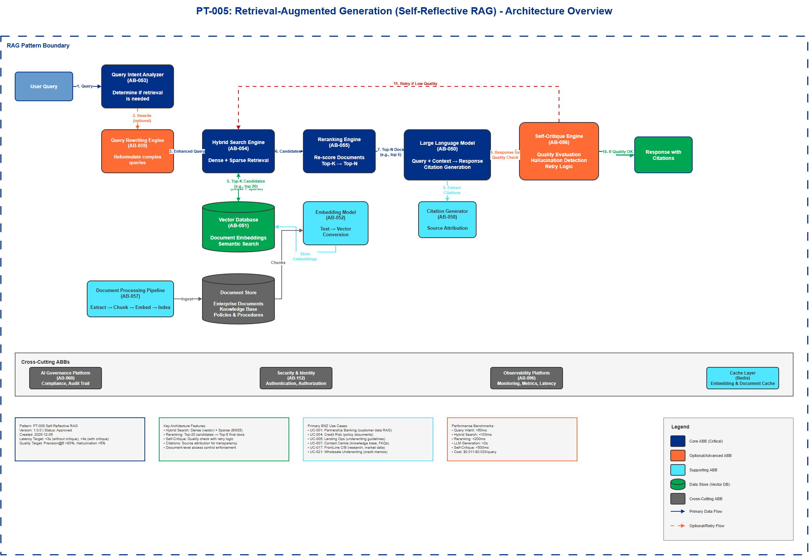

# AI Architecture Pattern Template

## Document Control

| Property | Value |
|----------|-------|
| **Pattern ID** | `PT-005` |
| **Pattern Name** | Retrieval-Augmented Generation (Self-Reflective RAG) |
| **Version** | `1.0.0` |
| **Status** | `Approved` |
| **Created Date** | `2025-12-05` |
| **Last Modified** | `2025-12-05` |
| **Owner** | BNZ Enterprise Architecture |
| **Pattern Category** | `GenAI` |
| **Maturity Level** | `Mature` |

---

## 1. Pattern Overview

### 1.1 Pattern Name and Classification

**Pattern Name**: Retrieval-Augmented Generation (Self-Reflective RAG)

**Short Name**: RAG

**Pattern Category**: GenAI

**Pattern Type**: Processing

### 1.2 Intent and Context

**Intent Statement**:
Augment LLM responses with retrieved knowledge from enterprise documents and databases to reduce hallucinations and provide up-to-date, factually grounded information.

**Problem Statement**:
Large Language Models (LLMs) are trained on static datasets with knowledge cutoff dates, leading to:
- Hallucinations (generating plausible but incorrect information)
- Inability to access enterprise-specific or proprietary knowledge
- Outdated information that doesn't reflect recent changes
- Lack of factual grounding for critical business decisions

**Context**:
RAG is applicable when:
- LLMs need access to enterprise-specific knowledge not in their training data
- Information changes frequently and LLM retraining is impractical
- Factual accuracy is critical (regulatory, compliance, customer-facing applications)
- Users need answers grounded in specific documents with citations
- Reducing hallucinations is a priority for trust and safety

**Forces**:
- **Accuracy vs. Latency**: Retrieval adds latency (100-500ms) but improves accuracy
- **Cost vs. Quality**: Higher-quality embeddings and reranking increase costs but improve relevance
- **Freshness vs. Complexity**: Real-time document indexing adds complexity but ensures up-to-date responses
- **Recall vs. Precision**: Broad retrieval (high recall) may introduce noise; narrow retrieval (high precision) may miss context
- **Explainability vs. User Experience**: Providing citations improves trust but adds response length

### 1.3 Pattern Maturity and Industry Adoption

**Maturity Level**: Mature

**Industry Adoption**:
- **Adoption Rate**: 75% of enterprises implementing GenAI in financial services use RAG (2025)
- **Reference Implementations**:
  - JPMorgan Chase: RAG for research document Q&A
  - Goldman Sachs: RAG for internal knowledge management
  - Morgan Stanley: RAG-powered advisor assistant (40,000+ documents)
- **Timeframe**: Mainstream since 2024, with 2025 enhancements including self-reflective retrieval and hybrid search

**Standards Alignment**:
- NIST AI Risk Management Framework (factual grounding, transparency)
- ISO/IEC 42001 AI Management System (quality, traceability)
- Model Risk Management SR 11-7 (explainability through source attribution)

---

## 2. Architecture Specification

### 2.1 Architecture Building Blocks (ABBs)

**Primary ABBs** (Core components required):

| ABB ID | ABB Name | Purpose in Pattern | Criticality |
|--------|----------|-------------------|-------------|
| [AB-050](../../architecture-building-blocks/abbs/AB-050/AB-050-Large-Language-Model-Service-v1.0.0.md) | Large Language Model (LLM) | Synthesize responses from query and retrieved context | Critical |
| [AB-051](../../architecture-building-blocks/abbs/AB-051/AB-051-Vector-Database-v1.0.0.md) | Vector Database | Store and retrieve document embeddings for semantic search | Critical |
| [AB-052](../../architecture-building-blocks/abbs/AB-052/AB-052-Semantic-Search-Engine-v1.0.0.md) | Embedding Model | Convert text to dense vector representations | Critical |
| [AB-053](../../architecture-building-blocks/abbs/AB-053/AB-053-Query-Intent-Analyzer-v1.0.0.md) | Query Intent Analyzer | Determine when retrieval is needed vs. direct LLM response | High |
| [AB-054](../../architecture-building-blocks/abbs/AB-054/AB-054-Hybrid-Search-Engine-v1.0.0.md) | Hybrid Search Engine | Combine dense (vector) and sparse (keyword) retrieval | Critical |
| [AB-055](../../architecture-building-blocks/abbs/AB-055/AB-055-Reranking-Engine-v1.0.0.md) | Reranking Engine | Re-score retrieved documents for relevance | High |

**Supporting ABBs** (Optional or scenario-specific):

| ABB ID | ABB Name | Purpose in Pattern | When Required |
|--------|----------|-------------------|---------------|
| [AB-056](../../architecture-building-blocks/abbs/AB-056/AB-056-Self-Critique-Engine-v1.0.0.md) | Self-Critique Engine | Evaluate response quality and trigger retry if low | When high accuracy is critical (regulatory, customer-facing) |
| [AB-057](../../architecture-building-blocks/abbs/AB-057/AB-057-Document-Processing-Pipeline-v1.0.0.md) | Document Processing Pipeline | Extract, chunk, and index documents into vector database | When enterprise documents need to be ingested |
| [AB-058](../../architecture-building-blocks/abbs/AB-058/AB-058-Citation-Generator-v1.0.0.md) | Citation Generator | Extract and format source document references | When source attribution is required (compliance, transparency) |
| [AB-059](../../architecture-building-blocks/abbs/AB-059/AB-059-Query-Rewriting-Engine-v1.0.0.md) | Query Rewriting Engine | Reformulate user queries for better retrieval | When complex or ambiguous queries are common |

**Cross-Cutting ABBs** (Always required):

| ABB ID | ABB Name | Purpose |
|--------|----------|---------|
| [AB-060](../../architecture-building-blocks/abbs/AB-060/AB-060-AI-Model-Registry-v1.0.0.md) | AI Governance Platform | Compliance, risk management, audit trail of retrieval sources |
| [AB-112](../../architecture-building-blocks/abbs/AB-112/AB-112-Data-Encryption-Service-v1.0.0.md) | Security & Identity | Authentication, authorization, data-level security for document access |
| [AB-096](../../architecture-building-blocks/abbs/AB-096/AB-096-Observability-Platform-v1.0.0.md) | Observability Platform | Monitor retrieval quality, latency, costs, hallucination rates |

### 2.2 Pattern Structure

**Architectural Diagram**:



**Component Interaction Flow**:
```
User Query → Query Intent Analyzer → [Decision: Retrieve or Direct LLM?]
  ↓ (if retrieve)
Query Rewriting (optional) → Hybrid Search Engine (Dense + Sparse)
  ↓
Vector Database → Top-K Candidate Documents (e.g., top 20)
  ↓
Reranking Engine → Top-N Final Documents (e.g., top 5)
  ↓
LLM Generator (Query + Context) → Response + Citations
  ↓
Self-Critique Engine → [Quality Check: Pass or Retry?]
  ↓ (if pass)
Response to User (with source citations)
```

**Key Interactions**:

1. **Query Intent Analysis**: User query → Query Intent Analyzer
   - Protocol: Internal function call
   - Data Format: JSON (query, intent classification)
   - Latency Target: < 50ms
   - Purpose: Determine if retrieval is needed (e.g., "What is 2+2?" doesn't need retrieval; "What is BNZ's lending policy?" does)

2. **Hybrid Search**: Query → Vector Database (dense) + Keyword Index (sparse)
   - Protocol: Vector similarity search (HNSW, IVF) + BM25 keyword search
   - Data Format: Query embedding (dense), tokenized query (sparse)
   - Latency Target: < 100ms for p95
   - Purpose: Maximize recall by combining semantic and lexical search

3. **Reranking**: Candidate documents → Reranking Engine → Final ranked documents
   - Protocol: REST API or local model inference
   - Data Format: JSON (query, document pairs)
   - Latency Target: < 200ms for p95
   - Purpose: Improve precision by re-scoring with cross-encoder model

4. **LLM Generation**: Query + Retrieved Context → LLM → Response
   - Protocol: REST API (OpenAI, Anthropic, AWS Bedrock)
   - Data Format: JSON (messages array with system, user, context)
   - Latency Target: < 2 seconds for p95
   - Purpose: Synthesize natural language response grounded in retrieved documents

5. **Self-Critique**: Generated response → Self-Critique Engine → Quality score
   - Protocol: LLM-based self-evaluation or separate quality model
   - Data Format: JSON (response, score, retry flag)
   - Latency Target: < 500ms
   - Purpose: Detect low-quality responses and trigger retry with alternative retrieval strategy

### 2.3 Data Flow

**Data Sources**:
- **Enterprise Documents**: PDFs, Word docs, SharePoint, Confluence, internal wikis (TB-scale)
- **Structured Databases**: Policy databases, product catalogs, customer data (GB-scale)
- **Real-Time Data Feeds**: Market data, news, regulatory updates (streaming)

**Data Transformations**:
1. **Document Chunking**: Large documents → 500-1000 token chunks with overlap (100-200 tokens)
   - Purpose: Fit within LLM context window, improve retrieval granularity
2. **Embedding Generation**: Text chunks → Dense vector embeddings (768-1536 dimensions)
   - Models: OpenAI Ada-002 (1536d), Cohere Embed v3 (1024d), BGE-large (1024d)
3. **Metadata Extraction**: Documents → Structured metadata (title, author, date, department, classification)
   - Purpose: Enable metadata filtering (e.g., "only retrieve from credit risk department")
4. **Index Optimization**: Embeddings → HNSW or IVF index structures
   - Purpose: Sub-linear search time (O(log n) instead of O(n))

**Data Sinks**:
- **Vector Database**: Pinecone, Weaviate, Chroma (stores embeddings and metadata)
- **Cache Layer**: Redis (stores frequently retrieved documents to reduce latency)
- **Audit Log**: Immutable log of queries, retrieved documents, and responses (compliance)

**Data Governance**:
- **Classification**: Document-level classification (Public / Internal / Confidential / Restricted)
- **Retention**: 7 years for regulatory use cases (credit, AML), 2 years for general use cases
- **Lineage**: Track query → retrieval → response chain for audit
- **Quality**: Monitor retrieval precision@k, recall@k, NDCG@k (Normalized Discounted Cumulative Gain)
- **Access Control**: Document-level permissions enforced during retrieval (users only see documents they have access to)

### 2.4 Interface Specifications

**Inbound Interfaces** (Inputs to pattern):

| Interface ID | Interface Name | Type | Protocol | Data Format | SLA |
|--------------|---------------|------|----------|-------------|-----|
| IF-IN-001 | User Query API | REST API | HTTPS | JSON (query, user_id, session_id) | p95 < 3s end-to-end |
| IF-IN-002 | Document Ingestion API | REST API | HTTPS | JSON (document, metadata) | Best effort (async) |
| IF-IN-003 | Streaming Document Feed | Message Queue | Kafka | Avro (document updates) | < 5 min ingestion latency |

**Outbound Interfaces** (Outputs from pattern):

| Interface ID | Interface Name | Type | Protocol | Data Format | SLA |
|--------------|---------------|------|----------|-------------|-----|
| IF-OUT-001 | Response API | REST API | HTTPS | JSON (response, citations, confidence) | p95 < 3s |
| IF-OUT-002 | Audit Event Stream | Event Stream | Kafka | Avro (query, documents, response) | Real-time |
| IF-OUT-003 | Metrics API | Metrics | Prometheus | Prometheus format | 1-minute resolution |

**Internal Interfaces** (Between ABBs within pattern):

| Interface ID | Source ABB | Target ABB | Protocol | Purpose |
|--------------|-----------|-----------|----------|---------|
| IF-INT-001 | Query Intent Analyzer | Hybrid Search Engine | Internal function | Pass query and retrieval decision |
| IF-INT-002 | Hybrid Search Engine | Vector Database | gRPC | Retrieve candidate documents (low latency) |
| IF-INT-003 | Hybrid Search Engine | Reranking Engine | REST API | Send candidates for reranking |
| IF-INT-004 | Reranking Engine | LLM Generator | Internal function | Pass top-N documents as context |
| IF-INT-005 | LLM Generator | Self-Critique Engine | Internal function | Pass response for quality evaluation |


## 3. Pattern Variants and Options

### 3.1 Pattern Variations

**Variant 1: Basic RAG (Baseline)**
- **When to Use**: Low-complexity use cases, proof-of-concept, cost-sensitive applications
- **Key Differences**:
  - Dense vector search only (no hybrid search)
  - No reranking
  - No self-critique
  - Single LLM (no multi-model routing)
- **Trade-offs**:
  - **Gain**: Lower cost (30-40% cheaper), simpler implementation (2-3 weeks), lower latency (< 2s)
  - **Lose**: Lower accuracy (10-15% drop in relevance), higher hallucination risk

**Variant 2: Self-Reflective RAG (Recommended - 2025)**
- **When to Use**: High-value, customer-facing, regulatory use cases requiring high accuracy
- **Key Differences**:
  - Hybrid search (dense + sparse)
  - Reranking with cross-encoder
  - Self-critique loop (retry if quality score < threshold)
  - Query rewriting for complex queries
- **Trade-offs**:
  - **Gain**: Higher accuracy (20-30% improvement), lower hallucination rate (50% reduction), better user trust
  - **Lose**: Higher cost (20-30% more expensive), higher latency (3-4s), more complex (4-6 weeks to implement)

**Variant 3: Multi-Hop RAG (Advanced)**
- **When to Use**: Complex reasoning requiring multiple retrieval steps (e.g., "Compare BNZ's lending policy to regulatory requirements")
- **Key Differences**:
  - Multiple retrieval-generation cycles (retrieve → reason → retrieve again)
  - LLM determines when additional retrieval is needed
  - Chain-of-thought reasoning
- **Trade-offs**:
  - **Gain**: Can answer complex, multi-step questions requiring multiple sources
  - **Lose**: Significantly higher latency (5-10s), much higher cost (3-5x), increased complexity

**Variant 4: Graph RAG (Microsoft GraphRAG - 2025)**
- **When to Use**: Use cases requiring entity relationship understanding, aggregation queries, or holistic reasoning (e.g., "What are the top 5 themes across all credit policies?")
- **Key Differences**:
  - Microsoft GraphRAG extracts knowledge graphs from text, builds community hierarchies, generates summaries
  - Addresses baseline RAG limitation: cannot aggregate across datasets ("What are the top themes?")
  - Combines vector search with graph traversal and community detection
- **Trade-offs**:
  - **Gain**: Superior for entity-centric queries, relationship discovery, complex reasoning requiring holistic understanding
  - **Lose**: Requires knowledge graph construction (significant upfront effort), higher compute cost
- **2025 Status**: Available on GitHub with AWS solution accelerator for code-free deployment

**Variant 5: Corrective RAG (CRAG - 2025)**
- **When to Use**: High-accuracy applications where minor inaccuracies have significant consequences (legal, medical, financial analysis)
- **Key Differences**:
  - Self-grading mechanism on retrieved documents
  - Breaks documents into "knowledge strips" and evaluates each for relevance
  - If initial retrieval fails quality thresholds, initiates additional retrieval (including web searches)
- **Trade-offs**:
  - **Gain**: Higher accuracy through self-correction, automatic fallback to additional sources
  - **Lose**: Higher latency (5-8s), more complex implementation, higher cost

**Variant 6: Agentic RAG (2025)**
- **When to Use**: Automated research, multi-source aggregation, executive decision support
- **Key Differences**:
  - Autonomous, agent-like behavior with multi-step reasoning across multiple data sources
  - Uses Document Agents for individual documents orchestrated by a meta-agent
  - Can dynamically determine when additional retrieval is needed
- **Trade-offs**:
  - **Gain**: Can answer complex, multi-step questions requiring multiple sources; autonomous research capability
  - **Lose**: Potential for compounding errors in agentic chains; enterprises approaching cautiously

### 3.2 Composition with Other Patterns

**Commonly Combined With**:

| Pattern | Integration Point | Combined Benefit |
|---------|------------------|------------------|
| PT-002: Multi-Model Routing | LLM Generator component | Route to best LLM per query type (GPT-4 for reasoning, Claude for long documents, Llama for simple Q&A) |
| PT-003: Agentic AI | RAG as a tool for agent | Agent autonomously retrieves knowledge when needed during task execution |
| PT-007: Conversational AI | RAG provides context for conversation | Maintain conversation history + retrieve relevant documents for each turn |
| PT-013: Real-Time Scoring | RAG augments feature engineering | Retrieve relevant historical data to enrich real-time features |
| PT-018: Explainability | RAG provides source attribution | Citations serve as explanations (transparency requirement) |

**Anti-Patterns** (What NOT to do):

- **Anti-Pattern 1**: Retrieve-and-Stuff Without Reranking
  - **Why Problematic**: Low-quality documents dilute LLM context, leading to hallucinations or ignoring relevant content
  - **Better Approach**: Always rerank retrieved documents before passing to LLM (use Cohere Rerank, BGE Reranker, or cross-encoder)

- **Anti-Pattern 2**: Static Chunking Without Overlap
  - **Why Problematic**: Important context split across chunks is lost (e.g., question in chunk N, answer in chunk N+1)
  - **Better Approach**: Use overlapping chunks (100-200 token overlap) or semantic chunking (split by topic boundaries)

- **Anti-Pattern 3**: No Query Intent Analysis
  - **Why Problematic**: Wastes compute on queries that don't need retrieval (e.g., "What is 2+2?"), adds unnecessary latency
  - **Better Approach**: Classify queries as "retrieval needed" vs. "direct LLM sufficient" before retrieval

- **Anti-Pattern 4**: Ignoring Document Recency
  - **Why Problematic**: LLM may use outdated information from old documents when newer versions exist
  - **Better Approach**: Boost recent documents in reranking, or filter by date metadata (e.g., "only last 6 months")

- **Anti-Pattern 5**: No Citation or Source Attribution
  - **Why Problematic**: Users cannot verify claims, violates transparency requirements for regulated industries
  - **Better Approach**: Always return citations (document title, page, excerpt) with responses

---

## 4. Implementation Guidance

### 4.1 Solution Building Blocks (SBBs)

**Recommended Technology Stack**:

| Component | Recommended SBBs | Alternatives | Selection Criteria |
|-----------|------------------|--------------|-------------------|
| **Vector Database** | Pinecone (managed) | Weaviate, Chroma, Qdrant, Milvus | Scale (TB+ → Pinecone/Weaviate), Cost (small-scale → Chroma), On-prem requirement (Weaviate/Milvus) |
| **Embedding Model** | OpenAI Ada-002, Cohere Embed v3 | BGE-large, E5-large, Instructor | Domain (general → OpenAI, financial → fine-tuned BGE), Latency (OpenAI API vs. local BGE) |
| **LLM** | OpenAI GPT-4, Anthropic Claude 3.5 | AWS Bedrock, AWS Bedrock, Llama 3 | Context window (long docs → Claude 200K), Cost (high volume → Llama), Compliance (AWS GovCloud) |
| **Reranking** | Cohere Rerank v3 | BGE Reranker, Jina Reranker v2 | Accuracy (Cohere best-in-class), Cost (local BGE), Latency (BGE local < Cohere API) |
| **Orchestration** | LangChain, LlamaIndex | Haystack, Semantic Kernel | Ecosystem (Python → LangChain, .NET → Semantic Kernel), Complexity (simple → LlamaIndex, advanced → custom) |
| **Cache** | Redis | Memcached, DynamoDB | Latency (Redis < 1ms), Persistence (Redis RDB/AOF), Cost (DynamoDB pay-per-request) |

### 4.2 Best Practices (2025)

**Retrieval Quality**:
1. **Hybrid Search**: Combine dense (vector) + sparse (BM25) retrieval for best recall (15-25% improvement vs. vector-only)
2. **Reranking**: Always rerank candidates with cross-encoder (10-20% precision improvement)
3. **Chunk Optimization**: Use 500-1000 token chunks with 100-200 token overlap
4. **Metadata Filtering**: Pre-filter by document type, date, department, classification before vector search
5. **Query Rewriting**: Rephrase ambiguous queries (e.g., "it" → entity name) before retrieval

**LLM Generation**:
6. **Structured Prompts**: Use consistent prompt template with sections: [System], [Context], [Query], [Instructions]
7. **Context Window Management**: Prioritize most relevant chunks; truncate if exceeding context limit (e.g., 8K for GPT-4)
8. **Citation Enforcement**: Instruct LLM to cite sources (e.g., "Cite document title and page number for each claim")
9. **Hallucination Detection**: Implement self-critique loop (LLM evaluates own response quality, retry if score < 0.7)

**Performance Optimization**:
10. **Caching**: Cache embeddings (don't re-embed same query), cache retrieved documents (30-50% latency reduction)
11. **Batch Processing**: Batch embed multiple chunks together (5-10x throughput improvement)
12. **Async Retrieval**: Parallelize dense and sparse search (20-30% latency reduction)
13. **Index Optimization**: Use HNSW index for < 10M vectors, IVF for > 10M vectors

**Quality Monitoring**:
14. **Precision@K**: Measure % of top-K retrieved documents that are relevant (target: > 80% for K=5)
15. **Recall@K**: Measure % of relevant documents retrieved in top-K (target: > 90% for K=20)
16. **NDCG@K**: Measure ranking quality (Normalized Discounted Cumulative Gain, target: > 0.85)
17. **Hallucination Rate**: Use LLM-as-judge to detect unsupported claims (target: < 5%)
18. **Citation Accuracy**: Verify claims match cited sources (target: > 95%)

**Security & Compliance**:
19. **Document-Level Access Control**: Enforce user permissions during retrieval (users only see authorized documents)
20. **PII Redaction**: Detect and mask PII in retrieved documents (e.g., account numbers, SSN)
21. **Audit Trail**: Log all queries, retrieved documents, and responses (immutable, 7 years for regulatory)
22. **Point-in-Time Retrieval**: Support "retrieve documents as of date X" for consistency and compliance

### 4.3 Performance Benchmarks

**Latency Targets** (p95):
- Query Intent Analysis: < 50ms
- Hybrid Search (vector + sparse): < 100ms
- Reranking (top-20 → top-5): < 200ms
- LLM Generation: < 2 seconds
- Self-Critique (optional): < 500ms
- **End-to-End**: < 3 seconds (without self-critique), < 4 seconds (with self-critique)

**Quality Targets**:
- Precision@5: > 80% (4 out of 5 retrieved docs are relevant)
- Recall@20: > 90% (capture 90% of relevant docs in top-20)
- NDCG@5: > 0.85 (ranking quality)
- Hallucination Rate: < 5% (95% of claims are grounded in retrieved sources)
- User Satisfaction: > 4.0/5.0 (based on thumbs up/down feedback)

**Cost Benchmarks** (per 1,000 queries):
- Embedding (OpenAI Ada-002): $0.01 (0.001 per query)
- Vector Search (Pinecone): $0.50 - $2.00 (depending on index size, queries/sec)
- Reranking (Cohere Rerank): $0.10 - $0.30 (depending on candidate count)
- LLM Generation (GPT-4): $10 - $30 (depending on input/output tokens)
- **Total**: $11 - $33 per 1,000 queries ($0.011 - $0.033 per query)

**Cost Optimization**:
- Caching: 30-50% cost reduction (cache hit rate 40-60% typical)
- Multi-Model Routing: 20-40% cost reduction (route simple queries to cheaper models like GPT-3.5 or Llama)
- Local Embeddings: 90%+ cost reduction (self-hosted BGE vs. OpenAI API, but requires infrastructure)

### 4.4 Deployment Architecture

**Recommended Deployment** (Kubernetes-based):

```
┌─────────────────────────────────────────────────────────────┐
│                      API Gateway (Kong/Apigee)                │
│  - Rate limiting, authentication, authorization              │
└────────────────────────┬────────────────────────────────────┘
                         │
┌────────────────────────┴────────────────────────────────────┐
│              RAG Orchestration Service (FastAPI)             │
│  - Query intent analysis, workflow orchestration            │
└─────┬──────────┬──────────┬───────────┬─────────────────────┘
      │          │          │           │
      ▼          ▼          ▼           ▼
┌──────────┐ ┌─────────┐ ┌──────────┐ ┌─────────────────────┐
│ Embedding│ │ Vector  │ │ Reranking│ │ LLM Service         │
│ Service  │ │ Database│ │ Service  │ │ (Multi-model router)│
│ (GPU)    │ │(Pinecone│ │ (Cohere) │ │ - GPT-4             │
│          │ │/Weaviate│ │          │ │ - Claude 3.5        │
└──────────┘ └─────────┘ └──────────┘ │ - Llama 3           │
                                       └─────────────────────┘
      │
      ▼
┌─────────────────────────────────────────────────────────────┐
│                  Cache Layer (Redis Cluster)                 │
│  - Embedding cache, document cache, response cache          │
└─────────────────────────────────────────────────────────────┘
```

**Scaling Guidelines**:
- **Embedding Service**: Scale horizontally with GPU instances (1 GPU per 100 queries/sec)
- **Vector Database**: Shard by document collection (e.g., separate index per department)
- **LLM Service**: Use auto-scaling based on queue depth (target: < 5 requests queued)
- **Cache**: Use Redis Cluster (3-6 nodes) for high availability and horizontal scaling

### 4.5 BNZ Use Case Mapping

**Primary Use Cases** (RAG is core pattern):

| Use Case ID | Use Case Name | RAG Application | Documents Indexed | Expected Volume |
|-------------|---------------|-----------------|-------------------|-----------------|
| [UC-001](../../../01-motivation/03-use-cases/use-cases/UC-001/index.md) | Partnership Banking | RAG over customer data, meeting notes, account plans | 100K+ documents per region | 500-1000 queries/day |
| [UC-004](../../../01-motivation/03-use-cases/use-cases/UC-004/index.md) | Credit Risk | RAG over credit policies, financial documents, regulatory guidelines | 50K+ policy documents | 200-500 queries/day |
| [UC-005](../../../01-motivation/03-use-cases/use-cases/UC-005/index.md) | Lending Ops | RAG over loan policies, underwriting guidelines, product documentation | 30K+ documents | 1000-2000 queries/day |
| [UC-007](../../../01-motivation/03-use-cases/use-cases/UC-007/index.md) | Contact Centre | RAG over product knowledge base, FAQs, policy documents | 20K+ KB articles | 5000-10K queries/day |
| [UC-017](../../../01-motivation/03-use-cases/use-cases/UC-017/index.md) | FrontLine CIB | RAG over corporate banking research, market data, client portfolios | 200K+ documents | 300-600 queries/day |
| [UC-021](../../../01-motivation/03-use-cases/use-cases/UC-021/index.md) | Wholesale Underwriting | RAG over underwriting policies, credit memos, industry reports | 100K+ documents | 100-300 queries/day |
| [UC-022](../../../01-motivation/03-use-cases/use-cases/UC-022/index.md) | Learning Content | RAG over training materials, compliance docs, product guides | 50K+ documents | 2000-5000 queries/day |

**Total Estimated Load**: 9,100-19,300 queries/day (average ~14,000/day)

**Recommended Deployment**:
- **Pilot** ([UC-007](../../../01-motivation/03-use-cases/use-cases/UC-007/index.md) Contact Centre): Single cluster, 2-4 GPU instances, Pinecone managed vector DB
- **Production** (All 7 use cases): Multi-cluster (1 per use case or shared), 10-15 GPU instances, Pinecone or Weaviate

---

## 5. References and Resources

### 5.1 Related Patterns

| Pattern ID | Pattern Name | Relationship | Reference |
|-----------|-------------|--------------|-----------|
| PT-002 | Multi-Model Routing | Used with (route to best LLM for RAG generation) | PT-002-Multi-Model-Routing-v1.0.0.md |
| PT-003 | Agentic AI | Depends on (RAG as tool for autonomous agents) | PT-003-Agentic-AI-v1.0.0.md |
| PT-007 | Conversational AI | Used with (RAG provides context for multi-turn conversations) | PT-007-Conversational-AI-v1.0.0.md |
| PT-018 | Explainability | Used with (RAG citations provide transparency) | PT-018-Explainability-v1.0.0.md |

### 5.2 Related ABBs

| ABB ID | ABB Name | Document Link |
|--------|----------|---------------|
| [AB-050](../../architecture-building-blocks/abbs/AB-050/AB-050-Large-Language-Model-Service-v1.0.0.md) | Large Language Model (LLM) | 03-building-blocks/architecture-building-blocks/AB-050-LLM.md |
| [AB-051](../../architecture-building-blocks/abbs/AB-051/AB-051-Vector-Database-v1.0.0.md) | Vector Database | 03-building-blocks/architecture-building-blocks/AB-051-Vector-Database.md |
| [AB-052](../../architecture-building-blocks/abbs/AB-052/AB-052-Semantic-Search-Engine-v1.0.0.md) | Embedding Model | 03-building-blocks/architecture-building-blocks/AB-052-Embedding-Model.md |
| [AB-060](../../architecture-building-blocks/abbs/AB-060/AB-060-AI-Model-Registry-v1.0.0.md) | AI Governance Platform | 03-building-blocks/architecture-building-blocks/AB-060-Governance-Platform.md |

### 5.3 Standards and Guidelines

- **NIST AI Risk Management Framework**: Factual grounding, transparency requirements
- **ISO/IEC 42001 AI Management System**: Quality management, traceability
- **BNZ Model Risk Management Policy**: Source attribution for Tier 1/2 models
- **BNZ Data Classification Standard**: Document-level access control enforcement
- **GDPR Article 22**: Right to explanation (citations support transparency)

### 5.4 External References

**Industry Research**:
- EdenAI (2025): "The 2025 Guide to Retrieval-Augmented Generation (RAG)" - https://www.edenai.co/post/the-2025-guide-to-retrieval-augmented-generation-rag
- arXiv (2025): "RAG Best Practices Research" - https://arxiv.org/abs/2501.07391
- McKinsey (2024): "The Economic Potential of Generative AI" - RAG reduces hallucinations by 50-70%
- Gartner (2025): "Hype Cycle for AI" - RAG positioned in "Plateau of Productivity"

**Technology Documentation**:
- LangChain RAG Guide: https://python.langchain.com/docs/use_cases/question_answering/
- LlamaIndex RAG Concepts: https://docs.llamaindex.ai/en/stable/understanding/
- Pinecone RAG Best Practices: https://www.pinecone.io/learn/retrieval-augmented-generation/
- Cohere Rerank Documentation: https://docs.cohere.com/docs/reranking

**Vendor Resources**:
- OpenAI: "How to build an AI that can answer questions about your website" (RAG tutorial)
- Anthropic: "Retrieval-Augmented Generation with Claude" (best practices)
- Microsoft: "AWS Bedrock RAG Pattern" (enterprise architecture guide)
- AWS: "Retrieval Augmented Generation with Amazon Bedrock" (reference implementation)

**Academic Papers**:
- Lewis et al. (2020): "Retrieval-Augmented Generation for Knowledge-Intensive NLP Tasks" (original RAG paper)
- Gao et al. (2023): "Retrieval-Augmented Generation for Large Language Models: A Survey"
- Asai et al. (2024): "Self-RAG: Learning to Retrieve, Generate, and Critique through Self-Reflection"

---

## 6. Diagram Templates

**Required Diagrams** (to be created using draw.io templates):

1. **[PT-005-RAG-Architecture-v1.0.0.drawio]**: High-level architecture showing ABBs and data flow
   - Components: Query Intent Analyzer, Hybrid Search, Vector Database, Reranking, LLM Generator, Self-Critique
   - Data flow: User query → retrieval → generation → critique → response
   - Color coding: BNZ Navy Blue (#003087) for core components, BNZ Orange (#FF6B35) for optional components

2. **[PT-005-RAG-Sequence-v1.0.0.drawio]**: Sequence diagram showing interaction flow
   - Actors: User, API Gateway, RAG Orchestrator, Vector DB, LLM, Cache
   - Flow: End-to-end request/response with latency annotations

3. **[PT-005-RAG-Deployment-v1.0.0.drawio]**: Deployment architecture (Kubernetes)
   - Components: API Gateway, RAG Service Pods, Vector DB, LLM Service, Redis Cache
   - Scaling: Horizontal pod autoscaling, GPU node pools

---

## Appendix A: Glossary

| Term | Definition |
|------|------------|
| **RAG** | Retrieval-Augmented Generation: Pattern for grounding LLM responses in retrieved knowledge |
| **Embedding** | Dense vector representation of text (e.g., 768-1536 dimensions) for semantic search |
| **Vector Database** | Specialized database for storing and searching high-dimensional embeddings |
| **Hybrid Search** | Combination of dense (vector) and sparse (keyword) retrieval for improved recall |
| **Reranking** | Secondary relevance scoring using cross-encoder models to improve precision |
| **Self-Critique** | LLM-based evaluation of generated responses to detect low-quality or hallucinated content |
| **Chunk** | Segment of a document (e.g., 500-1000 tokens) indexed for retrieval |
| **HNSW** | Hierarchical Navigable Small World: Graph-based algorithm for approximate nearest neighbor search |
| **NDCG** | Normalized Discounted Cumulative Gain: Metric for ranking quality |
| **Hallucination** | LLM-generated content not grounded in factual knowledge or retrieved sources |
| **Citation** | Reference to source document (title, page, excerpt) supporting a claim |
| **Context Window** | Maximum number of tokens (input + output) an LLM can process (e.g., 8K, 32K, 200K) |

---

## Appendix B: Change History

| Version | Date | Author | Changes |
|---------|------|--------|---------|
| 1.0.0 | 2025-12-05 | BNZ Enterprise Architecture | Initial version with 2025 best practices (self-reflective RAG, hybrid search, reranking) |

---

## Appendix C: Review and Approval

| Role | Name | Signature | Date |
|------|------|-----------|------|
| **Pattern Author** | BNZ Enterprise Architecture | | 2025-12-05 |
| **Enterprise Architect** | [To be assigned] | | |
| **Security Architect** | [To be assigned] | | |
| **TAF** | [To be assigned] | | |

---

## Appendix D: Implementation Checklist

**Phase 1: Foundation (Weeks 1-2)**
- [ ] Select vector database (Pinecone, Weaviate, Chroma)
- [ ] Select embedding model (OpenAI Ada-002, Cohere Embed v3, BGE-large)
- [ ] Select LLM (GPT-4, Claude 3.5, multi-model routing)
- [ ] Set up development environment (Python, LangChain/LlamaIndex)
- [ ] Ingest initial document corpus (chunking, embedding, indexing)

**Phase 2: Basic RAG (Weeks 3-4)**
- [ ] Implement vector search (dense embeddings only)
- [ ] Implement LLM generation (query + context → response)
- [ ] Add citation generation (extract source references)
- [ ] Implement caching (embedding cache, document cache)
- [ ] Basic monitoring (latency, cost, throughput)

**Phase 3: Enhanced RAG (Weeks 5-6)**
- [ ] Add hybrid search (dense + sparse/BM25)
- [ ] Add reranking (Cohere Rerank or BGE Reranker)
- [ ] Implement query intent analysis (decide when to retrieve)
- [ ] Add metadata filtering (date, department, classification)
- [ ] Quality monitoring (precision@k, recall@k, NDCG@k)

**Phase 4: Self-Reflective RAG (Weeks 7-8)**
- [ ] Implement self-critique loop (quality scoring, retry logic)
- [ ] Add query rewriting (clarify ambiguous queries)
- [ ] Hallucination detection (LLM-as-judge)
- [ ] A/B testing framework (compare variants)
- [ ] User feedback collection (thumbs up/down, ratings)

**Phase 5: Production Hardening (Weeks 9-10)**
- [ ] Implement document-level access control
- [ ] Add PII detection and masking
- [ ] Set up audit logging (queries, documents, responses)
- [ ] Performance optimization (batching, async retrieval)
- [ ] Disaster recovery and backup (vector DB snapshots)
- [ ] Load testing (target: 100-500 queries/sec)
- [ ] Security review and penetration testing

**Phase 6: Integration & Launch (Weeks 11-12)**
- [ ] Integrate with AI Governance Platform ([AB-060](../../architecture-building-blocks/abbs/AB-060/AB-060-AI-Model-Registry-v1.0.0.md))
- [ ] Integrate with Observability Platform ([AB-096](../../architecture-building-blocks/abbs/AB-096/AB-096-Observability-Platform-v1.0.0.md))
- [ ] Integrate with enterprise authentication (SSO)
- [ ] User acceptance testing (UAT) with pilot users
- [ ] Documentation (user guide, API reference, runbook)
- [ ] Training for support team
- [ ] Production launch with monitoring

**Total Timeline**: 12 weeks (3 months) for full Self-Reflective RAG implementation

---

## Appendix E: Cost Estimation Template

**Assumptions**:
- Query volume: [INSERT] queries/day
- Average query length: 50 tokens
- Average context length: 3,000 tokens (5 chunks × 600 tokens)
- Average response length: 200 tokens
- Cache hit rate: 40%

**Monthly Cost Breakdown**:

| Component | Unit Cost | Volume (after cache) | Monthly Cost |
|-----------|-----------|---------------------|--------------|
| Embedding (OpenAI Ada-002) | $0.0001/1K tokens | [X] queries × 50 tokens × 60% (cache miss) | $[Y] |
| Vector Search (Pinecone) | $70/month (starter) or $0.0002/query | [X] queries × 60% (cache miss) | $[Y] |
| Reranking (Cohere) | $0.002/search | [X] queries × 60% (cache miss) | $[Y] |
| LLM (GPT-4) | $0.03/1K input + $0.06/1K output | [X] queries × (3,000 input + 200 output) | $[Y] |
| Cache (Redis) | $50/month (managed) | Fixed | $50 |
| Observability | $100/month | Fixed | $100 |
| **Total** | | | **$[TOTAL]** |

**Cost Optimization Levers**:
- Increase cache hit rate (40% → 60%): 33% cost reduction
- Multi-model routing (GPT-4 → GPT-3.5 for simple queries): 20-40% cost reduction
- Local embeddings (OpenAI → self-hosted BGE): 90%+ embedding cost reduction
- Batch processing (non-urgent queries): 20-30% cost reduction

---

**End of Document**
