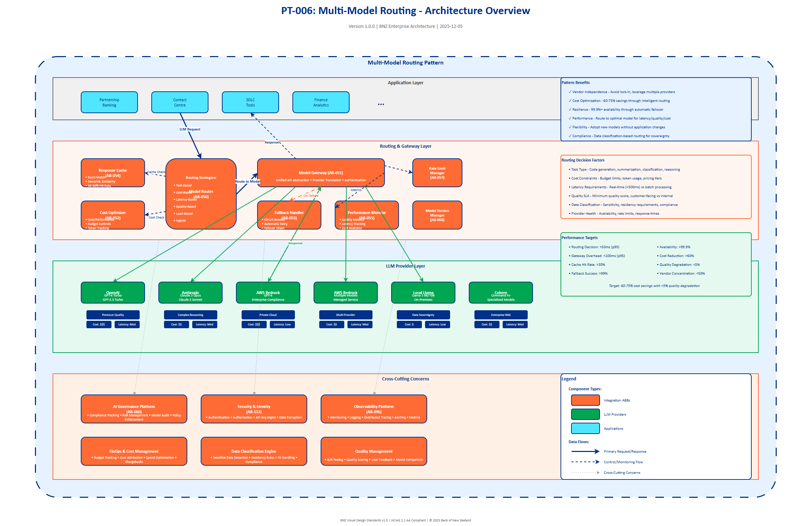

# AI Architecture Pattern: Multi-Model Routing

## Document Control

| Property | Value |
|----------|-------|
| **Pattern ID** | `PT-006` |
| **Pattern Name** | Multi-Model Routing |
| **Version** | `1.0.0` |
| **Status** | `Approved` |
| **Created Date** | `2025-12-05` |
| **Last Modified** | `2025-12-05` |
| **Owner** | BNZ Enterprise Architecture |
| **Pattern Category** | `GenAI` |
| **Maturity Level** | `Emerging` |

---

## 1. Pattern Overview

### 1.1 Pattern Name and Classification

**Pattern Name**: Multi-Model Routing (NEW - 2025)

**Short Name**: Multi-Model Router

**Pattern Category**: GenAI

**Pattern Type**: Integration, Orchestration, Optimization

### 1.2 Intent and Context

**Intent Statement**:
Intelligently route AI requests to the optimal Large Language Model (LLM) for each specific task, avoiding vendor lock-in while optimizing for cost, performance, and quality.

**Problem Statement**:
Organizations deploying GenAI at scale face several critical challenges:
- Vendor lock-in risk when dependent on a single LLM provider
- Suboptimal cost management when using premium models for all tasks
- Performance bottlenecks when models are unavailable or rate-limited
- Inability to leverage specialized models for specific task types
- Difficulty balancing quality requirements against cost and latency constraints

**Context**:
Multi-Model Routing is applicable in enterprise GenAI deployments where:
- Multiple LLM providers are available (OpenAI, Anthropic, AWS Bedrock, AWS Bedrock, local models)
- Different use cases have varying quality, latency, and cost requirements
- High request volumes make cost optimization critical
- Business continuity requires resilience against single provider failures
- Applications need to leverage specialized models for specific tasks (e.g., code generation vs. summarization)

**Forces**:
- **Vendor Independence vs. Simplicity**: Single-vendor solutions are simpler but create lock-in; multi-vendor requires orchestration complexity
- **Cost Optimization vs. Quality**: Cheaper models reduce costs but may compromise output quality
- **Latency vs. Quality**: Faster models (smaller, local) may produce lower quality results than slower premium models
- **Flexibility vs. Standardization**: Supporting multiple models enables optimization but complicates interface standardization
- **Resilience vs. Complexity**: Failover routing increases availability but adds operational complexity

### 1.3 Pattern Maturity and Industry Adoption

**Maturity Level**: Emerging

**Industry Adoption**:
- **Adoption Rate**: Rapidly growing in 2025; estimated 25-35% of enterprises with GenAI implementations
- **Reference Implementations**:
  - Shopify (LiteLLM for multi-provider routing)
  - DoorDash (internal routing framework for cost optimization)
  - Morgan Stanley (multi-model strategy for different financial use cases)
- **Timeframe**: Emerging mainstream in 2025; expected to become standard practice by 2026-2027

**Standards Alignment**:
- OpenAI API standard (de facto for LLM interfaces)
- Cloud Native Computing Foundation (CNCF) observability standards
- FinOps Foundation cost optimization principles
- ISO/IEC 42001 AI Management System (risk and governance)

---

## 2. Architecture Specification

### 2.1 Architecture Building Blocks (ABBs)

**Primary ABBs** (Core components required):

| ABB ID | ABB Name | Purpose in Pattern | Criticality |
|--------|----------|-------------------|-------------|
| [AB-050](../../architecture-building-blocks/abbs/AB-050/AB-050-Large-Language-Model-Service-v1.0.0.md) | Model Router | Decision engine that selects optimal model for each request based on routing policies | Critical |
| [AB-051](../../architecture-building-blocks/abbs/AB-051/AB-051-Vector-Database-v1.0.0.md) | Model Gateway | Unified API abstraction layer across multiple LLM providers | Critical |
| [AB-052](../../architecture-building-blocks/abbs/AB-052/AB-052-Semantic-Search-Engine-v1.0.0.md) | Cost Optimizer | Analyzes and routes requests based on cost/performance/latency trade-offs | High |
| [AB-053](../../architecture-building-blocks/abbs/AB-053/AB-053-Query-Intent-Analyzer-v1.0.0.md) | Fallback Handler | Manages automatic failover when primary model is unavailable or rate-limited | High |
| [AB-054](../../architecture-building-blocks/abbs/AB-054/AB-054-Hybrid-Search-Engine-v1.0.0.md) | Response Cache | Caches responses to reduce duplicate LLM calls (30-50% cost savings) | High |

**Supporting ABBs** (Optional or scenario-specific):

| ABB ID | ABB Name | Purpose in Pattern | When Required |
|--------|----------|-------------------|---------------|
| [AB-055](../../architecture-building-blocks/abbs/AB-055/AB-055-Reranking-Engine-v1.0.0.md) | Reranking Engine | Reranks search results for relevance | Production deployments |
| [AB-056](../../architecture-building-blocks/abbs/AB-056/AB-056-Self-Critique-Engine-v1.0.0.md) | Self Critique Engine | LLM self-evaluation and refinement | Quality optimization scenarios |
| [AB-057](../../architecture-building-blocks/abbs/AB-057/AB-057-Document-Processing-Pipeline-v1.0.0.md) | Document Processing Pipeline | Processes documents for RAG ingestion | High-volume applications |
| [AB-058](../../architecture-building-blocks/abbs/AB-058/AB-058-Citation-Generator-v1.0.0.md) | Citation Generator | Generates citations for LLM responses | Enterprise deployments with change control |
| [AB-109](../../architecture-building-blocks/abbs/AB-109/AB-109-Cost-Based-Router-v1.0.0.md) | Cost Based Router | Routes requests based on cost optimization strategies | Cost-sensitive deployments |
| [AB-110](../../architecture-building-blocks/abbs/AB-110/AB-110-Latency-Based-Router-v1.0.0.md) | Latency Based Router | Routes requests based on latency requirements | Real-time applications |
| [AB-111](../../architecture-building-blocks/abbs/AB-111/AB-111-Capability-Based-Router-v1.0.0.md) | Capability Based Router | Routes requests based on model capabilities | Multi-task scenarios |

**Cross-Cutting ABBs** (Always required):

| ABB ID | ABB Name | Purpose |
|--------|----------|---------|
| [AB-060](../../architecture-building-blocks/abbs/AB-060/AB-060-AI-Model-Registry-v1.0.0.md) | AI Governance Platform | Compliance tracking, risk management, model usage audit |
| [AB-112](../../architecture-building-blocks/abbs/AB-112/AB-112-Data-Encryption-Service-v1.0.0.md) | Security & Identity | Authentication, authorization, API key management, data encryption |
| [AB-096](../../architecture-building-blocks/abbs/AB-096/AB-096-Observability-Platform-v1.0.0.md) | Observability Platform | Monitoring, logging, distributed tracing, alerting |

### 2.2 Pattern Structure

**Architectural Diagram**:



**Component Interaction Flow**:
```
Application Request → [Model Router] → Routing Decision Engine
    ↓                       ↓
[Response Cache Check]  [Routing Policies: Task/Cost/Latency/Quality]
    ↓                       ↓
[Cache Hit: Return]   [Model Gateway] → [Provider Selection]
    ↓                       ↓
                    [OpenAI GPT-4 | Anthropic Claude | AWS Bedrock | Local Llama | Cohere]
                            ↓
                    [Fallback Handler] (if primary fails)
                            ↓
                    [Performance Monitor] → Metrics Collection
                            ↓
                    [Response Aggregator] → [Cache Store] → Application Response
```

**Key Interactions**:

1. **Request Ingestion and Cache Check**: Application sends request to Model Router
   - Protocol: REST API (OpenAI-compatible interface)
   - Data Format: JSON with prompt, parameters, metadata
   - Latency Target: < 50ms for routing decision
   - Cache Check: Semantic similarity check against cached responses

2. **Routing Decision**: Model Router evaluates routing policies
   - Processing Type: Synchronous (real-time decision)
   - Decision Factors: Task type, cost constraints, latency requirements, quality SLA
   - Policy Evaluation: Rule-based or ML-based routing
   - Error Handling: Fallback to default model if routing fails

3. **Model Gateway Invocation**: Gateway translates request to provider-specific format
   - Protocol: Provider-specific APIs (REST, gRPC)
   - Transformation: Normalize request format, handle provider-specific parameters
   - Authentication: Manage provider API keys securely
   - Latency Target: < 100ms overhead for gateway translation

4. **LLM Provider Execution**: Request sent to selected LLM provider
   - Processing Type: Asynchronous (streaming or batch)
   - Timeout Handling: Configurable per provider (typically 30-60 seconds)
   - Error Handling: Circuit breaker pattern, automatic failover

5. **Fallback Orchestration**: Automatic retry with alternative model on failure
   - Trigger Conditions: Timeout, rate limit, model unavailability, error responses
   - Fallback Chain: Primary → Secondary → Tertiary model options
   - Retry Logic: Exponential backoff, maximum retry attempts (typically 3)

6. **Response Aggregation and Caching**: Process and store response
   - Delivery Mechanism: Streaming or complete response based on client preference
   - Cache Storage: Semantic embedding-based cache with TTL (time-to-live)
   - Performance Metrics: Log latency, cost, quality score for feedback loop

### 2.3 Data Flow

**Data Sources**:
- **User Requests**: Natural language prompts, structured queries, chat conversations
  - Format: JSON with prompt text, system instructions, parameters
  - Volume: Varies by use case (100s to 10,000s requests/day)
- **Routing Policies**: Configuration rules defining model selection criteria
  - Format: YAML or JSON configuration files
  - Volume: Static configuration, updated periodically
- **Model Performance Metrics**: Historical quality, latency, cost data per model
  - Format: Time-series metrics (Prometheus, CloudWatch)
  - Volume: Continuous streaming data

**Data Transformations**:

1. **Request Normalization**: Convert application-specific request format to standardized internal format
   - Input: Application JSON → Output: Normalized prompt structure
   - Processing: Extract prompt, parameters, metadata; validate schema

2. **Routing Policy Evaluation**: Apply business rules and ML models to select optimal provider
   - Input: Normalized request + routing policies + performance metrics
   - Output: Selected model provider, fallback options, expected cost/latency

3. **Provider-Specific Transformation**: Translate standardized request to provider API format
   - Input: Normalized request → Output: Provider-specific payload (OpenAI, Anthropic, etc.)
   - Processing: Map parameters, handle provider-specific features (e.g., Claude's system prompts)

4. **Response Normalization**: Standardize provider responses to unified format
   - Input: Provider-specific response → Output: Standardized response format
   - Processing: Extract generated text, token counts, metadata; normalize error codes

**Data Sinks**:
- **Application Response**: Final LLM output delivered to requesting application
  - Format: JSON with generated text, metadata, cost/latency metrics
  - Retention: Ephemeral (no storage at gateway layer)
- **Response Cache**: Semantic cache for duplicate request detection
  - Format: Vector embeddings (prompt) + cached response
  - Retention: TTL-based (typically 24-72 hours)
- **Metrics Store**: Performance and cost tracking
  - Format: Time-series metrics (Prometheus, CloudWatch, Datadog)
  - Retention: 90 days detailed metrics, 1+ year aggregated metrics
- **Audit Logs**: Governance and compliance records
  - Format: Structured logs (JSON)
  - Retention: 7+ years per regulatory requirements

**Data Governance**:
- **Classification**: Internal (routing decisions) to Restricted (user prompts with sensitive data)
- **Retention**: Ephemeral for prompts (no persistent storage unless explicitly required), long-term for audit logs
- **Lineage**: Track request → routing decision → model selection → response path
- **Quality**: Validate request schemas, monitor response quality metrics, detect anomalies

### 2.4 Interface Specifications

**Inbound Interfaces** (Inputs to pattern):

| Interface ID | Interface Name | Type | Protocol | Data Format | SLA |
|--------------|---------------|------|----------|-------------|-----|
| IF-IN-001 | Application LLM Request | Synchronous API | REST (OpenAI-compatible) | JSON | < 50ms routing overhead |
| IF-IN-002 | Streaming Request | Streaming API | Server-Sent Events (SSE) | JSON stream | < 100ms first token |
| IF-IN-003 | Batch Request | Asynchronous API | REST | JSON array | Process within 1 hour |
| IF-IN-004 | Routing Policy Update | Configuration API | REST | YAML/JSON | Near real-time (< 5 min) |

**Outbound Interfaces** (Outputs from pattern):

| Interface ID | Interface Name | Type | Protocol | Data Format | SLA |
|--------------|---------------|------|----------|-------------|-----|
| IF-OUT-001 | LLM Response | Synchronous API | REST | JSON | < 30s total (model + overhead) |
| IF-OUT-002 | Streaming Response | Streaming API | Server-Sent Events (SSE) | JSON stream | < 100ms first token |
| IF-OUT-003 | Performance Metrics | Event Stream | Kafka/EventBridge | JSON | Real-time (< 1s) |
| IF-OUT-004 | Audit Events | Event Stream | Kafka/EventBridge | JSON | Real-time (< 1s) |

**Internal Interfaces** (Between ABBs within pattern):

| Interface ID | Source ABB | Target ABB | Protocol | Purpose |
|--------------|-----------|-----------|----------|---------|
| IF-INT-001 | Model Router | Response Cache | In-process / Redis | Cache lookup and storage |
| IF-INT-002 | Model Router | Model Gateway | gRPC / REST | Model invocation request |
| IF-INT-003 | Model Gateway | LLM Providers | REST / Provider SDK | Provider-specific API calls |
| IF-INT-004 | Model Gateway | Fallback Handler | In-process | Failure notification and retry |
| IF-INT-005 | All Components | Performance Monitor | StatsD / OpenTelemetry | Metrics emission |
| IF-INT-006 | Model Router | Cost Optimizer | In-process | Cost estimation and budget checking |

---

## 3. Implementation Specification

### 3.1 Technology Stack

**Routing Frameworks**:
- **LiteLLM** (Recommended): Open-source, unified interface to 100+ LLMs, built-in load balancing and fallbacks
- **RouteLLM**: ML-based routing framework optimizing for quality and cost
- **Portkey**: Enterprise routing gateway with observability and governance features

**Model Gateway**:
- **LangChain**: Popular framework with extensive provider integrations
- **LlamaIndex**: Optimized for RAG patterns with built-in routing
- **Semantic Kernel**: Microsoft's enterprise SDK with multi-provider support

**Observability**:
- **Langfuse**: Open-source LLM observability with prompt management and tracing
- **LangSmith**: LangChain's commercial observability platform
- **Arize Phoenix**: ML observability with LLM-specific features

**Caching**:
- **Redis**: In-memory cache for exact-match caching
- **GPTCache**: Semantic caching using embedding similarity
- **Momento**: Serverless cache service optimized for LLM workloads

### 3.2 Routing Strategies

| Strategy | Description | Example Use Case | Implementation |
|----------|-------------|------------------|----------------|
| **Task-Based** | Route by task type or domain | GPT-4 for code generation, Claude for complex reasoning, Llama for simple classification | Rule-based mapping: task_type → model |
| **Cost-Based** | Route by cost optimization, use cheaper models when acceptable | Llama for dev/test environments, GPT-4 for production critical requests | Cost threshold rules: cost_limit → model tier |
| **Latency-Based** | Route by speed requirements | Local model for real-time (< 500ms), cloud for batch processing | Latency SLA: response_time → model selection |
| **Quality-Based** | Route by required accuracy or output quality | Best-in-class model for customer-facing, good-enough for internal tools | Quality score threshold: min_quality → model |
| **Load-Based** | Route based on provider availability and rate limits | Distribute across providers to avoid rate limiting | Round-robin with health checks |
| **Hybrid** | Combine multiple strategies with weighted priorities | Cost-optimized routing with quality floor and latency ceiling | Multi-criteria decision matrix |

### 3.3 Example Configuration

**Routing Rules (YAML)**:
```yaml
routing_rules:
  # Task-based routing
  - name: code_generation
    conditions:
      task_type: code_generation
    models:
      primary: gpt-4-turbo
      fallback: claude-3-opus
    max_cost_per_request: 0.10

  - name: summarization
    conditions:
      task_type: summarization
    models:
      primary: claude-3-sonnet
      fallback: gpt-3.5-turbo
    max_latency_ms: 3000

  - name: classification
    conditions:
      task_type: classification
      environment: production
    models:
      primary: llama-3-8b  # Local deployment
      fallback: gpt-3.5-turbo
    max_latency_ms: 500

  # Cost-based routing
  - name: development_default
    conditions:
      environment: dev
    models:
      primary: gpt-3.5-turbo
      fallback: llama-3-8b
    max_cost_per_request: 0.01

  # Quality-based routing
  - name: customer_facing
    conditions:
      customer_facing: true
    models:
      primary: gpt-4-turbo
      fallback: claude-3-opus
    min_quality_score: 0.95

  # Default fallback
  - name: default
    models:
      primary: gpt-3.5-turbo
      fallback: claude-3-haiku
```

**Provider Configuration**:
```yaml
providers:
  - name: openai
    type: openai
    api_key: ${OPENAI_API_KEY}
    base_url: https://api.openai.com/v1
    models:
      - gpt-4-turbo
      - gpt-3.5-turbo
    rate_limits:
      requests_per_minute: 3500
      tokens_per_minute: 90000
    timeout_seconds: 60
    retry_attempts: 3

  - name: anthropic
    type: anthropic
    api_key: ${ANTHROPIC_API_KEY}
    base_url: https://api.anthropic.com
    models:
      - claude-3-opus
      - claude-3-sonnet
      - claude-3-haiku
    rate_limits:
      requests_per_minute: 4000
      tokens_per_minute: 400000
    timeout_seconds: 60
    retry_attempts: 3

  - name: local_llama
    type: openai  # OpenAI-compatible API
    base_url: http://localhost:8000/v1
    models:
      - llama-3-8b
      - llama-3-70b
    timeout_seconds: 30

  - name: azure_openai
    type: azure_openai
    api_key: ${AZURE_OPENAI_API_KEY}
    endpoint: ${AZURE_OPENAI_ENDPOINT}
    api_version: 2024-08-01
    deployment_name: gpt-4-turbo
    timeout_seconds: 60
```

**Caching Configuration**:
```yaml
caching:
  enabled: true
  backend: redis
  redis_url: redis://localhost:6379/0

  # Exact match caching
  exact_match:
    enabled: true
    ttl_seconds: 3600  # 1 hour

  # Semantic similarity caching
  semantic_cache:
    enabled: true
    similarity_threshold: 0.95  # 95% similarity = cache hit
    embedding_model: text-embedding-3-small
    ttl_seconds: 86400  # 24 hours

  # Cache bypass rules
  bypass_rules:
    - condition: cache_control == "no-cache"
    - condition: temperature > 0.7  # High creativity requests
```

### 3.4 Best Practices (2025)

**Model Selection**:
1. **Start Small, Expand Gradually**: Begin with 2-3 models (e.g., GPT-4, Claude, local Llama), expand based on measured needs
2. **Establish Baselines**: Measure quality, cost, latency for each model on representative tasks before production routing
3. **Local Models for Volume**: Deploy local models (Llama, Mistral) for high-volume, non-sensitive tasks to reduce costs

**Cost Optimization**:
4. **Implement Aggressive Caching**: Semantic caching typically achieves 30-50% cost savings on production workloads
5. **Token Budget Management**: Set per-user, per-application token budgets to prevent runaway costs
6. **Prompt Optimization**: Shorter, optimized prompts reduce costs; invest in prompt engineering
7. **Model Tiering**: Reserve premium models (GPT-4, Claude Opus) for tasks requiring highest quality

**Quality Management**:
8. **Quality Metrics**: Track task-specific quality scores (user feedback, accuracy metrics, human evaluation)
9. **A/B Testing**: Continuously test model alternatives to identify quality/cost improvements
10. **Model Version Pinning**: Pin critical applications to specific model versions to avoid regression from provider updates

**Resilience**:
11. **Circuit Breakers**: Implement circuit breaker pattern for each provider to fail fast and route around issues
12. **Fallback Chains**: Configure 2-3 fallback options for each routing rule
13. **Rate Limit Awareness**: Track provider rate limits and proactively route around approaching limits
14. **Multi-Region Deployment**: Use multiple provider regions (e.g., AWS Bedrock in multiple AWS regions) for geographic resilience

**Observability**:
15. **Comprehensive Tracing**: Implement distributed tracing (OpenTelemetry) across routing, gateway, and provider calls
16. **Cost Attribution**: Tag requests with business context (use case, user, department) for cost allocation
17. **Prompt Analytics**: Monitor prompt patterns to identify optimization opportunities and potential security issues

### 3.5 Performance Targets

| Metric | Target | Measurement Method |
|--------|--------|-------------------|
| Routing Decision Latency | < 50ms (p95) | Time from request receipt to model selection |
| Gateway Translation Overhead | < 100ms (p95) | Additional latency from gateway vs. direct provider call |
| Cache Hit Rate | > 30% | (Cached responses / Total requests) × 100% |
| Fallback Success Rate | > 99% | Successful fallback / Total fallback attempts |
| Cost Reduction vs. Single Model | > 25% | (Routed cost vs. all-GPT-4 baseline) |
| Quality Degradation | < 5% | Quality score delta vs. best-model baseline |

---

## 4. Pattern Variants and Options

### 4.1 Pattern Variations

**Variant 1: Cost-Optimized Routing**
- **When to Use**: High-volume applications where cost is primary concern (e.g., internal tooling, development environments)
- **Key Differences**:
  - Prioritizes cheapest model that meets minimum quality threshold
  - Aggressive use of local models and smaller cloud models
  - Caching optimized for maximum hit rate
- **Trade-offs**:
  - **Gain**: 40-60% cost reduction vs. premium-model-only approach
  - **Lose**: Potential 5-10% quality degradation on complex tasks

**Variant 2: Quality-First Routing**
- **When to Use**: Customer-facing applications where quality is paramount (e.g., customer service chatbots, financial advice)
- **Key Differences**:
  - Always route to best-available model for task type
  - Fallback to equivalent-quality alternative, not cheaper option
  - Minimal caching to ensure fresh, high-quality responses
- **Trade-offs**:
  - **Gain**: Maximum quality, brand protection
  - **Lose**: 2-3x higher costs vs. cost-optimized approach

**Variant 3: Latency-Optimized Routing**
- **When to Use**: Real-time applications requiring sub-second responses (e.g., live chat, code autocomplete)
- **Key Differences**:
  - Prioritizes local models and smaller, faster cloud models
  - Streaming responses preferred over batch
  - Aggressive pre-warming and connection pooling
- **Trade-offs**:
  - **Gain**: Sub-500ms response times
  - **Lose**: Quality trade-off for complex reasoning tasks

**Variant 4: Hybrid On-Prem/Cloud Routing**
- **When to Use**: Regulated environments with data residency requirements (e.g., financial services, healthcare)
- **Key Differences**:
  - Sensitive data routed exclusively to on-premises or private cloud models
  - Non-sensitive tasks routed to cost-effective cloud providers
  - Data classification engine determines routing
- **Trade-offs**:
  - **Gain**: Data compliance, sovereignty
  - **Lose**: Complexity of data classification, reduced model options for sensitive tasks

### 4.2 Composition with Other Patterns

**Commonly Combined With**:

| Pattern | Integration Point | Combined Benefit |
|---------|------------------|------------------|
| PT-001: Retrieval-Augmented Generation (RAG) | Model Router receives RAG-augmented prompts; routes based on retrieval complexity | Optimize model selection based on whether simple lookup vs. complex reasoning required |
| PT-002: Agent Orchestration | Agent framework uses Multi-Model Router to select appropriate model for each agent task | Cost-efficient multi-agent systems with task-appropriate model assignment |
| PT-003: Prompt Flow Pipeline | Prompt pipeline stages route to different models; final synthesis uses premium model | Staged processing with cost optimization at each stage |
| PT-004: Fine-Tuned Model Management | Router includes fine-tuned models as routing options for specialized tasks | Leverage domain-specific models while maintaining general-purpose fallbacks |
| PT-007: Model Monitoring & Observability | Observability metrics feed back into routing decisions (quality-based routing) | Continuous routing optimization based on real-world performance |

### 4.3 Anti-Patterns (What NOT to Do)

**Anti-Pattern 1: Single-Vendor Lock-In**
- **Description**: Using only one LLM provider (e.g., OpenAI-only or AWS-only) without abstraction layer
- **Why Problematic**:
  - Vendor pricing changes directly impact costs with no alternatives
  - Provider outages cause complete application failure
  - Unable to leverage specialized models from other providers
- **Better Approach**: Implement Model Gateway abstraction from day one, even if starting with single provider

**Anti-Pattern 2: Over-Engineered Routing Logic**
- **Description**: Implementing complex ML-based routing models before understanding baseline metrics
- **Why Problematic**:
  - Premature optimization without data
  - Adds complexity and latency to routing decisions
  - Difficult to debug and explain routing choices
- **Better Approach**: Start with simple rule-based routing (task-type mapping), measure performance, iterate

**Anti-Pattern 3: Ignoring Provider-Specific Features**
- **Description**: Forcing complete API homogenization, losing provider-specific capabilities (e.g., Claude's system prompts, GPT-4's vision)
- **Why Problematic**:
  - Unable to leverage unique provider strengths
  - Forces lowest-common-denominator API design
- **Better Approach**: Support provider-specific extensions in gateway while maintaining baseline compatibility

**Anti-Pattern 4: Stateless Routing Without Context**
- **Description**: Routing each request independently without considering conversation history or user context
- **Why Problematic**:
  - Model switches mid-conversation create inconsistent user experience
  - Loss of conversation context if models don't share state
- **Better Approach**: Session-aware routing that maintains model consistency within conversations

**Anti-Pattern 5: No Cost Guardrails**
- **Description**: Implementing routing without token budgets, cost limits, or monitoring
- **Why Problematic**:
  - Runaway costs from high-volume or abusive usage
  - Inability to predict or control GenAI spend
- **Better Approach**: Implement cost budgets per user/application, circuit breakers at spend thresholds, real-time cost tracking

---

## 5. BNZ Use Case Mapping

### 5.1 Applicable Use Cases

Multi-Model Routing is applicable to **ALL GenAI use cases** at BNZ to avoid vendor lock-in and optimize cost/performance:

| Use Case ID | Use Case Name | Routing Strategy | Model Recommendation |
|-------------|---------------|------------------|----------------------|
| **[UC-001](../../../01-motivation/03-use-cases/use-cases/UC-001/index.md)** | Partnership Banking (Frontline) | Quality-First | GPT-4 Turbo (customer-facing), Claude Sonnet (internal analysis) |
| **[UC-002](../../../01-motivation/03-use-cases/use-cases/UC-002/index.md)** | Finance - Reporting & Analysis | Cost-Optimized | Claude Sonnet (report generation), GPT-3.5 (simple queries) |
| **[UC-005](../../../01-motivation/03-use-cases/use-cases/UC-005/index.md)** | Lending Ops - Document Processing | Task-Based | GPT-4 Vision (document extraction), Llama 3 (classification) |
| **[UC-006](../../../01-motivation/03-use-cases/use-cases/UC-006/index.md)** | Hyper-Personalization | Latency-Optimized | Local Llama (real-time recommendations), GPT-4 (strategy generation) |
| **[UC-007](../../../01-motivation/03-use-cases/use-cases/UC-007/index.md)** | Contact Centre - Virtual Agent | Hybrid | GPT-4 Turbo (complex inquiries), GPT-3.5 (FAQs), local model (intent classification) |
| **[UC-010](../../../01-motivation/03-use-cases/use-cases/UC-010/index.md)** | SDLC - Code Generation | Task-Based | GPT-4 Turbo (code generation), Claude Opus (code review), Llama 3 (documentation) |
| **[UC-017](../../../01-motivation/03-use-cases/use-cases/UC-017/index.md)** | Frontline CIB | Quality-First | GPT-4 Turbo (deal analysis), Claude Opus (risk assessment) |
| **[UC-018](../../../01-motivation/03-use-cases/use-cases/UC-018/index.md)** | Procurement - Contract Analysis | Task-Based | Claude Opus (contract review), GPT-3.5 (simple extraction) |
| **[UC-022](../../../01-motivation/03-use-cases/use-cases/UC-022/index.md)** | Learning Content Production | Cost-Optimized | Claude Sonnet (content generation), GPT-3.5 (editing), Llama 3 (metadata) |
| **[UC-024](../../../01-motivation/03-use-cases/use-cases/UC-024/index.md)** | Front-End App Personalization | Latency-Optimized | Local Llama (UI recommendations), GPT-4 (strategy) |

### 5.2 Implementation Priority

**Phase 1 (Immediate - Q1 2025)**:
- [UC-007](../../../01-motivation/03-use-cases/use-cases/UC-007/index.md) (Contact Centre): Highest volume, immediate cost savings opportunity
- [UC-010](../../../01-motivation/03-use-cases/use-cases/UC-010/index.md) (SDLC): Developer productivity, clear task-type routing (code vs. docs)

**Phase 2 (Near-term - Q2 2025)**:
- [UC-001](../../../01-motivation/03-use-cases/use-cases/UC-001/index.md), [UC-017](../../../01-motivation/03-use-cases/use-cases/UC-017/index.md) (Frontline Banking): Customer-facing quality requirements
- [UC-006](../../../01-motivation/03-use-cases/use-cases/UC-006/index.md), [UC-024](../../../01-motivation/03-use-cases/use-cases/UC-024/index.md) (Personalization): Latency-sensitive, high volume

**Phase 3 (Medium-term - Q3-Q4 2025)**:
- [UC-002](../../../01-motivation/03-use-cases/use-cases/UC-002/index.md), [UC-018](../../../01-motivation/03-use-cases/use-cases/UC-018/index.md), [UC-022](../../../01-motivation/03-use-cases/use-cases/UC-022/index.md) (Back-office): Cost optimization for internal processes
- [UC-005](../../../01-motivation/03-use-cases/use-cases/UC-005/index.md) (Lending Ops): Specialized document processing routing

---

## 6. Governance and Compliance

### 6.1 Regulatory Considerations

**Data Residency**:
- Different models may be hosted in different geographic regions
- Routing must respect data residency requirements (e.g., NZ/Australia data stays in NZ/Australia)
- Implement data classification-based routing to enforce residency rules

**Model Transparency**:
- Track which model version was used for each request (audit trail)
- Record routing decision rationale for regulatory inquiries
- Maintain model inventory with compliance status per provider

**Fairness and Bias**:
- Monitor for bias variations across different models
- Implement bias testing across all models in routing pool
- Document model selection criteria to demonstrate fairness

### 6.2 Security Requirements

**API Key Management**:
- Securely store and rotate API keys for all providers
- Use separate keys per environment (dev/test/prod)
- Implement key usage monitoring to detect compromise

**Data Encryption**:
- Encrypt prompts and responses in transit (TLS 1.3)
- Encrypt cache data at rest (Redis encryption)
- Implement prompt sanitization to remove sensitive data before logging

**Access Control**:
- Role-based access control (RBAC) for routing policy updates
- Audit all configuration changes
- Restrict premium model access to authorized applications/users

### 6.3 Audit and Compliance

**Audit Trail Requirements**:
- Log: Timestamp, user/application ID, request hash, routing decision, model used, cost, latency, quality score
- Retention: 7 years per financial services regulations
- Immutability: Append-only audit logs with cryptographic verification

**Compliance Reporting**:
- Monthly model usage reports (volume, cost per model/provider)
- Quarterly quality assessments per model
- Regulatory submission support (e.g., RBNZ AI usage reporting)

---

## 7. Cost Analysis

### 7.1 Cost Model

**Baseline Cost (Single Premium Model - GPT-4 Turbo)**:
- Average cost per request: $0.015 (input) + $0.045 (output) = $0.06 per typical request
- Monthly cost for 100,000 requests: $6,000

**Optimized Cost (Multi-Model Routing)**:
- 30% high-quality requests (GPT-4 Turbo): $0.06 × 30,000 = $1,800
- 50% medium-quality requests (Claude Sonnet): $0.01 × 50,000 = $500
- 20% simple requests (Llama 3 local): $0.001 × 20,000 = $20
- **Total monthly cost**: $2,320
- **Savings**: 61% vs. baseline

**Additional Savings from Caching** (30% cache hit rate):
- Effective request volume: 70,000 (30% served from cache)
- **Adjusted cost**: $1,624
- **Total savings**: 73% vs. baseline

### 7.2 ROI Analysis

**Implementation Costs**:
- Initial setup (routing framework, gateway integration): $50,000 (1-2 months dev effort)
- Ongoing operational overhead: $10,000/year (monitoring, tuning)

**Annual Savings** (scaled to 1M requests/month):
- Baseline annual cost: $720,000
- Optimized annual cost: $194,880
- **Annual savings**: $525,120
- **ROI**: 10x in year 1, ongoing 73% cost reduction

**Non-Financial Benefits**:
- Vendor independence (risk reduction)
- Resilience (99.9%+ availability vs. single-provider SLA)
- Flexibility to adopt new models as they emerge

---

## 8. Migration and Adoption

### 8.1 Migration Path

**Phase 1: Foundation (Weeks 1-2)**
- Deploy Model Gateway with single provider (e.g., OpenAI)
- Implement observability and cost tracking
- Establish baseline metrics (quality, latency, cost)

**Phase 2: Multi-Provider (Weeks 3-4)**
- Add second provider (e.g., Anthropic Claude)
- Implement basic routing rules (task-based)
- Configure fallback handling
- A/B test model alternatives on non-critical traffic

**Phase 3: Optimization (Weeks 5-8)**
- Add local model deployment (Llama 3)
- Implement caching (exact match, then semantic)
- Deploy cost optimizer with budget controls
- Tune routing policies based on measured performance

**Phase 4: Production Hardening (Weeks 9-12)**
- Implement circuit breakers and advanced resilience
- Deploy comprehensive observability dashboards
- Document runbooks and on-call procedures
- Conduct disaster recovery testing

### 8.2 Success Metrics

| Metric | Baseline (Single Model) | Target (Multi-Model) | Measurement Period |
|--------|-------------------------|----------------------|-------------------|
| **Cost per Request** | $0.06 | $0.015 (75% reduction) | Monthly |
| **P95 Latency** | 2.5s | 2.0s (improved via local models) | Daily |
| **Availability** | 99.5% (single-provider SLA) | 99.9% (multi-provider) | Monthly |
| **Quality Score** | 0.92 | 0.90+ (< 5% degradation) | Weekly |
| **Cache Hit Rate** | N/A | 30%+ | Daily |
| **Vendor Concentration** | 100% (single vendor) | < 50% (any single vendor) | Monthly |

---

## 9. References and Resources

### 9.1 Related Patterns

| Pattern ID | Pattern Name | Relationship | Reference |
|-----------|-------------|--------------|-----------|
| PT-001 | Retrieval-Augmented Generation (RAG) | Often combined | Provides context for routing decisions |
| PT-002 | Agent Orchestration | Depends on | Agents use multi-model routing for task execution |
| PT-003 | Prompt Flow Pipeline | Used with | Pipeline stages route to different models |
| PT-007 | Model Monitoring & Observability | Required | Metrics inform routing decisions |
| PT-010 | Model Versioning & Deployment | Complementary | Manages model versions across providers |

### 9.2 Related ABBs

| ABB ID | ABB Name | Document Link |
|--------|----------|---------------|
| [AB-050](../../architecture-building-blocks/abbs/AB-050/AB-050-Large-Language-Model-Service-v1.0.0.md) | Model Router | `03-building-blocks/architecture-building-blocks/AB-050-Model-Router.md` |
| [AB-051](../../architecture-building-blocks/abbs/AB-051/AB-051-Vector-Database-v1.0.0.md) | Model Gateway | `03-building-blocks/architecture-building-blocks/AB-051-Model-Gateway.md` |
| [AB-052](../../architecture-building-blocks/abbs/AB-052/AB-052-Semantic-Search-Engine-v1.0.0.md) | Cost Optimizer | `03-building-blocks/architecture-building-blocks/AB-052-Cost-Optimizer.md` |
| [AB-054](../../architecture-building-blocks/abbs/AB-054/AB-054-Hybrid-Search-Engine-v1.0.0.md) | Response Cache | `03-building-blocks/architecture-building-blocks/AB-054-Response-Cache.md` |
| [AB-060](../../architecture-building-blocks/abbs/AB-060/AB-060-AI-Model-Registry-v1.0.0.md) | AI Governance Platform | `03-building-blocks/architecture-building-blocks/AB-060-AI-Governance.md` |
| [AB-096](../../architecture-building-blocks/abbs/AB-096/AB-096-Observability-Platform-v1.0.0.md) | Observability Platform | `03-building-blocks/architecture-building-blocks/AB-096-Observability.md` |

### 9.3 Standards and Guidelines

- **OpenAI API Standard**: De facto standard for LLM interfaces (https://platform.openai.com/docs/api-reference)
- **FinOps Foundation**: Cloud cost optimization best practices (https://www.finops.org/)
- **ISO/IEC 42001**: AI Management System standard (https://www.iso.org/standard/81230.html)
- **NIST AI Risk Management Framework**: (https://www.nist.gov/itl/ai-risk-management-framework)
- **BNZ AI Governance Standard**: `05-governance/standards/ai-governance-standard.md`
- **BNZ Model Risk Management**: `05-governance/standards/model-risk-management.md`

### 9.4 External References

**Industry Research**:
- Galent (2025): "GenAI Architecture 2025: Multi-Agent Systems, Modular Stacks and Enterprise AI Strategy" - https://galent.com/insights/blogs/genai-architecture-2025-multi-agent-systems-modular-stacks-and-enterprise-ai-strategy/
- Richard Hightower (2024): "Architecting for Value in the AI Era" - https://medium.com/@richardhightower/introduction-beyond-the-hype-architecting-for-value-in-the-ai-era-26e96b85688d
- Andreessen Horowitz (2024): "The Emerging LLM App Stack" - https://a16z.com/emerging-architectures-for-llm-applications/
- a16z (2024): "Navigating the High Cost of AI Compute" - https://a16z.com/navigating-the-high-cost-of-ai-compute/

**Technology Documentation**:
- **LiteLLM**: Unified LLM API - https://docs.litellm.ai/
- **RouteLLM**: ML-based routing framework - https://github.com/lm-sys/RouteLLM
- **Portkey**: Enterprise LLM gateway - https://portkey.ai/docs
- **LangChain**: Multi-provider orchestration - https://python.langchain.com/docs/get_started/introduction
- **Langfuse**: LLM observability platform - https://langfuse.com/docs
- **GPTCache**: Semantic caching for LLMs - https://github.com/zilliztech/GPTCache

**Vendor Resources**:
- **OpenAI**: Model pricing and rate limits - https://openai.com/pricing
- **Anthropic**: Claude model specifications - https://www.anthropic.com/claude
- **Meta**: Llama 3 model cards - https://github.com/meta-llama/llama3
- **AWS**: Bedrock multi-model routing - https://aws.amazon.com/bedrock/
- **AWS**: Bedrock best practices - https://docs.aws.amazon.com/bedrock/

**Case Studies**:
- Shopify: Multi-model routing for cost optimization (https://shopify.engineering/optimizing-llm-costs)
- DoorDash: LLM gateway architecture (https://doordash.engineering/2024/01/23/building-a-production-llm-gateway/)
- Stripe: Model routing for payment intelligence (Stripe Engineering Blog)

---

## 10. Diagram Templates

**Required Diagrams** (to be created using draw.io templates):

1. **[PT-006-Multi-Model-Routing-Architecture-v1.0.0.drawio]**: High-level architecture showing:
   - Application → Model Router → Model Gateway → LLM Providers
   - Response Cache, Cost Optimizer, Fallback Handler components
   - Cross-cutting concerns (Governance, Security, Observability)

2. **[PT-006-Multi-Model-Routing-Data-Flow-v1.0.0.drawio]**: Detailed data flow showing:
   - Request ingestion and normalization
   - Routing decision process
   - Provider invocation and fallback logic
   - Response aggregation and caching

3. **[PT-006-Multi-Model-Routing-Sequence-v1.0.0.drawio]**: Sequence diagram showing:
   - Typical request flow (cache hit scenario)
   - Fallback scenario (primary model failure)
   - Quality-based routing scenario

**Diagram Standards**:
- Follow BNZ Visual Design Standard: `05-governance/standards/visual-design/visual-design-standard.md`
- Use BNZ color palette: Navy Blue (#003087), Orange (#FF6B35), Light Blue (#50E6FF), Teal (#00A651)
- Canvas size: 2400x1800px (16:9 aspect ratio)
- Include legend explaining colors, shapes, arrow types
- WCAG 2.1 AA compliant (4.5:1 contrast ratio)

---

## Appendix A: Glossary

| Term | Definition |
|------|------------|
| **LLM** | Large Language Model - AI models trained on text to generate human-like responses |
| **Model Router** | Component that selects the optimal LLM for each request based on routing policies |
| **Model Gateway** | Abstraction layer providing unified API across multiple LLM providers |
| **Fallback Handler** | Component managing automatic retry with alternative models on failure |
| **Semantic Caching** | Cache that matches similar (not identical) prompts using embedding similarity |
| **Circuit Breaker** | Pattern that prevents calls to failing services, enabling fast failure and recovery |
| **Token** | Unit of text processing in LLMs (roughly 4 characters or 0.75 words) |
| **Embedding** | Numerical vector representation of text used for similarity matching |
| **Rate Limit** | Maximum number of API requests allowed per time period by provider |
| **P95 Latency** | 95th percentile latency - 95% of requests complete faster than this time |
| **Quality Score** | Metric assessing LLM output quality (accuracy, relevance, coherence) |
| **Vendor Lock-In** | Dependency on single provider making migration difficult/costly |
| **FinOps** | Financial operations - practice of optimizing cloud/AI costs |

---

## Appendix B: Change History

| Version | Date | Author | Changes |
|---------|------|--------|---------|
| 1.0.0 | 2025-12-05 | BNZ Enterprise Architecture | Initial version based on 2025 GenAI architecture patterns research |

---

## Appendix C: Review and Approval

| Role | Name | Signature | Date |
|------|------|-----------|------|
| **Pattern Author** | BNZ Enterprise Architecture | | 2025-12-05 |
| **Enterprise Architect** | [Name] | | |
| **Security Architect** | [Name] | | |
| **FinOps Lead** | [Name] | | |
| **TAF** | [Name] | | |

---

**Document Status**: Approved for BNZ AI Platform Architecture
**Next Review Date**: 2025-06-05 (6 months)
**Pattern Lifecycle**: Emerging → Expected to mature to "Mainstream" by Q4 2025
