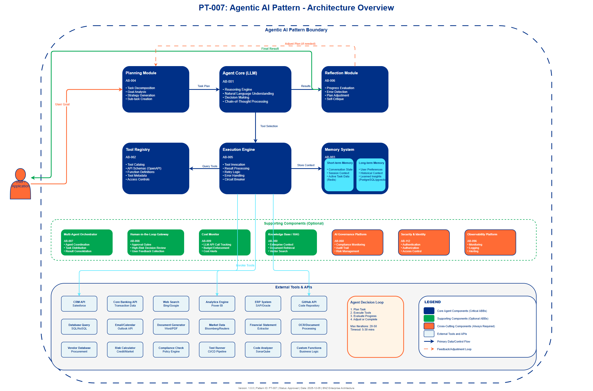

# AI Architecture Pattern: Agentic AI (NEW - 2025)

## Document Control

| Property | Value |
|----------|-------|
| **Pattern ID** | `PT-007` |
| **Pattern Name** | Agentic AI Pattern |
| **Version** | `1.0.0` |
| **Status** | `Approved` |
| **Created Date** | `2025-12-05` |
| **Last Modified** | `2025-12-05` |
| **Owner** | BNZ Enterprise Architecture |
| **Pattern Category** | `Agent` |
| **Maturity Level** | `Emerging` |

---

## 1. Pattern Overview

### 1.1 Pattern Name and Classification

**Pattern Name**: Agentic AI Pattern (NEW - 2025)

**Short Name**: Agentic AI

**Pattern Category**: Agent

**Pattern Type**: Autonomous Orchestration

### 1.2 Intent and Context

**Intent Statement**:
Enable autonomous AI agents that execute complex, multi-step tasks without explicit human prompting, using tool orchestration, memory management, and iterative planning capabilities.

**Problem Statement**:
Traditional AI systems require explicit prompting for each step of a workflow, creating operational inefficiencies in complex, multi-step business processes. Knowledge workers spend significant time orchestrating tools, extracting data, and synthesizing information across multiple systems. Organizations need autonomous agents that can work independently to achieve high-level goals while maintaining transparency, governance, and human oversight for critical decisions.

**Context**:
This pattern is applicable in scenarios where:
- Tasks require multi-step workflows spanning multiple systems and data sources
- Significant value can be unlocked through autonomous execution (e.g., overnight processing)
- Knowledge workers spend substantial time on orchestration rather than analysis
- Business processes involve tool coordination, data synthesis, and iterative refinement
- The organization can justify the complexity and cost with 2-3x productivity gains

Typical scenarios include partnership banking (synthesizing client intelligence), wholesale underwriting (autonomous credit analysis), procurement (vendor evaluation), and SDLC automation (code review and documentation).

**Forces**:
- **Autonomy vs. Control**: Need for independent operation vs. requirement for human oversight on critical decisions
- **Complexity vs. Value**: Sophisticated multi-agent systems justify their overhead only for high-value use cases
- **Cost vs. Productivity**: Agentic systems make many LLM calls, requiring cost-benefit analysis
- **Flexibility vs. Governance**: Dynamic tool use must operate within enterprise security and compliance boundaries
- **Transparency vs. Efficiency**: Need to explain agent reasoning while maintaining execution speed

### 1.3 Pattern Maturity and Industry Adoption

**Maturity Level**: Emerging

**Industry Adoption**:
- **Adoption Rate**: 61% of organizations began agentic AI development as of January 2025
- **Reference Implementations**:
  - JPMorgan Chase: 80-90% productivity increase in KYC through agentic workflows
  - McKinsey Research: 2-3x increase in qualified leads using agentic AI
  - Enterprise Document Processing: 30-50% time savings across financial services
- **Timeframe**: Mainstream adoption began Q1 2025, expected to reach 33% of enterprise software by 2028 (Gartner)

**Standards Alignment**:
- ISO/IEC 42001:2023 - AI Management System
- NIST AI Risk Management Framework (2025 update for autonomous agents)
- BNZ AI Governance Framework (Human-in-the-loop requirements for high-risk decisions)

---

## 2. Architecture Specification

### 2.1 Architecture Building Blocks (ABBs)

**Primary ABBs** (Core components required):

| ABB ID | ABB Name | Purpose in Pattern | Criticality |
|--------|----------|-------------------|-------------|
| [AB-001](../../architecture-building-blocks/abbs/AB-001/AB-001-Agent-Orchestrator-v1.0.0.md) | Agent Core (LLM) | Provides reasoning, planning, and natural language understanding | Critical |
| [AB-002](../../architecture-building-blocks/abbs/AB-002/AB-002-Tool-Registry-v1.0.0.md) | Tool Registry | Catalog of available tools (APIs, databases, functions) with schemas | Critical |
| [AB-003](../../architecture-building-blocks/abbs/AB-003/AB-003-Agent-Memory-System-v1.0.0.md) | Memory System | Short-term (conversation) and long-term (persistent) context management | Critical |
| [AB-004](../../architecture-building-blocks/abbs/AB-004/AB-004-Planning-Module-v1.0.0.md) | Planning Module | Breaks complex goals into executable sub-tasks | Critical |
| [AB-005](../../architecture-building-blocks/abbs/AB-005/AB-005-Execution-Engine-v1.0.0.md) | Execution Engine | Invokes tools, handles results, manages retries and errors | Critical |
| [AB-006](../../architecture-building-blocks/abbs/AB-006/AB-006-Reflection-Module-v1.0.0.md) | Reflection Module | Evaluates progress, detects errors, adjusts plan | High |

**Supporting ABBs** (Optional or scenario-specific):

| ABB ID | ABB Name | Purpose in Pattern | When Required |
|--------|----------|-------------------|---------------|
| [AB-007](../../architecture-building-blocks/abbs/AB-007/AB-007-Multi-Agent-Communication-Bus-v1.0.0.md) | Multi-Agent Orchestrator | Coordinates multiple specialized agents | When workflow requires specialized agent collaboration |
| [AB-008](../../architecture-building-blocks/abbs/AB-008/AB-008-Human-in-the-Loop-Gateway-v1.0.0.md) | Human-in-the-Loop Gateway | Approval gates for high-risk decisions | When regulatory or risk requirements mandate human review |
| [AB-009](../../architecture-building-blocks/abbs/AB-009/AB-009-Agent-Cost-Monitor-v1.0.0.md) | Cost Monitor | Tracks LLM API calls and enforces budget limits | When cost control is critical |
| [AB-080](../../architecture-building-blocks/abbs/AB-080/AB-080-Knowledge-Base-v1.0.0.md) | Knowledge Base / RAG System | Provides enterprise context for agent decisions | When agents need domain-specific knowledge |

**Cross-Cutting ABBs** (Always required):

| ABB ID | ABB Name | Purpose |
|--------|----------|---------|
| [AB-060](../../architecture-building-blocks/abbs/AB-060/AB-060-AI-Model-Registry-v1.0.0.md) | AI Governance Platform | Compliance, risk management, audit trail for agent actions |
| [AB-112](../../architecture-building-blocks/abbs/AB-112/AB-112-Data-Encryption-Service-v1.0.0.md) | Security & Identity | Authentication, authorization, secure tool access |
| [AB-096](../../architecture-building-blocks/abbs/AB-096/AB-096-Observability-Platform-v1.0.0.md) | Observability Platform | Monitoring agent execution, logging decisions, alerting on failures |

### 2.2 Pattern Structure

**Architectural Diagram**:



**Component Interaction Flow**:
```
User Goal → Agent Core [Planning Module]
                ↓
        [Generate Task Plan]
                ↓
        Tool Registry ← [Select Tools] → Execution Engine
                ↓                              ↓
        [Execute Tool] ──────────────→ [Process Result]
                ↓                              ↓
        Memory System ← [Store Context] ← Reflection Module
                ↓                              ↓
        [Evaluate Progress] ──────────→ [Decision: Continue or Complete?]
                ↓ (if continue)                ↓ (if complete)
        [Adjust Plan] ─────────────┐    Final Result to User
                ↓                  │
        [Iterate until goal achieved or max steps]
```

**Key Interactions**:

1. **Goal Submission**: User submits high-level goal to Agent Core
   - Protocol: REST API or Event Message
   - Data Format: JSON (goal description, context, constraints)
   - Latency Target: Asynchronous (agent may run for minutes to hours)

2. **Planning Phase**: Agent Core consults Planning Module to decompose goal
   - Processing Type: Synchronous (within agent)
   - LLM Interaction: Chain-of-thought prompting with tool schema awareness
   - Output: Structured task plan with tool invocations

3. **Tool Execution**: Execution Engine invokes tools from Tool Registry
   - Protocol: REST, gRPC, database connections, file system access
   - Error Handling: Retry logic (3 attempts), circuit breaker, graceful degradation
   - Security: Token-based authentication, least-privilege access

4. **Reflection Loop**: Reflection Module evaluates results and updates plan
   - Processing Type: Synchronous (within agent iteration)
   - Decision Logic: LLM-based evaluation of progress toward goal
   - Memory Update: Persist key insights to long-term memory

5. **Completion**: Final result delivered to user with explanation
   - Delivery Mechanism: Callback API, email, dashboard notification
   - Audit Trail: Complete log of agent actions stored in governance platform

### 2.3 Data Flow

**Data Sources**:
- **User Input**: High-level goal description, constraints, context (JSON, 1-10 KB)
- **Tool Results**: API responses, database query results, file contents (varies by tool, KB to MB)
- **Memory Store**: Previous conversations, learned context, user preferences (10-100 KB per session)
- **Knowledge Base**: Enterprise documents, policies, procedures (RAG-retrieved, 10-100 KB per retrieval)

**Data Transformations**:
1. **Goal Decomposition**: User goal → Structured task plan (LLM reasoning with tool schemas)
2. **Tool Invocation Formatting**: Task parameters → Tool-specific API calls (schema-based mapping)
3. **Result Synthesis**: Multiple tool outputs → Coherent narrative (LLM synthesis)
4. **Memory Compression**: Long conversation history → Summarized key points (LLM summarization)

**Data Sinks**:
- **User Deliverable**: Final report, analysis, document (JSON, PDF, or formatted text)
- **Memory Database**: Persistent context for future interactions (PostgreSQL with pgvector, Redis)
- **Audit Log**: Complete agent action log (governance platform, retained per policy)
- **Metrics Store**: Performance data (execution time, cost, success rate) (time-series database)

**Data Governance**:
- **Classification**: Varies by tool access (Internal to Restricted based on data accessed)
- **Retention**:
  - Agent execution logs: 7 years (regulatory requirement)
  - Memory (short-term): 30 days
  - Memory (long-term): As per user data retention policy
- **Lineage**: Full traceability from goal → plan → tool invocations → results
- **Quality**: Tool result validation, hallucination detection, self-critique scoring

### 2.4 Interface Specifications

**Inbound Interfaces** (Inputs to pattern):

| Interface ID | Interface Name | Type | Protocol | Data Format | SLA |
|--------------|---------------|------|----------|-------------|-----|
| IF-IN-001 | Goal Submission API | API | REST | JSON | Async (acknowledge < 1s, completion varies) |
| IF-IN-002 | Agent Configuration | API | REST | JSON | < 500ms |
| IF-IN-003 | Tool Registration | API | REST | OpenAPI/JSON Schema | < 1s |
| IF-IN-004 | Human Feedback | Event | Kafka | JSON | < 5s (for approval gates) |

**Outbound Interfaces** (Outputs from pattern):

| Interface ID | Interface Name | Type | Protocol | Data Format | SLA |
|--------------|---------------|------|----------|-------------|-----|
| IF-OUT-001 | Result Delivery | API/Event | REST/Kafka | JSON | Varies (minutes to hours after goal submission) |
| IF-OUT-002 | Progress Notification | Event | Kafka | JSON | Real-time (< 5s after each step) |
| IF-OUT-003 | Approval Request | Event | Kafka | JSON | < 5s (when human-in-loop triggered) |
| IF-OUT-004 | Audit Trail | Event | Kafka | JSON | Real-time (< 1s per action logged) |

**Internal Interfaces** (Between ABBs within pattern):

| Interface ID | Source ABB | Target ABB | Protocol | Purpose |
|--------------|-----------|-----------|----------|---------|
| IF-INT-001 | Agent Core | Planning Module | In-process function call | Request task decomposition |
| IF-INT-002 | Planning Module | Tool Registry | In-process / API | Query available tools and schemas |
| IF-INT-003 | Execution Engine | Tool Registry | REST/gRPC | Invoke registered tools |
| IF-INT-004 | Execution Engine | Memory System | Database query | Store and retrieve context |
| IF-INT-005 | Reflection Module | Agent Core | In-process function call | Report progress and suggest plan adjustments |

---

## 3. Agent Capabilities

### 3.1 Core Agent Capabilities

The following capabilities define the autonomy and intelligence of the agentic system:

| Capability | Description | Example | BNZ Use Case |
|------------|-------------|---------|--------------|
| **Reasoning** | Multi-step logical thinking and inference | "To calculate credit risk, I need financials, then ratios, then score" | [UC-021](../../../01-motivation/03-use-cases/use-cases/UC-021/index.md): Wholesale Underwriting |
| **Tool Use** | Call APIs, query databases, execute functions | "Call CRM API to get customer interaction history" | [UC-001](../../../01-motivation/03-use-cases/use-cases/UC-001/index.md): Partnership Banking |
| **Memory** | Remember context across interactions and sessions | "User asked about loan status 3 days ago, follow up on that" | [UC-007](../../../01-motivation/03-use-cases/use-cases/UC-007/index.md): Contact Centre |
| **Planning** | Break complex tasks into executable sub-tasks | "Step 1: Gather data, Step 2: Analyze trends, Step 3: Generate report" | [UC-002](../../../01-motivation/03-use-cases/use-cases/UC-002/index.md): Finance Reporting |
| **Reflection** | Evaluate own performance and adjust strategy | "My analysis missed key risk factor, let me revise with additional data" | [UC-004](../../../01-motivation/03-use-cases/use-cases/UC-004/index.md): Credit Risk |

### 3.2 Advanced Capabilities (Optional)

| Capability | Description | When to Enable | Technology |
|------------|-------------|----------------|------------|
| **Multi-Agent Coordination** | Multiple specialized agents collaborate on complex goals | When single agent cannot cover all required domains | LangGraph, AutoGen, CrewAI |
| **Learning from Feedback** | Improve performance based on user corrections | When agent performs recurring tasks with user feedback | Reinforcement learning, fine-tuning |
| **Proactive Suggestions** | Anticipate user needs and offer recommendations | When agent has sufficient context to predict user goals | Predictive modeling, behavior analysis |

---

## 4. Pattern Variants and Options

### 4.1 Pattern Variations

**Variant 1: Single-Agent Workflow**
- **When to Use**: Tasks can be accomplished by one generalist agent with multiple tools
- **Key Differences**: Simpler orchestration, single LLM reasoning loop
- **Trade-offs**:
  - ✅ Lower complexity, easier to debug, lower cost
  - ❌ May struggle with highly specialized domains requiring expert knowledge

**Variant 2: Multi-Agent Collaboration**
- **When to Use**: Complex tasks require specialized expertise (e.g., data analyst + legal expert + financial analyst)
- **Key Differences**: Agent orchestrator coordinates multiple specialized agents
- **Trade-offs**:
  - ✅ Better performance on complex tasks, specialization improves accuracy
  - ❌ Higher cost, complex orchestration, potential for inter-agent conflicts

**Variant 3: Hierarchical Agent System**
- **When to Use**: Large-scale workflows requiring manager-worker architecture
- **Key Differences**: Manager agent delegates to worker agents, consolidates results
- **Trade-offs**:
  - ✅ Scalable, clear separation of concerns, parallel execution
  - ❌ Most complex to implement, highest cost, requires sophisticated orchestration

**Variant 4: Human-in-the-Loop Agentic**
- **When to Use**: High-risk decisions require human approval (e.g., credit approval, contract signing)
- **Key Differences**: Agent pauses at approval gates, awaits human decision
- **Trade-offs**:
  - ✅ Maintains human control, meets regulatory requirements, reduces risk
  - ❌ Loses full autonomy, requires timely human availability

### 4.2 Composition with Other Patterns

**Commonly Combined With**:

| Pattern | Integration Point | Combined Benefit |
|---------|------------------|------------------|
| PT-001: RAG | Agent uses RAG as a tool for knowledge retrieval | Agent can autonomously query enterprise knowledge base for context |
| PT-002: Prompt Chaining | Planning Module uses structured prompts | Improved task decomposition and reasoning quality |
| PT-004: Multi-Agent | Multiple PT-007 agents coordinate | Specialized agents collaborate on complex, multi-domain tasks |
| PT-006: Fine-Tuning | Agent Core uses fine-tuned LLM | Domain-specific reasoning (e.g., credit analysis, compliance) |
| [AB-060](../../architecture-building-blocks/abbs/AB-060/AB-060-AI-Model-Registry-v1.0.0.md): AI Governance | All agent actions logged and monitored | Compliance, audit trail, risk management |

**Anti-Patterns** (What NOT to do):

- **Anti-Pattern 1: Unbounded Agent Loops**
  - **Why Problematic**: Agent can enter infinite loop, consuming resources and cost without progress
  - **Better Approach**: Implement max iteration limit (e.g., 20 steps), cost budget, timeout

- **Anti-Pattern 2: Agent Without Guardrails**
  - **Why Problematic**: Agent may take inappropriate actions, access unauthorized data, or hallucinate
  - **Better Approach**: Implement tool access controls, approval gates for high-risk actions, hallucination detection

- **Anti-Pattern 3: Using Agentic Pattern for Simple Tasks**
  - **Why Problematic**: Overhead of planning, reflection, memory is unnecessary for simple queries
  - **Better Approach**: Use simple prompt or prompt chaining for straightforward tasks; reserve agents for complex workflows

- **Anti-Pattern 4: No Observability**
  - **Why Problematic**: Cannot debug failures, optimize performance, or explain agent decisions
  - **Better Approach**: Instrument all agent actions with LangSmith, Langfuse, or Weights & Biases

---

## 5. Technology Stack and Implementation

### 5.1 Recommended Technologies

**Agent Frameworks** (2025 Enterprise Comparison):

| Framework | Architecture | Best For | Key Strengths |
|-----------|-------------|----------|---------------|
| **LangGraph** (Recommended) | Graph-based workflow | Complex workflows, branching logic | Exceptional flexibility, stateful processes, built-in MemorySaver, InMemoryStore/DB integration |
| **AutoGen** | Conversational agents | Research, enterprise LLM-to-LLM collaboration | Dynamic role-playing, robust enterprise infrastructure |
| **CrewAI** | Role-based teamwork | Sequential processes, content pipelines | Rapid prototyping, intuitive structure, layered memory (ChromaDB, SQLite, vector embeddings) |
| **OpenAI Agents SDK** | Lightweight Python | Multi-agent workflows, guardrails | Provider-agnostic (100+ LLMs), comprehensive tracing |
| **AWS Agents SDK** | Plugin architecture | Enterprise integration | AWS integration, enterprise-grade |

**Selection Strategy** (2025 Golden Rule): "Start from tasks, not tech. List top tasks your agent must perform and non-functional constraints."
- **Correctness-critical + multi-step retrieval** -> LlamaIndex
- **Branching business logic** -> LangGraph
- **Multi-role workflows** -> CrewAI or AutoGen
- **Single agent with tools** -> OpenAI Agents or LangGraph

**LLM Providers**:
- **OpenAI GPT-4 / GPT-4 Turbo**: Strong reasoning, function calling, large context window
- **Anthropic Claude 3.5 Sonnet**: Extended context (200K tokens), tool use, strong reasoning
- **AWS Bedrock**: Enterprise deployment with security and compliance

**Tool Integration**:
- **LangChain Tools**: Pre-built integrations for common APIs and databases
- **OpenAI Function Calling**: Structured tool invocation with JSON schemas
- **Anthropic Tool Use**: Native tool calling with Claude models

**Memory Management**:
- **Redis**: Short-term memory (conversation state, session context)
- **PostgreSQL with pgvector**: Long-term memory with semantic search
- **Pinecone**: Vector database for semantic memory retrieval

**Observability**:
- **LangSmith**: Agent tracing, debugging, performance analytics (LangChain ecosystem)
- **Langfuse**: Open-source LLM observability and tracing
- **Weights & Biases**: Experiment tracking, model monitoring

### 5.2 Implementation Best Practices (2025)

1. **Start Simple, Then Scale**:
   - Begin with single-agent before multi-agent
   - Add reflection only if task quality requires it
   - Introduce memory persistence only when context spans sessions

2. **Implement Robust Guardrails**:
   - Max iteration limit: 20-50 steps (prevents infinite loops)
   - Cost budget: $/session limit (prevents runaway costs)
   - Timeout: 5-30 minutes (depends on use case)
   - Approval gates: Human review for high-risk actions

3. **Monitor Costs Proactively**:
   - Agentic systems can make 10-50+ LLM calls per task
   - Track cost per task, cost per use case, cost per user
   - Implement budgets and alerts

4. **Use Memory Wisely**:
   - Only persist important context (not every intermediate step)
   - Compress long conversations with summarization
   - Set retention policies (GDPR, data minimization)

5. **Human-in-the-Loop for High-Risk Decisions**:
   - Credit approval, contract signing, financial transactions
   - Regulatory compliance (e.g., "right to explanation")
   - Customer-facing final decisions

6. **Comprehensive Observability**:
   - Log every agent action with timestamp, tool invoked, result
   - Track success rate, execution time, cost per task
   - Monitor tool failure rates and retry patterns

---

## 6. BNZ Use Case Mapping

### 6.1 Primary Use Cases (High Value)

The following BNZ use cases are ideal candidates for the Agentic AI Pattern:

| Use Case ID | Use Case Name | Agent Goal | Tools Required | Expected Benefit |
|-------------|---------------|------------|----------------|------------------|
| **[UC-001](../../../01-motivation/03-use-cases/use-cases/UC-001/index.md)** | Partnership Banking | "Prepare for meeting with ABC Corp tomorrow" | CRM API, Core Banking API, Web Search, Analytics Engine, Document Generator | 2-3x qualified leads, meeting prep time reduced from 2 hours to 30 mins |
| **[UC-002](../../../01-motivation/03-use-cases/use-cases/UC-002/index.md)** | Finance Reporting | "Generate monthly financial variance report" | ERP API, Data Warehouse, Excel Generator, Reconciliation Engine | 30-50% time savings, autonomous overnight execution |
| **[UC-010](../../../01-motivation/03-use-cases/use-cases/UC-010/index.md)** | SDLC Automation | "Review PR #123 and generate documentation" | GitHub API, Code Analyzer, Test Runner, Doc Generator | 80% productivity increase in code review |
| **[UC-017](../../../01-motivation/03-use-cases/use-cases/UC-017/index.md)** | FrontLine CIB | "Analyze market trends for client portfolio" | Market Data API, Research Database, Analytics Engine, Report Generator | Proactive client insights, analyst productivity 2x |
| **[UC-018](../../../01-motivation/03-use-cases/use-cases/UC-018/index.md)** | Procurement | "Evaluate vendors for cloud storage RFP" | Vendor Database, Pricing API, Contract Analyzer, Scoring Engine | 40% faster vendor evaluation |
| **[UC-021](../../../01-motivation/03-use-cases/use-cases/UC-021/index.md)** | Wholesale Underwriting | "Draft credit memo for XYZ Corp loan application" | Financial Statement Extractor, Ratio Calculator, Policy Database, Memo Generator | 80-90% productivity increase (JPMorgan benchmark) |

### 6.2 Example Agent Workflow: Partnership Banking ([UC-001](../../../01-motivation/03-use-cases/use-cases/UC-001/index.md))

**Scenario**: Relationship manager has meeting with ABC Corp tomorrow at 9am.

**User Goal**: "Prepare for meeting with ABC Corp tomorrow"

**Agent Plan (Auto-Generated)**:
```
Step 1: Query CRM for ABC Corp interaction history
  Tool: CRM API (Salesforce)
  Expected Output: Last 6 months of interactions, key contacts, opportunities

Step 2: Retrieve recent transactions
  Tool: Core Banking API
  Expected Output: Transaction history, account balances, product usage

Step 3: Search news for ABC Corp
  Tool: Web Search (Bing Enterprise)
  Expected Output: Recent news, press releases, market developments

Step 4: Analyze portfolio performance
  Tool: Analytics Engine (Power BI API)
  Expected Output: YoY growth, product penetration, profitability

Step 5: Generate talking points
  Tool: LLM Generation (GPT-4)
  Input: All data from Steps 1-4
  Expected Output: 5-10 talking points for meeting

Step 6: Create meeting agenda
  Tool: Document Generator (Word API)
  Expected Output: Professional meeting agenda with talking points
```

**Agent Execution (Autonomous, Overnight)**:
- 11:00 PM: Goal submitted by relationship manager
- 11:01 PM: Agent begins execution (Steps 1-6)
- 11:15 PM: All data gathered, synthesis begins
- 11:25 PM: Talking points generated, document created
- 11:30 PM: Meeting pack delivered to relationship manager's inbox

**Result**: Relationship manager arrives at 9am meeting with:
- Comprehensive client intelligence
- Data-driven talking points
- Professional meeting agenda
- Time saved: 1.5 hours (manual prep) → 0 hours (autonomous)

### 6.3 Performance Metrics (Industry Benchmarks)

Based on 2025 industry research:

| Metric | Baseline (Manual) | With Agentic AI | Improvement | Source |
|--------|-------------------|-----------------|-------------|---------|
| **Qualified Leads** | 100 leads/month | 200-300 leads/month | 2-3x increase | McKinsey 2025 |
| **Document Processing Time** | 60 minutes/document | 30 minutes/document | 30-50% reduction | Financial Services Industry |
| **KYC Productivity** | 10 cases/day | 18-19 cases/day | 80-90% increase | JPMorgan Chase |
| **Code Review Time** | 2 hours/PR | 30 minutes/PR | 75% reduction | SDLC Automation Studies |
| **Analyst Productivity** | 5 reports/week | 10 reports/week | 2x increase | CIB Frontline Research |

---

## 7. Governance and Risk Management

### 7.1 Risk Considerations

| Risk Category | Risk Description | Mitigation Strategy |
|---------------|------------------|---------------------|
| **Hallucination** | Agent may generate plausible but incorrect information | Implement self-critique loop, fact-checking tools, human review for critical outputs |
| **Runaway Cost** | Agent may make excessive LLM calls in loop | Set cost budgets, max iteration limits, cost monitoring and alerts |
| **Unauthorized Access** | Agent may attempt to access restricted data/tools | Implement least-privilege access, tool access controls, audit all tool invocations |
| **Regulatory Compliance** | Autonomous decisions may violate "right to explanation" | Human-in-the-loop for regulated decisions, comprehensive audit trail, explainable AI techniques |
| **Data Privacy** | Agent may inadvertently expose sensitive data | Data classification enforcement, PII masking, memory retention policies |
| **Prompt Injection** | Malicious instructions hidden in external data sources | Input validation, guardrails, sandboxing, Meta's "Agents Rule of Two" framework |

### 7.2 2025 Agent Safety and Guardrails (CRITICAL)

**Production Reality** (2025): Only 95 out of 1,837 surveyed organizations have AI agents live in production. Primary blockers are NOT model performance, but inability to track outputs and weak observability.

**Layered Guardrail Architecture** (Assumes failure, monitors continuously, keeps human override available):
1. **Input validation**: First line of defense at entry point - "bad data should never enter the system"
2. **Rejection sampling**: Discard unsafe outputs
3. **Feedback loops**: Incorporate external validation or human review
4. **Fact-checking**: Validate against internal sources
5. **Output validation**: Review context and accuracy before delivery
6. **Fallback mechanisms**: Default to transparency when uncertain

**Agent Autonomy Ladder** (Progressive Trust Model):
1. **Tool-calling copilot**: Humans approve every action (safest, start here)
2. **Thin-agent with reversible actions**: Checkpoints for sensitive steps
3. **Managed autonomy in sandbox**: Agents draft, humans review before promotion
4. **Production-integrated agents**: Policy checks and rollback paths
5. **Multi-agent orchestration**: Clear contracts and isolation boundaries

**Human-in-the-Loop (HITL) Requirements**:
- **Required for**: High-stakes scenarios (finance, employment, healthcare), external exposure, hard-to-reverse decisions
- **Agents alone work for**: Low-to-moderate risk, reversible actions, internal-only exposure
- **Recommended hybrid (often default)**: Agent drafts within guardrails, routes low-confidence or high-impact to humans, samples post-hoc for drift detection

**Key Insight**: "Human-in-the-loop is not a temporary workaround--it's a long-term pattern for building AI agents we can trust."

**Observability Requirements** (Essential for production):
- Real-time tracing and continuous monitoring
- Version tracking (model, prompt, configuration changes)
- Evaluations and drift detection
- Compliance and governance checks
- Alert systems for production issues

**Enterprise Platforms for Agent Production** (Major 2025 Releases):
- **AWS Bedrock Agents & AWS Bedrock**: Foundry Control Plane with real-time tracing, agent control policies
- **Google Vertex AI Agent Builder (Agent Engine)**: Production monitoring dashboard, token/latency/error tracking
- **Amazon Bedrock AgentCore**: Transform local agents to production-ready with minimal code changes

### 7.2 Governance Requirements

**Mandatory Governance Controls**:
1. **Audit Trail**: Log all agent actions (goal, plan, tools invoked, results) for 7 years
2. **Human Oversight**: Approval gates for high-risk decisions (credit, contracts, customer-facing)
3. **Explainability**: Agent must provide reasoning for decisions (chain-of-thought logging)
4. **Access Control**: Agent tool access governed by IAM policies, least-privilege
5. **Cost Monitoring**: Real-time cost tracking, budget enforcement, anomaly detection
6. **Performance Monitoring**: Track success rate, execution time, user satisfaction

**Compliance Alignment**:
- **BNZ AI Governance Framework**: All agent use cases require AI risk assessment
- **GDPR/Privacy Act**: Memory retention policies, right to erasure, data minimization
- **NIST AI RMF**: Risk categorization (High for credit/finance, Medium for productivity tools)
- **ISO 42001**: AI management system compliance (audit trail, risk management)

---

## 8. References and Resources

### 8.1 Related Patterns

| Pattern ID | Pattern Name | Relationship | Reference |
|-----------|-------------|--------------|-----------|
| PT-001 | RAG (Retrieval-Augmented Generation) | Agent uses RAG as tool for knowledge retrieval | [PT-001-RAG-v1.0.0.md](./PT-001-RAG-v1.0.0.md) |
| PT-002 | Prompt Chaining | Planning Module uses structured prompts | [PT-002-Prompt-Chaining-v1.0.0.md](./PT-002-Prompt-Chaining-v1.0.0.md) |
| PT-004 | Multi-Agent Orchestration | Multiple agents coordinate on complex tasks | [PT-004-Multi-Agent-v1.0.0.md](./PT-004-Multi-Agent-v1.0.0.md) |
| PT-006 | Fine-Tuning | Agent Core uses domain-specific LLM | [PT-006-Fine-Tuning-v1.0.0.md](./PT-006-Fine-Tuning-v1.0.0.md) |

### 8.2 Related ABBs

| ABB ID | ABB Name | Document Link |
|--------|----------|---------------|
| [AB-001](../../architecture-building-blocks/abbs/AB-001/AB-001-Agent-Orchestrator-v1.0.0.md) | Agent Core (LLM) | [../../../03-building-blocks/architecture-building-blocks/AB-001-Agent-Core.md](../../../03-building-blocks/architecture-building-blocks/AB-001-Agent-Core.md) |
| [AB-002](../../architecture-building-blocks/abbs/AB-002/AB-002-Tool-Registry-v1.0.0.md) | Tool Registry | [../../../03-building-blocks/architecture-building-blocks/AB-002-Tool-Registry.md](../../../03-building-blocks/architecture-building-blocks/AB-002-Tool-Registry.md) |
| [AB-003](../../architecture-building-blocks/abbs/AB-003/AB-003-Agent-Memory-System-v1.0.0.md) | Memory System | [../../../03-building-blocks/architecture-building-blocks/AB-003-Memory-System.md](../../../03-building-blocks/architecture-building-blocks/AB-003-Memory-System.md) |
| [AB-060](../../architecture-building-blocks/abbs/AB-060/AB-060-AI-Model-Registry-v1.0.0.md) | AI Governance Platform | [../../../03-building-blocks/architecture-building-blocks/AB-060-AI-Governance.md](../../../03-building-blocks/architecture-building-blocks/AB-060-AI-Governance.md) |

### 8.3 Standards and Guidelines

- **BNZ AI Governance Framework**: [05-governance/frameworks/ai-governance-framework.md](../../../05-governance/frameworks/ai-governance-framework.md)
- **BNZ Visual Design Standards**: [05-governance/standards/visual-design/visual-design-standard.md](../../../05-governance/standards/visual-design/visual-design-standard.md)
- **ISO/IEC 42001:2023**: AI Management System
- **NIST AI Risk Management Framework**: [https://www.nist.gov/itl/ai-risk-management-framework](https://www.nist.gov/itl/ai-risk-management-framework)

### 8.4 External References

**Industry Research**:
- McKinsey & Company: "Agentic AI in Banking - Is Your Frontline Team Ready?" (2025) - [https://www.mckinsey.com/industries/financial-services/our-insights/agentic-ai-is-here-is-your-banks-frontline-team-ready](https://www.mckinsey.com/industries/financial-services/our-insights/agentic-ai-is-here-is-your-banks-frontline-team-ready)
- Gartner: "Predicts 2025: 33% of Enterprise Software Will Have Agentic AI by 2028" (2025)
- arXiv: "Agentic AI Research Survey" (2025) - Research on agent capabilities and benchmarks

**Technology Documentation**:
- LangGraph: [https://langchain-ai.github.io/langgraph/](https://langchain-ai.github.io/langgraph/)
- AutoGen: [https://microsoft.github.io/autogen/](https://microsoft.github.io/autogen/)
- CrewAI: [https://www.crewai.com/](https://www.crewai.com/)
- AWS Agents SDK: [https://learn.microsoft.com/en-us/semantic-kernel/](https://learn.microsoft.com/en-us/semantic-kernel/)

**Vendor Resources**:
- Microsoft: "Introducing Microsoft Agent Framework (2025)" - [https://aws.amazon.com/en-us/blog/introducing-microsoft-agent-framework/](https://aws.amazon.com/en-us/blog/introducing-microsoft-agent-framework/)
- Shakudo: "Top 9 AI Agent Frameworks 2025" - [https://www.shakudo.io/blog/top-9-ai-agent-frameworks](https://www.shakudo.io/blog/top-9-ai-agent-frameworks)
- Akka: "Agentic AI Frameworks for Enterprise" - [https://akka.io/blog/agentic-ai-frameworks](https://akka.io/blog/agentic-ai-frameworks)

---

## 9. Diagram Templates

**Required Diagrams** (to be created using draw.io templates):

1. **[PT-007-Agentic-AI-Architecture-v1.0.0.drawio]**: High-level architecture showing Agent Core, Tool Registry, Memory System, Planning, Execution, Reflection modules
2. **[PT-007-Agentic-AI-Data-Flow-v1.0.0.drawio]**: Data flow from user goal through planning, execution, reflection, to final result
3. **[PT-007-Agentic-AI-Sequence-Partnership-Banking-v1.0.0.drawio]**: Detailed sequence diagram for [UC-001](../../../01-motivation/03-use-cases/use-cases/UC-001/index.md) Partnership Banking workflow

**Diagram Standards**: All diagrams must follow BNZ Visual Design Standards:
- **Colors**: BNZ Navy Blue (#003087), BNZ Orange (#FF6B35), BNZ Light Blue (#50E6FF), BNZ Teal (#00A651)
- **Canvas**: 2400x1800px (16:9) with 40px margins
- **Typography**: Helvetica for diagram text
- **Legend**: All diagrams must include legend explaining colors, shapes, and arrow types
- **Accessibility**: WCAG 2.1 AA compliance (4.5:1 contrast ratio minimum)

See [05-governance/standards/visual-design/visual-design-standard.md](../../../05-governance/standards/visual-design/visual-design-standard.md) for complete standards.

---

## Appendix A: Agent Capability Comparison

### Agentic AI vs. Traditional AI Systems

| Capability | Traditional AI (Prompt-Based) | Agentic AI (Autonomous) | Benefit |
|------------|-------------------------------|-------------------------|---------|
| **Task Execution** | Requires explicit prompt for each step | Autonomous multi-step execution from high-level goal | 30-50% time savings |
| **Tool Orchestration** | Human coordinates tools manually | Agent selects and invokes tools autonomously | 2-3x productivity increase |
| **Context Management** | Stateless (context in prompt) | Stateful (memory across sessions) | Personalization, continuity |
| **Error Handling** | Fails on error, requires human intervention | Retry logic, reflection, plan adjustment | Higher reliability |
| **Learning** | Static (no improvement over time) | Can learn from feedback (optional) | Continuous improvement |
| **Transparency** | Black box (prompt → response) | Explainable (plan → actions → reasoning logged) | Audit, compliance, trust |

---

## Appendix B: Glossary

| Term | Definition |
|------|------------|
| **Agent Core** | The LLM-powered reasoning engine that plans, executes, and reflects on tasks |
| **Tool Registry** | Catalog of available tools (APIs, databases, functions) with schemas for agent invocation |
| **Memory System** | Short-term (session) and long-term (persistent) context storage for agent continuity |
| **Planning Module** | Component that decomposes high-level goals into executable sub-tasks |
| **Execution Engine** | Component that invokes tools, handles results, manages retries and errors |
| **Reflection Module** | Component that evaluates progress toward goal and adjusts plan if needed |
| **Human-in-the-Loop** | Approval gate where agent pauses for human decision on high-risk actions |
| **Chain-of-Thought** | LLM reasoning technique where model explains its thinking step-by-step |
| **Hallucination** | LLM generating plausible but factually incorrect information |
| **Self-Critique** | Agent evaluates its own output quality and triggers retry if insufficient |

---

## Appendix C: Change History

| Version | Date | Author | Changes |
|---------|------|--------|---------|
| 1.0.0 | 2025-12-05 | BNZ Enterprise Architecture | Initial version - Agentic AI Pattern based on 2025 industry research and BNZ use case analysis |

---

## Appendix D: Review and Approval

| Role | Name | Signature | Date |
|------|------|-----------|------|
| **Pattern Author** | BNZ Enterprise Architecture | | 2025-12-05 |
| **Enterprise Architect** | [To be assigned] | | |
| **Security Architect** | [To be assigned] | | |
| **TAF** | [To be assigned] | | |

---

## Document End

**Pattern ID**: PT-007
**Pattern Name**: Agentic AI Pattern (NEW - 2025)
**Version**: 1.0.0
**Status**: Approved
**Last Modified**: 2025-12-05
