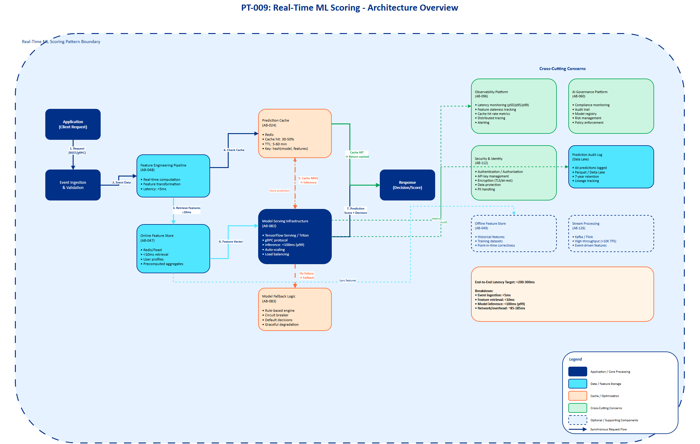

# AI Architecture Pattern Template

## Document Control

| Property | Value |
|----------|-------|
| **Pattern ID** | `PT-009` |
| **Pattern Name** | Real-Time ML Scoring Pattern |
| **Version** | `1.0.0` |
| **Status** | `Approved` |
| **Created Date** | `2025-12-05` |
| **Last Modified** | `2025-12-05` |
| **Owner** | BNZ Enterprise Architecture |
| **Pattern Category** | `ML Prediction` |
| **Maturity Level** | `Mature` |

---

## 1. Pattern Overview

### 1.1 Pattern Name and Classification

**Pattern Name**: Real-Time Machine Learning Scoring Pattern

**Short Name**: Real-Time Scoring

**Pattern Category**: ML Prediction

**Pattern Type**: Integration, Processing, Real-Time

### 1.2 Intent and Context

**Intent Statement**:
Enable low-latency ML model inference for real-time decision-making in user-facing applications where immediate responses are critical for business outcomes.

**Problem Statement**:
Organizations need to make data-driven decisions in real-time (milliseconds to seconds) for use cases such as fraud detection, credit scoring, and personalization. Traditional batch processing approaches introduce unacceptable latency for user-facing applications, resulting in poor customer experience, lost revenue opportunities, and increased risk exposure.

**Context**:
This pattern is applicable when:
- Decisions must be made within seconds, not hours or days
- The use case is user-facing and cannot wait for batch processing
- There is high business value from speed (fraud prevention, revenue optimization, risk mitigation)
- Feature freshness is critical to model accuracy
- System availability and reliability are paramount (financial transactions, security)

**Forces**:
- **Latency vs. Accuracy**: Need for sub-second response times while maintaining model accuracy and using fresh features
- **Cost vs. Performance**: Infrastructure costs for low-latency serving versus business value of real-time decisions
- **Consistency vs. Speed**: Training/serving skew must be minimized while optimizing for inference speed
- **Availability vs. Complexity**: High availability requirements (99.9%+) versus architectural complexity and operational overhead
- **Feature Freshness vs. Computation Cost**: Real-time feature computation overhead versus using stale precomputed features

### 1.3 Pattern Maturity and Industry Adoption

**Maturity Level**: Mature

**Industry Adoption**:
- **Adoption Rate**: 85%+ of tier-1 financial institutions have implemented real-time scoring for fraud detection and credit decisioning
- **Reference Implementations**:
  - Capital One: Real-time fraud detection with <200ms latency
  - PayPal: Real-time transaction risk scoring processing billions of transactions
  - Netflix: Real-time personalization serving 200M+ users
- **Timeframe**: Mainstream since 2022, industry standard for financial services as of 2024

**Standards Alignment**:
- MLOps Principles (Google, Microsoft, AWS)
- Feature Store Architecture (Feast, Tecton standards)
- ISO/IEC 23053:2022 - Machine Learning Framework
- Real-time AI/ML serving best practices (NVIDIA, Seldon, KServe)

---

## 2. Architecture Specification

### 2.1 Architecture Building Blocks (ABBs)

**Primary ABBs** (Core components required):

| ABB ID | ABB Name | Purpose in Pattern | Criticality |
|--------|----------|-------------------|-------------|
| [AB-047](../../architecture-building-blocks/abbs/AB-047/AB-047-Online-Feature-Store-v1.0.0.md) | Online Feature Store | Real-time feature retrieval with <10ms latency for model inference | Critical |
| [AB-082](../../architecture-building-blocks/abbs/AB-082/AB-082-Model-Serving-Infrastructure-v1.0.0.md) | Model Serving Infrastructure | Low-latency model hosting and inference execution (<100ms) | Critical |
| [AB-048](../../architecture-building-blocks/abbs/AB-048/AB-048-Feature-Engineering-Pipeline-v1.0.0.md) | Feature Engineering Pipeline | Real-time feature computation and transformation from incoming events | Critical |
| [AB-024](../../architecture-building-blocks/abbs/AB-024/AB-024-Prediction-Caching-Layer-v1.0.0.md) | Prediction Caching Layer | Cache predictions for duplicate requests to reduce inference load | High |
| [AB-083](../../architecture-building-blocks/abbs/AB-083/AB-083-Model-Fallback-Logic-v1.0.0.md) | Model Fallback Logic | Default decision engine when model is unavailable or fails | High |

**Supporting ABBs** (Optional or scenario-specific):

| ABB ID | ABB Name | Purpose in Pattern | When Required |
|--------|----------|-------------------|---------------|
| [AB-126](../../architecture-building-blocks/abbs/AB-126/AB-126-Stream-Processing-Platform-v1.0.0.md) | Stream Processing Platform | Process high-volume event streams for feature computation | High-throughput scenarios (>10K TPS) |
| [AB-049](../../architecture-building-blocks/abbs/AB-049/AB-049-Offline-Feature-Store-v1.0.0.md) | Offline Feature Store | Historical features for training and batch feature computation | Always (dual-store architecture) |
| [AB-084](../../architecture-building-blocks/abbs/AB-084/AB-084-Model-Quantization-Service-v1.0.0.md) | Model Quantization Service | Optimize model size and inference speed with minimal accuracy loss | Latency-critical use cases (<50ms target) |
| [AB-081](../../architecture-building-blocks/abbs/AB-081/AB-081-Load-Balancer-v1.0.0.md) | Load Balancer | Distribute inference requests across model serving instances | Production deployments with HA requirements |

**Cross-Cutting ABBs** (Always required):

| ABB ID | ABB Name | Purpose |
|--------|----------|---------|
| [AB-060](../../architecture-building-blocks/abbs/AB-060/AB-060-AI-Model-Registry-v1.0.0.md) | AI Governance Platform | Compliance, risk management, audit trail, model monitoring |
| [AB-112](../../architecture-building-blocks/abbs/AB-112/AB-112-Data-Encryption-Service-v1.0.0.md) | Security & Identity | Authentication, authorization, encryption, data protection |
| [AB-096](../../architecture-building-blocks/abbs/AB-096/AB-096-Observability-Platform-v1.0.0.md) | Observability Platform | Monitoring latency (p50/p95/p99), logging, alerting, feature staleness tracking |

### 2.2 Pattern Structure

**Architectural Diagram**:



**Component Interaction Flow**:
```
Event (Transaction, Login, Click) → Feature Engineering (real-time)
    ↓
Online Feature Store → Feature Retrieval (<10ms)
    ↓
Prediction Cache (check) → [Cache Hit: Return cached prediction]
    ↓ (Cache Miss)
Model Serving → Inference (<100ms)
    ↓
[Decision: Approve/Reject/Score/Alert] → Application Response
    ↓
Prediction Cache (store) + Audit Log
```

**Key Interactions**:

1. **Event Ingestion**: Application sends event (transaction, user action) to Feature Engineering Pipeline
   - Protocol: REST API (synchronous) or Kafka (asynchronous pre-computation)
   - Data Format: JSON with event metadata (user_id, timestamp, context)
   - Latency Target: <5ms for event receipt

2. **Feature Computation and Retrieval**: Feature Engineering Pipeline computes real-time features and retrieves from Online Feature Store
   - Processing Type: Synchronous for critical features, asynchronous for enrichment
   - Data Format: Feature vectors (numerical/categorical arrays)
   - Latency Target: <10ms for feature retrieval
   - Error Handling: Feature defaults if store unavailable

3. **Cache Check**: Query Prediction Cache for duplicate requests
   - Protocol: Redis GET operation
   - Cache Key: Hash of (model_version, feature_vector)
   - TTL: 5-60 minutes depending on use case
   - Cache Hit Rate Target: 30-50%

4. **Model Inference**: Model Serving executes prediction if cache miss
   - Protocol: gRPC for low latency
   - Input: Feature vector
   - Output: Prediction score + confidence + explanation
   - Latency Target: <100ms (p99)
   - Error Handling: Circuit breaker → Fallback Logic

5. **Fallback Decision**: Default decision engine if model fails
   - Rule-based logic or simple heuristic
   - Logged for investigation
   - Graceful degradation to maintain service

6. **Response Delivery**: Prediction returned to application
   - Delivery Mechanism: Synchronous API response
   - Format: JSON with score, decision, reason codes
   - Total End-to-End Latency: <200-300ms

### 2.3 Data Flow

**Data Sources**:
- **Real-time Events**: User transactions, clicks, logins, API calls (streaming, 100-100K TPS)
- **Online Feature Store**: Precomputed features, user profiles, aggregates (key-value, <10ms lookup)
- **External APIs**: Third-party data enrichment (credit bureaus, fraud databases) when latency permits

**Data Transformations**:
1. **Event Parsing and Validation**: Raw event JSON → Validated feature inputs (schema validation, type checking)
2. **Feature Engineering**: Raw attributes → Derived features (e.g., transaction_velocity_1h, account_age_days, geo_distance)
3. **Feature Normalization**: Raw feature values → Normalized vectors (standardization, encoding)
4. **Model Prediction**: Feature vector → Prediction score (0-1 probability or classification)
5. **Decision Logic**: Prediction score → Business decision (approve/reject/review based on thresholds)

**Data Sinks**:
- **Application Response**: Real-time decision delivered to calling application (synchronous)
- **Prediction Audit Log**: All predictions logged to data lake for monitoring, debugging, model retraining (Parquet/Delta Lake)
- **Monitoring Metrics**: Latency, throughput, cache hit rate, model performance sent to observability platform (Prometheus/CloudWatch)
- **Feature Store (Offline)**: Logged for training dataset creation and point-in-time correctness validation

**Data Governance**:
- **Classification**: Confidential (contains PII, financial data)
- **Retention**: Predictions retained 7 years for audit, features retained per data retention policy
- **Lineage**: Feature lineage tracked from source → transformation → model → prediction
- **Quality**: Schema validation, null checks, outlier detection, feature drift monitoring

### 2.4 Interface Specifications

**Inbound Interfaces** (Inputs to pattern):

| Interface ID | Interface Name | Type | Protocol | Data Format | SLA |
|--------------|---------------|------|----------|-------------|-----|
| IF-IN-001 | Prediction Request API | Synchronous API | REST/gRPC | JSON/Protobuf | <5ms processing, 99.99% availability |
| IF-IN-002 | Real-time Event Stream | Event Stream | Kafka | JSON/Avro | <10ms ingestion, at-least-once delivery |
| IF-IN-003 | External Data Enrichment | API Call | REST | JSON | <50ms response (if used) |

**Outbound Interfaces** (Outputs from pattern):

| Interface ID | Interface Name | Type | Protocol | Data Format | SLA |
|--------------|---------------|------|----------|-------------|-----|
| IF-OUT-001 | Prediction Response | Synchronous API Response | REST/gRPC | JSON/Protobuf | <200-300ms end-to-end |
| IF-OUT-002 | Prediction Audit Stream | Event Stream | Kafka | JSON/Avro | At-least-once delivery |
| IF-OUT-003 | Monitoring Metrics | Metrics Push | Prometheus/OTLP | Metrics format | Real-time |

**Internal Interfaces** (Between ABBs within pattern):

| Interface ID | Source ABB | Target ABB | Protocol | Purpose |
|--------------|-----------|-----------|----------|---------|
| IF-INT-001 | Feature Engineering | Online Feature Store | Redis Protocol | Feature retrieval |
| IF-INT-002 | Feature Engineering | Model Serving | gRPC | Pass feature vector for inference |
| IF-INT-003 | Model Serving | Prediction Cache | Redis Protocol | Store/retrieve cached predictions |
| IF-INT-004 | Model Serving | Fallback Logic | Internal API | Trigger fallback on failure |


## 3. Pattern Variants and Options

### 3.1 Pattern Variations

**Variant 1: Batch Prediction (Micro-Batch)**
- **When to Use**: Moderate latency tolerance (1-5 seconds), high throughput requirements (>10K TPS)
- **Key Differences**:
  - Predictions batched every 100-500ms
  - Higher throughput (10x) but increased latency
  - More efficient GPU utilization
- **Trade-offs**:
  - Gain: 10x higher throughput, 50% lower cost per prediction
  - Lose: Higher p99 latency (1-5s vs <300ms)

**Variant 2: Edge Inference (On-Device)**
- **When to Use**: Ultra-low latency (<10ms), offline capability required, data privacy constraints
- **Key Differences**:
  - Model deployed on edge devices (mobile, IoT)
  - No network round-trip
  - Lightweight models (quantized, distilled)
- **Trade-offs**:
  - Gain: <10ms latency, offline capability, reduced data transmission
  - Lose: Model complexity limited, update latency, device compatibility challenges

**Variant 3: Hybrid Online/Offline**
- **When to Use**: Some features expensive to compute real-time, acceptable to use recent precomputed features
- **Key Differences**:
  - Critical features computed real-time
  - Expensive aggregates precomputed every 5-15 minutes
  - Mixed feature freshness
- **Trade-offs**:
  - Gain: 40-60% lower latency, reduced compute cost
  - Lose: Some feature staleness (acceptable for many use cases)

### 3.2 Composition with Other Patterns

**Commonly Combined With**:

| Pattern | Integration Point | Combined Benefit |
|---------|------------------|------------------|
| PT-004: Model Monitoring | Model Serving outputs predictions to monitoring system | Detect model drift, performance degradation in production |
| PT-006: Feature Store | Dual-store architecture (online + offline) | Consistent features for training and serving, point-in-time correctness |
| PT-011: A/B Testing | Model Serving routes requests to champion/challenger models | Safe model rollouts, measure business impact |
| PT-015: Explainable AI | Prediction augmented with feature importance, SHAP values | Regulatory compliance, debugging, trust |

**Anti-Patterns** (What NOT to do):

- **Anti-Pattern 1: Training/Serving Skew**
  - **Why Problematic**: Features computed differently in training vs serving causes accuracy degradation (10-30% common)
  - **Better Approach**: Use Feature Store with point-in-time correctness, share feature engineering code between training and serving

- **Anti-Pattern 2: No Fallback Logic**
  - **Why Problematic**: Single point of failure causes complete service outage when model fails
  - **Better Approach**: Implement rule-based fallback, circuit breaker, graceful degradation

- **Anti-Pattern 3: No Caching**
  - **Why Problematic**: Duplicate requests (30-50% of traffic) cause unnecessary inference load and cost
  - **Better Approach**: Implement prediction caching with appropriate TTL based on feature freshness requirements

- **Anti-Pattern 4: Synchronous External API Calls in Critical Path**
  - **Why Problematic**: External API latency (50-500ms) blows latency budget, availability dependencies
  - **Better Approach**: Precompute external data asynchronously, use cached lookups, or make optional

---

## 4. Implementation Guidance

### 4.1 Latency Requirements and Targets

**Target Latency by Use Case Type**:

| Use Case Type | Target Latency | Example | Latency Budget Breakdown |
|---------------|----------------|---------|--------------------------|
| **Fraud Detection** | 200-300ms | Real-time transaction approval | Event: 5ms, Feature: 10ms, Inference: 100ms, Network: 85-185ms |
| **Credit Scoring** | <1 second | Instant credit decision | Event: 10ms, Feature: 50ms, Inference: 200ms, Network: 740ms |
| **Personalization** | <500ms | Real-time content recommendation | Event: 5ms, Feature: 10ms, Inference: 50ms, Caching: 435ms |
| **Cybersecurity** | <1 second | Threat detection and blocking | Event: 50ms, Feature: 100ms, Inference: 200ms, Decision: 650ms |

### 4.2 Technology Stack Options

**Feature Store**:
- **Feast**: Open-source, AWS/GCP compatible, good for small-medium scale
- **Tecton**: Enterprise-grade, managed, best for large-scale production
- **AWS Feature Store**: Integrated with SageMaker, good for AWS-native stacks
- **Redis + Custom**: Lightweight for simple use cases

**Model Serving** (2025 Enterprise Comparison):

| Framework | Processing Model | Strengths | Best Use Case |
|-----------|-----------------|-----------|---------------|
| **vLLM** (Recommended for LLMs) | PagedAttention algorithm | 14-24x higher throughput than HuggingFace, continuous batching, dynamic request handling | High-throughput LLM inference, startups/scale-ups |
| **NVIDIA Triton** | Multi-framework, multi-model | TF, PyTorch, ONNX, custom backends; model ensembles; best GPU utilization | Enterprise multi-model deployments, complex environments |
| **HuggingFace TGI v3** | Per-record with prefix caching | 3x more tokens, 13x faster on long contexts; model parallelism, speculative decoding | Long chat conversations, HuggingFace ecosystem |
| **TensorRT-LLM** | NVIDIA-optimized | Kernel fusion, INT8/FP8 quantization, multi-GPU parallelism | Maximum NVIDIA optimization, fine-grained latency control |
| **Ray Serve** | Distributed | Multi-framework, best for Python models, distributed inference | Python-native ML, complex serving graphs |
| **Seldon Core** | Kubernetes-native | Multi-framework, advanced deployment patterns, inference graphs | K8s environments, canary/shadow deployments |

**Selection Guide**: vLLM for high-throughput LLM batch processing; TGI v3 for latency-sensitive interactive apps with long contexts; Triton for multi-model enterprise support; TensorRT-LLM for maximum NVIDIA optimization. Teams increasingly mix systems for different workload types.

**Caching**:
- **Redis**: Industry standard, <1ms latency, rich data structures
- **Memcached**: Simpler, slightly lower latency for pure caching

**Stream Processing**:
- **Kafka Streams**: Lightweight, good for simple transformations
- **Apache Flink**: Complex event processing, exactly-once semantics
- **Spark Streaming**: Batch + streaming unified, good for existing Spark users

### 4.3 Performance Optimization Techniques

**Caching Strategies**:
- **Prediction Caching**: 30-50% reduction in inference requests
  - Cache key: hash(model_version, feature_vector)
  - TTL: 5-60 minutes based on feature freshness
- **Feature Caching**: 60-80% reduction in feature computation
  - Cache precomputed aggregates (daily/hourly stats)
  - Invalidate on feature updates

**Model Optimization**:
- **Model Quantization**: 2-4x speedup with <2% accuracy loss
  - INT8 quantization for inference
  - Post-training quantization (PTQ) or quantization-aware training (QAT)
- **Model Pruning**: 30-50% size reduction, 1.5-2x speedup
- **Knowledge Distillation**: 5-10x smaller model, 90-95% accuracy retention
- **ONNX Conversion**: 10-30% speedup across frameworks

**Batch Prediction** (for high throughput):
- Group multiple requests: Process 10-100 requests together
- GPU utilization: 80%+ vs 20-40% for single requests
- Trade-off: p99 latency increases 2-5x

**Feature Precomputation**:
- Compute expensive features offline (hourly/daily aggregates)
- Store in Online Feature Store for real-time retrieval
- Refresh asynchronously based on staleness tolerance

### 4.4 Best Practices (2025)

**Architecture Patterns**:
- **Dual-Store Architecture**: Online (real-time serving) + Offline (training) feature stores
- **Point-in-Time Correctness**: Ensure training uses same feature values as serving for any historical point
- **Feature Versioning**: Version features alongside models for reproducibility

**Monitoring and Observability**:
- **Latency SLAs**: Define and monitor p50, p95, p99 latency targets
- **Feature Staleness**: Track how old features are (e.g., max age 5 minutes)
- **Model Performance**: Monitor prediction distribution, drift detection
- **Cache Effectiveness**: Track cache hit rate, TTL effectiveness

**Reliability Patterns**:
- **Circuit Breaker**: Stop calling failed services after threshold
- **Fallback Logic**: Default decision when model unavailable
- **Request Deduplication**: Prevent duplicate requests from overwhelming system
- **Rate Limiting**: Protect backend services from overload

**Training/Serving Consistency**:
- **Shared Feature Code**: Use same feature engineering code for training and serving
- **Feature Validation**: Schema validation, type checking, range validation
- **Integration Testing**: Test full pipeline with production traffic patterns

### 4.5 BNZ Use Cases Implementing This Pattern

| Use Case ID | Use Case Name | Latency Target | Key Features |
|-------------|---------------|----------------|--------------|
| **[UC-004](../../../01-motivation/03-use-cases/use-cases/UC-004/index.md)** | Credit Risk - Real-time Scoring | <1 second | Credit score, account history, transaction patterns |
| **[UC-006](../../../01-motivation/03-use-cases/use-cases/UC-006/index.md)** | HyperPersonalization | <500ms | User preferences, behavior history, real-time context |
| **[UC-008](../../../01-motivation/03-use-cases/use-cases/UC-008/index.md)** | Security AI - Threat Detection | <1 second | Login patterns, device fingerprint, geo-location |
| **[UC-013](../../../01-motivation/03-use-cases/use-cases/UC-013/index.md)** | Fraud Ops - Transaction Scoring | 200-300ms | Transaction velocity, merchant risk, user behavior |
| **[UC-019](../../../01-motivation/03-use-cases/use-cases/UC-019/index.md)** | Payment Disputes - Risk Assessment | <1 second | Dispute history, transaction metadata, merchant data |
| **[UC-024](../../../01-motivation/03-use-cases/use-cases/UC-024/index.md)** | App Personalisation - UI/Content | <500ms | User segment, session context, A/B test variants |

---

## 5. References and Resources

### 5.1 Related Patterns

| Pattern ID | Pattern Name | Relationship | Reference |
|-----------|-------------|--------------|-----------|
| PT-004 | Model Monitoring and Observability | Used together for production ML | TBD |
| PT-006 | Feature Store Architecture | Core dependency for feature management | TBD |
| PT-011 | A/B Testing for ML Models | Used together for safe rollouts | TBD |
| PT-015 | Explainable AI Pattern | Optional addition for interpretability | TBD |
| PT-018 | Batch Prediction Pattern | Alternative for non-real-time use cases | TBD |

### 5.2 Related ABBs

| ABB ID | ABB Name | Document Link |
|--------|----------|---------------|
| [AB-047](../../architecture-building-blocks/abbs/AB-047/AB-047-Online-Feature-Store-v1.0.0.md) | Online Feature Store | TBD |
| [AB-049](../../architecture-building-blocks/abbs/AB-049/AB-049-Offline-Feature-Store-v1.0.0.md) | Offline Feature Store | TBD |
| [AB-082](../../architecture-building-blocks/abbs/AB-082/AB-082-Model-Serving-Infrastructure-v1.0.0.md) | Model Serving Infrastructure | TBD |
| [AB-048](../../architecture-building-blocks/abbs/AB-048/AB-048-Feature-Engineering-Pipeline-v1.0.0.md) | Feature Engineering Pipeline | TBD |
| [AB-060](../../architecture-building-blocks/abbs/AB-060/AB-060-AI-Model-Registry-v1.0.0.md) | AI Governance Platform | TBD |
| [AB-096](../../architecture-building-blocks/abbs/AB-096/AB-096-Observability-Platform-v1.0.0.md) | Observability Platform | TBD |

### 5.3 Standards and Guidelines

- **MLOps Standards**: [ML Engineering Best Practices (Google)](https://developers.google.com/machine-learning/guides/rules-of-ml)
- **Feature Store Best Practices**: [Feature Store Documentation](https://www.featurestore.org/)
- **ISO/IEC 23053:2022**: Machine Learning Framework
- **Model Serving**: [KServe Documentation](https://kserve.github.io/website/)

### 5.4 External References

**Industry Research**:
- Xenoss: Real-time AI Fraud Detection in Banking - https://xenoss.io/blog/real-time-ai-fraud-detection-in-banking
- Feature Store Organization: Feature Store Architecture 2025 - https://www.featurestore.org/
- Gartner: Real-Time Machine Learning Serving Best Practices (2024)
- Google: Rules of Machine Learning: Best Practices for ML Engineering

**Technology Documentation**:
- TensorFlow Serving: https://www.tensorflow.org/tfx/guide/serving
- Seldon Core: https://docs.seldon.io/
- Feast Feature Store: https://docs.feast.dev/
- Redis: https://redis.io/docs/
- Triton Inference Server: https://github.com/triton-inference-server/server

**Vendor Resources**:
- AWS: Real-time ML with SageMaker Feature Store and Endpoints
- AWS: Real-time Scoring with AWS SageMaker
- Google Cloud: Vertex AI Feature Store and Prediction
- Databricks: Real-time Feature Serving with Feature Store

---

## 6. Diagram Templates

**Required Diagrams** (to be created using draw.io templates):

1. **[PT-009-Real-Time-Scoring-Architecture-v1.0.0.drawio]**: High-level architecture showing:
   - Event ingestion
   - Feature Engineering Pipeline
   - Online Feature Store
   - Model Serving Infrastructure
   - Prediction Cache
   - Fallback Logic
   - Cross-cutting concerns (observability, governance, security)

2. **[PT-009-Real-Time-Scoring-Data-Flow-v1.0.0.drawio]**: Detailed data flow showing:
   - Event → Feature computation → Feature retrieval → Inference → Response
   - Cache hit/miss paths
   - Fallback activation
   - Audit logging

3. **[PT-009-Real-Time-Scoring-Latency-Breakdown-v1.0.0.drawio]**: Latency waterfall diagram showing time spent in each component

**Note**: All diagrams must follow BNZ Visual Design Standards as defined in `05-governance/standards/visual-design/visual-design-standard.md`:
- BNZ color palette (Navy Blue #003087, Orange #FF6B35, Light Blue #50E6FF, Teal #00A651)
- Canvas size: 2400x1800px or 1920x1080px
- Typography: Calibri or Helvetica
- Accessibility: WCAG 2.1 AA compliance (4.5:1 contrast)
- Include legend explaining colors, shapes, and arrows

---

## Appendix A: Glossary

| Term | Definition |
|------|------------|
| **Online Feature Store** | Low-latency key-value store optimized for real-time feature retrieval during model inference |
| **Offline Feature Store** | Historical feature storage optimized for training dataset creation and batch feature computation |
| **Point-in-Time Correctness** | Ensuring training features match what would have been available at serving time for any historical point |
| **Feature Staleness** | Age of feature values since last computation/update |
| **Training/Serving Skew** | Discrepancy between features used in training vs production inference, causing accuracy degradation |
| **Model Quantization** | Reducing model precision (e.g., FP32 → INT8) to improve inference speed with minimal accuracy loss |
| **Cache Hit Rate** | Percentage of requests served from cache vs requiring inference |
| **p50/p95/p99 Latency** | 50th/95th/99th percentile latency (time under which 50%/95%/99% of requests complete) |
| **Circuit Breaker** | Design pattern that stops calling a failing service after threshold to prevent cascading failures |
| **Fallback Logic** | Default decision mechanism when primary model unavailable or fails |

---

## Appendix B: Change History

| Version | Date | Author | Changes |
|---------|------|--------|---------|
| 1.0.0 | 2025-12-05 | BNZ Enterprise Architecture | Initial version based on use case analysis and industry best practices |

---

## Appendix C: Review and Approval

| Role | Name | Signature | Date |
|------|------|-----------|------|
| **Pattern Author** | BNZ Enterprise Architecture | | 2025-12-05 |
| **Enterprise Architect** | [Pending] | | |
| **Security Architect** | [Pending] | | |
| **TAF** | [Pending] | | |
