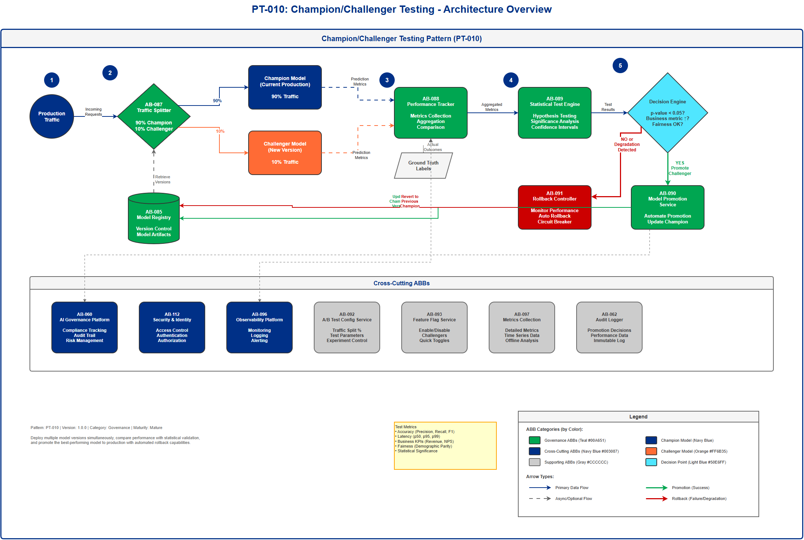

# AI Architecture Pattern: Champion/Challenger Testing Pattern

## Document Control

| Property | Value |
|----------|-------|
| **Pattern ID** | `PT-010` |
| **Pattern Name** | Champion/Challenger Testing Pattern |
| **Version** | `1.0.0` |
| **Status** | `Approved` |
| **Created Date** | `2025-12-05` |
| **Last Modified** | `2025-12-05` |
| **Owner** | BNZ Enterprise Architecture |
| **Pattern Category** | `Governance` |
| **Maturity Level** | `Mature` |

---

## 1. Pattern Overview

### 1.1 Pattern Name and Classification

**Pattern Name**: Champion/Challenger Testing Pattern

**Short Name**: Champion/Challenger

**Pattern Category**: Governance

**Pattern Type**: Model Validation and Deployment

### 1.2 Intent and Context

**Intent Statement**:
Deploy multiple model versions simultaneously, compare their performance against key metrics, and promote the best-performing model to production through statistical validation.

**Problem Statement**:
Organizations need to continuously improve ML model performance while managing risk. Deploying new models directly to 100% of production traffic is risky - if the new model underperforms, it can negatively impact business outcomes. However, not testing new models in production means missing opportunities for improvement and falling behind competitors who iterate faster.

**Context**:
This pattern is applicable when organizations have mature ML operations and need to:
- Validate new model versions before full production deployment
- Meet regulatory requirements for model validation (especially in financial services)
- Minimize risk while continuously improving model performance
- Establish statistical confidence in model improvements before promotion
- Maintain audit trails of model performance comparisons for compliance

**Forces**:
- **Risk vs. Innovation**: Need to innovate with new models while protecting against performance degradation
- **Speed vs. Safety**: Pressure to deploy improvements quickly while ensuring they truly perform better
- **Statistical Rigor vs. Operational Simplicity**: Requirement for statistically significant results while maintaining straightforward operations
- **Resource Efficiency vs. Thoroughness**: Cost of running multiple models simultaneously vs. need for comprehensive testing
- **Regulatory Compliance vs. Agility**: Requirements for documented validation while maintaining ability to iterate

### 1.3 Pattern Maturity and Industry Adoption

**Maturity Level**: Mature

**Industry Adoption**:
- **Adoption Rate**: Widely adopted in financial services and high-stakes ML applications, considered best practice for Tier 1/2 models
- **Reference Implementations**:
  - Major financial institutions use this for credit risk and fraud detection models
  - E-commerce platforms employ this for recommendation system improvements
  - Cloud ML platforms (AWS SageMaker, AWS SageMaker) provide native support
- **Timeframe**: Mainstream since 2020, now considered mandatory for regulatory models in financial services (2025 standard)

**Standards Alignment**:
- Model Risk Management (SR 11-7) - Federal Reserve guidance on model validation
- GDPR Article 22 - Automated decision-making with human oversight
- Basel III/IV - Model validation requirements for credit risk
- ISO/IEC 5338:2023 - AI system lifecycle processes

---

## 2. Architecture Specification

### 2.1 Architecture Building Blocks (ABBs)

**Primary ABBs** (Core components required):

| ABB ID | ABB Name | Purpose in Pattern | Criticality |
|--------|----------|-------------------|-------------|
| [AB-087](../../architecture-building-blocks/abbs/AB-087/AB-087-Model-Testing-Framework-v1.0.0.md) | Model Testing Framework | Comprehensive model testing and validation before deployment | Critical |
| [AB-088](../../architecture-building-blocks/abbs/AB-088/AB-088-Model-Deployment-Orchestrator-v1.0.0.md) | Model Deployment Orchestrator | Automates model deployment workflows | Critical |
| [AB-089](../../architecture-building-blocks/abbs/AB-089/AB-089-Model-Monitoring-Platform-v1.0.0.md) | Model Monitoring Platform | Production model performance monitoring | Critical |
| [AB-090](../../architecture-building-blocks/abbs/AB-090/AB-090-Model-Fallback-Logic-v1.0.0.md) | Model Fallback Logic | Handles model failures with fallback strategies | High |
| [AB-091](../../architecture-building-blocks/abbs/AB-091/AB-091-Rollback-Controller-v1.0.0.md) | Rollback Controller | Revert to champion if challenger underperforms in production | Critical |
| [AB-085](../../architecture-building-blocks/abbs/AB-085/AB-085-ML-Training-Pipeline-v1.0.0.md) | ML Training Pipeline | Orchestrates model training workflows | Critical |
| [AB-026](../../architecture-building-blocks/abbs/AB-026/AB-026-Performance-Comparator-v1.0.0.md) | Performance Comparator | Compares model performance metrics between champion and challenger | Critical |
| [AB-027](../../architecture-building-blocks/abbs/AB-027/AB-027-Statistical-Test-Engine-v1.0.0.md) | Statistical Test Engine | Runs statistical significance tests to validate challenger improvements | Critical |
| [AB-028](../../architecture-building-blocks/abbs/AB-028/AB-028-Model-Promotion-Service-v1.0.0.md) | Model Promotion Service | Promotes challenger to champion based on test results | High |

**Supporting ABBs** (Optional or scenario-specific):

| ABB ID | ABB Name | Purpose in Pattern | When Required |
|--------|----------|-------------------|---------------|
| [AB-092](../../architecture-building-blocks/abbs/AB-092/AB-092-A-B-Test-Configuration-Service-v1.0.0.md) | A/B Test Configuration Service | Manage traffic split percentages and test parameters | When running multiple simultaneous tests |
| [AB-093](../../architecture-building-blocks/abbs/AB-093/AB-093-Feature-Flag-Service-v1.0.0.md) | Feature Flag Service | Enable/disable challengers without deployment | For rapid experimentation cycles |
| [AB-097](../../architecture-building-blocks/abbs/AB-097/AB-097-Data-Drift-Detector-v1.0.0.md) | Metrics Collection Service | Collect detailed metrics for offline analysis | For deep performance analysis |
| [AB-062](../../architecture-building-blocks/abbs/AB-062/AB-062-Approval-Workflow-Orchestrator-v1.0.0.md) | Audit Logger | Record all promotion decisions and performance data | For regulatory compliance |

**Cross-Cutting ABBs** (Always required):

| ABB ID | ABB Name | Purpose |
|--------|----------|---------|
| [AB-060](../../architecture-building-blocks/abbs/AB-060/AB-060-AI-Model-Registry-v1.0.0.md) | AI Governance Platform | Compliance, risk management, audit trail for model changes |
| [AB-112](../../architecture-building-blocks/abbs/AB-112/AB-112-Data-Encryption-Service-v1.0.0.md) | Security & Identity | Ensure only authorized personnel can promote/rollback models |
| [AB-096](../../architecture-building-blocks/abbs/AB-096/AB-096-Observability-Platform-v1.0.0.md) | Observability Platform | Monitoring, logging, alerting for champion/challenger performance |

### 2.2 Pattern Structure

**Architectural Diagram**:



**Component Interaction Flow**:
```
Production Traffic → Traffic Splitter
  ↓                    ↓
Champion Model (90%) Challenger Model (10%)
  ↓                    ↓
Performance Monitor (compare metrics)
  ↓
Statistical Significance Test
  ↓
[Decision Engine: Promote Challenger or Keep Champion?]
  ↓ (if promote)           ↓ (if rollback)
Promotion Service      Rollback Controller
  ↓
Audit Trail & Notification
```

**Key Interactions**:
1. **Traffic Distribution**: Traffic Splitter routes incoming requests to champion (majority) and challenger (minority)
   - Protocol: Internal routing (typically in-process or service mesh)
   - Data Format: Model inference requests (varies by use case)
   - Latency Target: < 5ms overhead for routing decision

2. **Performance Tracking**: Both models send prediction results and metadata to Performance Tracker
   - Processing Type: Asynchronous (non-blocking)
   - Error Handling: Buffer metrics locally if tracker unavailable
   - Metrics Format: Structured logs with prediction ID, model version, timestamp, latency, confidence

3. **Statistical Analysis**: Performance Tracker triggers Statistical Test Engine on schedule (e.g., daily)
   - Processing Type: Batch analysis
   - Tests Applied: T-tests, chi-square tests, bootstrap confidence intervals
   - Decision Criteria: p-value < 0.05 for statistical significance, business metric improvement threshold

4. **Promotion Decision**: Statistical Test Engine sends results to Decision Engine
   - Delivery Mechanism: Event-driven notification
   - Approval Workflow: Automated for Tier 3 models, requires human approval for Tier 1/2
   - Rollback Trigger: Automated if challenger degrades key metrics below threshold

### 2.3 Data Flow

**Data Sources**:
- **Production Inference Requests**: Real user/system requests requiring model predictions (volume varies by use case, typically 1K-1M+ per day)
- **Ground Truth Labels**: Actual outcomes for calculating true model accuracy (arrives with delay, e.g., fraud labels may take days/weeks)
- **Business Metrics**: Revenue, conversion rates, customer satisfaction scores tied to predictions

**Data Transformations**:
1. **Traffic Split Assignment**: Incoming request → Routing decision (champion/challenger) based on configured split percentage
2. **Metrics Aggregation**: Individual prediction metrics → Aggregated statistics (mean, p50, p95, p99) per model per time window
3. **Statistical Test Computation**: Aggregated metrics → Test statistics (t-statistic, p-value, confidence intervals)
4. **Business Impact Calculation**: Prediction outcomes → Business metrics (revenue impact, cost savings, customer satisfaction)

**Data Sinks**:
- **Metrics Data Warehouse**: Time-series metrics stored for historical analysis (retention: 2+ years for regulatory models)
- **Model Registry**: Promotion decisions and champion version updates (immutable audit log, retention: 7+ years for financial services)
- **Alerting System**: Notifications for promotion events, performance degradation, statistical significance
- **Compliance Reporting System**: Documented evidence of model validation and promotion decisions

**Data Governance**:
- **Classification**: Internal (metrics), Confidential (model predictions with customer data)
- **Retention**: Metrics retained for 2+ years, audit trails for 7+ years (financial services compliance)
- **Lineage**: Track from inference request → model version → prediction → ground truth → performance metric → promotion decision
- **Quality**: Automated checks for metric completeness (no missing data), data freshness (metrics updated within SLA), statistical validity (sufficient sample sizes)

### 2.4 Interface Specifications

**Inbound Interfaces** (Inputs to pattern):

| Interface ID | Interface Name | Type | Protocol | Data Format | SLA |
|--------------|---------------|------|----------|-------------|-----|
| IF-IN-001 | Model Inference Requests | API | REST/gRPC | JSON/Protobuf | < 100ms p95 (application-dependent) |
| IF-IN-002 | Ground Truth Labels | Event Stream | Kafka | JSON/Avro | Within 24 hours for batch, real-time for streaming |
| IF-IN-003 | Traffic Split Configuration | API | REST | JSON | < 1 second (administrative operation) |
| IF-IN-004 | Promotion Approval | API/UI | REST | JSON | Human approval within SLA (hours to days) |

**Outbound Interfaces** (Outputs from pattern):

| Interface ID | Interface Name | Type | Protocol | Data Format | SLA |
|--------------|---------------|------|----------|-------------|-----|
| IF-OUT-001 | Model Predictions | API Response | REST/gRPC | JSON/Protobuf | < 100ms p95 (same as input) |
| IF-OUT-002 | Performance Metrics | Event Stream | Kafka | JSON/Avro | Near real-time (< 1 minute) |
| IF-OUT-003 | Promotion Events | Event | Kafka/SNS | JSON | Immediate on promotion decision |
| IF-OUT-004 | Audit Trail Entries | Database Write | SQL | Structured | Within 1 second of event |

**Internal Interfaces** (Between ABBs within pattern):

| Interface ID | Source ABB | Target ABB | Protocol | Purpose |
|--------------|-----------|-----------|----------|---------|
| IF-INT-001 | Traffic Splitter | Model Registry | gRPC | Retrieve current champion/challenger versions |
| IF-INT-002 | Champion Model | Performance Tracker | Async Logging | Send prediction metrics |
| IF-INT-003 | Challenger Model | Performance Tracker | Async Logging | Send prediction metrics |
| IF-INT-004 | Performance Tracker | Statistical Test Engine | Batch Query | Provide aggregated metrics for testing |
| IF-INT-005 | Statistical Test Engine | Model Promotion Service | Event | Trigger promotion on positive result |
| IF-INT-006 | Model Promotion Service | Model Registry | REST API | Update champion model version |
| IF-INT-007 | Rollback Controller | Model Registry | REST API | Revert to previous champion version |


## 3. Implementation Guidance

### 3.1 When to Use This Pattern

**High-value models where small accuracy gains equal significant business impact**:
- Credit risk models where 1% improvement in precision saves millions in losses
- Fraud detection where improved recall prevents significant fraud losses
- Personalization engines where conversion rate improvements drive revenue
- Pricing optimization models where better predictions increase margin

**Regulatory models requiring validation before promotion**:
- Credit decisioning models (GDPR, Fair Lending requirements)
- Anti-money laundering (AML) detection models (regulatory oversight)
- Risk assessment models (Basel III/IV compliance)
- Any Tier 1/2 model per Model Risk Management guidelines

**Continuous improvement culture environments**:
- Organizations with mature ML practices seeking ongoing optimization
- Teams with multiple data scientists/ML engineers experimenting with improvements
- High-volume prediction scenarios where A/B testing is statistically feasible
- Production systems where downtime or degradation is costly

### 3.2 When NOT to Use This Pattern

**Low-volume prediction scenarios**:
- Insufficient data to reach statistical significance in reasonable timeframe
- Models making < 100 predictions per day may need months for valid test

**Low-stakes applications**:
- Tier 3 models with minimal business impact may not justify overhead
- Internal tooling or non-customer-facing applications
- Experimental projects still in proof-of-concept phase

**Resource constraints**:
- Requires infrastructure to run multiple models simultaneously (1.5-2x compute cost during testing)
- Needs engineering effort to implement traffic splitting and metrics collection
- Organizations without ML engineering maturity may struggle with complexity

**Better alternatives exist**:
- For very low-latency requirements, shadow deployment (parallel scoring without affecting production) may be better
- For offline batch predictions, simple before/after comparison on holdout dataset may suffice
- For highly experimental models, canary deployment (very small traffic %) may be safer

### 3.3 BNZ Use Cases Applying This Pattern

| Use Case ID | Use Case Name | Rationale | Models Tested |
|-------------|--------------|-----------|---------------|
| **[UC-004](../../../01-motivation/03-use-cases/use-cases/UC-004/index.md)** | Credit Risk | Regulatory requirement for model validation before deployment | Credit scoring models, default prediction models |
| **[UC-006](../../../01-motivation/03-use-cases/use-cases/UC-006/index.md)** | HyperPersonalization | High volume enables rapid testing, small improvements = significant revenue | Offer recommendation models, next-best-action models |
| **[UC-008](../../../01-motivation/03-use-cases/use-cases/UC-008/index.md)** | Security AI | High-stakes decisions require validation before full deployment | Threat detection models, anomaly detection models |
| **[UC-011](../../../01-motivation/03-use-cases/use-cases/UC-011/index.md)** | Fincrime (AML) | Regulatory requirement, test new AML models before full deployment | Transaction monitoring models, entity risk scoring |
| **[UC-013](../../../01-motivation/03-use-cases/use-cases/UC-013/index.md)** | Fraud Ops | Continuously improve fraud detection, high volume supports testing | Real-time fraud scoring, transaction risk models |
| **[UC-014](../../../01-motivation/03-use-cases/use-cases/UC-014/index.md)** | Onboarding | Test identity verification improvements with controlled risk | Document verification models, identity fraud detection |
| **[UC-015](../../../01-motivation/03-use-cases/use-cases/UC-015/index.md)** | Risk Functions | Tier 1/2 regulatory models require champion/challenger validation | Operational risk models, market risk models |
| **[UC-019](../../../01-motivation/03-use-cases/use-cases/UC-019/index.md)** | Payment Disputes | Test new dispute risk models before full deployment | Dispute risk scoring, chargeback prediction |
| **[UC-021](../../../01-motivation/03-use-cases/use-cases/UC-021/index.md)** | Wholesale Underwriting | Credit models require validation per Model Risk Management | Corporate credit scoring, default probability models |
| **[UC-024](../../../01-motivation/03-use-cases/use-cases/UC-024/index.md)** | App Personalisation | High volume of user interactions supports rapid testing | UI personalization models, content recommendation |

### 3.4 Metrics to Compare

**Accuracy Metrics** (Model Performance):

| Metric Type | Examples | Use Case Applicability |
|-------------|----------|----------------------|
| **Classification** | Precision, Recall, F1-Score, AUC-ROC, AUC-PR | Fraud detection ([UC-013](../../../01-motivation/03-use-cases/use-cases/UC-013/index.md)), Credit risk ([UC-004](../../../01-motivation/03-use-cases/use-cases/UC-004/index.md)), AML ([UC-011](../../../01-motivation/03-use-cases/use-cases/UC-011/index.md)) |
| **Regression** | MAE, RMSE, R-squared, MAPE | Risk scoring, pricing models |
| **Ranking** | NDCG, MAP, MRR | Personalization ([UC-006](../../../01-motivation/03-use-cases/use-cases/UC-006/index.md)), Recommendations ([UC-024](../../../01-motivation/03-use-cases/use-cases/UC-024/index.md)) |
| **Fairness** | Demographic parity, Equal opportunity, Disparate impact | Credit decisioning ([UC-004](../../../01-motivation/03-use-cases/use-cases/UC-004/index.md), [UC-021](../../../01-motivation/03-use-cases/use-cases/UC-021/index.md)), Hiring, Lending |

**Operational Metrics**:

| Metric | Target | Why Important |
|--------|--------|---------------|
| **p50 Latency** | < 50ms | Median user experience |
| **p95 Latency** | < 100ms | 95% of users get fast response |
| **p99 Latency** | < 200ms | Worst-case performance within acceptable bounds |
| **Error Rate** | < 0.1% | Model availability and reliability |
| **Throughput** | Baseline +/- 10% | Ensure challenger doesn't degrade capacity |

**Business Metrics** (ROI Justification):

| Metric | Example | Use Case |
|--------|---------|----------|
| **Revenue Impact** | +2% conversion rate = $500K/month revenue increase | Personalization ([UC-006](../../../01-motivation/03-use-cases/use-cases/UC-006/index.md), [UC-024](../../../01-motivation/03-use-cases/use-cases/UC-024/index.md)) |
| **Cost Savings** | -5% false positives = 100 hours/month analyst time saved | Fraud detection ([UC-013](../../../01-motivation/03-use-cases/use-cases/UC-013/index.md)), AML ([UC-011](../../../01-motivation/03-use-cases/use-cases/UC-011/index.md)) |
| **Customer Satisfaction** | +0.2 NPS points, -10% complaint rate | Contact center ([UC-007](../../../01-motivation/03-use-cases/use-cases/UC-007/index.md)), Onboarding ([UC-014](../../../01-motivation/03-use-cases/use-cases/UC-014/index.md)) |
| **Risk Reduction** | -3% default rate = $2M annual loss reduction | Credit risk ([UC-004](../../../01-motivation/03-use-cases/use-cases/UC-004/index.md), [UC-021](../../../01-motivation/03-use-cases/use-cases/UC-021/index.md)) |
| **Operational Efficiency** | -30% manual review time | Document processing ([UC-005](../../../01-motivation/03-use-cases/use-cases/UC-005/index.md), [UC-021](../../../01-motivation/03-use-cases/use-cases/UC-021/index.md)) |

**Fairness Metrics** (Compliance):

| Metric | Definition | Regulatory Requirement |
|--------|-----------|----------------------|
| **Demographic Parity** | Prediction rates equal across protected groups | GDPR, Fair Lending |
| **Equal Opportunity** | True positive rates equal across groups | Equal Credit Opportunity Act |
| **Disparate Impact** | Selection rate ratio ≥ 0.8 (80% rule) | EEOC guidelines |
| **Calibration** | Predicted probabilities match actual outcomes across groups | Model Risk Management |


## 4. Pattern Variants and Options

### 4.1 Pattern Variations

**Variant 1: Multi-Challenger Testing**
- **When to Use**: Testing multiple improvements simultaneously (e.g., 3-5 challenger models)
- **Key Differences**: Traffic split across champion + N challengers (e.g., 80% champion, 5% each to 4 challengers)
- **Trade-offs**:
  - **Gain**: Test multiple hypotheses in parallel, faster iteration
  - **Lose**: Each challenger gets less traffic (longer to statistical significance), more complex infrastructure
- **Best Practice**: Limit to 3-4 challengers maximum, ensure sufficient traffic volume (10K+ predictions/day)

**Variant 2: Shadow Deployment (Parallel Scoring)**
- **When to Use**: Ultra-low latency requirements where routing overhead unacceptable, or high-risk models requiring observation before live traffic
- **Key Differences**: Challenger scores all requests in parallel but results not used; only champion predictions served
- **Trade-offs**:
  - **Gain**: Zero production risk, can observe challenger behavior without impact, latency overhead only on champion
  - **Lose**: Cannot measure business impact (revenue, conversion), higher infrastructure cost (2x predictions for all traffic)
- **Best Practice**: Use as pre-champion/challenger step for high-risk models

**Variant 3: Canary Deployment (Progressive Rollout)**
- **When to Use**: Very high-risk models where even 10% traffic is too much initial risk
- **Key Differences**: Start with 1-5% traffic to challenger, gradually increase if performing well (5% → 10% → 25% → 50% → 100%)
- **Trade-offs**:
  - **Gain**: Extremely low initial risk, can catch issues before significant impact
  - **Lose**: Slower to statistical significance at low traffic %, more complex automation
- **Best Practice**: Use for Tier 1 models with high regulatory scrutiny or business criticality

**Variant 4: Holdout Validation (Offline Testing)**
- **When to Use**: Batch prediction scenarios, low prediction volume, or initial model validation before champion/challenger
- **Key Differences**: Score reserved holdout dataset offline, compare metrics before any production deployment
- **Trade-offs**:
  - **Gain**: Zero production risk, fast comparison (no waiting for traffic), lower infrastructure cost
  - **Lose**: Cannot measure real production behavior (data drift, business impact, user interactions)
- **Best Practice**: Always use as first validation step before champion/challenger in production

### 4.2 Composition with Other Patterns

**Commonly Combined With**:

| Pattern | Integration Point | Combined Benefit |
|---------|------------------|------------------|
| **PT-008: MLOps Level 2+ Pattern** | Champion/Challenger is final deployment stage in automated pipeline | Fully automated model improvement: train → test → deploy as challenger → promote if better |
| **PT-006: Feature Store Pattern** | Both champion and challenger use same online feature store | Ensures fair comparison (same features), eliminates train/serve skew |
| **PT-009: Explainability Pattern** | Generate explanations for both champion and challenger predictions | Compare not just accuracy but also explanation quality and consistency |
| **PT-005: Real-Time Scoring Pattern** | Champion/Challenger traffic splitting occurs within real-time serving infrastructure | Enable A/B testing without sacrificing latency SLAs |
| **PT-011: Observability and Monitoring Pattern** | Metrics from champion/challenger feed into unified observability platform | Single dashboard shows all model performance, easier comparison |

**Anti-Patterns** (What NOT to do):

- **Anti-Pattern 1: Insufficient Sample Size**
  - **Description**: Running champion/challenger test with too little traffic or stopping test before statistical significance
  - **Why Problematic**:
    - Promotes inferior models due to random chance (Type I error)
    - Fails to detect real improvements (Type II error)
    - Exposes organization to risk or missed opportunities
  - **Better Approach**: Calculate required sample size upfront using power analysis (typically need 1000+ predictions per model minimum), set automated criteria for statistical significance (p-value < 0.05), wait for sufficient data before promotion decision

- **Anti-Pattern 2: Comparing Different Time Periods**
  - **Description**: Running champion for one time period, then challenger for another time period (sequential A/B test)
  - **Why Problematic**:
    - Confounds model performance with temporal effects (seasonality, trends, external events)
    - Cannot attribute performance differences to model vs. environment
    - Examples: Holiday shopping season, economic changes, competitor actions
  - **Better Approach**: Always run champion and challenger simultaneously on same traffic (true A/B test), randomly assign requests to avoid selection bias, control for time-of-day/day-of-week effects in analysis

- **Anti-Pattern 3: Ignoring Business Metrics**
  - **Description**: Promoting challenger based solely on accuracy metrics (AUC, F1) without measuring business impact
  - **Why Problematic**:
    - Model may be more accurate but worse for business (e.g., higher precision but lower revenue)
    - Disconnect between data science success and business value
    - Missed opportunities to optimize for true objective
  - **Better Approach**: Define business metrics upfront (revenue, cost, customer satisfaction), track both accuracy and business metrics, require improvement in both for promotion (or explicit trade-off decision)

- **Anti-Pattern 4: No Automatic Rollback**
  - **Description**: Promoting challenger to champion without monitoring and automatic rollback if it degrades in production
  - **Why Problematic**:
    - Challenger may perform well during test period but degrade later (data drift, edge cases)
    - Manual detection and rollback too slow (hours/days of impact)
    - Damages customer trust and business metrics
  - **Better Approach**: Implement continuous monitoring of champion performance post-promotion, set automated alerts and rollback triggers (e.g., accuracy drops > 5%, error rate spikes), maintain previous champion version for instant rollback

- **Anti-Pattern 5: Testing Too Many Changes at Once**
  - **Description**: Challenger differs from champion in multiple ways (new algorithm + new features + new hyperparameters)
  - **Why Problematic**:
    - Cannot attribute performance difference to specific change
    - Blocks learning about what improvements work
    - If challenger fails, don't know which change caused issue
  - **Better Approach**: Test one major change at a time (isolate variables), if testing multiple changes, use multi-armed bandit or factorial design, document all differences between champion and challenger for audit trail

---

## 5. Implementation Details

### 5.1 Technology Stack Recommendations

**Traffic Splitting & Model Serving**:
- **AWS SageMaker**: Native multi-variant endpoints with automatic traffic splitting and metrics
- **AWS SageMaker**: Managed online endpoints with blue-green and A/B deployment support
- **Seldon Core**: Open-source Kubernetes-native serving with sophisticated A/B testing capabilities
- **KServe (formerly KFServing)**: Cloud-agnostic serving on Kubernetes with traffic management
- **Ray Serve**: High-performance serving with built-in A/B testing and dynamic request routing

**Metrics Collection & Analysis**:
- **MLflow**: Model registry integration with metrics tracking and comparison UI
- **Weights & Biases**: Experiment tracking with statistical significance testing built-in
- **Neptune.ai**: Model versioning with A/B test tracking and automated reporting
- **Custom Solution**: Prometheus (metrics) + Grafana (visualization) + Python scipy.stats (statistical tests)

**Statistical Testing Libraries**:
- **Python scipy.stats**: T-tests, chi-square tests, ANOVA for significance testing
- **Python statsmodels**: Advanced statistical tests, power analysis for sample size calculation
- **GrowthBook**: Open-source A/B testing platform with Bayesian statistics
- **Optimizely / LaunchDarkly**: Commercial feature flagging platforms with A/B testing

**Deployment Automation**:
- **Kubernetes Operators**: Custom operators for champion/challenger lifecycle management
- **Argo Rollouts**: Progressive delivery controller for Kubernetes with canary/blue-green support
- **Flagger**: Progressive delivery operator with automated promotion and rollback
- **Spinnaker**: Multi-cloud continuous delivery with advanced deployment strategies

### 5.2 Best Practices (2025 Standards)

**Traffic Allocation Strategy**:
- **Start Conservative**: Begin with 90% champion / 10% challenger (or 95/5 for high-risk models)
- **Stratified Sampling**: Ensure traffic split is random and representative (avoid bias by time, geography, customer segment)
- **Minimum Duration**: Run test for minimum 1-2 weeks to capture weekly patterns, longer for monthly seasonality
- **Sample Size Requirements**: Minimum 1000 predictions per model (more for small effect sizes), use power analysis to calculate required sample size upfront

**Statistical Rigor**:
- **Significance Level**: Require p-value < 0.05 for promotion (95% confidence)
- **Practical Significance**: Also require minimum effect size (e.g., +1% accuracy, +2% revenue) to justify change
- **Multiple Testing Correction**: If testing multiple metrics, apply Bonferroni correction to avoid false positives
- **Confidence Intervals**: Report confidence intervals, not just point estimates (e.g., "Challenger improves conversion by 2-4% with 95% confidence")

**Business Metric Tracking**:
- **Define Upfront**: Agree on business metrics before test starts (avoid post-hoc selection bias)
- **Primary vs. Secondary**: Designate one primary metric (decision criterion) and secondary metrics (monitoring)
- **Trade-off Analysis**: If challenger wins on some metrics but loses on others, require explicit decision-making process
- **Delayed Metrics**: For metrics with lag (e.g., loan defaults take months), plan longer test periods or use proxy metrics

**Governance and Compliance**:
- **Approval Workflows**: Tier 1 models require Model Risk Committee approval before promotion, Tier 2 require senior data scientist approval, Tier 3 can be automated
- **Documentation**: Record all test parameters, results, and promotion decisions in immutable audit log
- **Fairness Testing**: Test both champion and challenger for bias across protected groups before and during test
- **Explainability**: For regulated models, compare explanation quality (SHAP consistency) not just accuracy
- **Rollback Plan**: Always maintain previous champion version and have one-click rollback procedure

**Monitoring and Alerting**:
- **Real-time Dashboards**: Show champion vs. challenger metrics side-by-side in real-time
- **Automated Alerts**: Alert if challenger performance degrades below threshold (even if still better than champion)
- **Post-Promotion Monitoring**: Continue monitoring new champion for 1-2 weeks after promotion (watch for degradation)
- **Circuit Breakers**: Implement automatic rollback if error rate spikes or latency exceeds SLA

**Cost Management**:
- **Infrastructure Overhead**: Budget for 1.5-2x compute cost during testing period (running both models)
- **Test Duration**: Minimize test duration while maintaining statistical validity (opportunity cost of not promoting winner)
- **Challenger Retirement**: Automatically retire losing challengers to free resources
- **Batch vs. Real-time**: For batch predictions, consider offline comparison first (cheaper) before real-time champion/challenger

### 5.3 Implementation Checklist

**Pre-Deployment**:
- [ ] Define primary business metric and success criteria
- [ ] Calculate required sample size for statistical power
- [ ] Set traffic split percentage (typically 90/10 or 95/5)
- [ ] Configure traffic routing infrastructure
- [ ] Set up metrics collection for both models
- [ ] Define alert thresholds for degradation
- [ ] Get approval for test from stakeholders (Tier 1/2 models)
- [ ] Document test plan including duration and decision criteria

**During Test**:
- [ ] Monitor dashboard daily for anomalies
- [ ] Check for statistical significance when minimum sample size reached
- [ ] Verify fair traffic distribution (no bias)
- [ ] Monitor business metrics, not just accuracy
- [ ] Test for fairness across demographic groups
- [ ] Document any incidents or issues
- [ ] Wait for minimum test duration (1-2 weeks)

**Promotion Decision**:
- [ ] Verify statistical significance (p-value < 0.05)
- [ ] Confirm practical significance (effect size meets minimum)
- [ ] Check all secondary metrics (no degradation)
- [ ] Review fairness metrics (no bias increase)
- [ ] Get required approvals per governance framework
- [ ] Document promotion decision and rationale
- [ ] Schedule promotion during low-traffic period if possible

**Post-Promotion**:
- [ ] Monitor new champion for 1-2 weeks continuously
- [ ] Keep previous champion model available for rollback
- [ ] Update model registry with new champion version
- [ ] Archive test results and metrics for audit trail
- [ ] Communicate promotion to stakeholders
- [ ] Update documentation and runbooks
- [ ] Plan next improvement iteration

---

## 6. Performance Characteristics

### 6.1 Performance Metrics

**Latency Impact**:
- **Traffic Routing Overhead**: < 5ms added latency for routing decision (negligible)
- **Metrics Collection Overhead**: < 1ms if async logging (non-blocking)
- **Overall Impact**: < 1% latency increase vs. single-model deployment

**Infrastructure Overhead**:
- **Compute Cost**: 1.5-2x during testing (running champion + challenger simultaneously)
- **Storage Cost**: Minimal (metrics storage is small compared to model artifacts)
- **Network Cost**: Negligible (only internal routing, no external calls)

**Testing Duration**:
- **High Volume (100K+ predictions/day)**: 3-7 days to statistical significance
- **Medium Volume (10K-100K predictions/day)**: 1-2 weeks to statistical significance
- **Low Volume (1K-10K predictions/day)**: 2-4 weeks to statistical significance
- **Very Low Volume (< 1K predictions/day)**: May take months; consider offline testing instead

### 6.2 Scalability Considerations

**Traffic Volume**:
- **Linear Scaling**: Pattern scales linearly with traffic (each model serves its split %)
- **No Bottlenecks**: Traffic splitter is simple routing logic (no central bottleneck)
- **Tested at Scale**: Used by major tech companies handling millions of predictions per second

**Number of Challengers**:
- **Recommended Maximum**: 3-4 simultaneous challengers
- **Constraint**: Each challenger needs sufficient traffic for statistical validity
- **Trade-off**: More challengers = less traffic per challenger = longer test duration

**Geographic Distribution**:
- **Multi-Region**: Can run champion/challenger per region (region-specific models)
- **Consistency**: Or run global test with consistent traffic split across regions
- **Latency**: Ensure model serving is co-located with traffic source to minimize latency

---

## 7. Security and Compliance

### 7.1 Security Considerations

**Access Control**:
- **Model Registry**: Only ML engineers and approved automation can register challenger models
- **Traffic Split Configuration**: Only approved operators can modify traffic split percentages
- **Promotion Actions**: Tier 1 promotion requires multi-approval (Model Risk Committee), Tier 2 requires senior approval, Tier 3 can be automated
- **Rollback Actions**: On-call engineers must have emergency rollback access

**Data Protection**:
- **Encryption**: All model artifacts encrypted at rest (AES-256)
- **In-transit**: All internal communication uses TLS 1.3
- **PII Handling**: Metrics collection must not log PII (anonymize/redact customer identifiers)
- **Model Security**: Protect models from extraction via API abuse (rate limiting, watermarking)

**Audit Trail**:
- **Immutable Log**: All promotion decisions, rollbacks, and configuration changes logged to append-only audit log
- **Retention**: Audit logs retained for 7+ years (financial services compliance)
- **Integrity**: Use cryptographic hashing or blockchain for tamper-proof audit trail
- **Access Tracking**: Log all access to models, metrics, and promotion controls

### 7.2 Regulatory Compliance

**Model Risk Management (SR 11-7)**:
- **Validation Requirement**: Champion/challenger testing satisfies independent validation requirement for model changes
- **Documentation**: Test results provide evidence of performance comparison for regulatory review
- **Ongoing Monitoring**: Continuous monitoring satisfies ongoing performance validation requirement

**GDPR Article 22 (Automated Decision-Making)**:
- **Right to Explanation**: Both champion and challenger must provide explanations (integrate with PT-009 Explainability Pattern)
- **Right to Object**: Customers can request manual review if disagreeing with model decision
- **Data Minimization**: Metrics collection should minimize personal data retention

**Fair Lending / Equal Credit Opportunity Act**:
- **Fairness Testing**: Must test both champion and challenger for bias across protected groups
- **Adverse Action Notices**: If challenger changes credit decisions, must provide explanations for denials
- **Disparate Impact**: Monitor for disparate impact ratio changes when promoting challenger

**Basel III/IV (Credit Risk Models)**:
- **Backtesting**: Champion/challenger results provide backtesting evidence for credit risk models
- **Stress Testing**: Should test challenger under stress scenarios before promotion
- **Model Documentation**: Test parameters and results must be documented for regulatory review

### 7.3 Compliance Checklist

For **Tier 1 Models** (High-Risk Regulatory Models):
- [ ] Model Risk Committee approval before deploying challenger to production
- [ ] Comprehensive validation report documenting test methodology and results
- [ ] Fairness testing across all protected demographic groups
- [ ] Explanation quality comparison (SHAP/LIME)
- [ ] Stress testing under adverse scenarios
- [ ] Board-level notification of model change
- [ ] Independent validation team sign-off
- [ ] 7+ year retention of all test data and decisions

For **Tier 2 Models** (Medium-Risk Models):
- [ ] Senior data scientist or ML manager approval
- [ ] Validation summary documenting key results
- [ ] Fairness testing for customer-facing models
- [ ] 2+ year retention of test data
- [ ] Quarterly model performance review

For **Tier 3 Models** (Low-Risk Models):
- [ ] Automated promotion based on statistical criteria
- [ ] Basic validation metrics logged
- [ ] 1 year retention of test data

---

## 8. References and Resources

### 8.1 Related Patterns

| Pattern ID | Pattern Name | Relationship | Reference |
|-----------|-------------|--------------|-----------|
| PT-008 | MLOps Level 2+ Pattern | Champion/Challenger is final deployment stage in MLOps pipeline | [Link to PT-008] |
| PT-006 | Feature Store Pattern | Both champion/challenger use same features from feature store | [Link to PT-006] |
| PT-009 | Explainability Pattern | Explanations generated for both champion and challenger predictions | [Link to PT-009] |
| PT-005 | Real-Time Scoring Pattern | Traffic splitting occurs within real-time serving infrastructure | [Link to PT-005] |
| PT-011 | Observability and Monitoring Pattern | Metrics feed into unified observability platform | [Link to PT-011] |

### 8.2 Related ABBs

| ABB ID | ABB Name | Document Link |
|--------|----------|---------------|
| [AB-085](../../architecture-building-blocks/abbs/AB-085/AB-085-ML-Training-Pipeline-v1.0.0.md) | Model Registry | [03-building-blocks/architecture-building-blocks/AB-085-Model-Registry.md] |
| [AB-087](../../architecture-building-blocks/abbs/AB-087/AB-087-Model-Testing-Framework-v1.0.0.md) | Traffic Splitter | [03-building-blocks/architecture-building-blocks/AB-087-Traffic-Splitter.md] |
| [AB-088](../../architecture-building-blocks/abbs/AB-088/AB-088-Model-Deployment-Orchestrator-v1.0.0.md) | Performance Tracker | [03-building-blocks/architecture-building-blocks/AB-088-Performance-Tracker.md] |
| [AB-060](../../architecture-building-blocks/abbs/AB-060/AB-060-AI-Model-Registry-v1.0.0.md) | AI Governance Platform | [03-building-blocks/architecture-building-blocks/AB-060-AI-Governance-Platform.md] |
| [AB-096](../../architecture-building-blocks/abbs/AB-096/AB-096-Observability-Platform-v1.0.0.md) | Observability Platform | [03-building-blocks/architecture-building-blocks/AB-096-Observability-Platform.md] |

### 8.3 Standards and Guidelines

**Regulatory Guidance**:
- **SR 11-7**: Supervisory Guidance on Model Risk Management (Federal Reserve, 2011)
- **OCC Bulletin 2011-12**: Sound Practices for Model Risk Management (Office of the Comptroller of the Currency)
- **GDPR Article 22**: Automated individual decision-making, including profiling
- **Equal Credit Opportunity Act (ECOA)**: Regulation B on fair lending and adverse action notices

**Industry Standards**:
- **ISO/IEC 5338:2023**: Information technology — Artificial intelligence — AI system life cycle processes
- **NIST AI Risk Management Framework**: Guidelines for trustworthy and responsible AI
- **MLOps Maturity Model**: Level 2+ continuous training and deployment standards

**Statistical Standards**:
- **ASA Statement on P-Values**: American Statistical Association guidance on statistical significance
- **Cohen's d Effect Size**: Standards for practical significance (small: 0.2, medium: 0.5, large: 0.8)

### 8.4 External References

**Industry Research**:
- **McKinsey & Company**: "Model risk management for AI and ML models in financial services" (2024)
- **Gartner**: "How to Implement Champion-Challenger Testing for ML Models" (2023)
- **Forrester**: "The State of AI Governance in Financial Services" (2024)

**Technology Documentation**:
- **AWS SageMaker**: Multi-Model Endpoints and A/B Testing Documentation - https://docs.aws.amazon.com/sagemaker/latest/dg/model-ab-testing.html
- **AWS SageMaker**: Safe rollout for online endpoints - https://docs.aws.amazon.com/sagemaker/latest/dg/deployment-guardrails.html
- **Seldon Core**: A/B Testing and Progressive Rollouts - https://docs.seldon.io/projects/seldon-core/en/latest/analytics/routers.html
- **KServe**: Traffic Management - https://kserve.github.io/website/latest/modelserving/v1beta1/rollout/

**Academic Papers**:
- **Kohavi, R., et al.** (2020): "Online Controlled Experiments and A/B Testing" in *Encyclopedia of Machine Learning and Data Mining*
- **Bakshy, E., et al.** (2014): "Designing and Deploying Online Field Experiments" in *Proceedings of the 23rd International Conference on World Wide Web*

**Vendor Resources**:
- **Databricks**: "Implementing Champion-Challenger Model Deployment" - https://www.databricks.com/blog/2021/05/20/implementing-champion-challenger-model-deployment.html
- **Google Cloud**: "MLOps: Continuous delivery and automation pipelines in machine learning" - https://cloud.google.com/architecture/mlops-continuous-delivery-and-automation-pipelines-in-machine-learning
- **Netflix**: "Experimentation Platform" - https://netflixtechblog.com/its-all-a-bout-testing-the-netflix-experimentation-platform-4e1ca458c15

**Open Source Tools**:
- **GrowthBook**: Open-source A/B testing platform with Bayesian statistics - https://www.growthbook.io/
- **Flagger**: Progressive delivery Kubernetes operator - https://flagger.app/
- **Evidently AI**: ML model monitoring with drift detection - https://www.evidentlyai.com/

---

## 9. Appendix A: Glossary

| Term | Definition |
|------|------------|
| **Champion Model** | The current production model serving the majority of traffic, considered the baseline to beat |
| **Challenger Model** | A new model version being tested against the champion to determine if it performs better |
| **Traffic Split** | The percentage allocation of production requests between champion and challenger (e.g., 90/10) |
| **Statistical Significance** | Confidence that observed performance difference is not due to random chance (typically p-value < 0.05) |
| **Practical Significance** | Whether the performance improvement is large enough to justify the cost/effort of promotion |
| **p-value** | Probability that observed difference occurred by chance; lower is better (p < 0.05 is standard threshold) |
| **Confidence Interval** | Range of values within which the true performance difference likely falls (e.g., 95% confidence interval) |
| **Power Analysis** | Statistical calculation to determine required sample size for detecting an effect of given size |
| **Type I Error** | False positive - promoting inferior challenger due to random chance |
| **Type II Error** | False negative - failing to promote superior challenger due to insufficient data |
| **Rollback** | Reverting to previous champion model when promoted model underperforms in production |
| **Shadow Deployment** | Running challenger in parallel to score all requests but not serving results (zero production risk) |
| **Canary Deployment** | Progressive rollout starting with very low traffic % (1-5%) and gradually increasing |
| **Multi-Armed Bandit** | Dynamic traffic allocation algorithm that sends more traffic to better-performing model over time |
| **A/B Test** | Statistical experiment comparing two versions (A and B) on randomly assigned traffic |
| **Holdout Dataset** | Reserved data not used for training, used for offline model validation |
| **Business Metric** | KPI tied to business value (revenue, cost, satisfaction) vs. technical metric (accuracy, latency) |
| **Fairness Metric** | Measure of bias across demographic groups (demographic parity, equal opportunity, etc.) |

---

## 10. Appendix B: Change History

| Version | Date | Author | Changes |
|---------|------|--------|---------|
| 1.0.0 | 2025-12-05 | BNZ Enterprise Architecture | Initial version - comprehensive champion/challenger pattern documentation based on 2025 best practices and financial services requirements |

---

## 11. Appendix C: Review and Approval

| Role | Name | Signature | Date |
|------|------|-----------|------|
| **Pattern Author** | Enterprise Architecture Team | | 2025-12-05 |
| **Enterprise Architect** | [Pending] | | |
| **Security Architect** | [Pending] | | |
| **TAF (Technology Architecture Forum)** | [Pending] | | |
| **Model Risk Management** | [Pending] | | |
| **Data Science Lead** | [Pending] | | |
