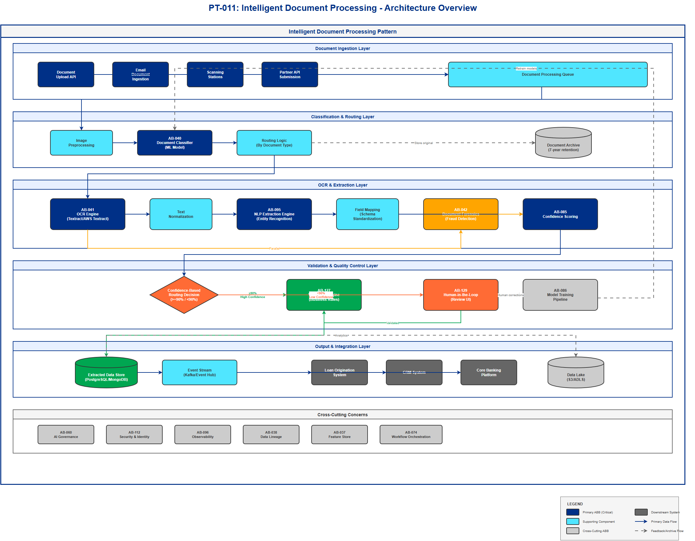

# AI Architecture Pattern Template

## Document Control

| Property | Value |
|----------|-------|
| **Pattern ID** | `PT-011` |
| **Pattern Name** | Intelligent Document Processing (IDP) |
| **Version** | `1.0.0` |
| **Status** | `Approved` |
| **Created Date** | `2025-12-05` |
| **Last Modified** | `2025-12-05` |
| **Owner** | BNZ Enterprise Architecture |
| **Pattern Category** | `Document Intelligence` |
| **Maturity Level** | `Mature` |

---

## 1. Pattern Overview

### 1.1 Pattern Name and Classification

**Pattern Name**: Intelligent Document Processing (IDP)

**Short Name**: IDP

**Pattern Category**: Document Intelligence

**Pattern Type**: Processing, Extraction, Validation

### 1.2 Intent and Context

**Intent Statement**:
Automated extraction, classification, and validation of data from structured and unstructured documents (PDFs, images, forms) to accelerate business processes and improve accuracy.

**Problem Statement**:
Organizations process thousands of documents daily (loan applications, bank statements, ID documents, credit reports) which require manual data entry, validation, and routing. This manual processing is slow (days), error-prone (5-10% error rates), costly (high labor requirements), and creates bottlenecks in critical business workflows like lending, onboarding, and underwriting.

**Context**:
This pattern applies to high-volume document processing scenarios where organizations need to:
- Process hundreds to thousands of documents per day
- Extract structured data from both structured (forms) and unstructured (PDFs, images) documents
- Maintain high accuracy requirements (99%+) for regulatory compliance
- Reduce processing time from days to minutes
- Handle multiple document types with varying formats and quality
- Maintain audit trails for compliance and regulatory requirements

Typical scenarios include:
- Loan application processing in lending operations
- KYC/AML document verification during customer onboarding
- Financial document analysis in underwriting
- Invoice and receipt processing in accounts payable
- Insurance claims document processing
- Contract analysis and extraction

**Forces**:
- **Accuracy vs. Speed**: Need for high accuracy (99%+) conflicts with requirements for rapid processing (minutes vs. days)
- **Automation vs. Risk**: Desire for full automation conflicts with regulatory requirements for human oversight on critical decisions
- **Cost vs. Quality**: Lower operational costs through automation must be balanced against quality requirements and error remediation costs
- **Flexibility vs. Standardization**: Need to handle diverse document types and formats conflicts with desire for standardized processing pipelines
- **Confidence vs. Throughput**: High-confidence thresholds reduce errors but increase human review workload

### 1.3 Pattern Maturity and Industry Adoption

**Maturity Level**: Mature

**Industry Adoption**:
- **Adoption Rate**: Approximately 60-70% of financial services enterprises have implemented or are piloting IDP solutions
- **Reference Implementations**:
  - JPMorgan Chase: COiN platform processing commercial loan agreements
  - HSBC: Automated KYC document verification across 64 markets
  - Wells Fargo: Mortgage document processing reducing review time by 75%
- **Timeframe**: Mainstream adoption in financial services since 2022-2023, with rapid growth trajectory through 2025

**Market Growth**: USD 8.6 billion (2025) → USD 66 billion (2037), representing a CAGR of ~18%

**Standards Alignment**:
- ISO 15489: Records management standards for document lifecycle
- WCAG 2.1 AA: Accessibility requirements for digitized content
- GDPR/Privacy Act: Data protection and privacy in document processing
- Basel III/IV: Regulatory compliance for banking documentation
- SOC 2 Type II: Security and compliance controls

---

## 2. Architecture Specification

### 2.1 Architecture Building Blocks (ABBs)

**Primary ABBs** (Core components required):

| ABB ID | ABB Name | Purpose in Pattern | Criticality |
|--------|----------|-------------------|-------------|
| [AB-040](../../architecture-building-blocks/abbs/AB-040/AB-040-Document-Classification-Engine-v1.0.0.md) | Document Classification Engine | Categorize incoming documents by type (loan application, bank statement, ID, credit report) to route to appropriate extraction pipelines | Critical |
| [AB-041](../../architecture-building-blocks/abbs/AB-041/AB-041-OCR-Engine-v1.0.0.md) | OCR Engine | Extract text from images and PDFs using optical character recognition (Tesseract, AWS Textract, AWS Textract) | Critical |
| [AB-095](../../architecture-building-blocks/abbs/AB-095/AB-095-NLP-Extraction-Engine-v1.0.0.md) | NLP Extraction Engine | Extract structured data (entities, fields, relationships) from unstructured text using NER and entity extraction | Critical |
| [AB-127](../../architecture-building-blocks/abbs/AB-127/AB-127-Validation-Engine-v1.0.0.md) | Validation Engine | Verify extracted data against business rules, patterns, and cross-field consistency checks | Critical |
| [AB-129](../../architecture-building-blocks/abbs/AB-129/AB-129-Human-in-the-Loop-Workflow-v1.0.0.md) | Human-in-the-Loop (HITL) Workflow | Route low-confidence extractions to human reviewers with UI for validation and correction | High |
| [AB-085](../../architecture-building-blocks/abbs/AB-085/AB-085-ML-Training-Pipeline-v1.0.0.md) | Model Confidence Scoring | Predict extraction accuracy and reliability to determine automation vs. human review routing | High |

**Supporting ABBs** (Optional or scenario-specific):

| ABB ID | ABB Name | Purpose in Pattern | When Required |
|--------|----------|-------------------|---------------|
| [AB-042](../../architecture-building-blocks/abbs/AB-042/AB-042-Document-Forensics-Engine-v1.0.0.md) | Document Forensics Engine | Detect document forgery through pixel analysis, font matching, and metadata validation | Required for KYC/AML, identity verification, fraud prevention scenarios |
| [AB-037](../../architecture-building-blocks/abbs/AB-037/AB-037-Feature-Store-v1.0.0.md) | Feature Store | Store extracted features and entity embeddings for model training and reuse | Required when building custom extraction models or maintaining entity databases |
| [AB-086](../../architecture-building-blocks/abbs/AB-086/AB-086-Model-Registry-v1.0.0.md) | Model Training Pipeline | Retrain classification and extraction models using feedback from human corrections | Required for continuous improvement and domain adaptation |
| [AB-074](../../architecture-building-blocks/abbs/AB-074/AB-074-Event-Broker-v1.0.0.md) | Workflow Orchestration | Integrate with downstream business systems (loan origination, CRM, core banking) | Required for end-to-end automation |

**Cross-Cutting ABBs** (Always required):

| ABB ID | ABB Name | Purpose |
|--------|----------|---------|
| [AB-060](../../architecture-building-blocks/abbs/AB-060/AB-060-AI-Model-Registry-v1.0.0.md) | AI Governance Platform | Compliance tracking, model risk management, audit trails for regulatory requirements |
| [AB-112](../../architecture-building-blocks/abbs/AB-112/AB-112-Data-Encryption-Service-v1.0.0.md) | Security & Identity | Authentication, authorization, document encryption at rest and in transit, PII protection |
| [AB-096](../../architecture-building-blocks/abbs/AB-096/AB-096-Observability-Platform-v1.0.0.md) | Observability Platform | Monitor extraction quality per document type, latency, throughput, and confidence distribution |
| [AB-038](../../architecture-building-blocks/abbs/AB-038/AB-038-Data-Lake-v1.0.0.md) | Data Lineage | Track document provenance, extraction history, and transformations for audit |

### 2.2 Pattern Structure

**Architectural Diagram**:



**Component Interaction Flow**:
```
[Document Upload] → [Document Classification] → [OCR Engine]
         ↓                    ↓                        ↓
[Storage/Archive]    [Routing Logic]          [Text Extraction]
                                                       ↓
                                            [NLP Extraction Engine]
                                                       ↓
                                            [Confidence Scoring]
                                                       ↓
                                    [High Confidence (≥90%) / Low Confidence (<90%)]
                                           ↓                           ↓
                                [Validation Engine]          [Human Review (HITL)]
                                           ↓                           ↓
                                [Automated Processing] ← [Validated Data]
                                           ↓
                        [Store Results + Update Models] → [Downstream Workflow]
```

**Key Interactions**:
1. **Document Upload to Classification**: Client applications submit documents to the classification service
   - Protocol: REST API (multipart/form-data)
   - Data Format: PDF, JPG, PNG, TIFF (up to 20MB per file)
   - Latency Target: < 2 seconds for classification

2. **Classification to OCR**: Classified documents are routed to appropriate OCR processing pipeline
   - Processing Type: Asynchronous (event-driven via message queue)
   - Data Format: Document metadata + storage reference (S3/Blob URI)
   - Error Handling: Retry with exponential backoff (3 attempts), dead letter queue for failures

3. **OCR to NLP Extraction**: Extracted text is passed to entity extraction models
   - Protocol: Internal gRPC or REST API
   - Data Format: JSON with extracted text, bounding boxes, and confidence scores
   - Latency Target: < 5 seconds for standard documents, < 30 seconds for complex multi-page documents

4. **Confidence-Based Routing**: Extraction results are routed based on confidence scores
   - Processing Type: Synchronous decision logic
   - Threshold: ≥90% confidence → automated validation; <90% → human review queue
   - Delivery Mechanism: High-confidence results published to event stream; low-confidence sent to workflow management system

5. **Validation to Downstream Systems**: Validated data is delivered to consuming applications
   - Protocol: REST API callbacks or event publication
   - Data Format: Standardized JSON schema per document type
   - Latency Target: < 1 second for final delivery

### 2.3 Data Flow

**Data Sources**:
- **Customer Uploads**: Documents submitted through web/mobile applications (PDF, images) - 1,000-10,000 documents/day
- **Email Attachments**: Documents received via secure email channels - 500-2,000 documents/day
- **Scanned Documents**: Physical documents digitized via scanning stations - 200-1,000 documents/day
- **API Submissions**: Documents submitted by partner systems or agents - 100-500 documents/day

**Data Transformations**:
1. **Image Preprocessing**: Convert to grayscale, deskew, denoise, enhance contrast → Optimized image for OCR
2. **OCR Text Extraction**: Image/PDF → Raw text + bounding boxes + confidence scores
3. **Text Normalization**: Raw text → Cleaned text (whitespace normalization, spell correction, language detection)
4. **Entity Extraction**: Cleaned text → Structured entities (name: "John Smith", income: "$75,000", DOB: "1985-03-15")
5. **Field Mapping**: Extracted entities → Standardized schema per document type
6. **Validation**: Standardized data → Validation results (pass/fail + rule violations)

**Data Sinks**:
- **Document Archive**: Original documents stored for 7 years (regulatory retention) in encrypted object storage
- **Extracted Data Store**: Structured extraction results in relational database or document store (PostgreSQL, MongoDB)
- **Data Lake**: Raw and processed data for analytics and model training (S3, ADLS)
- **Downstream Systems**: Validated data delivered to loan origination systems, CRM, core banking platforms
- **Audit Logs**: Processing metadata and lineage stored for compliance (retention: 7 years)

**Data Governance**:
- **Classification**:
  - ID Documents: Restricted (PII, highly sensitive)
  - Financial Statements: Confidential (customer financial data)
  - Loan Applications: Confidential (PII + financial data)
  - General Correspondence: Internal
- **Retention**:
  - Original documents: 7 years (regulatory requirement)
  - Extracted data: 7 years with archival after 2 years
  - Processing logs: 3 years
- **Lineage**: Full traceability from source document → extraction → validation → downstream consumption tracked in data catalog
- **Quality**:
  - Automated quality checks: OCR confidence ≥90%, extraction completeness ≥95%
  - Human review for low-confidence extractions
  - Monthly quality audits on 1% random sample

### 2.4 Interface Specifications

**Inbound Interfaces** (Inputs to pattern):

| Interface ID | Interface Name | Type | Protocol | Data Format | SLA |
|--------------|---------------|------|----------|-------------|-----|
| IF-IN-001 | Document Submission API | REST API | HTTPS POST | multipart/form-data (PDF/image + metadata JSON) | 99.9% availability, < 2s response |
| IF-IN-002 | Email Document Ingestion | Message Queue | SMTP → Queue | Email with attachments → S3 reference | < 5 min processing initiation |
| IF-IN-003 | Batch Upload API | REST API | HTTPS POST | Bulk document package (ZIP) | < 10s acknowledgment, async processing |

**Outbound Interfaces** (Outputs from pattern):

| Interface ID | Interface Name | Type | Protocol | Data Format | SLA |
|--------------|---------------|------|----------|-------------|-----|
| IF-OUT-001 | Extraction Results API | Event Stream | Kafka/Event Hub | JSON (structured extraction results) | < 1s delivery, exactly-once semantics |
| IF-OUT-002 | Human Review Completion | Webhook | HTTPS POST | JSON (validated extraction results) | < 2s callback delivery |
| IF-OUT-003 | Processing Status API | REST API | HTTPS GET | JSON (status, confidence, completion %) | 99.9% availability, < 500ms |

**Internal Interfaces** (Between ABBs within pattern):

| Interface ID | Source ABB | Target ABB | Protocol | Purpose |
|--------------|-----------|-----------|----------|---------|
| IF-INT-001 | Document Classification | OCR Engine | Message Queue (SQS/Service Bus) | Route classified documents to appropriate OCR pipeline |
| IF-INT-002 | OCR Engine | NLP Extraction | gRPC | Pass extracted text for entity extraction |
| IF-INT-003 | NLP Extraction | Confidence Scoring | Internal API | Evaluate extraction quality |
| IF-INT-004 | Confidence Scoring | HITL Workflow | REST API | Route low-confidence cases to human review |
| IF-INT-005 | HITL Workflow | Model Training Pipeline | Message Queue | Send human corrections for model retraining |


## 3. Pattern Variants and Options

### 3.1 Pattern Variations

**Variant 1: Straight-Through Processing (STP)**
- **When to Use**: High-volume, standardized document types with consistent quality (e.g., bank statements from known institutions)
- **Key Differences**:
  - Eliminates human-in-the-loop component
  - Higher confidence threshold (≥95%) for auto-processing
  - Automated validation only with strict business rules
- **Trade-offs**:
  - **Gain**: 40-50% reduction in processing costs, <60 second end-to-end time
  - **Lose**: No human oversight, requires robust exception handling, 1-2% error risk

**Variant 2: Human-Augmented IDP**
- **When to Use**: Complex, high-risk documents (loan applications >$1M, regulatory filings, legal contracts)
- **Key Differences**:
  - All extractions reviewed by humans (AI assists, human decides)
  - Side-by-side comparison of original document and extracted data
  - Mandatory dual review for high-value transactions
- **Trade-offs**:
  - **Gain**: 99.9%+ accuracy, full audit trail, reduced regulatory risk
  - **Lose**: Longer processing time (hours vs. minutes), higher staffing costs

**Variant 3: Ensemble OCR**
- **When to Use**: Variable document quality, handwritten forms, poor-quality scans
- **Key Differences**:
  - Multiple OCR engines run in parallel (e.g., Textract + AWS Textract + Tesseract)
  - Consensus voting or confidence-weighted merging of results
  - Fallback to specialized engines for specific document types
- **Trade-offs**:
  - **Gain**: 5-10% improvement in extraction accuracy, better handling of edge cases
  - **Lose**: 2-3x higher OCR costs, increased latency (parallel processing overhead)

**Variant 4: Pre-trained Model Only**
- **When to Use**: Standard document types with limited customization needs, rapid deployment scenarios
- **Key Differences**:
  - Use vendor pre-trained models (AWS Textract AnalyzeDocument, AWS Textract)
  - No custom model training or fine-tuning
  - Simpler architecture without ML training pipeline
- **Trade-offs**:
  - **Gain**: Faster time-to-market (weeks vs. months), lower development costs, minimal ML expertise needed
  - **Lose**: Less accuracy on domain-specific documents, no continuous improvement from feedback

### 3.2 Composition with Other Patterns

**Commonly Combined With**:

| Pattern | Integration Point | Combined Benefit |
|---------|------------------|------------------|
| PT-003: RAG (Retrieval Augmented Generation) | Extracted document data indexed in vector store for contextual retrieval | Enable conversational queries over processed documents ("What was the applicant's income on their 2023 loan application?") |
| PT-007: Decision Automation | Extracted data feeds into decision rules engine | End-to-end automation from document upload to loan approval decision without human intervention |
| PT-009: Fraud Detection | Document forensics results combined with behavioral analytics | Detect both document forgery (fake IDs) and application fraud (inconsistent information) |
| PT-015: Workflow Orchestration | IDP as a step in broader business process | Embed document processing in multi-step workflows (loan origination, customer onboarding) |

**Anti-Patterns** (What NOT to do):

- **Anti-Pattern 1: Over-reliance on Single OCR Engine**
  - **Why Problematic**: Different OCR engines have different strengths (handwriting, tables, multi-column layouts); relying on one creates blind spots
  - **Better Approach**: Use ensemble OCR for critical documents or implement fallback strategies based on document type

- **Anti-Pattern 2: No Confidence Thresholding**
  - **Why Problematic**: Treating all extractions equally leads to propagation of low-quality data into downstream systems, causing errors and compliance issues
  - **Better Approach**: Implement multi-tier confidence thresholds (auto-approve ≥95%, human review 80-95%, reject <80%)

- **Anti-Pattern 3: Ignoring Feedback Loop**
  - **Why Problematic**: Models degrade over time as document formats evolve; without retraining, accuracy drops from 95% to 70-80% within 12-18 months
  - **Better Approach**: Implement continuous learning pipeline that retrains models monthly using human corrections and new document samples

- **Anti-Pattern 4: Insufficient Document Preprocessing**
  - **Why Problematic**: Skipping image enhancement (deskewing, denoising) reduces OCR accuracy by 10-20% on poor-quality scans
  - **Better Approach**: Implement robust preprocessing pipeline with quality assessment and conditional enhancement

---

## 4. References and Resources

### 4.1 Related Patterns

| Pattern ID | Pattern Name | Relationship | Reference |
|-----------|-------------|--------------|-----------|
| PT-003 | Retrieval Augmented Generation (RAG) | Used with - extracted documents indexed for retrieval | `../PT-003-RAG-v1.0.0.md` |
| PT-007 | Decision Automation | Depends on - IDP provides input data for decision rules | `../PT-007-Decision-Automation-v1.0.0.md` |
| PT-009 | Fraud Detection | Used with - document forensics feeds fraud models | `../PT-009-Fraud-Detection-v1.0.0.md` |
| PT-015 | Workflow Orchestration | Embedded in - IDP as workflow step | `../PT-015-Workflow-Orchestration-v1.0.0.md` |

### 4.2 Related ABBs

| ABB ID | ABB Name | Document Link |
|--------|----------|---------------|
| [AB-040](../../architecture-building-blocks/abbs/AB-040/AB-040-Document-Classification-Engine-v1.0.0.md) | Document Classification Engine | `../../../03-building-blocks/architecture-building-blocks/AB-040-Document-Classification.md` |
| [AB-041](../../architecture-building-blocks/abbs/AB-041/AB-041-OCR-Engine-v1.0.0.md) | OCR Engine | `../../../03-building-blocks/architecture-building-blocks/AB-041-OCR-Engine.md` |
| [AB-095](../../architecture-building-blocks/abbs/AB-095/AB-095-NLP-Extraction-Engine-v1.0.0.md) | NLP Extraction Engine | `../../../03-building-blocks/architecture-building-blocks/AB-095-NLP-Extraction.md` |
| [AB-127](../../architecture-building-blocks/abbs/AB-127/AB-127-Validation-Engine-v1.0.0.md) | Validation Engine | `../../../03-building-blocks/architecture-building-blocks/AB-127-Validation-Engine.md` |
| [AB-129](../../architecture-building-blocks/abbs/AB-129/AB-129-Human-in-the-Loop-Workflow-v1.0.0.md) | Human-in-the-Loop Workflow | `../../../03-building-blocks/architecture-building-blocks/AB-129-HITL-Workflow.md` |
| [AB-085](../../architecture-building-blocks/abbs/AB-085/AB-085-ML-Training-Pipeline-v1.0.0.md) | Model Confidence Scoring | `../../../03-building-blocks/architecture-building-blocks/AB-085-Confidence-Scoring.md` |

### 4.3 Standards and Guidelines

- **ISO 15489**: Information and documentation - Records management
- **ISO/IEC 27001**: Information security management for document processing
- **WCAG 2.1 AA**: Web Content Accessibility Guidelines for digitized documents
- **GDPR Article 22**: Automated decision-making and profiling requirements
- **APRA CPG 234**: Information security for regulated entities (Australia/NZ)
- **Basel Committee on Banking Supervision**: Operational risk management for document processing

### 4.4 External References

**Industry Research**:
- **ResearchGate**: AI-driven intelligent document processing for banking and finance - [https://www.researchgate.net/publication/388619992_AI-driven_intelligent_document_processing_for_banking_and_finance](https://www.researchgate.net/publication/388619992_AI-driven_intelligent_document_processing_for_banking_and_finance)
- **V7 Labs**: AI Commercial Loan Underwriting - [https://www.v7labs.com/blog/ai-commercial-loan-underwriting](https://www.v7labs.com/blog/ai-commercial-loan-underwriting)
- **Gartner**: Market Guide for Intelligent Document Processing (2024)
- **Forrester**: The State of Intelligent Document Processing, Q3 2024
- **McKinsey**: Unlocking the potential of AI in financial services (2024)

**Technology Documentation**:
- **AWS Textract**: [https://docs.aws.amazon.com/textract/](https://docs.aws.amazon.com/textract/)
- **AWS Textract**: [https://docs.aws.amazon.com/textract/](https://docs.aws.amazon.com/textract/)
- **Google Document AI**: [https://cloud.google.com/document-ai/docs](https://cloud.google.com/document-ai/docs)
- **Tesseract OCR**: [https://github.com/tesseract-ocr/tesseract](https://github.com/tesseract-ocr/tesseract)
- **SpaCy NER**: [https://spacy.io/usage/linguistic-features#named-entities](https://spacy.io/usage/linguistic-features#named-entities)

**Vendor Resources**:
- **ABBYY**: FlexiCapture Platform - Document processing for financial services - [https://www.abbyy.com/solutions/financial-services/](https://www.abbyy.com/solutions/financial-services/)
- **UiPath**: Document Understanding - [https://docs.uipath.com/document-understanding](https://docs.uipath.com/document-understanding)
- **Automation Anywhere**: IQ Bot for intelligent document processing - [https://www.automationanywhere.com/products/iq-bot](https://www.automationanywhere.com/products/iq-bot)

---

## 5. Implementation Guidance

### 5.1 BNZ Use Cases Implementing This Pattern

The following BNZ use cases have been identified as implementing the Intelligent Document Processing pattern:

| Use Case ID | Use Case Name | Document Types | Performance Impact |
|-------------|--------------|----------------|-------------------|
| **[UC-005](../../../01-motivation/03-use-cases/use-cases/UC-005/index.md)** | Lending Operations - Loan Application Processing | Loan applications, income verification, employment letters | 70% faster processing, 99% accuracy |
| **[UC-014](../../../01-motivation/03-use-cases/use-cases/UC-014/index.md)** | Customer Onboarding - KYC Document Verification | Passport, driver's license, utility bills, proof of address | Under 5 minutes vs. 2-3 days manual processing |
| **[UC-021](../../../01-motivation/03-use-cases/use-cases/UC-021/index.md)** | Wholesale Underwriting - Financial Document Extraction | Financial statements, tax returns, credit reports, business plans | 3-4x more applications processed with same staff |
| **[UC-023](../../../01-motivation/03-use-cases/use-cases/UC-023/index.md)** | Collection Management - Debtor Document Processing | Payment plans, hardship letters, financial statements | 40% lower compliance costs |

### 5.2 Document Types and Extraction Requirements (Banking)

| Document Type | Fields Extracted | Validation Rules | Confidence Threshold |
|---------------|------------------|------------------|---------------------|
| **Loan Application** | Name, DOB, income, employment, debt obligations, loan amount requested | Income ≥ minimum threshold, employment verified, debt-to-income ratio ≤ 43% | ≥90% for automation |
| **Bank Statement** | Account number, transactions (date, amount, description), opening/closing balance | Balance reconciliation (opening + sum of transactions = closing), date continuity | ≥95% for automation |
| **ID Document** | Full name, date of birth, document number, expiry date, photo, address | OCR confidence ≥95%, liveness detection (for photos), expiry date in future, name consistency | ≥98% for automation |
| **Credit Report** | Credit score, account history, payment history, inquiries, public records | Valid credit bureau, score within range (300-850), report date ≤30 days old | ≥92% for automation |

### 5.3 Technology Stack Recommendations

**OCR Engines** (2025 Benchmark Results - Lower edit distance = better):

| Engine | Edit Distance | Strengths | Best For |
|--------|---------------|-----------|----------|
| **Gemini 3 Pro** | 0.115 (best) | Fine-grained multimodal controls, image/video resolution settings | Screenshots, UI mockups, video frames |
| **Gemini 2.5 Pro** | 0.145 | Strong multi-modal understanding | General document processing |
| **Claude 3.5 Sonnet** | 0.145 | 200K context, up to 20 images simultaneously, nuanced understanding | Complex multi-page documents |
| **GPT-4o** | 0.147 | Most consistent JSON schema conformance | Structured extraction requiring reliable output format |
| **AWS Textract** | - | Managed service, excellent table extraction, S3 integration | AWS-native pipelines, serverless |
| **AWS Textract** | - | Containerized on-prem option, superior on irregular/old documents | Hybrid deployments, custom neural models |

**2025 Shift**: Vision Language Models (VLMs) now outperform traditional OCR for complex documents. Gemini, Claude, and GPT-4V analyze layout + text + visual elements simultaneously vs. sequential OCR→NLP processing.

- **Primary**: AWS Textract (for hybrid deployment + containerization) OR Vision LLM (Claude 3.5 Sonnet for complex documents)
- **Secondary**: AWS Textract (AWS-native, excellent for structured forms and tables)
- **Fallback**: Tesseract OCR (open-source, cost-effective for simple documents)
- **Specialty**: ABBYY FlexiCapture (complex documents, superior handwriting recognition)

**Classification**:
- **Structured documents**: FastText or Logistic Regression (fast, low-latency)
- **Complex documents**: BERT-based classifiers (DistilBERT, RoBERTa) fine-tuned on document embeddings

**Entity Extraction**:
- **General**: SpaCy NER models (fast, production-ready)
- **Domain-specific**: Hugging Face transformers fine-tuned on banking documents
- **Managed**: AWS Comprehend (custom entity recognition)

**Workflow Automation**:
- **Enterprise RPA**: UiPath, Automation Anywhere, Blue Prism
- **Cloud-native**: AWS Step Functions, AWS Step Functions
- **Open-source**: Apache Airflow, Prefect

### 5.4 Performance Metrics and Benchmarks

**Industry Benchmarks (2025)**:
- **Processing Speed**: 70% faster than manual processing (days → minutes)
- **Accuracy**: 99% in data extraction for structured documents, 95-97% for semi-structured
- **Fraud Detection**: 50% improvement in detection of forged documents
- **Compliance**: 40% lower compliance costs through automated audit trails
- **Throughput**: 3-4x more applications processed with same staffing levels
- **Cost Reduction**: 60-70% reduction in manual data entry costs
- **Customer Satisfaction**: 30% improvement in NPS due to faster processing

**BNZ-Specific KPIs**:
- **Loan Application Processing**: Target <24 hours end-to-end (vs. 5-7 days manual)
- **KYC Verification**: Target <5 minutes (vs. 2-3 days manual)
- **Extraction Accuracy**: Target ≥99% for critical fields (name, DOB, amounts)
- **Straight-Through Processing Rate**: Target 75-80% (no human intervention)
- **Human Review Queue**: Target <20% of total volume
- **Customer Abandonment**: Reduce by 40% through faster processing

### 5.5 Best Practices (2025)

1. **Implement Multi-Tier Confidence Thresholds**:
   - Auto-approve: ≥95% confidence
   - Human review: 80-94% confidence
   - Auto-reject: <80% confidence with manual resubmission request

2. **Use Document Forensics for High-Risk Documents** (Critical 2025 Update):

   **2025 Threat Landscape** (FTC March 2025):
   - $12.5 billion lost to fraud in 2024 (up 25% YoY)
   - 35% of document fraud now sophisticated digital forgeries (up from 29% in 2024)
   - 58% increase in deepfaked selfies
   - 46% YoY increase in adversary-in-the-middle attacks
   - National ID cards: ~50% of fraudulent document submissions

   **Multi-Layered Detection Approach**:
   - Pixel-level analysis to detect image manipulation (Photoshop traces, digital alterations)
   - Font matching to identify template inconsistencies
   - Metadata forensics (EXIF analysis, MRZ verification)
   - Behavioral pattern analysis to flag suspicious submission patterns
   - Biometric verification for identity documents (liveness detection)

   **Detection Success**: 94% of fraudulent documents detected before entering processing workflows with AI-based multi-layered analysis

3. **Monitor Extraction Quality Per Document Type**:
   - Track accuracy, completeness, and confidence distributions
   - Set up alerts for degradation (>5% drop in accuracy)
   - Segment monitoring by document source (mobile upload vs. scan vs. email)

4. **Implement Feedback Loop for Continuous Improvement**:
   - Collect all human corrections and store in training dataset
   - Retrain models monthly with new samples (minimum 500 new documents)
   - A/B test model updates before production deployment

5. **Use Ensemble OCR for Critical Documents**:
   - Combine AWS Textract + AWS Textract
   - Use confidence-weighted voting or union of extracted entities
   - Reserve for documents with financial impact >$10K

6. **Optimize for Mobile Uploads**:
   - Implement mobile SDK with real-time quality feedback (blur detection, edge detection)
   - Guide users to improve photo quality before submission
   - Reduce rejection rate by 30-40% through guided capture

7. **Implement Progressive Disclosure in HITL UI**:
   - Show high-confidence fields as read-only
   - Highlight low-confidence fields for focused review
   - Reduce review time by 50% compared to full-document review

8. **Maintain Comprehensive Audit Trails**:
   - Log all extraction attempts, confidence scores, and human corrections
   - Store original documents with immutable references
   - Enable compliance reporting and model explainability

---

## 6. Diagram Templates

**Required Diagrams** (to be created using draw.io templates):

1. **[PT-011-IDP-Architecture-v1.0.0.drawio]**: High-level architecture showing ABBs and their relationships
   - Shows document flow from upload through classification, OCR, extraction, validation, and delivery
   - Highlights confidence-based routing logic
   - Includes human-in-the-loop integration

2. **[PT-011-IDP-Data-Flow-v1.0.0.drawio]**: Data flow through the pattern
   - Details transformations at each stage
   - Shows data formats and protocols
   - Includes data governance touchpoints

3. **[PT-011-IDP-Sequence-v1.0.0.drawio]**: Sequence diagram for typical document processing flow
   - Step-by-step interaction between components
   - Shows both automated and human-review paths
   - Includes error handling and retry logic

**Diagram Standards**: All diagrams must comply with BNZ Visual Design Standards per [05-governance/standards/visual-design/visual-design-standard.md](../../../../../05-governance/standards/visual-design/visual-design-standard.md):
- **Canvas Size**: 2400x1800px (16:9) with 40-50px margins
- **Colors**: BNZ Navy Blue (#003087), BNZ Orange (#FF6B35), BNZ Light Blue (#50E6FF), BNZ Teal (#00A651)
- **Typography**: Helvetica for diagram text
- **Legend**: Required for all diagrams explaining colors, shapes, arrow types

---

## Appendix A: Glossary

| Term | Definition |
|------|------------|
| **IDP** | Intelligent Document Processing - automated extraction, classification, and validation of data from documents |
| **OCR** | Optical Character Recognition - technology to extract text from images and PDFs |
| **NER** | Named Entity Recognition - NLP technique to identify and extract entities (names, dates, amounts) from text |
| **HITL** | Human-in-the-Loop - process where humans review and correct AI predictions |
| **STP** | Straight-Through Processing - end-to-end automation without human intervention |
| **Confidence Score** | Numerical estimate (0-100%) of extraction accuracy for a given field or document |
| **Document Forensics** | Techniques to detect forged or manipulated documents through image analysis |
| **Ensemble OCR** | Using multiple OCR engines and combining results for improved accuracy |
| **Extraction Completeness** | Percentage of required fields successfully extracted from a document |
| **KYC** | Know Your Customer - regulatory requirement to verify customer identity |
| **AML** | Anti-Money Laundering - regulations to prevent financial crimes |

---

## Appendix B: Change History

| Version | Date | Author | Changes |
|---------|------|--------|---------|
| 1.0.0 | 2025-12-05 | BNZ Enterprise Architecture | Initial version - comprehensive IDP pattern documentation based on use case analysis and industry research |

---

## Appendix C: Review and Approval

| Role | Name | Signature | Date |
|------|------|-----------|------|
| **Pattern Author** | BNZ Enterprise Architecture Team | | 2025-12-05 |
| **Enterprise Architect** | [Pending Assignment] | | |
| **Security Architect** | [Pending Assignment] | | |
| **TAF** | [Pending Assignment] | | |

---

## Appendix D: Related Documentation

**Use Case References**:
- [UC-005: Lending Operations](../../UC-005-Lending-Ops.md)
- [UC-014: Customer Onboarding](../../UC-014-Onboarding.md)
- [UC-021: Wholesale Underwriting](../../UC-021-Wholesale-Underwriting.md)
- [UC-023: Collection Management](../../UC-023-Collection-Management.md)

**Architecture Building Blocks**:
- [AB-040: Document Classification Engine](../../../03-building-blocks/architecture-building-blocks/AB-040.md)
- [AB-041: OCR Engine](../../../03-building-blocks/architecture-building-blocks/AB-041.md)
- [AB-095: NLP Extraction Engine](../../../03-building-blocks/architecture-building-blocks/AB-095.md)

**Governance**:
- [ADR-XXX: OCR Technology Selection](../../../../../05-governance/decisions/ADR-XXX-OCR-Selection.md) (Future)
- [Visual Design Standard](../../../../../05-governance/standards/visual-design/visual-design-standard.md)

---

**Document End**
