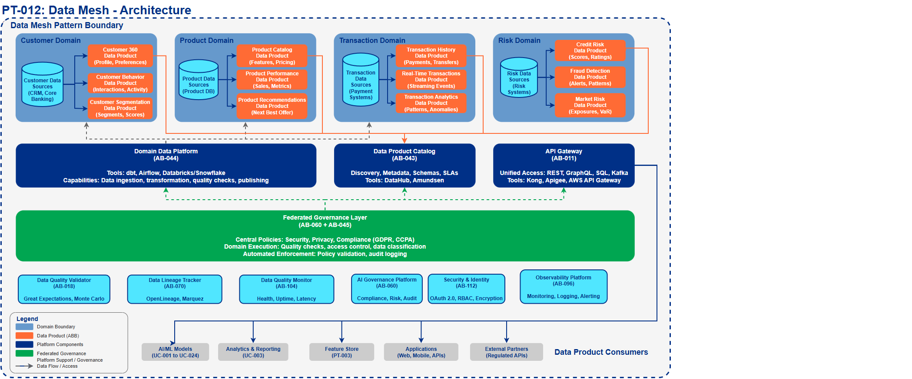
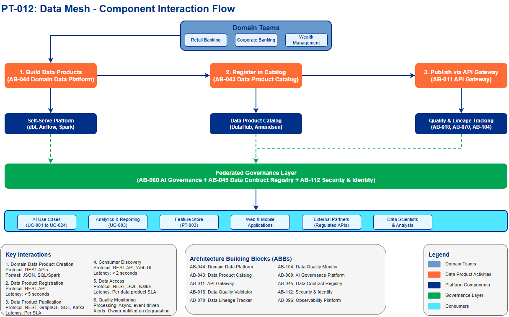

# Data Mesh Pattern

## Document Control

| Property | Value |
|----------|-------|
| **Pattern ID** | `PT-012` |
| **Pattern Name** | Data Mesh Pattern |
| **Version** | `1.0.0` |
| **Status** | `Approved` |
| **Created Date** | `2025-12-05` |
| **Last Modified** | `2025-12-07` |
| **Owner** | BNZ Enterprise Architecture |
| **Pattern Category** | `Data` |
| **Maturity Level** | `Emerging` |

---

## 1. Pattern Overview

### 1.1 Pattern Name and Classification

**Pattern Name**: Data Mesh Pattern

**Short Name**: Data Mesh

**Pattern Category**: Data

**Pattern Type**: Data Architecture, Organizational

### 1.2 Intent and Context

**Intent Statement**:
Enable domain-oriented decentralized data ownership with federated governance, treating data as a product to improve discoverability, quality, and accessibility across the enterprise.

**Problem Statement**:
Traditional centralized data architectures (data lakes, data warehouses) create bottlenecks where a central data team becomes overwhelmed with requests from multiple business domains. This results in:
- Long lead times for data access (weeks to months)
- Data quality issues (central team lacks domain context)
- Data silos (domains can't access each other's data)
- Scaling challenges (central team can't keep up with demand)
- Limited domain autonomy (domains dependent on central team)

**Context**:
Large enterprises with multiple business domains (Retail Banking, Corporate Banking, Wealth Management) face challenges when attempting to centralize all data responsibilities. The Data Mesh pattern shifts from a centralized model to a decentralized approach where domain teams own and publish their data as products, while a platform team provides self-serve infrastructure and federated governance ensures consistency.

**Forces**:
- **Domain Autonomy vs. Governance**: Domains need freedom to move quickly, but enterprise needs consistent standards
- **Speed vs. Quality**: Fast data access vs. ensuring high data quality and compliance
- **Centralization vs. Decentralization**: Central control provides consistency, but creates bottlenecks
- **Technical Complexity vs. Usability**: Sophisticated platforms vs. easy-to-use tools for domain teams
- **Cost vs. Scalability**: Infrastructure costs increase with decentralization, but scalability improves

### 1.3 Pattern Maturity and Industry Adoption

**Maturity Level**: Emerging

**Industry Adoption**:
- **Adoption Rate**: Approximately 30-40% of large enterprises in financial services have begun data mesh initiatives as of 2025
- **Reference Implementations**:
  - JPMorgan Chase (enterprise data mesh implementation across banking divisions)
  - ING Bank (domain-oriented data products for retail and corporate banking)
  - Zalando (e-commerce data mesh with 100+ data products)
- **Timeframe**: Evolved from concept (2019) to experimental implementations (2022-2024) to production pattern (2025)

**Standards Alignment**:
- TOGAF 10: Domain-oriented architecture
- SAFe: Decentralized decision-making with centralized alignment
- DAMA-DMBOK: Data governance and data quality frameworks
- ISO 8000 Data Quality Standard
- GDPR and data privacy regulations (data ownership accountability)

---

## 2. Architecture Specification

### 2.1 Architecture Building Blocks (ABBs)

**Primary ABBs** (Core components required):

| ABB ID | ABB Name | Purpose in Pattern | Criticality |
|--------|----------|-------------------|-------------|
| [AB-043](../../architecture-building-blocks/abbs/AB-043/AB-043-Data-Product-Catalog-v1.0.0.md) | Data Product Catalog | Centralized discovery of all data products with SLAs, schemas, and metadata | Critical |
| [AB-044](../../architecture-building-blocks/abbs/AB-044/AB-044-Domain-Data-Platform-v1.0.0.md) | Domain Data Platform | Self-serve tools and infrastructure enabling domains to build and publish data products | Critical |
| [AB-011](../../architecture-building-blocks/abbs/AB-011/AB-011-API-Gateway-v1.0.0.md) | API Gateway | Unified access layer for consuming data products via REST, GraphQL, SQL, Kafka | Critical |
| [AB-018](../../architecture-building-blocks/abbs/AB-018/AB-018-Data-Quality-Validator-v1.0.0.md) | Data Quality Validator | Automated batch data quality checks and validation | High |
| [AB-070](../../architecture-building-blocks/abbs/AB-070/AB-070-Data-Lineage-Tracker-v1.0.0.md) | Data Lineage Tracker | Track data origin, transformations, and dependencies | High |
| [AB-104](../../architecture-building-blocks/abbs/AB-104/AB-104-Data-Quality-Monitor-v1.0.0.md) | Data Quality Monitor | Real-time data quality monitoring, health, uptime, and latency tracking | High |

**Supporting ABBs** (Optional or scenario-specific):

| ABB ID | ABB Name | Purpose in Pattern | When Required |
|--------|----------|-------------------|---------------|
| [AB-045](../../architecture-building-blocks/abbs/AB-045/AB-045-Data-Contract-Registry-v1.0.0.md) | Data Contract Registry | Formal agreements between data producers and consumers | When multiple consumers depend on same data product |
| [AB-038](../../architecture-building-blocks/abbs/AB-038/AB-038-Data-Lake-v1.0.0.md) | Data Lake | Scalable storage for domain-owned structured and unstructured data | For large-scale data storage |
| [AB-039](../../architecture-building-blocks/abbs/AB-039/AB-039-Data-Versioning-Service-v1.0.0.md) | Data Versioning Service | Version management and history for data products | When data versioning is required |

**Cross-Cutting ABBs** (Always required):

| ABB ID | ABB Name | Purpose |
|--------|----------|---------|
| [AB-060](../../architecture-building-blocks/abbs/AB-060/AB-060-AI-Model-Registry-v1.0.0.md) | AI Governance Platform | Compliance, risk management, audit for data products |
| [AB-112](../../architecture-building-blocks/abbs/AB-112/AB-112-Data-Encryption-Service-v1.0.0.md) | Security & Identity | Authentication, authorization, encryption for data access |
| [AB-096](../../architecture-building-blocks/abbs/AB-096/AB-096-Observability-Platform-v1.0.0.md) | Observability Platform | Monitoring, logging, alerting for data product health |

### 2.2 Pattern Structure

**Architectural Diagram**:

**Component Interaction Flow**:

**Key Interactions**:

1. **Domain Data Product Creation**: Domain team builds data product using self-serve platform
   - Protocol: Internal platform APIs (REST)
   - Data Format: JSON configuration, SQL/Spark transformations
   - Latency Target: N/A (asynchronous process)

2. **Data Product Registration**: Data product registered in catalog with metadata
   - Protocol: REST API to Data Product Registry
   - Data Format: JSON (schema, SLA, ownership, lineage)
   - Latency Target: < 5 seconds

3. **Data Product Publication**: Data product exposed via API Gateway for consumption
   - Protocol: REST, GraphQL, SQL, or Kafka (based on data product type)
   - Data Format: JSON, Parquet, Avro, CSV (domain-defined)
   - Latency Target: Based on SLA (batch: hours, streaming: seconds)

4. **Consumer Discovery**: Consumers search catalog and subscribe to data products
   - Protocol: REST API, Web UI
   - Data Format: JSON metadata
   - Latency Target: < 2 seconds for search results

5. **Data Access**: Consumers query/subscribe to data products
   - Protocol: REST API, SQL, Kafka streams
   - Data Format: JSON, Parquet, Avro (per data product spec)
   - Latency Target: Per data product SLA (e.g., < 100ms for API, < 1 hour for batch)

6. **Quality Monitoring**: Automated checks validate data quality continuously
   - Processing Type: Asynchronous, event-driven
   - Error Handling: Alert data product owner, mark product as degraded in catalog

### 2.3 Data Flow

**Data Sources**:
- **Domain Operational Systems**: Customer databases, transaction systems, CRM (owned by domain)
- **External Data Feeds**: Market data, credit bureau data, third-party APIs
- **Enterprise Data Lakes**: Historical data repositories (transitioned to domain ownership)

**Data Transformations**:

1. **Domain Data Ingestion**: Raw data → Domain staging area (Extract)
   - Performed by domain team using self-serve platform tools (Airflow, dbt, Spark)

2. **Data Product Curation**: Staging data → Clean, validated, documented data product (Transform)
   - Data quality checks applied (completeness, accuracy, timeliness)
   - Business logic applied (calculations, aggregations, joins)
   - Schema standardization and documentation

3. **Data Product Publishing**: Curated data → Published interface (Load)
   - Exposed via API Gateway or streaming platform
   - Metadata registered in catalog

**Data Sinks**:
- **Data Product API**: REST/GraphQL endpoints for synchronous access
- **Data Product Stream**: Kafka topics for real-time consumption
- **Data Product Database**: SQL interface for analytical queries
- **Data Product Files**: S3/ADLS files for batch processing

**Data Governance**:
- **Classification**: Defined by domain team (Public / Internal / Confidential / Restricted)
- **Retention**: Per data product policy (e.g., 7 years for financial transactions)
- **Lineage**: Tracked from source system → transformations → data product → consumers
- **Quality**: Automated checks defined in data product specification (99% completeness, < 1 hour latency, etc.)
- **Ownership**: Clear accountability (domain team owns data product lifecycle)
- **Access Control**: Role-based access control (RBAC) enforced at API Gateway

### 2.4 Interface Specifications

**Inbound Interfaces** (Inputs to pattern):

| Interface ID | Interface Name | Type | Protocol | Data Format | SLA |
|--------------|---------------|------|----------|-------------|-----|
| IF-IN-001 | Domain Data Source | Database Connection | JDBC/ODBC | SQL | Per domain system |
| IF-IN-002 | External Data Feed | API / File Transfer | REST / SFTP | JSON / CSV | Per vendor SLA |
| IF-IN-003 | Data Product Configuration | API | REST | JSON | < 5s registration |

**Outbound Interfaces** (Outputs from pattern):

| Interface ID | Interface Name | Type | Protocol | Data Format | SLA |
|--------------|---------------|------|----------|-------------|-----|
| IF-OUT-001 | Data Product API | REST API | HTTPS | JSON | Per data product SLA (e.g., < 100ms, 99.9% uptime) |
| IF-OUT-002 | Data Product Stream | Event Stream | Kafka | Avro / JSON | < 1s latency, 99.9% availability |
| IF-OUT-003 | Data Product SQL Interface | SQL Query | TLS | Parquet / ORC | < 5s for queries, 99% uptime |
| IF-OUT-004 | Data Product Metadata | Catalog API | REST | JSON | < 2s search, 99.9% uptime |

**Internal Interfaces** (Between ABBs within pattern):

| Interface ID | Source ABB | Target ABB | Protocol | Purpose |
|--------------|-----------|-----------|----------|---------|
| IF-INT-001 | AB-044 Domain Data Platform | AB-043 Data Product Catalog | REST | Register new data product |
| IF-INT-002 | AB-018 Data Quality Validator | AB-043 Data Product Catalog | REST | Update quality metrics |
| IF-INT-003 | AB-070 Data Lineage Tracker | AB-043 Data Product Catalog | REST | Publish lineage metadata |
| IF-INT-004 | AB-011 API Gateway | AB-038 Data Lake | JDBC / REST | Proxy data access requests |
| IF-INT-005 | AB-104 Data Quality Monitor | AB-043 Data Product Catalog | REST | Update health status |

---

## 3. Pattern Variants and Options

### 3.1 Pattern Variations

**Variant 1: Centralized Data Mesh (Hybrid)**
- **When to Use**: Transitioning from centralized data warehouse to data mesh
- **Key Differences**: Central platform team also acts as a domain for shared/enterprise data products (e.g., customer golden record)
- **Trade-offs**:
  - **Gain**: Easier migration path, leverages existing central team expertise
  - **Lose**: Still creates some central team bottleneck, less pure decentralization

**Variant 2: Federated Data Mesh**
- **When to Use**: Mature organizations with strong domain teams and clear boundaries
- **Key Differences**: Fully decentralized with minimal central platform team (infrastructure-only)
- **Trade-offs**:
  - **Gain**: Maximum domain autonomy, fastest time-to-market for data products
  - **Lose**: Risk of inconsistency without strong governance, higher learning curve for domains

**Variant 3: Event-Driven Data Mesh**
- **When to Use**: Real-time data products are primary use case (streaming analytics, fraud detection)
- **Key Differences**: Data products primarily exposed as Kafka streams rather than APIs/databases
- **Trade-offs**:
  - **Gain**: Low latency (milliseconds), event-driven architecture alignment
  - **Lose**: More complex for batch consumers, requires stream processing expertise

### 3.2 Composition with Other Patterns

**Commonly Combined With**:

| Pattern | Integration Point | Combined Benefit |
|---------|------------------|------------------|
| PT-003 Feature Store | Data products feed feature store as high-quality, curated data sources | Enables ML teams to discover and consume domain data products as features |
| PT-001 Enterprise AI Governance | Governance policies applied to data products via federated governance layer | Ensures data products meet compliance, privacy, and risk requirements |
| PT-007 Real-Time Streaming | Streaming data products published via Kafka, consumed by real-time ML models | Enables low-latency AI use cases (fraud detection, personalization) |
| PT-005 MLOps Pipeline | ML models consume data products for training/inference; model predictions published as data products | Creates closed-loop ML system with traceable data lineage |

**Anti-Patterns** (What NOT to do):

- **Anti-Pattern 1: Data Mesh Without Governance**
  - **Why Problematic**: Leads to ungoverned data chaos, compliance violations, inconsistent quality
  - **Better Approach**: Implement federated governance from day one with clear policies

- **Anti-Pattern 2: Central Team Building All Data Products**
  - **Why Problematic**: Defeats the purpose of data mesh; recreates central bottleneck
  - **Better Approach**: Central team builds platform and standards; domains build data products

- **Anti-Pattern 3: No Self-Serve Platform**
  - **Why Problematic**: Domains struggle with infrastructure complexity, slow adoption
  - **Better Approach**: Invest in self-serve tools (dbt, Airflow, data quality frameworks) first

- **Anti-Pattern 4: Over-Engineering Data Products**
  - **Why Problematic**: Domains spend months building perfect data products that never ship
  - **Better Approach**: Start with "good enough" data products, iterate based on consumer feedback

---

## 4. Implementation Guidance

### 4.1 Key Principles

**1. Domain-Oriented Ownership**
- Each business domain (Retail Banking, Corporate Banking, Wealth Management) owns its data
- Domain teams are accountable for data product quality, SLAs, and consumer support
- Organizational alignment: Data product owners embedded in domain teams

**2. Data as a Product**
- Treat data with product thinking: discoverability, usability, quality, SLAs
- Data products have clear ownership, documentation, versioning, and deprecation policies
- Consumer-centric design: APIs, schemas, and documentation designed for ease of use

**3. Self-Serve Infrastructure**
- Platform team provides tools and infrastructure for domains to build data products independently
- Low barrier to entry: templates, automation, guided workflows
- Example tools: dbt for transformations, Airflow for orchestration, Great Expectations for quality

**4. Federated Governance**
- Decentralized execution (domains build and own data products)
- Centralized standards (enterprise-wide policies for security, privacy, quality)
- Automated policy enforcement via platform (e.g., data classification tags required)

### 4.2 Data Product Components

Every data product MUST include the following components:

| Component | Description | Example |
|-----------|-------------|---------|
| **Data** | The actual data (batch or streaming) | Customer transactions for last 24 months |
| **SLA** | Quality guarantees and commitments | 99.9% uptime, < 1 hour refresh latency, 99% completeness |
| **API** | Access mechanism(s) for consumers | REST API (JSON), SQL interface (Snowflake), Kafka stream (Avro) |
| **Metadata** | Documentation, schema, lineage, ownership | Schema: customer_id (UUID), transaction_amount (DECIMAL), Lineage: CRM DB → ETL → Data Product |
| **Quality** | Automated validation and monitoring | Great Expectations tests: no nulls in customer_id, amount > 0 |
| **Ownership** | Accountable team and contact | Owner: Retail Banking Data Team, Contact: retail-data@bnz.co.nz |
| **Access Policy** | Who can consume and how | Role-based: All authenticated BNZ employees (read), Retail domain (read/write) |

### 4.3 When to Use

**Ideal Scenarios**:
- Large enterprises with multiple business domains (Retail, Corporate, Wealth)
- Data silos problem: domains cannot easily access each other's data
- Centralized data warehouse/lake failing to scale (long lead times, bottlenecks)
- Need for domain autonomy with governance (regulated industries)
- High data quality requirements with domain expertise needed

**Not Recommended For**:
- Small organizations with single domain (< 50 people)
- Simple analytics use cases (basic reporting from single source)
- Greenfield projects with no existing data infrastructure
- Organizations without clear domain boundaries

### 4.4 BNZ Use Cases

**Foundational Data Product** (Enables all use cases):
- **[UC-009](../../../01-motivation/03-use-cases/use-cases/UC-009/index.md): Data Products** - Core implementation of data mesh pattern

**Primary Consumers** (Direct dependency):
- **[UC-003](../../../01-motivation/03-use-cases/use-cases/UC-003/index.md): Analytics and Reporting** - Consumes data products for business intelligence
- **[UC-006](../../../01-motivation/03-use-cases/use-cases/UC-006/index.md): Hyper-Personalization** - Consumes customer behavior data products
- **[UC-010](../../../01-motivation/03-use-cases/use-cases/UC-010/index.md): SDLC** - Consumes code quality and deployment data products
- **[UC-015](../../../01-motivation/03-use-cases/use-cases/UC-015/index.md): Risk Functions** - Consumes risk data products (credit, operational, market)

**Indirect Consumers** (All 24 use cases):
- All AI use cases should consume data via data products, not direct database access
- Ensures consistent governance, quality, and lineage tracking
- Example: [UC-001](../../../01-motivation/03-use-cases/use-cases/UC-001/index.md) (Partnership Banking) consumes "Customer 360" data product instead of querying 10 different databases

### 4.5 Implementation Components

**Technology Stack** (2025 Recommendations):

**Data Product Catalog**:
- **DataHub** (LinkedIn open-source) - Modern metadata platform with data lineage
- **Amundsen** (Lyft open-source) - User-friendly data discovery
- **Alation** (Commercial) - Enterprise data catalog with AI-powered search
- **AWS Glue Catalog** (AWS-native) - Serverless metadata repository

**API Gateway**:
- **Kong** - Open-source API gateway with plugin ecosystem
- **Apigee** (Google Cloud) - Enterprise API management
- **AWS API Gateway** - Serverless, scalable API management

**Self-Serve Data Platform**:
- **Databricks** - Unified analytics platform (Spark, Delta Lake, MLflow)
- **Snowflake** - Cloud data warehouse with data sharing
- **AWS Lake Formation** - Managed data lake with governance
- **dbt** - SQL-based transformation tool (infrastructure-as-code)

**Data Quality**:
- **Great Expectations** - Python-based data validation framework
- **Monte Carlo** - Data observability and anomaly detection
- **Datafold** - Data diff and quality monitoring
- **Soda** - Data quality testing and monitoring

**Data Lineage**:
- **OpenLineage** - Open standard for data lineage
- **Marquez** (open-source) - Metadata service for lineage collection
- **DataHub** - Includes built-in lineage tracking

### 4.6 Best Practices (2025)

**Start Small, Expand Incrementally**:
- Begin with 1-2 pilot domains (e.g., Retail Banking, Corporate Banking)
- Build 3-5 high-value data products in each domain
- Learn, refine platform and governance, then expand to more domains

**Define Data Product Standards**:
- **SLA Template**: Define minimum SLAs (uptime, latency, quality thresholds)
- **Quality Checks**: Standardize data quality tests (Great Expectations templates)
- **API Patterns**: REST API standards (versioning, pagination, error handling)
- **Documentation**: Required metadata (schema, lineage, examples, changelog)

**Implement Federated Governance**:
- **Central Policies**: Data classification, retention, privacy (GDPR, CCPA)
- **Domain Execution**: Domains apply policies to their data products
- **Automated Enforcement**: Platform validates compliance (e.g., PII detection, encryption)

**Use Data Contracts**:
- Formal agreement between data producer (domain) and consumers
- Specifies: schema, SLA, breaking change policy, support model
- Example: "Customer 360" data product guarantees schema stability for 6 months

**Monitor Data Product Health**:
- Track SLA compliance: uptime (99.9%), latency (< 1 hour), quality (99% completeness)
- Alert on degradation: data product owner notified within 5 minutes
- Publish health dashboard: consumers can see real-time data product status

**Incentivize Data Product Ownership**:
- Make data product quality part of domain team OKRs/KPIs
- Recognize high-quality data products (e.g., "Data Product of the Quarter")
- Chargeback model: Consumers pay for data product usage (aligns incentives)

### 4.7 Migration Strategy

**Phase 1: Foundation (Months 1-3)**
- Select 1-2 pilot domains
- Deploy self-serve platform (dbt, Airflow, Snowflake/Databricks)
- Deploy data product catalog (DataHub or Amundsen)
- Define data product standards and templates

**Phase 2: Pilot (Months 4-6)**
- Build 3-5 data products per pilot domain
- Onboard 5-10 consumers (AI use cases, analytics teams)
- Implement federated governance policies
- Deploy data quality and lineage tracking

**Phase 3: Scale (Months 7-12)**
- Expand to 3-5 additional domains
- Build 20-30 total data products
- Transition existing centralized data pipelines to data mesh
- Establish data product support model (domain-owned)

**Phase 4: Optimize (Months 13+)**
- Continuous improvement based on consumer feedback
- Advanced features: data marketplace, monetization, cross-domain data products
- Automated data product generation (AI-assisted)

---

## 5. Quality Attributes and NFRs

### 5.1 Performance

| Metric | Target | Measurement |
|--------|--------|-------------|
| **API Latency** | < 100ms (p95) | Per data product SLA |
| **Batch Refresh** | < 1 hour | Time from source update to data product availability |
| **Catalog Search** | < 2 seconds | Time to search and retrieve data product metadata |
| **Stream Latency** | < 1 second | End-to-end latency for streaming data products |

### 5.2 Availability

| Metric | Target | Measurement |
|--------|--------|-------------|
| **Data Product Uptime** | 99.9% | Per data product SLA (measured monthly) |
| **Catalog Availability** | 99.95% | Catalog search and metadata APIs available |
| **Platform Availability** | 99.9% | Self-serve platform tools and infrastructure |

### 5.3 Scalability

| Dimension | Target | Approach |
|-----------|--------|----------|
| **Number of Data Products** | 100+ | Horizontal scaling of catalog and API gateway |
| **Number of Consumers** | 1000+ | API gateway auto-scaling, caching layer |
| **Data Volume** | 100TB+ per domain | Distributed storage (S3, ADLS), partitioning |
| **Query Throughput** | 10,000 queries/sec | Load balancing, read replicas, caching |

### 5.4 Security

| Requirement | Implementation | Standard |
|-------------|----------------|----------|
| **Authentication** | OAuth 2.0, JWT tokens | Industry standard |
| **Authorization** | RBAC via API Gateway | Least privilege principle |
| **Encryption at Rest** | AES-256 | FIPS 140-2 compliant |
| **Encryption in Transit** | TLS 1.3 | Industry standard |
| **Data Classification** | Automated PII/sensitive data detection | GDPR, CCPA compliance |

### 5.5 Data Quality

| Metric | Target | Enforcement |
|--------|--------|-------------|
| **Completeness** | 99% (no missing critical fields) | Automated Great Expectations tests |
| **Accuracy** | 99% (validated against source) | Sample-based validation, anomaly detection |
| **Timeliness** | < 1 hour lag from source | SLA monitoring, alerting |
| **Consistency** | 100% (referential integrity) | Cross-domain data validation |

---

## 6. Risks and Mitigations

### 6.1 Key Risks

| Risk | Impact | Likelihood | Mitigation |
|------|--------|------------|------------|
| **Domain teams lack data engineering skills** | High | High | Provide training, templates, and platform team support |
| **Governance inconsistency across domains** | High | Medium | Automated policy enforcement via platform |
| **Data product duplication** | Medium | Medium | Catalog search, discovery workshops, governance reviews |
| **SLA violations** | High | Medium | Automated monitoring, alerting, escalation process |
| **Platform complexity** | Medium | High | Simplify with low-code tools, guided workflows, templates |
| **Cross-domain data products** | Medium | Low | Clear ownership model, shared responsibility agreements |

### 6.2 Change Management

**Organizational Change**:
- Shift from centralized to decentralized mindset (biggest challenge)
- Domain teams now accountable for data product quality and support
- Central team transitions from "doers" to "enablers"

**Training Requirements**:
- Domain teams: Data product thinking, dbt, Airflow, data quality (2-week training)
- Platform team: Infrastructure-as-code, Kubernetes, API gateway (4-week training)
- Consumers: Catalog search, API consumption, data contracts (1-day training)

**Communication Plan**:
- Executive sponsorship: Secure buy-in from domain leaders
- Quarterly showcases: Highlight successful data products
- Monthly community of practice: Domain teams share lessons learned

---

## 7. Success Metrics

### 7.1 Leading Indicators

| Metric | Target | Measurement Frequency |
|--------|--------|----------------------|
| **Number of Data Products** | 50 by Year 1 | Monthly |
| **Data Product Adoption Rate** | 80% of AI use cases consuming data products | Quarterly |
| **Time to Publish Data Product** | < 2 weeks (from idea to production) | Per data product |
| **Domain Team Satisfaction** | 4.0/5.0 (self-serve platform ease of use) | Quarterly survey |

### 7.2 Lagging Indicators

| Metric | Target | Measurement Frequency |
|--------|--------|----------------------|
| **Time to Data Access** | Reduced from 4 weeks to < 1 week | Quarterly |
| **Data Quality Incidents** | < 5 per month across all data products | Monthly |
| **Data Product SLA Compliance** | 95% of data products meet SLA | Monthly |
| **Consumer Satisfaction** | 4.2/5.0 (data product quality and usability) | Quarterly survey |

### 7.3 Business Outcomes

| Outcome | Target | Timeframe |
|---------|--------|-----------|
| **Reduced Time to Insights** | 50% reduction in time from data request to insight | Year 1 |
| **Increased Data Reuse** | 3x increase in data reuse across domains | Year 2 |
| **Cost Savings** | 30% reduction in data engineering costs (via self-serve) | Year 2 |
| **AI Use Case Velocity** | 2x increase in AI use cases deployed (via faster data access) | Year 1 |

---

## 8. References and Resources

### 8.1 Related Patterns

| Pattern ID | Pattern Name | Relationship | Reference |
|-----------|-------------|--------------|-----------|
| PT-001 | Enterprise AI Governance | Federated governance applied to data products | [PT-001-Enterprise-AI-Governance-v1.0.0.md](PT-001-Enterprise-AI-Governance-v1.0.0.md) |
| PT-003 | Feature Store | Data products feed feature store as curated data sources | [PT-003-Feature-Store-v1.0.0.md](PT-003-Feature-Store-v1.0.0.md) |
| PT-005 | MLOps Pipeline | ML models consume data products for training/inference | TBD |
| PT-007 | Real-Time Streaming | Streaming data products enable real-time AI use cases | TBD |

### 8.2 Related ABBs

| ABB ID | ABB Name | Document Link |
|--------|----------|---------------|
| [AB-043](../../architecture-building-blocks/abbs/AB-043/AB-043-Data-Product-Catalog-v1.0.0.md) | Data Product Catalog | [AB-043-Data-Product-Catalog-v1.0.0.md](../../architecture-building-blocks/abbs/AB-043/AB-043-Data-Product-Catalog-v1.0.0.md) |
| [AB-044](../../architecture-building-blocks/abbs/AB-044/AB-044-Domain-Data-Platform-v1.0.0.md) | Domain Data Platform | [AB-044-Domain-Data-Platform-v1.0.0.md](../../architecture-building-blocks/abbs/AB-044/AB-044-Domain-Data-Platform-v1.0.0.md) |
| [AB-011](../../architecture-building-blocks/abbs/AB-011/AB-011-API-Gateway-v1.0.0.md) | API Gateway | [AB-011-API-Gateway-v1.0.0.md](../../architecture-building-blocks/abbs/AB-011/AB-011-API-Gateway-v1.0.0.md) |
| [AB-018](../../architecture-building-blocks/abbs/AB-018/AB-018-Data-Quality-Validator-v1.0.0.md) | Data Quality Validator | [AB-018-Data-Quality-Validator-v1.0.0.md](../../architecture-building-blocks/abbs/AB-018/AB-018-Data-Quality-Validator-v1.0.0.md) |
| [AB-070](../../architecture-building-blocks/abbs/AB-070/AB-070-Data-Lineage-Tracker-v1.0.0.md) | Data Lineage Tracker | [AB-070-Data-Lineage-Tracker-v1.0.0.md](../../architecture-building-blocks/abbs/AB-070/AB-070-Data-Lineage-Tracker-v1.0.0.md) |
| [AB-104](../../architecture-building-blocks/abbs/AB-104/AB-104-Data-Quality-Monitor-v1.0.0.md) | Data Quality Monitor | [AB-104-Data-Quality-Monitor-v1.0.0.md](../../architecture-building-blocks/abbs/AB-104/AB-104-Data-Quality-Monitor-v1.0.0.md) |
| [AB-045](../../architecture-building-blocks/abbs/AB-045/AB-045-Data-Contract-Registry-v1.0.0.md) | Data Contract Registry | [AB-045-Data-Contract-Registry-v1.0.0.md](../../architecture-building-blocks/abbs/AB-045/AB-045-Data-Contract-Registry-v1.0.0.md) |
| [AB-038](../../architecture-building-blocks/abbs/AB-038/AB-038-Data-Lake-v1.0.0.md) | Data Lake | [AB-038-Data-Lake-v1.0.0.md](../../architecture-building-blocks/abbs/AB-038/AB-038-Data-Lake-v1.0.0.md) |
| [AB-060](../../architecture-building-blocks/abbs/AB-060/AB-060-AI-Model-Registry-v1.0.0.md) | AI Governance Platform | [AB-060-AI-Model-Registry-v1.0.0.md](../../architecture-building-blocks/abbs/AB-060/AB-060-AI-Model-Registry-v1.0.0.md) |
| [AB-112](../../architecture-building-blocks/abbs/AB-112/AB-112-Data-Encryption-Service-v1.0.0.md) | Security & Identity | [AB-112-Data-Encryption-Service-v1.0.0.md](../../architecture-building-blocks/abbs/AB-112/AB-112-Data-Encryption-Service-v1.0.0.md) |
| [AB-096](../../architecture-building-blocks/abbs/AB-096/AB-096-Observability-Platform-v1.0.0.md) | Observability Platform | [AB-096-Observability-Platform-v1.0.0.md](../../architecture-building-blocks/abbs/AB-096/AB-096-Observability-Platform-v1.0.0.md) |

### 8.3 Standards and Guidelines

**Internal BNZ Standards**:
- BNZ Data Governance Standard (TBD)
- BNZ API Design Standard (TBD)
- BNZ Data Classification Policy (TBD)
- BNZ Visual Design Standard: [05-governance/standards/visual-design/visual-design-standard.md](../../../../05-governance/standards/visual-design/visual-design-standard.md)

**Industry Standards**:
- ISO 8000: Data Quality Standard
- DAMA-DMBOK: Data Management Body of Knowledge
- TOGAF 10: Enterprise Architecture Framework
- OpenLineage: Open Standard for Data Lineage

**Regulatory Compliance**:
- GDPR: General Data Protection Regulation
- CCPA: California Consumer Privacy Act
- RBNZ: Reserve Bank of New Zealand Data Governance Requirements

### 8.4 External References

**Industry Research**:
- Zhamak Dehghani: "Data Mesh Principles and Logical Architecture" (2024-2025 evolution) - https://martinfowler.com/articles/data-mesh-principles.html
- ThoughtWorks: "Data Mesh in Practice" Technology Radar (2025) - https://www.thoughtworks.com/radar
- Gartner: "Market Guide for Data Catalogs" (2025) - https://www.gartner.com

**Technology Documentation**:
- DataHub: https://datahubproject.io/
- Amundsen: https://www.amundsen.io/
- dbt: https://docs.getdbt.com/
- Great Expectations: https://greatexpectations.io/

**Vendor Resources**:
- Databricks: "Data Mesh Architecture on Databricks" - https://www.databricks.com/solutions/data-mesh
- Snowflake: "Building a Data Mesh with Snowflake" - https://www.snowflake.com/guides/data-mesh
- AWS: "Implementing Data Mesh on AWS" - https://aws.amazon.com/big-data/datalakes-and-analytics/data-mesh/

**Books**:
- "Data Mesh: Delivering Data-Driven Value at Scale" by Zhamak Dehghani (O'Reilly, 2022)
- "Fundamentals of Data Engineering" by Joe Reis and Matt Housley (O'Reilly, 2022)

## Appendix A: Glossary

| Term | Definition |
|------|------------|
| **Data Mesh** | Decentralized data architecture paradigm where domain teams own and publish data as products with federated governance |
| **Data Product** | A self-contained, discoverable data asset with clear ownership, SLAs, and quality guarantees |
| **Domain** | Business capability area with clear boundaries (e.g., Retail Banking, Corporate Banking) |
| **Federated Governance** | Governance model combining centralized policies with decentralized execution |
| **Self-Serve Platform** | Infrastructure and tools enabling domain teams to build data products independently |
| **Data Contract** | Formal agreement between data producer and consumers specifying schema, SLA, and support model |
| **SLA** | Service Level Agreement: Commitment on data product quality, latency, and availability |
| **Data Lineage** | Tracking of data origin, transformations, and consumption across systems |
| **Data Catalog** | Centralized repository for discovering and understanding data products |
| **Data Quality** | Measure of data's fitness for purpose (completeness, accuracy, timeliness, consistency) |

## Appendix B: Change History

| Version | Date | Author | Changes |
|---------|------|--------|---------|
| 1.0.0 | 2025-12-05 | BNZ Enterprise Architecture | Initial version - comprehensive Data Mesh pattern based on 2025 best practices |
| 1.0.0 | 2025-12-07 | BNZ Enterprise Architecture | Updated ABB references from legacy ABB-DATA-### format to standard AB-### format to align with diagram |

## Appendix C: Review and Approval

| Role | Name | Signature | Date |
|------|------|-----------|------|
| **Pattern Author** | BNZ Enterprise Architecture | | 2025-12-05 |
| **Enterprise Architect** | TBD | | |
| **Security Architect** | TBD | | |
| **TAF** | TBD | | |

## Appendix D: Implementation Checklist

Use this checklist when implementing Data Mesh pattern at BNZ:

**Phase 1: Foundation**
- [ ] Select 1-2 pilot domains (recommend: Retail Banking, Corporate Banking)
- [ ] Deploy self-serve data platform (Databricks or Snowflake)
- [ ] Deploy data product catalog (DataHub or Amundsen)
- [ ] Deploy data quality framework (Great Expectations)
- [ ] Define data product standards (SLA template, quality checks, API patterns)
- [ ] Define federated governance policies (classification, retention, privacy)
- [ ] Train domain teams on data product thinking and platform tools

**Phase 2: Pilot**
- [ ] Build 3-5 high-value data products per pilot domain
- [ ] Register data products in catalog with full metadata
- [ ] Implement automated data quality checks
- [ ] Implement data lineage tracking
- [ ] Deploy API Gateway for data product access
- [ ] Onboard 5-10 consumer use cases
- [ ] Collect feedback and iterate on platform/standards

**Phase 3: Scale**
- [ ] Expand to 3-5 additional domains
- [ ] Transition existing centralized pipelines to data mesh model
- [ ] Build 20-30 total data products
- [ ] Implement data product SLA monitoring and alerting
- [ ] Establish data product support model (domain-owned)
- [ ] Deploy data marketplace (optional - for discovery and billing)

**Phase 4: Optimize**
- [ ] Implement advanced data quality (anomaly detection, profiling)
- [ ] Implement data contracts for critical data products
- [ ] Enable cross-domain data products (shared ownership)
- [ ] Optimize costs (usage-based chargeback, resource optimization)
- [ ] Continuous improvement based on consumer satisfaction surveys
- [ ] Explore AI-assisted data product generation

**Ongoing Governance**
- [ ] Monthly data product health reviews
- [ ] Quarterly governance policy reviews
- [ ] Quarterly domain team community of practice
- [ ] Annual data mesh maturity assessment
