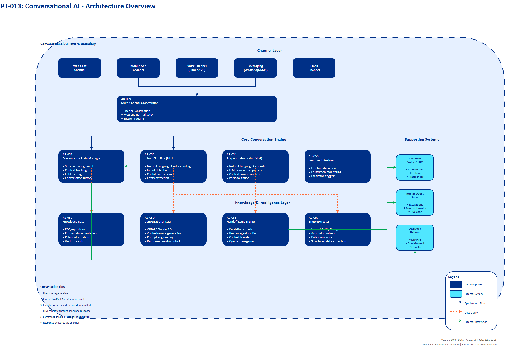

# AI Architecture Pattern Template

## Document Control

| Property | Value |
|----------|-------|
| **Pattern ID** | `PT-013` |
| **Pattern Name** | Conversational AI Pattern |
| **Version** | `1.0.0` |
| **Status** | `Approved` |
| **Created Date** | `2025-12-05` |
| **Last Modified** | `2025-12-05` |
| **Owner** | BNZ Enterprise Architecture |
| **Pattern Category** | `GenAI` |
| **Maturity Level** | `Mature` |

---

## 1. Pattern Overview

### 1.1 Pattern Name and Classification

**Pattern Name**: Conversational AI Pattern

**Short Name**: Conversational AI

**Pattern Category**: GenAI

**Pattern Type**: Integration, Processing, Orchestration

### 1.2 Intent and Context

**Intent Statement**:
Natural language interfaces for customer service, support, and internal queries using LLMs with conversation management to deliver 24/7 availability and reduce human agent load.

**Problem Statement**:
Financial institutions face challenges in providing scalable, consistent, and 24/7 customer service across multiple channels. Traditional customer service approaches result in:
- Long wait times during peak hours
- Inconsistent service quality across agents
- High operational costs for staffing contact centers
- Limited availability outside business hours
- Repetitive queries consuming significant human agent time
- Difficulty scaling support during high-demand periods

**Context**:
This pattern is applicable in scenarios where:
- High-volume customer interactions require consistent, accurate responses
- Customer service needs to be available 24/7 without prohibitive staffing costs
- Repetitive queries with known answers consume significant agent time
- Organizations need to scale customer support without proportional staff increases
- Customer-facing interactions (support, sales, onboarding) require natural language interaction
- Quick resolution times are critical for customer satisfaction

**Forces**:
- **Service Quality vs. Cost**: Need to maintain high service quality while reducing operational costs
- **Automation vs. Human Touch**: Need for efficiency through automation while preserving empathy and handling complex/sensitive issues
- **Availability vs. Staffing**: 24/7 availability requirements vs. practical limitations of human staffing models
- **Consistency vs. Flexibility**: Ensuring consistent responses while adapting to unique customer situations
- **Containment vs. Escalation**: Maximizing AI resolution rate while knowing when to escalate to humans

### 1.3 Pattern Maturity and Industry Adoption

**Maturity Level**: Mature

**Industry Adoption**:
- **Adoption Rate**: 87% of financial institutions deployed or piloting conversational AI as of 2025
- **Reference Implementations**:
  - N26 Bank: 20%+ of service requests handled fully by conversational AI
  - JPMorgan Chase: AI-powered virtual assistants across multiple channels
  - Bank of America: Erica virtual assistant with 50M+ users
- **Timeframe**: Mainstream since 2024, with significant improvements in LLM capabilities in 2025

**Standards Alignment**:
- GDPR compliance for conversational data handling
- PCI DSS for payment-related conversations
- FCA/RBNZ Consumer Duty standards for fair treatment
- WCAG 2.1 AA for accessibility in conversational interfaces
- ISO 27001 for information security management

---

## 2. Architecture Specification

### 2.1 Architecture Building Blocks (ABBs)

**Primary ABBs** (Core components required):

| ABB ID | ABB Name | Purpose in Pattern | Criticality |
|--------|----------|-------------------|-------------|
| [AB-050](../../architecture-building-blocks/abbs/AB-050/AB-050-Large-Language-Model-Service-v1.0.0.md) | Conversational LLM | Generate natural language responses to user queries | Critical |
| [AB-051](../../architecture-building-blocks/abbs/AB-051/AB-051-Vector-Database-v1.0.0.md) | Conversation State Manager | Track context across conversation turns, maintain session state | Critical |
| [AB-052](../../architecture-building-blocks/abbs/AB-052/AB-052-Semantic-Search-Engine-v1.0.0.md) | Intent Classifier | Determine user intent from natural language query | Critical |
| [AB-053](../../architecture-building-blocks/abbs/AB-053/AB-053-Query-Intent-Analyzer-v1.0.0.md) | Knowledge Base | Store FAQ, product documentation, policies for retrieval | Critical |
| [AB-054](../../architecture-building-blocks/abbs/AB-054/AB-054-Hybrid-Search-Engine-v1.0.0.md) | Response Generator | Create natural language responses based on intent and context | Critical |

**Supporting ABBs** (Optional or scenario-specific):

| ABB ID | ABB Name | Purpose in Pattern | When Required |
|--------|----------|-------------------|---------------|
| [AB-055](../../architecture-building-blocks/abbs/AB-055/AB-055-Reranking-Engine-v1.0.0.md) | Handoff Logic Engine | Escalate to human agent when needed | When human escalation required |
| [AB-056](../../architecture-building-blocks/abbs/AB-056/AB-056-Self-Critique-Engine-v1.0.0.md) | Sentiment Analyzer | Detect customer frustration/urgency | When emotional context is important |
| [AB-057](../../architecture-building-blocks/abbs/AB-057/AB-057-Document-Processing-Pipeline-v1.0.0.md) | Entity Extractor | Extract and track entities (account numbers, names, dates) | When structured data extraction needed |
| [AB-058](../../architecture-building-blocks/abbs/AB-058/AB-058-Citation-Generator-v1.0.0.md) | Conversation Summarizer | Compress long conversations into key points | For long conversation sessions |
| [AB-059](../../architecture-building-blocks/abbs/AB-059/AB-059-Query-Rewriting-Engine-v1.0.0.md) | Multi-Channel Orchestrator | Manage conversations across web, mobile, voice channels | When omnichannel support required |

**Cross-Cutting ABBs** (Always required):

| ABB ID | ABB Name | Purpose |
|--------|----------|---------|
| [AB-060](../../architecture-building-blocks/abbs/AB-060/AB-060-AI-Model-Registry-v1.0.0.md) | AI Governance Platform | Compliance, risk management, audit trail for conversations |
| [AB-112](../../architecture-building-blocks/abbs/AB-112/AB-112-Data-Encryption-Service-v1.0.0.md) | Security & Identity | Authentication, authorization, PII protection |
| [AB-096](../../architecture-building-blocks/abbs/AB-096/AB-096-Observability-Platform-v1.0.0.md) | Observability Platform | Monitoring conversation quality, containment rate, latency |

### 2.2 Pattern Structure

**Architectural Diagram**:



**Component Interaction Flow**:
```
User Message → Intent Classification → [Decision: Answer or Escalate?]
  ↓ (if answer)
Retrieve Context (Conversation History + Knowledge Base)
  ↓
LLM Generation → Response → Update Conversation State
  ↓ (if escalate)
Handoff to Human Agent (with full context)
```

**Key Interactions**:

1. **Intent Classification**: User message sent to Intent Classifier to determine query type
   - Protocol: REST API
   - Data Format: JSON (message text, conversation ID, channel)
   - Latency Target: < 200ms
   - Processing: NLP-based classification into predefined intent categories

2. **Context Retrieval**: Conversation State Manager retrieves relevant context
   - Protocol: In-memory cache access or database query
   - Data Format: Structured conversation history, entity tracking
   - Latency Target: < 50ms
   - Processing: Retrieve last N messages, extract relevant entities

3. **Knowledge Base Query**: Retrieve relevant information from knowledge base
   - Protocol: Vector search API or hybrid search
   - Data Format: Retrieved documents with relevance scores
   - Latency Target: < 100ms
   - Processing: Semantic search for relevant FAQ/documentation

4. **Response Generation**: LLM generates natural language response
   - Protocol: LLM API call (OpenAI, Claude, AWS Bedrock)
   - Data Format: JSON with prompt, conversation history, retrieved context
   - Latency Target: < 2 seconds (includes LLM inference time)
   - Processing: LLM synthesizes response from context and guidelines

5. **State Update**: Conversation state updated with new turn
   - Protocol: Database write or cache update
   - Data Format: Conversation transcript, extracted entities, sentiment
   - Latency Target: < 50ms (asynchronous acceptable)

6. **Escalation Trigger**: Handoff logic determines when to escalate to human
   - Protocol: Event trigger to human agent queue
   - Data Format: Full conversation context, customer profile, escalation reason
   - Error Handling: Queue management, agent availability checking

### 2.3 Data Flow

**Data Sources**:
- **User Input**: Natural language messages from web chat, mobile app, voice channels (100-1000 requests/minute)
- **Conversation History**: Previous messages in session (stored in Redis/DynamoDB, 10-50 messages per session)
- **Knowledge Base**: FAQ, product documentation, policies (10,000-100,000 documents, updated weekly)
- **Customer Profile**: CRM data, account information, interaction history (queried in real-time via API)

**Data Transformations**:
1. **Intent Classification**: User message text → Intent category + confidence score
2. **Entity Extraction**: User message → Structured entities (account numbers, dates, amounts)
3. **Context Assembly**: Conversation history + Knowledge base + Customer profile → Unified context for LLM
4. **Response Generation**: Context + User query → Natural language response
5. **Sentiment Analysis**: User message text → Sentiment score (positive/neutral/negative)
6. **Conversation Summarization**: Full conversation → Key points summary (for handoff or history)

**Data Sinks**:
- **Conversation Store**: Full conversation transcripts (DynamoDB, PostgreSQL, 90-day retention)
- **Analytics Database**: Conversation metrics, containment rates, topics (Data warehouse, 2-year retention)
- **Audit Log**: All AI decisions, responses, escalations (Append-only log, 7-year retention for compliance)
- **Human Agent Queue**: Escalated conversations with full context (Ticketing system, real-time)

**Data Governance**:
- **Classification**: Confidential (contains customer PII, financial information)
- **Retention**:
  - Active conversations: 24 hours in hot storage (Redis)
  - Completed conversations: 90 days in warm storage (database)
  - Audit logs: 7 years in cold storage (S3, compliance requirement)
- **Lineage**: Track user message → intent → knowledge retrieval → LLM response → agent handoff
- **Quality**:
  - PII detection and masking for logging
  - Response quality scoring (relevance, accuracy)
  - Conversation quality metrics (containment rate, resolution time)
  - Hallucination detection for LLM responses

### 2.4 Interface Specifications

**Inbound Interfaces** (Inputs to pattern):

| Interface ID | Interface Name | Type | Protocol | Data Format | SLA |
|--------------|---------------|------|----------|-------------|-----|
| IF-IN-001 | User Message API | Synchronous API | REST/WebSocket | JSON (message, user_id, channel, session_id) | < 500ms response time |
| IF-IN-002 | Voice Channel Input | Stream | WebRTC/SIP | Audio stream → Text (via STT) | < 1s transcription latency |
| IF-IN-003 | Knowledge Base Sync | Batch | Event-driven | Documents (PDF, HTML, JSON) | Updated within 1 hour |
| IF-IN-004 | Customer Context API | Synchronous API | REST | JSON (customer profile, account data) | < 200ms |

**Outbound Interfaces** (Outputs from pattern):

| Interface ID | Interface Name | Type | Protocol | Data Format | SLA |
|--------------|---------------|------|----------|-------------|-----|
| IF-OUT-001 | Response Delivery API | Synchronous API | REST/WebSocket | JSON (response_text, confidence, suggestions) | < 2s total latency |
| IF-OUT-002 | Human Handoff Event | Asynchronous Event | Kafka/EventBridge | JSON (conversation_summary, customer_id, escalation_reason) | < 100ms event publish |
| IF-OUT-003 | Analytics Stream | Asynchronous Event | Kafka | JSON (conversation_metrics, sentiment, resolution_status) | Best effort |
| IF-OUT-004 | Audit Log | Asynchronous Write | Database | JSON (timestamp, user_id, query, response, confidence) | < 1s write latency |

**Internal Interfaces** (Between ABBs within pattern):

| Interface ID | Source ABB | Target ABB | Protocol | Purpose |
|--------------|-----------|-----------|----------|---------|
| IF-INT-001 | Conversation State Manager | Intent Classifier | REST | Pass message with conversation context for intent classification |
| IF-INT-002 | Intent Classifier | Knowledge Base | Vector Search API | Retrieve relevant documents based on classified intent |
| IF-INT-003 | Knowledge Base | Response Generator | REST | Pass retrieved documents to LLM for response generation |
| IF-INT-004 | Response Generator | Conversation State Manager | Database Write | Update conversation state with generated response |
| IF-INT-005 | Sentiment Analyzer | Handoff Logic Engine | Event | Trigger escalation based on negative sentiment detection |

---

## 3. Implementation Guidance

### 3.1 Technology Stack Recommendations

**Conversational Platforms**:
- **Cognigy**: Enterprise-grade conversational AI with strong banking focus
- **Rasa**: Open-source framework with full control and customization
- **Amazon Lex**: Deep integration with AWS services and AWS WorkSpaces
- **Amazon Lex**: AWS-native solution with good voice integration

**Large Language Models**:
- **GPT-4 (OpenAI)**: Industry-leading quality for complex conversations
- **Claude 3.5 (Anthropic)**: Strong performance with better safety guardrails
- **AWS Bedrock**: GPT-4 with enterprise SLAs and data residency

**State Management**:
- **Redis**: In-memory cache for active conversations (< 10ms latency)
- **DynamoDB**: Scalable NoSQL for conversation history
- **PostgreSQL with TimescaleDB**: Structured storage with time-series capabilities

**Conversation Analytics**:
- **Convin**: Conversation intelligence platform with quality monitoring
- **Observe.AI**: Real-time conversation analytics and quality assurance
- **Custom Dashboards**: Grafana/Kibana for operational metrics

### 3.2 Conversation Management Features

| Feature | Description | Implementation |
|---------|-------------|----------------|
| **Context Window** | Track last N messages | Store last 10-20 messages in session state, pass to LLM as context |
| **Summarization** | Compress long conversations | Use LLM to summarize every 20 messages, replace detailed history with summary |
| **Entity Tracking** | Extract and track entities | Use NER (Named Entity Recognition) to extract account numbers, names, dates; store in structured format |
| **Sentiment Analysis** | Detect frustration/urgency | Analyze message sentiment on scale -1 (negative) to +1 (positive); trigger escalation if < -0.5 |
| **Multi-Turn Context** | Remember earlier context | Maintain conversation graph showing topic flow and references |
| **Disambiguation** | Clarify ambiguous queries | Use intent confidence threshold; ask clarifying questions if confidence < 0.7 |

### 3.3 When to Use This Pattern

**Ideal Use Cases**:
- Customer-facing interactions (support, sales, onboarding)
- High-volume query handling (reduce human agent load by 20%+)
- 24/7 availability requirements
- Repetitive queries with known answers (FAQ, product information, policy questions)
- Multi-channel support (web, mobile, voice) requiring consistent experience
- Self-service portals for account inquiries and simple transactions

**Not Recommended For**:
- Complex financial advice requiring licensed professionals
- Sensitive situations requiring human empathy (complaints, bereavement, financial hardship)
- Regulatory-restricted interactions (must be handled by certified agents)
- Novel/unique situations with no precedent in knowledge base
- High-stakes transactions requiring additional verification

### 3.4 BNZ Use Cases

This pattern directly supports the following BNZ use cases:

- **[UC-007](../../../01-motivation/03-use-cases/use-cases/UC-007/index.md): Contact Centre** - Conversational AI handles 20%+ of service requests, reducing average resolution times by 87%
  - Implementation: Handle tier-1 queries (balance inquiries, transaction status, general product questions)
  - Escalation: Complex issues or customer request for human agent

- **[UC-014](../../../01-motivation/03-use-cases/use-cases/UC-014/index.md): Onboarding** - Conversational guide through KYC process
  - Implementation: Interactive chatbot walks customers through account opening
  - Features: Document upload guidance, form completion assistance, status updates

---

## 4. Pattern Variants and Options

### 4.1 Pattern Variations

**Variant 1: Voice-First Conversational AI**
- **When to Use**: Call center automation, voice-activated banking
- **Key Differences**:
  - Add Speech-to-Text (STT) and Text-to-Speech (TTS) layers
  - Optimize for voice interaction patterns (shorter responses, confirmation loops)
  - Handle interruptions and barge-in scenarios
- **Trade-offs**:
  - Gain: Natural phone interaction, accessibility for visually impaired
  - Lose: More complex error handling, higher latency (STT/TTS processing)
  - Additional Cost: Voice infrastructure, higher computational requirements

**Variant 2: Hybrid AI-Human Collaboration**
- **When to Use**: Complex support scenarios, training new agents
- **Key Differences**:
  - AI provides real-time suggestions to human agents
  - Agent can override or modify AI responses before sending
  - AI learns from agent corrections
- **Trade-offs**:
  - Gain: Higher quality responses, gradual automation increase
  - Lose: Slower response times, still requires human staffing
  - Benefit: Reduces agent training time by 40%

**Variant 3: Proactive Conversational AI**
- **When to Use**: Alerts, notifications, proactive customer engagement
- **Key Differences**:
  - AI initiates conversations based on triggers (transaction alerts, payment due dates)
  - Predictive engagement (reach out before customer has an issue)
  - Integration with event-driven architecture
- **Trade-offs**:
  - Gain: Prevent issues before they occur, increase customer engagement
  - Lose: Risk of unwanted notifications, requires careful tuning
  - Complexity: Requires predictive models to determine when to engage

### 4.2 Composition with Other Patterns

**Commonly Combined With**:

| Pattern | Integration Point | Combined Benefit |
|---------|------------------|------------------|
| PT-001: RAG (Retrieval-Augmented Generation) | Knowledge Base component | Enhanced accuracy by grounding responses in enterprise documents; reduces hallucinations |
| PT-002: Multi-Model Routing | Response Generator component | Route queries to optimal LLM (GPT-4 for complex, Llama for simple) based on intent; reduce costs by 30-40% |
| PT-003: Agentic AI | Complex query handling | Convert conversational AI into autonomous agent that can execute tasks (transfer funds, update profile) with user approval |
| PT-019: Real-Time Scoring | Customer context enrichment | Real-time customer insights (propensity scores, churn risk) inform conversation personalization |
| PT-025: Event-Driven Architecture | Handoff and escalation | Publish conversation events for analytics, trigger downstream workflows |

**Anti-Patterns** (What NOT to do):

- **Anti-Pattern 1: No Human Escalation Path**
  - **Why Problematic**: Traps customers in AI loop when AI cannot help; severely damages customer satisfaction
  - **Better Approach**: Always provide clear "talk to human" option; auto-escalate after 3 failed resolution attempts

- **Anti-Pattern 2: Context-Free Conversations**
  - **Why Problematic**: Customers must repeat information in every message; frustrating experience
  - **Better Approach**: Maintain conversation state; reference earlier messages; track extracted entities

- **Anti-Pattern 3: Over-Promising AI Capabilities**
  - **Why Problematic**: Customer expectations exceed AI abilities; leads to disappointment and escalations
  - **Better Approach**: Set clear expectations upfront; be transparent about AI vs. human handling

- **Anti-Pattern 4: No Sentiment Monitoring**
  - **Why Problematic**: AI continues automated responses while customer becomes increasingly frustrated
  - **Better Approach**: Monitor sentiment continuously; escalate immediately when negative sentiment detected

- **Anti-Pattern 5: Generic Responses**
  - **Why Problematic**: Feels robotic and impersonal; doesn't leverage customer context
  - **Better Approach**: Personalize responses using customer profile, account history, previous interactions

---

## 5. Performance and Quality Metrics

### 5.1 Industry Performance Benchmarks

**Performance Metrics** (Banking Industry, 2025):
- **87% reduction** in average resolution times
- **44% faster** issue resolution with AI agent assist
- **$80B savings** by 2026 (conversational AI in contact centers globally)
- **20%+ of service requests** handled fully by AI (N26 Bank benchmark)
- **60-70% containment rate** for tier-1 queries (typical for mature implementations)

**Quality Metrics**:
- **Intent Classification Accuracy**: > 90% (minimum acceptable)
- **Response Relevance**: > 85% (measured by user feedback)
- **Containment Rate**: 60-70% (% of conversations resolved without human)
- **Customer Satisfaction (CSAT)**: > 4.0/5.0 for AI interactions
- **Escalation Rate**: < 30% of conversations

**Latency Targets**:
| Operation | Target Latency | Acceptable Range |
|-----------|---------------|------------------|
| Intent Classification | < 200ms | 200-500ms |
| Knowledge Retrieval | < 100ms | 100-300ms |
| LLM Response Generation | < 2s | 2-4s |
| End-to-End Response | < 3s | 3-5s |

### 5.2 Best Practices (2025)

**Implementation Best Practices**:
1. **Implement handoff to human** for complex/sensitive issues
   - Clear escalation criteria: customer request, negative sentiment, 3+ failed attempts
   - Full context transfer to human agent (don't make customer repeat information)

2. **Track containment rate** (% resolved without human)
   - Target: 60-70% for tier-1 queries
   - Monitor by topic category to identify knowledge gaps

3. **Use sentiment analysis** for escalation triggers
   - Escalate automatically if sentiment < -0.5 (negative)
   - Flag conversations with declining sentiment for quality review

4. **Maintain conversation context** (don't make user repeat info)
   - Store last 10-20 messages in session
   - Extract and track entities across conversation
   - Reference earlier context in responses ("As you mentioned earlier...")

5. **Provide clear "talk to human" option**
   - Always visible in UI
   - No hidden menus or complex navigation
   - Auto-offer after 3 failed resolution attempts

6. **Monitor and improve continuously**
   - Daily review of low-rated conversations
   - Weekly knowledge base updates based on gaps
   - Monthly model retraining with new conversation data

7. **Test for hallucinations and errors**
   - Automated testing for common queries
   - Human QA review of sample conversations (5-10% of volume)
   - Confidence thresholds: don't respond if confidence < 0.7

8. **Personalize using customer context**
   - Greet by name
   - Reference account details appropriately
   - Adapt tone based on customer segment

---

## 6. Governance and Compliance

### 6.1 Regulatory Considerations

**Financial Services Compliance**:
- **Consumer Duty (FCA/RBNZ)**: Ensure fair treatment, clear communication, appropriate escalation
- **GDPR**:
  - Right to human review of automated decisions
  - Data minimization in conversation storage
  - Consent for conversation recording and analysis
- **PCI DSS**: Never store credit card numbers in conversation logs
- **Know Your Customer (KYC)**: AI cannot make KYC decisions; escalate to human
- **Financial Advice**: AI cannot provide regulated financial advice without license

**Governance Requirements**:
| Requirement | Implementation | Audit Evidence |
|-------------|----------------|----------------|
| **Conversation Audit Trail** | Log all conversations with timestamps, user IDs, responses | 7-year retention in immutable storage |
| **Escalation Tracking** | Track all AI→human handoffs with reasons | Dashboard showing escalation rates by topic |
| **Quality Monitoring** | Sample 5-10% of conversations for human QA review | Quality scores, issue categorization |
| **Bias Detection** | Monitor response quality across demographic groups | Fairness metrics in monthly reports |
| **Incident Response** | Process for handling AI errors or inappropriate responses | Incident logs, remediation actions |

### 6.2 Security and Privacy

**Security Controls**:
- **Authentication**: All conversations require authenticated user session
- **Authorization**: Access to customer data based on RBAC (Role-Based Access Control)
- **Encryption**: TLS for data in transit, AES-256 for data at rest
- **PII Protection**:
  - Mask sensitive data (account numbers, SSN) in logs
  - Redact PII before sending to third-party LLM providers
  - Use on-premises or private cloud LLM for highly sensitive conversations

**Privacy Controls**:
- **Data Minimization**: Only collect data necessary for conversation
- **Retention Limits**:
  - Active conversations: 24 hours
  - Completed conversations: 90 days
  - Aggregated analytics: Indefinite (anonymized)
- **Right to Deletion**: Customer can request conversation history deletion
- **Consent**: Clear notice that conversations are AI-powered and may be recorded

---

## 7. References and Resources

### 7.1 Related Patterns

| Pattern ID | Pattern Name | Relationship | Reference |
|-----------|-------------|--------------|-----------|
| PT-001 | RAG (Retrieval-Augmented Generation) | Used with | Enhances knowledge retrieval for responses |
| PT-002 | Multi-Model Routing | Used with | Optimize LLM selection for cost/quality |
| PT-003 | Agentic AI | Alternative to | Conversational AI can evolve into agentic AI |
| PT-025 | Event-Driven Architecture | Depends on | For handoff events, analytics streaming |
| PT-030 | Observability Pattern | Depends on | For monitoring conversation quality |

### 7.2 Related ABBs

| ABB ID | ABB Name | Document Link |
|--------|----------|---------------|
| [AB-050](../../architecture-building-blocks/abbs/AB-050/AB-050-Large-Language-Model-Service-v1.0.0.md) | Conversational LLM | [Link to ABB document] |
| [AB-051](../../architecture-building-blocks/abbs/AB-051/AB-051-Vector-Database-v1.0.0.md) | Conversation State Manager | [Link to ABB document] |
| [AB-052](../../architecture-building-blocks/abbs/AB-052/AB-052-Semantic-Search-Engine-v1.0.0.md) | Intent Classifier | [Link to ABB document] |
| [AB-053](../../architecture-building-blocks/abbs/AB-053/AB-053-Query-Intent-Analyzer-v1.0.0.md) | Knowledge Base | [Link to ABB document] |
| [AB-060](../../architecture-building-blocks/abbs/AB-060/AB-060-AI-Model-Registry-v1.0.0.md) | AI Governance Platform | [Link to ABB document] |

### 7.3 Standards and Guidelines

- **BNZ Visual Design Standards**: [05-governance/standards/visual-design/visual-design-standard.md](../../../../../../05-governance/standards/visual-design/visual-design-standard.md)
- **WCAG 2.1 AA**: Web Content Accessibility Guidelines for conversational interfaces
- **ISO 27001**: Information Security Management for conversation data
- **PCI DSS v4.0**: Payment Card Industry Data Security Standard
- **GDPR Article 22**: Right to explanation for automated decisions

### 7.4 External References

**Industry Research**:
- **Cognigy**: "Conversational AI in Banking: Benefits & Examples" - https://www.cognigy.com/blog/conversational-ai-in-banking-benefits-examples
- **Social Intents**: "AI in Banking Customer Service 2025" - https://www.socialintents.com/blog/ai-in-banking-customer-service/
- **McKinsey**: "The State of AI in 2025" - Contact center automation insights
- **Gartner**: "Market Guide for Conversational AI Platforms, 2025"

**Technology Documentation**:
- **Cognigy**: Official documentation - https://docs.cognigy.com/
- **Rasa**: Open-source framework documentation - https://rasa.com/docs/
- **Amazon Lex**: Amazon Lex documentation - https://docs.aws.amazon.com/lex/
- **Amazon Lex**: AWS conversational AI documentation - https://docs.aws.amazon.com/lex/

**Vendor Resources**:
- **OpenAI**: GPT-4 best practices for conversational AI - https://platform.openai.com/docs/guides/conversation
- **Anthropic**: Claude conversation design guidelines - https://docs.anthropic.com/claude/docs/
- **Convin**: Conversation intelligence platform - https://www.convin.ai/
- **Observe.AI**: Contact center AI analytics - https://observe.ai/

**Banking Examples**:
- **N26 Bank**: Conversational AI case study (20%+ containment rate)
- **Bank of America**: Erica virtual assistant (50M+ users)
- **JPMorgan Chase**: Virtual assistant deployment across channels

---

## 8. Diagram Templates

**Required Diagrams** (to be created using draw.io templates):

1. **[PT-013-Conversational-AI-Architecture-v1.0.0.drawio]**: High-level architecture showing ABBs and their relationships
2. **[PT-013-Conversational-AI-Data-Flow-v1.0.0.drawio]**: Data flow through the pattern showing user message → response journey

See [DRAWIO-DIAGRAM-TEMPLATES-GUIDE.md](./DRAWIO-DIAGRAM-TEMPLATES-GUIDE.md) for templates and standards.

**Diagram Requirements**:
- Follow BNZ Visual Design Standards (BNZ Navy Blue #003087, BNZ Orange #FF6B35)
- Canvas size: 2400x1800px (16:9) with 40-50px margins
- Include legend explaining colors, shapes, and arrow types
- WCAG 2.1 AA compliance (4.5:1 contrast ratio minimum)

---

## Appendix A: Glossary

| Term | Definition |
|------|------------|
| **Containment Rate** | Percentage of conversations successfully resolved by AI without human agent escalation |
| **Intent Classification** | Process of determining user's goal/intent from natural language message |
| **Entity Extraction** | Identifying and extracting structured data (names, dates, account numbers) from text |
| **Sentiment Analysis** | Detecting emotional tone (positive/negative/neutral) from user messages |
| **Context Window** | Number of previous messages included as context for response generation |
| **Hallucination** | When LLM generates plausible but factually incorrect or ungrounded information |
| **Handoff** | Escalation from AI to human agent, transferring full conversation context |
| **Conversation State** | Persistent storage of conversation history, extracted entities, and session metadata |
| **Tier-1 Queries** | Simple, repetitive questions with known answers (balance, transaction status, FAQ) |
| **Barge-In** | User interruption of AI response (common in voice conversations) |

---

## Appendix B: Change History

| Version | Date | Author | Changes |
|---------|------|--------|---------|
| 1.0.0 | 2025-12-05 | BNZ Enterprise Architecture | Initial version - extracted from AI Architecture Patterns catalog |

---

## Appendix C: Review and Approval

| Role | Name | Signature | Date |
|------|------|-----------|------|
| **Pattern Author** | BNZ Enterprise Architecture | | 2025-12-05 |
| **Enterprise Architect** | [Name] | | |
| **Security Architect** | [Name] | | |
| **TAF** | [Name] | | |
