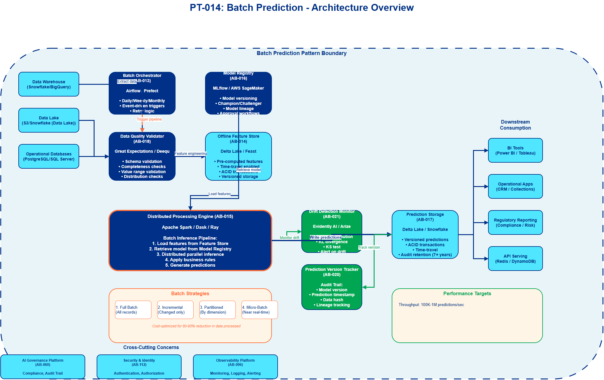

# AI Architecture Pattern: Batch Prediction Pattern

## Document Control

| Property | Value |
|----------|-------|
| **Pattern ID** | `PT-014` |
| **Pattern Name** | Batch Prediction Pattern |
| **Version** | `1.0.0` |
| **Status** | `Approved` |
| **Created Date** | `2025-12-05` |
| **Last Modified** | `2025-12-05` |
| **Owner** | BNZ Enterprise Architecture |
| **Pattern Category** | `ML Prediction` |
| **Maturity Level** | `Mature` |

---

## 1. Pattern Overview

### 1.1 Pattern Name and Classification

**Pattern Name**: Batch Prediction Pattern

**Short Name**: Batch ML Inference

**Pattern Category**: ML Prediction

**Pattern Type**: Processing Pattern

### 1.2 Intent and Context

**Intent Statement**:
Enable offline, scheduled machine learning inference for non-real-time use cases such as periodic reporting, analytics, large-scale customer scoring, and risk assessments, optimizing for throughput and cost efficiency over latency.

**Problem Statement**:
Organizations need to generate ML predictions for millions or billions of records for analytical, reporting, and planning purposes where real-time inference is not required. Challenges include:
- Processing massive datasets (millions to billions of records) efficiently
- Optimizing costs through scheduled processing during off-peak hours
- Ensuring prediction consistency and reproducibility for compliance and auditing
- Managing computational resources for large-scale distributed inference
- Tracking which model version generated which predictions for audit trails
- Monitoring data quality and detecting drift in batch inputs
- Coordinating complex dependencies between feature engineering, inference, and downstream consumption

Without a structured batch prediction pattern, organizations face high costs from inefficient processing, lack of auditability for regulatory compliance, and inability to scale ML predictions to enterprise-wide analytical use cases.

**Context**:
This pattern applies to use cases where predictions are needed on a scheduled basis (daily, weekly, monthly) rather than in real-time. Common scenarios include monthly customer churn risk scoring, quarterly credit portfolio reviews, daily fraud pattern analysis, and periodic financial forecasting. The pattern is widely adopted in financial services for regulatory reporting, risk management, and business intelligence applications.

**Forces**:
- **Cost vs. latency**: Batch processing is significantly cheaper than real-time inference, but introduces latency (hours to days)
- **Throughput vs. resource utilization**: Need high throughput while managing computational resource costs
- **Data freshness vs. processing complexity**: More frequent batch runs provide fresher predictions but increase operational complexity
- **Consistency vs. flexibility**: Standardized batch pipelines ensure consistency but may limit customization for specific use cases
- **Scalability vs. simplicity**: Distributed processing frameworks add complexity but are essential for large-scale inference

### 1.3 Pattern Maturity and Industry Adoption

**Maturity Level**: Mature

**Industry Adoption**:
- **Adoption Rate**: 95%+ of organizations with ML in production use batch prediction for at least some use cases (2025)
- **Reference Implementations**:
  - Netflix - Daily batch recommendation scoring for 200M+ users (Spark on Kubernetes)
  - Capital One - Monthly credit risk scoring for loan portfolios (SageMaker Batch Transform)
  - Uber - Daily driver and rider churn prediction (Michelangelo batch inference)
  - PayPal - Periodic fraud pattern analysis (Airflow + Ray)
- **Timeframe**: Established pattern since early 2010s with Apache Spark; evolved with modern orchestration (Airflow, Prefect) and cloud-native batch inference services (SageMaker, Vertex AI Batch Prediction)

**Standards Alignment**:
- **SR 11-7**: Model Risk Management - Batch predictions provide audit trail for model validation
- **BCBS 239**: Risk Data Aggregation and Reporting - Batch processing supports regulatory reporting
- **ISO 8000**: Data Quality Management - Batch pipelines enable comprehensive data quality checks
- **Apache Airflow**: Industry standard for workflow orchestration
- **Delta Lake / Apache Iceberg**: Open table formats for versioned, reproducible batch processing

---

## 2. Architecture Specification

### 2.1 Architecture Building Blocks (ABBs)

**Primary ABBs** (Core components required):

| ABB ID | ABB Name | Purpose in Pattern | Criticality |
|--------|----------|-------------------|-------------|
| [AB-013](../../architecture-building-blocks/abbs/AB-013/AB-013-Batch-Orchestrator-v1.0.0.md) | Batch Orchestrator | Schedule and coordinate batch prediction workflows (Airflow, Prefect, Dagster) | Critical |
| [AB-014](../../architecture-building-blocks/abbs/AB-014/AB-014-Batch-Feature-Store-v1.0.0.md) | Offline Feature Store | Store and retrieve pre-computed features for batch inference | Critical |
| [AB-015](../../architecture-building-blocks/abbs/AB-015/AB-015-Distributed-Processing-Engine-v1.0.0.md) | Distributed Processing Engine | Execute large-scale distributed inference (Spark, Dask, Ray) | Critical |
| [AB-016](../../architecture-building-blocks/abbs/AB-016/AB-016-Batch-Model-Registry-v1.0.0.md) | Model Registry | Version and retrieve trained models for batch scoring | Critical |
| [AB-017](../../architecture-building-blocks/abbs/AB-017/AB-017-Prediction-Storage-v1.0.0.md) | Prediction Storage | Store batch prediction results for downstream consumption | Critical |
| [AB-018](../../architecture-building-blocks/abbs/AB-018/AB-018-Data-Quality-Validator-v1.0.0.md) | Data Quality Validator | Validate input data quality before inference | Critical |

**Supporting ABBs** (Optional or scenario-specific):

| ABB ID | ABB Name | Purpose in Pattern | When Required |
|--------|----------|-------------------|---------------|
| [AB-019](../../architecture-building-blocks/abbs/AB-019/AB-019-Incremental-Processing-Manager-v1.0.0.md) | Incremental Processing Manager | Track processed records to enable incremental batch runs | Recommended for large datasets |
| [AB-020](../../architecture-building-blocks/abbs/AB-020/AB-020-Prediction-Version-Tracker-v1.0.0.md) | Prediction Version Tracker | Track which model version generated which predictions | MANDATORY for regulated use cases |
| [AB-021](../../architecture-building-blocks/abbs/AB-021/AB-021-Drift-Detection-Monitor-v1.0.0.md) | Drift Detection Monitor | Monitor input data drift before batch inference | Recommended for production stability |
| [AB-022](../../architecture-building-blocks/abbs/AB-022/AB-022-Result-Reconciliation-Engine-v1.0.0.md) | Result Reconciliation Engine | Compare predictions across model versions (Champion/Challenger) | Recommended for model validation |
| [AB-023](../../architecture-building-blocks/abbs/AB-023/AB-023-Batch-Explainability-Service-v1.0.0.md) | Batch Explainability Service | Generate feature importance/SHAP values for batch predictions | MANDATORY for credit and risk models |

**Cross-Cutting ABBs** (Always required):

| ABB ID | ABB Name | Purpose |
|--------|----------|---------|
| [AB-096](../../architecture-building-blocks/abbs/AB-096/AB-096-Observability-Platform-v1.0.0.md) | Platform Observability | Monitor batch job status, resource utilization, job failures |
| [AB-112](../../architecture-building-blocks/abbs/AB-112/AB-112-Data-Encryption-Service-v1.0.0.md) | Security & Identity Management | Authentication, authorization for batch processing systems |
| [AB-060](../../architecture-building-blocks/abbs/AB-060/AB-060-AI-Model-Registry-v1.0.0.md) | Model Governance | Audit trail for batch predictions, model lineage tracking |

### 2.2 Pattern Structure

**Architectural Diagram**:



**Component Interaction Flow**:
```
[Schedule Trigger] (Daily/Weekly/Monthly)
    ↓
[Batch Orchestrator] (AB-013)
    ↓
┌─────────────────────────────────────────────────────────┐
│        BATCH PREDICTION PIPELINE                        │
│                                                         │
│  [Data Quality Validation]                             │
│  (AB-018)                                         │
│         ↓                                              │
│  [Feature Engineering] → [Offline Feature Store]       │
│  (Spark/Dask)            (AB-014)                │
│         ↓                                              │
│  [Model Retrieval]                                     │
│  (AB-016)                                         │
│         ↓                                              │
│  [Distributed Batch Inference]                         │
│  (AB-015)                                         │
│         ↓                                              │
│  [Prediction Storage]                                  │
│  (AB-017)                                         │
│         ↓                                              │
│  [Version Tracking] + [Drift Detection]                │
│  (AB-020)      (AB-021)                     │
└─────────────────────────────────────────────────────────┘
    ↓
[Downstream Consumption]
(Data Warehouse, BI Tools, Reports, Applications)
```

**Key Interactions**:

1. **Schedule Activation**: Orchestrator triggers batch pipeline on schedule
   - Protocol: Cron-based scheduler or event trigger
   - Trigger Types: Time-based (daily 2 AM), data-driven (when new data arrives), manual (on-demand)
   - Latency Target: Pipeline starts within 60 seconds of schedule trigger
   - Error Handling: Retry with exponential backoff, alert on repeated failures

2. **Data Quality Validation**: Validate input data before processing
   - Processing Type: Synchronous validation checks
   - Quality Checks: Completeness, schema validation, value ranges, null checks, duplicate detection
   - Framework: Great Expectations, Deequ, or custom validation
   - Failure Action: Abort pipeline if critical checks fail, alert data team
   - Latency Target: < 5 minutes for datasets up to 10M records

3. **Feature Engineering**: Transform raw data into features
   - Processing Type: Distributed batch processing
   - Engine: Apache Spark, Dask, Ray for parallelization
   - Storage: Write features to Offline Feature Store (Parquet, Delta Lake, Iceberg)
   - Optimization: Partition by date, cache intermediate results, optimize shuffle operations
   - Latency Target: Throughput of 100K-1M records/second depending on feature complexity

4. **Model Retrieval**: Load trained model from Model Registry
   - Protocol: REST API or direct object storage access (S3, Amazon S3)
   - Model Format: Pickle, ONNX, TensorFlow SavedModel, PyTorch, MLflow
   - Caching: Cache model in distributed memory for reuse across partitions
   - Version Control: Specify exact model version or use alias (e.g., "production", "champion")
   - Latency Target: < 30 seconds to load model across cluster

5. **Distributed Batch Inference**: Execute predictions in parallel
   - Processing Type: Distributed batch processing (embarrassingly parallel)
   - Execution: User-defined function (UDF) applied to data partitions
   - Optimization: Broadcast small models to worker nodes, partition data evenly, tune parallelism
   - Error Handling: Fault tolerance with task retries, skip bad records with logging
   - Latency Target: Throughput of 10K-100K predictions/second depending on model complexity

6. **Prediction Storage**: Write results to data warehouse or object storage
   - Protocol: Bulk write to S3, Amazon S3, Snowflake, BigQuery, Delta Lake
   - Data Format: Parquet (columnar, compressed), Delta Lake (ACID transactions), or CSV
   - Partitioning: Partition by date, business unit, or model version for efficient queries
   - Metadata: Include prediction timestamp, model version, input data hash
   - Latency Target: < 10 minutes to write 10M predictions

7. **Version Tracking & Audit**: Log prediction metadata for governance
   - Processing Type: Asynchronous event logging
   - Tracked Metadata: Model ID/version, prediction timestamp, input data hash, record count, job ID
   - Storage: Audit database or event log (Kafka, Kinesis)
   - Retention: 7+ years for financial services compliance
   - Purpose: Regulatory audit trail, reproducibility, debugging

8. **Drift Detection**: Monitor input data distribution
   - Processing Type: Statistical analysis on batch input data
   - Metrics: Feature distribution shifts (KL divergence, KS test), missing value rates, value ranges
   - Comparison: Compare current batch to training data distribution or recent historical batches
   - Alert Mechanism: Threshold-based alerts to model owners if significant drift detected
   - Latency Target: Drift analysis completes within 10% of total pipeline runtime

#### 2.2.1 Batch Processing Strategies

**Strategy 1: Full Batch Reprocessing**
- **When to Use**: Small datasets (< 10M records), infrequent updates (weekly/monthly), regulatory requirement for complete reprocessing
- **Approach**: Reprocess entire dataset on every batch run
- **Pros**: Simple, ensures all predictions reflect latest model
- **Cons**: Wasteful for large datasets with minimal changes, high computational cost
- **Example**: Monthly credit portfolio revaluation (all loans re-scored)

**Strategy 2: Incremental Batch Processing**
- **When to Use**: Large datasets (> 10M records), frequent updates (daily), only small portion of data changes
- **Approach**: Process only new or changed records since last batch run
- **Pros**: Cost-efficient, faster processing, reduces resource utilization
- **Cons**: Requires change detection mechanism, complexity in tracking processed records
- **Example**: Daily customer churn prediction (only score new/changed customer attributes)
- **Implementation**: Track high-water mark (e.g., max timestamp), use Delta Lake change data feed, or maintain processed record IDs

**Strategy 3: Partitioned Batch Processing**
- **When to Use**: Very large datasets (> 100M records), need to distribute load across time or resources
- **Approach**: Divide data into partitions (by date, region, customer segment) and process independently
- **Pros**: Parallelizable, fault-tolerant (can retry failed partitions), supports federated data
- **Cons**: Requires careful partition design, potential data skew issues
- **Example**: Global fraud scoring (partition by geographic region)
- **Implementation**: Partition by date (YYYY/MM/DD), business dimension (region, product), or hash-based partitioning

**Strategy 4: Micro-Batch Processing**
- **When to Use**: Near-real-time requirements (latency: minutes), streaming data sources
- **Approach**: Process small batches frequently (every 5-15 minutes) using streaming framework
- **Pros**: Lower latency than traditional batch, simpler than pure streaming, cost-effective
- **Cons**: More operational complexity than daily batch, not truly real-time
- **Example**: Hourly marketing campaign scoring (refresh top-N customer lists every hour)
- **Implementation**: Spark Structured Streaming, Flink, Kafka Streams with windowed aggregations

### 2.3 Data Flow

**Data Sources**:
- **Enterprise Data Warehouse**: Snowflake, BigQuery, Redshift, Synapse (historical customer, transaction, product data)
- **Data Lake**: S3, Snowflake (Data Lake), GCS (raw logs, clickstream, sensor data in Parquet/JSON)
- **Operational Databases**: PostgreSQL, SQL Server, Oracle (transactional data replicated via CDC)
- **External Data**: Third-party data feeds (credit bureau scores, market data, weather data)
- **Streaming Data Archives**: Historical events from Kafka, Kinesis archived to object storage

**Data Transformations**:

1. **Data Extraction & Loading**: Pull data from multiple sources into processing environment
   - Input: Raw data from data warehouse, data lake, operational databases
   - Processing: Distributed read with predicate pushdown, columnar format optimization
   - Output: Unified dataset in Spark/Dask DataFrame
   - Performance: Read 1TB+ datasets in < 10 minutes with partitioned columnar storage

2. **Feature Engineering**: Transform raw data into ML features
   - Input: Raw data (customer demographics, transaction history, account attributes)
   - Processing: Aggregations (sum, avg, count over time windows), derivations (ratios, flags), encodings (one-hot, label encoding)
   - Output: Feature vectors stored in Offline Feature Store (Parquet, Delta Lake)
   - Consistency: Reuse training-time feature logic (shared feature transformation code)
   - Performance: Feature computation for 10M customers in < 30 minutes

3. **Model Inference**: Apply ML model to feature vectors
   - Input: Feature vectors from Offline Feature Store
   - Processing: Distributed apply of model.predict() across data partitions
   - Output: Prediction scores (probabilities, classifications, regression values)
   - Optimization: Broadcast small models, vectorized prediction for tree-based models
   - Performance: 100K-1M predictions/second depending on model complexity

4. **Post-Processing & Business Logic**: Apply business rules to predictions
   - Input: Raw model predictions
   - Processing: Threshold application (convert probabilities to decisions), ranking (top-N customer lists), segmentation (risk buckets)
   - Output: Business-ready predictions with decision flags
   - Example: Convert churn probability > 0.7 to "High Risk" flag

5. **Result Aggregation & Reporting**: Generate summary statistics and reports
   - Input: Detailed predictions
   - Processing: Aggregations by business dimensions (region, product, segment), statistical summaries (mean, median, percentiles)
   - Output: Executive dashboards, regulatory reports, BI datasets
   - Example: Risk exposure by customer segment, top 1000 high-risk customers

**Data Sinks**:
- **Data Warehouse**: Snowflake, BigQuery, Redshift (predictions joined with operational data for BI)
- **Prediction Store**: Amazon S3 in Parquet/Delta Lake (versioned predictions for audit and reproducibility)
- **Operational Databases**: PostgreSQL, MongoDB (predictions for downstream applications, e.g., CRM)
- **BI Tools**: Power BI, Tableau, Looker (dashboards consuming prediction results)
- **Regulatory Reporting**: Secure file transfer to regulators (OCC, Federal Reserve)
- **API Serving**: Populate serving database (Redis, DynamoDB) for low-latency lookup of batch predictions

**Data Governance**:
- **Classification**:
  - Input data: Inherit classification from source systems (PII, Confidential, Public)
  - Predictions: Typically **Confidential** (customer risk scores, business insights)
  - Aggregated reports: May be downgraded to **Internal** after anonymization
- **Retention**:
  - Predictions: 7 years for financial services compliance (align with source data retention)
  - Audit logs: 7+ years (regulatory examination period)
  - Intermediate artifacts: 90 days (feature engineering outputs, debug logs)
- **Lineage**:
  - Full lineage tracking: Source data → Features → Model version → Predictions
  - Tools: Data catalogs (Collibra, Alation), Delta Lake lineage, Spark lineage tracking
  - Use case: "Which customer data influenced this credit decision on 2024-11-15?"
- **Quality**:
  - Input validation: Schema checks, completeness (Great Expectations, Deequ)
  - Feature validation: Value ranges, null rates, distribution checks
  - Prediction validation: Score distribution checks, sanity checks (e.g., probabilities in [0, 1])
  - Monitoring: Track data quality metrics over time, alert on anomalies

### 2.4 Interface Specifications

**Inbound Interfaces** (Inputs to pattern):

| Interface ID | Interface Name | Type | Protocol | Data Format | SLA |
|--------------|---------------|------|----------|-------------|-----|
| IF-IN-001 | Data Warehouse Extract | Batch Query | JDBC/ODBC | SQL result set (Parquet, Delta) | < 30 min for 10M records |
| IF-IN-002 | Data Lake Read | Batch File Read | Amazon S3 API | Parquet, Delta Lake, Iceberg | < 10 min for 1TB |
| IF-IN-003 | Feature Store Read | Batch API | REST/Python SDK | Parquet, Feature vectors | < 5 min for 100M features |
| IF-IN-004 | Model Registry Get | REST API | HTTPS | MLflow model artifact | < 30 sec |
| IF-IN-005 | Schedule Trigger | Event/Cron | Cron, Airflow Sensor | Trigger event | On schedule (±1 min) |
| IF-IN-006 | Manual Trigger | REST API | HTTPS | JSON (job parameters) | Immediate |

**Outbound Interfaces** (Outputs from pattern):

| Interface ID | Interface Name | Type | Protocol | Data Format | SLA |
|--------------|---------------|------|----------|-------------|-----|
| IF-OUT-001 | Prediction Storage Write | Batch Write | Amazon S3 API | Parquet, Delta Lake | < 10 min for 10M predictions |
| IF-OUT-002 | Data Warehouse Load | Batch Load | JDBC/Snowflake COPY | Parquet, CSV | < 15 min for 10M records |
| IF-OUT-003 | BI Dashboard Refresh | Event Notification | REST/Webhook | JSON (completion event) | < 5 min after job completion |
| IF-OUT-004 | Audit Log Write | Event Stream | Kafka/Kinesis | JSON (audit events) | Real-time (< 1 sec) |
| IF-OUT-005 | Alert Notification | Event | Email/Slack/PagerDuty | JSON (alert payload) | < 5 min for failures |
| IF-OUT-006 | Downstream API Update | Batch API | REST/gRPC | JSON/Parquet | < 30 min after predictions available |

**Internal Interfaces** (Between ABBs within pattern):

| Interface ID | Source ABB | Target ABB | Protocol | Purpose |
|--------------|-----------|-----------|----------|---------|
| IF-INT-001 | [AB-013](../../architecture-building-blocks/abbs/AB-013/AB-013-Batch-Orchestrator-v1.0.0.md) (Orchestrator) | [AB-018](../../architecture-building-blocks/abbs/AB-018/AB-018-Data-Quality-Validator-v1.0.0.md) (Data Quality) | Internal API | Trigger data validation step |
| IF-INT-002 | [AB-018](../../architecture-building-blocks/abbs/AB-018/AB-018-Data-Quality-Validator-v1.0.0.md) (Data Quality) | [AB-014](../../architecture-building-blocks/abbs/AB-014/AB-014-Batch-Feature-Store-v1.0.0.md) (Feature Store) | Internal API | Load validated data for feature engineering |
| IF-INT-003 | [AB-013](../../architecture-building-blocks/abbs/AB-013/AB-013-Batch-Orchestrator-v1.0.0.md) (Orchestrator) | [AB-016](../../architecture-building-blocks/abbs/AB-016/AB-016-Batch-Model-Registry-v1.0.0.md) (Model Registry) | REST API | Retrieve model for inference |
| IF-INT-004 | [AB-015](../../architecture-building-blocks/abbs/AB-015/AB-015-Distributed-Processing-Engine-v1.0.0.md) (Processing Engine) | [AB-017](../../architecture-building-blocks/abbs/AB-017/AB-017-Prediction-Storage-v1.0.0.md) (Prediction Storage) | File System API | Write predictions to storage |
| IF-INT-005 | [AB-015](../../architecture-building-blocks/abbs/AB-015/AB-015-Distributed-Processing-Engine-v1.0.0.md) (Processing Engine) | [AB-021](../../architecture-building-blocks/abbs/AB-021/AB-021-Drift-Detection-Monitor-v1.0.0.md) (Drift Detection) | Internal API | Analyze input data distribution |
| IF-INT-006 | [AB-017](../../architecture-building-blocks/abbs/AB-017/AB-017-Prediction-Storage-v1.0.0.md) (Prediction Storage) | [AB-020](../../architecture-building-blocks/abbs/AB-020/AB-020-Prediction-Version-Tracker-v1.0.0.md) (Version Tracker) | Internal API | Log prediction metadata |

---

## 3. Pattern Variants and Options

### 3.1 Pattern Variations

**Variant 1: Serverless Batch Inference**
- **When to Use**: Irregular batch jobs, unpredictable workloads, minimal operational overhead required
- **Key Differences**:
  - Use managed batch services (AWS Batch, AWS Batch, GCP Batch)
  - Container-based execution (Docker images with model + code)
  - Auto-scaling based on queue depth
  - Pay-per-use pricing (no idle cluster costs)
- **Technology Stack**: AWS SageMaker Batch Transform, AWS SageMaker Batch Endpoints, GCP Vertex AI Batch Prediction
- **Trade-offs**:
  - Gain: No cluster management, automatic scaling, cost-efficient for sporadic workloads
  - Lose: Less control over infrastructure, cold start latency, limited customization

**Variant 2: Spark-Based Batch Inference**
- **When to Use**: Large-scale distributed processing (> 100M records), complex feature engineering, need for customization
- **Key Differences**:
  - Apache Spark as processing engine (PySpark or Scala)
  - Cluster-based deployment (Databricks, EMR, Dataproc, on-prem Hadoop)
  - Native integration with Delta Lake, Hive, Parquet
  - UDF-based model inference (broadcast model to executors)
- **Technology Stack**: Apache Spark, Delta Lake, Databricks, MLflow
- **Trade-offs**:
  - Gain: Maximum flexibility, excellent for complex transformations, mature ecosystem
  - Lose: Requires cluster management (if not using managed service), steeper learning curve

**Variant 3: Ray-Based Batch Inference**
- **When to Use**: Deep learning models, GPU acceleration, Python-native workflows
- **Key Differences**:
  - Ray for distributed Python execution
  - Native GPU support (multi-GPU, multi-node)
  - Actors for stateful model serving (load model once, reuse)
  - Integrated with Kubernetes via KubeRay
- **Technology Stack**: Ray, Ray Serve, Anyscale, KubeRay
- **Trade-offs**:
  - Gain: Excellent for deep learning, Python-native, GPU-optimized, low-latency model loading
  - Lose: Newer ecosystem (less mature than Spark), requires Ray-specific knowledge

**Variant 4: Incremental Batch with Change Data Capture (CDC)**
- **When to Use**: Operational databases as source, need to process only changed records
- **Key Differences**:
  - CDC tools capture database changes (Debezium, AWS DMS, GCP Datastream)
  - Changed records streamed to Kafka/Kinesis
  - Micro-batch processing on changed data only
  - Merge predictions back to operational database
- **Technology Stack**: Debezium, Kafka, Spark Structured Streaming, Delta Lake Merge
- **Trade-offs**:
  - Gain: Near-real-time updates, cost-efficient (process only changes), event-driven
  - Lose: Complexity of CDC setup, eventual consistency challenges, requires streaming infrastructure

### 3.2 Composition with Other Patterns

**Commonly Combined With**:

| Pattern | Integration Point | Combined Benefit |
|---------|------------------|------------------|
| PT-001: Enterprise AI Governance | Model Registry + Audit Trail | Batch predictions logged to governance platform; model approval gates before batch scoring; compliance reporting |
| PT-002: MLOps Level 2+ | CI/CD Pipeline + Model Registry | Automated model deployment triggers batch re-scoring; continuous retraining feeds batch inference |
| PT-003: Feature Store | Offline Feature Store | Centralized feature management; consistent features between training and batch inference; feature reuse across use cases |
| PT-010: Champion/Challenger | Batch Inference on Multiple Models | Run champion and challenger models in parallel on batch data; compare predictions for validation |
| PT-009: Real-Time Scoring | Hybrid Architecture | Batch pre-compute predictions for low-latency lookup (e.g., batch score all customers, serve via Redis); fall back to batch for non-critical predictions |

**Anti-Patterns** (What NOT to do):

- **Anti-Pattern 1: Batch Inference Without Version Tracking**
  - **Description**: Run batch predictions without tracking which model version generated which results
  - **Why Problematic**: No audit trail for regulatory compliance, can't reproduce historical predictions, debugging failures is impossible
  - **Better Approach**: Log model version, training date, prediction timestamp with every batch output; use Delta Lake for versioned predictions; track lineage from data → model → predictions

- **Anti-Pattern 2: No Data Quality Validation**
  - **Description**: Feed raw data directly into model without validation
  - **Why Problematic**: Garbage in, garbage out; missing values crash pipeline; drift goes undetected; predictions are unreliable
  - **Better Approach**: Implement Great Expectations or Deequ checks; validate schema, completeness, value ranges; alert on quality issues; abort pipeline on critical failures

- **Anti-Pattern 3: Full Reprocessing for Large Datasets**
  - **Description**: Reprocess billions of records daily when only small portion changes
  - **Why Problematic**: Wasteful compute costs (10x-100x higher than incremental), longer pipeline runtimes, environmental impact
  - **Better Approach**: Implement incremental processing (track high-water mark); use Delta Lake change data feed; process only new/changed records

- **Anti-Pattern 4: Batch Predictions Without Drift Monitoring**
  - **Description**: Run batch inference without monitoring input data distribution
  - **Why Problematic**: Model degrades silently, predictions become unreliable, business decisions based on bad data
  - **Better Approach**: Monitor feature distributions before inference; compare to training data distribution; alert on significant drift (KL divergence, KS test); block inference if drift exceeds threshold

- **Anti-Pattern 5: Synchronous Batch Processing**
  - **Description**: Process records one-by-one or in small serial batches without parallelization
  - **Why Problematic**: Hours to days for large datasets, inefficient resource utilization, high cost per prediction
  - **Better Approach**: Use distributed processing (Spark, Dask, Ray); partition data for parallel inference; broadcast models to worker nodes; tune parallelism for optimal throughput

---

## 4. Implementation Guidance

### 4.1 Technology Stack Options

**Batch Orchestration**:
- **Apache Airflow**: Open source, Python-based, DAG workflows, extensive integrations, large community
- **Prefect**: Modern alternative to Airflow, better developer experience, native Kubernetes support, cloud-native
- **Dagster**: Data-aware orchestration, asset-centric (vs. task-centric), built-in data quality, excellent for data pipelines
- **AWS Glue**: Managed service, visual designer, enterprise integrations, AWS-native
- **AWS Step Functions**: Serverless orchestration, JSON-based state machines, AWS-native
- **Recommendation for BNZ**: Apache Airflow (mature, flexible, large community) OR Prefect (modern, better UX)

**Distributed Processing Engine**:
- **Apache Spark**: Industry standard, scala/python/SQL, excellent for structured data, delta lake integration, massive scale
- **Dask**: Python-native, pandas-like API, lower learning curve, good for medium-scale workloads
- **Ray**: Python-native, GPU support, stateful actors, excellent for deep learning batch inference
- **AWS SageMaker Batch Transform**: Managed service, auto-scaling, simple API, limited customization
- **AWS SageMaker Batch Endpoints**: Managed service, AWS-native, auto-scaling, cost-efficient
- **Recommendation for BNZ**: Apache Spark (large-scale, structured data) OR Ray (deep learning, GPU workloads)

**Offline Feature Store**:
- **Delta Lake**: Open source, ACID transactions, time travel, schema evolution, Spark-native
- **Apache Iceberg**: Open table format, multi-engine support (Spark, Flink, Presto), performant
- **Hudi**: Copy-on-write or merge-on-read, incremental processing, record-level updates
- **Feast (Offline Store)**: Feature metadata + offline storage (Parquet, BigQuery, Snowflake)
- **Tecton (Offline Store)**: Managed feature platform, feature transformations, data quality
- **Recommendation for BNZ**: Delta Lake (ACID, time travel, mature) OR Feast (feature metadata management)

**Model Registry**:
- **MLflow**: Open source, language-agnostic, model versioning, extensive integrations
- **AWS SageMaker Model Registry**: Managed service, AWS-native, enterprise security
- **AWS SageMaker Model Registry**: Managed service, AWS-native, approval workflows
- **Databricks Unity Catalog**: Unified governance for data + models, lineage tracking
- **Recommendation for BNZ**: MLflow (open source, flexibility) OR Unity Catalog (unified governance)

**Prediction Storage**:
- **Snowflake**: Cloud data warehouse, ACID transactions, time travel, excellent for BI
- **BigQuery**: Google cloud data warehouse, serverless, fast analytics, ML integration
- **Snowflake**: Microsoft data warehouse, Spark + SQL, AWS-native
- **Delta Lake on Amazon S3**: Open format, ACID, version control, cost-efficient
- **PostgreSQL/SQL Server**: Operational database for serving predictions to applications
- **Recommendation for BNZ**: Snowflake or BigQuery (BI/analytics) + Delta Lake (versioned audit trail)

**Data Quality & Validation**:
- **Great Expectations**: Python-based, extensive validation library, data docs, Airflow integration
- **AWS Deequ**: Scala-based, Spark-native, data profiling, constraint validation
- **Monte Carlo**: Data observability, anomaly detection, lineage tracking, incident management
- **Soda**: Data quality testing, SQL-based checks, CI/CD integration
- **Recommendation for BNZ**: Great Expectations (Python ecosystem, comprehensive) OR Deequ (Spark-native)

**Drift Detection**:
- **Evidently AI**: Open source, drift detection, data quality, custom dashboards
- **WhyLabs (whylogs)**: Lightweight logging, drift detection, data profiling, privacy-preserving
- **Arize**: ML observability platform, drift detection, model performance monitoring
- **Custom**: KL divergence, KS test, PSI (Population Stability Index) implemented in Spark
- **Recommendation for BNZ**: Evidently AI (open source, comprehensive) OR Arize (enterprise platform)

### 4.2 Implementation Phases

**Phase 1: Foundation (Weeks 1-4)**
- Deploy batch orchestration platform (Airflow or Prefect)
- Set up distributed processing environment (Spark cluster or Databricks)
- Implement simple batch pipeline (data extraction → inference → storage)
- Establish model registry integration (MLflow or AWS SageMaker)
- Deploy to development environment with sample dataset
- Define batch job monitoring and alerting

**Phase 2: Feature Engineering & Quality (Weeks 5-8)**
- Implement Offline Feature Store (Delta Lake or Feast)
- Build feature transformation pipelines (reuse training-time logic)
- Add data quality validation (Great Expectations or Deequ)
- Implement schema validation and data profiling
- Add error handling and retry logic
- Test with production-scale data volumes

**Phase 3: Optimization & Incremental Processing (Weeks 9-12)**
- Implement incremental processing (track high-water mark or CDC)
- Optimize Spark jobs (partition tuning, broadcast joins, caching)
- Add prediction version tracking and audit logging
- Implement drift detection (Evidently or custom metrics)
- Conduct performance testing (throughput, latency, cost)
- Deploy to staging environment

**Phase 4: Production Deployment (Weeks 13-16)**
- Deploy to production with phased rollout
- Implement production monitoring (Prometheus, Grafana, Datadog)
- Set up alerting for job failures, data quality issues, drift
- Create operational runbooks (failure recovery, manual triggers)
- Conduct disaster recovery testing
- Hand off to operations team with training

**Phase 5: Advanced Features (Ongoing)**
- Implement Champion/Challenger batch comparison
- Add batch explainability (SHAP values for subset of predictions)
- Automate downstream BI dashboard refresh
- Implement cost optimization (spot instances, auto-scaling)
- Build self-service portal for business users to trigger batch jobs
- Integrate with enterprise AI governance platform

### 4.3 Operational Considerations

**Staffing Requirements**:
- **ML Platform Engineers** (2 FTE): Build and maintain batch inference infrastructure
- **Data Engineers** (2 FTE): Develop feature pipelines, data quality checks, integrations
- **DevOps/SRE** (1 FTE): Monitor batch jobs, incident response, infrastructure reliability
- **Data Scientists** (0.5 FTE): Model validation, drift investigation, prediction analysis

**Operational Metrics**:
- **Pipeline Success Rate**: % of batch jobs completing successfully (target: >99%)
- **Data Quality Pass Rate**: % of batches passing quality validation (target: >95%)
- **Throughput**: Records processed per hour (target: >1M records/hour)
- **Latency**: Time from trigger to predictions available (target: <2 hours for daily batch)
- **Cost per Prediction**: Total infrastructure cost / # predictions (target: <$0.001/prediction)
- **Drift Detection Rate**: % of batches with significant drift detected (monitor, no target)
- **Resource Utilization**: CPU/memory/disk usage during batch runs (target: 60-80% utilization)

**Cost Model** (Annual, Processing 1B Predictions/Month):
- **Compute Infrastructure**: $200K-$400K (Spark cluster or managed batch service)
- **Data Storage**: $50K-$100K (Parquet/Delta Lake on object storage)
- **Orchestration Platform**: $20K-$50K (managed Airflow or Prefect Cloud)
- **Monitoring & Observability**: $30K-$60K (Datadog, Arize, or open source)
- **Staffing**: $500K-$700K (5.5 FTE blended rate)
- **Total Annual Cost**: $800K-$1.31M
- **Cost per Prediction**: $0.07-$0.11 per 1000 predictions

**Cost Optimization Strategies**:
- Use spot/preemptible instances for batch processing (50-80% cost reduction)
- Schedule batch jobs during off-peak hours (cheaper compute rates)
- Implement incremental processing (reduce data processed by 80-95%)
- Right-size cluster resources (avoid over-provisioning)
- Use columnar formats (Parquet) and compression (reduce storage costs by 70%)
- Auto-scale clusters based on workload (avoid idle resources)

### 4.4 Integration Points

**Upstream Integrations** (Systems feeding into batch inference):
- **Data Warehouse** (Snowflake, BigQuery, Synapse): Extract customer, transaction, account data for scoring
- **Data Lake** (S3, Snowflake (Data Lake)): Read historical logs, events, clickstream data
- **Operational Databases** (PostgreSQL, SQL Server): Replicate transactional data via CDC (Debezium)
- **ML Training Pipelines**: Trigger batch re-scoring when new model is promoted to production
- **External Data Providers**: Ingest third-party data (credit bureau, market data) for batch enrichment
- **Scheduler/Event Bus**: Trigger batch jobs on schedule (cron) or data arrival events

**Downstream Integrations** (Systems consuming batch predictions):
- **Data Warehouse** (Snowflake, BigQuery): Load predictions for BI and analytics
- **BI Tools** (Power BI, Tableau, Looker): Dashboards consuming prediction results
- **CRM Systems** (Salesforce, Dynamics): Load high-risk customer lists for outreach campaigns
- **Marketing Automation** (Marketo, HubSpot): Customer segments for targeted campaigns
- **Operational Databases**: Predictions for downstream applications (account prioritization, collections)
- **Serving APIs**: Populate low-latency lookup store (Redis, DynamoDB) with batch predictions
- **Regulatory Reporting**: Export predictions for compliance reports (credit risk, AML)

**Bi-Directional Integrations**:
- **Model Registry** (MLflow, AWS SageMaker): Retrieve models for inference, log prediction metadata back
- **Feature Store** (Feast, Tecton): Read features for inference, write feature quality metrics back
- **Governance Platform**: Retrieve approved model versions, log audit events for batch predictions
- **Monitoring Systems** (Prometheus, Datadog): Send metrics for monitoring, receive alerts for failures

### 4.5 Non-Functional Requirements

**Performance**:
- **Throughput**: 100K-1M predictions/second (depending on model complexity)
- **Batch Latency**: Daily batch completes in < 4 hours (end-to-end)
- **Data Load Time**: < 30 minutes to load 100M records from data warehouse
- **Model Load Time**: < 30 seconds to load model and broadcast to cluster
- **Write Time**: < 15 minutes to write 100M predictions to storage

**Scalability**:
- **Data Volume**: Support 1B+ predictions per batch run
- **Model Complexity**: Support deep learning models (millions of parameters)
- **Concurrent Jobs**: Run 10+ independent batch pipelines in parallel
- **Horizontal Scaling**: Auto-scale cluster from 10 to 1000+ nodes based on workload
- **Feature Dimensionality**: Support 1000+ features per prediction

**Availability**:
- **Pipeline Reliability**: >99% of batch jobs complete successfully
- **Retry Capability**: Automatic retry with exponential backoff (3 retries)
- **Failure Recovery**: Resume failed jobs from last checkpoint (not full reprocessing)
- **Data Availability**: Source data available >99.9% during scheduled batch windows

**Security**:
- **Data Encryption**: At-rest (AES-256) and in-transit (TLS 1.3) for all data
- **Access Control**: RBAC for batch job trigger, data access, model registry
- **Network Isolation**: Batch processing in private VPC/VNet with no public internet access
- **Audit Logging**: All data access, model retrievals, predictions logged with user identity
- **Secrets Management**: AWS Secrets Manager or AWS Secrets Manager for credentials (database passwords, API keys)
- **Data Masking**: PII masked in development/staging environments

**Compliance**:
- **Data Residency**: All data and predictions stored in New Zealand or approved jurisdictions
- **Audit Retention**: 7+ years for batch predictions (financial services requirement)
- **Reproducibility**: Ability to reproduce historical batch predictions (versioned models + data)
- **Lineage**: Full traceability from source data → features → model → predictions
- **GDPR**: Right to explanation for batch predictions affecting customers

**Disaster Recovery**:
- **Backup Frequency**: Daily backups of model registry, feature store metadata, orchestration DAGs
- **Recovery Capability**: Recover and rerun failed batch jobs within 4 hours
- **Data Redundancy**: Multi-region replication for critical prediction results
- **Checkpoint/Resume**: Batch jobs checkpoint progress to enable resume from failure point

---

## 5. Use Case Mapping

### 5.1 BNZ Use Case Coverage

**Primary Batch Prediction Use Cases** (Scheduled, non-real-time scoring):

**Tier 1 Use Cases** (Regulatory, high-impact):
- **[UC-002](../../../01-motivation/03-use-cases/use-cases/UC-002/index.md): Finance** - Monthly financial reports, quarterly P&L forecasting, annual budget predictions
- **[UC-003](../../../01-motivation/03-use-cases/use-cases/UC-003/index.md): Analytics and Reporting** - Weekly business intelligence reports, monthly trend analysis, quarterly executive dashboards
- **[UC-004](../../../01-motivation/03-use-cases/use-cases/UC-004/index.md): Credit Risk** - Monthly customer credit risk re-scoring, quarterly portfolio risk assessment
- **[UC-015](../../../01-motivation/03-use-cases/use-cases/UC-015/index.md): Risk Functions** - Periodic operational risk assessments, quarterly risk exposure calculations
- **[UC-021](../../../01-motivation/03-use-cases/use-cases/UC-021/index.md): Wholesale Underwriting** - Weekly CIB loan portfolio re-valuation, monthly corporate credit scoring

**Tier 2 Use Cases** (Operational, medium-impact):
- **[UC-001](../../../01-motivation/03-use-cases/use-cases/UC-001/index.md): Partnership Banking** - Weekly client insights refresh, monthly account planning recommendations
- **[UC-005](../../../01-motivation/03-use-cases/use-cases/UC-005/index.md): Lending Ops** - Daily loan application batch scoring, weekly pipeline prioritization
- **[UC-006](../../../01-motivation/03-use-cases/use-cases/UC-006/index.md): HyperPersonalization** - Daily customer offer recommendation refresh, weekly campaign targeting
- **[UC-023](../../../01-motivation/03-use-cases/use-cases/UC-023/index.md): Collection Management** - Daily collections prioritization scoring, weekly recovery likelihood prediction
- **[UC-024](../../../01-motivation/03-use-cases/use-cases/UC-024/index.md): Front-end App Personalisation** - Daily UI/content personalization recommendations for all customers

**Tier 3 Use Cases** (Internal, low-impact):
- **[UC-016](../../../01-motivation/03-use-cases/use-cases/UC-016/index.md): IT Ops** - Daily system health predictions, weekly capacity planning forecasts
- **[UC-020](../../../01-motivation/03-use-cases/use-cases/UC-020/index.md): Controls Testing** - Monthly IT controls automation scoring, quarterly audit risk assessment

### 5.2 Pattern Benefits by Use Case Category

**Financial Reporting Use Cases** ([UC-002](../../../01-motivation/03-use-cases/use-cases/UC-002/index.md), [UC-003](../../../01-motivation/03-use-cases/use-cases/UC-003/index.md)):
- Cost-efficient batch processing for month-end/quarter-end reporting
- Reproducible predictions for audit (versioned models + versioned data)
- Integration with BI tools (Power BI, Tableau) for executive dashboards
- Compliance with regulatory reporting timelines (BCBS 239, SR 11-7)

**Credit & Risk Use Cases** ([UC-004](../../../01-motivation/03-use-cases/use-cases/UC-004/index.md), [UC-015](../../../01-motivation/03-use-cases/use-cases/UC-015/index.md), [UC-021](../../../01-motivation/03-use-cases/use-cases/UC-021/index.md)):
- Massive scale portfolio re-scoring (millions of accounts)
- Drift detection to identify changing risk patterns
- Explainability for subset of predictions (SHAP values for audits)
- Audit trail for regulatory examination (track model version, data lineage)

**Marketing & Personalization Use Cases** ([UC-001](../../../01-motivation/03-use-cases/use-cases/UC-001/index.md), [UC-006](../../../01-motivation/03-use-cases/use-cases/UC-006/index.md), [UC-024](../../../01-motivation/03-use-cases/use-cases/UC-024/index.md)):
- Daily refresh of customer segments and recommendations
- Champion/Challenger testing for marketing models
- Cost-efficient batch pre-computation of recommendations (serve via Redis for low latency)
- A/B test readout analysis (batch scoring for campaign performance)

**Operational Use Cases** ([UC-005](../../../01-motivation/03-use-cases/use-cases/UC-005/index.md), [UC-016](../../../01-motivation/03-use-cases/use-cases/UC-016/index.md), [UC-020](../../../01-motivation/03-use-cases/use-cases/UC-020/index.md), [UC-023](../../../01-motivation/03-use-cases/use-cases/UC-023/index.md)):
- Incremental processing for operational efficiency (only score changed records)
- Scheduled batch runs to support daily operations (collections, loan approvals)
- Integration with operational systems (CRM, case management)
- Automated prediction refresh without manual intervention

---

## 6. Best Practices and Lessons Learned

### 6.1 Implementation Best Practices (2025)

**1. Implement Incremental Processing for Large Datasets**
- Don't reprocess billions of records when only small portion changes
- Track high-water mark (max timestamp) or use Delta Lake change data feed
- Process only new/changed records since last batch run
- Benefits: 80-95% cost reduction, faster pipelines, environmental sustainability
- Implementation: `df.filter(col("updated_at") > last_batch_timestamp)`

**2. Validate Data Quality Before Inference**
- Never feed raw data directly into model without validation
- Implement schema checks, completeness checks, value range checks, distribution checks
- Abort pipeline if critical data quality issues detected
- Benefits: Prevent garbage-in-garbage-out, catch upstream data issues early, reliable predictions
- Tools: Great Expectations, Deequ, Monte Carlo

**3. Version and Track All Batch Predictions**
- Log model version, training date, prediction timestamp with every batch output
- Use Delta Lake or versioned Parquet for predictions (enable time travel)
- Track lineage: source data → features → model → predictions
- Benefits: Regulatory compliance (SR 11-7), reproducibility, debugging, audit trail
- Implementation: Add metadata columns: `model_version`, `prediction_date`, `data_hash`

**4. Monitor Input Data Drift**
- Analyze input data distribution before running batch inference
- Compare to training data distribution or recent historical batches
- Alert on significant drift (KL divergence, KS test, PSI > threshold)
- Benefits: Detect model degradation before bad predictions reach production, proactive model retraining
- Tools: Evidently AI, WhyLabs, Arize, custom Spark jobs

**5. Optimize for Distributed Processing**
- Partition data evenly for parallel inference (avoid data skew)
- Broadcast small models to worker nodes (avoid repeated model loads)
- Use columnar formats (Parquet) and predicate pushdown for efficient reads
- Tune parallelism (number of partitions = 2-4x number of cores)
- Cache intermediate results for multi-stage pipelines
- Benefits: 10x-100x faster processing, lower costs, better resource utilization

**6. Implement Fault Tolerance and Retry Logic**
- Checkpoint batch job progress (enable resume from failure point)
- Retry failed tasks with exponential backoff
- Gracefully handle bad records (log and skip, don't crash entire job)
- Benefits: Resilience to transient failures, avoid full reprocessing, operational stability
- Implementation: Spark checkpointing, Airflow task retries, dead letter queues

**7. Use Managed Services for Operational Simplicity**
- Prefer managed batch services over self-managed clusters (when appropriate)
- Databricks, SageMaker Batch Transform, AWS SageMaker Batch Endpoints
- Auto-scaling, monitoring, and infrastructure management included
- Benefits: Reduce operational burden, faster time-to-market, lower TCO
- Trade-off: Less control, potential vendor lock-in

**8. Pre-Compute Batch Predictions for Low-Latency Serving**
- Batch score all customers/entities, store in low-latency lookup store (Redis, DynamoDB)
- Serve predictions via simple key-value lookup (< 10ms latency)
- Hybrid pattern: batch pre-computation + real-time fallback for new entities
- Benefits: Real-time performance at batch processing costs, 10x-100x cost reduction vs. real-time inference
- Use cases: Customer churn risk lookup, fraud score lookup, recommendation retrieval

### 6.2 Common Pitfalls and How to Avoid Them

**Pitfall 1: No Version Tracking for Predictions**
- **Symptom**: Can't reproduce historical predictions, no audit trail for regulatory examination
- **Root Cause**: Predictions written without model version or timestamp metadata
- **Solution**: Always include `model_version`, `model_training_date`, `prediction_timestamp`, `data_hash` in prediction output; use Delta Lake or versioned storage

**Pitfall 2: Ignoring Data Quality**
- **Symptom**: Batch pipeline crashes on missing values, predictions are nonsensical, downstream consumers complain
- **Root Cause**: No validation of input data before inference
- **Solution**: Implement Great Expectations or Deequ checks; validate schema, completeness, value ranges; abort on critical failures; alert data team

**Pitfall 3: Full Reprocessing at Scale**
- **Symptom**: Batch jobs take 12+ hours, high cloud costs, pipeline misses SLA windows
- **Root Cause**: Reprocessing billions of records daily when only small fraction changes
- **Solution**: Implement incremental processing (high-water mark, CDC); process only new/changed records; use Delta Lake change data feed

**Pitfall 4: Synchronous Processing (No Parallelization)**
- **Symptom**: Batch inference takes hours/days for large datasets, single-threaded execution
- **Root Cause**: Not using distributed processing framework, processing records serially
- **Solution**: Use Spark, Dask, or Ray for distributed inference; partition data for parallelism; broadcast models to workers; tune executor count

**Pitfall 5: No Drift Monitoring**
- **Symptom**: Model performance degrades silently, predictions become unreliable, business impact before detection
- **Root Cause**: No monitoring of input data distribution shifts
- **Solution**: Monitor feature distributions before batch inference; compare to training distribution; alert on drift (KL divergence, KS test); block inference if drift severe

**Pitfall 6: Inconsistent Feature Logic Between Training and Inference**
- **Symptom**: Batch predictions don't match expected accuracy, feature values differ between training and inference
- **Root Cause**: Feature engineering code duplicated and diverged between training and batch inference
- **Solution**: Share feature transformation code between training and inference; use Feature Store for centralized feature definitions; validate feature distributions match training

**Pitfall 7: No Checkpoint/Resume Capability**
- **Symptom**: Batch job failure requires full reprocessing from scratch (hours wasted)
- **Root Cause**: No checkpointing of job progress
- **Solution**: Implement Spark checkpointing; write intermediate results to storage; track processed partitions; resume from last checkpoint on failure

**Pitfall 8: Ignoring Cost Optimization**
- **Symptom**: Cloud bills 10x higher than expected, idle clusters, inefficient resource usage
- **Root Cause**: Always-on clusters, no auto-scaling, using on-demand instances, full reprocessing
- **Solution**: Use spot/preemptible instances (50-80% savings); implement auto-scaling; schedule off-peak; incremental processing; right-size resources

### 6.3 Success Metrics

**Operational Metrics**:
- **Pipeline Success Rate**: >99% of batch jobs complete successfully
- **Data Quality Pass Rate**: >95% of batches pass quality validation
- **Throughput**: 100K-1M predictions/second (depending on model complexity)
- **Batch Latency**: Daily batch completes in < 4 hours (end-to-end)
- **Cost per Prediction**: < $0.001/prediction for large-scale batch (1M+ predictions)

**Business Impact Metrics**:
- **Prediction Freshness**: Time lag between data availability and predictions available (target: < 4 hours)
- **Downstream Adoption**: % of business users consuming batch predictions (target: >80%)
- **Reproducibility**: 100% of historical batch runs can be reproduced (versioned models + data)
- **Audit Readiness**: Time to generate audit report for regulatory inquiry (target: < 1 day)

**Reliability Metrics**:
- **Mean Time to Recovery (MTTR)**: < 1 hour for batch job failures
- **False Alert Rate**: < 5% of alerts are false positives (noise reduction)
- **Drift Detection Coverage**: 100% of batch runs monitored for drift
- **Data Quality Coverage**: 100% of critical features validated before inference

**Cost & Efficiency Metrics**:
- **Incremental Processing Adoption**: % of batch jobs using incremental processing (target: >80% for large datasets)
- **Resource Utilization**: 60-80% CPU/memory utilization during batch runs (efficient but not over-subscribed)
- **Spot Instance Usage**: >70% of batch compute on spot/preemptible instances (cost optimization)
- **Cost Trend**: Year-over-year cost per prediction declining (target: 20% annual reduction)

### 6.4 Industry Lessons Learned (2025)

**Netflix - Daily Recommendation Batch Scoring (2024)**:
- Lesson: Batch pre-computation enables real-time user experience at batch processing costs
- Key Success Factor: Score 200M+ users daily with Spark, serve via low-latency lookup (Cassandra)
- Challenge Overcome: Reduced recommendation latency from 500ms (real-time inference) to <10ms (batch + lookup) while cutting costs by 90%

**Capital One - Credit Risk Batch Scoring (2023)**:
- Lesson: Incremental processing is essential for regulatory compliance and cost control
- Key Success Factor: Process only changed accounts daily, full reprocessing monthly for compliance
- Challenge Overcome: Reduced daily batch runtime from 18 hours (full reprocessing) to 2 hours (incremental)

**Uber - Driver Churn Prediction (2024)**:
- Lesson: Data quality validation prevents bad predictions from reaching operations
- Key Success Factor: Implemented Great Expectations checks, abort pipeline on critical failures
- Challenge Overcome: Reduced downstream incidents by 80% (caught data quality issues early)

**PayPal - Fraud Pattern Analysis (2025)**:
- Lesson: Drift detection is critical for model reliability in adversarial environments
- Key Success Factor: Monitor fraud pattern shifts daily, retrain model weekly if drift detected
- Challenge Overcome: Maintained model performance despite evolving fraud tactics (concept drift)

**Industry-Wide Trends (2025)**:
- **Shift to Incremental Processing**: 70% of large-scale batch jobs now use incremental processing (vs. 30% in 2023)
- **Managed Batch Services Adoption**: 50% of new batch inference workloads use managed services (SageMaker, Vertex AI) vs. self-managed Spark
- **Feature Store Integration**: 60% of batch inference pipelines now use centralized Feature Stores (vs. 20% in 2023)
- **Drift Monitoring Standard Practice**: Drift detection is now standard for 80% of batch ML pipelines (vs. 30% in 2023)

---

## 7. References and Resources

### 7.1 Related Patterns

| Pattern ID | Pattern Name | Relationship | Reference |
|-----------|-------------|--------------|-----------|
| PT-001 | Enterprise AI Governance | Used with | Batch predictions logged to governance platform for audit and compliance |
| PT-002 | MLOps Level 2+ | Depends on | Model deployment from CI/CD triggers batch re-scoring with new model |
| PT-003 | Feature Store | Depends on | Batch inference consumes features from Offline Feature Store |
| PT-009 | Real-Time Scoring | Complementary | Batch pre-compute + low-latency lookup for hybrid architecture |
| PT-010 | Champion/Challenger | Used with | Run champion and challenger models in parallel on batch data for comparison |

### 7.2 Related ABBs

| ABB ID | ABB Name | Document Link |
|--------|----------|---------------|
| [AB-013](../../architecture-building-blocks/abbs/AB-013/AB-013-Batch-Orchestrator-v1.0.0.md) | Batch Orchestrator | /03-building-blocks/architecture-building-blocks/AB-013-Batch-Orchestrator.md |
| [AB-014](../../architecture-building-blocks/abbs/AB-014/AB-014-Batch-Feature-Store-v1.0.0.md) | Offline Feature Store | /03-building-blocks/architecture-building-blocks/AB-014-Offline-Feature-Store.md |
| [AB-015](../../architecture-building-blocks/abbs/AB-015/AB-015-Distributed-Processing-Engine-v1.0.0.md) | Distributed Processing Engine | /03-building-blocks/architecture-building-blocks/AB-015-Distributed-Processing.md |
| [AB-016](../../architecture-building-blocks/abbs/AB-016/AB-016-Batch-Model-Registry-v1.0.0.md) | Model Registry | /03-building-blocks/architecture-building-blocks/AB-016-Model-Registry.md |
| [AB-017](../../architecture-building-blocks/abbs/AB-017/AB-017-Prediction-Storage-v1.0.0.md) | Prediction Storage | /03-building-blocks/architecture-building-blocks/AB-017-Prediction-Storage.md |
| [AB-018](../../architecture-building-blocks/abbs/AB-018/AB-018-Data-Quality-Validator-v1.0.0.md) | Data Quality Validator | /03-building-blocks/architecture-building-blocks/AB-018-Data-Quality.md |

### 7.3 Standards and Guidelines

**Regulatory Standards**:
- **SR 11-7**: Federal Reserve Guidance on Model Risk Management - https://www.federalreserve.gov/supervisionreg/srletters/sr1107.htm
- **BCBS 239**: Risk Data Aggregation and Reporting Principles - https://www.bis.org/publ/bcbs239.htm
- **ISO 8000**: Data Quality Management Standards
- **GDPR Article 22**: Right to explanation for automated decisions - https://gdpr-info.eu/art-22-gdpr/

**Industry Standards**:
- **Apache Airflow**: Workflow orchestration standard - https://airflow.apache.org/
- **Delta Lake**: ACID transactions for data lakes - https://delta.io/
- **Apache Iceberg**: Open table format - https://iceberg.apache.org/
- **Great Expectations**: Data quality validation - https://greatexpectations.io/
- **MLflow**: Model registry and tracking - https://mlflow.org/

### 7.4 External References

**Technology Documentation**:
- **Apache Spark**: Distributed processing - https://spark.apache.org/docs/latest/
- **Databricks**: Managed Spark platform - https://docs.databricks.com/
- **Ray**: Distributed Python framework - https://docs.ray.io/
- **Prefect**: Modern workflow orchestration - https://docs.prefect.io/
- **Dagster**: Data-aware orchestration - https://docs.dagster.io/
- **AWS SageMaker Batch Transform**: Managed batch inference - https://docs.aws.amazon.com/sagemaker/latest/dg/batch-transform.html
- **AWS SageMaker Batch Endpoints**: AWS batch inference - https://docs.aws.amazon.com/sagemaker/latest/dg/batch-transform.html
- **Feast**: Feature store - https://docs.feast.dev/
- **Evidently AI**: ML monitoring and drift detection - https://docs.evidentlyai.com/

**Industry Research**:
- **Netflix Tech Blog**: Batch recommendation scoring at scale - https://netflixtechblog.com/
- **Uber Engineering**: Michelangelo ML platform - https://www.uber.com/blog/michelangelo-machine-learning-platform/
- **Databricks Blog**: Delta Lake and batch processing best practices - https://www.databricks.com/blog
- **Google Cloud**: Vertex AI batch prediction - https://cloud.google.com/vertex-ai/docs/predictions/batch-predictions

**Best Practices**:
- **Spark Performance Tuning**: https://spark.apache.org/docs/latest/sql-performance-tuning.html
- **Delta Lake Best Practices**: https://docs.delta.io/latest/best-practices.html
- **Great Expectations Tutorials**: https://docs.greatexpectations.io/docs/tutorials/

---

## 8. Diagram Reference

**Required Diagrams** (to be created using draw.io templates):

1. **PT-014-Architecture-v1.0.0.drawio**: High-level batch prediction architecture
   - Components: Batch Orchestrator, Data Sources, Feature Store, Processing Engine, Model Registry, Prediction Storage
   - Data Flows: Scheduled trigger → data extraction → feature engineering → batch inference → prediction storage → downstream consumption
   - Infrastructure: Spark cluster, Airflow scheduler, Delta Lake storage, data warehouse integration

2. **PT-014-Data-Flow-v1.0.0.drawio**: Detailed data flow through batch pipeline
   - Inbound: Data warehouse extracts, data lake reads, feature store access
   - Processing: Data quality validation → feature engineering → model inference → post-processing
   - Outbound: Prediction storage (Delta Lake), data warehouse load, BI dashboard refresh

3. **PT-014-Incremental-Processing-v1.0.0.drawio**: Incremental batch processing pattern
   - High-water mark tracking: Process only records with timestamp > last_batch_timestamp
   - Delta Lake change data feed: Capture and process only changed records
   - Optimization: 80-95% reduction in data processed

**Diagram Location**: `d:\Work\BNZ\ai-platform-architecture\01-motivation\03-use-cases\use-case-prioritisation\patterns\`

**Diagram Standards**: All diagrams must comply with BNZ Visual Design Standards:
- **File**: `d:\Work\BNZ\ai-platform-architecture\05-governance\standards\visual-design\visual-design-standard.md`
- **Colors**: BNZ Navy Blue (#003087), BNZ Orange (#FF6B35), BNZ Light Blue (#50E6FF), BNZ Teal (#00A651)
- **Typography**: Helvetica for diagrams
- **Canvas Size**: 2400x1800px (16:9) with 40-50px margins
- **Accessibility**: WCAG 2.1 AA compliance (4.5:1 contrast ratio)
- **Legend**: Every diagram must include a legend explaining colors, shapes, and arrow types

---

## Appendix A: Glossary

| Term | Definition |
|------|------------|
| **Batch Inference** | Offline ML prediction on large datasets, scheduled or on-demand (vs. real-time inference) |
| **Incremental Processing** | Processing only new/changed records since last batch run (vs. full reprocessing) |
| **High-Water Mark** | Timestamp or sequence number tracking last processed record (enables incremental processing) |
| **Offline Feature Store** | Pre-computed features stored in columnar format (Parquet, Delta Lake) for batch inference |
| **Distributed Processing** | Parallel execution of batch jobs across multiple nodes (Spark, Dask, Ray) |
| **Data Quality Validation** | Schema, completeness, value range checks before batch inference (Great Expectations, Deequ) |
| **Drift Detection** | Monitoring input data distribution shifts vs. training data (KL divergence, KS test, PSI) |
| **Delta Lake** | Open table format providing ACID transactions, time travel, schema evolution on data lakes |
| **CDC (Change Data Capture)** | Capturing database changes for incremental processing (Debezium, AWS DMS) |
| **Batch Orchestration** | Workflow scheduling and coordination (Airflow, Prefect, Dagster) |
| **Prediction Versioning** | Tracking which model version generated which predictions (audit trail, reproducibility) |
| **Micro-Batch** | Small, frequent batches (every 5-15 minutes) using streaming framework (Spark Streaming) |

---

## Appendix B: Change History

| Version | Date | Author | Changes |
|---------|------|--------|---------|
| 1.0.0 | 2025-12-05 | BNZ Enterprise Architecture | Initial version - comprehensive batch prediction pattern for BNZ use cases |

---

## Appendix C: Review and Approval

| Role | Name | Signature | Date |
|------|------|-----------|------|
| **Pattern Author** | BNZ Enterprise Architecture Team | | 2025-12-05 |
| **Enterprise Architect** | [To be assigned] | | |
| **ML Platform Lead** | [To be assigned] | | |
| **Data Engineering Lead** | [To be assigned] | | |
| **Risk Management** | [To be assigned] | | |

---

## Appendix D: Pattern Usage Examples

### Example 1: Monthly Credit Risk Scoring ([UC-004](../../../01-motivation/03-use-cases/use-cases/UC-004/index.md))

**Scenario**: Re-score 5 million retail loan customers monthly for credit risk portfolio review

**Batch Pipeline Flow**:
1. **Schedule**: Monthly batch triggered on last day of month at 2 AM
2. **Data Extraction**: Extract customer demographics, account history, transaction data from Snowflake (100GB dataset)
3. **Data Quality Validation**: Great Expectations checks - schema validation, completeness (no critical nulls), value ranges
4. **Feature Engineering**: Spark job computes 150+ features (utilization ratios, payment history, transaction aggregates)
5. **Feature Storage**: Write features to Delta Lake (versioned, time-travel enabled)
6. **Model Retrieval**: Load credit risk model v3.2 from MLflow (trained Nov 2025)
7. **Batch Inference**: Spark UDF applies model to 5M customers (distributed across 100 executors)
8. **Post-Processing**: Apply business rules (convert probabilities to risk tiers: Low/Medium/High)
9. **Prediction Storage**: Write predictions to Delta Lake + load to Snowflake
10. **Audit Logging**: Log model version, prediction timestamp, data hash to governance platform
11. **Drift Detection**: Evidently AI analyzes feature distributions, no significant drift detected
12. **Downstream**: BI dashboard refreshed, regulatory report generated, high-risk accounts flagged for review

**Results**:
- Runtime: 2.5 hours (2 AM - 4:30 AM)
- Throughput: 555 predictions/second average
- Cost: $120 (spot instances, incremental processing disabled for compliance)
- Success: 100% of predictions generated, all quality checks passed

### Example 2: Daily Customer Churn Prediction ([UC-006](../../../01-motivation/03-use-cases/use-cases/UC-006/index.md))

**Scenario**: Predict churn risk daily for 2 million active customers to prioritize retention campaigns

**Batch Pipeline Flow**:
1. **Schedule**: Daily batch triggered at 3 AM
2. **Incremental Processing**: Process only customers with account activity in last 24 hours (~100K customers)
3. **Data Extraction**: Extract customer activity from data lake (clickstream, transactions)
4. **Feature Engineering**: Compute behavioral features (login frequency, transaction decline, support contacts)
5. **Model Retrieval**: Load churn model v2.1 from MLflow (champion model)
6. **Batch Inference**: Spark job predicts churn probability for 100K customers
7. **Post-Processing**: Rank customers by churn risk, select top 5000 for retention campaign
8. **Prediction Storage**: Write predictions to Delta Lake + populate Redis for low-latency lookup
9. **Downstream**: CRM system (Salesforce) receives high-risk customer list for outreach

**Results**:
- Runtime: 20 minutes (incremental processing)
- Throughput: 5000 predictions/second
- Cost: $8 per day (incremental processing, spot instances)
- Success: 95% cost reduction vs. full reprocessing (2M customers)

### Example 3: Weekly IT System Health Prediction ([UC-016](../../../01-motivation/03-use-cases/use-cases/UC-016/index.md))

**Scenario**: Predict likelihood of system failures for 500 servers weekly

**Batch Pipeline Flow**:
1. **Schedule**: Weekly batch triggered Sunday 1 AM
2. **Data Extraction**: Extract server metrics (CPU, memory, disk, network) from monitoring system
3. **Feature Engineering**: Compute trend features (7-day moving averages, peak utilization)
4. **Model Retrieval**: Load anomaly detection model from MLflow
5. **Batch Inference**: Predict failure probability for 500 servers
6. **Post-Processing**: Flag servers with failure probability > 70% for preventive maintenance
7. **Prediction Storage**: Write predictions to PostgreSQL
8. **Downstream**: ServiceNow tickets auto-created for high-risk servers

**Results**:
- Runtime: 5 minutes
- Throughput: Fast (small dataset)
- Cost: $2 per week
- Success: Prevented 12 system outages in Q4 2025 (early detection)

---

**END OF DOCUMENT**
