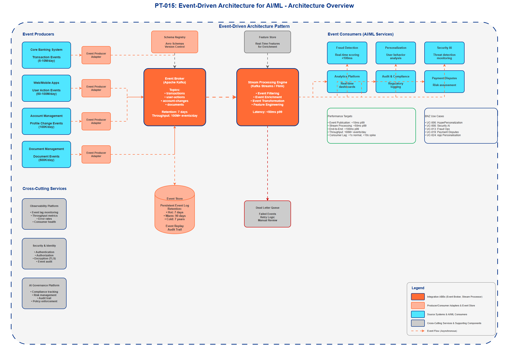

# AI Architecture Pattern Template

## Document Control

| Property | Value |
|----------|-------|
| **Pattern ID** | `PT-015` |
| **Pattern Name** | Event-Driven Architecture for AI/ML |
| **Version** | `1.0.0` |
| **Status** | `Approved` |
| **Created Date** | `2025-12-05` |
| **Last Modified** | `2025-12-05` |
| **Owner** | BNZ Enterprise Architecture |
| **Pattern Category** | `Real-Time` |
| **Maturity Level** | `Mature` |

---

## 1. Pattern Overview

### 1.1 Pattern Name and Classification

**Pattern Name**: Event-Driven Architecture for AI/ML

**Short Name**: Event-Driven AI

**Pattern Category**: Real-Time

**Pattern Type**: Integration, Processing

### 1.2 Intent and Context

**Intent Statement**:
Enable real-time AI/ML processing by reacting to business events (transactions, logins, user actions) as they occur rather than through batch processing.

**Problem Statement**:
Traditional batch processing systems introduce latency that prevents timely responses to critical business events. In banking, fraud detection, personalization, and security monitoring require immediate action when events occur. Tightly coupled systems create dependencies that make it difficult to add new AI/ML consumers without disrupting existing flows.

**Context**:
This pattern is applicable when multiple AI/ML systems need to react to the same business events with minimal latency. It is particularly relevant in financial services where real-time responsiveness is critical for fraud detection, security monitoring, personalization, and compliance. The pattern enables decoupled, scalable architectures where new AI/ML consumers can be added without modifying event producers.

**Forces**:
- Force 1: Need for real-time processing (seconds) vs. operational complexity of streaming infrastructure
- Force 2: Multiple systems need to consume same events vs. risk of tight coupling
- Force 3: Requirement for complete audit trail vs. storage and performance costs
- Force 4: High throughput requirements (millions of events/day) vs. cost constraints
- Force 5: Need for event replay and recovery vs. complexity of event sourcing

### 1.3 Pattern Maturity and Industry Adoption

**Maturity Level**: Mature

**Industry Adoption**:
- **Adoption Rate**: 75% of enterprises in financial services have implemented event-driven architectures
- **Reference Implementations**:
  - Netflix uses Kafka for processing 7 trillion+ events per day
  - Capital One uses event-driven architecture for fraud detection and real-time analytics
  - LinkedIn processes 4+ trillion messages per day through Kafka
- **Timeframe**: Mainstream since 2018, now considered industry standard for real-time processing

**Standards Alignment**:
- Cloud Events specification (CNCF)
- Apache Avro and Protocol Buffers for event schema management
- Event Sourcing pattern (Martin Fowler)
- TOGAF Integration Architecture patterns
- ISO 20022 for financial message standards

---

## 2. Architecture Specification

### 2.1 Architecture Building Blocks (ABBs)

**Primary ABBs** (Core components required):

| ABB ID | ABB Name | Purpose in Pattern | Criticality |
|--------|----------|-------------------|-------------|
| [AB-074](../../architecture-building-blocks/abbs/AB-074/AB-074-Event-Broker-v1.0.0.md) | Event Broker | Reliable message delivery and event streaming | Critical |
| [AB-075](../../architecture-building-blocks/abbs/AB-075/AB-075-Stream-Processing-Engine-v1.0.0.md) | Stream Processing Engine | Real-time event filtering, transformation, and enrichment | Critical |
| [AB-076](../../architecture-building-blocks/abbs/AB-076/AB-076-Event-Producer-Adapter-v1.0.0.md) | Event Producer Adapter | Capture events from source systems (Core Banking, Web App) | Critical |
| [AB-077](../../architecture-building-blocks/abbs/AB-077/AB-077-Event-Consumer-Framework-v1.0.0.md) | Event Consumer Framework | Standardized event consumption for AI/ML services | Critical |
| [AB-038](../../architecture-building-blocks/abbs/AB-038/AB-038-Data-Lake-v1.0.0.md) | Event Store | Persistent storage for event replay and audit | High |

**Supporting ABBs** (Optional or scenario-specific):

| ABB ID | ABB Name | Purpose in Pattern | When Required |
|--------|----------|-------------------|---------------|
| [AB-039](../../architecture-building-blocks/abbs/AB-039/AB-039-Data-Versioning-Service-v1.0.0.md) | Schema Registry | Event schema management and versioning | When multiple teams produce/consume events |
| [AB-078](../../architecture-building-blocks/abbs/AB-078/AB-078-Dead-Letter-Queue-v1.0.0.md) | Dead Letter Queue | Handle failed event processing | Production deployments |
| [AB-088](../../architecture-building-blocks/abbs/AB-088/AB-088-Model-Deployment-Orchestrator-v1.0.0.md) | Feature Store | Cache enriched event features for ML models | When real-time feature engineering is needed |
| [AB-079](../../architecture-building-blocks/abbs/AB-079/AB-079-Event-Replay-Service-v1.0.0.md) | Event Replay Service | Replay historical events for testing or recovery | Debugging and disaster recovery scenarios |

**Cross-Cutting ABBs** (Always required):

| ABB ID | ABB Name | Purpose |
|--------|----------|---------|
| [AB-060](../../architecture-building-blocks/abbs/AB-060/AB-060-AI-Model-Registry-v1.0.0.md) | AI Governance Platform | Compliance, risk management, audit trail |
| [AB-112](../../architecture-building-blocks/abbs/AB-112/AB-112-Data-Encryption-Service-v1.0.0.md) | Security & Identity | Authentication, authorization, encryption of events |
| [AB-096](../../architecture-building-blocks/abbs/AB-096/AB-096-Observability-Platform-v1.0.0.md) | Observability Platform | Monitoring event lag, throughput, error rates |

### 2.2 Pattern Structure

**Architectural Diagram**:



**Component Interaction Flow**:
```
Event Producer (Core Banking, Web App, Mobile) → Event Broker (Kafka)
    ↓
[Stream Processor: Filter, Transform, Enrich]
    ↓
Event Consumers [Fraud Detection | Personalization | Security AI | Analytics | Audit]
    ↓
[Event Store: Persistent Event Log]
```

**Key Interactions**:
1. **Event Production**: Source systems publish events to Event Broker
   - Protocol: Kafka Protocol, HTTPS (REST API fallback)
   - Data Format: Avro with Schema Registry (preferred), JSON (legacy)
   - Latency Target: < 10ms p99 for event publication

2. **Stream Processing**: Real-time transformation and enrichment
   - Processing Type: Asynchronous, stateful stream processing
   - Error Handling: Circuit breaker, retry with exponential backoff, dead letter queue
   - Latency Target: < 50ms p99 for transformation

3. **Event Consumption**: AI/ML services consume filtered, enriched events
   - Delivery Mechanism: Consumer group pattern with offset management
   - Processing Guarantees: At-least-once delivery with idempotent consumers
   - Latency Target: End-to-end < 100ms p99

4. **Event Persistence**: All events stored for replay and audit
   - Storage Pattern: Append-only log with configurable retention
   - Replay Capability: Support for event sourcing and temporal queries

### 2.3 Data Flow

**Data Sources**:
- Core Banking System: Transaction events (payments, transfers, withdrawals) - 5-10M events/day
- Web/Mobile Applications: User interaction events (logins, clicks, navigation) - 50-100M events/day
- Account Management: Customer profile changes (address, phone, preferences) - 100K events/day
- Document Management: Document upload/processing events - 500K events/day

**Data Transformations**:
1. **Event Filtering**: Filter events by type, customer segment, or transaction amount
2. **Event Enrichment**: Add customer profile, account balance, historical patterns from Feature Store
3. **Event Normalization**: Standardize event format across different source systems
4. **Feature Engineering**: Calculate real-time features (transaction velocity, session duration)

**Data Sinks**:
- AI/ML Models: Real-time fraud scoring, personalization engines, security monitoring
- Analytics Platform: Real-time dashboards, operational reporting
- Audit Store: Compliance and regulatory audit trail
- Feature Store: Enriched features for ML model training and serving

**Data Governance**:
- **Classification**: Internal (event metadata), Confidential (customer PII), Restricted (financial data)
- **Retention**: 7 days in hot storage (Kafka), 90 days in warm storage (Amazon S3), 7 years in cold storage (compliance)
- **Lineage**: Event provenance tracked via correlation IDs and event metadata
- **Quality**: Schema validation at ingestion, data quality metrics published to Observability Platform

### 2.4 Interface Specifications

**Inbound Interfaces** (Inputs to pattern):

| Interface ID | Interface Name | Type | Protocol | Data Format | SLA |
|--------------|---------------|------|----------|-------------|-----|
| IF-IN-001 | Transaction Event API | Event Stream | Kafka Protocol | Avro | < 10ms p99 latency |
| IF-IN-002 | User Action Event API | Event Stream | Kafka Protocol | Avro | < 10ms p99 latency |
| IF-IN-003 | Account Change Event API | Event Stream | Kafka Protocol | Avro | < 10ms p99 latency |
| IF-IN-004 | Document Event API | Event Stream | Kafka Protocol | Avro | < 10ms p99 latency |
| IF-IN-005 | Legacy REST Event Gateway | API | REST/HTTPS | JSON | < 50ms p99 latency |

**Outbound Interfaces** (Outputs from pattern):

| Interface ID | Interface Name | Type | Protocol | Data Format | SLA |
|--------------|---------------|------|----------|-------------|-----|
| IF-OUT-001 | Enriched Event Stream | Event Stream | Kafka Protocol | Avro | < 100ms p99 end-to-end |
| IF-OUT-002 | ML Feature Stream | Event Stream | Kafka Protocol | Avro | < 100ms p99 |
| IF-OUT-003 | Audit Event Stream | Event Stream | Kafka Protocol | Avro | < 200ms p99 |
| IF-OUT-004 | Analytics Event Stream | Event Stream | Kafka Protocol | Avro | < 500ms p95 |

**Internal Interfaces** (Between ABBs within pattern):

| Interface ID | Source ABB | Target ABB | Protocol | Purpose |
|--------------|-----------|-----------|----------|---------|
| IF-INT-001 | Event Producer Adapter | Event Broker | Kafka Protocol | Event publication |
| IF-INT-002 | Event Broker | Stream Processing Engine | Kafka Streams API | Event consumption for processing |
| IF-INT-003 | Stream Processing Engine | Feature Store | gRPC | Feature lookup for enrichment |
| IF-INT-004 | Stream Processing Engine | Event Store | Kafka Protocol | Persisted event output |
| IF-INT-005 | Event Broker | Schema Registry | REST/HTTPS | Schema validation |


## 3. Pattern Variants and Options

### 3.1 Pattern Variations

**Variant 1: Simple Event Distribution**
- **When to Use**: Low-latency event distribution without complex processing; fewer than 3 consumer types
- **Key Differences**: No stream processing layer; consumers read directly from event broker
- **Trade-offs**:
  - Gain: Lower latency (< 50ms), reduced operational complexity, lower cost
  - Lose: Duplicated enrichment logic across consumers, no centralized transformation

**Variant 2: Event Sourcing with CQRS**
- **When to Use**: Complete audit trail required; need to rebuild state from events; regulatory compliance
- **Key Differences**: Event store is source of truth; separate read and write models; full event replay capability
- **Trade-offs**:
  - Gain: Complete audit history, ability to time-travel, eventual consistency, better scalability
  - Lose: Increased complexity, eventual consistency challenges, larger storage requirements

**Variant 3: Hybrid Batch-Stream Processing**
- **When to Use**: Mix of real-time and batch workloads; Lambda architecture for complex analytics
- **Key Differences**: Parallel batch and stream processing paths; batch for historical analysis, stream for real-time
- **Trade-offs**:
  - Gain: Support for both real-time and historical analysis, fallback to batch for complex queries
  - Lose: Duplicate logic across batch and stream, increased operational overhead

**Variant 4: Multi-Region Event Replication**
- **When to Use**: Disaster recovery; global deployments; regulatory data residency requirements
- **Key Differences**: Event broker replication across regions; active-active or active-passive topologies
- **Trade-offs**:
  - Gain: High availability, disaster recovery, reduced latency for global users
  - Lose: Increased cost, complexity of conflict resolution, network bandwidth costs

### 3.2 Composition with Other Patterns

**Commonly Combined With**:

| Pattern | Integration Point | Combined Benefit |
|---------|------------------|------------------|
| PT-016 Stream Processing | Event Consumers use stream processing for aggregations | Real-time analytics and complex event processing |
| PT-007 Feature Store | Stream processor enriches events from Feature Store | Real-time feature engineering for ML models |
| PT-021 Model Serving | Events trigger real-time model inference | Low-latency AI/ML predictions on event data |
| PT-013 Model Monitoring | Model predictions published as events | Close monitoring loop for model performance |
| PT-025 Distributed Tracing | Trace event flow across all consumers | End-to-end observability and debugging |

**Anti-Patterns** (What NOT to do):
- **Anti-Pattern 1**: Synchronous request-response over event broker
  - **Why Problematic**: Defeats purpose of async decoupling; introduces latency and tight coupling
  - **Better Approach**: Use API Gateway for synchronous calls; event broker for async notifications

- **Anti-Pattern 2**: Publishing large payloads (> 1MB) as events
  - **Why Problematic**: Increases broker storage costs; impacts throughput; causes consumer memory issues
  - **Better Approach**: Publish event with reference URL; consumers retrieve large payload from object storage

- **Anti-Pattern 3**: No schema versioning or validation
  - **Why Problematic**: Breaking changes disrupt consumers; no contract enforcement; runtime failures
  - **Better Approach**: Use Schema Registry with compatibility rules (backward, forward, full)

- **Anti-Pattern 4**: Single consumer group for all consumers
  - **Why Problematic**: Slow consumer blocks all others; no independent scaling; shared failure domain
  - **Better Approach**: Separate consumer groups per service/team with independent offset management

---

## 4. References and Resources

### 4.1 Related Patterns

| Pattern ID | Pattern Name | Relationship | Reference |
|-----------|-------------|--------------|-----------|
| PT-016 | Stream Processing Pattern | Used with | Provides real-time aggregation and windowing on event streams |
| PT-007 | Feature Store Pattern | Depends on | Provides features for event enrichment |
| PT-021 | Real-Time Model Serving | Used with | Consumes events to trigger ML predictions |
| PT-013 | Model Monitoring Pattern | Used with | Monitors model performance via event streams |
| PT-006 | Batch Processing Pattern | Alternative to | Traditional batch approach for non-real-time scenarios |

### 4.2 Related ABBs

| ABB ID | ABB Name | Document Link |
|--------|----------|---------------|
| [AB-074](../../architecture-building-blocks/abbs/AB-074/AB-074-Event-Broker-v1.0.0.md) | Event Broker | 03-building-blocks/architecture-building-blocks/AB-074-Event-Broker.md |
| [AB-075](../../architecture-building-blocks/abbs/AB-075/AB-075-Stream-Processing-Engine-v1.0.0.md) | Stream Processing Engine | 03-building-blocks/architecture-building-blocks/AB-075-Stream-Processing.md |
| [AB-038](../../architecture-building-blocks/abbs/AB-038/AB-038-Data-Lake-v1.0.0.md) | Event Store | 03-building-blocks/architecture-building-blocks/AB-038-Event-Store.md |
| [AB-088](../../architecture-building-blocks/abbs/AB-088/AB-088-Model-Deployment-Orchestrator-v1.0.0.md) | Feature Store | 03-building-blocks/architecture-building-blocks/AB-088-Feature-Store.md |

### 4.3 Standards and Guidelines

- Cloud Events Specification v1.0 (CNCF): https://cloudevents.io/
- Apache Avro Specification: https://avro.apache.org/docs/current/spec.html
- Event Sourcing Pattern (Martin Fowler): https://martinfowler.com/eaaDev/EventSourcing.html
- TOGAF Integration Patterns: https://pubs.opengroup.org/architecture/togaf9-doc/arch/
- ISO 20022 Financial Services Messages: https://www.iso20022.org/

### 4.4 External References

**Industry Research**:
- Gartner: "How to Build Event-Driven Architectures for Real-Time Analytics" (2024)
- Forrester: "The State of Event-Driven Architecture in Financial Services" (2024)
- O'Reilly: "Designing Event-Driven Systems" by Ben Stopford

**Technology Documentation**:
- Apache Kafka: https://kafka.apache.org/documentation/
- Apache Flink: https://flink.apache.org/
- AWS Kinesis: https://docs.aws.amazon.com/kinesis/
- Amazon Kinesis: https://docs.microsoft.com/azure/event-hubs/

**Vendor Resources**:
- Confluent: "Event-Driven Microservices Architecture" - https://www.confluent.io/resources/
- AWS: "Event-Driven Architecture Best Practices" - https://aws.amazon.com/event-driven-architecture/
- Microsoft: "Event-Driven Architecture on AWS" - https://docs.microsoft.com/azure/architecture/guide/architecture-styles/event-driven

---

## 5. Use Case Applications

**BNZ Use Cases** (Real-Time):
- **[UC-006](../../../01-motivation/03-use-cases/use-cases/UC-006/index.md)**: HyperPersonalization - React to user behavior in real-time to deliver personalized offers and content
- **[UC-008](../../../01-motivation/03-use-cases/use-cases/UC-008/index.md)**: Security AI - Real-time threat detection on login and transaction events
- **[UC-013](../../../01-motivation/03-use-cases/use-cases/UC-013/index.md)**: Fraud Ops - Real-time fraud scoring on transaction events with < 100ms latency
- **[UC-019](../../../01-motivation/03-use-cases/use-cases/UC-019/index.md)**: Payment Disputes - Real-time dispute risk assessment on payment events
- **[UC-024](../../../01-motivation/03-use-cases/use-cases/UC-024/index.md)**: App Personalisation - Real-time UI updates based on user interaction events

**Event Types in Banking Context**:

| Event Type | Example | Consumers | Volume |
|------------|---------|-----------|--------|
| **Transaction** | Payment, transfer, withdrawal | Fraud detection, balance update, analytics | 5-10M/day |
| **Login** | Customer login to app/web | Security monitoring, personalization trigger | 20-30M/day |
| **Account Change** | Address update, phone change | Audit log, CRM update, compliance check | 100K/day |
| **Document Upload** | KYC document submitted | Document processing, compliance workflow | 500K/day |
| **Session Event** | Page view, click, navigation | Personalization, analytics, UX optimization | 50-100M/day |

**When to Use This Pattern**:
- Need for real-time responsiveness (seconds, not hours or days)
- Multiple systems need to react to the same event independently (decoupling)
- Complete audit trail required (event log is immutable record)
- High throughput requirements (millions of events per day)
- Need to add new consumers without modifying producers
- Requirement for event replay or temporal queries

**When NOT to Use This Pattern**:
- Simple request-response interactions (use API Gateway instead)
- Batch processing is sufficient (daily/hourly updates acceptable)
- Very low event volumes (< 1000 events/day)
- Tight consistency requirements (events introduce eventual consistency)
- Organization lacks operational expertise for streaming infrastructure

---

## 6. Technology Stack

**Event Broker Options**:
- **Apache Kafka**: Industry standard, proven at scale, rich ecosystem (Confluent, AWS MSK, Amazon Kinesis for Kafka)
- **AWS Kinesis**: Fully managed, good AWS integration, simpler operations
- **Amazon Kinesis**: AWS-native, Kafka-compatible, integrated with AWS services
- **RabbitMQ**: Simpler deployment, good for lower volumes, strong message routing

**Stream Processing Options**:
- **Kafka Streams**: Java library, tight Kafka integration, exactly-once semantics
- **Apache Flink**: Powerful for complex event processing, stateful computations, advanced windowing
- **Spark Streaming**: Batch + streaming, good for hybrid workloads, mature ecosystem
- **AWS Kinesis Analytics**: Fully managed, SQL interface, good for simple transformations

**Event Store Options**:
- **Kafka Topics**: Built-in event log with configurable retention
- **AWS DynamoDB Streams**: Change data capture, good for event sourcing
- **EventStoreDB**: Purpose-built for event sourcing, optimized for event replay
- **Apache Pulsar**: Multi-tenancy, geo-replication, tiered storage

**Schema Management**:
- **Confluent Schema Registry**: Industry standard for Kafka
- **AWS Glue Schema Registry**: AWS-native, supports Avro, JSON Schema, Protobuf
- **AWS Glue Schema Registry**: Amazon Kinesis integration
- **Apicurio Registry**: Open source, multi-format support

---

## 7. Best Practices

**Architecture Best Practices**:
- Use event schemas (Avro, Protobuf) for backward/forward compatibility
- Implement event versioning strategy (schema evolution)
- Design events as immutable facts (past tense: "OrderPlaced" not "PlaceOrder")
- Include correlation IDs for distributed tracing
- Separate consumer groups per service/team for independent scaling

**Operational Best Practices**:
- Monitor event lag (how far behind is consumer?) with alerting thresholds
- Implement dead-letter queue for failed events with retry logic
- Set appropriate retention policies (balance cost and replay requirements)
- Use consumer group rebalancing for high availability
- Implement circuit breakers to prevent cascading failures

**Event Sourcing Best Practices**:
- Use event sourcing for audit trail (immutable event log)
- Implement event replay for failure recovery and debugging
- Create snapshots for long event streams to optimize replay
- Version event schemas to support evolution over time
- Store events with rich metadata (timestamp, user, correlation ID)

**Security Best Practices**:
- Encrypt events in transit (TLS) and at rest
- Implement authentication and authorization for producers and consumers
- Use separate topics/partitions for different data classifications
- Audit all event access with correlation to business context
- Implement data masking/tokenization for PII in events

**Performance Targets**:
- Event publication: < 10ms p99 latency
- Stream processing: < 50ms p99 transformation latency
- End-to-end: < 100ms p99 from event production to consumption
- Throughput: Support millions of events per second at scale
- Consumer lag: < 1 second under normal load, < 10 seconds during spikes

**Cost Optimization**:
- Use tiered storage (hot/warm/cold) based on access patterns
- Right-size partitions based on throughput requirements
- Implement data retention policies to minimize storage costs
- Use compression for events to reduce bandwidth and storage
- Monitor and optimize consumer group configurations

---

## Appendix A: Glossary

| Term | Definition |
|------|------------|
| **Event** | Immutable fact representing something that happened in the past (e.g., "PaymentCompleted") |
| **Event Broker** | Middleware that receives, stores, and distributes events to consumers (e.g., Kafka, Kinesis) |
| **Event Producer** | System or service that publishes events to the event broker |
| **Event Consumer** | System or service that subscribes to and processes events from the event broker |
| **Stream Processing** | Real-time processing of continuous event streams for filtering, transformation, and aggregation |
| **Event Sourcing** | Pattern where state changes are stored as sequence of events, enabling event replay and audit |
| **Consumer Group** | Set of consumers that coordinate to process events from topics, enabling parallel processing |
| **Consumer Lag** | Difference between latest event in topic and last event processed by consumer |
| **Dead Letter Queue** | Queue for events that failed processing after retry attempts, enabling manual intervention |
| **Event Schema** | Structure definition for events, typically using Avro, Protobuf, or JSON Schema |
| **Schema Registry** | Centralized repository for managing event schemas and ensuring compatibility |
| **Partition** | Ordered, immutable sequence of events within a topic, enabling parallel processing |
| **Offset** | Position of a consumer within a partition, enabling resume after failure |
| **Exactly-Once Semantics** | Guarantee that each event is processed exactly once, even in presence of failures |
| **At-Least-Once Delivery** | Guarantee that each event is delivered at least once, may result in duplicates |
| **Idempotent Consumer** | Consumer that produces same result when processing duplicate events |
| **Event Enrichment** | Process of adding contextual data to events during stream processing |
| **Correlation ID** | Unique identifier linking related events across distributed systems for tracing |
| **Event Replay** | Ability to reprocess historical events from event store for recovery or analysis |

---

## Appendix B: Change History

| Version | Date | Author | Changes |
|---------|------|--------|---------|
| 1.0.0 | 2025-12-05 | BNZ Enterprise Architecture | Initial version based on ai-architecture-patterns.md section 4.1 |

---

## Appendix C: Review and Approval

| Role | Name | Signature | Date |
|------|------|-----------|------|
| **Pattern Author** | BNZ Enterprise Architecture | | 2025-12-05 |
| **Enterprise Architect** | | | |
| **Security Architect** | | | |
| **TAF** | | | |

---

## Appendix D: Diagram Templates

**Required Diagrams** (to be created using draw.io with BNZ Visual Design Standards):

1. **PT-015-Event-Driven-Architecture-v1.0.0.drawio**: High-level architecture showing event flow from producers through broker to consumers
2. **PT-015-Event-Driven-Data-Flow-v1.0.0.drawio**: Detailed data flow showing event transformation and enrichment

**Diagram Requirements**:
- Follow BNZ Visual Design Standards (visual-design-standard.md)
- Canvas size: 2400x1800px (16:9 ratio)
- Color scheme: BNZ Navy Blue (#003087), BNZ Orange (#FF6B35), BNZ Light Blue (#50E6FF), BNZ Teal (#00A651)
- Include legend explaining all symbols, colors, and arrow types
- WCAG 2.1 AA compliance for accessibility
