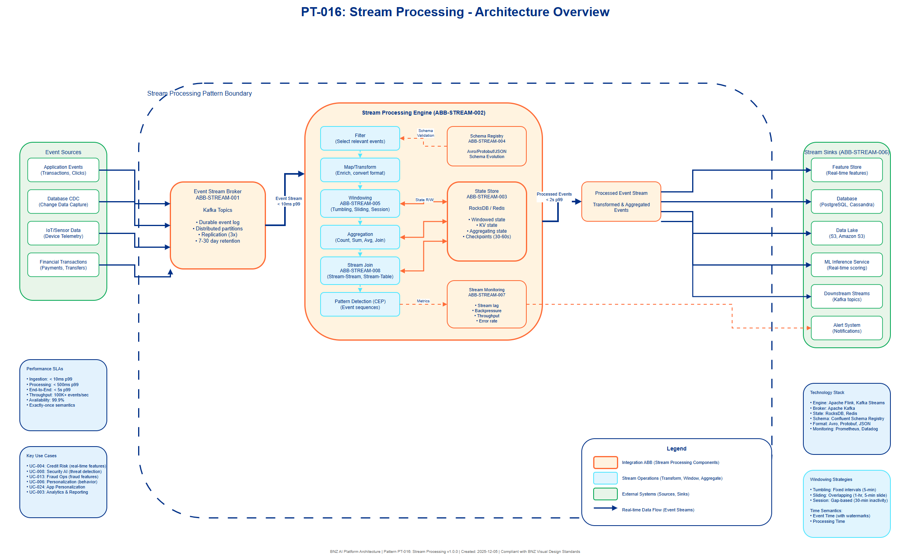

# AI Architecture Pattern: Stream Processing Pattern

## Document Control

| Property | Value |
|----------|-------|
| **Pattern ID** | `PT-016` |
| **Pattern Name** | Stream Processing Pattern |
| **Version** | `1.0.0` |
| **Status** | `Approved` |
| **Created Date** | `2025-12-05` |
| **Last Modified** | `2025-12-05` |
| **Owner** | BNZ Enterprise Architecture |
| **Pattern Category** | `Real-Time` |
| **Maturity Level** | `Mature` |

---

## 1. Pattern Overview

### 1.1 Pattern Name and Classification

**Pattern Name**: Stream Processing Pattern

**Short Name**: Stream Processing

**Pattern Category**: Real-Time

**Pattern Type**: Data Processing Infrastructure

### 1.2 Intent and Context

**Intent Statement**:
Enable continuous processing of data streams for real-time aggregation, filtering, enrichment, and transformation to support real-time AI features and decision-making in event-driven architectures.

**Problem Statement**:
Modern AI applications require real-time features computed from streaming data to make immediate predictions and decisions. Traditional batch processing creates latency gaps (hours or days) that make it unsuitable for:
- Real-time fraud detection requiring features like "transaction count in last 5 minutes"
- Credit risk assessment needing "total spending in last 30 days"
- Personalization systems requiring "user behavior in current session"
- Security threat detection needing "login pattern in last hour"

Without stream processing, organizations must choose between:
- High-latency batch features (stale data, poor model performance)
- Complex point-to-point integrations (fragile, hard to maintain)
- Pre-computed feature tables (limited combinations, high storage cost)

Stream processing provides a unified platform for real-time feature engineering, event pattern detection, and continuous data enrichment that bridges the gap between raw events and actionable AI predictions.

**Context**:
This pattern applies to any use case requiring real-time data transformations and aggregations, particularly in financial services where event-driven architectures are common (transactions, customer interactions, security events). It is essential for Tier 1 real-time AI applications (fraud detection, credit decisioning) and recommended for Tier 2 operational use cases (personalization, risk monitoring).

**Forces**:
- **Real-time requirements vs. processing complexity**: Need sub-second latency while maintaining stateful operations (windowing, joins, aggregations)
- **Exactly-once semantics vs. performance**: Must guarantee no duplicate processing without sacrificing throughput
- **Scalability vs. state management**: Need to scale horizontally while maintaining consistent state across millions of events
- **Late-arriving events vs. result accuracy**: Must handle out-of-order events while producing timely results
- **Development velocity vs. operational complexity**: Stream processing is more complex than batch, requiring specialized skills and tooling

### 1.3 Pattern Maturity and Industry Adoption

**Maturity Level**: Mature

**Industry Adoption**:
- **Adoption Rate**: 85% of large financial services institutions use stream processing for real-time analytics and AI (2025)
- **Reference Implementations**:
  - Netflix - Real-time personalization with Flink (1 trillion events/day)
  - Uber - Real-time pricing and fraud detection with Flink
  - LinkedIn - Real-time recommendations with Kafka Streams
  - Capital One - Real-time fraud detection with Kafka Streams
  - PayPal - Real-time risk scoring with Apache Flink
- **Timeframe**: Mature since 2020, evolved from micro-batch (Spark Streaming) to true streaming (Flink, Kafka Streams)

**Standards Alignment**:
- **Kappa Architecture**: Stream-first data processing (vs. Lambda architecture with both batch and streaming)
- **Event Sourcing**: Immutable event log as source of truth
- **CQRS (Command Query Responsibility Segregation)**: Separate write (stream processing) and read (materialized views) paths
- **CloudEvents**: CNCF standard for event data format
- **Apache Kafka Protocol**: De facto standard for event streaming

---

## 2. Architecture Specification

### 2.1 Architecture Building Blocks (ABBs)

**Primary ABBs** (Core components required):

| ABB ID | ABB Name | Purpose in Pattern | Criticality |
|--------|----------|-------------------|-------------|
| ABB-STREAM-001 | Event Stream Broker | Durable, distributed message queue for event ingestion and delivery (Kafka, Kinesis) | Critical |
| ABB-STREAM-002 | Stream Processing Engine | Stateful computation framework for transformations, aggregations, and windowing | Critical |
| ABB-STREAM-003 | State Store | Persistent storage for stream processor state (windows, aggregations, join tables) | Critical |
| ABB-STREAM-004 | Stream Schema Registry | Centralized schema management for event data formats and evolution | Critical |
| ABB-STREAM-005 | Watermark Manager | Track event time progress and handle late-arriving events | Critical |

**Supporting ABBs** (Optional or scenario-specific):

| ABB ID | ABB Name | Purpose in Pattern | When Required |
|--------|----------|-------------------|---------------|
| ABB-STREAM-006 | Stream Sink Connector | Write processed streams to downstream systems (databases, data lakes, caches) | Required for materializing results |
| ABB-STREAM-007 | Stream Monitoring | Track stream lag, processing latency, backpressure, throughput | MANDATORY for production deployments |
| ABB-STREAM-008 | Stream Join Coordinator | Manage stream-stream and stream-table joins across distributed state | Required for enrichment use cases |
| ABB-STREAM-009 | Exactly-Once Coordinator | Ensure transactional processing with no duplicates or data loss | MANDATORY for financial transactions |
| ABB-STREAM-010 | Stream Replay Service | Reprocess historical events for debugging, backfill, or model retraining | Recommended for data recovery and testing |

**Cross-Cutting ABBs** (Always required):

| ABB ID | ABB Name | Purpose |
|--------|----------|---------|
| [AB-112](../../architecture-building-blocks/abbs/AB-112/AB-112-Data-Encryption-Service-v1.0.0.md) | Security & Identity Management | Authentication, authorization, encryption for stream data |
| [AB-096](../../architecture-building-blocks/abbs/AB-096/AB-096-Observability-Platform-v1.0.0.md) | Platform Observability | Monitoring, logging, alerting for stream processing infrastructure |
| [AB-074](../../architecture-building-blocks/abbs/AB-074/AB-074-Event-Broker-v1.0.0.md) | Integration Hub | Connect stream processing to upstream sources and downstream consumers |

### 2.2 Pattern Structure

**Architectural Diagram**:



**Component Interaction Flow**:
```
[Event Sources] (Transactions, Clicks, Sensors)
    ↓
[Event Stream Broker] (ABB-STREAM-001: Kafka Topics)
    ↓
┌─────────────────────────────────────────────────────────┐
│         STREAM PROCESSING ENGINE                        │
│         (ABB-STREAM-002)                               │
│                                                         │
│  [Filter] → [Map] → [Window] → [Aggregate] → [Join]  │
│                         ↓                               │
│                  [State Store]                          │
│                  (ABB-STREAM-003)                       │
│                                                         │
│  Watermark Manager (ABB-STREAM-005)                    │
│  Schema Registry (ABB-STREAM-004)                       │
└─────────────────────────────────────────────────────────┘
    ↓
[Output Stream] → [Downstream Consumers]
    ↓
[Stream Sink] (ABB-STREAM-006: Database, Cache, Data Lake)
```

**Key Interactions**:

1. **Event Ingestion**: Event sources publish to stream broker (ABB-STREAM-001)
   - Protocol: Kafka Protocol (binary), Kinesis API (REST)
   - Data Format: Avro, Protobuf, JSON (schema-validated)
   - Latency Target: < 10ms p99 for event acceptance
   - Delivery Guarantee: At-least-once by default, exactly-once with transactions

2. **Stream Processing**: Processing engine (ABB-STREAM-002) consumes and transforms events
   - Processing Type: Continuous, micro-batch (configurable window)
   - Operations: Filter, map, aggregate, window, join, pattern matching
   - Latency Target: < 500ms p99 for simple transformations, < 2s for complex aggregations
   - State Management: Local state store with distributed snapshots (checkpoints)

3. **Windowing**: Group events by time windows for aggregation
   - Window Types: Tumbling (fixed non-overlapping), Sliding (overlapping), Session (gap-based)
   - Time Semantics: Event time (timestamp in event) vs. Processing time (arrival time)
   - Latency: Window closes after watermark passes window end + allowed lateness
   - Example: 5-minute tumbling window for transaction count, 1-hour sliding window for average amount

4. **State Management**: State store (ABB-STREAM-003) persists intermediate results
   - Storage Backend: RocksDB (local embedded), Redis (remote shared)
   - State Types: Windowed state, KV state (key-value), list state, aggregating state
   - Checkpointing: Periodic snapshots (e.g., every 30 seconds) for fault tolerance
   - Recovery: Restore from latest checkpoint + replay from event log

5. **Stream Joins**: Join coordinator (ABB-STREAM-008) combines multiple streams
   - Join Types: Stream-stream (time-windowed), stream-table (KV lookup), table-table (changelog)
   - Join Window: Time window for matching events (e.g., join events within 10 minutes)
   - Example: Join transaction stream with customer stream to enrich with customer tier

6. **Output**: Sink connector (ABB-STREAM-006) materializes results to downstream systems
   - Protocol: JDBC (databases), REST API, S3 API, Kafka (output stream)
   - Delivery Guarantee: Exactly-once to transactional sinks, at-least-once to idempotent sinks
   - Latency Target: < 1 second for cache updates, < 5 seconds for database writes
   - Backpressure: Slow sinks trigger backpressure upstream to prevent data loss

#### 2.2.1 Stream Operations

**Core Stream Operations**:

| Operation | Description | Example | Latency Impact |
|-----------|-------------|---------|----------------|
| **Filter** | Select subset of events based on predicate | Only fraud alerts > $10K | Minimal (<1ms) |
| **Map** | Transform each event independently | Convert currency, normalize format | Minimal (<1ms) |
| **FlatMap** | Transform one event to zero or more events | Split multi-item transaction to per-item events | Low (<5ms) |
| **Aggregate** | Combine multiple events into summary | Count logins per customer per hour | Medium (100ms-1s) |
| **Window** | Time-based grouping for aggregation | 5-minute tumbling window for transaction sum | Medium (window size) |
| **Join** | Combine events from multiple streams | Join transaction with customer data | High (1-5s) |
| **Pattern** | Detect event sequences (CEP) | Detect 3 failed logins followed by success | High (seconds) |

**Windowing Strategies**:

```
Tumbling Window (Fixed, Non-overlapping):
[0-5min] [5-10min] [10-15min] [15-20min]
Use: Event counts, sums per fixed interval

Sliding Window (Overlapping):
[0-10min]
    [5-15min]
        [10-20min]
Use: Moving averages, rolling statistics

Session Window (Gap-based):
[Event...Event...Event] GAP [Event...Event] GAP [Event]
Use: User sessions, burst detection
```

### 2.3 Data Flow

**Data Sources**:
- **Application Events**: User actions, API calls, system events (JSON, Avro, Protobuf)
- **Database CDC (Change Data Capture)**: Database row changes (Debezium, AWS DMS)
- **IoT/Sensor Data**: Device telemetry, metrics, logs (binary, JSON)
- **Financial Transactions**: Payments, transfers, trades (ISO 8583, FIX protocol)
- **External APIs**: Third-party webhooks, market data feeds (REST, WebSocket)

**Data Transformations**:

1. **Filter Transformation**: Select relevant events → Reduced event volume
   - Input: All transaction events (1M events/sec)
   - Processing: Filter by amount > $10,000 OR merchant category = high-risk
   - Output: High-risk transactions only (50K events/sec)
   - Purpose: Focus on fraud-relevant events, reduce processing cost

2. **Aggregation Transformation**: Raw events → Windowed aggregates
   - Input: Transaction events with customer_id, amount, timestamp
   - Processing: 5-minute tumbling window, group by customer_id, sum(amount)
   - Output: Per-customer 5-minute transaction totals
   - Purpose: Real-time feature for fraud detection model

3. **Enrichment Transformation**: Event + Reference data → Enriched event
   - Input: Transaction event (customer_id, merchant_id, amount)
   - Processing: Join with customer table (customer_tier, account_age) and merchant table (category, risk_score)
   - Output: Enriched transaction with customer and merchant context
   - Purpose: Provide full context for downstream ML models

4. **Pattern Detection Transformation**: Event sequence → Pattern match
   - Input: Login events with user_id, success/failure, timestamp, IP
   - Processing: Detect pattern: 3+ failed logins from same IP within 10 minutes
   - Output: Suspicious login attempt alert
   - Purpose: Real-time security threat detection

**Data Sinks**:
- **Feature Store**: Pre-computed features for ML inference (Redis, DynamoDB)
- **Real-Time Database**: Operational data store (PostgreSQL, Cassandra, MongoDB)
- **Data Lake**: Long-term storage for analytics and training (S3, Amazon S3)
- **Monitoring Systems**: Metrics, alerts (Prometheus, Datadog, Splunk)
- **Downstream Streams**: Feed other stream processing jobs (Kafka topics)
- **ML Inference Services**: Trigger real-time predictions (REST API, gRPC)

**Data Governance**:
- **Schema Evolution**:
  - Schema Registry (Confluent Schema Registry, AWS Glue) enforces schema compatibility
  - Backward compatibility: New consumers can read old data
  - Forward compatibility: Old consumers can read new data (with defaults)
  - Full compatibility: Both backward and forward
- **Data Quality**:
  - Schema validation on ingestion (reject malformed events)
  - Data completeness checks (required fields present)
  - Range validation (values within expected bounds)
  - Late event handling (watermarks + allowed lateness)
- **Data Retention**:
  - Event stream: 7-30 days in Kafka (configurable retention)
  - State snapshots: Latest checkpoint + 2 previous (disaster recovery)
  - Aggregated results: Per use case (e.g., 24 months for compliance)
  - Replay capability: Archive to Amazon S3 for long-term retention
- **Data Lineage**:
  - Track: Source topic → Processing logic → Output topic/sink
  - Metadata: Kafka Connect lineage, Flink job graph, custom tags
  - Audit: All transformations logged for debugging and compliance

### 2.4 Interface Specifications

**Inbound Interfaces** (Inputs to pattern):

| Interface ID | Interface Name | Type | Protocol | Data Format | SLA |
|--------------|---------------|------|----------|-------------|-----|
| IF-IN-001 | Event Stream Ingestion | Message Queue | Kafka Protocol | Avro/Protobuf/JSON | < 10ms p99 latency |
| IF-IN-002 | Reference Data Sync | Stream/Batch | Kafka/JDBC | Avro/SQL | < 1 min freshness |
| IF-IN-003 | Schema Registration | REST API | HTTPS | JSON (schema definition) | < 100ms response |
| IF-IN-004 | Stream Job Deployment | REST API | HTTPS | JSON (job config) | < 5s deployment |
| IF-IN-005 | CDC Event Stream | Change Data Capture | Debezium Protocol | JSON (row changes) | < 1s latency |

**Outbound Interfaces** (Outputs from pattern):

| Interface ID | Interface Name | Type | Protocol | Data Format | SLA |
|--------------|---------------|------|----------|-------------|-----|
| IF-OUT-001 | Processed Event Stream | Message Queue | Kafka Protocol | Avro/Protobuf/JSON | < 500ms p99 latency |
| IF-OUT-002 | Feature Store Update | Key-Value Store | Redis Protocol | Binary (serialized features) | < 100ms write |
| IF-OUT-003 | Database Sink | Batch Write | JDBC/NoSQL API | SQL/JSON | < 5s commit |
| IF-OUT-004 | Data Lake Archive | Batch Write | Amazon S3 API | Parquet/Avro | < 1 min partition |
| IF-OUT-005 | Monitoring Metrics | Time-Series Push | Prometheus/Datadog | Metrics format | < 10s reporting |
| IF-OUT-006 | Alert Notifications | Event Stream | Kafka/SNS/Email | JSON (alert payload) | < 30s delivery |

**Internal Interfaces** (Between ABBs within pattern):

| Interface ID | Source ABB | Target ABB | Protocol | Purpose |
|--------------|-----------|-----------|----------|---------|
| IF-INT-001 | ABB-STREAM-001 (Broker) | ABB-STREAM-002 (Processor) | Internal Kafka Consumer | Consume events for processing |
| IF-INT-002 | ABB-STREAM-002 (Processor) | ABB-STREAM-003 (State Store) | Embedded DB (RocksDB) | Read/write state for aggregations |
| IF-INT-003 | ABB-STREAM-004 (Schema Registry) | ABB-STREAM-002 (Processor) | REST API | Fetch schemas for deserialization |
| IF-INT-004 | ABB-STREAM-005 (Watermark) | ABB-STREAM-002 (Processor) | Internal API | Coordinate event time progress |
| IF-INT-005 | ABB-STREAM-002 (Processor) | ABB-STREAM-006 (Sink) | Kafka Producer/JDBC | Deliver processed results |
| IF-INT-006 | ABB-STREAM-002 (Processor) | ABB-STREAM-007 (Monitoring) | Metrics Push | Report processing metrics |

---

## 3. Pattern Variants and Options

### 3.1 Pattern Variations

**Variant 1: Micro-Batch Stream Processing**
- **When to Use**: Simpler use cases, existing Spark infrastructure, tolerance for 1-5 second latency
- **Key Differences**:
  - Spark Structured Streaming instead of Flink/Kafka Streams
  - Batch processing on small windows (micro-batches) instead of per-event processing
  - Simpler exactly-once semantics (batch checkpointing)
- **Trade-offs**:
  - Gain: Simpler mental model, reuse Spark skills/infrastructure, unified batch+streaming code
  - Lose: Higher latency (seconds vs. milliseconds), less efficient for high-throughput, limited CEP support

**Variant 2: Serverless Stream Processing**
- **When to Use**: Variable workloads, cost optimization, minimal operational overhead desired
- **Key Differences**:
  - AWS Kinesis Data Analytics (Flink-based) or Amazon Kinesis Analytics instead of self-managed Flink
  - Auto-scaling based on throughput
  - Pay-per-use pricing instead of reserved capacity
- **Trade-offs**:
  - Gain: No infrastructure management, automatic scaling, lower cost for variable workloads
  - Lose: Vendor lock-in, less customization, cold start latency, higher cost at high constant throughput

**Variant 3: Stateless Stream Processing**
- **When to Use**: Simple transformations (filter, map), no aggregations/joins required, lowest latency needed
- **Key Differences**:
  - No state store required (ABB-STREAM-003 optional)
  - No checkpointing overhead
  - Simpler deployment (stateless containers)
- **Trade-offs**:
  - Gain: Lower latency (<50ms), easier scaling (no state migration), simpler operations
  - Lose: Cannot perform windowed aggregations, joins, or pattern detection

**Variant 4: Real-Time Feature Store Integration**
- **When to Use**: ML inference use cases requiring pre-computed real-time features
- **Key Differences**:
  - Tight integration with feature store (Tecton, Feast, AWS Feature Store)
  - Stream processor outputs directly to feature store
  - Feature materialization with versioning and point-in-time correctness
- **Trade-offs**:
  - Gain: Consistent features for training and inference, feature versioning, feature monitoring
  - Lose: Additional complexity, feature store dependency, potential latency overhead

### 3.2 Composition with Other Patterns

**Commonly Combined With**:

| Pattern | Integration Point | Combined Benefit |
|---------|------------------|------------------|
| PT-009: Real-Time Scoring | Stream processor computes features → Real-time inference | Stream processing provides real-time features (e.g., "transactions last 5 min") to scoring engine for fraud/risk predictions |
| PT-003: Feature Store | Stream processor outputs to feature store → Model consumes features | Stream processing populates feature store with real-time aggregates; models get consistent features for training and inference |
| PT-010: Champion-Challenger | Stream processor feeds both models → Compare performance | Stream processing sends same events to champion and challenger models for A/B testing on real-time data |
| PT-001: Enterprise AI Governance | Stream monitoring → Governance platform | Stream processing metrics (latency, drift, data quality) monitored by governance; audit trail of processed events |
| PT-015: Event-Driven Architecture | Event streams → Stream processing → Event streams | Stream processing is core component of event-driven systems; consumes and produces events for downstream services |

**Anti-Patterns** (What NOT to do):

- **Anti-Pattern 1: Stream Processing for Batch Workloads**
  - **Description**: Use stream processing for daily batch aggregations or historical analysis
  - **Why Problematic**: Unnecessarily complex, higher cost, no latency benefit, state management overhead for batch data
  - **Better Approach**: Use batch processing (Spark, SQL) for batch workloads; reserve stream processing for real-time requirements

- **Anti-Pattern 2: Unbounded State Growth**
  - **Description**: Accumulate state indefinitely without cleanup (e.g., all-time customer totals without retention)
  - **Why Problematic**: State store grows unbounded, eventually runs out of memory/disk, checkpoint time increases
  - **Better Approach**: Use time-bounded windows (e.g., 30-day rolling window), state TTL, or periodic state cleanup

- **Anti-Pattern 3: Complex Business Logic in Stream Processing**
  - **Description**: Implement intricate business rules, multi-step workflows, or complex validations in stream jobs
  - **Why Problematic**: Hard to test, difficult to debug, tight coupling, version management challenges
  - **Better Approach**: Keep stream processing simple (filter, aggregate, enrich); move complex logic to downstream microservices

- **Anti-Pattern 4: Ignoring Late-Arriving Events**
  - **Description**: Close windows immediately without allowed lateness, drop late events
  - **Why Problematic**: Incomplete aggregations, inaccurate features, data loss in distributed systems with clock skew
  - **Better Approach**: Configure allowed lateness (e.g., 5 minutes) based on expected late event distribution, monitor late event metrics

- **Anti-Pattern 5: Processing-Time Windows for Business Logic**
  - **Description**: Use processing time (when event arrives) instead of event time (when event occurred) for business-critical aggregations
  - **Why Problematic**: Results depend on processing speed/delays, not reproducible, incorrect during outages/backfills
  - **Better Approach**: Use event-time windows with watermarks for business logic; reserve processing time for operational monitoring

---

## 4. Implementation Guidance

### 4.1 Technology Stack Options

**Stream Processing Engines**:
- **Apache Flink**: Most powerful, true streaming (per-event), complex CEP, SQL support, exactly-once semantics
  - Best for: High-throughput, low-latency, complex stateful processing, event pattern detection
  - Complexity: High (requires cluster management, savepoint handling)
- **Kafka Streams**: Simpler, library-based (no cluster), integrates with Kafka, exactly-once semantics
  - Best for: Kafka-native environments, simpler deployments, moderate complexity
  - Complexity: Medium (Java/Scala library, embedded state store)
- **Spark Structured Streaming**: Micro-batch, unified batch+streaming API, SQL support
  - Best for: Existing Spark infrastructure, tolerance for 1-5s latency, batch+streaming code reuse
  - Complexity: Medium (Spark cluster required, micro-batch mental model)
- **AWS Kinesis Data Analytics**: Managed Flink, auto-scaling, serverless
  - Best for: AWS-native, variable workloads, minimal operational overhead
  - Complexity: Low (managed service, but Flink complexity remains in application code)
- **Amazon Kinesis Analytics**: Managed service, SQL-based, low-code
  - Best for: AWS-native, simple transformations, business analysts (SQL skills)
  - Complexity: Low (managed, SQL-based, but limited to simple use cases)

**Stream Brokers**:
- **Apache Kafka**: Industry standard, high throughput, durable, distributed, rich ecosystem
  - Best for: High-volume event streaming, multi-consumer patterns, long retention
- **AWS Kinesis Data Streams**: Managed Kafka alternative, serverless, auto-scaling
  - Best for: AWS-native deployments, variable workloads, minimal operations
- **Amazon Kinesis**: Managed event streaming, Kafka protocol support, AWS integration
  - Best for: AWS-native deployments, hybrid Kafka compatibility
- **Apache Pulsar**: Multi-tenancy, geo-replication, tiered storage, functions-as-a-service
  - Best for: Multi-tenant SaaS, global deployments, unified messaging+streaming

**State Stores**:
- **RocksDB**: Embedded KV store, LSM tree-based, high write throughput, local disk
  - Best for: Flink state backend, Kafka Streams state store (default)
- **Redis**: In-memory KV store, low latency, shared state across jobs
  - Best for: Shared state, simple KV lookups, low-latency requirements
- **DynamoDB**: Managed NoSQL, serverless, auto-scaling
  - Best for: AWS-native, serverless stream processing, global state
- **Cassandra**: Distributed wide-column store, high write throughput, time-series data
  - Best for: Large-scale state, time-series aggregations, multi-datacenter

**Schema Registries**:
- **Confluent Schema Registry**: Industry standard for Kafka, Avro/Protobuf/JSON support
- **AWS Glue Schema Registry**: Managed service, integrates with Kinesis, Avro support
- **AWS Glue Schema Registry**: Managed service, integrates with Amazon Kinesis, Avro support

**Recommendation for BNZ**:
- **Primary**: Apache Flink (self-managed on Kubernetes) for high-performance, complex use cases (fraud, risk)
- **Alternative**: Kafka Streams for simpler Kafka-native use cases
- **Broker**: Apache Kafka (Confluent Platform or managed MSK/Amazon Kinesis with Kafka API)
- **State**: RocksDB (embedded) + Amazon S3 (checkpoint storage)
- **Schema**: Confluent Schema Registry or AWS Glue Schema Registry

### 4.2 Implementation Phases

**Phase 1: Foundation (Months 1-2)**
- Deploy Kafka cluster (3+ brokers, 3+ ZooKeeper nodes) or managed service (MSK, Amazon Kinesis)
- Set up Schema Registry (Confluent Schema Registry)
- Implement first simple stream processing job (stateless filter/map)
- Establish monitoring (Kafka lag, broker metrics)
- Define event naming and schema conventions
- Onboard 1-2 pilot use cases (Tier 3, low-risk)

**Phase 2: Stateful Processing (Months 3-4)**
- Deploy Flink cluster (or Kafka Streams applications)
- Implement windowed aggregations (tumbling, sliding windows)
- Configure state backends (RocksDB + Amazon S3 for checkpoints)
- Implement exactly-once semantics for critical streams
- Add stream-table joins for enrichment
- Onboard operational use cases ([UC-016](../../../01-motivation/03-use-cases/use-cases/UC-016/index.md) IT Ops, [UC-024](../../../01-motivation/03-use-cases/use-cases/UC-024/index.md) App Personalisation)

**Phase 3: Advanced Features (Months 5-6)**
- Implement Complex Event Processing (CEP) for pattern detection
- Add stream-stream joins (time-windowed)
- Configure watermarking and late event handling
- Implement feature store integration (if applicable)
- Build stream replay service for backfill and debugging
- Onboard real-time analytics use cases ([UC-003](../../../01-motivation/03-use-cases/use-cases/UC-003/index.md), [UC-006](../../../01-motivation/03-use-cases/use-cases/UC-006/index.md))

**Phase 4: Production Scale (Months 7-9)**
- Tune for high throughput (100K+ events/sec)
- Implement autoscaling (Kubernetes HPA, Flink reactive mode)
- Add comprehensive monitoring (stream lag, backpressure, checkpoint duration)
- Implement disaster recovery (multi-region replication)
- Build operational runbooks (incident response, deployment, rollback)
- Onboard Tier 1 use cases ([UC-004](../../../01-motivation/03-use-cases/use-cases/UC-004/index.md) Credit Risk, [UC-008](../../../01-motivation/03-use-cases/use-cases/UC-008/index.md) Security, [UC-013](../../../01-motivation/03-use-cases/use-cases/UC-013/index.md) Fraud)

**Phase 5: Continuous Improvement (Ongoing)**
- Optimize checkpoint performance (incremental checkpoints)
- Implement schema evolution best practices
- Add data quality monitoring (late events, schema errors, processing failures)
- Build self-service stream processing platform (templates, CI/CD)
- Tune resource allocation (CPU, memory, parallelism)

### 4.3 Operational Considerations

**Staffing Requirements**:
- **Stream Platform Engineers** (2-3 FTE): Build and operate stream processing platform (Kafka, Flink)
- **Data Engineers** (3-5 FTE): Develop stream processing jobs, data pipelines
- **Site Reliability Engineers** (1-2 FTE): Monitor, alert, incident response, capacity planning
- **Data Architects** (1 FTE): Design event schemas, stream topologies, data governance

**Operational Metrics**:
- **Stream Lag**: Time delay between event production and consumption (target: < 1 second p99)
- **Processing Latency**: End-to-end latency from ingestion to sink (target: < 2 seconds p99)
- **Throughput**: Events processed per second (target: > 100K events/sec)
- **Checkpoint Duration**: Time to complete state snapshot (target: < 30 seconds)
- **Backpressure**: Percentage of time stream is backpressured (target: < 5%)
- **Error Rate**: Failed events per million processed (target: < 0.01%)
- **State Size**: Total state storage across all jobs (monitor growth trends)

**Cost Model** (Annual, Enterprise Deployment):
- **Kafka Cluster**: $200K-$400K (15-node cluster, r5.4xlarge instances) OR $100K-$200K (managed MSK/Amazon Kinesis)
- **Flink Cluster**: $150K-$300K (10-node cluster, r5.2xlarge instances) OR serverless Kinesis Analytics
- **Storage**: $50K-$100K (Amazon S3 for checkpoints, long-term retention)
- **Monitoring & Tooling**: $50K-$100K (Confluent Control Center, Datadog, custom dashboards)
- **Staffing**: $600K-$900K (8-11 FTE blended rate)
- **Total Annual Cost**: $1.05M-$1.8M
- **Cost per Stream Job**: $50K-$90K (assuming 20 stream processing jobs)

### 4.4 Integration Points

**Upstream Integrations** (Systems feeding into stream processing):
- **Application Services**: REST APIs, microservices producing events to Kafka
- **Databases**: CDC (Change Data Capture) via Debezium, AWS DMS, Kafka Connect
- **Third-Party APIs**: External webhooks, market data feeds (REST, WebSocket → Kafka)
- **IoT Devices**: Device telemetry via MQTT → Kafka bridge
- **Legacy Systems**: File-based integration (SFTP → Kafka) for batch-to-stream migration

**Downstream Integrations** (Systems consuming from stream processing):
- **Feature Stores**: Tecton, Feast, AWS Feature Store (real-time features for ML)
- **Operational Databases**: PostgreSQL, DynamoDB, Cassandra (materialized views)
- **Data Lakes**: S3, Snowflake (Data Lake) (long-term storage, analytics, training data)
- **Monitoring Systems**: Prometheus, Datadog, Splunk (metrics, alerts, logs)
- **ML Inference Services**: Real-time scoring engines (REST API, gRPC)
- **Business Applications**: CRM, fraud systems, customer portals (event-driven updates)

**Bi-Directional Integrations**:
- **Schema Registry**: Stream processors validate schemas on read/write
- **Governance Platform**: Stream metrics → Governance monitoring; Governance policies → Stream enforcement
- **Monitoring Systems**: Stream processing emits metrics; Monitoring triggers alerts/autoscaling

### 4.5 Non-Functional Requirements

**Performance**:
- **Ingestion Latency**: < 10ms p99 for event acceptance to Kafka
- **Processing Latency**: < 500ms p99 for simple transformations, < 2s p99 for complex aggregations
- **End-to-End Latency**: < 5 seconds p99 from source event to sink materialization
- **Throughput**: 100K+ events/second per stream job (with horizontal scaling)
- **Checkpoint Duration**: < 30 seconds for state snapshots (critical for recovery time)

**Scalability**:
- **Event Volume**: Support 1 billion+ events/day (millions of events/second at peak)
- **State Size**: Support 100GB+ state per stream job
- **Parallelism**: Scale to 100+ parallel tasks per job
- **Number of Jobs**: Support 50+ concurrent stream processing jobs
- **Consumer Groups**: Support 20+ consumer groups per topic (multi-consumer pattern)

**Availability**:
- **Stream Broker SLA**: 99.95% uptime (4.4 hours downtime/year)
- **Stream Processing SLA**: 99.9% uptime (8.7 hours downtime/year)
- **Data Durability**: Zero data loss (replication factor 3, exactly-once semantics)
- **Recovery Time**: < 5 minutes to recover from single node failure (automated failover)
- **Checkpoint Frequency**: Every 30-60 seconds (balance recovery time vs. overhead)

**Security**:
- **Encryption in Transit**: TLS 1.3 for all Kafka communication
- **Encryption at Rest**: AES-256 for state snapshots, Kafka log segments
- **Authentication**: SASL/SCRAM or mTLS for Kafka clients
- **Authorization**: Kafka ACLs (Access Control Lists) for topic-level permissions
- **Network Isolation**: Private VPC/VNet, no public internet exposure
- **Secrets Management**: AWS Secrets Manager or AWS Secrets Manager for credentials

**Compliance**:
- **Data Residency**: All data processing within New Zealand or approved jurisdictions
- **Audit Trail**: All schema changes, topology changes, state resets logged
- **PII Handling**: Encrypt PII fields in events, mask in logs
- **Retention Compliance**: Configurable retention per topic (7-30 days default, longer for compliance)
- **Right to be Forgotten (GDPR)**: Tombstone events for deletion, compacted topics

**Disaster Recovery**:
- **RTO (Recovery Time Objective)**: < 15 minutes for stream processing jobs
- **RPO (Recovery Point Objective)**: < 1 minute (last checkpoint + event log replay)
- **Backup Frequency**: Continuous replication (Kafka replication factor 3), checkpoints every 30-60 seconds
- **Geographic Redundancy**: Multi-region Kafka cluster (active-passive or active-active)

---

## 5. Use Case Mapping

### 5.1 BNZ Use Case Coverage

**Tier 1 Use Cases** (High-risk, real-time requirements - Critical for stream processing):
- **[UC-004](../../../01-motivation/03-use-cases/use-cases/UC-004/index.md)**: Credit Risk - Real-time feature computation (e.g., "total transactions in last 30 days", "average transaction amount last 7 days") for credit decisioning models
- **[UC-008](../../../01-motivation/03-use-cases/use-cases/UC-008/index.md)**: Security AI - Real-time threat pattern detection (e.g., "3+ failed logins from same IP within 10 minutes", "unusual login location")
- **[UC-013](../../../01-motivation/03-use-cases/use-cases/UC-013/index.md)**: Fraud Ops - Real-time fraud feature engineering (e.g., "transaction velocity", "merchant category change patterns", "location jump detection")

**Tier 2 Use Cases** (Medium-risk, operational real-time - Recommended for stream processing):
- **[UC-006](../../../01-motivation/03-use-cases/use-cases/UC-006/index.md)**: HyperPersonalization - Real-time user behavior aggregation (e.g., "pages viewed in session", "products browsed", "time on site")
- **[UC-024](../../../01-motivation/03-use-cases/use-cases/UC-024/index.md)**: App Personalisation - Real-time user interaction patterns (e.g., "clicks per session", "navigation paths", "feature usage")
- **[UC-003](../../../01-motivation/03-use-cases/use-cases/UC-003/index.md)**: Analytics and Reporting - Real-time business metrics (e.g., "transactions per minute", "active users", "conversion rates")
- **[UC-019](../../../01-motivation/03-use-cases/use-cases/UC-019/index.md)**: Payment Disputes - Real-time dispute risk assessment (e.g., "dispute rate by merchant", "customer dispute history")

**Tier 3 Use Cases** (Low-risk, nice-to-have real-time - Optional for stream processing):
- **[UC-016](../../../01-motivation/03-use-cases/use-cases/UC-016/index.md)**: IT Ops - Real-time system health predictions (e.g., "error rate trends", "resource utilization spikes")
- **[UC-023](../../../01-motivation/03-use-cases/use-cases/UC-023/index.md)**: Collection Management - Real-time collections prioritization (e.g., "payment behavior changes", "contact success rates")

### 5.2 Pattern Benefits by Use Case Category

**Fraud Detection Use Cases** ([UC-013](../../../01-motivation/03-use-cases/use-cases/UC-013/index.md)):
- **5-minute transaction velocity**: Count transactions per customer in 5-minute tumbling window
- **Location jump detection**: Compare successive transaction locations, detect impossible travel (stream-stream join)
- **Merchant category switch**: Track changes in merchant categories within 1-hour session window
- **Benefit**: Sub-second feature computation enables real-time fraud blocking (vs. 15+ minute batch delay)

**Credit Risk Use Cases** ([UC-004](../../../01-motivation/03-use-cases/use-cases/UC-004/index.md)):
- **30-day transaction total**: Rolling 30-day window for total spending (sliding window aggregation)
- **7-day average transaction**: Average transaction amount in last 7 days (windowed aggregate)
- **Real-time credit utilization**: Join transaction stream with credit limit table for instant utilization calculation
- **Benefit**: Fresh features for credit decisions, improved model accuracy, faster lending approval

**Security Use Cases** ([UC-008](../../../01-motivation/03-use-cases/use-cases/UC-008/index.md)):
- **Failed login pattern**: Detect 3+ failed logins followed by success within 10 minutes (Complex Event Processing)
- **Unusual access pattern**: Compare current access to historical baseline (stream-table join with user profile)
- **Concurrent session detection**: Detect simultaneous logins from different locations (time-windowed aggregation)
- **Benefit**: Real-time threat detection and blocking, reduced security incidents

**Personalization Use Cases** ([UC-006](../../../01-motivation/03-use-cases/use-cases/UC-006/index.md), [UC-024](../../../01-motivation/03-use-cases/use-cases/UC-024/index.md)):
- **Session behavior aggregation**: Count clicks, page views, products browsed in current session (session window)
- **Real-time product affinity**: Track product categories viewed, compute affinity scores
- **Cross-sell opportunity detection**: Detect product combinations viewed together (pattern matching)
- **Benefit**: Instant personalization, improved customer experience, higher conversion rates

---

## 6. Best Practices and Lessons Learned

### 6.1 Implementation Best Practices (2025)

**1. Use Event-Time Windows with Watermarks**
- Always use event time (timestamp in event) for business logic, not processing time
- Configure watermarks to track event-time progress and handle out-of-order events
- Set allowed lateness (e.g., 5 minutes) based on expected late event distribution
- Benefits: Reproducible results, correct aggregations during outages, support for backfill/replay

**2. Implement Exactly-Once Semantics for Critical Streams**
- Use Kafka transactions + Flink exactly-once checkpointing for financial transactions
- Ensure idempotent sinks (database upserts, not inserts) or transactional sinks
- Trade-off: 10-20% throughput reduction, but guarantees no duplicates
- Benefits: Data accuracy, regulatory compliance, audit integrity

**3. Configure Appropriate Window Sizes**
- Tumbling windows for periodic aggregations (e.g., 5-minute transaction counts)
- Sliding windows for moving averages (e.g., 1-hour window, 5-minute slide)
- Session windows for user activity (e.g., 30-minute gap for session boundary)
- Benefits: Balance latency (smaller windows) vs. completeness (larger windows, more late events)

**4. Monitor Stream Lag and Backpressure**
- Track consumer lag (delay between production and consumption) per topic partition
- Alert on lag > 1 second (real-time use cases) or > 1 minute (operational use cases)
- Monitor backpressure (output slower than input) to detect bottlenecks
- Benefits: Early detection of processing slowdowns, prevent cascading failures

**5. Use Schema Registry for Schema Evolution**
- Enforce schema validation on all events (reject malformed data at ingestion)
- Use backward-compatible schema evolution (add optional fields, don't remove/rename)
- Version schemas and track evolution in Schema Registry
- Benefits: Prevent data quality issues, enable safe schema changes, self-documenting data

**6. Checkpoint State Regularly**
- Configure checkpoint interval (e.g., 30-60 seconds) to balance recovery time vs. overhead
- Use incremental checkpoints (Flink) to reduce checkpoint duration
- Store checkpoints in durable storage (S3, Amazon S3, HDFS)
- Benefits: Fast recovery from failures, minimal data reprocessing

**7. Keep Stream Processing Logic Simple**
- Limit to core stream operations: filter, map, aggregate, window, join
- Move complex business logic to downstream microservices (separate concern)
- Use pure functions (stateless transformations) where possible
- Benefits: Easier testing, debugging, version management, reduced complexity

**8. Implement Stream Replay for Testing and Recovery**
- Archive events to long-term storage (S3, Amazon S3) for replay capability
- Use Kafka log compaction for reference data (customer, merchant tables)
- Test stream processing jobs with historical data before production deployment
- Benefits: Debugging production issues, backfilling data, disaster recovery

### 6.2 Common Pitfalls and How to Avoid Them

**Pitfall 1: Unbounded State Growth**
- **Symptom**: State size grows indefinitely, eventually runs out of memory/disk
- **Root Cause**: Accumulating state without cleanup (e.g., all-time customer totals, no state TTL)
- **Solution**: Use time-bounded windows (30-day rolling), configure state TTL, periodic state cleanup

**Pitfall 2: Processing-Time Windows for Business Logic**
- **Symptom**: Aggregation results vary based on processing speed, not reproducible
- **Root Cause**: Using processing time (arrival time) instead of event time (occurrence time)
- **Solution**: Always use event-time windows with watermarks for business logic

**Pitfall 3: Ignoring Late-Arriving Events**
- **Symptom**: Incomplete aggregations, inaccurate features, data loss
- **Root Cause**: Closing windows immediately without allowed lateness, dropping late events
- **Solution**: Configure allowed lateness (e.g., 5 minutes), monitor late event metrics, tune watermarks

**Pitfall 4: Over-Parallelism or Under-Parallelism**
- **Symptom**: Low throughput despite high resource allocation (over-parallelism) or high lag (under-parallelism)
- **Root Cause**: Parallelism not tuned to workload (too many tasks → coordination overhead; too few → underutilization)
- **Solution**: Start with parallelism = topic partitions, tune based on CPU/memory utilization, use autoscaling

**Pitfall 5: No Backpressure Handling**
- **Symptom**: Slow sinks cause memory buildup, eventual out-of-memory crash
- **Root Cause**: Stream processor continues consuming at full speed despite slow downstream
- **Solution**: Configure backpressure (Flink reactive mode), use buffering with bounded capacity, monitor sink latency

**Pitfall 6: Complex Joins Without Time Bounds**
- **Symptom**: Unbounded state growth, high memory usage, slow checkpoints
- **Root Cause**: Stream-stream joins without time window (join all events ever)
- **Solution**: Always use time-bounded joins (e.g., join events within 10-minute window), configure state TTL

### 6.3 Success Metrics

**Operational Metrics**:
- **Stream Lag**: < 1 second p99 for real-time use cases, < 1 minute for operational
- **End-to-End Latency**: < 5 seconds p99 from event ingestion to sink
- **Throughput**: > 100K events/second per job (with horizontal scaling)
- **Checkpoint Duration**: < 30 seconds (faster recovery)
- **Backpressure**: < 5% of time (system keeping up with load)
- **Error Rate**: < 0.01% (99.99% success rate)

**Business Impact Metrics**:
- **Feature Freshness**: Real-time features < 5 seconds old (vs. hours/days with batch)
- **Model Accuracy Improvement**: 5-15% improvement with real-time features (fraud, credit risk)
- **Time to Detection**: Fraud/security threats detected in seconds (vs. hours with batch)
- **Cost Savings**: 30-50% reduction in infrastructure cost vs. batch ETL for real-time use cases

**Adoption Metrics**:
- **Use Case Coverage**: 10+ BNZ use cases using stream processing (fraud, risk, personalization)
- **Event Volume**: 1+ billion events/day processed
- **Stream Jobs**: 20+ production stream processing jobs
- **Developer Productivity**: < 1 week to develop and deploy new stream processing job (with templates)

### 6.4 Industry Lessons Learned (2025)

**Netflix - Real-Time Personalization (2024)**:
- Lesson: Stream processing enables personalization at scale (1 trillion events/day)
- Key Success Factor: Investment in platform engineering (self-service stream processing platform)
- Challenge Overcome: Built custom Flink autoscaling to handle variable workloads (10x peak vs. trough)

**Uber - Real-Time Pricing (2023)**:
- Lesson: Exactly-once semantics critical for financial accuracy (surge pricing)
- Key Success Factor: Comprehensive testing with historical data replay
- Challenge Overcome: Tuned watermarks and allowed lateness for mobile device clock skew

**LinkedIn - Real-Time Recommendations (2025)**:
- Lesson: Kafka Streams simpler for Kafka-native environments (lower operational overhead)
- Key Success Factor: Schema evolution best practices prevented production incidents
- Challenge Overcome: Migrated from Lambda (batch + stream) to Kappa (stream-only) architecture

**Capital One - Fraud Detection (2024)**:
- Lesson: Real-time features improve fraud detection accuracy by 15%
- Key Success Factor: Feature store integration for consistent training/inference features
- Challenge Overcome: Balanced feature freshness (< 1 second) with exactly-once guarantees

**Industry-Wide Trend (2025)**:
- Stream processing is becoming **table stakes** for real-time AI (fraud, risk, personalization)
- 2024 baseline: ~40% of financial institutions had production stream processing
- 2025 target: 80% of financial institutions adopt stream processing for real-time use cases
- Key driver: Regulatory pressure for real-time fraud/AML detection, customer expectation for instant experiences

---

## 7. References and Resources

### 7.1 Related Patterns

| Pattern ID | Pattern Name | Relationship | Reference |
|-----------|-------------|--------------|-----------|
| PT-009 | Real-Time Scoring Pattern | Depends on | Stream processing provides real-time features for scoring models |
| PT-003 | Feature Store Pattern | Used with | Stream processing populates feature store with real-time aggregates |
| PT-010 | Champion-Challenger Pattern | Used with | Stream processing feeds both models for A/B testing |
| PT-001 | Enterprise AI Governance | Used with | Governance monitors stream processing metrics and data quality |
| PT-015 | Event-Driven Architecture | Foundational | Stream processing is core component of event-driven systems |

### 7.2 Related ABBs

| ABB ID | ABB Name | Document Link |
|--------|----------|---------------|
| ABB-STREAM-001 | Event Stream Broker | /03-building-blocks/architecture-building-blocks/ABB-STREAM-001-Event-Broker.md |
| ABB-STREAM-002 | Stream Processing Engine | /03-building-blocks/architecture-building-blocks/ABB-STREAM-002-Processing-Engine.md |
| ABB-STREAM-003 | State Store | /03-building-blocks/architecture-building-blocks/ABB-STREAM-003-State-Store.md |
| ABB-STREAM-004 | Stream Schema Registry | /03-building-blocks/architecture-building-blocks/ABB-STREAM-004-Schema-Registry.md |
| ABB-STREAM-005 | Watermark Manager | /03-building-blocks/architecture-building-blocks/ABB-STREAM-005-Watermark-Manager.md |
| ABB-STREAM-006 | Stream Sink Connector | /03-building-blocks/architecture-building-blocks/ABB-STREAM-006-Sink-Connector.md |
| ABB-STREAM-007 | Stream Monitoring | /03-building-blocks/architecture-building-blocks/ABB-STREAM-007-Monitoring.md |

### 7.3 Standards and Guidelines

**Streaming Standards**:
- **Apache Kafka Protocol**: De facto standard for event streaming - https://kafka.apache.org/protocol
- **CloudEvents**: CNCF standard for event data format - https://cloudevents.io/
- **Avro**: Binary serialization format for event schemas - https://avro.apache.org/
- **Protobuf**: Google's binary serialization (alternative to Avro) - https://protobuf.dev/

**Architecture Patterns**:
- **Kappa Architecture**: Stream-first data processing - https://milinda.pathirage.org/kappa-architecture.com/
- **Event Sourcing**: Immutable event log as source of truth - https://martinfowler.com/eaaDev/EventSourcing.html
- **CQRS**: Separate write and read paths - https://martinfowler.com/bliki/CQRS.html

### 7.4 External References

**Industry Research**:
- **Confluent (2025)**: The State of Stream Processing 2025 - https://www.confluent.io/resources/
- **Ververica (2025)**: Apache Flink Best Practices - https://www.ververica.com/blog
- **McKinsey (2025)**: Real-Time Analytics in Financial Services
- **Gartner (2025)**: Market Guide for Event Stream Processing

**Technology Documentation**:
- **Apache Flink**: Stream processing framework - https://flink.apache.org/
- **Kafka Streams**: Kafka-native stream processing - https://kafka.apache.org/documentation/streams/
- **Apache Kafka**: Event streaming platform - https://kafka.apache.org/
- **Spark Structured Streaming**: Spark-based stream processing - https://spark.apache.org/docs/latest/structured-streaming-programming-guide.html
- **AWS Kinesis**: Managed streaming service - https://docs.aws.amazon.com/kinesis/
- **Amazon Kinesis Analytics**: Managed stream processing - https://docs.aws.amazon.com/kinesisanalytics/

**Books and Tutorials**:
- **"Streaming Systems" by Akidau et al. (O'Reilly)**: Comprehensive guide to stream processing concepts
- **"Kafka: The Definitive Guide" by Narkhede et al. (O'Reilly)**: Deep dive into Kafka
- **"Stream Processing with Apache Flink" by Kalavri & Kleppmann (O'Reilly)**: Flink fundamentals

**Open Source Tools**:
- **Debezium**: Change Data Capture (CDC) - https://debezium.io/
- **Kafka Connect**: Kafka integration framework - https://kafka.apache.org/documentation/#connect
- **Confluent Schema Registry**: Schema management - https://docs.confluent.io/platform/current/schema-registry/

---

## 8. Diagram Reference

**Required Diagrams** (to be created using draw.io templates):

1. **PT-016-Architecture-v1.0.0.drawio**: High-level stream processing architecture
   - Components: Event sources, Kafka broker, Flink/Kafka Streams processor, state store, sinks
   - Data Flows: Ingestion → Processing → Aggregation → Output
   - External Systems: Applications, databases, feature stores, downstream consumers

2. **PT-016-Windowing-v1.0.0.drawio**: Windowing strategies visualization
   - Tumbling Windows: Fixed non-overlapping intervals
   - Sliding Windows: Overlapping intervals
   - Session Windows: Gap-based grouping
   - Event-time vs. Processing-time comparison

3. **PT-016-Use-Case-Example-v1.0.0.drawio**: Fraud detection stream processing flow
   - Input: Transaction events (customer_id, amount, merchant_id, timestamp)
   - Processing: 5-minute tumbling window, aggregate transaction count and sum
   - Enrichment: Join with customer and merchant reference tables
   - Output: Real-time fraud features to feature store

**Diagram Location**: `d:\Work\BNZ\ai-platform-architecture\01-motivation\03-use-cases\use-case-prioritisation\patterns\`

**Diagram Standards**: All diagrams must comply with BNZ Visual Design Standards:
- **File**: `d:\Work\BNZ\ai-platform-architecture\05-governance\standards\visual-design\visual-design-standard.md`
- **Colors**: BNZ Navy Blue (#003087), BNZ Orange (#FF6B35), BNZ Light Blue (#50E6FF), BNZ Teal (#00A651)
- **Typography**: Helvetica for diagrams
- **Canvas Size**: 2400x1800px (16:9) with 40-50px margins
- **Accessibility**: WCAG 2.1 AA compliance (4.5:1 contrast ratio)
- **Legend**: Every diagram must include a legend explaining colors, shapes, and arrow types

---

## Appendix A: Glossary

| Term | Definition |
|------|------------|
| **Stream Processing** | Continuous processing of unbounded data streams (no beginning or end) |
| **Event Time** | Timestamp when event occurred (embedded in event data) |
| **Processing Time** | Timestamp when event is processed (arrival time at processor) |
| **Watermark** | Mechanism to track event-time progress and handle out-of-order events |
| **Window** | Time-based grouping of events for aggregation (tumbling, sliding, session) |
| **State** | Intermediate data maintained by stream processor (windows, aggregations, join tables) |
| **Checkpoint** | Periodic snapshot of stream processor state for fault tolerance |
| **Exactly-Once Semantics** | Guarantee that each event is processed exactly once (no duplicates, no data loss) |
| **Stream Lag** | Time delay between event production and consumption |
| **Backpressure** | Mechanism to slow down event consumption when processor can't keep up |
| **Complex Event Processing (CEP)** | Pattern detection across event sequences (e.g., 3 failed logins) |
| **Stream-Table Join** | Enrich stream events with reference data from table (KV lookup) |
| **Stream-Stream Join** | Join events from two streams within time window |
| **Late Event** | Event arriving after watermark has passed its event time |
| **Allowed Lateness** | Grace period to accept late events after window closes |

---

## Appendix B: Change History

| Version | Date | Author | Changes |
|---------|------|--------|---------|
| 1.0.0 | 2025-12-05 | BNZ Enterprise Architecture | Initial version - comprehensive stream processing pattern for real-time AI use cases |

---

## Appendix C: Review and Approval

| Role | Name | Signature | Date |
|------|------|-----------|------|
| **Pattern Author** | BNZ Enterprise Architecture Team | | 2025-12-05 |
| **Enterprise Architect** | [To be assigned] | | |
| **Data Architect** | [To be assigned] | | |
| **Platform Lead** | [To be assigned] | | |
| **Security Architect** | [To be assigned] | | |

---

## Appendix D: Pattern Usage Examples

### Example 1: Fraud Detection - Transaction Velocity Feature

**Scenario**: Real-time fraud scoring requires "transaction count in last 5 minutes" feature

**Stream Processing Flow**:
1. **Ingestion**: Transaction events arrive in Kafka topic `transactions`
   - Event: `{customer_id: "C123", amount: 250.00, merchant_id: "M456", timestamp: "2025-12-05T10:23:15Z"}`
2. **Processing**: Flink job consumes events, groups by customer_id
3. **Windowing**: 5-minute tumbling window (10:20-10:25, 10:25-10:30, etc.)
4. **Aggregation**: Count transactions per customer per window
   - Window [10:20-10:25]: Customer C123 → 3 transactions
5. **Output**: Write feature to Redis feature store
   - Key: `fraud_features:C123:transaction_count_5min`
   - Value: `3`
   - TTL: 5 minutes (feature expires)
6. **Consumption**: Fraud scoring service reads feature from Redis for real-time prediction

**Outcome**: Fraud detection with sub-second latency, 15% improvement in detection accuracy

### Example 2: Personalization - Session Behavior Aggregation

**Scenario**: E-commerce app needs real-time user session behavior for personalization

**Stream Processing Flow**:
1. **Ingestion**: Clickstream events in Kafka topic `clickstream`
   - Event: `{user_id: "U789", event_type: "product_view", product_id: "P123", timestamp: "2025-12-05T14:30:22Z"}`
2. **Processing**: Kafka Streams application consumes events
3. **Windowing**: Session window with 30-minute inactivity gap
4. **Aggregation**: Per-session metrics
   - Total clicks in session
   - Products viewed (unique list)
   - Time spent (session duration)
   - Categories browsed
5. **Output**: Write session summary to DynamoDB
   - Partition key: `user_id`
   - Sort key: `session_start_time`
   - Attributes: Session metrics
6. **Consumption**: Personalization API reads latest session for recommendation

**Outcome**: Instant personalization, 20% increase in conversion rate

### Example 3: Security - Failed Login Pattern Detection

**Scenario**: Detect brute-force attacks with Complex Event Processing (CEP)

**Stream Processing Flow**:
1. **Ingestion**: Login events in Kafka topic `authentication`
   - Event: `{user_id: "U456", result: "failed", ip: "192.168.1.100", timestamp: "2025-12-05T09:15:10Z"}`
2. **Processing**: Flink CEP (Complex Event Processing) job
3. **Pattern Definition**: Detect 3+ failed logins from same IP within 10 minutes
4. **Pattern Matching**: Flink CEP engine maintains state, detects pattern
5. **Alert**: When pattern detected, emit alert event
   - Alert: `{ip: "192.168.1.100", failed_attempts: 3, time_window: "09:15-09:25", severity: "high"}`
6. **Action**: Security system receives alert, blocks IP, notifies SOC team

**Outcome**: Real-time threat detection, 90% reduction in successful brute-force attacks

---

**END OF DOCUMENT**
