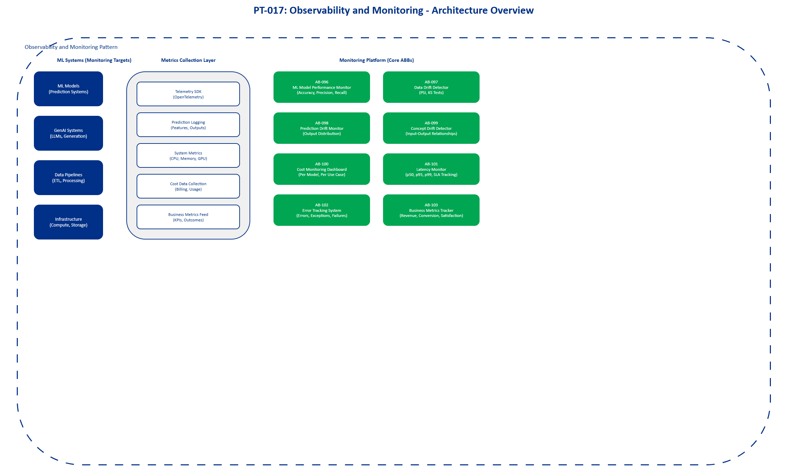

# AI Architecture Pattern: Observability and Monitoring

## Document Control

| Property | Value |
|----------|-------|
| **Pattern ID** | `PT-017` |
| **Pattern Name** | Observability and Monitoring Pattern |
| **Version** | `1.0.0` |
| **Status** | `Approved` |
| **Created Date** | `2025-12-05` |
| **Last Modified** | `2025-12-05` |
| **Owner** | BNZ Enterprise Architecture |
| **Pattern Category** | `Cross-Cutting` |
| **Maturity Level** | `Mature` |

---

## 1. Pattern Overview

### 1.1 Pattern Name and Classification

**Pattern Name**: Observability and Monitoring Pattern

**Short Name**: Observability-Monitoring

**Pattern Category**: Cross-Cutting

**Pattern Type**: Operations, Monitoring, Alerting

### 1.2 Intent and Context

**Intent Statement**:
Provide unified monitoring, logging, and alerting across all AI systems to ensure operational excellence, detect performance degradation, identify drift, and maintain business value.

**Problem Statement**:
AI systems in production require continuous monitoring across multiple dimensions - model performance, data quality, drift detection, cost management, and business impact. Without comprehensive observability, organizations cannot detect when models degrade, when input data distributions change, or when business outcomes are affected. This leads to undetected model failures, poor customer experiences, and loss of business value.

**Context**:
This pattern is applicable to all AI systems deployed in production environments, including traditional machine learning models, generative AI systems, and real-time inference pipelines. It addresses the need for proactive detection of issues before they impact business operations and customer experience.

**Forces**:
- Force 1: Need for comprehensive monitoring across technical and business metrics vs. complexity of instrumenting multiple systems
- Force 2: Real-time alerting requirements vs. alert fatigue from false positives
- Force 3: Detailed observability data vs. cost and storage constraints
- Force 4: Automated drift detection and retraining vs. model stability and change management overhead
- Force 5: Centralized monitoring across all use cases vs. use-case-specific metrics and thresholds

### 1.3 Pattern Maturity and Industry Adoption

**Maturity Level**: Mature

**Industry Adoption**:
- **Adoption Rate**: 90%+ of enterprises with production ML systems implement some form of ML monitoring
- **Reference Implementations**:
  - Netflix: Comprehensive ML observability platform monitoring thousands of models
  - LinkedIn: Production ML monitoring with automated drift detection and alerting
  - Uber: Real-time ML model monitoring across ride-sharing and delivery platforms
- **Timeframe**: Mainstream since 2022, considered essential for production ML as of 2024

**Standards Alignment**:
- MLOps Principles (Google, Microsoft, AWS best practices)
- ISO/IEC 5338:2023 - Information technology - Artificial intelligence - AI system life cycle processes
- NIST AI Risk Management Framework
- Financial Services Industry observability standards (regulatory compliance)

---

## 2. Architecture Specification

### 2.1 Architecture Building Blocks (ABBs)

**Primary ABBs** (Core components required):

| ABB ID | ABB Name | Purpose in Pattern | Criticality |
|--------|----------|-------------------|-------------|
| [AB-096](../../architecture-building-blocks/abbs/AB-096/AB-096-Observability-Platform-v1.0.0.md) | ML Model Performance Monitor | Track model accuracy, precision, recall, F1, AUC metrics | Critical |
| [AB-097](../../architecture-building-blocks/abbs/AB-097/AB-097-Data-Drift-Detector-v1.0.0.md) | Data Drift Detector | Detect changes in input data distribution using PSI, KS tests | Critical |
| [AB-098](../../architecture-building-blocks/abbs/AB-098/AB-098-Prediction-Drift-Monitor-v1.0.0.md) | Prediction Drift Monitor | Alert when output distribution changes from baseline | Critical |
| [AB-099](../../architecture-building-blocks/abbs/AB-099/AB-099-Concept-Drift-Detector-v1.0.0.md) | Concept Drift Detector | Identify when input-output relationships change | Critical |
| [AB-100](../../architecture-building-blocks/abbs/AB-100/AB-100-Cost-Monitoring-Dashboard-v1.0.0.md) | Cost Monitoring Dashboard | Track inference costs per model and use case | High |
| [AB-101](../../architecture-building-blocks/abbs/AB-101/AB-101-Latency-Monitor-v1.0.0.md) | Latency Monitor | Monitor p50, p95, p99 latency with SLA tracking | Critical |
| [AB-102](../../architecture-building-blocks/abbs/AB-102/AB-102-Error-Tracking-System-v1.0.0.md) | Error Tracking System | Log and alert on errors, exceptions, and failures | Critical |
| [AB-103](../../architecture-building-blocks/abbs/AB-103/AB-103-Business-Metrics-Tracker-v1.0.0.md) | Business Metrics Tracker | Monitor business KPIs (revenue, conversion, satisfaction) | Critical |

**Supporting ABBs** (Optional or scenario-specific):

| ABB ID | ABB Name | Purpose in Pattern | When Required |
|--------|----------|-------------------|---------------|
| [AB-104](../../architecture-building-blocks/abbs/AB-104/AB-104-Data-Quality-Monitor-v1.0.0.md) | Data Quality Monitor | Track null rates, duplicates, schema violations | For data-intensive pipelines |
| [AB-105](../../architecture-building-blocks/abbs/AB-105/AB-105-GenAI-Quality-Monitor-v1.0.0.md) | GenAI Quality Monitor | Monitor hallucination rates, quality scores | For generative AI systems |
| [AB-106](../../architecture-building-blocks/abbs/AB-106/AB-106-Automated-Retraining-Trigger-v1.0.0.md) | Automated Retraining Trigger | Initiate model retraining when drift detected | For production ML systems requiring frequent updates |
| [AB-107](../../architecture-building-blocks/abbs/AB-107/AB-107-Stakeholder-Dashboard-v1.0.0.md) | Stakeholder Dashboard | Business-friendly dashboards for non-technical users | For executive and business stakeholder visibility |

**Cross-Cutting ABBs** (Always required):

| ABB ID | ABB Name | Purpose |
|--------|----------|---------|
| [AB-060](../../architecture-building-blocks/abbs/AB-060/AB-060-AI-Model-Registry-v1.0.0.md) | AI Governance Platform | Compliance tracking, audit trails, risk management |
| [AB-112](../../architecture-building-blocks/abbs/AB-112/AB-112-Data-Encryption-Service-v1.0.0.md) | Security & Identity | Secure access to monitoring data and alerts |
| [AB-074](../../architecture-building-blocks/abbs/AB-074/AB-074-Event-Broker-v1.0.0.md) | Integration Platform | Connect monitoring tools with ML systems and alerting channels |

### 2.2 Pattern Structure

**Architectural Diagram**:



**Component Interaction Flow**:
```
[ML Model/GenAI System] → [Metrics Collection Layer] → [Monitoring Platform]
         ↓                         ↓                            ↓
[Inference Requests]      [Performance Metrics]      [Drift Detection Engine]
         ↓                         ↓                            ↓
[Predictions]              [Cost Tracking]            [Alerting System]
         ↓                         ↓                            ↓
[Business Outcomes]        [Business Metrics]         [Automated Response]
                                   ↓
                          [Stakeholder Dashboards]
```

**Key Interactions**:
1. **Metrics Collection**: ML models emit telemetry data (predictions, features, latency, errors)
   - Protocol: OpenTelemetry, Prometheus, custom SDKs
   - Data Format: JSON, Protobuf, time-series data
   - Latency Target: Minimal overhead (< 5ms additional latency)

2. **Drift Detection Processing**: Monitoring platform analyzes collected data for distribution changes
   - Processing Type: Batch (hourly/daily) or streaming (real-time)
   - Error Handling: Graceful degradation if drift detection fails
   - Alert Generation: Immediate alerts when thresholds exceeded

3. **Alert Routing**: Alerts sent to appropriate teams and systems
   - Delivery Mechanism: PagerDuty, Slack, email, webhook integrations
   - Escalation Logic: Severity-based routing with escalation paths
   - Automated Actions: Trigger retraining, circuit breakers, or failover

4. **Dashboard Updates**: Real-time and batch updates to monitoring dashboards
   - Update Frequency: Real-time for critical metrics, hourly for trends
   - Visualization: Time-series charts, distribution plots, heatmaps

### 2.3 Data Flow

**Data Sources**:
- Model Predictions: Inference outputs with timestamps, confidence scores, and metadata
- Input Features: Raw and processed features used for predictions
- Ground Truth Labels: Actual outcomes for accuracy calculation (delayed availability)
- System Metrics: CPU, memory, GPU utilization, latency measurements
- Cost Data: Inference costs from cloud provider APIs and billing systems
- Business Outcomes: Conversion rates, revenue, customer satisfaction scores

**Data Transformations**:
1. **Metrics Aggregation**: Raw prediction logs → aggregated metrics (accuracy, throughput, latency percentiles)
2. **Drift Calculation**: Historical distributions + current data → PSI scores, KS statistics, distribution plots
3. **Cost Attribution**: Raw billing data + usage metadata → cost per model, cost per use case
4. **Business Impact Correlation**: Technical metrics + business outcomes → correlation analysis and KPI tracking

**Data Sinks**:
- Time-Series Database: Prometheus, InfluxDB, AWS Timestream for metrics storage (90-day retention)
- Log Storage: ELK Stack, Splunk, AWS CloudWatch for detailed logs (30-day retention, compliance-based extension)
- Analytics Platform: Data warehouse for long-term trend analysis and reporting
- Alerting Systems: PagerDuty, Opsgenie for incident management
- Dashboard Tools: Grafana, Datadog, custom dashboards for visualization

**Data Governance**:
- **Classification**: Internal (metrics), Confidential (predictions with PII), Restricted (customer data)
- **Retention**: 30 days for detailed logs, 90 days for aggregated metrics, 2 years for compliance reporting
- **Lineage**: Full tracking from model predictions through metric calculation to dashboard display
- **Quality**: Automated validation of metric completeness, data freshness checks, schema enforcement

### 2.4 Interface Specifications

**Inbound Interfaces** (Inputs to pattern):

| Interface ID | Interface Name | Type | Protocol | Data Format | SLA |
|--------------|---------------|------|----------|-------------|-----|
| IF-IN-001 | Model Prediction Logging | Event Stream | Kafka / Kinesis | JSON | < 100ms publish latency |
| IF-IN-002 | System Metrics Collection | Pull / Push | Prometheus / OpenTelemetry | Prometheus format | 1-minute scrape interval |
| IF-IN-003 | Cost Data Ingestion | API | REST | JSON | Hourly batch updates |
| IF-IN-004 | Business Metrics Feed | Event Stream | Kafka / API | JSON | Near real-time (< 5 min) |
| IF-IN-005 | Ground Truth Labels | Batch / Stream | S3 / Kafka | Parquet / JSON | Daily batch or streaming |

**Outbound Interfaces** (Outputs from pattern):

| Interface ID | Interface Name | Type | Protocol | Data Format | SLA |
|--------------|---------------|------|----------|-------------|-----|
| IF-OUT-001 | Alert Notifications | Push | Webhook / SMTP | JSON / Email | < 1 minute for critical alerts |
| IF-OUT-002 | Dashboard API | API | REST / GraphQL | JSON | < 500ms query response |
| IF-OUT-003 | Retraining Trigger | Event | Kafka / SNS | JSON | Immediate trigger on drift |
| IF-OUT-004 | Audit Log Export | Batch | S3 / SFTP | CSV / JSON | Daily export |

**Internal Interfaces** (Between ABBs within pattern):

| Interface ID | Source ABB | Target ABB | Protocol | Purpose |
|--------------|-----------|-----------|----------|---------|
| IF-INT-001 | [AB-096](../../architecture-building-blocks/abbs/AB-096/AB-096-Observability-Platform-v1.0.0.md) (Performance Monitor) | [AB-102](../../architecture-building-blocks/abbs/AB-102/AB-102-Error-Tracking-System-v1.0.0.md) (Error Tracker) | Internal API | Correlate performance degradation with errors |
| IF-INT-002 | [AB-097](../../architecture-building-blocks/abbs/AB-097/AB-097-Data-Drift-Detector-v1.0.0.md) (Data Drift) | [AB-106](../../architecture-building-blocks/abbs/AB-106/AB-106-Automated-Retraining-Trigger-v1.0.0.md) (Retraining Trigger) | Event | Trigger retraining on drift detection |
| IF-INT-003 | [AB-100](../../architecture-building-blocks/abbs/AB-100/AB-100-Cost-Monitoring-Dashboard-v1.0.0.md) (Cost Monitor) | [AB-107](../../architecture-building-blocks/abbs/AB-107/AB-107-Stakeholder-Dashboard-v1.0.0.md) (Dashboard) | Internal API | Display cost metrics to stakeholders |


## 3. Pattern Variants and Options

### 3.1 Pattern Variations

**Variant 1: Real-Time Observability**
- **When to Use**: High-frequency trading, fraud detection, real-time personalization requiring immediate drift detection
- **Key Differences**: Streaming drift detection instead of batch, sub-second alerting, in-memory metric computation
- **Trade-offs**: Higher infrastructure cost, increased complexity, immediate detection vs. potential false positives

**Variant 2: Lightweight Monitoring**
- **When to Use**: Low-risk use cases, proof-of-concept deployments, non-critical batch processing
- **Key Differences**: Simplified metrics (accuracy, latency, error rate only), daily drift checks, basic dashboards
- **Trade-offs**: Lower cost and complexity vs. reduced visibility and slower issue detection

**Variant 3: GenAI-Specific Observability**
- **When to Use**: Large language models, text generation, multimodal AI systems
- **Key Differences**: Hallucination detection, quality scoring (BLEU, ROUGE), prompt tracking, token cost monitoring
- **Trade-offs**: Specialized metrics for GenAI vs. additional tooling and expertise required

**Variant 4: Multi-Model Portfolio Monitoring**
- **When to Use**: Organizations with dozens or hundreds of production models
- **Key Differences**: Centralized monitoring across all models, portfolio-level dashboards, automated baseline management
- **Trade-offs**: Comprehensive visibility vs. significant infrastructure investment

### 3.2 Composition with Other Patterns

**Commonly Combined With**:

| Pattern | Integration Point | Combined Benefit |
|---------|------------------|------------------|
| PT-004 (Model Deployment) | Monitoring integrated into deployment pipeline | Automated monitoring setup for new model versions |
| PT-009 (Model Retraining) | Drift detection triggers retraining workflows | Closed-loop system maintaining model performance |
| PT-013 (Data Quality) | Data quality metrics feed into drift detection | Distinguish between data quality issues and true drift |
| PT-015 (Cost Optimization) | Cost monitoring drives optimization decisions | Identify expensive models for optimization efforts |
| PT-019 (Incident Response) | Alerts trigger incident management workflows | Faster MTTD and MTTR for ML system issues |

**Anti-Patterns** (What NOT to do):
- **Anti-Pattern 1: Technical Metrics Only**
  - **Why Problematic**: High model accuracy means nothing if business KPIs decline
  - **Better Approach**: Always monitor business metrics alongside technical metrics; correlate model performance with business outcomes

- **Anti-Pattern 2: Alert Fatigue**
  - **Why Problematic**: Too many alerts lead to ignored warnings and missed critical issues
  - **Better Approach**: Carefully tune thresholds, implement alert suppression during known events, use severity levels

- **Anti-Pattern 3: Monitoring Without Action**
  - **Why Problematic**: Detecting drift is useless without automated response or clear runbooks
  - **Better Approach**: Define clear response procedures, automate retraining triggers, establish escalation paths

- **Anti-Pattern 4: One-Size-Fits-All Thresholds**
  - **Why Problematic**: Different models and use cases have different acceptable performance ranges
  - **Better Approach**: Per-model baselines and thresholds based on business impact and historical performance

---

## 4. Implementation Guidance

### 4.1 Monitoring Metrics by Category

| Category | Metrics | Alert Threshold | Monitoring Frequency |
|----------|---------|----------------|---------------------|
| **Performance** | Accuracy, precision, recall, F1, AUC | < 5% drop from baseline | Hourly for critical models, daily for others |
| **Data Quality** | Null rate, duplicate rate, schema violations | > 1% null rate | Real-time for critical features |
| **Drift** | PSI (Population Stability Index), KS test statistic | PSI > 0.2 (retraining needed) | Daily for batch, streaming for real-time |
| **Latency** | p50, p95, p99 inference time | p99 > SLA threshold (e.g., 500ms) | Real-time monitoring |
| **Cost** | Cost per prediction, cost per use case, total monthly cost | > 20% increase from baseline | Hourly aggregation, daily alerts |
| **Business** | Revenue impact, conversion rate, customer satisfaction | < 5% drop from target | Daily for strategic metrics |
| **Errors** | Error rate, exception count, timeout rate | > 0.5% error rate | Real-time monitoring |
| **GenAI Quality** | Hallucination rate, quality scores (BLEU/ROUGE), toxicity | Model-specific thresholds | Per-generation for critical applications |

### 4.2 When to Use (MANDATORY)

**All 24 Use Cases Require Monitoring**:
This pattern is mandatory for every production AI system at BNZ. The level of monitoring sophistication should match the risk profile and business criticality.

**Production ML Models**:
- Monitor data drift, prediction drift, concept drift
- Track model performance against established baselines
- Monitor inference costs and optimize expensive models
- Alert on performance degradation before business impact

**GenAI Systems**:
- Monitor response quality and hallucination rates
- Track token usage and costs (critical for LLM economics)
- Monitor for inappropriate content and policy violations
- Measure user satisfaction and task completion rates

**Real-Time Systems**:
- Sub-second latency monitoring with percentile tracking
- Real-time drift detection for immediate response
- Circuit breakers based on performance degradation
- Continuous business impact measurement

### 4.3 Technology Stack

**ML-Specific Monitoring**:
- **Arize**: Comprehensive ML observability with drift detection, model performance tracking
- **Fiddler**: ML monitoring and explainability platform
- **Evidently AI**: Open-source ML monitoring with drift detection
- **WhyLabs**: Data and ML monitoring with privacy-preserving architecture
- **AWS SageMaker Model Monitor**: Native AWS ML monitoring solution

**Application Performance Monitoring (APM)**:
- **Datadog**: Full-stack observability with ML monitoring capabilities
- **New Relic**: APM with AI/ML monitoring extensions
- **Dynatrace**: AI-powered infrastructure and application monitoring

**Logging and Log Analysis**:
- **ELK Stack** (Elasticsearch, Logstash, Kibana): Open-source log aggregation and analysis
- **Splunk**: Enterprise log management and SIEM
- **AWS CloudWatch Logs**: Native AWS logging solution
- **Amazon CloudWatch Logs**: Native AWS logging solution

**Alerting and Incident Management**:
- **PagerDuty**: Incident response platform with on-call management
- **Opsgenie**: Alert and on-call management
- **Slack / Microsoft Teams**: Collaboration-based alerting
- **Custom Webhooks**: Integration with internal systems

**Metrics and Time-Series Databases**:
- **Prometheus**: Open-source metrics collection and alerting
- **InfluxDB**: Time-series database optimized for metrics
- **AWS Timestream**: Managed time-series database
- **Grafana**: Visualization and dashboarding

### 4.4 Best Practices (2025)

**Monitor Business Metrics, Not Just Technical Metrics**:
- Accuracy alone is insufficient - correlate with business outcomes
- Track revenue impact, customer satisfaction, conversion rates
- Establish clear links between model performance and business KPIs
- Create business-friendly dashboards for stakeholder visibility

**Implement Comprehensive Drift Detection**:
- **Data Drift**: Monitor input feature distributions (PSI > 0.2 requires investigation)
- **Prediction Drift**: Track output distribution changes
- **Concept Drift**: Detect when input-output relationships change (requires ground truth)
- Use multiple drift metrics (PSI, KS test, Jensen-Shannon divergence)

**Set Up Automated Retraining**:
- Define clear drift thresholds that trigger retraining workflows
- Implement automated retraining pipelines with human-in-the-loop approval for critical models
- Monitor retraining frequency to detect data instability
- Validate retrained models before deployment

**Track Costs Per Use Case**:
- Identify expensive models for optimization efforts
- Monitor token usage for GenAI systems (major cost driver)
- Set budget alerts to prevent runaway costs
- Analyze cost vs. performance trade-offs

**Create Stakeholder-Friendly Dashboards**:
- Business dashboards showing KPIs and business impact (not just technical metrics)
- Technical dashboards for data scientists and ML engineers
- Executive summaries with portfolio-level health indicators
- Automated reporting for regular stakeholder updates

**Establish Alert Hygiene**:
- Tune thresholds to minimize false positives
- Use alert severity levels (critical, warning, info)
- Implement alert aggregation and suppression during maintenance windows
- Regular review of alert effectiveness and threshold adjustments

**Maintain Observability in Model Development**:
- Monitor training metrics (loss curves, gradient norms, validation performance)
- Track experiment metadata and hyperparameters
- Compare model variants before deployment
- Ensure observability instrumentation is included in model code

---

## 5. References and Resources

### 5.1 Related Patterns

| Pattern ID | Pattern Name | Relationship | Reference |
|-----------|-------------|--------------|-----------|
| PT-004 | Model Deployment Pattern | Depends on - monitoring integrated into deployment | [Link to PT-004] |
| PT-009 | Model Retraining Pattern | Used with - drift detection triggers retraining | [Link to PT-009] |
| PT-013 | Data Quality Pattern | Used with - data quality feeds drift detection | [Link to PT-013] |
| PT-015 | Cost Optimization Pattern | Used with - cost monitoring drives optimization | [Link to PT-015] |
| PT-019 | Incident Response Pattern | Used with - alerts trigger incident workflows | [Link to PT-019] |

### 5.2 Related ABBs

| ABB ID | ABB Name | Document Link |
|--------|----------|---------------|
| [AB-096](../../architecture-building-blocks/abbs/AB-096/AB-096-Observability-Platform-v1.0.0.md) | ML Model Performance Monitor | [Link to ABB document] |
| [AB-097](../../architecture-building-blocks/abbs/AB-097/AB-097-Data-Drift-Detector-v1.0.0.md) | Data Drift Detector | [Link to ABB document] |
| [AB-098](../../architecture-building-blocks/abbs/AB-098/AB-098-Prediction-Drift-Monitor-v1.0.0.md) | Prediction Drift Monitor | [Link to ABB document] |
| [AB-099](../../architecture-building-blocks/abbs/AB-099/AB-099-Concept-Drift-Detector-v1.0.0.md) | Concept Drift Detector | [Link to ABB document] |
| [AB-100](../../architecture-building-blocks/abbs/AB-100/AB-100-Cost-Monitoring-Dashboard-v1.0.0.md) | Cost Monitoring Dashboard | [Link to ABB document] |
| [AB-101](../../architecture-building-blocks/abbs/AB-101/AB-101-Latency-Monitor-v1.0.0.md) | Latency Monitor | [Link to ABB document] |
| [AB-102](../../architecture-building-blocks/abbs/AB-102/AB-102-Error-Tracking-System-v1.0.0.md) | Error Tracking System | [Link to ABB document] |
| [AB-103](../../architecture-building-blocks/abbs/AB-103/AB-103-Business-Metrics-Tracker-v1.0.0.md) | Business Metrics Tracker | [Link to ABB document] |
| [AB-060](../../architecture-building-blocks/abbs/AB-060/AB-060-AI-Model-Registry-v1.0.0.md) | AI Governance Platform | [Link to ABB document] |

### 5.3 Standards and Guidelines

- **ISO/IEC 5338:2023**: AI system life cycle processes
- **NIST AI Risk Management Framework**: Monitoring and continuous improvement
- **MLOps Principles**: Google Cloud, AWS, AWS best practices
- **Financial Services Regulatory Requirements**: Model risk management, audit trails
- **BNZ Visual Design Standards**: Dashboard and visualization standards
- **OpenTelemetry Specification**: Open standard for telemetry data

### 5.4 External References

**Industry Research**:
- Google Research: "Monitoring Machine Learning Models in Production" - [https://research.google/pubs/pub48167/](https://research.google/pubs/pub48167/)
- Gartner: "How to Build an ML Monitoring Strategy" (2024) - [https://www.gartner.com/en/documents/4018999](https://www.gartner.com/en/documents/4018999)
- O'Reilly: "Building Machine Learning Powered Applications" - Chapter on Production Monitoring
- AWS Machine Learning Lens: Well-Architected Framework - [https://docs.aws.amazon.com/wellarchitected/latest/machine-learning-lens/](https://docs.aws.amazon.com/wellarchitected/latest/machine-learning-lens/)

**Technology Documentation**:
- Arize AI Documentation: [https://docs.arize.com/](https://docs.arize.com/)
- Evidently AI Documentation: [https://docs.evidentlyai.com/](https://docs.evidentlyai.com/)
- Prometheus Best Practices: [https://prometheus.io/docs/practices/](https://prometheus.io/docs/practices/)
- OpenTelemetry Documentation: [https://opentelemetry.io/docs/](https://opentelemetry.io/docs/)
- AWS SageMaker Model Monitor: [https://docs.aws.amazon.com/sagemaker/latest/dg/model-monitor.html](https://docs.aws.amazon.com/sagemaker/latest/dg/model-monitor.html)

**Vendor Resources**:
- Datadog ML Monitoring Guide: [https://www.datadoghq.com/solutions/ml-monitoring/](https://www.datadoghq.com/solutions/ml-monitoring/)
- WhyLabs ML Monitoring Best Practices: [https://whylabs.ai/resources](https://whylabs.ai/resources)
- Fiddler AI Observability Platform: [https://www.fiddler.ai/](https://www.fiddler.ai/)

---

## 6. Diagram Templates

**Required Diagrams** (to be created using draw.io templates):

1. **[PT-017-Observability-Monitoring-Architecture-v1.0.0.drawio]**: High-level architecture showing monitoring components, data flows, and alerting mechanisms
2. **[PT-017-Observability-Monitoring-Data-Flow-v1.0.0.drawio]**: Detailed data flow from ML systems through metrics collection, processing, and dashboard visualization
3. **[PT-017-Observability-Monitoring-Alert-Flow-v1.0.0.drawio]**: Alert routing and escalation flow for different severity levels

**Visual Standards**: All diagrams must comply with BNZ Visual Design Standards (see [05-governance/standards/visual-design/visual-design-standard.md](../../../../../05-governance/standards/visual-design/visual-design-standard.md))

---

## Appendix A: Glossary

| Term | Definition |
|------|------------|
| **PSI (Population Stability Index)** | Statistical measure of data drift; PSI > 0.2 indicates significant distribution change requiring investigation |
| **KS Test (Kolmogorov-Smirnov)** | Statistical test comparing two distributions; used to detect drift in continuous features |
| **Concept Drift** | Change in the relationship between input features and target variable (requires ground truth labels to detect) |
| **Data Drift** | Change in the distribution of input features compared to training data |
| **Prediction Drift** | Change in the distribution of model predictions compared to baseline |
| **p50/p95/p99 Latency** | 50th, 95th, and 99th percentile latency - measures how fast the system responds for median, most, and nearly all requests |
| **MTTD** | Mean Time To Detect - average time to detect an issue |
| **MTTR** | Mean Time To Resolve - average time to resolve an issue |
| **Hallucination (GenAI)** | When a generative AI model produces factually incorrect or nonsensical output |
| **Ground Truth** | Actual correct answers or outcomes used to evaluate model predictions |
| **SLA (Service Level Agreement)** | Contractual commitment for system performance (e.g., 99.9% uptime, < 500ms latency) |

---

## Appendix B: Change History

| Version | Date | Author | Changes |
|---------|------|--------|---------|
| 1.0.0 | 2025-12-05 | BNZ Enterprise Architecture | Initial version based on use case pattern analysis |

---

## Appendix C: Review and Approval

| Role | Name | Signature | Date |
|------|------|-----------|------|
| **Pattern Author** | BNZ Enterprise Architecture | | 2025-12-05 |
| **Enterprise Architect** | [Name] | | |
| **Security Architect** | [Name] | | |
| **TAF** | [Name] | | |
