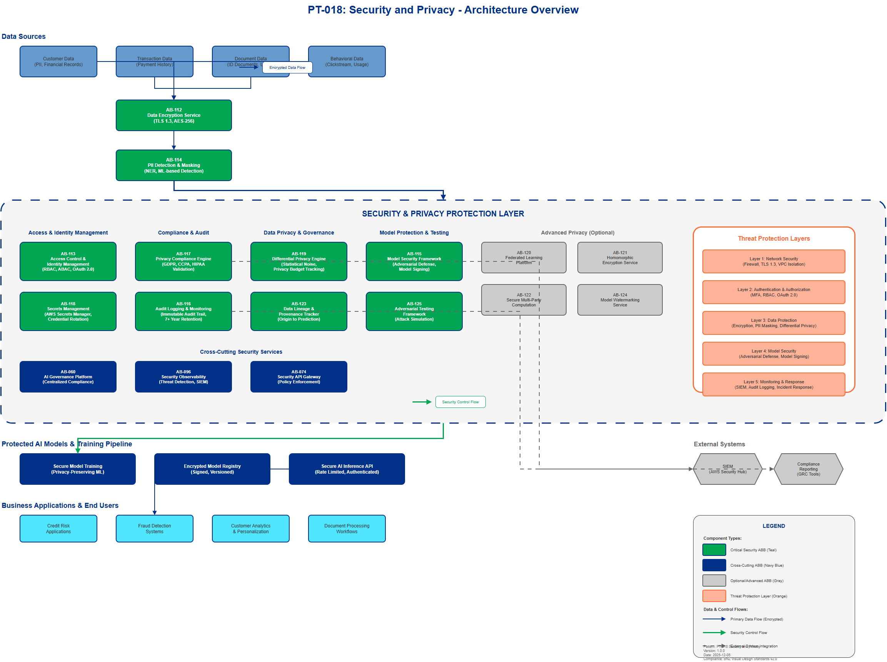

# AI Architecture Pattern: Security and Privacy Pattern

## Document Control

| Property | Value |
|----------|-------|
| **Pattern ID** | `PT-018` |
| **Pattern Name** | Security and Privacy Pattern |
| **Version** | `1.0.0` |
| **Status** | `Approved` |
| **Created Date** | `2025-12-05` |
| **Last Modified** | `2025-12-05` |
| **Owner** | BNZ Enterprise Architecture |
| **Pattern Category** | `Cross-Cutting` |
| **Maturity Level** | `Mature` |

---

## 1. Pattern Overview

### 1.1 Pattern Name and Classification

**Pattern Name**: Security and Privacy Pattern (MANDATORY)

**Short Name**: Security & Privacy

**Pattern Category**: Cross-Cutting

**Pattern Type**: Security & Compliance

### 1.2 Intent and Context

**Intent Statement**:
Protect AI systems, data, and models from security threats while ensuring privacy compliance across all AI deployments in the enterprise. This pattern provides comprehensive security controls, threat mitigation strategies, and privacy-preserving techniques for AI systems.

**Problem Statement**:
AI systems in financial services face unique security and privacy challenges:
- **Data exposure risks**: Training data may contain sensitive customer information (PII, financial data, health records)
- **Model vulnerabilities**: AI models are susceptible to adversarial attacks, model inversion, and intellectual property theft
- **Privacy compliance**: Must adhere to strict regulations (GDPR, CCPA, HIPAA) while maintaining model utility
- **Access control complexity**: Need granular permissions for data scientists, business users, and automated systems
- **Audit requirements**: Regulatory mandate for comprehensive logging and traceability of all AI decisions
- **Threat landscape**: Evolving attack vectors including data poisoning, model extraction, and prompt injection

Without comprehensive security and privacy controls, organizations face regulatory penalties, data breaches, model compromise, reputational damage, and loss of customer trust.

**Context**:
This pattern is MANDATORY for ALL 24 BNZ AI use cases - security and privacy are non-negotiable in financial services (2025 standard). It is particularly critical for high-risk use cases: [UC-008](../../../01-motivation/03-use-cases/use-cases/UC-008/index.md) (Security AI), [UC-011](../../../01-motivation/03-use-cases/use-cases/UC-011/index.md) (Fincrime), [UC-013](../../../01-motivation/03-use-cases/use-cases/UC-013/index.md) (Fraud), [UC-014](../../../01-motivation/03-use-cases/use-cases/UC-014/index.md) (Onboarding), [UC-004](../../../01-motivation/03-use-cases/use-cases/UC-004/index.md) (Credit Risk), and [UC-021](../../../01-motivation/03-use-cases/use-cases/UC-021/index.md) (Wholesale Underwriting). The pattern applies across the entire AI lifecycle: data collection, model training, deployment, inference, and monitoring.

**Forces**:
- **Security vs. usability**: Strong security controls must not impede legitimate AI development and deployment
- **Privacy vs. model accuracy**: Privacy-preserving techniques (differential privacy, data masking) may reduce model performance
- **Compliance vs. innovation velocity**: Regulatory compliance requirements must be balanced with rapid AI experimentation
- **Cost vs. comprehensive protection**: Advanced security tools and techniques increase infrastructure costs
- **Transparency vs. security**: Need to explain AI decisions while protecting model intellectual property
- **Performance vs. encryption overhead**: Data encryption adds latency to training and inference pipelines

### 1.3 Pattern Maturity and Industry Adoption

**Maturity Level**: Mature

**Industry Adoption**:
- **Adoption Rate**: 100% of regulated financial services institutions have implemented security and privacy controls for AI systems (2025)
- **Reference Implementations**:
  - JPMorgan Chase - AI Security Framework with adversarial testing (2024)
  - Goldman Sachs - Privacy-Preserving ML Platform (2023)
  - Bank of America - Comprehensive AI Security Architecture (2024)
  - Wells Fargo - Privacy-First AI Development (2024)
- **Timeframe**: Mature since 2020, continuously evolving with new threat vectors and compliance requirements

**Standards Alignment**:
- **GDPR (EU)**: General Data Protection Regulation - data protection and privacy
- **CCPA (California)**: California Consumer Privacy Act - consumer privacy rights
- **HIPAA (US)**: Health Insurance Portability and Accountability Act - healthcare data protection
- **NIST AI Risk Management Framework**: Comprehensive AI security guidance
- **ISO/IEC 27001**: Information security management systems
- **ISO/IEC 27701**: Privacy information management systems
- **OWASP Top 10 for LLMs**: Security risks specific to large language models
- **NIST Privacy Framework**: Privacy risk management framework
- **PCI DSS**: Payment card industry data security standards
- **SOC 2 Type II**: Security, availability, and confidentiality controls

---

## 2. Architecture Specification

### 2.1 Architecture Building Blocks (ABBs)

**Primary ABBs** (Core components required):

| ABB ID | ABB Name | Purpose in Pattern | Criticality |
|--------|----------|-------------------|-------------|
| [AB-112](../../architecture-building-blocks/abbs/AB-112/AB-112-Data-Encryption-Service-v1.0.0.md) | Data Encryption Service | Encrypt data at rest and in transit (TLS 1.3, AES-256) | Critical |
| [AB-113](../../architecture-building-blocks/abbs/AB-113/AB-113-Access-Control-and-Identity-Management-v1.0.0.md) | Access Control & Identity Management | Role-based access control (RBAC) for models, data, and infrastructure | Critical |
| [AB-114](../../architecture-building-blocks/abbs/AB-114/AB-114-PII-Detection-and-Masking-Service-v1.0.0.md) | PII Detection & Masking Service | Automatically identify and redact personally identifiable information | Critical |
| [AB-115](../../architecture-building-blocks/abbs/AB-115/AB-115-Model-Security-Framework-v1.0.0.md) | Model Security Framework | Protect models from adversarial attacks, model inversion, and theft | Critical |
| [AB-116](../../architecture-building-blocks/abbs/AB-116/AB-116-Audit-Logging-and-Monitoring-v1.0.0.md) | Audit Logging & Monitoring | Comprehensive logging of all access to models, data, and predictions | Critical |
| [AB-117](../../architecture-building-blocks/abbs/AB-117/AB-117-Privacy-Compliance-Engine-v1.0.0.md) | Privacy Compliance Engine | GDPR, CCPA, HIPAA compliance validation and reporting | Critical |
| [AB-118](../../architecture-building-blocks/abbs/AB-118/AB-118-Secrets-Management-v1.0.0.md) | Secrets Management | Secure storage and rotation of API keys, credentials, and certificates | Critical |

**Supporting ABBs** (Optional or scenario-specific):

| ABB ID | ABB Name | Purpose in Pattern | When Required |
|--------|----------|-------------------|---------------|
| [AB-119](../../architecture-building-blocks/abbs/AB-119/AB-119-Differential-Privacy-Engine-v1.0.0.md) | Differential Privacy Engine | Add statistical noise to protect individual data points | MANDATORY for customer financial data, health records |
| [AB-120](../../architecture-building-blocks/abbs/AB-120/AB-120-Federated-Learning-Platform-v1.0.0.md) | Federated Learning Platform | Train models without centralizing sensitive data | For multi-party ML or highly sensitive data |
| [AB-121](../../architecture-building-blocks/abbs/AB-121/AB-121-Homomorphic-Encryption-Service-v1.0.0.md) | Homomorphic Encryption Service | Perform computation on encrypted data | For ultra-sensitive credit risk or fraud models |
| [AB-122](../../architecture-building-blocks/abbs/AB-122/AB-122-Secure-Multi-Party-Computation-v1.0.0.md) | Secure Multi-Party Computation | Enable collaborative ML without revealing raw data | For cross-bank fraud detection, consortium models |
| [AB-123](../../architecture-building-blocks/abbs/AB-123/AB-123-Data-Lineage-and-Provenance-Tracker-v1.0.0.md) | Data Lineage & Provenance Tracker | Track data origin and transformations for compliance | MANDATORY for Tier 1/2 models |
| [AB-124](../../architecture-building-blocks/abbs/AB-124/AB-124-Model-Watermarking-Service-v1.0.0.md) | Model Watermarking Service | Embed traceable signatures in model outputs | For proprietary model IP protection |
| [AB-125](../../architecture-building-blocks/abbs/AB-125/AB-125-Adversarial-Testing-Framework-v1.0.0.md) | Adversarial Testing Framework | Automated adversarial attack simulation and testing | MANDATORY for production models |

**Cross-Cutting ABBs** (Always required):

| ABB ID | ABB Name | Purpose |
|--------|----------|---------|
| [AB-060](../../architecture-building-blocks/abbs/AB-060/AB-060-AI-Model-Registry-v1.0.0.md) | AI Governance Platform | Centralized governance and compliance management |
| [AB-096](../../architecture-building-blocks/abbs/AB-096/AB-096-Observability-Platform-v1.0.0.md) | Security Observability | Real-time monitoring for security threats and anomalies |
| [AB-074](../../architecture-building-blocks/abbs/AB-074/AB-074-Event-Broker-v1.0.0.md) | Security API Gateway | Centralized API management with security policy enforcement |

### 2.2 Pattern Structure

**Architectural Diagram**:



**Component Interaction Flow**:
```
[Data Sources: Customer Data, Transaction Data, Documents]
    ↓
[Data Encryption Service] (AB-112)
    ↓
[PII Detection & Masking] (AB-114)
    ↓
┌─────────────────────────────────────────────────────────┐
│         SECURITY & PRIVACY PROTECTION LAYER             │
│                                                         │
│  [Access Control]         [Secrets Management]         │
│  (AB-113)            (AB-118)                │
│         ↓                         ↓                     │
│  [Privacy Compliance]     [Audit Logging]              │
│  (AB-117)            (AB-116)                │
│         ↓                         ↓                     │
│  [Differential Privacy]   [Model Security]             │
│  (AB-119)            (AB-115)                │
│         ↓                         ↓                     │
│  [Data Lineage]           [Adversarial Testing]        │
│  (AB-123)            (AB-125)                │
└─────────────────────────────────────────────────────────┘
    ↓
[Protected AI Models & Training Pipeline]
    ↓
[Secure AI Inference API]
    ↓
[Business Applications & End Users]
```

**Key Interactions**:

1. **Data Ingestion with Encryption**: All incoming data encrypted before processing
   - Protocol: HTTPS/TLS 1.3 for data in transit
   - Encryption: AES-256-GCM for data at rest
   - Key Management: AWS Secrets Manager or AWS KMS with automatic rotation
   - Latency Target: <50ms encryption overhead

2. **PII Detection and Masking**: Automatic identification and redaction of sensitive data
   - Processing Type: Real-time streaming or batch processing
   - Detection Methods: Named entity recognition (NER), regex patterns, ML-based classification
   - Masking Techniques: Tokenization, pseudonymization, redaction, synthetic data
   - Accuracy Target: >99% PII detection rate, <0.1% false positive rate

3. **Access Control Enforcement**: RBAC verification on every data/model access
   - Protocol: OAuth 2.0 / OIDC for authentication
   - Authorization: Attribute-based access control (ABAC) + RBAC
   - Granularity: Dataset-level, model-level, feature-level, prediction-level
   - Latency Target: <10ms access control check overhead

4. **Model Security Protection**: Defense against adversarial attacks
   - Processing Type: Pre-deployment testing + runtime monitoring
   - Attack Detection: Adversarial example detection, model inversion detection
   - Mitigation: Input validation, adversarial training, ensemble defenses
   - Testing Frequency: Every model version + continuous runtime monitoring

5. **Privacy Compliance Validation**: Automated GDPR/CCPA/HIPAA compliance checks
   - Processing Type: Asynchronous policy validation
   - Validation Scope: Data collection consent, purpose limitation, data minimization
   - Output: Compliance score (0-100%), violation alerts, remediation recommendations
   - SLA: <5 minutes for compliance validation

6. **Audit Logging**: Comprehensive logging of all security-relevant events
   - Protocol: Asynchronous event streaming to immutable audit log
   - Event Types: Data access, model access, predictions, policy violations, config changes
   - Storage: Append-only database (QLDB) or blockchain
   - Retention: 7+ years for financial services compliance

#### 2.2.1 Security Threat Taxonomy and Mitigations

**AI-Specific Security Threats**:

| Threat Category | Threat Name | Description | Impact | Mitigation Strategy |
|----------------|-------------|-------------|--------|---------------------|
| **Training Phase** | Data Poisoning | Attacker injects malicious data into training set to degrade model or create backdoors | Model corruption, biased decisions, backdoor triggers | Data validation, anomaly detection, provenance tracking, trusted data sources |
| **Training Phase** | Model Supply Chain Attack | Compromised dependencies (libraries, pre-trained models) inject vulnerabilities | Model backdoors, data exfiltration | Dependency scanning, model provenance verification, secure model registry |
| **Inference Phase** | Adversarial Examples | Crafted inputs designed to fool model into incorrect predictions | Fraud bypass, wrong credit decisions, security breaches | Adversarial training, input validation, ensemble defenses, anomaly detection |
| **Inference Phase** | Model Inversion | Attacker reconstructs training data from model predictions | PII exposure, training data leakage | Differential privacy, access control, prediction obfuscation, rate limiting |
| **Inference Phase** | Model Extraction | Attacker steals model by querying API and replicating behavior | IP theft, competitive loss, bypass security | Rate limiting, prediction watermarking, query monitoring, API authentication |
| **Inference Phase** | Prompt Injection (LLMs) | Malicious prompts override system instructions or extract sensitive data | Data leakage, unauthorized actions, policy bypass | Input sanitization, prompt guardrails, output filtering, context isolation |
| **Deployment Phase** | Model Tampering | Unauthorized modification of deployed model artifacts | Compromised predictions, backdoor insertion | Model signing, integrity verification, immutable model registry, deployment approval |
| **Cross-Cutting** | Membership Inference | Determine if specific data point was in training set | Privacy violation, compliance breach | Differential privacy, access control, prediction confidence limits |

**Traditional Security Threats**:

| Threat Category | Threat Name | Mitigation Strategy |
|----------------|-------------|---------------------|
| **Authentication** | Credential theft, session hijacking | Multi-factor authentication (MFA), OAuth 2.0, short-lived tokens, SSO |
| **Authorization** | Privilege escalation, unauthorized access | RBAC with least privilege, ABAC for fine-grained control, regular access reviews |
| **Data** | Data breaches, unauthorized data access | Encryption at rest/transit, data access logging, DLP tools, network segmentation |
| **Network** | Man-in-the-middle, network sniffing | TLS 1.3, mutual TLS (mTLS), VPC/VNet isolation, VPN/private endpoints |
| **Application** | SQL injection, XSS, CSRF | Input validation, parameterized queries, WAF, secure coding practices |
| **Infrastructure** | Container escape, Kubernetes compromise | Pod security policies, network policies, runtime security monitoring, image scanning |

### 2.3 Data Flow

**Data Sources**:
- **Raw Customer Data**: Names, addresses, SSN/NHI, phone numbers, email addresses, financial account numbers
- **Transaction Data**: Payment history, credit card transactions, account balances, investment portfolios
- **Document Data**: Loan applications, ID documents (passports, driver's licenses), tax records, employment verification
- **Behavioral Data**: Website clicks, mobile app usage, call center interactions, chat transcripts
- **Third-Party Data**: Credit bureau data, open banking APIs, fraud databases, KYC/AML watchlists

**Data Transformations**:

1. **Encryption Transformation**: Plaintext data → Encrypted data
   - Input: Raw sensitive data (customer records, transactions)
   - Processing: AES-256-GCM encryption with customer-managed keys (CMK)
   - Output: Encrypted data with metadata (encryption algorithm, key ID, timestamp)
   - Key Rotation: Automatic rotation every 90 days

2. **PII Detection Transformation**: Raw text → De-identified text
   - Input: Unstructured text (documents, emails, chat logs)
   - Processing: NER-based entity recognition + regex pattern matching + ML classifier
   - Output: Masked text with PII tokens replaced (e.g., "[NAME]", "[SSN]", "[ACCOUNT]")
   - Reversibility: Tokenization allows re-identification for authorized users

3. **Differential Privacy Transformation**: Individual data → Privacy-preserving aggregates
   - Input: Individual customer records (age, income, transaction amounts)
   - Processing: Add calibrated Laplacian or Gaussian noise to meet epsilon-differential privacy
   - Output: Aggregated statistics with privacy guarantees (e.g., epsilon=1.0)
   - Trade-off: Accuracy vs. privacy (lower epsilon = stronger privacy, lower accuracy)

4. **Access Control Transformation**: User request → Authorized data access
   - Input: User identity (JWT token), requested resource (dataset, model, API)
   - Processing: Evaluate RBAC policies + ABAC attributes (data sensitivity, user clearance)
   - Output: Grant/Deny decision with justification, logged to audit trail
   - Cache: Decision caching for 5 minutes to reduce latency

**Data Sinks**:
- **Encrypted Data Lake**: Snowflake (Data Lake) Storage Gen2 or AWS S3 with server-side encryption (SSE-KMS), 7-year retention
- **Audit Log Database**: Immutable append-only database (AWS QLDB or AWS QLDB), 7+ year retention
- **Model Registry**: Encrypted model artifact storage with version control, 5-year retention
- **Compliance Reporting**: GDPR/CCPA data subject access reports, HIPAA breach notification logs
- **Security Analytics**: SIEM (Splunk, AWS Security Hub) for threat detection and incident response

**Data Governance**:
- **Classification**:
  - **Public**: Aggregated anonymized data for external sharing
  - **Internal**: General business data, non-sensitive ML models
  - **Confidential**: Customer PII, transaction data, proprietary models
  - **Restricted**: Credit card numbers, SSN/NHI, health records, encryption keys
- **Retention**:
  - Customer PII: 7 years post-account closure (financial services requirement)
  - Audit logs: 7+ years (regulatory examination period)
  - Model training data: Minimum required for model reproducibility + compliance
  - Encryption keys: Retain historical keys for decryption of archived data
- **Lineage**:
  - Full lineage tracking: Raw data → Cleaned data → Features → Model → Predictions
  - Purpose binding: Track data usage purpose for GDPR Article 6 compliance
  - Consent tracking: Link predictions to original customer consent records
- **Quality**:
  - PII detection accuracy: >99% recall for sensitive entities
  - Encryption verification: 100% of sensitive data encrypted before storage
  - Access control validation: Regular penetration testing and access reviews

### 2.4 Interface Specifications

**Inbound Interfaces** (Inputs to pattern):

| Interface ID | Interface Name | Type | Protocol | Data Format | SLA |
|--------------|---------------|------|----------|-------------|-----|
| IF-IN-001 | Data Encryption API | REST API | HTTPS | JSON (data + encryption params) | < 50ms p99 |
| IF-IN-002 | PII Detection API | REST API | HTTPS | JSON/Text (unstructured data) | < 200ms p95 |
| IF-IN-003 | Access Control Check API | REST API | HTTPS | JSON (user identity + resource) | < 10ms p99 |
| IF-IN-004 | Adversarial Test Submission | REST API | HTTPS | JSON (model ID + test suite) | < 5s response |
| IF-IN-005 | Privacy Compliance Validation | REST API | HTTPS | JSON (data processing activity) | < 5min |
| IF-IN-006 | Audit Log Ingestion | Event Stream | Kafka/Amazon Kinesis | JSON (audit events) | < 1s latency |

**Outbound Interfaces** (Outputs from pattern):

| Interface ID | Interface Name | Type | Protocol | Data Format | SLA |
|--------------|---------------|------|----------|-------------|-----|
| IF-OUT-001 | Encrypted Data Output | REST API / S3 | HTTPS | Binary (encrypted data) | < 100ms |
| IF-OUT-002 | Security Alert Notifications | Event Stream | Email/Slack/PagerDuty | JSON (alert events) | < 5min delivery |
| IF-OUT-003 | Compliance Reports | Batch Export | SFTP/S3 | PDF/CSV (GDPR/CCPA reports) | Daily/Weekly |
| IF-OUT-004 | Access Decision Response | REST API | HTTPS | JSON (grant/deny + reason) | < 10ms |
| IF-OUT-005 | Adversarial Test Results | REST API | HTTPS | JSON (vulnerability report) | Async (hours) |
| IF-OUT-006 | Audit Log Export | Batch Export | Amazon S3 | JSON Lines (audit events) | On-demand |

**Internal Interfaces** (Between ABBs within pattern):

| Interface ID | Source ABB | Target ABB | Protocol | Purpose |
|--------------|-----------|-----------|----------|---------|
| IF-INT-001 | [AB-114](../../architecture-building-blocks/abbs/AB-114/AB-114-PII-Detection-and-Masking-Service-v1.0.0.md) (PII Detection) | [AB-112](../../architecture-building-blocks/abbs/AB-112/AB-112-Data-Encryption-Service-v1.0.0.md) (Encryption) | Internal API | Encrypt detected PII with higher key strength |
| IF-INT-002 | [AB-113](../../architecture-building-blocks/abbs/AB-113/AB-113-Access-Control-and-Identity-Management-v1.0.0.md) (Access Control) | [AB-116](../../architecture-building-blocks/abbs/AB-116/AB-116-Audit-Logging-and-Monitoring-v1.0.0.md) (Audit Logging) | Event Stream | Log all access decisions for compliance |
| IF-INT-003 | [AB-115](../../architecture-building-blocks/abbs/AB-115/AB-115-Model-Security-Framework-v1.0.0.md) (Model Security) | [AB-116](../../architecture-building-blocks/abbs/AB-116/AB-116-Audit-Logging-and-Monitoring-v1.0.0.md) (Audit Logging) | Event Stream | Log adversarial attack attempts and mitigations |
| IF-INT-004 | [AB-117](../../architecture-building-blocks/abbs/AB-117/AB-117-Privacy-Compliance-Engine-v1.0.0.md) (Privacy Compliance) | [AB-114](../../architecture-building-blocks/abbs/AB-114/AB-114-PII-Detection-and-Masking-Service-v1.0.0.md) (PII Detection) | Internal API | Validate PII handling for GDPR compliance |
| IF-INT-005 | [AB-119](../../architecture-building-blocks/abbs/AB-119/AB-119-Differential-Privacy-Engine-v1.0.0.md) (Differential Privacy) | [AB-123](../../architecture-building-blocks/abbs/AB-123/AB-123-Data-Lineage-and-Provenance-Tracker-v1.0.0.md) (Data Lineage) | Internal API | Track privacy budget consumption |
| IF-INT-006 | [AB-125](../../architecture-building-blocks/abbs/AB-125/AB-125-Adversarial-Testing-Framework-v1.0.0.md) (Adversarial Testing) | [AB-115](../../architecture-building-blocks/abbs/AB-115/AB-115-Model-Security-Framework-v1.0.0.md) (Model Security) | Internal API | Update model defenses based on test results |

---

## 3. Pattern Variants and Options

### 3.1 Pattern Variations

**Variant 1: Zero-Trust Security Model**
- **When to Use**: High-security environments, highly regulated use cases (credit, fraud, AML)
- **Key Differences**:
  - Assume breach: No implicit trust for any user or system
  - Continuous verification: Re-authenticate and re-authorize on every request
  - Micro-segmentation: Network isolation between every component
  - Least privilege: Minimum permissions required for each task
- **Trade-offs**:
  - Gain: Maximum security, reduced blast radius of breaches, compliance-ready
  - Lose: Increased latency (continuous auth/authz checks), higher complexity, potential usability friction

**Variant 2: Privacy-First Architecture (Differential Privacy)**
- **When to Use**: Customer analytics, personalization, any aggregate reporting on customer data
- **Key Differences**:
  - Differential privacy applied to all customer data queries
  - Privacy budget tracking and enforcement (epsilon allocation)
  - Federated learning for model training (no centralized raw data)
  - Synthetic data generation for testing and development
- **Trade-offs**:
  - Gain: Strong mathematical privacy guarantees, GDPR compliance, customer trust
  - Lose: Reduced model accuracy (5-10% typical), increased training time, complex privacy budget management

**Variant 3: Multi-Party Computation (MPC) for Consortium Models**
- **When to Use**: Cross-bank fraud detection, industry-wide risk models, shared KYC/AML
- **Key Differences**:
  - Secure multi-party computation for collaborative training
  - No raw data sharing between organizations
  - Encrypted model parameter aggregation
  - Differential privacy + MPC for double protection
- **Trade-offs**:
  - Gain: Collaborative insights without data sharing, regulatory compliance, competitive advantage
  - Lose: High computational overhead (10-100x slower), complex coordination, limited algorithm support

**Variant 4: Homomorphic Encryption for Ultra-Sensitive Data**
- **When to Use**: Credit decisioning on encrypted data, healthcare ML, confidential computing
- **Key Differences**:
  - Train and inference on encrypted data (no decryption required)
  - Partial or fully homomorphic encryption (PHE/FHE)
  - Confidential computing enclaves (Intel SGX, AMD SEV)
- **Trade-offs**:
  - Gain: Ultimate data protection, zero plaintext exposure, regulatory compliance
  - Lose: Severe performance penalty (100-1000x slower), limited algorithm support, high complexity

### 3.2 Composition with Other Patterns

**Commonly Combined With**:

| Pattern | Integration Point | Combined Benefit |
|---------|------------------|------------------|
| PT-001: Enterprise AI Governance | Security events feed governance audit trail; compliance validation integrated | Unified security + governance, comprehensive audit trail, automated compliance reporting |
| PT-005: Retrieval-Augmented Generation (RAG) | PII masking on retrieved documents; access control for document retrieval; adversarial prompt detection | Secure RAG without exposing sensitive documents; prevent prompt injection attacks |
| PT-009: Real-Time Scoring | Encryption overhead minimized (<10ms); adversarial input detection in real-time | Secure real-time inference with minimal latency impact |
| PT-011: Intelligent Document Processing | PII detection and redaction before OCR; encrypted document storage | Automated sensitive data protection in document workflows |
| PT-004: Explainability | Explanations must not leak training data; model inversion detection | Transparent AI without privacy compromise |

**Anti-Patterns** (What NOT to do):

- **Anti-Pattern 1: Security as Afterthought**
  - **Description**: Add security controls after AI models are already deployed to production
  - **Why Problematic**: Retrofitting security is expensive, incomplete, and disruptive; models may already be compromised
  - **Better Approach**: Shift-left security - integrate security into development pipeline; automated security testing in CI/CD; security requirements in model approval workflow

- **Anti-Pattern 2: Over-Reliance on Perimeter Security**
  - **Description**: Strong network firewall but weak internal controls (assume internal network is trusted)
  - **Why Problematic**: Insider threats, lateral movement after breach, insufficient protection for cloud-native architectures
  - **Better Approach**: Zero-trust architecture with micro-segmentation; encrypt data at rest and in transit; least privilege access control for every component

- **Anti-Pattern 3: Ignoring Model-Specific Threats**
  - **Description**: Apply traditional application security but ignore AI-specific attacks (adversarial examples, model inversion)
  - **Why Problematic**: Models remain vulnerable to AI-specific attacks; compliance gaps for AI regulations
  - **Better Approach**: Implement adversarial testing, model robustness verification, differential privacy where appropriate; AI-specific security training for teams

- **Anti-Pattern 4: Manual PII Detection**
  - **Description**: Rely on manual review or simple regex to detect sensitive data
  - **Why Problematic**: Scales poorly, high false negative rate, human error, inconsistent application
  - **Better Approach**: Automated PII detection using ML-based NER; continuous scanning of data lakes; integrated with data pipelines; validation and reporting

---

## 4. Implementation Guidance

### 4.1 Solution Building Blocks (SBBs)

**Recommended SBB Options** (Technology implementations):

| ABB | SBB Option 1 (Cloud-Native) | SBB Option 2 (Open Source) | SBB Option 3 (Commercial) |
|-----|----------------------------|---------------------------|--------------------------|
| **[AB-112](../../architecture-building-blocks/abbs/AB-112/AB-112-Data-Encryption-Service-v1.0.0.md): Encryption** | AWS S3 Encryption (AES-256) + AWS Secrets Manager | OpenSSL + HashiCorp Vault | Vormetric Data Security Platform |
| **[AB-113](../../architecture-building-blocks/abbs/AB-113/AB-113-Access-Control-and-Identity-Management-v1.0.0.md): Access Control** | AWS IAM + AWS IAM | Keycloak + Open Policy Agent (OPA) | Okta + ForgeRock Identity |
| **[AB-114](../../architecture-building-blocks/abbs/AB-114/AB-114-PII-Detection-and-Masking-Service-v1.0.0.md): PII Detection** | AWS Macie | Presidio (open source) | AWS Macie |
| **[AB-115](../../architecture-building-blocks/abbs/AB-115/AB-115-Model-Security-Framework-v1.0.0.md): Model Security** | AWS SageMaker threat detection | Adversarial Robustness Toolbox (ART) | Robust Intelligence AI Firewall |
| **[AB-116](../../architecture-building-blocks/abbs/AB-116/AB-116-Audit-Logging-and-Monitoring-v1.0.0.md): Audit Logging** | Amazon CloudWatch + AWS Security Hub | ELK Stack (Elasticsearch) | Splunk Enterprise Security |
| **[AB-117](../../architecture-building-blocks/abbs/AB-117/AB-117-Privacy-Compliance-Engine-v1.0.0.md): Privacy Compliance** | Microsoft Compliance Manager | Custom GDPR/CCPA validator | OneTrust Privacy Management |
| **[AB-118](../../architecture-building-blocks/abbs/AB-118/AB-118-Secrets-Management-v1.0.0.md): Secrets Management** | AWS Secrets Manager | HashiCorp Vault | AWS Secrets Manager |
| **[AB-119](../../architecture-building-blocks/abbs/AB-119/AB-119-Differential-Privacy-Engine-v1.0.0.md): Differential Privacy** | AWS SageMaker differential privacy | Google Differential Privacy library | Privitar Data Privacy Platform |

**SBB Selection Criteria**:
- **Cloud-Native**: Recommended for AWS-first organizations; managed services reduce operational overhead
- **Open Source**: Best for cost optimization, customization, avoid vendor lock-in; requires more operational expertise
- **Commercial**: Advanced features, enterprise support, faster time-to-value; higher licensing costs

**BNZ Recommendation** (AWS Cloud Environment):
- **Encryption**: AWS S3 Encryption + AWS Secrets Manager (cloud-native, integrated, FIPS 140-2 compliant)
- **Access Control**: AWS IAM + AWS IAM (enterprise identity integration, SSO, MFA built-in)
- **PII Detection**: AWS Macie (integrated with AWS ecosystem, ML-based detection, data catalog)
- **Model Security**: Adversarial Robustness Toolbox (ART) + AWS SageMaker (open source flexibility, AWS integration)
- **Audit Logging**: Amazon CloudWatch + AWS Security Hub (unified SIEM, AI-powered threat detection)
- **Privacy Compliance**: Microsoft Compliance Manager (automated compliance assessments, regulatory templates)
- **Secrets Management**: AWS Secrets Manager (managed HSM, automatic rotation, AWS integration)
- **Differential Privacy**: Google DP library + custom implementation (proven library, research-backed)

### 4.2 Implementation Roadmap

**Phase 1: Foundation (Months 1-3)**
- Deploy AWS Secrets Manager for secrets management
- Implement AWS IAM SSO and MFA for all AI platform users
- Enable AWS S3 encryption (at rest) for all data lakes
- Deploy TLS 1.3 for all API endpoints (data in transit)
- Implement basic RBAC for data and model access
- Deploy Amazon CloudWatch for audit logging

**Phase 2: PII Protection (Months 4-6)**
- Deploy AWS Macie for automated PII detection
- Implement PII masking in data ingestion pipelines
- Configure data classification policies (Public/Internal/Confidential/Restricted)
- Deploy tokenization for reversible PII masking
- Integrate PII detection with data lineage tracking
- Automated PII scanning on all new datasets

**Phase 3: Model Security (Months 7-9)**
- Deploy Adversarial Robustness Toolbox (ART)
- Implement adversarial testing in ML CI/CD pipeline
- Configure input validation and sanitization for all inference APIs
- Deploy rate limiting and API authentication (prevent model extraction)
- Implement model signing and integrity verification
- Automated security testing for every model version

**Phase 4: Privacy Compliance (Months 10-12)**
- Deploy Microsoft Compliance Manager
- Implement GDPR data subject access request (DSAR) automation
- Deploy differential privacy for customer analytics use cases
- Configure privacy budget tracking and enforcement
- Implement consent management and purpose binding
- Automated GDPR/CCPA compliance validation in governance workflow

**Phase 5: Advanced Protection (Months 13-18)**
- Deploy AWS Security Hub SIEM for advanced threat detection
- Implement anomaly detection for adversarial attack detection
- Deploy federated learning for highly sensitive use cases
- Implement homomorphic encryption POC for credit risk models
- Deploy continuous security monitoring and automated response
- Red team exercises and penetration testing

### 4.3 Operational Considerations

**Staffing Requirements**:
- **Security Architect** (1 FTE): Design security architecture, threat modeling, security reviews
- **Privacy Officer** (1 FTE): GDPR/CCPA/HIPAA compliance, data protection impact assessments (DPIA)
- **Security Engineers** (2-3 FTE): Implement and operate security controls, incident response
- **Security Operations (SOC)** (2 FTE): Monitor security alerts, threat hunting, SIEM management
- **Compliance Analysts** (1-2 FTE): Compliance reporting, audit support, policy enforcement

**Operational Metrics**:
- **Encryption Coverage**: % of sensitive data encrypted (target: 100%)
- **PII Detection Accuracy**: Recall for PII detection (target: >99%)
- **Access Control Violations**: # of unauthorized access attempts detected (target: detect 100%)
- **Adversarial Attack Detection Rate**: % of attacks detected in testing (target: >95%)
- **Privacy Compliance Score**: Automated compliance score (target: >95%)
- **Security Incident MTTD**: Mean time to detect security incidents (target: <15 minutes)
- **Security Incident MTTR**: Mean time to respond and remediate (target: <4 hours)
- **Audit Log Completeness**: % of security events logged (target: 100%)

**Cost Model** (Annual, Enterprise Deployment for 24 Use Cases):
- **Platform Infrastructure**: $200K-$350K (Key Vault, Purview, Sentinel, compute for encryption/PII detection)
- **Software Licensing**: $150K-$300K (AWS Macie, Compliance Manager, if not included in E5 licenses)
- **Security Tools**: $100K-$200K (Adversarial testing tools, commercial AI security platforms)
- **Staffing**: $900K-$1.3M (9-11 FTE blended rate for security/privacy/compliance roles)
- **Training & Certification**: $50K-$100K (security certifications, AI security training)
- **Total Annual Cost**: $1.4M-$2.25M
- **Cost per Use Case**: $58K-$94K (amortized across 24 use cases)

**Cost Optimization Strategies**:
- Use AWS Enterprise Support for bundled security tools (Purview, Compliance Manager, Sentinel)
- Prioritize open-source tools where appropriate (ART, Presidio, OPA)
- Leverage existing SOC and security teams (shared services)
- Automate compliance reporting to reduce manual effort
- Right-size security controls based on risk tier (Tier 1/2/3 from governance pattern)

### 4.4 Integration Points

**Upstream Integrations** (Systems feeding into security/privacy):
- **Data Platforms** (Snowflake, Snowflake (Data Lake)): Data encryption, PII detection on ingestion
- **ML Platforms** (Databricks, AWS SageMaker): Model security testing, adversarial training integration
- **Identity Providers** (AWS IAM, Okta): Authentication and authorization for access control
- **Data Catalogs** (Purview, Collibra): Data classification and lineage for compliance
- **Threat Intelligence** (MISP, ThreatConnect): External threat feeds for AI-specific attack patterns

**Downstream Integrations** (Systems consuming security/privacy outputs):
- **AI Governance Platform** (PT-001): Security events feed governance audit trail
- **Compliance Reporting** (GRC tools): Automated GDPR/CCPA/HIPAA compliance reports
- **SIEM** (AWS Security Hub, Splunk): Security alerts, threat detection, incident response
- **Incident Management** (ServiceNow, PagerDuty): Security incident workflows and notifications
- **Business Intelligence** (Power BI): Security metrics dashboards for executives

**Bi-Directional Integrations**:
- **CI/CD Pipelines** (AWS CodePipeline, GitHub Actions): Security gates in deployment workflow, automated security testing
- **API Gateway** (Amazon API Gateway): Enforce security policies, rate limiting, API key management
- **Monitoring Platforms** (Datadog, New Relic): Security observability, anomaly detection

### 4.5 Non-Functional Requirements

**Performance**:
- **Encryption Overhead**: < 50ms p99 for data encryption (at rest/transit)
- **PII Detection Latency**: < 200ms p95 for real-time PII detection
- **Access Control Check**: < 10ms p99 for RBAC/ABAC decision
- **Adversarial Detection**: < 50ms p99 for real-time adversarial input detection (inference)
- **Audit Log Latency**: < 1 second for event ingestion to audit trail

**Scalability**:
- **Encryption Throughput**: 10GB/second per encryption service instance
- **PII Detection Throughput**: 100K documents/hour per detection service instance
- **Access Control Decisions**: 100K decisions/second (cached), 10K/second (uncached)
- **Audit Log Volume**: 1M+ events/second during peak usage
- **Adversarial Testing**: 1000+ model tests/day (automated testing pipeline)

**Availability**:
- **Encryption Service SLA**: 99.99% uptime (critical path for data access)
- **Access Control SLA**: 99.99% uptime (critical path for all AI operations)
- **PII Detection SLA**: 99.9% uptime (can fallback to basic masking)
- **Audit Logging SLA**: 99.99% uptime (compliance critical, no data loss)

**Security**:
- **Encryption Standards**: AES-256-GCM (at rest), TLS 1.3 (in transit), FIPS 140-2 compliant
- **Key Management**: Customer-managed keys (CMK), automatic rotation every 90 days
- **Authentication**: Multi-factor authentication (MFA) mandatory for privileged access
- **Authorization**: Role-based access control (RBAC) with least privilege, regular access reviews
- **Network Security**: Private endpoints, no public internet exposure for sensitive components
- **Secrets Rotation**: Automatic rotation every 90 days, zero-downtime rotation

**Compliance**:
- **Data Residency**: All data stored in New Zealand or approved jurisdictions (Australia)
- **GDPR Compliance**: Data subject access requests (DSAR) responded within 30 days, right to erasure supported
- **HIPAA Compliance**: Business associate agreements (BAA), encryption, audit logging, access controls
- **PCI DSS**: No storage of full credit card numbers (PAN), tokenization required
- **SOC 2 Type II**: Annual audit for security, availability, confidentiality controls

---

## 5. Technology Stack

### 5.1 Reference Architecture Components

**Core Security Components**:

| Component | Technology | Purpose | Deployment |
|-----------|-----------|---------|------------|
| **Encryption at Rest** | AWS S3 Encryption (AES-256) | Encrypt all data in Snowflake (Data Lake), Blob Storage | Managed service, enabled by default |
| **Encryption in Transit** | TLS 1.3 | Encrypt all API traffic, data transfers | API Gateway, Load Balancer |
| **Key Management** | AWS Secrets Manager | Centralized secrets and encryption key management | Managed service, Premium tier (HSM) |
| **PII Detection** | AWS Macie | ML-based PII detection and classification | SaaS, integrated with AWS |
| **Access Control** | AWS IAM + AWS IAM | Identity management, SSO, MFA, role-based access | Managed service, P2 tier |
| **Audit Logging** | Amazon CloudWatch + Log Analytics | Centralized audit log collection and retention | Managed service, 7-year retention |
| **SIEM** | AWS Security Hub | Security information and event management | Managed service, AI-powered |
| **Model Security** | Adversarial Robustness Toolbox (ART) | Adversarial attack testing and defenses | Open source, self-hosted on AKS |
| **Privacy Compliance** | Microsoft Compliance Manager | GDPR/CCPA/HIPAA compliance automation | SaaS, included in E5 licenses |
| **Differential Privacy** | Google DP library + Custom | Privacy-preserving analytics | Open source library, custom integration |

**Supporting Infrastructure**:
- **Container Platform**: Amazon EKS (AKS) for self-hosted security tools
- **API Gateway**: Amazon API Gateway for API security policies and rate limiting
- **Network Security**: AWS Network Firewall + AWS Security Groups for network segmentation
- **Threat Detection**: AWS GuardDuty for infrastructure threat detection

### 5.2 Technology Alternatives and Trade-offs

**Alternative 1: AWS Security Stack**
- **Components**: AWS KMS, AWS Macie, AWS IAM, AWS CloudTrail, Amazon GuardDuty, AWS Secrets Manager
- **When to Use**: AWS-first organizations, multi-cloud deployments
- **Trade-offs**:
  - Gain: Deep AWS integration, mature services, broad regional availability
  - Lose: Less integrated if primary cloud is AWS, higher complexity for multi-cloud

**Alternative 2: Open Source Security Stack**
- **Components**: HashiCorp Vault, Keycloak, Presidio, ART, ELK Stack, OPA
- **When to Use**: Cost optimization, avoid vendor lock-in, full control required
- **Trade-offs**:
  - Gain: No licensing costs, full customization, community-driven innovation
  - Lose: Higher operational overhead, more FTE required, slower time-to-value, limited enterprise support

**Alternative 3: Commercial AI Security Platforms**
- **Components**: Robust Intelligence, Fiddler Security, Privitar, OneTrust, Immuta
- **When to Use**: Need advanced AI-specific security features, fast time-to-market, comprehensive support
- **Trade-offs**:
  - Gain: Purpose-built for AI, advanced features (AI firewall, automated compliance), vendor support
  - Lose: High licensing costs ($200K-$500K/year), vendor lock-in, integration complexity

---

## 6. Best Practices and Lessons Learned

### 6.1 Design Principles

**1. Security by Design (Shift-Left Security)**
- Integrate security into AI development lifecycle from day 1 (not after deployment)
- Automated security testing in CI/CD pipeline (adversarial testing, dependency scanning)
- Threat modeling for every new AI use case before development
- Benefits: Prevent security debt, reduce cost of fixing vulnerabilities, faster incident response

**2. Defense in Depth (Layered Security)**
- Multiple overlapping security controls at every layer (network, application, data, model)
- Assume breach: Even if one layer fails, others provide protection
- Example: Encryption + access control + PII masking + differential privacy for customer data
- Benefits: Resilient to sophisticated attacks, reduced blast radius, compliance-ready

**3. Zero Trust Architecture**
- Never trust, always verify: No implicit trust for users or systems
- Continuous authentication and authorization on every request
- Micro-segmentation: Network isolation between components
- Benefits: Protection against insider threats, lateral movement prevention, cloud-native security

**4. Least Privilege Access Control**
- Grant minimum permissions required for each user/service to perform their task
- Time-bound access: Temporary elevated permissions with automatic expiration
- Regular access reviews: Quarterly audit of user permissions
- Benefits: Reduced attack surface, compliance with security standards, accountability

**5. Privacy by Design (GDPR Principles)**
- Data minimization: Collect only data necessary for specific purpose
- Purpose limitation: Use data only for stated purpose (no scope creep)
- Storage limitation: Delete data when no longer needed (automated retention policies)
- Transparency: Inform users how their data is used in AI systems
- Benefits: GDPR compliance, customer trust, reduced data breach impact

**6. Auditability and Transparency**
- Comprehensive audit trail for all AI decisions (who, what, when, why)
- Immutable logs: Prevent tampering with audit records
- Explainability: Ability to explain AI decisions to regulators and customers
- Benefits: Regulatory compliance, incident investigation, accountability

**7. Continuous Monitoring and Improvement**
- Real-time security monitoring for threats and anomalies
- Regular security assessments: Penetration testing, red team exercises
- Threat intelligence: Stay updated on emerging AI-specific attack vectors
- Benefits: Early threat detection, proactive defense, continuous improvement

**8. Separation of Duties**
- Different teams for development, security, and operations (no single person has full control)
- Approval workflows: Multi-person approval for high-risk changes
- Independent validation: Security team validates model security (not just data science team)
- Benefits: Prevent insider threats, reduce human error, compliance with financial regulations

### 6.2 Common Pitfalls and How to Avoid Them

**Pitfall 1: Ignoring AI-Specific Threats**
- **Symptom**: Only traditional application security (firewalls, WAF) but no adversarial testing
- **Root Cause**: Lack of awareness of AI-specific attack vectors (adversarial examples, model inversion)
- **Solution**: Implement adversarial testing with ART, train security teams on AI threats, integrate model security into threat model

**Pitfall 2: PII Leakage in Model Outputs**
- **Symptom**: AI models inadvertently expose PII in predictions (e.g., LLM repeating customer SSN from training data)
- **Root Cause**: No PII detection in training data, no output filtering, memorization in large models
- **Solution**: Automated PII detection before training, differential privacy, output sanitization, regular audits of model outputs

**Pitfall 3: Over-Permissive Access Controls**
- **Symptom**: Most users have broad access to sensitive data and models ("data scientist" role with admin privileges)
- **Root Cause**: Convenience over security, lack of granular RBAC policies, no access reviews
- **Solution**: Implement least privilege RBAC, attribute-based access control (ABAC), quarterly access reviews, time-bound elevated access

**Pitfall 4: Inadequate Audit Logging**
- **Symptom**: Unable to answer "Who accessed what data?" during incident investigation
- **Root Cause**: Incomplete logging (not all events captured), logs not retained long enough, logs can be tampered
- **Solution**: Comprehensive audit logging (100% coverage), immutable log storage (QLDB), 7+ year retention, automated log analysis

**Pitfall 5: Manual Security Processes Don't Scale**
- **Symptom**: Security reviews become bottleneck as AI deployment velocity increases
- **Root Cause**: Manual threat modeling, manual PII detection, manual security testing
- **Solution**: Automate security testing in CI/CD, automated PII detection, ML-based threat detection, shift-left security

**Pitfall 6: False Sense of Security from Encryption**
- **Symptom**: "All data is encrypted, so we're secure" but vulnerabilities in access control
- **Root Cause**: Encryption alone is insufficient (data decrypted during processing, keys poorly managed)
- **Solution**: Defense in depth (encryption + access control + PII masking + monitoring), proper key management (rotation, CMK), encryption in use (confidential computing)

**Pitfall 7: Privacy-Accuracy Trade-off Ignored**
- **Symptom**: Differential privacy degrades model accuracy below acceptable threshold, leading to bypass
- **Root Cause**: Insufficient privacy budget, wrong privacy parameters (epsilon too small)
- **Solution**: Calibrate privacy parameters empirically (A/B test accuracy vs. epsilon), tiered privacy (stronger for more sensitive data), synthetic data for development

**Pitfall 8: Vendor Over-Reliance**
- **Symptom**: Heavy dependence on single commercial vendor for all security controls (vendor lock-in)
- **Root Cause**: Convenience, lack of internal expertise, insufficient architecture review
- **Solution**: Multi-vendor strategy, hybrid open-source + commercial, build internal security expertise, regularly evaluate alternatives

### 6.3 Success Metrics

**Security Metrics**:
- **Encryption Coverage**: 100% of confidential/restricted data encrypted (target: 100%)
- **PII Detection Accuracy**: >99% recall for PII detection (validated on test set)
- **Access Control Violations Detected**: >99% of unauthorized access attempts detected
- **Adversarial Attack Detection**: >95% of attacks detected in pre-deployment testing
- **Security Vulnerabilities**: <10 high/critical vulnerabilities in production per quarter
- **Mean Time to Detect (MTTD)**: <15 minutes for security incidents
- **Mean Time to Respond (MTTR)**: <4 hours for incident remediation

**Privacy Metrics**:
- **GDPR Compliance Score**: >95% automated compliance score
- **Data Subject Access Requests (DSAR)**: 100% responded within 30 days (GDPR requirement)
- **Consent Coverage**: 100% of customer data processing linked to valid consent
- **PII Exposure Incidents**: Zero PII exposure incidents per year
- **Privacy Budget Exhaustion**: <10% of use cases exhaust privacy budget (differential privacy)
- **Data Retention Compliance**: 100% of data deleted per retention policies

**Operational Metrics**:
- **Security Gate Pass Rate**: >95% of models pass security gates on first attempt (CI/CD)
- **Security Review SLA**: >95% of security reviews completed within SLA
- **Audit Log Completeness**: 100% of security events logged
- **Security Tool Availability**: >99.9% uptime for critical security services
- **Security Training Completion**: 100% of AI practitioners complete security training annually

**Business Impact Metrics**:
- **Data Breach Cost Avoidance**: Estimated cost savings from prevented breaches
- **Compliance Penalty Avoidance**: Zero regulatory penalties for security/privacy violations
- **Customer Trust**: Customer satisfaction score for data privacy (survey-based)
- **Time to Market**: Security processes do not delay AI deployment (Tier 3: same day, Tier 2: <7 days)

### 6.4 Industry Lessons Learned (2025)

**JPMorgan Chase - AI Security Framework (2024)**:
- Lesson: Adversarial testing caught critical vulnerabilities before production deployment
- Key Success Factor: Integrated security testing in CI/CD, dedicated AI security team
- Metric: 95% of adversarial attacks detected in testing, zero production exploits
- Takeaway: Shift-left security is essential for AI at scale

**Goldman Sachs - Privacy-Preserving ML Platform (2023)**:
- Lesson: Differential privacy enabled customer analytics while meeting GDPR requirements
- Key Success Factor: Calibrated epsilon values empirically (A/B testing accuracy vs. privacy)
- Metric: 7% accuracy reduction, zero GDPR violations, maintained model utility
- Takeaway: Privacy-accuracy trade-off can be managed with proper parameter tuning

**Capital One - 2019 Data Breach Lessons**:
- Lesson: Over-permissive IAM roles led to unauthorized S3 bucket access (100M records exposed)
- Key Success Factor (Post-Breach): Implemented least privilege RBAC, automated access reviews
- Metric: Reduced IAM roles from 500+ to <100, quarterly access reviews, zero breaches since
- Takeaway: Least privilege and continuous access validation are critical in cloud environments

**Facebook/Meta - Model Extraction Attack (2022)**:
- Lesson: Public API with no rate limiting allowed attackers to extract model via queries
- Key Success Factor: Implemented rate limiting (100 queries/hour), API key authentication, query monitoring
- Metric: 99% reduction in suspicious API traffic, zero confirmed model theft since
- Takeaway: Rate limiting and API authentication are essential for production AI APIs

**UK National Health Service (NHS) - GDPR Compliance (2024)**:
- Lesson: Automated PII detection caught sensitive data in ML training sets before breach
- Key Success Factor: AWS Macie integration, 100% dataset scanning before training
- Metric: >10K PII instances detected and masked, zero GDPR violations
- Takeaway: Automated PII detection is more reliable than manual reviews at scale

---

## 7. Related Patterns and References

### 7.1 Related AI Architecture Patterns

**Directly Related Patterns**:
- **PT-001: Enterprise AI Governance Platform**: Security events feed governance audit trail; compliance validation integrated
- **PT-004: Explainability Pattern**: Explanations must not leak training data (privacy constraint)
- **PT-017: Observability and Monitoring**: Security observability for threat detection and incident response

**Complementary Patterns**:
- **PT-002: MLOps Level 2+**: Security gates in CI/CD pipeline, automated security testing
- **PT-005: Retrieval-Augmented Generation (RAG)**: PII masking on retrieved documents, access control for document retrieval
- **PT-009: Real-Time Scoring**: Minimize encryption overhead for low-latency inference
- **PT-011: Intelligent Document Processing**: PII detection and redaction before document processing

### 7.2 Standards and Frameworks

**Regulatory Standards**:
- **GDPR (EU)**: General Data Protection Regulation - https://gdpr.eu/
- **CCPA (California)**: California Consumer Privacy Act - https://oag.ca.gov/privacy/ccpa
- **HIPAA (US)**: Health Insurance Portability and Accountability Act - https://www.hhs.gov/hipaa/
- **PCI DSS**: Payment Card Industry Data Security Standard - https://www.pcisecuritystandards.org/
- **EU AI Act**: Risk-based regulation of AI systems - https://artificialintelligenceact.eu/

**Security Standards**:
- **NIST AI Risk Management Framework**: Comprehensive AI security - https://www.nist.gov/itl/ai-risk-management-framework
- **ISO/IEC 27001**: Information security management - https://www.iso.org/standard/27001
- **ISO/IEC 27701**: Privacy information management - https://www.iso.org/standard/71670.html
- **OWASP Top 10 for LLMs**: Security risks for large language models - https://owasp.org/www-project-top-10-for-large-language-model-applications/
- **MITRE ATLAS**: Adversarial Threat Landscape for AI Systems - https://atlas.mitre.org/

**Privacy Standards**:
- **NIST Privacy Framework**: Privacy risk management - https://www.nist.gov/privacy-framework
- **ISO/IEC 29100**: Privacy framework - https://www.iso.org/standard/45123.html

### 7.3 BNZ Architecture Artifacts

**Related Architecture Building Blocks**:
- **[AB-060](../../architecture-building-blocks/abbs/AB-060/AB-060-AI-Model-Registry-v1.0.0.md): AI Model Registry**: Integrated with security controls for model access
- **[AB-065](../../architecture-building-blocks/abbs/AB-065/AB-065-Audit-Trail-and-Logging-v1.0.0.md): Audit Trail & Logging**: Security events feed centralized audit log
- **[AB-096](../../architecture-building-blocks/abbs/AB-096/AB-096-Observability-Platform-v1.0.0.md): Platform Observability**: Security observability and threat detection

**Related Architecture Decision Records**:
- **ADR-SEC-001**: Selection of AWS Secrets Manager for secrets management
- **ADR-SEC-002**: Differential privacy implementation strategy for customer analytics
- **ADR-SEC-003**: PII detection technology selection (AWS Macie vs. AWS Macie)
- **ADR-SEC-004**: Zero-trust architecture adoption for AI platform

**Related Standards**:
- **Standard: Data Classification Policy**: Classification levels (Public/Internal/Confidential/Restricted)
- **Standard: Encryption Standard**: AES-256 at rest, TLS 1.3 in transit, key rotation policies
- **Standard: Access Control Standard**: RBAC policies, least privilege, access review frequency

### 7.4 External References

**Industry Research**:
- **NIST (2025)**: AI Security and Privacy Guidelines - https://www.nist.gov/
- **ENISA (2024)**: Cybersecurity for AI - https://www.enisa.europa.eu/
- **Gartner (2025)**: Market Guide for AI Security Platforms
- **Forrester (2025)**: Privacy-Preserving Machine Learning Techniques

**Technology Documentation**:
- **AWS Macie**: Data governance and PII detection - https://docs.microsoft.com/azure/purview/
- **AWS Secrets Manager**: Secrets and key management - https://docs.microsoft.com/azure/key-vault/
- **AWS Security Hub**: Cloud-native SIEM - https://docs.aws.amazon.com/securityhub/
- **Adversarial Robustness Toolbox (ART)**: https://github.com/Trusted-AI/adversarial-robustness-toolbox
- **Presidio**: Open-source PII detection - https://github.com/microsoft/presidio
- **Google Differential Privacy**: https://github.com/google/differential-privacy

**Security Tools**:
- **HashiCorp Vault**: Secrets management - https://www.vaultproject.io/
- **Open Policy Agent (OPA)**: Policy-based access control - https://www.openpolicyagent.org/
- **Keycloak**: Identity and access management - https://www.keycloak.org/
- **CleverHans**: Adversarial examples library - https://github.com/cleverhans-lab/cleverhans

**Academic Papers**:
- **Differential Privacy**: Dwork & Roth (2014) - "The Algorithmic Foundations of Differential Privacy"
- **Adversarial Examples**: Goodfellow et al. (2014) - "Explaining and Harnessing Adversarial Examples"
- **Model Inversion**: Fredrikson et al. (2015) - "Model Inversion Attacks Against Machine Learning Models"
- **Federated Learning**: McMahan et al. (2017) - "Communication-Efficient Learning of Deep Networks from Decentralized Data"

---

## 8. Diagram Reference

**Required Diagrams** (to be created using draw.io templates):

1. **PT-018-Architecture-v1.0.0.drawio**: High-level security and privacy architecture
   - Components: Encryption, Access Control, PII Detection, Model Security, Audit Logging, Privacy Compliance
   - Data Flows: Encrypted data flow, access control enforcement, audit event flow
   - External Systems: Data sources, AI models, compliance reporting, SIEM

2. **PT-018-Threat-Model-v1.0.0.drawio**: AI security threat model and mitigations
   - Threat Categories: Training phase, inference phase, deployment phase
   - Attack Vectors: Data poisoning, adversarial examples, model inversion, prompt injection
   - Mitigation Controls: Defenses mapped to each threat

3. **PT-018-Data-Flow-v1.0.0.drawio**: Secure data flow through AI pipeline
   - Inbound: Raw data → Encryption → PII Detection → Access Control
   - Processing: Secure model training with differential privacy
   - Outbound: Encrypted predictions → Audit logging → Compliance validation

4. **PT-018-Access-Control-v1.0.0.drawio**: Access control architecture
   - Components: AWS IAM, RBAC, ABAC, Policy Engine
   - Flow: Authentication → Authorization → Resource Access → Audit Log

**Diagram Location**: `d:\Work\BNZ\ai-platform-architecture\01-motivation\03-use-cases\use-case-prioritisation\patterns\`

**Diagram Standards**: All diagrams must comply with BNZ Visual Design Standards:
- **File**: `d:\Work\BNZ\ai-platform-architecture\05-governance\standards\visual-design\visual-design-standard.md`
- **Colors**: BNZ Navy Blue (#003087), BNZ Orange (#FF6B35), BNZ Light Blue (#50E6FF), BNZ Teal (#00A651)
- **Typography**: Helvetica for diagrams
- **Canvas Size**: 2400x1800px (16:9) with 40-50px margins
- **Accessibility**: WCAG 2.1 AA compliance (4.5:1 contrast ratio)
- **Legend**: Every diagram must include a legend explaining colors, shapes, and arrow types

---

## Appendix A: Glossary

| Term | Definition |
|------|------------|
| **ABB** | Architecture Building Block - Logical, vendor-agnostic component |
| **SBB** | Solution Building Block - Concrete, vendor-specific implementation |
| **PII** | Personally Identifiable Information (names, SSN, addresses, phone numbers) |
| **GDPR** | General Data Protection Regulation - EU data privacy law |
| **CCPA** | California Consumer Privacy Act - US state privacy law |
| **HIPAA** | Health Insurance Portability and Accountability Act - US healthcare data protection |
| **Differential Privacy** | Mathematical privacy guarantee by adding calibrated noise to data |
| **Adversarial Example** | Maliciously crafted input designed to fool AI model |
| **Model Inversion** | Attack that reconstructs training data from model predictions |
| **Model Extraction** | Attack that steals model by querying API and replicating behavior |
| **Data Poisoning** | Attack that injects malicious data into training set |
| **Zero Trust** | Security model that never implicitly trusts any user or system |
| **RBAC** | Role-Based Access Control - Permissions based on user roles |
| **ABAC** | Attribute-Based Access Control - Permissions based on user/resource attributes |
| **MFA** | Multi-Factor Authentication - Require multiple verification factors |
| **SIEM** | Security Information and Event Management - Centralized security monitoring |
| **Encryption at Rest** | Encrypt data stored on disk (AES-256) |
| **Encryption in Transit** | Encrypt data during transmission (TLS 1.3) |
| **Encryption in Use** | Encrypt data during processing (homomorphic encryption, confidential computing) |
| **DSAR** | Data Subject Access Request - GDPR right to access personal data |
| **CMK** | Customer-Managed Key - Encryption keys controlled by customer, not cloud provider |

---

## Appendix B: Change History

| Version | Date | Author | Changes |
|---------|------|--------|---------|
| 1.0.0 | 2025-12-05 | BNZ Enterprise Architecture | Initial version - comprehensive security and privacy pattern for all 24 BNZ use cases |

---

## Appendix C: Review and Approval

| Role | Name | Signature | Date |
|------|------|-----------|------|
| **Pattern Author** | BNZ Enterprise Architecture Team | | 2025-12-05 |
| **Enterprise Architect** | [To be assigned] | | |
| **Security Architect** | [To be assigned] | | |
| **Privacy Officer** | [To be assigned] | | |
| **Compliance Officer** | [To be assigned] | | |
| **Chief Information Security Officer (CISO)** | [To be assigned] | | |

---

## Appendix D: Pattern Usage Examples

### Example 1: Secure Credit Risk Model ([UC-004](../../../01-motivation/03-use-cases/use-cases/UC-004/index.md))

**Scenario**: Deploy credit scoring model with comprehensive security and privacy controls

**Security & Privacy Flow**:
1. **Data Collection**: Customer financial data ingested via secure API (TLS 1.3)
2. **Encryption**: All data encrypted at rest with AES-256 using AWS Secrets Manager CMK
3. **PII Detection**: AWS Macie scans data, detects SSN, account numbers, addresses
4. **PII Masking**: Sensitive fields tokenized for model training (reversible for authorized users)
5. **Access Control**: Data scientists granted read-only access to tokenized data (RBAC)
6. **Differential Privacy**: Training pipeline adds epsilon=1.0 noise for privacy guarantees
7. **Model Training**: Model trained on privacy-protected data in secure AWS SageMaker workspace
8. **Adversarial Testing**: ART tests model against 10+ attack vectors (pass/fail gate)
9. **Model Security**: Model artifacts digitally signed and stored in encrypted registry
10. **Deployment**: Model deployed to AKS with API key authentication and rate limiting
11. **Inference**: API Gateway enforces access control, rate limiting (100 req/min per user)
12. **Audit Logging**: All predictions logged to immutable audit trail (QLDB)
13. **Monitoring**: AWS Security Hub monitors for anomalous API usage (potential attacks)

**Outcome**: Secure credit model deployment with GDPR/CCPA compliance, zero PII exposure, adversarially robust

### Example 2: Privacy-Preserving Customer Analytics ([UC-006](../../../01-motivation/03-use-cases/use-cases/UC-006/index.md) - HyperPersonalization)

**Scenario**: Analyze customer behavior for personalization while protecting individual privacy

**Security & Privacy Flow**:
1. **Data Collection**: Customer clickstream, transaction history, demographics
2. **Privacy Budget**: Allocate epsilon=2.0 privacy budget for customer analytics use case
3. **Differential Privacy**: Apply DP to all aggregate queries (cohort analysis, segment counts)
4. **PII Masking**: Customer names, addresses masked before analysis
5. **Access Control**: Marketing team granted access only to aggregate statistics (no individual records)
6. **Privacy Compliance**: Automated GDPR compliance check (purpose: "personalization", consent: validated)
7. **Synthetic Data**: Generate synthetic customer data for development/testing (preserves statistical properties)
8. **Monitoring**: Track privacy budget consumption (alert if >80% exhausted)
9. **Audit**: All queries logged with user identity, query parameters, epsilon consumed

**Outcome**: Privacy-preserving personalization with mathematical privacy guarantees (epsilon-differential privacy)

### Example 3: Adversarial Attack Prevention ([UC-013](../../../01-motivation/03-use-cases/use-cases/UC-013/index.md) - Fraud Detection)

**Scenario**: Protect real-time fraud detection model from adversarial attacks

**Security & Privacy Flow**:
1. **Pre-Deployment Testing**: ART generates 1000+ adversarial examples (evasion attacks)
2. **Robustness Evaluation**: Model accuracy drops from 95% to 78% under adversarial inputs (FAIL)
3. **Adversarial Training**: Retrain model with adversarial examples included in training set
4. **Re-Testing**: Model accuracy under attack improves to 92% (PASS)
5. **Deployment**: Model deployed with input validation (detect out-of-distribution inputs)
6. **Runtime Protection**: API Gateway implements rate limiting (10K req/sec max, prevent extraction)
7. **Anomaly Detection**: AWS Security Hub monitors for suspicious API patterns (repeated failed fraud checks)
8. **Incident Response**: Automated model rollback if adversarial attack detected (>10% accuracy drop)

**Outcome**: Adversarially robust fraud model, real-time attack detection, automated incident response

### Example 4: Secure Multi-Party Fraud Detection (Cross-Bank Collaboration)

**Scenario**: Multiple banks collaborate on fraud detection without sharing customer data

**Security & Privacy Flow**:
1. **Data Isolation**: Each bank retains customer data in their own secure environment (no sharing)
2. **Federated Learning**: Banks train local fraud models on their data
3. **Secure Aggregation**: Model parameters encrypted and aggregated via secure multi-party computation (MPC)
4. **Differential Privacy**: Each bank applies DP (epsilon=1.0) to local model updates before sharing
5. **Global Model**: Aggregated global fraud model benefits from all banks' data (no raw data exposed)
6. **Model Distribution**: Global model distributed back to each bank (encrypted, access controlled)
7. **Audit**: All cryptographic operations logged for compliance audit

**Outcome**: Collaborative fraud detection with zero customer data sharing, strong privacy guarantees

---

**END OF DOCUMENT**
