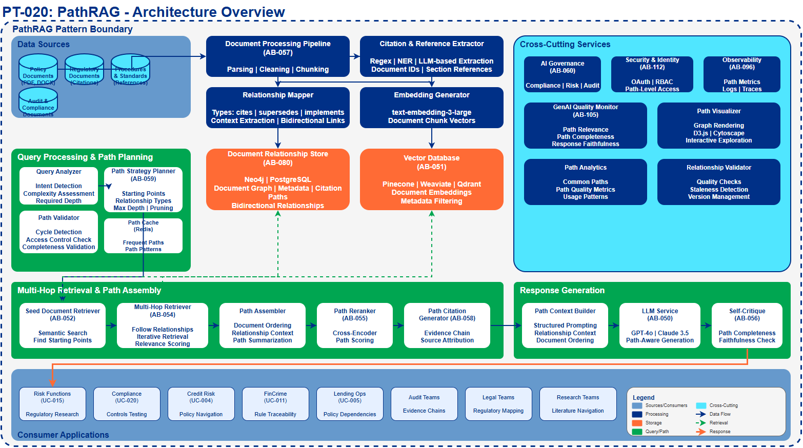
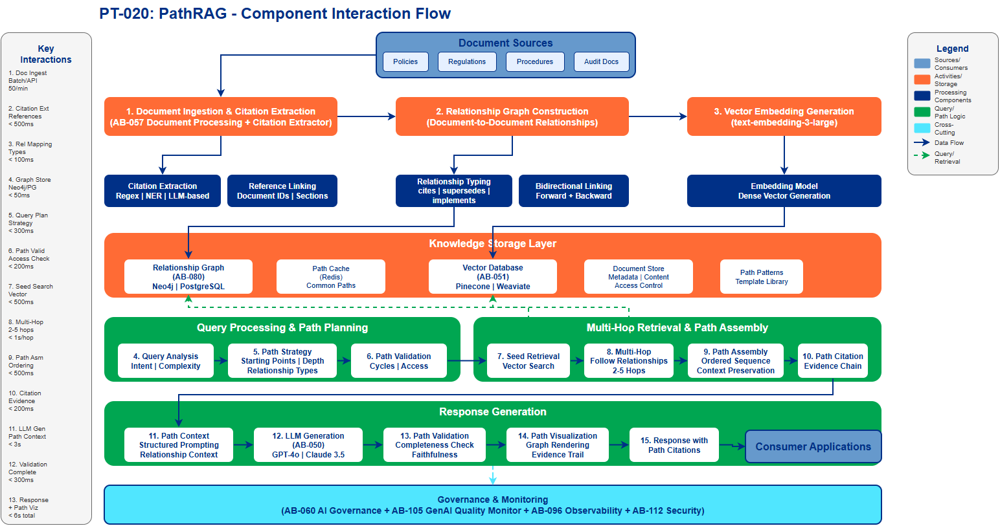

# Path-Based Retrieval Augmented Generation (PathRAG) Pattern

## Document Control

| Property | Value |
|----------|-------|
| **Pattern ID** | `PT-020` |
| **Pattern Name** | PathRAG Pattern |
| **Version** | `1.0.0` |
| **Status** | `Draft` |
| **Created Date** | `2025-12-07` |
| **Last Modified** | `2025-12-07` |
| **Owner** | BNZ Enterprise Architecture |
| **Pattern Category** | `GenAI` |
| **Maturity Level** | `Emerging` |

---

## 1. Pattern Overview

### 1.1 Pattern Name and Classification

**Pattern Name**: Path-Based Retrieval Augmented Generation (PathRAG)

**Short Name**: PathRAG

**Pattern Category**: GenAI

**Pattern Type**: AI/ML Architecture, Knowledge Management

### 1.2 Intent and Context

**Intent Statement**:
Enable LLMs to reason over interconnected document chains and evidence paths by retrieving and following document-to-document relationships, citations, and logical dependencies for more coherent and traceable answers.

**Problem Statement**:
Traditional RAG and even GraphRAG face limitations when dealing with complex reasoning that requires following chains of evidence across multiple related documents:
- **Lost Context Chains**: Standard RAG retrieves isolated document chunks without understanding how documents reference and build upon each other
- **Citation Blindness**: Cannot follow citation paths to source documents or understand evidence hierarchies
- **Logical Dependency Gaps**: Fails to recognize when Document B depends on understanding Document A first
- **Incomplete Reasoning**: Multi-step questions requiring evidence from sequentially dependent documents get incomplete answers
- **Evidence Traceability**: Difficult to trace the complete reasoning path from question to evidence sources

**Context**:
Financial services organizations have vast document ecosystems with rich interconnections: regulatory policies citing precedents, risk assessments referencing market data, compliance documents linking to legal frameworks, and procedures building on foundational policies. PathRAG enables LLMs to navigate these document networks intelligently, following paths of evidence and reasoning just as a human subject matter expert would.

Use cases include:
- "What is the regulatory basis for our AML screening thresholds?" (requires tracing policy → regulation → legal precedent)
- "Explain why this loan application was rejected" (requires following decision → policy → credit criteria → risk model → market conditions)
- "Compare our credit risk model to Basel III requirements" (requires navigating model documentation → regulatory framework → implementation guidelines)

**Forces**:
- **Comprehensive Reasoning vs. Latency**: Following document paths adds retrieval steps but enables complete understanding
- **Path Depth vs. Context Window**: Deep paths consume more tokens but provide richer context
- **Structured Relationships vs. Flexibility**: Explicit document links enable reasoning but require metadata maintenance
- **Traceability vs. Complexity**: Full evidence chains provide audit trails but increase system complexity
- **Accuracy vs. Cost**: Multi-hop retrieval increases LLM API calls and embedding lookups

### 1.3 Pattern Maturity and Industry Adoption

**Maturity Level**: Emerging

**Industry Adoption**:
- **Adoption Rate**: Approximately 10-15% of enterprises with advanced RAG implementations are exploring or piloting PathRAG as of late 2025
- **Reference Implementations**:
  - Microsoft Research: Path-augmented retrieval for legal document reasoning
  - Stanford NLP: Evidence chain tracing for scientific literature
  - Financial regulatory compliance: Multi-document policy reasoning systems
  - Healthcare: Clinical guideline navigation with evidence chains
- **Timeframe**: Emerged from research (2024) to early frameworks (2025) with growing production adoption expected in 2026

**Standards Alignment**:
- ISO 15489: Records management and document relationships
- TOGAF 10: Information governance and traceability
- NIST AI RMF: Explainability and audit trail requirements
- Basel III: Regulatory documentation and evidence requirements
- SOC 2: Audit evidence and documentation controls

**2025 State of the Art**:
- **Path-aware retrieval**: Document relationship metadata drives retrieval strategy
- **Multi-hop reasoning**: Iterative retrieval following document reference chains
- **Evidence scoring**: Prioritizing document paths based on relevance and credibility
- **Path visualization**: Rendering document traversal paths for explainability
- **Hybrid approaches**: Combining PathRAG with GraphRAG for comprehensive knowledge access

---

## 2. Architecture Specification

### 2.1 Architecture Building Blocks (ABBs)

**Primary ABBs** (Core components required):

| ABB ID | ABB Name | Purpose in Pattern | Criticality |
|--------|----------|-------------------|-------------|
| [AB-051](../../architecture-building-blocks/abbs/AB-051/AB-051-Vector-Database-v1.0.0.md) | Vector Database | Store document embeddings for semantic similarity retrieval | Critical |
| [AB-050](../../architecture-building-blocks/abbs/AB-050/AB-050-Large-Language-Model-Service-v1.0.0.md) | Large Language Model Service | Generate responses using path-augmented context | Critical |
| [AB-080](../../architecture-building-blocks/abbs/AB-080/AB-080-Knowledge-Base-v1.0.0.md) | Knowledge Base | Store document relationship metadata and citation links | Critical |
| [AB-052](../../architecture-building-blocks/abbs/AB-052/AB-052-Semantic-Search-Engine-v1.0.0.md) | Semantic Search Engine | Coordinate path-based retrieval across document chains | Critical |
| [AB-057](../../architecture-building-blocks/abbs/AB-057/AB-057-Document-Processing-Pipeline-v1.0.0.md) | Document Processing Pipeline | Extract document references, citations, and dependencies | High |

**Supporting ABBs** (Optional or scenario-specific):

| ABB ID | ABB Name | Purpose in Pattern | When Required |
|--------|----------|-------------------|---------------|
| [AB-059](../../architecture-building-blocks/abbs/AB-059/AB-059-Query-Rewriting-Engine-v1.0.0.md) | Query Rewriting Engine | Decompose complex queries into path traversal steps | For complex multi-path queries |
| [AB-055](../../architecture-building-blocks/abbs/AB-055/AB-055-Reranking-Engine-v1.0.0.md) | Reranking Engine | Rerank documents within each path hop | For high-precision applications |
| [AB-058](../../architecture-building-blocks/abbs/AB-058/AB-058-Citation-Generator-v1.0.0.md) | Citation Generator | Generate full evidence path citations | For audit and compliance |
| [AB-056](../../architecture-building-blocks/abbs/AB-056/AB-056-Self-Critique-Engine-v1.0.0.md) | Self-Critique Engine | Validate path completeness and relevance | For high-stakes applications |
| [AB-054](../../architecture-building-blocks/abbs/AB-054/AB-054-Hybrid-Search-Engine-v1.0.0.md) | Hybrid Search Engine | Combine vector, keyword, and relationship-based retrieval | For comprehensive coverage |

**Cross-Cutting ABBs** (Always required):

| ABB ID | ABB Name | Purpose |
|--------|----------|---------|
| [AB-060](../../architecture-building-blocks/abbs/AB-060/AB-060-AI-Model-Registry-v1.0.0.md) | AI Governance Platform | Compliance, risk management, audit for AI responses |
| [AB-112](../../architecture-building-blocks/abbs/AB-112/AB-112-Data-Encryption-Service-v1.0.0.md) | Security & Identity | Authentication, authorization, encryption for knowledge access |
| [AB-096](../../architecture-building-blocks/abbs/AB-096/AB-096-Observability-Platform-v1.0.0.md) | Observability Platform | Monitoring, logging, alerting for RAG pipeline health |
| [AB-105](../../architecture-building-blocks/abbs/AB-105/AB-105-GenAI-Quality-Monitor-v1.0.0.md) | GenAI Quality Monitor | Monitor response quality, path completeness, retrieval accuracy |

### 2.2 Pattern Structure

**Architectural Diagram**:

**Component Interaction Flow**:

**Key Interactions**:

1. **Document Ingestion & Relationship Extraction**: Documents processed to extract citations and dependencies
   - Protocol: Batch processing pipeline (REST APIs for orchestration)
   - Data Format: PDF, DOCX, HTML → JSON with relationship metadata
   - Latency Target: Batch processing (minutes to hours depending on corpus size)

2. **Relationship Mapping**: Document-to-document relationships stored
   - Protocol: REST API to Knowledge Base
   - Data Format: JSON (source_doc, target_doc, relationship_type, context)
   - Latency Target: < 100ms per relationship insertion

3. **Path Discovery**: Query analyzed to identify required document paths
   - Protocol: Internal processing
   - Data Format: Query → Path strategy (starting points, relationship types, max depth)
   - Latency Target: < 300ms for path planning

4. **Multi-Hop Retrieval**: Iterative document retrieval following relationship chains
   - Protocol: Vector DB API + Knowledge Base API
   - Data Format: Embeddings + Relationship queries → Document chains
   - Latency Target: < 1 second per hop (typically 2-4 hops)

5. **Path Assembly**: Retrieved documents assembled into coherent evidence chain
   - Protocol: Internal processing
   - Data Format: Document sequence with relationship context → Structured path context
   - Latency Target: < 500ms for path assembly

6. **LLM Generation with Path Context**: Response generated using complete evidence path
   - Protocol: LLM API (REST/gRPC)
   - Data Format: Query + Path context → Natural language response with citations
   - Latency Target: < 4 seconds for complete response (streaming supported)

### 2.3 Data Flow

**Data Sources**:
- **Enterprise Documents**: Policies, procedures, regulations, guidelines, memos
- **Structured Metadata**: Document catalogs, classification systems, version histories
- **Citation Databases**: Reference management systems, regulatory databases
- **Existing Knowledge Bases**: Document management systems, wikis, SharePoint

**Data Transformations**:

1. **Document Processing**: Raw documents → Cleaned text → Chunks with metadata
   - Performed by Document Processing Pipeline (AB-057)
   - Extraction of: title, authors, date, document type, keywords

2. **Citation Extraction**: Text analysis → References and citations identified
   - Pattern matching for citation formats (regulatory references, document IDs)
   - Named entity recognition for document titles and policy numbers
   - Section cross-reference extraction

3. **Relationship Identification**: Document pairs → Relationship type and context
   - **Types**: cites, supersedes, implements, supports, contradicts, requires_context_from
   - **Context**: Which section, why related, strength of relationship
   - Bidirectional relationship creation

4. **Graph Construction**: Documents + Relationships → Document relationship graph
   - Nodes: Documents with metadata
   - Edges: Typed relationships with context
   - Graph validation and cycle detection

5. **Embedding Generation**: Text chunks → Vector embeddings
   - Performed by embedding models (e.g., text-embedding-3-large)
   - Stored in Vector Database (AB-051)
   - Indexed by document ID for path retrieval

6. **Path Pattern Mining**: Historical queries → Common path patterns
   - Identify frequently traversed document chains
   - Pre-compute path summaries for common routes
   - Cache popular path results

**Data Sinks**:
- **Document Relationship Store**: Graph database or relational DB with relationship tables
- **Vector Database**: Document chunk embeddings with document IDs
- **Path Cache**: Redis for frequently accessed document chains
- **Audit Log**: Complete trace of paths traversed for each query

**Data Governance**:
- **Classification**: Inherited from source documents; path classification = most restrictive in chain
- **Retention**: Per document source policy; relationships follow document retention
- **Lineage**: Tracked from source document → relationships → path → query → response
- **Quality**: Relationship accuracy, path completeness, response faithfulness
- **Access Control**: Path-level access control (user must have access to all docs in path)

### 2.4 Interface Specifications

**Inbound Interfaces** (Inputs to pattern):

| Interface ID | Interface Name | Type | Protocol | Data Format | SLA |
|--------------|---------------|------|----------|-------------|-----|
| IF-IN-001 | Document Ingestion | Batch / API | REST / S3 | PDF, DOCX, HTML, JSON | Batch: 24hr, API: < 5s ack |
| IF-IN-002 | User Query | API | REST / WebSocket | Natural language text | < 100ms acknowledgment |
| IF-IN-003 | Relationship Metadata | Batch / API | REST / JDBC | JSON / CSV | Per source SLA |
| IF-IN-004 | Citation Updates | API | REST | JSON (doc relationships) | < 1s for updates |

**Outbound Interfaces** (Outputs from pattern):

| Interface ID | Interface Name | Type | Protocol | Data Format | SLA |
|--------------|---------------|------|----------|-------------|-----|
| IF-OUT-001 | Query Response | API | REST / WebSocket | JSON (answer + path citations) | < 6s (streaming available) |
| IF-OUT-002 | Path Visualization | API | REST | JSON (path graph) | < 2s |
| IF-OUT-003 | Evidence Chain | API | REST | JSON (ordered document list) | < 1s |
| IF-OUT-004 | Analytics Events | Stream | Kafka | JSON (usage metrics) | Real-time |

**Internal Interfaces** (Between ABBs within pattern):

| Interface ID | Source ABB | Target ABB | Protocol | Purpose |
|--------------|-----------|-----------|----------|---------|
| IF-INT-001 | AB-057 Document Pipeline | AB-080 Knowledge Base | REST | Store document relationships |
| IF-INT-002 | AB-052 Semantic Search | AB-051 Vector Database | REST | Vector similarity search at each hop |
| IF-INT-003 | AB-052 Semantic Search | AB-080 Knowledge Base | GraphQL | Query document relationships |
| IF-INT-004 | AB-052 Semantic Search | AB-050 LLM Service | REST | Generate response from path context |
| IF-INT-005 | AB-059 Query Rewriter | AB-050 LLM Service | REST | Path strategy decomposition |
| IF-INT-006 | AB-055 Reranking Engine | AB-050 LLM Service | REST | Rerank documents within each hop |

---

## 3. Pattern Variants and Options

### 3.1 Pattern Variations

**Variant 1: Forward-Only PathRAG (Simpler)**
- **When to Use**: Citation-heavy documents with clear hierarchies (regulations, policies)
- **Key Differences**:
  - Follows only forward citations (document A cites document B)
  - Unidirectional path traversal
  - Simpler graph structure
- **Trade-offs**:
  - **Gain**: Easier implementation, faster traversal, clearer evidence chains
  - **Lose**: Misses backward dependencies (what cites this document), less comprehensive

**Variant 2: Bidirectional PathRAG (Recommended)**
- **When to Use**: Complex document ecosystems with mutual dependencies
- **Key Differences**:
  - Follows both forward and backward relationships
  - Can discover "what depends on this" and "what does this depend on"
  - Richer relationship types (cites, cited_by, supersedes, superseded_by)
- **Trade-offs**:
  - **Gain**: Complete understanding, discovers implicit connections
  - **Lose**: Higher complexity, potential for path explosion, slower traversal

**Variant 3: Constrained Path PathRAG**
- **When to Use**: Regulatory compliance, audit requirements with strict evidence rules
- **Key Differences**:
  - Pre-defined valid path patterns (e.g., policy → regulation → law)
  - Path validation rules
  - Depth limits and relationship type constraints
- **Trade-offs**:
  - **Gain**: Guaranteed compliance, predictable paths, audit-friendly
  - **Lose**: Less flexibility, may miss valid alternative paths

**Variant 4: Adaptive Path PathRAG**
- **When to Use**: Exploratory research, complex multi-domain questions
- **Key Differences**:
  - LLM decides path strategy dynamically
  - Can switch relationship types mid-path
  - Explores alternative paths if first path insufficient
- **Trade-offs**:
  - **Gain**: Most flexible, handles novel questions, discovers unexpected connections
  - **Lose**: Higher latency (multiple LLM calls), less predictable, harder to explain

### 3.2 Composition with Other Patterns

**Commonly Combined With**:

| Pattern | Integration Point | Combined Benefit |
|---------|------------------|------------------|
| PT-005 RAG | PathRAG extends basic RAG with document relationships | Complete knowledge access: semantic + relational |
| PT-019 GraphRAG | Entities from GraphRAG inform document path selection | Entity-aware document navigation |
| PT-007 Agentic AI | Agent uses PathRAG for evidence-gathering tool | Agent can follow reasoning chains methodically |
| PT-011 IDP | IDP extracts citations and relationships for PathRAG | Automated relationship discovery from documents |
| PT-001 AI Governance | Governance tracks full evidence paths for audit | Complete audit trail of reasoning sources |

**Anti-Patterns** (What NOT to do):

- **Anti-Pattern 1: Unbounded Path Exploration**
  - **Why Problematic**: Can explore infinite paths, exhausting resources and context windows
  - **Better Approach**: Set max depth (typically 3-5 hops), use relevance thresholds

- **Anti-Pattern 2: Ignoring Document Versions**
  - **Why Problematic**: Following outdated citations leads to wrong answers
  - **Better Approach**: Include version metadata, prefer most recent unless historically specific

- **Anti-Pattern 3: Flat Relationship Types**
  - **Why Problematic**: "cites" relationship without context (supportive vs. contradictory citation)
  - **Better Approach**: Rich relationship types: supports, contradicts, extends, supersedes, implements

- **Anti-Pattern 4: Path without Context**
  - **Why Problematic**: Presenting document chain without explaining relationships
  - **Better Approach**: Include relationship context in prompts and responses

- **Anti-Pattern 5: No Path Validation**
  - **Why Problematic**: May traverse illogical or circular paths
  - **Better Approach**: Validate paths for completeness, coherence, and cycle avoidance

---

## 4. Implementation Guidance

### 4.1 Key Principles

**1. Relationship-First Design**
- Model document relationships explicitly (not just semantic similarity)
- Support multiple relationship types with different semantics
- Capture relationship context (why documents are connected)

**2. Path Strategy Planning**
- Analyze query to determine optimal path strategy before retrieval
- Balance path depth with context window constraints
- Prefer high-confidence paths over exhaustive exploration

**3. Incremental Path Building**
- Start with seed documents (most relevant to query)
- Expand path hop-by-hop, evaluating relevance at each step
- Stop when sufficient information gathered or max depth reached

**4. Path Context Preservation**
- Include relationship context in prompts (not just documents)
- Preserve document order and traversal logic
- Explain path reasoning to LLM

**5. Evidence Traceability**
- Track complete path for every response
- Generate citations showing document chain
- Enable users to explore alternative paths

### 4.2 PathRAG Pipeline Components

Every PathRAG implementation MUST include the following components:

| Component | Description | Example |
|-----------|-------------|---------|
| **Document Processor** | Extract citations and references | "Section 3.2 references Policy ABC-123" → relationship: (current_doc) --cites--> (ABC-123) |
| **Relationship Extractor** | Identify document-to-document relationships | "This policy supersedes version 2.1" → relationship: (current_doc) --supersedes--> (v2.1) |
| **Relationship Store** | Persist document relationships with metadata | Graph DB or relational tables: (doc_id, related_doc_id, relationship_type, context) |
| **Path Planner** | Determine retrieval strategy for query | Query: "Why was loan rejected?" → Strategy: decision_doc → policy_doc → criteria_doc |
| **Multi-Hop Retriever** | Execute iterative retrieval following relationships | Hop 1: Find decision doc → Hop 2: Follow policy reference → Hop 3: Retrieve criteria |
| **Path Assembler** | Combine documents into coherent evidence chain | [Decision, because Policy, based on Criteria] with relationship contexts |
| **Response Generator** | Generate answer using path-augmented context | LLM with full path context and relationship explanations |
| **Path Visualizer** | Render document path for explainability | Graph visualization showing traversal path |

### 4.3 When to Use

**Ideal Scenarios**:
- Regulatory compliance queries requiring evidence chains
- Multi-document reasoning where context builds across documents
- Audit and investigation use cases needing complete evidence trails
- Complex policy interpretation requiring precedent analysis
- Research questions spanning interconnected literature
- Decision explanation requiring traceable justification

**Not Recommended For**:
- Simple FAQ queries from single documents (use basic RAG)
- Real-time applications requiring sub-100ms latency
- Exploratory queries with no clear path structure
- Documents with no meaningful relationships (isolated content)
- Use cases where semantic similarity alone is sufficient

### 4.4 BNZ Use Cases

**Primary Use Cases** (Direct dependency on PathRAG):

| Use Case | PathRAG Application | Key Document Paths |
|----------|---------------------|-------------------|
| **[UC-015](../../../01-motivation/03-use-cases/use-cases/UC-015/index.md): Risk Functions** | Navigate regulatory requirements and control relationships | Regulation → Policy → Control → Evidence → Audit |
| **[UC-004](../../../01-motivation/03-use-cases/use-cases/UC-004/index.md): Credit Risk** | Trace credit decision rationale through policy hierarchy | Decision → Credit Policy → Basel III → Risk Model → Market Data |
| **[UC-020](../../../01-motivation/03-use-cases/use-cases/UC-020/index.md): Controls Testing** | Follow control lineage from regulation to implementation | Regulatory Requirement → Control Framework → Control → Test Plan → Evidence |
| **[UC-011](../../../01-motivation/03-use-cases/use-cases/UC-011/index.md): Fincrime** | Trace AML rules to regulatory source and case precedents | Alert → Screening Rule → Regulation → Legal Precedent → Case Law |
| **[UC-005](../../../01-motivation/03-use-cases/use-cases/UC-005/index.md): Lending Ops** | Navigate underwriting policy dependencies | Application → Underwriting Decision → Credit Policy → Criteria → Market Conditions |

**Secondary Use Cases** (Benefit from PathRAG enhancement):

- **[UC-001](../../../01-motivation/03-use-cases/use-cases/UC-001/index.md): Partnership Banking** - Navigate customer relationship history and meeting chain
- **[UC-007](../../../01-motivation/03-use-cases/use-cases/UC-007/index.md): Contact Centre** - Follow product documentation from customer question to technical specs
- **[UC-022](../../../01-motivation/03-use-cases/use-cases/UC-022/index.md): Learning Content** - Navigate training prerequisites and learning paths
- **[UC-021](../../../01-motivation/03-use-cases/use-cases/UC-021/index.md): Wholesale Underwriting** - Trace underwriting guidelines to credit policies and regulations

### 4.5 Implementation Components

**Technology Stack** (2025 Recommendations):

**Document Relationship Storage**:
- **Neo4j** - Native graph database excellent for relationship traversal
- **PostgreSQL with recursive CTEs** - Relational approach for simpler relationships
- **Amazon Neptune** - Managed graph database with good AWS integration
- **Azure Cosmos DB (Gremlin)** - Globally distributed graph database
- **Dgraph** - Distributed graph database with GraphQL support

**Vector Database**:
- **Pinecone** - Managed vector database with metadata filtering
- **Weaviate** - Open-source vector database with relationship support
- **Qdrant** - High-performance vector similarity search
- **Azure AI Search** - Enterprise search with vector and relationship capabilities

**LLM Services**:
- **Azure OpenAI (GPT-4o, GPT-4 Turbo)** - Enterprise-grade LLM with large context window
- **AWS Bedrock (Claude 3.5)** - Strong reasoning for path interpretation
- **Anthropic Claude** - Excellent at following complex reasoning chains
- **OpenAI API** - Latest models with extended context windows

**Citation Extraction**:
- **Regex patterns** - For structured citation formats (policy IDs, regulatory references)
- **Azure AI Document Intelligence** - Extract document structure and references
- **spaCy NER** - Extract document entity mentions
- **Custom LLM extraction** - Use LLM to identify and classify document relationships

**Path Visualization**:
- **D3.js** - Interactive graph visualizations in web interfaces
- **Cytoscape.js** - Network graph visualization library
- **Graphviz** - Programmatic graph rendering
- **Neo4j Bloom** - Native graph exploration interface

### 4.6 Best Practices (2025)

**Relationship Modeling**:
- Define clear relationship ontology (8-12 core types: cites, supersedes, implements, etc.)
- Capture bidirectional relationships (A cites B, B cited_by A)
- Include relationship metadata: date, section, context, confidence score
- Version relationships when documents change

**Path Strategy**:
- Analyze query complexity before path planning (simple vs. multi-hop)
- Set reasonable depth limits (typically 3-5 hops maximum)
- Use breadth-first search for comprehensive coverage, depth-first for targeted paths
- Implement relevance pruning at each hop (discard low-relevance branches)

**Context Management**:
- Prioritize recent hops (documents closer to query context)
- Summarize long documents at intermediate hops to save context window
- Include relationship context in prompts: "Document B (cited by A in Section 3) states..."
- Use structured context format: clearly delineate each path hop

**Performance Optimization**:
- Cache frequently traversed paths
- Pre-compute common path patterns during indexing
- Use path pattern templates for known query types
- Implement parallel retrieval for independent path branches

**Quality Assurance**:
- Validate path completeness (no broken links)
- Check for circular paths and prune
- Verify access control at each hop (user can access all documents in path)
- Monitor path quality metrics: average relevance, path length distribution

### 4.7 Migration Strategy

**Phase 1: Foundation (Months 1-2)**
- Select relationship storage technology (Neo4j or PostgreSQL)
- Define relationship ontology for BNZ documents (8-12 types)
- Deploy vector database infrastructure
- Implement basic document ingestion pipeline

**Phase 2: Relationship Extraction (Months 3-4)**
- Implement citation extraction for regulatory documents
- Build relationship extraction pipeline (manual + automated)
- Populate initial relationship graph (pilot document set: 1000-5000 docs)
- Validate relationship quality (precision > 80%)

**Phase 3: Path Retrieval (Months 5-6)**
- Implement path planning logic (query → strategy)
- Build multi-hop retrieval engine
- Integrate path context with LLM prompts
- Deploy path visualization interface
- Test with pilot users (Risk and Compliance teams)

**Phase 4: Production & Optimization (Months 7-9)**
- Production deployment with monitoring
- Tune path depth and relevance thresholds
- Implement path caching for performance
- Expand to full document corpus
- Scale infrastructure based on usage

**Phase 5: Advanced Features (Months 10+)**
- Adaptive path strategies (LLM-driven)
- Path pattern mining and templates
- Multi-path fusion (combine evidence from alternative paths)
- Path quality scoring and feedback loops
- Cross-domain path traversal

---

## 5. Quality Attributes and NFRs

### 5.1 Performance

| Metric | Target | Measurement |
|--------|--------|-------------|
| **Query Latency (2-hop)** | < 4 seconds (p95) | Vector search + relationship traversal + LLM generation |
| **Query Latency (4-hop)** | < 6 seconds (p95) | Multi-hop retrieval with path assembly |
| **Path Planning** | < 300ms | Query analysis to path strategy |
| **Hop Latency** | < 800ms per hop | Vector search + relationship query at each hop |
| **Document Ingestion** | 50 docs/minute | End-to-end from upload to searchable with relationships |

### 5.2 Availability

| Metric | Target | Measurement |
|--------|--------|-------------|
| **Query Service Uptime** | 99.9% | API availability for query endpoints |
| **Relationship DB Uptime** | 99.95% | Graph database availability |
| **Vector Database Uptime** | 99.9% | Vector store availability |
| **LLM Service Uptime** | 99.5% | Azure OpenAI / AWS Bedrock availability |

### 5.3 Scalability

| Dimension | Target | Approach |
|-----------|--------|----------|
| **Document Corpus** | 1M+ documents | Distributed vector storage, sharded graph database |
| **Relationship Edges** | 10M+ relationships | Graph database partitioning, efficient indexing |
| **Query Throughput** | 500 queries/min | Horizontal scaling of retrieval layer, path caching |
| **Concurrent Users** | 300+ | API gateway scaling, connection pooling |

### 5.4 Security

| Requirement | Implementation | Standard |
|-------------|----------------|----------|
| **Authentication** | OAuth 2.0, JWT tokens | Industry standard |
| **Authorization** | Path-level RBAC (user must access all docs in path) | Least privilege principle |
| **Encryption at Rest** | AES-256 for documents and relationships | FIPS 140-2 compliant |
| **Encryption in Transit** | TLS 1.3 | Industry standard |
| **PII Protection** | Document-level access control, PII masking | GDPR, Privacy Act compliance |
| **Audit Logging** | Complete path traversal logging for compliance | SOC 2, regulatory compliance |

### 5.5 AI Quality

| Metric | Target | Enforcement |
|--------|--------|-------------|
| **Path Relevance** | > 80% (relevant documents in path) | Automated evaluation on labeled queries |
| **Response Faithfulness** | > 95% (grounded in path context) | LLM-based faithfulness scoring |
| **Path Completeness** | > 85% (necessary docs included) | Human evaluation on sample queries |
| **Relationship Accuracy** | > 85% (correct relationships extracted) | Precision/recall on labeled document pairs |
| **Citation Accuracy** | > 95% (correct path citations) | Automated verification against source docs |

---

## 6. Risks and Mitigations

### 6.1 Key Risks

| Risk | Impact | Likelihood | Mitigation |
|------|--------|------------|------------|
| **Relationship extraction errors** | High | Medium | Manual validation for critical documents, confidence thresholds |
| **Path explosion (too many paths)** | High | Medium | Depth limits, relevance pruning, path scoring |
| **Outdated relationships** | High | High | Relationship versioning, periodic validation, staleness detection |
| **Access control complexity** | High | Medium | Path-level access validation before retrieval |
| **Context window exhaustion** | Medium | High | Document summarization at intermediate hops, path pruning |
| **Circular path detection failure** | Medium | Low | Cycle detection algorithms, path validation |
| **Latency exceeds targets** | Medium | Medium | Path caching, parallel retrieval, depth limits |

### 6.2 Change Management

**Organizational Change**:
- Knowledge workers need to understand path-based reasoning
- Content teams must maintain relationship metadata
- Governance teams must validate audit trails

**Training Requirements**:
- Data Engineers: Document relationship modeling, graph databases (2 weeks)
- ML Engineers: LLM path prompting, multi-hop retrieval (1 week)
- Content Managers: Relationship metadata authoring (1 week)
- End Users: Understanding path citations and evidence chains (2 hours)

**Communication Plan**:
- Executive sponsorship: Demonstrate value through pilot use case (Regulatory Compliance)
- Quarterly showcases: Show improved answer quality vs. basic RAG
- Monthly community of practice: Share learnings across teams

---

## 7. Success Metrics

### 7.1 Leading Indicators

| Metric | Target | Measurement Frequency |
|--------|--------|----------------------|
| **Relationship Graph Size** | 500K relationships by Year 1 | Monthly |
| **Document Coverage** | 90% of policy/regulatory docs indexed | Quarterly |
| **Path Query Volume** | 5,000 queries/month | Monthly |
| **User Adoption** | 300 active users | Monthly |

### 7.2 Lagging Indicators

| Metric | Target | Measurement Frequency |
|--------|--------|----------------------|
| **Answer Quality Score** | 4.3/5.0 (user rating) | Quarterly survey |
| **Time to Evidence** | 70% reduction vs. manual research | Quarterly |
| **Path Relevance** | > 80% relevant documents in paths | Monthly evaluation |
| **Citation Accuracy** | > 95% accurate citations | Monthly evaluation |

### 7.3 Business Outcomes

| Outcome | Target | Timeframe |
|---------|--------|-----------|
| **Reduced Compliance Time** | 60% reduction for regulatory research | Year 1 |
| **Improved Audit Readiness** | 50% faster audit evidence gathering | Year 1 |
| **Enhanced Decision Quality** | 40% improvement in decision traceability | Year 1 |
| **Reduced Risk** | 30% fewer compliance violations due to incomplete evidence | Year 2 |

---

## 8. References and Resources

### 8.1 Related Patterns

| Pattern ID | Pattern Name | Relationship | Reference |
|-----------|-------------|--------------|-----------|
| PT-005 | RAG | PathRAG extends basic RAG with document paths | [PT-005-Retrieval-Augmented-Generation-v1.0.0.md](../PT-005/index.md) |
| PT-019 | GraphRAG | PathRAG complements entity graphs with document paths | [PT-019-GraphRAG-v1.0.0.md](../PT-019/index.md) |
| PT-007 | Agentic AI | Agent can use PathRAG for evidence gathering | [PT-007-Agentic-AI-v1.0.0.md](../PT-007/index.md) |
| PT-011 | IDP | IDP feeds documents and citations to PathRAG | [PT-011-Intelligent-Document-Processing-v1.0.0.md](../PT-011/index.md) |
| PT-001 | Enterprise AI Governance | Governance for PathRAG responses and evidence chains | [PT-001-Enterprise-AI-Governance-v1.0.0.md](../PT-001/index.md) |

### 8.2 Related ABBs

| ABB ID | ABB Name | Document Link |
|--------|----------|---------------|
| [AB-051](../../architecture-building-blocks/abbs/AB-051/AB-051-Vector-Database-v1.0.0.md) | Vector Database | [AB-051-Vector-Database-v1.0.0.md](../../architecture-building-blocks/abbs/AB-051/AB-051-Vector-Database-v1.0.0.md) |
| [AB-050](../../architecture-building-blocks/abbs/AB-050/AB-050-Large-Language-Model-Service-v1.0.0.md) | Large Language Model Service | [AB-050-Large-Language-Model-Service-v1.0.0.md](../../architecture-building-blocks/abbs/AB-050/AB-050-Large-Language-Model-Service-v1.0.0.md) |
| [AB-080](../../architecture-building-blocks/abbs/AB-080/AB-080-Knowledge-Base-v1.0.0.md) | Knowledge Base | [AB-080-Knowledge-Base-v1.0.0.md](../../architecture-building-blocks/abbs/AB-080/AB-080-Knowledge-Base-v1.0.0.md) |
| [AB-052](../../architecture-building-blocks/abbs/AB-052/AB-052-Semantic-Search-Engine-v1.0.0.md) | Semantic Search Engine | [AB-052-Semantic-Search-Engine-v1.0.0.md](../../architecture-building-blocks/abbs/AB-052/AB-052-Semantic-Search-Engine-v1.0.0.md) |
| [AB-057](../../architecture-building-blocks/abbs/AB-057/AB-057-Document-Processing-Pipeline-v1.0.0.md) | Document Processing Pipeline | [AB-057-Document-Processing-Pipeline-v1.0.0.md](../../architecture-building-blocks/abbs/AB-057/AB-057-Document-Processing-Pipeline-v1.0.0.md) |
| [AB-059](../../architecture-building-blocks/abbs/AB-059/AB-059-Query-Rewriting-Engine-v1.0.0.md) | Query Rewriting Engine | [AB-059-Query-Rewriting-Engine-v1.0.0.md](../../architecture-building-blocks/abbs/AB-059/AB-059-Query-Rewriting-Engine-v1.0.0.md) |
| [AB-055](../../architecture-building-blocks/abbs/AB-055/AB-055-Reranking-Engine-v1.0.0.md) | Reranking Engine | [AB-055-Reranking-Engine-v1.0.0.md](../../architecture-building-blocks/abbs/AB-055/AB-055-Reranking-Engine-v1.0.0.md) |
| [AB-058](../../architecture-building-blocks/abbs/AB-058/AB-058-Citation-Generator-v1.0.0.md) | Citation Generator | [AB-058-Citation-Generator-v1.0.0.md](../../architecture-building-blocks/abbs/AB-058/AB-058-Citation-Generator-v1.0.0.md) |
| [AB-056](../../architecture-building-blocks/abbs/AB-056/AB-056-Self-Critique-Engine-v1.0.0.md) | Self-Critique Engine | [AB-056-Self-Critique-Engine-v1.0.0.md](../../architecture-building-blocks/abbs/AB-056/AB-056-Self-Critique-Engine-v1.0.0.md) |
| [AB-054](../../architecture-building-blocks/abbs/AB-054/AB-054-Hybrid-Search-Engine-v1.0.0.md) | Hybrid Search Engine | [AB-054-Hybrid-Search-Engine-v1.0.0.md](../../architecture-building-blocks/abbs/AB-054/AB-054-Hybrid-Search-Engine-v1.0.0.md) |
| [AB-060](../../architecture-building-blocks/abbs/AB-060/AB-060-AI-Model-Registry-v1.0.0.md) | AI Governance Platform | [AB-060-AI-Model-Registry-v1.0.0.md](../../architecture-building-blocks/abbs/AB-060/AB-060-AI-Model-Registry-v1.0.0.md) |
| [AB-112](../../architecture-building-blocks/abbs/AB-112/AB-112-Data-Encryption-Service-v1.0.0.md) | Security & Identity | [AB-112-Data-Encryption-Service-v1.0.0.md](../../architecture-building-blocks/abbs/AB-112/AB-112-Data-Encryption-Service-v1.0.0.md) |
| [AB-096](../../architecture-building-blocks/abbs/AB-096/AB-096-Observability-Platform-v1.0.0.md) | Observability Platform | [AB-096-Observability-Platform-v1.0.0.md](../../architecture-building-blocks/abbs/AB-096/AB-096-Observability-Platform-v1.0.0.md) |
| [AB-105](../../architecture-building-blocks/abbs/AB-105/AB-105-GenAI-Quality-Monitor-v1.0.0.md) | GenAI Quality Monitor | [AB-105-GenAI-Quality-Monitor-v1.0.0.md](../../architecture-building-blocks/abbs/AB-105/AB-105-GenAI-Quality-Monitor-v1.0.0.md) |

### 8.3 Standards and Guidelines

**Internal BNZ Standards**:
- BNZ AI Governance Standard (TBD)
- BNZ Document Classification Policy (TBD)
- BNZ API Design Standard (TBD)
- BNZ Visual Design Standard: [05-governance/standards/visual-design/visual-design-standard.md](../../../../05-governance/standards/visual-design/visual-design-standard.md)

**Industry Standards**:
- ISO 15489: Records management and document relationships
- W3C PROV-O: Provenance ontology for document lineage
- Dublin Core: Metadata standards for documents
- TOGAF 10: Information governance
- NIST AI RMF: AI Risk Management Framework

**Regulatory Compliance**:
- GDPR: Data protection in document chains
- Privacy Act 2020 (NZ): Personal information in document relationships
- RBNZ: Reserve Bank requirements for audit trails
- Basel III: Regulatory documentation requirements

### 8.4 External References

**Research & Frameworks**:
- "Path-Augmented Retrieval for Legal Reasoning" - Stanford NLP (2025) - https://arxiv.org/abs/2504.xxxxx
- "Evidence Chain Reasoning with LLMs" - Microsoft Research (2025)
- "Document Relationship Graphs for RAG" - Allen Institute for AI (2024)

**Technology Documentation**:
- Neo4j Graph Data Science: https://neo4j.com/docs/graph-data-science/
- LangChain Multi-Hop Retrieval: https://python.langchain.com/docs/use_cases/
- LlamaIndex Citation Chains: https://docs.llamaindex.ai/

**Industry Analysis**:
- Gartner: "Emerging Tech: Path-Based RAG for Enterprise Knowledge" (2025)
- Forrester: "Document Relationship Management in AI Era" (2025)

**Books**:
- "Knowledge Graphs: Fundamentals, Techniques, and Applications" by Mayank Kejriwal (MIT Press, 2021)
- "Information Retrieval: Implementing and Evaluating Search Engines" by Büttcher et al. (MIT Press, 2016)

## Appendix A: Glossary

| Term | Definition |
|------|------------|
| **PathRAG** | Path-based Retrieval Augmented Generation: RAG that follows document relationship chains |
| **Document Path** | Ordered sequence of documents connected by relationships (e.g., citations) |
| **Multi-Hop Retrieval** | Iterative retrieval process that follows document relationships across multiple steps |
| **Relationship Type** | Classification of document-to-document connection (cites, supersedes, implements, etc.) |
| **Evidence Chain** | Sequence of documents that collectively support an answer or conclusion |
| **Path Strategy** | Plan for how to traverse document relationships to answer a query |
| **Hop** | Single step in path traversal from one document to a related document |
| **Path Context** | Combined content of all documents in a path, presented to LLM for reasoning |
| **Citation Graph** | Network of documents connected by citation relationships |
| **Relationship Metadata** | Additional information about document relationships (date, section, context) |
| **Path Completeness** | Degree to which a retrieved path contains all necessary documents |
| **Bidirectional Relationship** | Document relationship stored in both directions (A→B and B→A) |

## Appendix B: Change History

| Version | Date | Author | Changes |
|---------|------|--------|---------|
| 1.0.0 | 2025-12-07 | BNZ Enterprise Architecture | Initial version - comprehensive PathRAG pattern based on 2025 best practices |

## Appendix C: Review and Approval

| Role | Name | Signature | Date |
|------|------|-----------|------|
| **Pattern Author** | BNZ Enterprise Architecture | | 2025-12-07 |
| **Enterprise Architect** | TBD | | |
| **Security Architect** | TBD | | |
| **TAF** | TBD | | |

## Appendix D: Implementation Checklist

Use this checklist when implementing PathRAG pattern at BNZ:

**Phase 1: Foundation**
- [ ] Select relationship storage technology (Neo4j or PostgreSQL)
- [ ] Select vector database (Pinecone, Weaviate, or Azure AI Search)
- [ ] Define relationship ontology (8-12 relationship types)
- [ ] Implement document processing pipeline
- [ ] Deploy embedding model for vector generation
- [ ] Define security and access control model

**Phase 2: Relationship Extraction**
- [ ] Implement citation extraction (regex patterns + NER)
- [ ] Implement relationship extraction pipeline
- [ ] Build relationship validation workflow
- [ ] Populate initial relationship graph (pilot corpus: 1000-5000 docs)
- [ ] Validate relationship quality (precision > 80%)
- [ ] Create relationship visualization interface

**Phase 3: Path Retrieval**
- [ ] Implement path planning logic (query → strategy)
- [ ] Build multi-hop retrieval engine
- [ ] Implement path assembly and context formatting
- [ ] Integrate path context with LLM prompts
- [ ] Implement path visualization
- [ ] Build evaluation dataset for path quality
- [ ] Deploy for internal testing with pilot users

**Phase 4: Production & Optimization**
- [ ] Production deployment with monitoring (AB-096)
- [ ] Implement GenAI quality monitoring (AB-105)
- [ ] Tune path depth and relevance thresholds
- [ ] Implement path caching for performance
- [ ] Expand to full document corpus
- [ ] Implement continuous relationship updates
- [ ] Scale infrastructure based on usage

**Phase 5: Advanced Features**
- [ ] Adaptive path strategies (LLM-driven)
- [ ] Path pattern mining and templates
- [ ] Multi-path fusion for comprehensive answers
- [ ] Path quality scoring and feedback loops
- [ ] Cross-domain path traversal
- [ ] Path analytics dashboards
- [ ] A/B testing for path strategies

**Ongoing Governance**
- [ ] Monthly path quality evaluation
- [ ] Monthly relationship accuracy monitoring
- [ ] Quarterly relationship graph expansion
- [ ] Quarterly user satisfaction surveys
- [ ] Annual pattern maturity assessment

