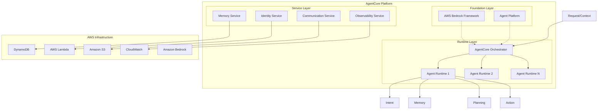

# AWS AgentCore Architecture

*Date: September 3, 2025*  
*Version: 1.0*  
*Author: Dermot*

> **Note on Sources**: This document is AI assisted (Github Copilot / Claude Sonnet 4) and but not yet fully validated and curated by the author. It synthesizes information from multiple authoritative sources including AWS official documentation, industry analysis, and the internal NAB framework and perspectives on Agentic AI just published (August 2025). All claims are supported by explicit citations linking to source materials. See the [References and Sources](#references-and-sources) section for complete attribution.

## Executive Summary

Amazon Bedrock AgentCore represents AWS's flagship platform for deploying and operating secure AI agents at enterprise scale [[2]](https://aws.amazon.com/blogs/aws/introducing-amazon-bedrock-agentcore-securely-deploy-and-operate-ai-agents-at-any-scale/). This document provides a detailed architectural analysis of AWS AgentCore, examining its implementation through the lens of canonical agentic systems patterns and its alignment with enterprise AI capability frameworks [[11]](../../../knowledge-base/strategic/ai-capability-model.md). AgentCore enables organizations to build, deploy, and manage autonomous AI agents with enterprise-grade security, scalability, and observability [[3]](https://www.aboutamazon.com/news/aws/aws-summit-agentic-ai-innovations-2025).

## Table of Contents

1. [Introduction](#introduction)
2. [Canonical Agentic Systems Framework](#canonical-agentic-systems-framework)
3. [AWS AgentCore Architecture Overview](#aws-agentcore-architecture-overview)
4. [Core Components and Services](#core-components-and-services)
5. [Agentic Pattern Implementation](#agentic-pattern-implementation)
6. [Technical Architecture Deep Dive](#technical-architecture-deep-dive)
7. [Integration and Interoperability](#integration-and-interoperability)
8. [Security and Governance](#security-and-governance)
9. [Scalability and Performance](#scalability-and-performance)
10. [Implementation Patterns](#implementation-patterns)
11. [References and Sources](#references-and-sources)

## Introduction

### What is AWS AgentCore?

AWS AgentCore is Amazon's fully-managed platform for building, deploying, and operating autonomous AI agents at enterprise scale [[2]](https://aws.amazon.com/blogs/aws/introducing-amazon-bedrock-agentcore-securely-deploy-and-operate-ai-agents-at-any-scale/). Launched as part of Amazon Bedrock, AgentCore addresses the critical gap between proof-of-concept AI demonstrations and production-ready agentic systems that can operate securely in enterprise environments [[3]](https://www.aboutamazon.com/news/aws/aws-summit-agentic-ai-innovations-2025).

### Key Value Propositions

- **Enterprise Security**: Session isolation and enterprise-grade security controls [[2]](https://aws.amazon.com/blogs/aws/introducing-amazon-bedrock-agentcore-securely-deploy-and-operate-ai-agents-at-any-scale/)
- **Scalability**: Serverless runtime supporting any agent framework [[3]](https://www.aboutamazon.com/news/aws/aws-summit-agentic-ai-innovations-2025)
- **Flexibility**: Support for open-source and custom agent frameworks [[2]](https://aws.amazon.com/blogs/aws/introducing-amazon-bedrock-agentcore-securely-deploy-and-operate-ai-agents-at-any-scale/)
- **Integration**: Native integration with AWS services and third-party tools [[1]](https://docs.aws.amazon.com/bedrock/latest/userguide/agentcore.html)
- **Observability**: Comprehensive monitoring and evaluation capabilities [[12]](https://opentelemetry.io/docs/)

## NAB Agentic Systems Framework

Based on the NAB agentic AI framework and canonical perspectives [9], agentic systems can be categorized into five distinct patterns, each representing increasing complexity and autonomy:


*Figure 1: NAB Agentic Systems Patterns - Five canonical patterns representing increasing complexity from directed single agents to fully autonomous multi-agent collaboration*

### Pattern 1: Directed/Static Single Worker Agent
- **Characteristics**: Static single agent for specific tasks within a workflow
- **Human Direction**: Directed by a human operator
- **Complexity**: Low to medium
- **AgentCore Implementation**: Single agent runtime with predefined workflows

### Pattern 2: Directed/Static Multi-Agent
- **Characteristics**: Static orchestrator agent manages multiple agents
- **Workflow**: Specified end-to-end workflow management
- **Complexity**: Medium
- **AgentCore Implementation**: Multi-agent coordination through AgentCore orchestrator

### Pattern 3: Dynamic Worker Agent (Single or Multi-Agent)
- **Characteristics**: Dynamic task agent determines own process
- **Autonomy**: Can be single or part of static orchestration
- **Complexity**: Medium to high
- **AgentCore Implementation**: Adaptive agent behavior within AgentCore runtime

### Pattern 4: Dynamic, Internal Multi-Agent Collaboration & Autonomous Decisioning
- **Characteristics**: Orchestrator agent autonomously reasons and plans
- **Capability**: Achieves specific outcomes through autonomous decision-making
- **Complexity**: High
- **AgentCore Implementation**: Advanced multi-agent systems with autonomous coordination

### Pattern 5: Dynamic, Multi-Agent Collaboration & Autonomous Decisioning
- **Characteristics**: Orchestrator agent with full autonomous reasoning and planning
- **Scope**: Achieves specific outcomes with maximum autonomy
- **Complexity**: Highest
- **AgentCore Implementation**: Enterprise-scale autonomous agent ecosystems

## AWS AgentCore Architecture Overview

### Architectural Philosophy

AWS AgentCore is designed around a **multi-layered architecture** [[2]](https://aws.amazon.com/blogs/aws/introducing-amazon-bedrock-agentcore-securely-deploy-and-operate-ai-agents-at-any-scale/) that separates concerns between:

1. **Infrastructure Layer**: AWS Bedrock Foundation and scaling capabilities [[23]](https://docs.aws.amazon.com/bedrock/)
2. **Runtime Layer**: Agent execution environment and orchestration [[24]](https://docs.aws.amazon.com/lambda/)
3. **Agent Layer**: Individual agent capabilities (Intent, Memory, Planning, Action) [[11]](../../../knowledge-base/strategic/ai-capability-model.md)
4. **Integration Layer**: External service connectivity and enterprise APIs [[21]](https://aws.amazon.com/architecture/well-architected/)
5. **Governance Layer**: Security, monitoring, and compliance controls [[10]](../../../knowledge-base/governance/frameworks/ai-governance-frameworks.md)

### Single-Agent System Structure

At its core, AgentCore implements the canonical single-agent system structure where multiple important components work together to collectively define an AI agent's operational boundary. The architecture establishes clear boundaries within which an agent operates, ensuring structured and controlled autonomous behavior.

```
Request/Context → Agent Orchestrator → {Intent, Memory, Planning, Action}
```


*Figure 2: Single-Agent System Structure - Core components that collectively define an AI agent's operational boundary, including Intent, Memory, Planning, and Action capabilities within the Agentic Framework and Platform boundaries*

#### Operational Boundaries and Structure

The single-agent system structure establishes three key operational boundaries that collectively define how an agent functions:

##### 1. Agentic Framework (Software Boundary)
The **Agentic Framework** represents the software boundary focused on a set of outcomes. This boundary encompasses:
- **Purpose**: Defines the agent's operational scope and expected deliverables
- **Outcome Focus**: Ensures all agent activities align with predetermined goals and success criteria
- **Software Constraints**: Establishes technical limitations and operational parameters
- **Integration Points**: Defines how the agent interfaces with external systems and services

##### 2. Agentic Platform (Runtime Boundary)
The **Agentic Platform** defines the boundary in which an agent runs, determining what it can do and see. This includes:
- **Runtime Environment**: The execution context provided by AWS AgentCore infrastructure
- **Resource Access**: Available compute, memory, and storage resources
- **Service Integration**: Access to AWS services and external APIs
- **Security Context**: Identity management, permissions, and access controls
- **Observability Scope**: Monitoring, logging, and telemetry capabilities

##### 3. Agent Evaluation Boundary
The **Agent Evaluation** boundary encompasses the assessment and optimization framework:
- **Performance Metrics**: Success criteria and key performance indicators
- **Quality Assessment**: Evaluation of agent responses and decision-making
- **Learning Mechanisms**: Feedback loops for continuous improvement
- **Compliance Monitoring**: Adherence to governance and regulatory requirements

#### Core Agent Capabilities

The central **Agent** orchestrates four primary capabilities that collectively enable autonomous operation:

##### 1. Intent (The Role Player)
**Purpose**: The role it plays in the structure (leader/follower) within a defined goal

**AgentCore Implementation**:
- **Task Classification**: Uses Bedrock foundation models for contextual understanding
- **Role Determination**: Dynamically assigns agent roles based on request context
- **Goal Alignment**: Ensures all activities support the defined objective
- **Leadership Logic**: Determines when to lead workflows or follow orchestration
- **Contextual Routing**: Intelligent request routing based on content and priority

**Technical Features**:
- Natural language understanding for complex intent recognition
- Multi-modal input processing (text, voice, image, video)
- Real-time intent classification with sub-second response times
- Integration with enterprise business rules and policies

##### 2. Memory (Persisted State)
**Purpose**: Persisted state (short and/or long term) that can be recalled and updated as required

**AgentCore Implementation**:
- **Agent Memory API**: Comprehensive state management with OpenTelemetry observability
- **Session Management**: Isolated memory contexts for security and data protection
- **Persistent Storage**: DynamoDB-backed storage for long-term state retention
- **Context Preservation**: Maintains conversation history and learning across sessions
- **Memory Optimization**: Intelligent memory garbage collection and context window management

**Technical Features**:
- Multi-tier memory architecture (working, episodic, semantic)
- Distributed memory synchronization across agent instances
- Encryption at rest and in transit for sensitive data
- Query optimization for fast state retrieval
- Memory analytics for usage patterns and optimization

##### 3. Planning (Reasoning System)
**Purpose**: A reasoning system capable of planning & handling decisioning to reach its goals with minimal intervention

**AgentCore Implementation**:
- **Multi-Step Decomposition**: Automatic breakdown of complex workflows into executable tasks
- **Autonomous Orchestration**: Self-managing workflow coordination up to 8-hour execution
- **Adaptive Planning**: Dynamic plan modification based on execution feedback
- **Decision Framework**: Structured decision-making with configurable business rules
- **Goal Optimization**: Continuous refinement of execution strategies

**Technical Features**:
- Foundation model-powered reasoning and planning
- Hierarchical task decomposition with dependency management
- Real-time plan adaptation based on environmental changes
- Resource optimization and constraint satisfaction
- Predictive planning with scenario analysis

##### 4. Action (Execution Engine)
**Purpose**: Execution engine to achieve goals using available tools and capabilities

**AgentCore Implementation**:
- **AWS Service Integration**: Native connectivity to comprehensive AWS service portfolio
- **Enterprise APIs**: Seamless integration with business systems and third-party services
- **Tool Management**: Dynamic discovery and selection of available capabilities
- **Execution Monitoring**: Real-time tracking of action performance and outcomes
- **Error Handling**: Robust failure detection, recovery, and escalation mechanisms

**Technical Features**:
- Serverless execution with automatic scaling
- Multi-modal action capabilities (API calls, file operations, data processing)
- Secure credential management and service authentication
- Distributed action coordination across multiple services
- Performance optimization with caching and parallelization

#### Request/Context Processing Flow

The system processes external inputs through a structured flow:

1. **Request Ingestion**: External requests enter through the secure API Gateway
2. **Context Analysis**: The system analyzes request context, user permissions, and environmental factors
3. **Agent Activation**: The appropriate agent instance is selected or created based on request characteristics
4. **Capability Orchestration**: The four core capabilities work together to process the request:
   - **Intent** determines the appropriate response strategy
   - **Memory** provides relevant context and historical information
   - **Planning** develops an execution strategy
   - **Action** executes the plan using available tools and services
5. **Response Delivery**: Results are returned through secure channels with appropriate formatting

This comprehensive single-agent system structure ensures that AgentCore can support all five canonical agentic patterns while maintaining clear operational boundaries, robust security, and enterprise-grade reliability.

## Core Components and Services

### 1. AgentCore Runtime

**Purpose**: Provides low-latency serverless environments for agent execution [[2]](https://aws.amazon.com/blogs/aws/introducing-amazon-bedrock-agentcore-securely-deploy-and-operate-ai-agents-at-any-scale/)

**Key Features**:
- Session isolation for security and data protection [[2]](https://aws.amazon.com/blogs/aws/introducing-amazon-bedrock-agentcore-securely-deploy-and-operate-ai-agents-at-any-scale/)
- Support for any agent framework (open-source or custom) [[2]](https://aws.amazon.com/blogs/aws/introducing-amazon-bedrock-agentcore-securely-deploy-and-operate-ai-agents-at-any-scale/)
- Multimodal workload handling [[2]](https://aws.amazon.com/blogs/aws/introducing-amazon-bedrock-agentcore-securely-deploy-and-operate-ai-agents-at-any-scale/)
- Long-running agent support (up to 8 hours autonomous execution) [[3]](https://www.aboutamazon.com/news/aws/aws-summit-agentic-ai-innovations-2025)
- Serverless scaling and resource management [[24]](https://docs.aws.amazon.com/lambda/)

**Technical Implementation**:
- AWS Lambda for compute execution [[24]](https://docs.aws.amazon.com/lambda/)
- Containerized agent environments
- Auto-scaling based on demand
- Resource optimization for AI workloads

### 2. AgentCore Identity

**Purpose**: Secure access management for AI agents [[2]](https://aws.amazon.com/blogs/aws/introducing-amazon-bedrock-agentcore-securely-deploy-and-operate-ai-agents-at-any-scale/)

**Capabilities**:
- AWS service authentication and authorization [[28]](https://docs.aws.amazon.com/iam/)
- Third-party service integration (GitHub, Salesforce, Slack) [[2]](https://aws.amazon.com/blogs/aws/introducing-amazon-bedrock-agentcore-securely-deploy-and-operate-ai-agents-at-any-scale/)
- User delegation and consent management [[13]](https://datatracker.ietf.org/doc/html/rfc6749)
- Service-to-service authentication for agents [[14]](https://openid.net/specs/openid-connect-core-1_0.html)

**Security Features**:
- IAM-based access controls [[28]](https://docs.aws.amazon.com/iam/)
- OAuth/OIDC integration [[13,14]](https://datatracker.ietf.org/doc/html/rfc6749)
- Fine-grained permission management
- Audit logging and compliance tracking [[27]](https://docs.aws.amazon.com/cloudwatch/)

### 3. AgentCore Memory

**Purpose**: Persistent state and context management [[25]](https://docs.aws.amazon.com/dynamodb/)

**Technical Components**:
- DynamoDB for persistent state storage [[25]](https://docs.aws.amazon.com/dynamodb/)
- Memory APIs for state management [[5]](https://medium.com/@madhur.prashant7/incident-response-operations-multi-agent-a2a-system-with-bedrock-agentcore-primitives-openai-7a0ccb991d5d)
- Context preservation across sessions
- Conversation history and learning retention

**Features**:
- Session-based memory isolation [[2]](https://aws.amazon.com/blogs/aws/introducing-amazon-bedrock-agentcore-securely-deploy-and-operate-ai-agents-at-any-scale/)
- Distributed memory architecture
- Memory garbage collection
- Context window optimization

### 4. AgentCore Gateway

**Purpose**: API management and external integration

**Components**:
- API Gateway for external service calls
- Authentication proxy
- Rate limiting and throttling
- Request/response transformation

### 5. AgentCore Observability

**Purpose**: Comprehensive monitoring and evaluation [[12]](https://opentelemetry.io/docs/)

**Technical Stack**:
- OpenTelemetry integration [[12]](https://opentelemetry.io/docs/)
- CloudWatch metrics and logging [[27]](https://docs.aws.amazon.com/cloudwatch/)
- Distributed tracing [[12]](https://opentelemetry.io/docs/)
- Performance analytics
- Cost monitoring

**Capabilities**:
- Real-time agent performance monitoring [[5]](https://medium.com/@madhur.prashant7/incident-response-operations-multi-agent-a2a-system-with-bedrock-agentcore-primitives-openai-7a0ccb991d5d)
- Error tracking and debugging
- Resource utilization analytics
- Business metrics and KPIs

### 6. AgentCore Communication

**Purpose**: Inter-agent and external communication

**Features**:
- Message queuing and routing
- Protocol abstraction
- Asynchronous communication patterns
- Event-driven architecture support

## Typical AgentCore Component Implementation

This section describes the practical implementation patterns for AgentCore components based on the official AWS samples repository [[32]](https://github.com/awslabs/amazon-bedrock-agentcore-samples), demonstrating how developers build production-ready agents using the AgentCore framework.

### AgentCore Application Structure

A typical AgentCore application follows a standardized structure that leverages the `BedrockAgentCoreApp` framework for deployment and execution [[32]](https://github.com/awslabs/amazon-bedrock-agentcore-samples):

#### Basic Agent Implementation Pattern

```python
from bedrock_agentcore import BedrockAgentCoreApp
from strands import Agent

app = BedrockAgentCoreApp()
agent = Agent()

@app.entrypoint
def invoke(payload):
    """Your AI agent function"""
    user_message = payload.get("prompt", "Hello! How can I help you today?")
    result = agent(user_message)
    return {"result": result.message}

if __name__ == "__main__":
    app.run()
```

### Framework-Agnostic Implementation

AgentCore supports multiple agentic frameworks without requiring code rewrites [[32]](https://github.com/awslabs/amazon-bedrock-agentcore-samples):

#### Supported Frameworks
- **Strands Agents**: Lightweight agent framework with natural conversation flow
- **CrewAI**: Multi-agent collaboration framework for complex workflows
- **LangGraph**: Graph-based agent orchestration for complex reasoning chains
- **LlamaIndex**: Knowledge-augmented agent framework for RAG applications
- **Custom Frameworks**: Any Python-based agent implementation

#### Multi-Framework Example
```python
# Using different frameworks within AgentCore
from bedrock_agentcore import BedrockAgentCoreApp
from crew_ai import Crew, Agent as CrewAgent
from langchain import LangChain
from llama_index import VectorStoreIndex

app = BedrockAgentCoreApp()

@app.entrypoint
def invoke(payload):
    task_type = payload.get("task_type")
    
    if task_type == "research":
        # Use CrewAI for collaborative research
        researcher = CrewAgent(role="researcher")
        analyst = CrewAgent(role="analyst")
        crew = Crew(agents=[researcher, analyst])
        return crew.kickoff(payload["query"])
    
    elif task_type == "reasoning":
        # Use LangGraph for complex reasoning
        chain = LangChain.create_reasoning_chain()
        return chain.invoke(payload["query"])
    
    elif task_type == "knowledge":
        # Use LlamaIndex for knowledge retrieval
        index = VectorStoreIndex.from_documents(documents)
        query_engine = index.as_query_engine()
        return query_engine.query(payload["query"])
```

### Component Integration Patterns

#### 1. Runtime Integration
Every AgentCore application runs within the secure, serverless runtime environment:

```python
# Automatic runtime configuration
app = BedrockAgentCoreApp(
    runtime_config={
        "timeout": 28800,  # 8-hour execution limit
        "memory": "3008mb",  # Configurable memory allocation
        "session_isolation": True,  # Automatic session isolation
        "auto_scaling": True  # Serverless scaling
    }
)
```

#### 2. Gateway Integration
AgentCore Gateway automatically converts APIs and Lambda functions into MCP-compatible tools:

```python
from bedrock_agentcore.gateway import GatewayClient

@app.entrypoint
def invoke(payload):
    gateway = GatewayClient()
    
    # Automatically discover available tools
    available_tools = gateway.list_tools()
    
    # Use tools without managing integrations
    search_result = gateway.invoke_tool("web_search", {
        "query": payload["search_term"]
    })
    
    database_result = gateway.invoke_tool("database_query", {
        "sql": payload["sql_query"]
    })
    
    return {"search": search_result, "data": database_result}
```

#### 3. Memory Integration
Fully-managed memory infrastructure with customization options:

```python
from bedrock_agentcore.memory import MemoryClient

@app.entrypoint
def invoke(payload):
    memory = MemoryClient(session_id=payload["session_id"])
    
    # Retrieve conversation history
    context = memory.get_conversation_history(limit=10)
    
    # Store agent interactions
    memory.store_interaction(
        user_input=payload["prompt"],
        agent_response=response,
        metadata={"timestamp": datetime.now(), "agent_version": "1.0"}
    )
    
    # Persist learning and preferences
    memory.update_user_preferences(payload["user_id"], preferences)
    
    return response
```

#### 4. Identity Integration
Seamless identity and access management across services:

```python
from bedrock_agentcore.identity import IdentityClient

@app.entrypoint
def invoke(payload):
    identity = IdentityClient()
    
    # Authenticate with third-party services
    slack_client = identity.get_authenticated_client("slack")
    zoom_client = identity.get_authenticated_client("zoom")
    
    # Access AWS services with delegated permissions
    s3_client = identity.get_aws_client("s3")
    
    # Use identity context for personalization
    user_profile = identity.get_user_profile(payload["user_id"])
    
    return process_with_identity_context(user_profile)
```

#### 5. Built-in Tools Integration
AgentCore provides enterprise-grade built-in tools:

```python
from bedrock_agentcore.tools import CodeInterpreter, BrowserTool

@app.entrypoint
def invoke(payload):
    if payload["task"] == "code_execution":
        # Secure code execution environment
        code_interpreter = CodeInterpreter()
        result = code_interpreter.execute(payload["code"])
        return {"output": result.output, "artifacts": result.files}
    
    elif payload["task"] == "web_automation":
        # Enterprise-grade web automation
        browser = BrowserTool()
        result = browser.navigate_and_interact(
            url=payload["url"],
            actions=payload["actions"]
        )
        return {"result": result.data, "screenshot": result.screenshot}
```

#### 6. Observability Integration
OpenTelemetry-compatible monitoring and tracing:

```python
from bedrock_agentcore.observability import ObservabilityClient

@app.entrypoint
def invoke(payload):
    observability = ObservabilityClient()
    
    # Start trace for agent execution
    with observability.trace("agent_execution") as span:
        span.set_attribute("user_id", payload["user_id"])
        span.set_attribute("task_type", payload["task"])
        
        # Monitor agent performance
        observability.log_metric("request_count", 1)
        observability.log_metric("processing_time", processing_time)
        
        # Log agent decisions for debugging
        observability.log_event("decision_made", {
            "decision": agent_decision,
            "confidence": confidence_score
        })
    
    return result
```

### Development and Deployment Workflow

#### Local Development
```bash
# Install AgentCore SDK and starter toolkit
pip install bedrock-agentcore strands-agents bedrock-agentcore-starter-toolkit

# Run agent locally for testing
python my_agent.py

# Test agent endpoint
curl -X POST http://localhost:8080/invocations \
  -H "Content-Type: application/json" \
  -d '{"prompt": "Hello!"}'
```

#### Production Deployment
```bash
# Configure deployment settings
agentcore configure -e my_agent.py

# Deploy to AWS (auto-creates all required resources)
agentcore launch

# Test deployed agent
agentcore invoke '{"prompt": "tell me a joke"}'
```

### Repository Structure and Learning Path

The official AgentCore samples repository [[32]](https://github.com/awslabs/amazon-bedrock-agentcore-samples) provides a comprehensive learning path:

#### 1. Tutorials (01-tutorials/)
- **Runtime**: Secure, serverless deployment and scaling
- **Gateway**: API and Lambda function integration via MCP
- **Memory**: Fully-managed memory infrastructure
- **Identity**: Cross-service authentication and access management
- **Tools**: Built-in Code Interpreter and Browser Tool capabilities
- **Observability**: OpenTelemetry tracing and monitoring
- **End-to-End**: Complete prototype-to-production implementation

#### 2. Use Cases (02-use-cases/)
- Real business problem implementations
- Complete application examples with detailed explanations
- Production-ready patterns and best practices

#### 3. Integrations (03-integrations/)
- Framework integration examples (Strands, LangChain, CrewAI)
- Agent-to-agent communication patterns
- Multi-agent collaboration implementations
- Various entry point and interface patterns

### Enterprise Production Considerations

#### Security and Compliance
```python
# Enterprise security configuration
app = BedrockAgentCoreApp(
    security_config={
        "vpc_enabled": True,
        "encryption_at_rest": True,
        "encryption_in_transit": True,
        "audit_logging": True,
        "compliance_mode": "SOC2_TYPE_II"
    }
)
```

#### Scaling and Performance
```python
# Production scaling configuration
app = BedrockAgentCoreApp(
    scaling_config={
        "auto_scaling": True,
        "min_instances": 1,
        "max_instances": 100,
        "target_utilization": 70,
        "scale_down_delay": 300
    }
)
```

#### Monitoring and Alerting
```python
# Production monitoring setup
app = BedrockAgentCoreApp(
    monitoring_config={
        "detailed_metrics": True,
        "custom_dashboards": True,
        "alerting_thresholds": {
            "error_rate": 0.01,
            "latency_p99": 5000,
            "memory_utilization": 80
        }
    }
)
```

This typical implementation pattern demonstrates how AgentCore abstracts away infrastructure complexity while providing enterprise-grade capabilities, enabling developers to focus on agent logic rather than operational concerns [[32]](https://github.com/awslabs/amazon-bedrock-agentcore-samples).

## Agentic Pattern Implementation

### NAB Pattern Mapping to AgentCore

| Agentic Pattern | AgentCore Implementation | Complexity Level |
|----------------|-------------------------|------------------|
| Pattern 1: Static Single Agent | Single AgentCore Runtime instance with predefined workflows | Basic |
| Pattern 2: Static Multi-Agent | AgentCore Orchestrator managing multiple agent instances | Intermediate |
| Pattern 3: Dynamic Worker Agent | Adaptive agent behavior within AgentCore Runtime | Advanced |
| Pattern 4: Internal Multi-Agent | Multi-agent coordination with autonomous decision-making | Expert |
| Pattern 5: Full Autonomous Multi-Agent | Enterprise-scale autonomous agent ecosystems | Master |

### Implementation Architecture for Each Pattern

#### Pattern 1: Static Single Agent
```
Request → AgentCore Runtime → Single Agent → Predefined Actions
```
- **Use Cases**: Document processing, data extraction, simple workflows
- **Architecture**: Single agent instance with fixed capability set
- **Scaling**: Horizontal scaling of identical agent instances

#### Pattern 2: Static Multi-Agent  
```
Request → AgentCore Orchestrator → Agent Pool → Coordinated Actions
```
- **Use Cases**: Complex workflows with specialized agents
- **Architecture**: Central orchestrator with specialized worker agents
- **Scaling**: Dynamic agent pool management

#### Pattern 3: Dynamic Worker Agent
```
Request → AgentCore Runtime → Adaptive Agent → Dynamic Process Determination
```
- **Use Cases**: Variable problem-solving, adaptive workflows
- **Architecture**: Self-modifying agent behavior based on context
- **Scaling**: Intelligent resource allocation based on task complexity

#### Pattern 4: Internal Multi-Agent Collaboration
```
Request → AgentCore Orchestrator → Autonomous Agent Network → Self-Organizing Actions
```
- **Use Cases**: Complex problem-solving, autonomous operations
- **Architecture**: Agents collaborate and make autonomous decisions
- **Scaling**: Emergent scaling based on collaborative needs

#### Pattern 5: Full Autonomous Multi-Agent
```
Request → AgentCore Ecosystem → Fully Autonomous Agent Society → Independent Goal Achievement
```
- **Use Cases**: Enterprise automation, complex business processes
- **Architecture**: Self-governing agent ecosystem with minimal human intervention
- **Scaling**: Self-optimizing and self-managing agent populations

## AgentCore Implementation of Canonical Patterns

This section provides detailed technical implementation specifics for how AWS AgentCore realizes each of the five canonical agentic patterns, including the specific AWS services, architectural components, and design patterns employed.

### Pattern 1 Implementation: Directed/Static Single Worker Agent

#### Technical Architecture
AgentCore implements Pattern 1 through a streamlined single-agent runtime that leverages AWS serverless technologies for isolated, stateless task execution [[2]](https://aws.amazon.com/blogs/aws/introducing-amazon-bedrock-agentcore-securely-deploy-and-operate-ai-agents-at-any-scale/).

**Core Components:**
- **Single AgentCore Runtime Instance**: Dedicated Lambda container with predefined agent code
- **Bedrock Foundation Model**: Static model configuration (e.g., Claude-3, GPT-4) for consistent responses
- **Session Isolation**: Each request creates an isolated execution environment
- **Predefined Intent Classification**: Fixed routing logic within the Intent capability

**AWS Services Stack:**
```
AWS Lambda (Runtime) → Amazon Bedrock (LLM) → DynamoDB (Session State) → CloudWatch (Monitoring)
```

**Implementation Pattern:**
```python
# Simplified AgentCore Pattern 1 Implementation
class StaticSingleAgent:
    def __init__(self):
        self.bedrock_client = boto3.client('bedrock-runtime')
        self.model_id = "anthropic.claude-3-sonnet"  # Fixed model
        self.capabilities = ["document_processing", "data_extraction"]  # Static capabilities
    
    def process_request(self, request):
    subgraph "AgentCore Platform"
        subgraph "Runtime Layer"
            AC[AgentCore Orchestrator]
            AR1[Agent Runtime 1]
            AR2[Agent Runtime 2]
            ARN[Agent Runtime N]
        end
        
        subgraph "Foundation Layer"
            BF[AWS Bedrock Framework]
            AP[Agent Platform]
        end
        
        subgraph "Service Layer"
            MEM[Memory Service]
            AUTH[Identity Service]
            COMM[Communication Service]
            OBS[Observability Service]
        end
    end
    
    subgraph "AWS Infrastructure"
        LAMBDA[AWS Lambda]
        DYNAMO[DynamoDB]
        S3[Amazon S3]
        CW[CloudWatch]
        BR[Amazon Bedrock]
    end
    
    RC[Request/Context] --> AC
    AC --> AR1
    AC --> AR2
    AC --> ARN
    
    AR1 --> INTENT1[Intent]
    AR1 --> MEMORY1[Memory]
    AR1 --> PLANNING1[Planning]
    AR1 --> ACTION1[Action]
    
    BF -.-> AC
    AP -.-> AC
    
    MEM --> DYNAMO
    AUTH --> LAMBDA
    COMM --> S3
    OBS --> CW
```

### Execution Flow Architecture

1. **Request Ingestion**: External requests processed through API Gateway
2. **Intent Classification**: Bedrock foundation models analyze and route requests
3. **Agent Selection**: AgentCore Orchestrator selects appropriate agents
4. **Task Decomposition**: Planning capability breaks down complex tasks
5. **Execution Coordination**: Action capability executes tasks with AWS services
                "ValidateResults": {"Type": "Task", "Resource": self.agent_registry['validator']}
            }
        }
        
        # Execute predefined workflow
        execution = self.step_functions.start_execution(
            stateMachineArn=workflow_definition,
            input=json.dumps(request)
        )
        
        return execution
```

**Specific Use Case Example:**
- **Financial Risk Assessment System**: Multiple agents for data gathering, analysis, and reporting
- **Agents**: Market Data Agent (Lambda), Risk Analysis Agent (Lambda), Report Generator Agent (Lambda)
- **Coordination**: Step Functions workflow with predefined sequence
- **Memory**: Shared DynamoDB tables for intermediate results
- **Communication**: EventBridge for status updates and handoffs

### Pattern 3 Implementation: Dynamic Worker Agent

#### Technical Architecture
Pattern 3 implements adaptive behavior through AgentCore's planning capability, enabling agents to modify their approach based on context and requirements [[6]](https://aws.plainenglish.io/how-amazon-bedrock-agentcore-is-transforming-cloud-development-with-scalable-agentic-ai-c90f87ee283d).

**Core Components:**
- **Adaptive Planning Engine**: Dynamic workflow generation using foundation models
- **Context-Aware Memory**: DynamoDB with complex query patterns for historical learning
- **Dynamic Tool Selection**: Runtime selection of available AWS services and APIs
- **Feedback Loop**: CloudWatch metrics feeding back into planning decisions

**AWS Services Stack:**
```
Lambda (Dynamic Runtime) → Bedrock (Adaptive Planning) → DynamoDB (Learning Memory)
    ↓                           ↓                           ↓
API Gateway ← SQS/SNS ← EventBridge ← CloudWatch (Feedback)
```

**Implementation Pattern:**
```python
# AgentCore Pattern 3 Dynamic Worker Agent
class DynamicWorkerAgent:
    def __init__(self):
        self.bedrock = boto3.client('bedrock-runtime')
        self.available_tools = self.discover_available_tools()
        self.memory = AgentCoreMemory()
        
    def process_request(self, request):
        # Dynamic context analysis
        context = self.analyze_context(request)
        
        # Adaptive planning based on context and history
        plan = self.generate_dynamic_plan(context, self.memory.get_relevant_history())
        
        # Dynamic tool selection
        selected_tools = self.select_optimal_tools(plan, self.available_tools)
        
        # Execute with adaptive monitoring
        result = self.execute_adaptive_plan(plan, selected_tools, context)
        
        # Learn from execution for future planning
        self.memory.store_execution_learning(request, plan, result)
        
        return result
        
    def generate_dynamic_plan(self, context, history):
        prompt = f"""
        Given context: {context}
        Historical patterns: {history}
        Available tools: {self.available_tools}
        
        Generate an optimal execution plan adapting to current conditions.
        """
        
        response = self.bedrock.invoke_model(
            modelId="anthropic.claude-3-opus",
            body=json.dumps({"prompt": prompt})
        )
        
        return self.parse_plan(response)
```

**Specific Use Case Example:**
- **Adaptive Customer Service Agent**: Modifies approach based on customer sentiment, history, and available resolution options
- **Dynamic Capabilities**: Real-time selection between chat, email, phone escalation, or knowledge base search
- **Learning**: Stores successful resolution patterns in DynamoDB for future reference
- **Adaptation**: Adjusts communication style and tool selection based on customer profile and interaction history

### Pattern 4 Implementation: Dynamic Internal Multi-Agent Collaboration

#### Technical Architecture
Pattern 4 implements autonomous multi-agent coordination through AgentCore's communication and orchestration primitives, enabling agents to make independent decisions about collaboration [[5]](https://medium.com/@madhur.prashant7/incident-response-operations-multi-agent-a2a-system-with-bedrock-agentcore-primitives-openai-7a0ccb991d5d).

**Core Components:**
- **Autonomous Coordination Layer**: Agents can discover and request collaboration with other agents
- **Distributed Decision Making**: Each agent maintains local autonomy while contributing to global goals
- **Dynamic Agent Registry**: Runtime discovery of available agents and their capabilities
- **Consensus Protocols**: Coordination mechanisms for multi-agent decision making

**AWS Services Stack:**
```
Multiple Lambda Functions (Autonomous Agents) ↔ EventBridge (Communication)
    ↓                                              ↓
DynamoDB (Shared State) ← SQS (Task Queues) ← Step Functions (Dynamic Workflows)
    ↓                        ↓                     ↓
CloudWatch (Monitoring) → Bedrock (Decision Making) → API Gateway (External Integration)
```

**Implementation Pattern:**
```python
# AgentCore Pattern 4 Autonomous Multi-Agent System
class AutonomousAgentNetwork:
    def __init__(self, agent_id):
        self.agent_id = agent_id
        self.eventbridge = boto3.client('events')
        self.agent_registry = DynamoDBAgentRegistry()
        self.collaboration_engine = CollaborationEngine()
        
    def process_complex_request(self, request):
        # Autonomous analysis of request complexity
        complexity_analysis = self.analyze_request_complexity(request)
        
        if complexity_analysis.requires_collaboration:
            # Discover and request collaboration
            collaborators = self.discover_potential_collaborators(request)
            collaboration_proposal = self.create_collaboration_proposal(request, collaborators)
            
            # Autonomous negotiation with other agents
            collaboration_agreement = self.negotiate_collaboration(collaboration_proposal)
            
            # Execute collaborative workflow
            result = self.execute_collaborative_workflow(collaboration_agreement)
        else:
            # Handle independently
            result = self.execute_independently(request)
            
        return result
        
    def discover_potential_collaborators(self, request):
        # Query agent registry for agents with complementary capabilities
        required_capabilities = self.extract_required_capabilities(request)
        
        available_agents = self.agent_registry.query_by_capabilities(required_capabilities)
        
        # Autonomous agent selection based on current load, capability match, and historical performance
        optimal_collaborators = self.select_optimal_collaborators(available_agents, request)
        
        return optimal_collaborators
        
    def negotiate_collaboration(self, proposal):
        # Send collaboration requests to potential partners
        responses = []
        for agent in proposal.target_agents:
            response = self.send_collaboration_request(agent, proposal)
            responses.append(response)
            
        # Autonomous decision making about collaboration structure
        collaboration_agreement = self.decide_collaboration_structure(responses, proposal)
        
        return collaboration_agreement
```

**Specific Use Case Example:**
- **Incident Response System**: Multiple autonomous agents (monitoring, analysis, remediation) that self-organize during incidents
- **Monitoring Agent**: Detects anomalies and autonomously requests help from analysis agents
- **Analysis Agents**: Collaborate to investigate root causes, sharing findings in real-time
- **Remediation Agents**: Coordinate recovery actions based on analysis results
- **Coordination**: Agents autonomously form temporary coalitions based on incident type and severity

### Pattern 5 Implementation: Dynamic Multi-Agent Collaboration & Autonomous Decisioning

#### Technical Architecture
Pattern 5 represents the most sophisticated implementation, creating a fully autonomous agent ecosystem that can self-govern, adapt, and evolve without human intervention [[6]](https://aws.plainenglish.io/how-amazon-bedrock-agentcore-is-transforming-cloud-development-with-scalable-agentic-ai-c90f87ee283d).

**Core Components:**
- **Ecosystem Governance Layer**: Autonomous management of agent populations and resources
- **Self-Optimizing Architecture**: Agents can modify system architecture and create new agents
- **Autonomous Goal Management**: System-level goal decomposition and assignment
- **Emergent Behavior Framework**: Enables complex behaviors to emerge from agent interactions

**AWS Services Stack:**
```
Auto Scaling Groups (Agent Populations) ↔ EventBridge (Ecosystem Communication)
    ↓                                        ↓
ECS/EKS (Dynamic Agent Deployment) ← Lambda (Agent Factory) ← Bedrock (Strategic Planning)
    ↓                                  ↓                        ↓
DynamoDB (Ecosystem State) ← SQS (Goal Distribution) ← Step Functions (Meta-Workflows)
    ↓                          ↓                        ↓
CloudWatch (Ecosystem Monitoring) → API Gateway ← S3 (Agent Code Repository)
```

**Implementation Pattern:**
```python
# AgentCore Pattern 5 Autonomous Agent Ecosystem
class AutonomousAgentEcosystem:
    def __init__(self):
        self.ecosystem_governor = EcosystemGovernor()
        self.agent_factory = AutonomousAgentFactory()
        self.goal_decomposer = AutonomousGoalDecomposer()
        self.ecosystem_optimizer = EcosystemOptimizer()
        
    def achieve_strategic_goal(self, strategic_goal):
        # Autonomous goal decomposition
        goal_hierarchy = self.goal_decomposer.decompose_goal(strategic_goal)
        
        # Ecosystem-level planning
        ecosystem_plan = self.ecosystem_governor.create_ecosystem_plan(goal_hierarchy)
        
        # Autonomous agent population management
        required_agent_types = self.analyze_required_agent_types(ecosystem_plan)
        current_population = self.ecosystem_governor.get_current_population()
        
        # Self-modifying agent population
        population_changes = self.plan_population_changes(required_agent_types, current_population)
        self.execute_population_changes(population_changes)
        
        # Distribute goals across autonomous agent society
        goal_assignments = self.distribute_goals_autonomously(goal_hierarchy, current_population)
        
        # Monitor and adapt ecosystem behavior
        ecosystem_execution = self.monitor_ecosystem_execution(goal_assignments)
        
        # Autonomous system evolution
        self.evolve_ecosystem_based_on_performance(ecosystem_execution)
        
        return ecosystem_execution.final_results
        
    def execute_population_changes(self, changes):
        for change in changes:
            if change.action == "CREATE_NEW_AGENT_TYPE":
                # Autonomous agent creation
                new_agent_code = self.agent_factory.generate_agent_code(change.specifications)
                self.agent_factory.deploy_new_agent_type(new_agent_code, change.deployment_config)
                
            elif change.action == "SCALE_AGENT_POPULATION":
                # Autonomous scaling
                self.ecosystem_governor.scale_agent_type(change.agent_type, change.target_count)
                
            elif change.action == "EVOLVE_AGENT_CAPABILITIES":
                # Autonomous capability enhancement
                enhanced_agent = self.agent_factory.enhance_agent_capabilities(
                    change.agent_type, 
                    change.new_capabilities
                )
                self.ecosystem_governor.deploy_agent_update(enhanced_agent)
                
    def evolve_ecosystem_based_on_performance(self, execution_data):
        # Autonomous system learning and evolution
        performance_analysis = self.ecosystem_optimizer.analyze_performance(execution_data)
        
        if performance_analysis.suggests_architectural changes:
            # Self-modifying architecture
            architectural_improvements = self.ecosystem_optimizer.design_improvements(performance_analysis)
            self.implement_architectural_changes(architectural_improvements)
            
        if performance_analysis.suggests new agent types:
            # Autonomous agent type evolution
            new_agent_specifications = self.ecosystem_optimizer.design new agent types(performance_analysis)
            self.agent_factory.create_experimental_agent types(new_agent_specifications)
```

**Specific Use Case Example:**
- **Autonomous Enterprise Operations**: Complete business process management without human intervention
- **Agent Types**: Strategic planners, operational coordinators, resource managers, performance optimizers, innovation agents
- **Self-Governance**: Agents autonomously create new agent types, modify workflows, and optimize resource allocation
- **Strategic Planning**: System autonomously identifies business opportunities and creates execution plans
- **Evolution**: Agents continuously improve their own capabilities and create better versions of themselves
- **Business Impact**: Fully autonomous operations with human oversight only for strategic goal setting

### Implementation Comparison Matrix

| Aspect | Pattern 1 | Pattern 2 | Pattern 3 | Pattern 4 | Pattern 5 |
|--------|-----------|-----------|-----------|-----------|-----------|
| **Autonomy Level** | Human-directed | Orchestrator-directed | Context-adaptive | Collaborative autonomous | Fully autonomous |
| **AWS Lambda Usage** | Single function | Multiple coordinated | Dynamic execution | Autonomous coordination | Self-managing population |
| **Decision Making** | Predefined rules | Fixed workflows | Adaptive planning | Collaborative decisions | Ecosystem-level autonomy |
| **Learning Capability** | None | Workflow optimization | Context learning | Collaborative learning | Self-evolution |
| **Scaling Pattern** | Horizontal identical | Vertical specialization | Intelligent adaptation | Emergent collaboration | Autonomous optimization |
| **Memory Complexity** | Session-only | Workflow state | Historical patterns | Shared knowledge | Ecosystem intelligence |
| **Integration Depth** | Basic API calls | Coordinated services | Dynamic service selection | Autonomous integration | Self-modifying architecture |

### AgentCore-Specific Implementation Benefits

Each pattern implementation leverages AgentCore's unique capabilities:

1. **Session Isolation**: Ensures security across all patterns [[2]](https://aws.amazon.com/blogs/aws/introducing-amazon-bedrock-agentcore-securely-deploy-and-operate-ai-agents-at-any-scale/)
2. **8-Hour Execution**: Enables complex, long-running autonomous operations [[3]](https://www.aboutamazon.com/news/aws/aws-summit-agentic-ai-innovations-2025)
3. **OpenTelemetry Integration**: Provides comprehensive observability across all patterns [[12]](https://opentelemetry.io/docs/)
4. **Enterprise Security**: Maintains compliance and governance regardless of complexity
5. **Serverless Scaling**: Automatically adjusts resources based on pattern requirements
6. **Foundation Model Flexibility**: Supports different models for different pattern complexities

## Technical Architecture Deep Dive

### Enterprise Agentic Platform Architecture

The following diagram illustrates the comprehensive enterprise agentic platform architecture that AgentCore implements, showing the federated execution runtime, communication backbone, and integration with enterprise systems:


*Figure 3: Enterprise Agentic Platform Architecture - Comprehensive view showing federated agentic execution runtime with high-code and low-code agent development, event-driven communication backbone, LLMaaS integration, enterprise MCP/API gateway, and centralized agent registry with observability*

This architecture demonstrates the seven key dimensions of choice for enterprise agentic platforms:

1. **Agentic Software Development**: High-code and low-code agent development environments
2. **Re-usability Approach**: Federated runtime supporting multiple agent types and frameworks
3. **Agent Hosting**: Distributed agent runtime with auto-scaling boundaries
4. **Agent Governance**: Centralized control and management plane with enterprise observability
5. **Agent Runtime Coordination**: Event-driven communication backbone using Kafka for agent-to-agent, agent-to-human, and agent-to-tools communication
6. **Protocols/Inter-agent Frameworks**: Enterprise MCP (Model Context Protocol) servers and API gateways for external system integration
7. **Observability & Evaluation**: Comprehensive monitoring through centralized agent registry and MLOps integration

### AWS Services Integration

AgentCore leverages a comprehensive suite of AWS services:

#### Foundation Services
- **Amazon Bedrock**: Foundation model access and management [[23]](https://docs.aws.amazon.com/bedrock/)
- **AWS Lambda**: Serverless compute for agent execution [[24]](https://docs.aws.amazon.com/lambda/)
- **Amazon DynamoDB**: Persistent state and memory storage [[25]](https://docs.aws.amazon.com/dynamodb/)
- **Amazon S3**: Data storage and artifact management [[26]](https://docs.aws.amazon.com/s3/)
- **Amazon CloudWatch**: Monitoring and observability [[27]](https://docs.aws.amazon.com/cloudwatch/)

#### Advanced Services
- **Amazon API Gateway**: External service integration
- **AWS IAM**: Identity and access management [[28]](https://docs.aws.amazon.com/iam/)
- **Amazon EventBridge**: Event-driven communication
- **AWS Step Functions**: Workflow orchestration
- **Amazon ECS/EKS**: Container orchestration for complex agents

#### Security Services
- **AWS Secrets Manager**: Secure credential storage [[22]](https://docs.aws.amazon.com/security/)
- **AWS KMS**: Encryption key management [[22]](https://docs.aws.amazon.com/security/)
- **AWS WAF**: Web application firewall [[22]](https://docs.aws.amazon.com/security/)
- **AWS Config**: Compliance monitoring [[22]](https://docs.aws.amazon.com/security/)

### Multi-Agent System Architecture



### Execution Flow Architecture

1. **Request Ingestion**: External requests processed through API Gateway
2. **Intent Classification**: Bedrock foundation models analyze and route requests
3. **Agent Selection**: AgentCore Orchestrator selects appropriate agents
4. **Task Decomposition**: Planning capability breaks down complex tasks
5. **Execution Coordination**: Action capability executes tasks with AWS services
6. **State Management**: Memory capability maintains context and learning
7. **Response Delivery**: Results returned through secure channels

## Integration and Interoperability

### Enterprise System Integration

AgentCore supports integration with enterprise systems through multiple patterns:

#### API-First Integration
- RESTful APIs for real-time integration
- GraphQL support for flexible data querying
- Webhook support for event-driven integration
- SDK support for major programming languages

#### Event-Driven Integration
- Amazon EventBridge for event routing
- AWS SNS/SQS for message queuing
- Custom event schemas and transformations
- Real-time and batch processing modes

#### Data Integration
- Amazon S3 for bulk data exchange
- Amazon Redshift for analytics integration
- Database connectors for popular systems
- ETL pipeline support through AWS Glue

### Third-Party Service Integration

AgentCore provides native integration capabilities for:

#### Productivity Platforms
- **Microsoft 365**: Email, calendar, document management
- **Google Workspace**: Collaboration and productivity tools
- **Slack**: Team communication and workflow automation
- **Salesforce**: CRM and customer data management

#### Development Platforms
- **GitHub**: Source code management and CI/CD
- **Jira**: Project management and issue tracking
- **Jenkins**: Build and deployment automation
- **Docker**: Container management and deployment

#### Business Applications
- **ServiceNow**: IT service management
- **Workday**: Human resources management
- **SAP**: Enterprise resource planning
- **Oracle**: Database and application systems

## Security and Governance

### Security Architecture

#### Multi-Layered Security Model

1. **Network Security**
   - VPC isolation for agent workloads
   - Security groups and NACLs
   - Private endpoints for AWS services
   - WAF protection for external interfaces

2. **Identity and Access Management**
   - IAM-based service authentication
   - Role-based access control (RBAC)
   - Attribute-based access control (ABAC)
   - Multi-factor authentication (MFA)

3. **Data Protection**
   - Encryption at rest (AWS KMS)
   - Encryption in transit (TLS 1.3)
   - Data classification and labeling
   - Data loss prevention (DLP)

4. **Application Security**
   - Session isolation for agents
   - Code signing and verification
   - Vulnerability scanning
   - Security monitoring and alerting

#### Compliance Framework

AgentCore supports major compliance frameworks [[10]](../../../knowledge-base/governance/frameworks/ai-governance-frameworks.md):

- **SOC 2 Type II**: Comprehensive security controls [[17]](https://www.aicpa.org/interestareas/frc/assuranceadvisoryservices/aicpasoc2report)
- **ISO 27001**: Information security management [[18]](https://www.iso.org/iso-27001-information-security.html)
- **GDPR**: Data privacy and protection [[19]](https://gdpr-info.eu/)
- **HIPAA**: Healthcare data protection
- **PCI DSS**: Payment card data security
- **FedRAMP**: Government cloud security
- **NIST AI RMF**: AI Risk Management Framework [[20]](https://www.nist.gov/itl/ai-risk-management-framework)

### Governance Controls

#### Agent Lifecycle Management
- Agent versioning and deployment controls
- Approval workflows for agent changes
- Rollback and recovery procedures
- Performance and compliance monitoring

#### Risk Management
- Risk assessment frameworks
- Continuous monitoring and alerting
- Incident response procedures
- Business continuity planning

#### Audit and Compliance
- Comprehensive audit logging
- Compliance reporting and dashboards
- Regulatory change management
- Third-party audit support

## Scalability and Performance

### Horizontal Scaling

#### Agent Runtime Scaling
- Auto-scaling based on demand
- Load balancing across agent instances
- Resource pooling and optimization
- Cost-based scaling decisions

#### Multi-Region Deployment
- Global agent deployment
- Cross-region replication
- Disaster recovery capabilities
- Latency optimization

### Performance Optimization

#### Compute Optimization
- GPU acceleration for AI workloads
- Memory optimization for large models
- CPU efficiency for inference tasks
- Cost optimization strategies

#### Data Optimization
- Caching strategies for frequently accessed data
- Data compression and optimization
- Intelligent data placement
- Query optimization for databases

### Monitoring and Analytics

#### Performance Metrics
- Agent response times and throughput
- Resource utilization and efficiency
- Error rates and reliability metrics
- Cost per transaction analysis

#### Business Metrics
- Task completion rates and accuracy
- User satisfaction and adoption
- ROI and business value metrics
- Process improvement analytics

## Implementation Patterns

### Enterprise Deployment Patterns

#### 1. Centralized Agent Hub
- Single AgentCore deployment serving multiple business units
- Shared infrastructure and governance
- Centralized monitoring and management
- Cost optimization through resource sharing

#### 2. Federated Agent Network
- Multiple AgentCore deployments with coordination
- Business unit autonomy with enterprise oversight
- Inter-agent communication and collaboration
- Distributed governance model

#### 3. Hybrid Cloud Deployment
- AgentCore instances across cloud and on-premises
- Data sovereignty and compliance requirements
- Edge computing for latency-sensitive applications
- Seamless hybrid connectivity

### Development and Operations Patterns

#### DevOps for Agents (AgentOps)
- Continuous integration and deployment (CI/CD) [[7]](https://dev.to/aws-builders/three-ways-to-build-multi-agent-systems-on-aws-3h8p)
- Automated testing and validation
- Infrastructure as code (IaC) [[21]](https://aws.amazon.com/architecture/well-architected/)
- Configuration management

#### Agent Monitoring and Observability
- Distributed tracing for agent interactions [[12]](https://opentelemetry.io/docs/)
- Performance monitoring and alerting [[27]](https://docs.aws.amazon.com/cloudwatch/)
- Log aggregation and analysis [[5]](https://medium.com/@madhur.prashant7/incident-response-operations-multi-agent-a2a-system-with-bedrock-agentcore-primitives-openai-7a0ccb991d5d)
- Business intelligence and reporting

#### Disaster Recovery and Business Continuity
- Multi-region backup and replication [[21]](https://aws.amazon.com/architecture/well-architected/)
- Automated failover procedures
- Data backup and recovery
- Recovery time and point objectives (RTO/RPO)

## Key Features and Capabilities

### AWS AgentCore Key Features

- **8-hour autonomous execution**: Extended runtime for complex, long-running tasks [[3]](https://www.aboutamazon.com/news/aws/aws-summit-agentic-ai-innovations-2025)
- **OpenTelemetry observability**: Comprehensive monitoring and distributed tracing [[12]](https://opentelemetry.io/docs/)
- **Enterprise-grade security**: Multi-layered security with session isolation [[2]](https://aws.amazon.com/blogs/aws/introducing-amazon-bedrock-agentcore-securely-deploy-and-operate-ai-agents-at-any-scale/)
- **Multi-modal agent support**: Support for text, voice, image, and video processing [[2]](https://aws.amazon.com/blogs/aws/introducing-amazon-bedrock-agentcore-securely-deploy-and-operate-ai-agents-at-any-scale/)
- **Hybrid deployment options**: Flexible deployment across cloud and on-premises
- **Foundation model flexibility**: Support for multiple AI models and frameworks [[23]](https://docs.aws.amazon.com/bedrock/)

### Advanced Capabilities

- **Multi-step task decomposition**: Automatic breakdown of complex workflows [[6]](https://aws.plainenglish.io/how-amazon-bedrock-agentcore-is-transforming-cloud-development-with-scalable-agentic-ai-c90f87ee283d)
- **Autonomous workflow orchestration**: Self-managing agent coordination [[5]](https://medium.com/@madhur.prashant7/incident-response-operations-multi-agent-a2a-system-with-bedrock-agentcore-primitives-openai-7a0ccb991d5d)
- **Contextual understanding**: Advanced natural language processing [[23]](https://docs.aws.amazon.com/bedrock/)
- **Real-time execution monitoring**: Live tracking of agent performance [[12]](https://opentelemetry.io/docs/)
- **Persistent state management**: Continuous context preservation [[25]](https://docs.aws.amazon.com/dynamodb/)
- **Enterprise API integration**: Seamless connectivity to business systems [[2]](https://aws.amazon.com/blogs/aws/introducing-amazon-bedrock-agentcore-securely-deploy-and-operate-ai-agents-at-any-scale/)

## Use Cases and Applications

### Enterprise Applications

#### Customer Service Automation
- Intelligent customer support agents
- Multi-channel customer interaction
- Escalation and handoff management
- Knowledge base integration

#### Business Process Automation
- Document processing and workflow automation
- Approval and routing systems
- Data integration and transformation
- Compliance and audit automation

#### IT Operations and Management
- Infrastructure monitoring and management
- Incident response and resolution
- Capacity planning and optimization
- Security monitoring and response

### Industry-Specific Applications

#### Financial Services
- Fraud detection and prevention
- Risk assessment and management
- Regulatory compliance automation
- Customer onboarding and KYC

#### Healthcare
- Patient data management
- Clinical decision support
- Medical record processing
- Appointment scheduling and management

#### Manufacturing
- Supply chain optimization
- Quality control and assurance
- Predictive maintenance
- Production planning and scheduling

## Future Roadmap and Evolution

### Planned Enhancements

#### Advanced AI Capabilities
- Integration with next-generation foundation models
- Enhanced reasoning and planning capabilities
- Improved multi-modal processing
- Advanced learning and adaptation

#### Platform Extensions
- Enhanced developer tools and SDKs
- Marketplace for pre-built agents
- Advanced analytics and insights
- Expanded integration ecosystem

#### Enterprise Features
- Enhanced governance and compliance tools
- Advanced security and privacy controls
- Improved cost management and optimization
- Enhanced disaster recovery capabilities

### Research and Development

#### Emerging Technologies
- Quantum computing integration
- Advanced neural architectures
- Federated learning capabilities
- Edge AI and distributed processing

#### Industry Collaboration
- Open-source community contributions
- Academic research partnerships
- Industry standard development
- Ecosystem collaboration

## Conclusion

AWS AgentCore represents a significant advancement in enterprise agentic AI platforms, providing the infrastructure, security, and scalability required for production deployment of autonomous AI agents [[2]](https://aws.amazon.com/blogs/aws/introducing-amazon-bedrock-agentcore-securely-deploy-and-operate-ai-agents-at-any-scale/). By implementing canonical agentic patterns within a robust, enterprise-grade platform, AgentCore enables organizations to move beyond proof-of-concept demonstrations to production-ready agentic systems [[6]](https://aws.plainenglish.io/how-amazon-bedrock-agentcore-is-transforming-cloud-development-with-scalable-agentic-ai-c90f87ee283d).

The platform's architecture, built on AWS's proven cloud infrastructure [[21]](https://aws.amazon.com/architecture/well-architected/), provides the foundation for implementing all five canonical agentic patterns, from simple directed single agents to complex autonomous multi-agent systems. With its emphasis on security, scalability, and enterprise integration, AgentCore positions organizations to harness the transformative potential of agentic AI while maintaining the governance and control required for enterprise environments [[10]](../../../knowledge-base/governance/frameworks/ai-governance-frameworks.md).

As the field of agentic AI continues to evolve [[11]](../../../knowledge-base/strategic/ai-capability-model.md), AWS AgentCore provides a stable, scalable foundation for organizations to build and deploy increasingly sophisticated autonomous agent systems that can drive significant business value and operational efficiency.

## References and Sources

### Primary Sources
1. **AWS Official Documentation**: [Amazon Bedrock AgentCore Service Documentation](https://docs.aws.amazon.com/bedrock/latest/userguide/agentcore.html)
2. **AWS Blog**: [Introducing Amazon Bedrock AgentCore: Securely deploy and operate AI agents at any scale](https://aws.amazon.com/blogs/aws/introducing-amazon-bedrock-agentcore-securely-deploy-and-operate-ai-agents-at-any-scale/)
3. **AWS News**: [AWS launches agentic AI tools and major cloud service upgrades](https://www.aboutamazon.com/news/aws/aws-summit-agentic-ai-innovations-2025)
4. **AWS re:Invent 2024**: [AgentCore Launch Presentations and Technical Sessions](https://reinvent.awsevents.com/)

### Industry Analysis and Case Studies
5. **Medium**: [Incident response & Operations Multi‑Agent A2A System with Bedrock AgentCore Primitives](https://medium.com/@madhur.prashant7/incident-response-operations-multi-agent-a2a-system-with-bedrock-agentcore-primitives-openai-7a0ccb991d5d)
6. **AWS Plain English**: [How Amazon Bedrock AgentCore Is Transforming Cloud Development with Scalable Agentic AI](https://aws.plainenglish.io/how-amazon-bedrock-agentcore-is-transforming-cloud-development-with-scalable-agentic-ai-c90f87ee283d)
7. **DEV Community**: [Three Ways to Build Multi-Agent Systems on AWS](https://dev.to/aws-builders/three-ways-to-build-multi-agent-systems-on-aws-3h8p)

### Academic and Research Sources
8. **The Open Group**: [ArchiMate 3.2 Specification - Capability Definition Framework](https://pubs.opengroup.org/architecture/archimate3-doc/)
9. **NAB AgenticAI Framework**: 1600 250825 - Agenda item 1 - AgenticAI Platform Spike Assessment (TechCouncil Update), August 2025, (Internal NAB documentation)
10. **AI Governance Frameworks**: [Enterprise AI governance best practices](../../../knowledge-base/governance/frameworks/ai-governance-frameworks.md)
11. **AI Capability Model**: [Hierarchical AI Capability Framework](../../../knowledge-base/strategic/ai-capability-model.md)

### Technical Standards and Specifications
12. **OpenTelemetry**: [Observability and monitoring standards](https://opentelemetry.io/docs/)
13. **OAuth 2.0**: [The OAuth 2.0 Authorization Framework](https://datatracker.ietf.org/doc/html/rfc6749)
14. **OpenID Connect**: [OpenID Connect Core 1.0](https://openid.net/specs/openid-connect-core-1_0.html)
15. **REST API**: [Representational State Transfer (REST)](https://www.ietf.org/rfc/rfc2616.txt)
16. **GraphQL**: [GraphQL Specification](https://spec.graphql.org/)

### Compliance and Security Standards
17. **SOC 2**: [SOC 2 Type II Security and availability standards](https://www.aicpa.org/interestareas/frc/assuranceadvisoryservices/aicpasoc2report)
18. **ISO 27001**: [Information security management standards](https://www.iso.org/iso-27001-information-security.html)
19. **GDPR**: [General Data Protection Regulation](https://gdpr-info.eu/)
20. **NIST AI RMF**: [NIST AI Risk Management Framework](https://www.nist.gov/itl/ai-risk-management-framework)
21. **AWS Well-Architected Framework**: [Cloud architecture best practices](https://aws.amazon.com/architecture/well-architected/)
22. **AWS Security Best Practices**: [AWS Security Documentation](https://docs.aws.amazon.com/security/)

### AWS Service Documentation
23. **Amazon Bedrock**: [Foundation model service documentation](https://docs.aws.amazon.com/bedrock/)
24. **AWS Lambda**: [Serverless compute documentation](https://docs.aws.amazon.com/lambda/)
25. **Amazon DynamoDB**: [NoSQL database documentation](https://docs.aws.amazon.com/dynamodb/)
26. **Amazon S3**: [Object storage documentation](https://docs.aws.amazon.com/s3/)
27. **Amazon CloudWatch**: [Monitoring and observability documentation](https://docs.aws.amazon.com/cloudwatch/)
28. **AWS IAM**: [Identity and Access Management documentation](https://docs.aws.amazon.com/iam/)

### Enterprise Architecture Resources
29. **TOGAF**: [The Open Group Architecture Framework](https://www.opengroup.org/togaf)
30. **Zachman Framework**: [Enterprise Architecture Framework](https://www.zachman.com/about-the-zachman-framework)
31. **AWS Enterprise Architecture**: [AWS Cloud Adoption Framework](https://aws.amazon.com/cloud-adoption-framework/)

### Development Resources and Samples
32. **AWS AgentCore Samples**: [Amazon Bedrock AgentCore Official Samples Repository](https://github.com/awslabs/amazon-bedrock-agentcore-samples)

---

*This document represents a comprehensive analysis of AWS AgentCore architecture based on available public information and industry best practices. Implementation details may vary based on specific enterprise requirements and evolving platform capabilities.*

*For the most current information, please refer to AWS official documentation and service announcements.*
