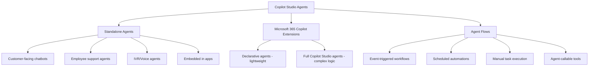
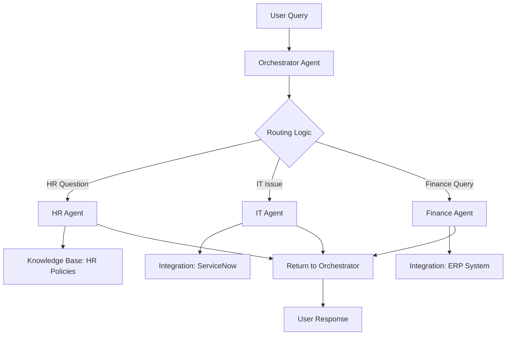
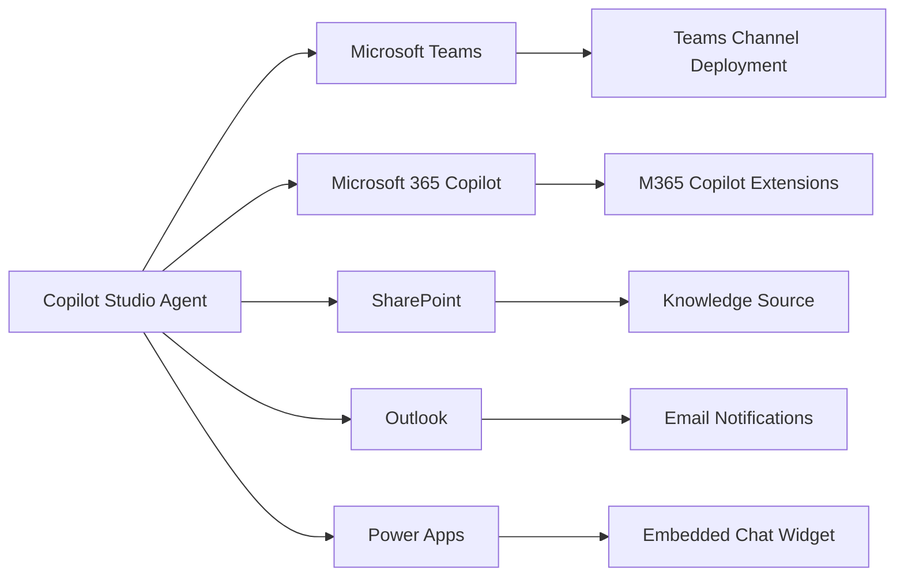
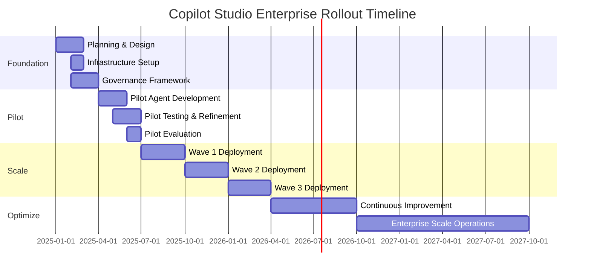
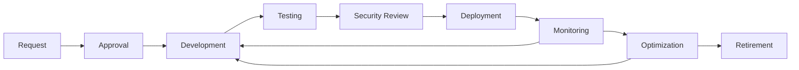

# Microsoft Copilot Studio: Enterprise Architecture and Security Considerations

---
**Lineage**
- **Document Type**: Architecture Analysis
- **Author**: Enterprise Architecture Office
- **Date**: November 17, 2025
- **Status**: Active
- **Version**: 1.0
- **Authority**: Architecture Review Board
- **Classification**: INTERNAL USE
- **Related Standards**: 
  - [AI Platform Standards](../../.standards/architecture/ai-platform.md)
  - [Semantic Governance Ontology Standard](../../.standards/architecture/semantic-governance-ontology-standard.md)
  - [Universal Standards Compliance](../../.standards/ai-agents/universal-standards-compliance.md)
---

## Executive Summary

Microsoft Copilot Studio is a **graphical, low-code platform** that enables organizations to build AI agents and agent flows without requiring data scientists or developers. The platform provides powerful capabilities to create conversational AI experiences, extend Microsoft 365 Copilot, develop autonomous agents, and orchestrate complex workflows using natural language or visual editors.

**Key Findings:**
- ✅ **Platform Maturity**: Azure OpenAI GPT integration provides advanced NLU and conversational capabilities
- ✅ **Enterprise Security**: Comprehensive governance via Power Platform Admin Center, Microsoft Purview, DLP policies, and Customer Lockbox
- ✅ **Accessibility**: Built for accessibility in accordance with Microsoft accessibility guidelines
- ⚠️ **Licensing Complexity**: Requires both tenant license and per-user licenses; see [Microsoft Copilot Studio Licensing Guide](https://go.microsoft.com/fwlink/?linkid=2320995)
- ⚠️ **Data Residency**: Requires careful environment configuration for geographic data compliance
- ⚠️ **Integration Depth**: Heavy integration with Power Platform ecosystem creates architectural dependencies

**Important Medical Disclaimer**: Copilot Studio is not intended or made available as a medical device and should not be used as a substitute for professional medical advice, diagnosis, treatment, or judgment. Organizations creating agents for medical/clinical purposes are solely responsible for appropriate warnings and disclaimers.

## 1. Platform Overview

### 1.1 What is Microsoft Copilot Studio?

Microsoft Copilot Studio is a **graphical, low-code tool for building agents and agent flows**. One of the standout features is its ability to connect to other data sources using either prebuilt or custom plugins, enabling sophisticated logic orchestration.

**Core Capabilities:**

1. **Agent Creation**: Build AI agents that handle complex conversations and autonomously determine actions based on instructions and context
2. **Agent Flows**: Automate repetitive tasks with flows triggered manually, by events/agents, or on a schedule; can be created using natural language or visual editor
3. **Generative AI Integration**: Powered by Azure OpenAI GPT models (same models used in Bing) for natural language understanding and generation
4. **Knowledge Integration**: Link agents to knowledge sources for automatic response generation; optional AI general knowledge access
5. **Topic-Based Conversations**: Create structured conversation flows using topics (portions of conversational threads)
6. **Multi-Channel Deployment**: Publish to websites, mobile apps, Facebook, Microsoft Teams, or any Azure Bot Service channel

**Platform Access:**
- **Web App**: https://copilotstudio.microsoft.com (for IT admins, complex agents, external customer scenarios)
- **Teams App**: Built-in Teams integration (for internal employee scenarios, rapid deployment)

### 1.2 Use Cases

| Use Case Category | Examples | Primary Benefit |
|------------------|----------|----------------|
| **Customer Service** | Chatbots, IVR integration, FAQ automation | 24/7 availability, deflection rates |
| **Employee Support** | IT helpdesk, HR policies, onboarding | Self-service, reduced ticket volume |
| **Process Automation** | Approval workflows, data collection, scheduling | Efficiency, consistency |
| **Microsoft 365 Extension** | Custom Copilot plugins, specialized agents | Enhanced productivity in M365 apps |
| **Knowledge Management** | Document search, policy guidance, expertise location | Information democratization |

### 1.3 Agent Types & Use Case Selection

**When to Extend Microsoft 365 Copilot with an Agent:**
- ✅ Craft your own agent with specific instructions, actions, and domain knowledge
- ✅ Utilize the existing Copilot orchestrator
- ✅ Want a standalone custom version of Microsoft 365 Copilot chat experience

**When to Create a Standalone Agent:**
- ✅ Integrate company data and documents
- ✅ Retrieve real-time data from external APIs
- ✅ Take actions in response to external events
- ✅ Embed in company applications
- ✅ Customized end-to-end solution for web/mobile apps with full branding control
- ✅ Surface agent to other agents as extension
- ✅ Create specialized experiences (customer service chatbot, appointment scheduling, gaming experiences)



## 2. Core Architectural Components

### 2.1 High-Level Architecture

```
┌─────────────────────────────────────────────────────────────────┐
│  User Interface Layer                                           │
│  • Web Chat Widget                                              │
│  • Microsoft Teams                                              │
│  • Microsoft 365 Copilot                                        │
│  • Custom Channels (Website, Mobile App, IVR)                   │
└─────────────────────────────┬───────────────────────────────────┘
                              ↓
┌─────────────────────────────────────────────────────────────────┐
│  Copilot Studio Service Layer (Azure-Hosted)                    │
│  ┌────────────────────────────────────────────────────────────┐ │
│  │  Authoring Canvas                                          │ │
│  │  • Topics & Trigger Phrases  • Variables & Entities        │ │
│  │  • Conversation Flow Design  • Testing & Debugging         │ │
│  └────────────────────────────────────────────────────────────┘ │
│  ┌────────────────────────────────────────────────────────────┐ │
│  │  Generative AI Engine                                      │ │
│  │  • OpenAI GPT-5 Auto/Reasoning  • Prompt Engineering      │ │
│  │  • Generative Answers           • Content Moderation      │ │
│  └────────────────────────────────────────────────────────────┘ │
│  ┌────────────────────────────────────────────────────────────┐ │
│  │  Knowledge Management                                       │ │
│  │  • Dataverse           • SharePoint                        │ │
│  │  • OneDrive            • Public Websites                   │ │
│  │  • Custom Data Sources • RAG (Retrieval Augmented Gen)    │ │
│  └────────────────────────────────────────────────────────────┘ │
│  ┌────────────────────────────────────────────────────────────┐ │
│  │  Action & Integration Layer                                │ │
│  │  • Power Automate Flows    • Custom Connectors            │ │
│  │  • Prebuilt Connectors     • MCP Server Integration       │ │
│  │  • HTTP Requests           • Skills                        │ │
│  └────────────────────────────────────────────────────────────┘ │
└─────────────────────────────┬───────────────────────────────────┘
                              ↓
┌─────────────────────────────────────────────────────────────────┐
│  Power Platform Foundation                                       │
│  • Dataverse (Data Storage)      • Environments                 │
│  • Solutions (ALM)               • DLP Policies                 │
│  • Managed Environments          • Admin Center                 │
└─────────────────────────────┬───────────────────────────────────┘
                              ↓
┌─────────────────────────────────────────────────────────────────┐
│  Azure Infrastructure                                            │
│  • Regional Data Centers         • Azure SQL Database           │
│  • Azure Storage                 • Azure Cognitive Services     │
│  • Application Insights          • Azure Monitor                │
└─────────────────────────────────────────────────────────────────┘
```

### 2.2 Component Breakdown

#### 2.2.1 Authoring Canvas

**Purpose**: Visual, low-code interface for designing agent conversations

**Key Capabilities:**
- **Topics**: Discrete conversation paths triggered by user phrases
- **Trigger Phrases**: Natural language phrases that activate topics (AI-powered matching)
- **Entities**: Data types for extracting structured information (dates, numbers, custom entities)
- **Variables**: Store and pass context between topics
- **Nodes**: Building blocks (questions, messages, actions, conditions, topic redirects)
- **Testing**: Real-time testing in embedded test pane without deployment

**Enterprise Considerations:**
- ✅ Visual authoring reduces development time (claim: 10x faster than code)
- ⚠️ Complex logic may require Power Automate flows or custom code
- ⚠️ Version control through Power Platform Solutions (not Git-native)
- ⚠️ Limited debugging capabilities compared to traditional development

#### 2.2.2 Generative AI Engine

**Purpose**: Provide natural language understanding and generation capabilities

**Key Capabilities:**
- **Azure OpenAI GPT Models**: Powered by latest GPT models (same technology used in Bing)
- **Customized NLU Model**: Topic matching using natural language understanding
- **Generative Answers**: Automatically generate conversational responses from linked knowledge sources
- **AI General Knowledge**: Optional access to information beyond knowledge sources
- **Boosted Conversations**: Generative AI fills gaps when no explicit topic matches
- **Natural Language Authoring**: Create and modify topics by describing needs in plain language
- **Content Safety**: Built-in moderation and content filtering
- **Prompt Engineering**: System instructions, conversation starters, safety instructions

**Architecture Integration:**
```
User Query
    ↓
Topic Matching (Classical NLU)
    ↓
[No Match] → Generative AI Fallback
                ↓
           Knowledge Retrieval (RAG)
                ↓
           Prompt Construction
                ↓
           OpenAI API Call (Azure OpenAI)
                ↓
           Response Generation
                ↓
           Content Moderation
                ↓
           User Response
```

**Enterprise Considerations:**
- ✅ Azure OpenAI GPT provides advanced natural language capabilities
- ✅ Prompts and responses NOT used to train foundation models (data protection)
- ✅ Natural language authoring accelerates agent development (describe changes vs. manual configuration)
- ⚠️ Generative answers may hallucinate; requires grounding in verified knowledge sources
- ⚠️ Latency considerations for real-time scenarios (optimize knowledge sources and prompt size)
- ⚠️ Cost: Generative AI features consume Copilot Credits (use [usage estimator](https://microsoft.github.io/copilot-studio-estimator/))

#### 2.2.3 Knowledge Management Layer

**Purpose**: Provide agents with access to enterprise knowledge for grounded responses

**Supported Knowledge Sources:**
| Source Type | Authentication | Indexing | Latency | Enterprise Suitability |
|------------|----------------|----------|---------|----------------------|
| **Dataverse** | Azure AD | Real-time | Low | ✅ Best for structured data |
| **SharePoint** | Microsoft Graph | Indexed | Medium | ✅ Document repositories |
| **OneDrive** | Microsoft Graph | Indexed | Medium | ⚠️ Personal vs shared content |
| **Public Websites** | None | Crawled | High | ⚠️ Content accuracy concerns |
| **Files (Upload)** | N/A | Embedded | Low | ⚠️ Manual maintenance |
| **Custom** | Various | Via Connector | Variable | ✅ API-based sources |

**Knowledge Processing Pipeline:**
1. **Data Ingestion**: Connect to knowledge source
2. **Chunking**: Break documents into semantic chunks
3. **Embedding**: Generate vector embeddings (Azure OpenAI)
4. **Indexing**: Store in Azure Cognitive Search
5. **Retrieval**: Semantic search on user query
6. **Ranking**: Score and rerank relevant chunks
7. **Prompt Injection**: Include top chunks in GPT prompt
8. **Generation**: Generate grounded response

**Enterprise Considerations:**
- ✅ **Sensitivity Labels**: Respects Microsoft Purview labels on SharePoint/OneDrive
- ✅ **Permission Inheritance**: Users only see data they have access to (security trimming)
- ⚠️ **Dataverse Licensing**: Requires Power Platform licenses for Dataverse access
- ⚠️ **Refresh Latency**: SharePoint/OneDrive index refresh may have delays
- ⚠️ **Token Limits**: Large knowledge bases may hit context window limits

#### 2.2.4 Actions & Integration Layer

**Purpose**: Enable agents to perform actions and integrate with external systems

**Action Types:**

**1. Agent Flows** (Recommended - replacing Power Automate for many scenarios)
- Build with natural language or visual designer
- Can run as standalone automations
- Can be configured as agent-callable tools that return results
- Triggered manually, by events, or on schedule
- Support both simple and complex multi-step orchestrations

**2. Power Automate Flows** (Legacy integration pattern)
```
Agent Topic
    ↓
Call Flow Node
    ↓
Power Automate Flow Execution
    ↓
[Actions: Send Email, Create Record, Call API, etc.]
    ↓
Return Values to Agent
    ↓
Continue Conversation
```

**3. Connectors** (1000+ prebuilt connectors)
- **Microsoft Services**: SharePoint, Teams, Outlook, Dynamics 365, Azure
- **Third-Party Services**: Salesforce, ServiceNow, Zendesk, GitHub, SAP
- **Custom Connectors**: OpenAPI-based custom API wrappers
- Can be added as tools at agent level or within specific topics

**4. MCP (Model Context Protocol) Servers**
- Centralized tool orchestration
- **OAuth Support**: Secure API authentication
- **Dataverse MCP Tools**: create_record, describe_table, list_tables, read_query, update_record, delete_record, search, fetch
- **Billing**: Charged when accessed by agents outside Copilot Studio (free with Dynamics 365 Premium or M365 Copilot USL)
- **Multi-Agent**: Shared tool execution across agents

**5. Computer Use (Preview)**
- New capability to interact with computer interfaces
- Enables agents to perform UI-based tasks

**6. Prompt Nodes**
- Create custom prompts as tools within agent flows
- Flexible integration of generative AI capabilities

**7. Skills (Legacy - being deprecated)**
- Microsoft Bot Framework Skills integration
- Transition to Agent Flows, Connectors, or MCP recommended

**Enterprise Considerations:**
- ✅ **Extensive Integration**: 1000+ connectors cover most enterprise systems
- ✅ **Agent Flows**: Natural language creation simplifies automation development
- ✅ **Security**: OAuth 2.0, API keys, managed identities, certificate-based auth
- ✅ **Audit Trail**: All connector and tool calls logged via Power Platform
- ✅ **Run Tools with User Credentials**: Configure tools to use user's credentials by default for security
- ⚠️ **Licensing**: Premium connectors require additional licenses; MCP tools billed via Copilot Credits
- ⚠️ **DLP Policies**: Connectors and triggers can be blocked/allowed per environment
- ⚠️ **Rate Limits**: External APIs may have throttling

#### 2.2.5 Power Platform Foundation

**Purpose**: Provide runtime, storage, governance, and ALM capabilities

**Core Components:**

**Dataverse**
- **Agent Definitions**: Store agent configuration, topics, variables
- **Conversation History**: Store user interactions (optional, configurable retention)
- **Custom Tables**: Store business data accessed by agents
- **Security**: Row-level security, business units, security roles

**Environments**
- **Isolation**: Separate development, test, production
- **Geographic Regions**: Support data residency requirements
- **Managed Environments**: Enhanced governance, pipelines, weekly digests

**Solutions**
- **ALM**: Package agents as solutions for deployment
- **Dependencies**: Track connector, flow, and dataverse dependencies
- **Versioning**: Version control at solution level (not file-level)

**Admin Center**
- **Tenant Management**: Cross-environment visibility
- **Policy Enforcement**: DLP, authentication, connector restrictions
- **Capacity Monitoring**: Track storage, API calls, AI credits
- **Audit Logs**: Security events, user actions, compliance

**Enterprise Considerations:**
- ✅ **Mature ALM**: Solutions provide structured deployment pipelines
- ✅ **Governance**: Comprehensive controls via Admin Center
- ⚠️ **Dataverse Cost**: Storage and API calls consume capacity
- ⚠️ **Environment Strategy**: Requires thoughtful environment architecture
- ⚠️ **Solution Complexity**: Large solutions can be cumbersome to manage

### 2.3 Multi-Agent Architecture

**Purpose**: Coordinate specialized agents for complex scenarios



**Handoff Patterns:**
- **Topic-Based Handoff**: Route based on topic classification
- **Entity-Based Handoff**: Route based on extracted entities
- **Explicit Handoff**: User explicitly requests specific agent
- **Fallback Handoff**: Escalate to human or specialized agent

**Enterprise Considerations:**
- ✅ **Specialization**: Separate agents for different domains/expertise
- ✅ **Scalability**: Distribute load across agents
- ⚠️ **Complexity**: Requires careful orchestration design
- ⚠️ **Context Preservation**: Must maintain conversation context across handoffs

## 3. Security Architecture

### 3.1 Security Layers

```
┌─────────────────────────────────────────────────────────────────┐
│  Layer 1: Identity & Authentication                             │
│  • Azure AD / Entra ID (with certificate support)               │
│  • Multi-Factor Authentication (MFA)                            │
│  • Conditional Access Policies                                  │
│  • OAuth 2.0 for Users and Connectors                           │
│  • User Credential Configuration for Tools                      │
└─────────────────────────────────────────────────────────────────┘
                              ↓
┌─────────────────────────────────────────────────────────────────┐
│  Layer 2: Authorization & Access Control                        │
│  • Role-Based Access Control (RBAC) - Dataverse                 │
│  • Environment Security Roles                                   │
│  • Agent-Level Permissions (Maker, User, Admin)                 │
│  • Security Trimming (knowledge sources)                        │
│  • Agent Runtime Protection Status Monitoring                   │
└─────────────────────────────────────────────────────────────────┘
                              ↓
┌─────────────────────────────────────────────────────────────────┐
│  Layer 3: Data Protection                                       │
│  • Encryption at Rest (Azure Storage, SQL)                      │
│  • Encryption in Transit (TLS 1.2+)                             │
│  • Customer-Managed Encryption Keys (CMK)                       │
│  • Data Loss Prevention (DLP) Policies                          │
│  • Sensitivity Labels (Microsoft Purview - SharePoint visible)  │
│  • Customer Lockbox (secure data access)                        │
└─────────────────────────────────────────────────────────────────┘
                              ↓
┌─────────────────────────────────────────────────────────────────┐
│  Layer 4: Governance & Compliance                               │
│  • Data Residency (Geographic Regions)                          │
│  • EU Data Boundary (EUDB) Compliance                           │
│  • GDPR, CCPA, ISO 27001, SOC 1/2/3                            │
│  • Maker Audit Logs (Microsoft Purview)                         │
│  • Agent Activity Monitoring (Microsoft Sentinel)               │
│  • Automatic Security Scan (pre-publish warnings)               │
│  • Content Moderation & Safety                                  │
└─────────────────────────────────────────────────────────────────┘
                              ↓
┌─────────────────────────────────────────────────────────────────┐
│  Layer 5: Network & Infrastructure                              │
│  • IP Firewall Rules                                            │
│  • Tenant Isolation Boundaries                                  │
│  • Environment Routing (safe maker spaces)                      │
│  • Virtual Network Service Endpoints                            │
│  • Azure DDoS Protection                                        │
└─────────────────────────────────────────────────────────────────┘
```

### 3.2 Authentication Architecture

#### 3.2.1 User Authentication Options

| Authentication Method | Use Case | Security Level | Implementation Complexity |
|----------------------|----------|----------------|--------------------------|
| **No Authentication** | Public websites, FAQs | Low | Simple |
| **Manual (username only)** | Basic identification | Low | Simple |
| **Azure AD / Entra ID** | Enterprise users | High | Medium |
| **Azure AD with Certificate** | High-security scenarios | Very High | High |
| **OAuth 2.0 (Generic)** | Third-party identity providers | High | Medium-High |
| **Direct Line Authentication** | Custom channels | High | High |

**Enterprise Recommendation**: **Azure AD / Entra ID** (with certificate support for high-security scenarios) for all internal agents

**Latest Capability**: Entra ID manual authentication now supports certificate provider configuration for enhanced security.

**Configuration Flow:**
```
1. Register Azure AD App
   ↓
2. Configure Redirect URIs
   ↓
3. Set API Permissions (CopilotStudio.Copilots.Invoke)
   ↓
4. Grant Admin Consent
   ↓
5. Configure in Copilot Studio (Client ID, Tenant ID)
   ↓
6. Test Authentication Flow
```

#### 3.2.2 Connector Authentication

**Authentication Methods:**
- **API Key**: Simple key-based authentication
- **OAuth 2.0**: Authorization code flow (most common)
- **Windows Authentication**: For on-premises systems
- **Basic Authentication**: Username/password (not recommended)
- **Certificate-Based**: For high-security APIs

**Best Practice**: Use **OAuth 2.0 with service accounts** (not user delegation) for production connectors

### 3.3 Data Protection

#### 3.3.1 Encryption

**At Rest:**
- **Azure Storage**: AES-256 encryption (Microsoft-managed keys default)
- **Azure SQL Database**: Transparent Data Encryption (TDE)
- **Dataverse**: Encrypted via SQL TDE
- **Customer-Managed Keys**: Available via Azure Key Vault (premium feature)

**In Transit:**
- **TLS 1.2+**: All HTTP communications encrypted
- **Azure Front Door**: SSL/TLS termination at edge
- **Certificate Pinning**: For custom channels (optional)

#### 3.3.2 Data Loss Prevention (DLP)

**Granular Controls:**

| DLP Policy Scope | Controls | Enforcement Point |
|-----------------|----------|------------------|
| **Tenant-Level** | Connector categories (Business, Non-Business, Blocked) | All environments |
| **Environment-Level** | Per-environment overrides | Specific environments |
| **Connector-Level** | Specific actions allowed/blocked | Individual connectors |
| **Endpoint Filtering** | URL/IP restrictions | HTTP requests |

**Example DLP Policy:**
```yaml
Policy: Prevent Customer Data Exfiltration
Scope: Production Environment
Rules:
  - Block HTTP requests to external domains
  - Allow only approved connectors (SharePoint, Dataverse, Teams)
  - Block premium connectors (Twitter, Gmail) unless approved
  - Enforce endpoint filtering: allow only *.bnz.co.nz
Violations: Block agent publishing, notify admin
```

**Enterprise Considerations:**
- ✅ **Guardrails over Gates**: Microsoft recommends granular DLP over blanket bans
- ✅ **Audit Trail**: DLP violations logged in Admin Center
- ⚠️ **Complexity**: Requires ongoing policy maintenance
- ⚠️ **User Impact**: Overly restrictive policies hinder productivity

#### 3.3.3 Sensitivity Labels (Microsoft Purview)

**Integration:**
- Agents respect sensitivity labels on SharePoint/OneDrive documents
- Knowledge sources filtered based on user's label access
- **Visibility**: Agent makers and users can see the highest sensitivity label applied to sources used in responses
- **Individual Reference Labels**: Chat displays individual reference labels for each source
- Labels can be applied to agent conversations (optional)

**Label Hierarchy:**
```
Public
  ↓
Internal
  ↓
Confidential
  ↓
Highly Confidential
```

**Enforcement:**
- Users without "Confidential" access cannot see those documents in agent responses
- Prevents accidental disclosure of sensitive information
- Transparency for users about data sensitivity in responses

### 3.4 Geographic Data Residency

#### 3.4.1 Supported Regions

Microsoft Copilot Studio available in:
- **North America**: United States, Canada
- **Europe**: UK, France, Germany, Switzerland, Norway
- **Asia Pacific**: Australia, Japan, India, Singapore
- **Government**: US Government Community Cloud (GCC), GCC High

**EU Data Boundary (EUDB) Compliance:**
- Tenants with EU/EFTA billing address
- All environments created within EU regions
- Data stored and processed within EU Data Boundary

#### 3.4.2 Data Flows Across Regions

**Scenario 1: Agent in EU, Knowledge in US**
```
User (EU) → Agent (EU Environment)
                ↓
           [Cross-Region Call]
                ↓
      SharePoint (US) → Data Replicated to EU Cache
                ↓
           Agent Response (EU)
```

**Scenario 2: Multi-Region Connectors**
- **Microsoft Services**: Data stays within tenant region (generally)
- **External Services**: Data flows to external system's region
- **Responsibility Matrix**:
  - Microsoft Services: Microsoft handles compliance
  - External Services: Customer (agent maker) responsible

**Enterprise Considerations:**
- ✅ **Regional Choice**: Allows compliance with local data laws
- ⚠️ **Generative AI**: OpenAI models may process data outside region (configurable)
- ⚠️ **Connector Data Flows**: External connectors may cross boundaries
- ⚠️ **Environment Strategy**: Requires geographic environment planning

### 3.5 Audit & Monitoring

#### 3.5.1 Audit Logs

**Available via:**
- **Power Platform Admin Center**: Agent usage, DLP violations, environment changes, agent inventory
- **Microsoft Purview**: Maker audit logs for full visibility into maker actions
- **Microsoft Sentinel**: SIEM integration for agent activity monitoring and alerts
- **Application Insights**: Performance and telemetry data

**Logged Events:**
- Agent creation, modification, deletion (maker audit logs)
- Agent publishing and deployment actions
- User interactions (if configured)
- Connector and tool calls and responses
- DLP policy violations and inactive agents (tenant hygiene reports)
- Authentication failures
- Knowledge source access
- Tenant-wide usage and inventory (API support available)

**New Capabilities:**
- **Maker Audit Logs**: Full visibility into maker actions via Microsoft Purview
- **Agent Activity Monitoring**: Monitor and alert on agent activities through Microsoft Sentinel
- **Tenant Hygiene Reports**: Identify DLP violations and inactive agents

#### 3.5.2 Monitoring & Analytics

**Built-In Analytics:**
- **Engagement Metrics**: Sessions, messages, users
- **Topic Performance**: Trigger rates, completion rates
- **Abandonment Analysis**: Where users drop off
- **CSAT (Customer Satisfaction)**: Optional surveys

**Application Insights Integration:**
- Real-time telemetry streaming
- Custom dashboards and alerts
- Performance debugging
- Error tracking

**Enterprise Considerations:**
- ✅ **Comprehensive Logging**: Satisfies audit requirements
- ✅ **SIEM Integration**: Sentinel connector available
- ⚠️ **PII Handling**: User messages may contain sensitive data
- ⚠️ **Retention Policies**: Configure appropriate data retention

## 4. Enterprise Deployment Considerations

### 4.1 Environment Strategy

**Recommended Approach:**

```
┌─────────────────────────────────────────────────────────────┐
│  Tenant: BNZ                                                 │
├─────────────────────────────────────────────────────────────┤
│  Environment: DEV (New Zealand)                              │
│  Purpose: Agent development and testing                      │
│  DLP: Relaxed (development tools allowed)                    │
│  Users: Makers, developers                                   │
├─────────────────────────────────────────────────────────────┤
│  Environment: TEST (New Zealand)                             │
│  Purpose: User acceptance testing                            │
│  DLP: Moderate (production-like constraints)                 │
│  Users: Business testers, UAT team                           │
├─────────────────────────────────────────────────────────────┤
│  Environment: PROD (New Zealand)                             │
│  Purpose: Live agents serving customers/employees            │
│  DLP: Strict (only approved connectors)                      │
│  Users: End users, minimal makers                            │
│  Managed Environment: Yes (enhanced governance)              │
└─────────────────────────────────────────────────────────────┘
```

**Best Practices:**
- ✅ **Separate Environments**: Prevent development changes impacting production
- ✅ **Managed Environments**: Use for production (weekly digests, usage insights, pipelines)
- ✅ **Geographic Alignment**: Ensure environments in correct region for data residency
- ✅ **Naming Conventions**: Consistent environment naming (e.g., BNZ-CopilotStudio-PROD-NZ)

### 4.2 Application Lifecycle Management (ALM)

**Deployment Pipeline:**

```
┌────────────────┐      ┌────────────────┐      ┌────────────────┐
│   DEV ENV      │      │   TEST ENV     │      │   PROD ENV     │
│                │      │                │      │                │
│ 1. Create Agent├─────►│ 3. Import      ├─────►│ 5. Import      │
│ 2. Export as   │      │    Solution    │      │    Solution    │
│    Solution    │      │ 4. UAT Testing │      │ 6. Go Live     │
└────────────────┘      └────────────────┘      └────────────────┘
```

**Solution Components:**
- Agent definition (topics, entities, variables)
- Flows (Power Automate)
- Custom connectors
- Dataverse tables (optional)
- Environment variables (for configuration)

**Deployment Options:**

1. **Manual Export/Import** (GUI-based)
   - Simple for small agents
   - Limited version control
   
2. **Power Platform Pipelines** (Recommended)
   - Automated deployment workflows
   - Approval gates
   - Deployment history
   
3. **Azure DevOps / GitHub Actions** (Advanced)
   - Power Platform CLI (`pac` tool)
   - Full CI/CD automation
   - Integration with Git

**Enterprise Considerations:**
- ✅ **Solutions**: Mandatory for production deployments
- ✅ **Environment Variables**: Avoid hardcoding environment-specific values
- ⚠️ **Dependencies**: Flows and connectors must exist in target environment
- ⚠️ **Version Control**: Solutions are XML-based, not file-based (Git diff challenging)

### 4.3 Capacity Planning

#### 4.3.1 Licensing Models

**Important**: For the most complete and up-to-date licensing information, refer to the [Microsoft Copilot Studio Licensing Guide](https://go.microsoft.com/fwlink/?linkid=2320995).

**Required Licenses:**
1. **Tenant License** (Copilot Studio): Acquired by tenant administrator, cannot be assigned to individual users
2. **User License** (Copilot Studio User License): Per-user license for each person creating/managing agents

| License Type | What's Included | Cost Model | Best For |
|-------------|-----------------|------------|----------|
| **Copilot Studio** | Tenant-level capacity | Tenant license | Organization-wide enablement |
| **Copilot Studio User License** | Per-maker access | Per user/month | Individual makers/developers |
| **Power Apps Premium** | Limited Copilot Studio capacity | Per app/user | Apps with embedded agents |
| **Microsoft 365 Copilot** | M365 Copilot + agent building | Per user/month | M365 extensions only |

**Capacity Units:**
- **Billed Sessions**: Pooled across entire tenant
- **Copilot Credits**: Consumption-based for generative AI (use [usage estimator](https://microsoft.github.io/copilot-studio-estimator/))
- **Dataverse Storage**: Agent data, conversation history
- **Dataverse API Calls**: Connector and database operations

**Key Notes:**
- ✅ **End users don't need licenses**: Only makers need licenses; users can interact with published agents freely
- ⚠️ **Guest users cannot access**: Tenant guest users will not be able to access Copilot Studio
- ⚠️ **Volume Licensing**: If purchased outside Microsoft 365 Admin Center, acquire both tenant and user licenses in same transaction
- ✅ **Trial Available**: Users can try Copilot Studio for limited time (admins can control self-service signup via AllowAdHocSubscriptions flag)

#### 4.3.2 Capacity Monitoring

**Tracked Metrics:**
- **Billed Sessions**: Tenant-level pooled capacity (not reported at tenant level, visible per agent)
- **Copilot Credit Consumption**: Monitor generative AI costs using [Microsoft Copilot Studio agent usage estimator](https://microsoft.github.io/copilot-studio-estimator/)
- **Connector Calls**: API rate limit tracking
- **Storage Growth**: Dataverse database size

**Usage Estimator Features:**
- Select agent type, traffic volume, orchestration complexity
- Choose knowledge source types and tools
- Forecast Copilot Credits volume
- Assess potential consumption impacts

**Optimization Strategies:**
- Use classical topics before generative fallback (cheaper)
- Optimize knowledge sources (reduce chunking, limit scope)
- Implement conversation limits (max messages per session)
- Archive old conversation history
- Use service accounts for connectors (not user delegation)
- Monitor capacity via [quotas and limits documentation](https://learn.microsoft.com/en-us/microsoft-copilot-studio/requirements-quotas)

**Enterprise Considerations:**
- ⚠️ **Licensing Complexity**: Tenant + user licenses create budgeting challenges
- ⚠️ **Consumption Model**: Copilot Credits consumption varies by usage patterns
- ✅ **Capacity Pooling**: Tenant-level capacity pooled across all agents
- ✅ **Forecasting Tool**: Usage estimator helps predict costs before deployment
- ⚠️ **Shared Capacity**: Power Platform capacity shared across all apps

### 4.4 Disaster Recovery & Business Continuity

**Backup Strategy:**

| Component | Backup Method | Recovery Time | Data Loss |
|-----------|--------------|---------------|-----------|
| **Agent Definitions** | Solutions (versioned) | Minutes | None (stored in Git) |
| **Dataverse Tables** | Dataverse backup/restore | Hours | < 24 hours |
| **Conversation History** | Azure Blob Storage export | Hours-Days | Depends on export frequency |
| **Flows** | Solutions | Minutes | None |

**High Availability:**
- **Azure SLA**: 99.9% uptime for Copilot Studio service
- **Multi-Region**: Deploy agents to multiple regions (requires licensing)
- **Failover**: No automatic failover; requires manual environment switching

**Enterprise Considerations:**
- ✅ **Solution Exports**: Regular exports provide agent backups
- ⚠️ **No Native HA**: No automatic failover between environments
- ⚠️ **Conversation Data**: Consider retention policy (not critical for recovery)
- ⚠️ **RTO/RPO**: Recovery depends on manual solution import process

### 4.5 Governance Framework

**Recommended Governance Model:**

```
┌─────────────────────────────────────────────────────────────┐
│  Governance Layer 1: Tenant-Wide Policies                   │
│  • DLP Policies (connector restrictions)                    │
│  • Tenant Settings (generative AI enable/disable)           │
│  • Managed Environments (mandatory for production)          │
│  • Data Residency (region restrictions)                     │
└─────────────────────────────────────────────────────────────┘
                              ↓
┌─────────────────────────────────────────────────────────────┐
│  Governance Layer 2: Environment-Level Controls             │
│  • Environment-specific DLP overrides                       │
│  • Security roles (maker, user, admin)                      │
│  • Sharing permissions                                       │
│  • Deployment pipelines                                      │
└─────────────────────────────────────────────────────────────┘
                              ↓
┌─────────────────────────────────────────────────────────────┐
│  Governance Layer 3: Agent-Level Governance                 │
│  • Authentication requirements                               │
│  • Knowledge source approvals                                │
│  • Connector usage (approved list)                          │
│  • Content moderation                                        │
│  • Testing & validation                                      │
└─────────────────────────────────────────────────────────────┘
                              ↓
┌─────────────────────────────────────────────────────────────┐
│  Governance Layer 4: Continuous Monitoring                  │
│  • Center of Excellence (CoE) Starter Kit                   │
│  • Usage analytics & dashboards                             │
│  • Compliance audits                                         │
│  • Inactive agent cleanup                                    │
└─────────────────────────────────────────────────────────────┘
```

**Center of Excellence (CoE) Starter Kit:**
- **Inventory**: Discover all agents across tenant
- **Compliance**: Identify DLP violations
- **Hygiene**: Find inactive or orphaned agents
- **Analytics**: Usage trends, adoption metrics
- **Automation**: Automated compliance checks

**Enterprise Considerations:**
- ✅ **Guardrails Over Gates**: Enable innovation with safety controls
- ✅ **CoE Kit**: Essential for enterprise governance at scale
- ⚠️ **Change Management**: Governance policies require organizational buy-in
- ⚠️ **Maker Enablement**: Balance security with maker productivity

## 5. Integration Architecture

### 5.1 Microsoft 365 Integration

**Integration Points:**



**Microsoft 365 Copilot Extensions:**

**Declarative Agents** (Lightweight)
- Created directly in Microsoft 365 Copilot
- Describe intent, add knowledge, publish
- Limited customization, but fast to deploy

**Copilot Studio Agents** (Full-Featured)
- Complex logic, workflows, integrations
- Published to Microsoft 365 Copilot as plugins
- Appear in Microsoft 365 Copilot agent picker

**Governance:**
- **Microsoft 365 Admin Center**: Controls agent sharing across tenant (generally available)
- Admins can approve/block specific agents created in Microsoft 365 Copilot
- Integration with Azure AD groups for access control
- **New Control**: Stronger governance over how agents created in M365 Copilot are shared tenant-wide

### 5.2 Power Platform Integration

**Deep Integration:**

| Component | Integration | Benefit |
|-----------|-------------|---------|
| **Power Apps** | Embed agent as chat widget | Conversational interface in apps |
| **Power Automate** | Call flows from agent topics | Complex automation, approvals |
| **Power BI** | No native integration | Could trigger reports via flow |
| **Dataverse** | Native data storage & retrieval | Structured data operations |
| **AI Builder** | Entity extraction, sentiment analysis | Enhanced AI capabilities |

**Connector Ecosystem:**
- 1000+ prebuilt connectors (Salesforce, ServiceNow, SAP, etc.)
- Custom connectors (OpenAPI-based)
- On-premises data gateway for internal systems

### 5.3 Azure Services Integration

**Azure Cognitive Services:**
- **Speech Services**: Text-to-speech, speech-to-text for IVR
- **Language Understanding**: Legacy (migrating to GPT-based)
- **Content Moderation**: Toxicity detection

**Azure Bot Service:**
- Direct Line API for custom channels
- Webchat control for websites
- Bot Framework SDK for advanced scenarios

**Application Insights:**
- Telemetry streaming
- Custom dashboards
- Performance monitoring

**Azure OpenAI Service:**
- GPT models hosted in Azure
- Enterprise controls (managed identity, VNET)
- Data residency compliance

### 5.4 External System Integration Patterns

**Pattern 1: API-Based Integration (Connectors)**
```
Agent → Connector → External API → Response → Agent
Example: Retrieve customer data from Salesforce
```

**Pattern 2: Event-Driven (Power Automate)**
```
External Event → Power Automate Trigger → Agent Notification
Example: ServiceNow ticket created → Notify agent user
```

**Pattern 3: Embedded Agent (iFrame/Webchat)**
```
External Website → Embed Agent Widget → Direct Line API → Copilot Studio
Example: Customer-facing website chatbot
```

**Pattern 4: Multi-Agent Orchestration**
```
User → Orchestrator Agent → [Azure AI Agent, Copilot Studio Agent, Custom Agent]
Example: Complex customer service scenario with specialized agents
```

## 6. Architectural Risk Assessment

### 6.1 Technical Risks

| Risk | Impact | Probability | Mitigation |
|------|--------|-------------|------------|
| **Vendor Lock-In** | High | High | Abstract integration layer, export solutions regularly |
| **Generative AI Hallucinations** | High | Medium | Ground responses in verified knowledge, human review |
| **Platform Stability (PVA Legacy)** | Medium | Low | Monitor Microsoft roadmap, plan migration path |
| **Capacity Overruns** | Medium | Medium | Implement usage monitoring, set message limits |
| **Data Residency Violations** | High | Low | Strict environment policies, audit data flows |
| **DLP Bypass** | High | Low | Layered DLP policies, regular audits |
| **Connector Vulnerabilities** | Medium | Medium | Use only verified connectors, regular security reviews |

### 6.2 Operational Risks

| Risk | Impact | Mitigation |
|------|--------|------------|
| **Skill Gap** | Medium | Training programs, CoE establishment |
| **Sprawl** | High | Governance policies, CoE monitoring |
| **Poor Agent Quality** | High | Testing standards, QA process |
| **Knowledge Staleness** | Medium | Automated refresh processes |
| **Licensing Complexity** | Medium | Clear guidelines, centralized procurement |
| **Change Management** | Medium | Phased rollout, stakeholder engagement |

### 6.3 Security Risks

| Risk | Impact | Mitigation |
|------|--------|------------|
| **Unauthorized Data Access** | High | Security trimming, RBAC, audit logs |
| **PII Exposure** | High | DLP policies, content moderation |
| **Credential Theft** | High | MFA, service accounts, key rotation |
| **Malicious Prompt Injection** | Medium | Content safety filters, input validation |
| **Insider Threat** | Medium | Audit logs, least privilege access |

## 7. Enterprise Readiness Assessment

### 7.1 Readiness Criteria

| Criterion | Status | Notes |
|-----------|--------|-------|
| **Security & Compliance** | ✅ Ready | Comprehensive controls, certifications, Customer Lockbox |
| **Data Residency** | ✅ Ready | NZ region support, EUDB compliance |
| **Integration Capability** | ✅ Ready | Extensive connector ecosystem, MCP servers, agent flows |
| **Governance Tools** | ✅ Ready | Enhanced: Maker audit logs (Purview), Sentinel integration, security scan |
| **Scalability** | ✅ Ready | Azure-hosted, high availability |
| **Accessibility** | ✅ Ready | Built per Microsoft accessibility guidelines |
| **Cost Predictability** | ⚠️ Caution | Tenant + user licensing; use estimator for forecasting |
| **Disaster Recovery** | ⚠️ Caution | No native HA, manual recovery process |
| **Platform Maturity** | ✅ Ready | Azure OpenAI GPT integration, natural language authoring |

### 7.2 Recommendations for BNZ

**Enable as Enterprise Service: YES, with Conditions**

**Phase 1: Pilot (3-6 months)**
- ✅ Deploy single use case (e.g., IT helpdesk internal FAQ agent)
- ✅ Establish governance framework (DLP, environments, CoE Kit)
- ✅ Train pilot team on development, testing, deployment
- ✅ Validate data residency compliance (NZ environment)
- ✅ Assess licensing costs vs. value delivered

**Phase 2: Expand (6-12 months)**
- ✅ Onboard additional use cases (HR, customer service)
- ✅ Integrate with M365 Copilot (extend with custom agents)
- ✅ Establish ALM pipelines (Power Platform Pipelines)
- ✅ Implement monitoring & analytics (Application Insights)
- ✅ Conduct security audit (penetration testing, compliance review)

**Phase 3: Scale (12+ months)**
- ✅ Enable broader maker community (citizen developers)
- ✅ Multi-agent architectures for complex scenarios
- ✅ Advanced integrations (Azure AI, external systems)
- ✅ Continuous optimization (cost, performance, quality)

### 7.3 Pre-Requisites for Enablement

**Technical Pre-Requisites:**
- [ ] Power Platform tenant with NZ environment provisioned
- [ ] **Tenant License** (Copilot Studio) acquired from Microsoft 365 Admin Center
- [ ] **User Licenses** (Copilot Studio User License) acquired and assigned via Microsoft 365 Admin Center or Entra ID groups
- [ ] Power Platform Admin Center access configured
- [ ] Azure AD / Entra ID authentication enabled (with certificate support for high-security scenarios)
- [ ] DLP policies defined and tested (including autonomous agent triggers)
- [ ] Managed Environments configured for production
- [ ] Environment routing configured for maker safety
- [ ] Dataverse capacity allocated (database, storage)
- [ ] Microsoft Purview configured for maker audit logs
- [ ] Microsoft Sentinel integration for agent activity monitoring
- [ ] Application Insights workspace created
- [ ] CoE Starter Kit deployed

**Governance Pre-Requisites:**
- [ ] Center of Excellence team established
- [ ] Maker welcome message configured (privacy & compliance requirements)
- [ ] Maker training program defined ([Agent in a Day](https://aka.ms/nextAgIAD) workshops recommended)
- [ ] Agent development standards documented
- [ ] Automatic security scan understood and configured (pre-publish warnings)
- [ ] Testing & QA process established
- [ ] Deployment approval workflow defined
- [ ] Security & compliance review process (including Purview audit log monitoring)
- [ ] **Licensing strategy**: Tenant + user licenses budgeted; capacity forecasting via usage estimator
- [ ] Trial policy defined (AllowAdHocSubscriptions flag setting)

**Organizational Pre-Requisites:**
- [ ] Executive sponsorship secured
- [ ] Use case prioritization completed
- [ ] Cross-functional team assembled (IT, security, business)
- [ ] Change management plan developed
- [ ] User communication strategy defined

## 8. Competitive Analysis

### 8.1 Alternative Platforms

| Platform | Strengths | Weaknesses | BNZ Fit |
|----------|-----------|------------|---------|
| **Microsoft Copilot Studio** | M365 integration, Power Platform ecosystem | Complex licensing, PVA legacy | ✅ Strong (M365 shop) |
| **Amazon Lex** | AWS integration, predictable pricing | Less low-code, weaker M365 integration | ⚠️ Moderate (if AWS-heavy) |
| **Google Dialogflow CX** | Advanced NLU, Google Workspace integration | Less enterprise governance | ⚠️ Moderate (if Google Workspace) |
| **Custom (LangChain, n8n)** | Full control, no vendor lock-in | High development cost, no low-code | ❌ Low (requires expertise) |
| **ServiceNow Virtual Agent** | Deep ServiceNow integration | Limited outside ServiceNow | ⚠️ Niche (ITSM only) |

### 8.2 Decision Factors

**Choose Copilot Studio if:**
- ✅ Heavy Microsoft 365 / Power Platform investment
- ✅ Desire for low-code / citizen developer enablement
- ✅ Need rapid prototyping and iteration
- ✅ Require extensive connector ecosystem

**Consider Alternatives if:**
- ⚠️ Need full code control and portability
- ⚠️ Require predictable, consumption-based pricing
- ⚠️ Have specialized AI/ML capabilities not in Copilot Studio
- ⚠️ Need cross-cloud / hybrid architecture

## 9. Conclusion

Microsoft Copilot Studio is a **mature, enterprise-ready platform** for building conversational AI agents and agent flows, with **comprehensive security, governance, and integration capabilities**. The platform's graphical, low-code approach and deep integration with Microsoft 365 and Power Platform makes it **accessible to non-technical users while providing sophisticated capabilities for complex scenarios**.

**Key Strengths:**
- ✅ **Graphical low-code authoring** with natural language capabilities accelerates development
- ✅ **Enhanced security**: Maker audit logs (Purview), Sentinel integration, automatic security scan, certificate auth
- ✅ **Agent Flows**: Natural language or visual creation of automations
- ✅ **Enterprise governance**: DLP, sensitivity labels (visible), Customer Lockbox, environment routing
- ✅ **Extensive integration**: 1000+ connectors, MCP servers, computer use (preview)
- ✅ **Accessibility**: Built per Microsoft accessibility guidelines
- ✅ **Azure OpenAI GPT** integration for advanced NLU and conversational AI

**Key Concerns:**
- ⚠️ **Licensing complexity**: Requires both tenant license + user licenses; forecast capacity with usage estimator
- ⚠️ **No native high availability** / disaster recovery (manual solution import recovery)
- ⚠️ **Generative AI quality**: Requires grounding in verified knowledge sources to prevent hallucinations
- ⚠️ **Guest user limitation**: Tenant guest users cannot access Copilot Studio

**BNZ Recommendation:**
**PROCEED with phased adoption**, starting with low-risk internal use case (IT/HR FAQ agent), establish governance framework, validate compliance, then expand based on proven value delivery.

---

## 10. References

### 10.1 Microsoft Documentation
- [Microsoft Copilot Studio Overview](https://learn.microsoft.com/en-us/microsoft-copilot-studio/)
- [What is Copilot Studio?](https://learn.microsoft.com/en-us/microsoft-copilot-studio/fundamentals-what-is-copilot-studio)
- [Copilot Studio Security and Governance](https://learn.microsoft.com/en-us/microsoft-copilot-studio/security-and-governance)
- [Licensing Requirements](https://learn.microsoft.com/en-us/microsoft-copilot-studio/requirements-licensing)
- [Microsoft Copilot Studio Licensing Guide](https://go.microsoft.com/fwlink/?linkid=2320995)
- [Microsoft Copilot Studio Usage Estimator](https://microsoft.github.io/copilot-studio-estimator/)
- [Geographic Data Residency](https://learn.microsoft.com/en-us/microsoft-copilot-studio/geo-data-residency)
- [Power Platform Architecture](https://learn.microsoft.com/en-us/power-platform/architecture/)
- [Copilot Studio Reference Architectures](https://learn.microsoft.com/en-us/power-platform/architecture/products/copilot-studio)
- [Agent Flows Overview](https://learn.microsoft.com/en-us/microsoft-copilot-studio/flows-overview)
- [MCP Server Integration](https://learn.microsoft.com/en-us/microsoft-copilot-studio/mcp-add-existing-server-to-agent)

### 10.2 Related BNZ Standards
- [AI Platform Standards](../../.standards/architecture/ai-platform.md)
- [Semantic Governance Ontology Standard](../../.standards/architecture/semantic-governance-ontology-standard.md)
- [AI Capability Model](../../knowledge-base/strategic/ai-capability-model.md)
- [Enterprise Architecture Metamodel Standards](../../.standards/metamodel/enterprise-architecture-metamodel-standards.md)

### 10.3 External Resources
- [Microsoft Trust Center - Copilot Studio Compliance](https://servicetrust.microsoft.com/)
- [Power Platform Admin Center](https://admin.powerplatform.microsoft.com/)
- [Microsoft 365 Admin Center](https://admin.microsoft.com/)
- [Center of Excellence (CoE) Starter Kit](https://learn.microsoft.com/en-us/power-platform/guidance/coe/starter-kit)
- [Microsoft 365 Copilot Adoption](https://adoption.microsoft.com/copilot/)
- [Copilot Studio Adoption Resources](https://aka.ms/adoptcopilotstudio)
- [Agent in a Day Workshops](https://aka.ms/nextAgIAD)
- [Copilot Studio Scenarios](https://adoption.microsoft.com/ai-agents/copilot-studio/#scenarios)
- [Copilot Studio Blog](https://aka.ms/CopilotStudioBlog)
- [Mastering Copilot Studio](https://learn.microsoft.com/en-us/shows/mastering-copilot-studio)
- [Copilot Learning Hub](https://learn.microsoft.com/en-us/copilot)
- [AI Learning Hub](https://learn.microsoft.com/en-us/ai)

---

## 11. Comprehensive Deployment & Enterprise Rollout Plan

### 11.1 Executive Summary

This deployment plan outlines a phased, risk-managed approach to rolling out Microsoft Copilot Studio across the enterprise. The plan balances rapid value delivery with robust governance, ensuring security, compliance, and scalability from day one.

**Timeline**: 18-24 months from initiation to full enterprise scale
**Investment**: Tenant licensing + user licensing + infrastructure costs
**Success Criteria**: Agent adoption, deflection rates, user satisfaction, cost savings

---

### 11.2 Deployment Phases Overview



---

### 11.3 Phase 0: Foundation & Planning (Months 1-3)

#### 11.3.1 Objectives
- Establish governance framework
- Secure executive sponsorship and budget
- Build core team and capabilities
- Configure infrastructure
- Define success metrics

#### 11.3.2 Activities

**Week 1-2: Executive Alignment**
- [ ] Present business case to executive leadership
- [ ] Secure executive sponsor (C-level or direct report)
- [ ] Establish steering committee (IT, Security, Business, Compliance)
- [ ] Define strategic objectives and KPIs
- [ ] Allocate budget for licensing, resources, training

**Week 3-4: Team Formation**
- [ ] Recruit Center of Excellence (CoE) team:
  - CoE Lead (1 FTE)
  - Platform Administrators (2 FTE)
  - Solution Architects (2 FTE)
  - Security Specialist (0.5 FTE)
  - Compliance Specialist (0.5 FTE)
- [ ] Identify pilot business unit champions (3-5 people)
- [ ] Engage Microsoft Customer Success team or partner

**Week 5-8: Governance Framework Design**
- [ ] Define environment strategy (DEV, TEST, PROD per region)
- [ ] Draft DLP policies (connectors, endpoints, data protection)
- [ ] Establish security baseline:
  - Authentication requirements (Azure AD with MFA)
  - Certificate-based auth for high-security scenarios
  - Encryption standards (CMK if required)
  - Audit logging configuration
- [ ] Create agent development standards:
  - Naming conventions
  - Testing requirements
  - Documentation templates
  - Quality gates
- [ ] Define ALM process:
  - Solution packaging standards
  - Deployment approval workflow
  - Change management process
- [ ] Establish capacity governance:
  - Session quotas per agent
  - Copilot Credit budgets
  - Cost allocation model

**Week 9-12: Infrastructure Setup**
- [ ] Acquire licenses:
  - Copilot Studio Tenant License (via M365 Admin Center)
  - Copilot Studio User Licenses for CoE team
  - Plan for pilot user licenses
- [ ] Provision Power Platform environments:
  - BNZ-CopilotStudio-DEV-NZ (New Zealand region)
  - BNZ-CopilotStudio-TEST-NZ (Managed Environment)
  - BNZ-CopilotStudio-PROD-NZ (Managed Environment)
- [ ] Configure Azure AD integration:
  - Register app for authentication
  - Configure API permissions (CopilotStudio.Copilots.Invoke)
  - Set up certificate provider for high-security agents
  - Enable MFA enforcement
- [ ] Implement DLP policies:
  - Tenant-level baseline (restrictive)
  - DEV environment (permissive for development)
  - TEST environment (production-like)
  - PROD environment (strict, approved connectors only)
- [ ] Deploy Center of Excellence Starter Kit:
  - Agent inventory dashboard
  - Compliance monitoring
  - Usage analytics
  - Maker welcome message
- [ ] Configure monitoring:
  - Application Insights workspace
  - Microsoft Purview maker audit logs
  - Microsoft Sentinel agent activity alerts
  - Capacity monitoring dashboards
- [ ] Set up data residency controls:
  - Verify all environments in NZ region
  - Configure environment routing
  - Test data flow compliance

#### 11.3.3 Deliverables
- ✅ Governance Framework Document
- ✅ Security & Compliance Standards
- ✅ Environment Architecture Diagram
- ✅ DLP Policy Configuration
- ✅ ALM Process Documentation
- ✅ Training Curriculum Plan
- ✅ Success Metrics Dashboard

#### 11.3.4 Success Criteria
- Executive sponsorship confirmed
- Budget approved
- CoE team staffed
- Infrastructure provisioned and validated
- Governance policies documented and approved

---

### 11.4 Phase 1: Pilot Deployment (Months 4-6)

#### 11.4.1 Objectives
- Validate platform capabilities with real use case
- Establish development and deployment patterns
- Train initial maker community
- Gather feedback for refinement
- Demonstrate business value

#### 11.4.2 Pilot Use Case Selection

**Recommended Pilot: IT Helpdesk FAQ Agent**

**Rationale:**
- ✅ **Low Risk**: Internal users only, non-customer-facing
- ✅ **High Value**: Reduce ticket volume, 24/7 availability
- ✅ **Clear Metrics**: Deflection rate, CSAT, ticket reduction
- ✅ **Manageable Scope**: Well-defined knowledge base
- ✅ **Quick Wins**: Can deliver value in 2-3 months

**Alternative Pilots:**
- HR Policy & Benefits Agent (internal, high volume queries)
- Onboarding Assistant (predictable workflow, measurable outcomes)
- Training & Documentation Search (knowledge management focus)

#### 11.4.3 Activities

**Month 4: Pilot Preparation**
- [ ] Select pilot use case (IT Helpdesk FAQ)
- [ ] Define pilot scope:
  - Target audience: 500-1000 internal users
  - Knowledge sources: IT knowledge base, ServiceNow articles
  - Channels: Teams, web widget
  - Success metrics: 30% deflection rate, >80% CSAT
- [ ] Assemble pilot team:
  - Business owner (IT Helpdesk Manager)
  - 2-3 makers (trained CoE members)
  - Subject matter experts (IT support staff)
  - Test users (25-50 volunteers)
- [ ] Conduct maker training:
  - Agent in a Day workshop
  - CoE development standards
  - Testing and QA process
  - Deployment procedures
- [ ] Prepare knowledge sources:
  - Audit IT knowledge base for accuracy
  - Clean up outdated documentation
  - Apply sensitivity labels appropriately
  - Index in SharePoint/Dataverse

**Month 5: Development & Testing**
- [ ] Week 1-2: Agent Development
  - Create agent in DEV environment
  - Configure topics and trigger phrases
  - Integrate knowledge sources (SharePoint IT KB)
  - Add fallback to generative AI with grounding
  - Configure authentication (Azure AD)
  - Add actions (create ServiceNow ticket via connector)
  - Implement conversation limits and content moderation
- [ ] Week 3: Internal Testing
  - Test with CoE team (functional testing)
  - Test authentication flows
  - Validate knowledge source responses
  - Check DLP policy compliance
  - Review automatic security scan warnings
  - Performance testing (response latency)
- [ ] Week 4: User Acceptance Testing
  - Deploy to TEST environment
  - Onboard 25-50 test users
  - Conduct structured testing scenarios
  - Gather feedback via CSAT surveys
  - Monitor conversation quality
  - Identify gaps and refinements

**Month 6: Deployment & Evaluation**
- [ ] Week 1: Production Deployment
  - Package as solution
  - Deploy to PROD environment via Power Platform Pipelines
  - Configure Teams channel
  - Embed web widget in IT portal
  - Enable Application Insights telemetry
  - Configure capacity alerts
- [ ] Week 2: Soft Launch
  - Announce to IT department (200 users)
  - Provide user guidance and FAQs
  - Monitor closely for issues
  - Rapid issue resolution
- [ ] Week 3-4: Full Launch & Monitoring
  - Announce to all employees (expand to 1000+ users)
  - Weekly monitoring reviews
  - Track KPIs:
    - Conversations per day
    - Deflection rate (% resolved without ticket)
    - CSAT score
    - Topic performance
    - Copilot Credit consumption
  - Gather user feedback
  - Refine agent based on data

#### 11.4.4 Deliverables
- ✅ IT Helpdesk FAQ Agent (production)
- ✅ Agent Development Playbook
- ✅ Testing & QA Checklist
- ✅ Deployment Runbook
- ✅ Pilot Evaluation Report
- ✅ User Training Materials

#### 11.4.5 Success Criteria
- Agent published to production
- 500+ conversations in first month
- 30%+ deflection rate
- 80%+ CSAT score
- No security or compliance incidents
- Positive ROI demonstrated

---

### 11.5 Phase 2: Wave 1 Expansion (Months 7-9)

#### 11.5.1 Objectives
- Scale to 3-5 additional use cases
- Expand maker community (10-15 trained makers)
- Refine governance based on pilot learnings
- Establish self-service patterns
- Integrate with M365 Copilot

#### 11.5.2 Wave 1 Use Cases

**Recommended Use Cases:**
1. **HR Policy & Benefits Agent** (Teams)
   - Target: All employees
   - Knowledge: HR policy docs, benefits guides
   - Value: Reduce HR helpdesk tickets, empower self-service

2. **Customer Service FAQ Agent** (Website, Teams)
   - Target: External customers (low-risk FAQs)
   - Knowledge: Product documentation, support articles
   - Value: 24/7 support, reduce call center volume

3. **Employee Onboarding Assistant** (Teams)
   - Target: New hires
   - Knowledge: Onboarding guides, IT setup, HR forms
   - Value: Consistent onboarding experience, reduce admin overhead

4. **M365 Copilot Extension: Finance Policy Agent**
   - Target: Finance team
   - Knowledge: Finance policies, approval workflows
   - Value: Enhance M365 Copilot with specialized knowledge

#### 11.5.3 Activities

**Month 7: Scaling Preparation**
- [ ] Expand CoE team (hire or train 3-5 additional makers)
- [ ] Conduct Agent in a Day workshops (2-3 sessions, 15-20 participants)
- [ ] Refine governance based on pilot:
  - Update DLP policies (address gaps)
  - Enhance security baseline (certificate auth for customer-facing)
  - Streamline deployment process
  - Optimize capacity monitoring
- [ ] Establish maker community:
  - Monthly maker sync meetings
  - Internal Yammer/Teams channel
  - Shared knowledge base (best practices, troubleshooting)
- [ ] Procure additional user licenses (15-20 makers)

**Month 8: Parallel Development**
- [ ] Develop HR Policy & Benefits Agent
  - Business owner: HR Operations
  - Makers: 2 trained developers
  - Timeline: 4 weeks
- [ ] Develop Customer Service FAQ Agent
  - Business owner: Customer Support Manager
  - Makers: 2 trained developers
  - Timeline: 4 weeks
  - Security review: External-facing agent (stricter controls)
- [ ] Develop Onboarding Assistant
  - Business owner: HR/IT joint ownership
  - Makers: 2 trained developers
  - Timeline: 4 weeks
- [ ] Develop M365 Copilot Finance Extension
  - Business owner: Finance Operations
  - Makers: 1 trained developer
  - Timeline: 3 weeks (declarative agent)

**Month 9: Testing, Deployment & Adoption**
- [ ] UAT for all Wave 1 agents (parallel testing)
- [ ] Deploy to PROD environment
- [ ] Launch campaigns:
  - Internal comms (email, intranet)
  - Lunch & learn sessions
  - Department-specific training
- [ ] Monitor and optimize:
  - Weekly KPI reviews
  - Bi-weekly maker retrospectives
  - Monthly steering committee update

#### 11.5.4 Deliverables
- ✅ 4 additional production agents
- ✅ Expanded maker community (15+ trained)
- ✅ Refined governance framework
- ✅ Self-service maker portal
- ✅ Wave 1 Success Report

#### 11.5.5 Success Criteria
- All 4 agents deployed to production
- 2000+ total conversations per week
- 70%+ overall CSAT
- 15+ active makers
- Capacity consumption within budget
- Zero critical security incidents

---

### 11.6 Phase 3: Wave 2 Expansion (Months 10-12)

#### 11.6.1 Objectives
- Scale to 8-10 additional use cases
- Enable citizen developers (non-IT makers)
- Implement multi-agent architectures
- Expand M365 Copilot integration
- Optimize cost and performance

#### 11.6.2 Wave 2 Focus Areas

**Domain-Specific Agents:**
- Legal & Compliance Agent
- Procurement & Vendor Management Agent
- Facilities & Workspace Management Agent
- Marketing & Brand Guidelines Agent

**Advanced Scenarios:**
- Multi-agent orchestrator (route to specialized agents)
- Voice-enabled agent (IVR integration)
- Autonomous agent flows (event-driven workflows)
- Computer use agents (preview capabilities)

**M365 Copilot Extensions:**
- Sales enablement agent
- Regulatory research agent
- Risk assessment agent

#### 11.6.3 Activities

**Month 10: Citizen Developer Enablement**
- [ ] Launch citizen developer program:
  - Self-service onboarding (maker portal)
  - Automated training paths (videos, documentation)
  - Sandbox environments for experimentation
  - Maker certification program (3 levels)
- [ ] Implement automated governance:
  - Pre-publish security scan (mandatory)
  - Automated DLP compliance checks
  - Agent quality scoring (conversation analytics)
  - Inactive agent cleanup automation
- [ ] Expand licensing (30-40 user licenses)

**Month 11: Advanced Capabilities**
- [ ] Implement multi-agent architecture:
  - Orchestrator agent (routing logic)
  - Specialized domain agents (HR, IT, Finance, Legal)
  - Context handoff patterns
- [ ] Deploy voice-enabled agent:
  - Azure Speech Services integration
  - IVR channel configuration
  - Call center pilot (100 users)
- [ ] Develop autonomous agent flows:
  - Event-triggered workflows (ServiceNow ticket escalation)
  - Scheduled automations (daily report generation)
  - Agent-callable tools (reusable actions)
- [ ] Pilot MCP server integration:
  - Centralized Dataverse MCP tools
  - OAuth-based API connectors
  - Multi-agent tool sharing

**Month 12: Optimization & Scale**
- [ ] Conduct cost optimization review:
  - Analyze Copilot Credit consumption (usage estimator)
  - Optimize knowledge sources (reduce chunk size)
  - Implement classical topics where possible (cheaper than generative)
  - Set conversation limits per agent
  - Archive old conversation history
- [ ] Performance tuning:
  - Reduce response latency (optimize prompts)
  - Improve topic matching (refine trigger phrases)
  - Enhance knowledge retrieval (semantic search tuning)
- [ ] Expand M365 Copilot integration:
  - Publish 3-5 additional agents to M365 Copilot
  - Configure tenant-wide sharing controls
  - Monitor adoption in M365 Copilot interface

#### 11.6.4 Deliverables
- ✅ 8-10 additional production agents
- ✅ Citizen developer program (50+ makers)
- ✅ Multi-agent orchestration framework
- ✅ Voice-enabled agent (IVR)
- ✅ Cost optimization report

#### 11.6.5 Success Criteria
- 15+ agents in production
- 50+ active makers (including citizen developers)
- 5000+ conversations per week
- 75%+ overall CSAT
- 20% reduction in support ticket volume
- Copilot Credit consumption optimized (10-15% reduction)

---

### 11.7 Phase 4: Enterprise Scale (Months 13-18)

#### 11.7.1 Objectives
- Scale to 25-50 agents across all departments
- Mature CoE operations
- Achieve enterprise-wide adoption
- Establish continuous improvement culture
- Integrate with broader AI strategy

#### 11.7.2 Activities

**Month 13-15: Departmental Expansion**
- [ ] Deploy agents for all major departments:
  - Finance (3 agents)
  - Operations (4 agents)
  - Marketing (2 agents)
  - Sales (3 agents)
  - Legal (2 agents)
  - Risk & Compliance (2 agents)
  - Facilities (1 agent)
- [ ] Establish departmental maker champions (1-2 per dept)
- [ ] Implement department-specific environments (if required for isolation)
- [ ] Expand licensing (75-100 user licenses)

**Month 16-18: CoE Maturation**
- [ ] Formalize CoE operating model:
  - Service catalog (agent request process)
  - SLA for agent development (2-4 weeks)
  - Support model (L1/L2/L3 tiers)
  - Continuous training program
- [ ] Implement advanced monitoring:
  - Predictive capacity planning (ML-based forecasting)
  - Automated quality assurance (sentiment analysis, topic drift detection)
  - Proactive agent health checks
  - Business value dashboards (ROI tracking)
- [ ] Establish innovation lab:
  - Experiment with emerging capabilities (computer use, advanced MCP)
  - Partner with Microsoft on early access features
  - Contribute to community (blog posts, case studies)
- [ ] Integrate with enterprise AI strategy:
  - Align with Azure AI and Azure Machine Learning initiatives
  - Connect to broader generative AI governance
  - Contribute to enterprise knowledge graph
  - Leverage semantic governance ontology standards

#### 11.7.3 Deliverables
- ✅ 25-50 production agents
- ✅ Mature CoE operating model
- ✅ Enterprise-wide adoption (80%+ departments)
- ✅ ROI dashboard
- ✅ Innovation lab

#### 11.7.4 Success Criteria
- 50+ agents in production
- 100+ active makers
- 10,000+ conversations per week
- 80%+ overall CSAT
- 30%+ reduction in support ticket volume
- Positive ROI across all use cases
- Zero critical security incidents (18-month track record)

---

### 11.8 Phase 5: Continuous Improvement (Months 19+)

#### 11.8.1 Objectives
- Sustain and optimize operations
- Drive continuous innovation
- Expand into advanced scenarios
- Maintain security and compliance posture
- Evolve with platform capabilities

#### 11.8.2 Ongoing Activities

**Quarterly Activities:**
- [ ] Strategic review (steering committee)
- [ ] Capacity and cost optimization review
- [ ] Security and compliance audit
- [ ] DLP policy refresh
- [ ] Maker community survey
- [ ] Platform updates and new feature adoption
- [ ] ROI reporting

**Monthly Activities:**
- [ ] Agent performance review (bottom 10% remediation)
- [ ] Maker community meeting
- [ ] New maker onboarding cohort
- [ ] CoE office hours (support and guidance)
- [ ] Capacity monitoring and forecasting
- [ ] Knowledge base refresh

**Weekly Activities:**
- [ ] Agent health monitoring
- [ ] Incident response and issue resolution
- [ ] Deployment pipeline (new agents and updates)
- [ ] Maker support triage

#### 11.8.3 Continuous Improvement Initiatives

**Agent Quality Enhancement:**
- A/B testing of conversation flows
- Prompt engineering optimization
- Knowledge source curation
- Topic refinement based on analytics

**Platform Evolution:**
- Adopt new Copilot Studio features (GA releases)
- Integrate emerging Azure AI capabilities
- Expand MCP server ecosystem
- Experiment with computer use (as it matures)

**Governance Maturation:**
- Automated compliance monitoring (AI-driven policy enforcement)
- Advanced security controls (adaptive authentication)
- Data residency validation automation
- Privacy impact assessments

**Business Expansion:**
- Extend to additional regions (if applicable)
- Partner/vendor collaboration (B2B agents)
- Industry-specific solutions (regulatory compliance agents)
- Integration with external systems (CRM, ERP, ITSM)

---

### 11.9 Success Metrics & KPIs

#### 11.9.1 Business Metrics

| Metric | Baseline | 6 Months | 12 Months | 18 Months |
|--------|----------|----------|-----------|-----------|
| **Agents in Production** | 0 | 5 | 15 | 50 |
| **Active Makers** | 0 | 5 | 25 | 100 |
| **Conversations per Week** | 0 | 500 | 2,500 | 10,000 |
| **Ticket Deflection Rate** | 0% | 25% | 30% | 35% |
| **Average CSAT** | N/A | 75% | 80% | 85% |
| **Support Cost Reduction** | 0% | 10% | 20% | 30% |
| **Employee Adoption** | 0% | 15% | 40% | 70% |

#### 11.9.2 Technical Metrics

| Metric | Target | Monitoring Tool |
|--------|--------|-----------------|
| **Agent Uptime** | 99.5%+ | Application Insights |
| **Average Response Time** | <3 seconds | Application Insights |
| **Topic Match Rate** | 70%+ | Copilot Studio Analytics |
| **Conversation Completion Rate** | 60%+ | Copilot Studio Analytics |
| **Copilot Credit Consumption** | Within budget | Usage Estimator + Admin Center |
| **Security Incidents** | 0 critical | Microsoft Sentinel |
| **DLP Violations** | 0 | Power Platform Admin Center |
| **Agent Health Score** | 80%+ | CoE Starter Kit |

#### 11.9.3 Adoption Metrics

| Metric | Target | Measurement |
|--------|--------|-------------|
| **Maker Certification Rate** | 80% | CoE Tracking |
| **Maker Retention** | 90% | Quarterly survey |
| **Maker Satisfaction** | 4.0/5.0 | Quarterly survey |
| **Time to Deploy (New Agent)** | <4 weeks | CoE Process Tracking |
| **Self-Service Maker Success** | 60%+ | CoE Support Tickets |

---

### 11.10 Risk Management

#### 11.10.1 Risk Register

| Risk | Impact | Probability | Mitigation | Owner |
|------|--------|-------------|------------|-------|
| **Budget Overrun (Licensing)** | High | Medium | Use estimator for forecasting; implement capacity alerts; optimize consumption | Finance/CoE Lead |
| **Security Breach** | Critical | Low | Multi-layer security; MFA; audit logs; penetration testing; incident response plan | Security Lead |
| **Data Residency Violation** | High | Low | Region-locked environments; automated compliance checks; quarterly audits | Compliance Lead |
| **Poor Agent Quality** | High | Medium | Mandatory testing; quality gates; CSAT monitoring; continuous improvement | CoE Lead |
| **Maker Skill Gap** | Medium | Medium | Structured training; certification program; CoE support; documentation | CoE Lead |
| **Agent Sprawl** | Medium | Medium | CoE governance; approval process; inactive agent cleanup; visibility dashboard | CoE Lead |
| **Vendor Lock-In** | High | High | Solution exports; documentation; abstraction layer; regular reviews | Architecture Lead |
| **Platform Instability** | Medium | Low | Monitor Microsoft roadmap; maintain relationship with Microsoft; backup plans | Platform Admin |
| **Change Resistance** | Medium | Medium | Change management plan; executive sponsorship; quick wins; communication | Change Lead |
| **Capacity Shortage** | Medium | Low | Proactive monitoring; capacity planning; budget flexibility | CoE Lead |

#### 11.10.2 Issue Escalation Path

```
Level 1: Maker Self-Service
   ↓ (Unresolved in 2 hours)
Level 2: CoE Support Team
   ↓ (Unresolved in 4 hours)
Level 3: Platform Administrators
   ↓ (Unresolved in 1 day)
Level 4: Microsoft Support / Partner
   ↓ (Critical/Security)
Executive Steering Committee
```

---

### 11.11 Change Management & Communication

#### 11.11.1 Stakeholder Communication Plan

| Stakeholder Group | Communication Method | Frequency | Content |
|-------------------|---------------------|-----------|---------|
| **Executive Leadership** | Steering committee meeting | Quarterly | Strategic progress, ROI, risks |
| **Department Heads** | Email update + dashboard | Monthly | Departmental impact, adoption metrics |
| **Makers** | Maker community meeting | Monthly | Best practices, new features, support |
| **End Users** | Email, intranet, training | As needed | New agents, how-to guides |
| **IT & Security** | Technical review meeting | Monthly | Security posture, compliance, incidents |
| **Compliance** | Audit report | Quarterly | DLP compliance, data residency, audits |

#### 11.11.2 Training Strategy

**Maker Training Paths:**

**Level 1: Foundation (All Makers)**
- Agent in a Day workshop (1 day)
- Copilot Studio fundamentals (self-paced)
- BNZ governance and standards (2 hours)
- Certification exam

**Level 2: Advanced (Experienced Makers)**
- Advanced agent design patterns (2 days)
- Power Automate integration (1 day)
- Agent flows and MCP servers (1 day)
- Multi-agent architectures (1 day)
- Certification exam

**Level 3: Expert (CoE Members)**
- Security and compliance deep dive (2 days)
- ALM and DevOps (2 days)
- Performance optimization (1 day)
- Governance and monitoring (1 day)
- Microsoft certification (optional)

**End User Training:**
- 5-minute video tutorials (agent-specific)
- FAQ documentation
- Lunch & learn sessions (optional)

#### 11.11.3 Change Management Activities

**Pre-Launch (Months 1-3):**
- [ ] Executive roadshow (business case presentation)
- [ ] Department head briefings
- [ ] IT and security alignment
- [ ] Early adopter recruitment

**Launch (Months 4-6):**
- [ ] Pilot announcement (internal comms)
- [ ] Maker recruitment campaign
- [ ] Success story sharing (pilot wins)
- [ ] Feedback collection and response

**Scale (Months 7-18):**
- [ ] Regular success story publication
- [ ] Maker community growth campaigns
- [ ] Department-specific adoption drives
- [ ] Awards and recognition program

**Sustain (Months 19+):**
- [ ] Continuous improvement messaging
- [ ] Innovation showcase events
- [ ] External speaking opportunities (industry events)
- [ ] Case study publication

---

### 11.12 Budget & Resource Planning

#### 11.12.1 Licensing Costs (Estimated)

**Assumptions:**
- Tenant License: $X (one-time or annual)
- User License: $Y per user/month
- Pilot: 5 users
- Wave 1: 20 users
- Wave 2: 40 users
- Enterprise: 100 users

| Phase | User Licenses | Monthly Cost | Annual Cost |
|-------|---------------|--------------|-------------|
| **Pilot (Months 4-6)** | 5 | $5Y | $60Y |
| **Wave 1 (Months 7-9)** | 20 | $20Y | $240Y |
| **Wave 2 (Months 10-12)** | 40 | $40Y | $480Y |
| **Enterprise (Months 13+)** | 100 | $100Y | $1,200Y |

**Note:** Refer to [Microsoft Copilot Studio Licensing Guide](https://go.microsoft.com/fwlink/?linkid=2320995) for current pricing.

**Additional Costs:**
- Copilot Credits (consumption-based for generative AI)
- Dataverse capacity (storage, API calls)
- Premium connectors (if applicable)
- Application Insights (telemetry)

#### 11.12.2 Resource Allocation

**Center of Excellence Team:**
- CoE Lead: 1 FTE (Months 1+)
- Platform Administrators: 2 FTE (Months 2+)
- Solution Architects: 2 FTE (Months 3+)
- Security Specialist: 0.5 FTE (Months 1+)
- Compliance Specialist: 0.5 FTE (Months 1+)
- Training Coordinator: 1 FTE (Months 6+)

**Total Core Team: 7 FTE**

**External Support:**
- Microsoft Customer Success Manager (included with licensing)
- Implementation Partner (optional, Months 1-6): $50-100K
- Security Audit (annual): $25-50K

**Infrastructure Costs:**
- Power Platform environments: Included with licensing
- Azure resources (Application Insights, etc.): $500-1,000/month

#### 11.12.3 ROI Estimation

**Cost Savings Sources:**
- Support ticket reduction (30% x current support cost)
- Self-service enablement (reduced call center volume)
- Process automation (reduced manual effort)
- Improved employee productivity (faster answers)

**Example ROI Calculation (Assumptions):**
- Current support cost: $2M/year
- 30% deflection rate: $600K savings
- Licensing cost: $150K/year
- Team cost: $700K/year (7 FTE)
- Infrastructure: $10K/year
- **Net Savings: -$260K Year 1**
- **Net Savings: +$340K Year 2+** (team scales to support more agents, deflection increases)

**Payback Period: 18-24 months**

---

### 11.13 Technical Prerequisites Checklist

#### 11.13.1 Azure & Microsoft 365
- [ ] Microsoft 365 tenant (active)
- [ ] Azure subscription (for Application Insights, etc.)
- [ ] Azure AD / Entra ID (configured)
- [ ] MFA enabled for all users
- [ ] Conditional Access policies (recommended)

#### 11.13.2 Power Platform
- [ ] Power Platform admin access
- [ ] Environments provisioned (DEV, TEST, PROD)
- [ ] Managed Environments configured for PROD
- [ ] Environment routing enabled
- [ ] Dataverse capacity allocated (minimum 10GB database, 20GB storage)
- [ ] DLP policies created and tested

#### 11.13.3 Licensing
- [ ] Copilot Studio Tenant License (acquired via M365 Admin Center)
- [ ] Copilot Studio User Licenses (assigned to makers)
- [ ] Power Apps Premium licenses (if embedding in apps)
- [ ] Trial policy configured (AllowAdHocSubscriptions flag)

#### 11.13.4 Security & Compliance
- [ ] Azure AD app registration for authentication
- [ ] API permissions granted (CopilotStudio.Copilots.Invoke)
- [ ] Certificate provider configured (if high-security)
- [ ] Customer-managed encryption keys (if required)
- [ ] Microsoft Purview configured (maker audit logs)
- [ ] Microsoft Sentinel integration (agent activity monitoring)
- [ ] Sensitivity labels configured (SharePoint/OneDrive)

#### 11.13.5 Monitoring & Governance
- [ ] Application Insights workspace
- [ ] CoE Starter Kit deployed
- [ ] Capacity monitoring dashboards
- [ ] Maker welcome message configured
- [ ] Security scan configured (pre-publish warnings)
- [ ] Agent inventory dashboard

#### 11.13.6 Knowledge & Integration
- [ ] SharePoint sites configured (knowledge sources)
- [ ] OneDrive access validated
- [ ] Dataverse tables designed (if applicable)
- [ ] Custom connectors registered (if applicable)
- [ ] MCP servers configured (if applicable)

---

### 11.14 Deployment Runbook Template

#### 11.14.1 Pre-Deployment Checklist

**Agent Development:**
- [ ] Agent developed in DEV environment
- [ ] Topics and trigger phrases defined
- [ ] Knowledge sources integrated and tested
- [ ] Actions and connectors configured
- [ ] Authentication configured (Azure AD)
- [ ] Content moderation enabled
- [ ] Conversation limits set
- [ ] Testing completed (functional, UAT)
- [ ] Security scan passed (no critical warnings)
- [ ] Documentation completed

**Solution Packaging:**
- [ ] Solution created in DEV environment
- [ ] All dependencies included (flows, connectors, tables)
- [ ] Environment variables configured
- [ ] Solution version incremented
- [ ] Solution exported (managed solution)

**Approvals:**
- [ ] Business owner approval
- [ ] Security review approval
- [ ] Compliance review approval (if external-facing)
- [ ] Change management ticket created

#### 11.14.2 Deployment Steps

**Step 1: Import to TEST Environment**
1. Navigate to Power Platform Admin Center
2. Select TEST environment
3. Import solution (managed)
4. Configure environment variables (TEST endpoints)
5. Validate deployment (no errors)

**Step 2: Smoke Testing**
1. Open agent in Copilot Studio
2. Test basic conversation flows
3. Validate authentication
4. Test knowledge source responses
5. Validate connector actions
6. Confirm no errors in logs

**Step 3: Import to PROD Environment**
1. Navigate to Power Platform Admin Center
2. Select PROD environment
3. Import solution (managed) via Power Platform Pipelines (if configured)
4. Configure environment variables (PROD endpoints)
5. Validate deployment (no errors)

**Step 4: Production Validation**
1. Open agent in Copilot Studio (PROD)
2. Test critical conversation flows
3. Validate authentication (prod AAD)
4. Test knowledge sources (prod data)
5. Test connectors (prod systems)
6. Monitor Application Insights (no errors)

**Step 5: Channel Deployment**
1. Configure Teams channel (if applicable)
2. Embed web widget (if applicable)
3. Publish to M365 Copilot (if applicable)
4. Test end-to-end user experience

**Step 6: Monitoring Setup**
1. Configure Application Insights alerts
2. Set capacity alerts (session quotas)
3. Enable CSAT surveys
4. Validate audit logging
5. Add to CoE dashboard

#### 11.14.3 Post-Deployment Activities

**Day 1:**
- [ ] Monitor conversations (first 100)
- [ ] Rapid issue resolution
- [ ] Collect user feedback

**Week 1:**
- [ ] Daily monitoring review
- [ ] Address top issues
- [ ] Refine based on analytics

**Week 2-4:**
- [ ] Weekly KPI review
- [ ] Optimization based on data
- [ ] Communication to stakeholders

**Month 1:**
- [ ] Performance evaluation report
- [ ] ROI assessment
- [ ] Lessons learned documentation

---

### 11.15 Governance Operating Model

#### 11.15.1 Agent Lifecycle Management



**Stage 1: Request**
- Business unit submits agent request via service catalog
- CoE reviews for alignment with strategy
- Prioritization based on value and complexity
- Approval within 5 business days

**Stage 2: Development**
- Assign to maker team
- Development in DEV environment
- Follow development standards
- Target: 2-4 weeks for standard agents

**Stage 3: Testing**
- Functional testing (CoE)
- UAT (business users)
- Security scan (automated)
- Target: 1-2 weeks

**Stage 4: Security Review**
- Security specialist review (external-facing agents)
- Compliance review (if handling sensitive data)
- DLP compliance check
- Target: 1 week

**Stage 5: Deployment**
- Solution packaging
- TEST deployment and validation
- PROD deployment (via pipeline)
- Channel configuration
- Target: 1 week

**Stage 6: Monitoring**
- Continuous monitoring (Application Insights)
- Weekly KPI reviews
- User feedback collection
- Incident response

**Stage 7: Optimization**
- Monthly performance reviews
- Refinement based on analytics
- Knowledge source updates
- Cost optimization

**Stage 8: Retirement**
- Agent decommissioning (when no longer needed)
- Data archival or deletion
- User communication
- Solution removal

#### 11.15.2 CoE Service Catalog

**Service Offerings:**

**1. Agent Development**
- New agent development (2-4 weeks)
- Agent enhancement (1-2 weeks)
- Knowledge source integration (1 week)
- Multi-channel deployment (1 week)

**2. Support & Maintenance**
- L1 Support: Maker self-service (documentation, community)
- L2 Support: CoE team (2 business day response)
- L3 Support: Platform administrators (1 business day response)
- Emergency support: 4-hour response

**3. Training & Enablement**
- Maker onboarding (monthly cohort)
- Advanced training (quarterly)
- Office hours (weekly)
- Documentation and knowledge base

**4. Governance & Compliance**
- Security reviews
- Compliance assessments
- Audit support
- Policy updates

**5. Consulting & Advisory**
- Use case discovery
- Solution architecture
- Performance optimization
- ROI analysis

#### 11.15.3 SLAs

| Service | Response Time | Resolution Time | Availability |
|---------|---------------|-----------------|--------------|
| **Production Agent Issues** | 4 hours | 1 business day | 99.5% |
| **Maker Support (L2)** | 1 business day | 3 business days | Standard |
| **Development Requests** | 5 business days | Per scope | Standard |
| **Security Reviews** | 2 business days | 5 business days | Standard |
| **Emergency Support** | 1 hour | 4 hours | 24/7 |

---

### 11.16 Continuous Improvement Framework

#### 11.16.1 Monthly Reviews

**Agent Performance Review:**
- Review bottom 10% performers (low CSAT, high abandonment)
- Identify root causes (poor knowledge, bad UX, technical issues)
- Develop improvement plans
- Implement and measure

**Capacity & Cost Review:**
- Analyze Copilot Credit consumption trends
- Identify optimization opportunities
- Forecast future capacity needs
- Adjust budgets as needed

**Security & Compliance Review:**
- Review audit logs for anomalies
- DLP violation analysis (if any)
- Security patch application
- Compliance attestation

#### 11.16.2 Quarterly Reviews

**Strategic Review (Steering Committee):**
- Progress against roadmap
- ROI analysis and reporting
- Risk register review
- Strategic adjustments

**Governance Review:**
- DLP policy effectiveness
- Environment strategy validation
- Maker community health
- Process optimization

**Platform Review:**
- Microsoft roadmap updates
- New feature adoption planning
- Platform stability assessment
- Vendor relationship review

#### 11.16.3 Annual Reviews

**Comprehensive Audit:**
- External security audit (penetration testing)
- Compliance audit (data residency, GDPR, etc.)
- Cost-benefit analysis
- Platform strategy review

**Roadmap Planning:**
- Next year strategic objectives
- Budget allocation
- Resource planning
- Innovation initiatives

---

### 11.17 Success Stories & Quick Wins

#### 11.17.1 Pilot Success Story Template

**Agent Name:** IT Helpdesk FAQ Agent

**Challenge:**
- IT helpdesk received 500 tickets/week for common FAQs
- 24/7 support not available
- New employees frustrated by slow responses

**Solution:**
- Deployed Copilot Studio agent in Teams
- Integrated IT knowledge base (200 articles)
- Enabled after-hours self-service

**Results:**
- 35% deflection rate (175 tickets/week saved)
- 4.2/5 CSAT score
- $100K annual savings (reduced support staff overtime)
- 1,500 conversations in first month
- 87% user satisfaction

**Testimonial:**
_"The IT agent has been a game-changer. I can get answers instantly without waiting for a ticket response. It's like having IT support in my pocket 24/7."_ - Sarah M., Marketing Manager

#### 11.17.2 Quick Wins Strategy

**Phase 1 Quick Wins (Months 4-6):**
- Deploy IT FAQ agent (high-volume, low-complexity)
- Demonstrate 30%+ deflection rate
- Achieve >80% CSAT
- Communicate success broadly

**Phase 2 Quick Wins (Months 7-9):**
- Deploy HR benefits agent (employee favorite)
- Integrate with M365 Copilot (visible in everyday tools)
- Customer-facing FAQ (external validation)

**Phase 3 Quick Wins (Months 10-12):**
- Voice-enabled agent (IVR) - "wow factor"
- Multi-agent orchestration (technical sophistication)
- Cost savings milestone (cumulative ROI)

---

### 11.18 Lessons Learned & Best Practices

#### 11.18.1 Common Pitfalls to Avoid

**❌ Starting Too Big:**
- Don't try to deploy 10 agents simultaneously
- Start with 1 pilot, learn, refine, then scale

**❌ Insufficient Governance:**
- Don't skip DLP policies and security baseline
- Governance up front prevents problems later

**❌ Neglecting Change Management:**
- Technology alone doesn't drive adoption
- Invest in communication, training, and support

**❌ Ignoring Knowledge Quality:**
- Generative AI is only as good as its knowledge sources
- Invest in knowledge curation and maintenance

**❌ Underestimating Licensing Costs:**
- Use the usage estimator early and often
- Monitor consumption closely

**❌ Over-Engineering:**
- Start with simple agents, add complexity as needed
- Classical topics are cheaper and faster than generative AI

#### 11.18.2 Success Factors

**✅ Executive Sponsorship:**
- Secure C-level champion early
- Maintain regular executive visibility

**✅ Business-Led Development:**
- Makers embedded in business units
- Business owners accountable for agent success

**✅ Phased Approach:**
- Pilot → Wave 1 → Wave 2 → Enterprise
- Learn and adjust at each phase

**✅ Governance First:**
- Establish guardrails before enabling makers
- Guardrails over gates (enable innovation safely)

**✅ Measure Everything:**
- Define KPIs up front
- Track and communicate progress regularly

**✅ Community Building:**
- Foster maker community
- Share success stories and best practices

**✅ Continuous Learning:**
- Stay current with platform updates
- Experiment with new features
- Partner with Microsoft and community

---

### 11.19 Appendices

#### 11.19.1 Glossary of Terms

- **Agent**: AI-powered conversational bot built in Copilot Studio
- **Agent Flow**: Automation workflow (replacing Power Automate in many scenarios)
- **CoE**: Center of Excellence - team governing Copilot Studio
- **Copilot Credit**: Consumption unit for generative AI features
- **Dataverse**: Power Platform database for storing agent data
- **DLP**: Data Loss Prevention - policies restricting connectors/data flows
- **Maker**: Person who creates and manages agents
- **MCP**: Model Context Protocol - tool orchestration framework
- **Topic**: Discrete conversation path within an agent
- **Trigger Phrase**: Natural language phrase that activates a topic

#### 11.19.2 Reference Links

**Microsoft Documentation:**
- [Copilot Studio Home](https://learn.microsoft.com/en-us/microsoft-copilot-studio/)
- [Licensing Guide](https://go.microsoft.com/fwlink/?linkid=2320995)
- [Usage Estimator](https://microsoft.github.io/copilot-studio-estimator/)
- [CoE Starter Kit](https://learn.microsoft.com/en-us/power-platform/guidance/coe/starter-kit)
- [Agent in a Day Workshops](https://aka.ms/nextAgIAD)

**BNZ Standards:**
- [AI Platform Standards](../../.standards/architecture/ai-platform.md)
- [Semantic Governance Ontology](../../.standards/architecture/semantic-governance-ontology-standard.md)

#### 11.19.3 Contact Information

**Center of Excellence:**
- Email: copilot-studio-coe@bnz.co.nz
- Teams: Copilot Studio Maker Community
- Intranet: [link to CoE portal]

**Support:**
- Maker Support: copilot-studio-support@bnz.co.nz
- Emergency: [on-call rotation]

---

**Document Control**
- **Version**: 1.0
- **Last Updated**: November 17, 2025
- **Next Review**: February 17, 2026
- **Owner**: Enterprise Architecture Office
- **Contact**: enterprise-architecture@bnz.co.nz
