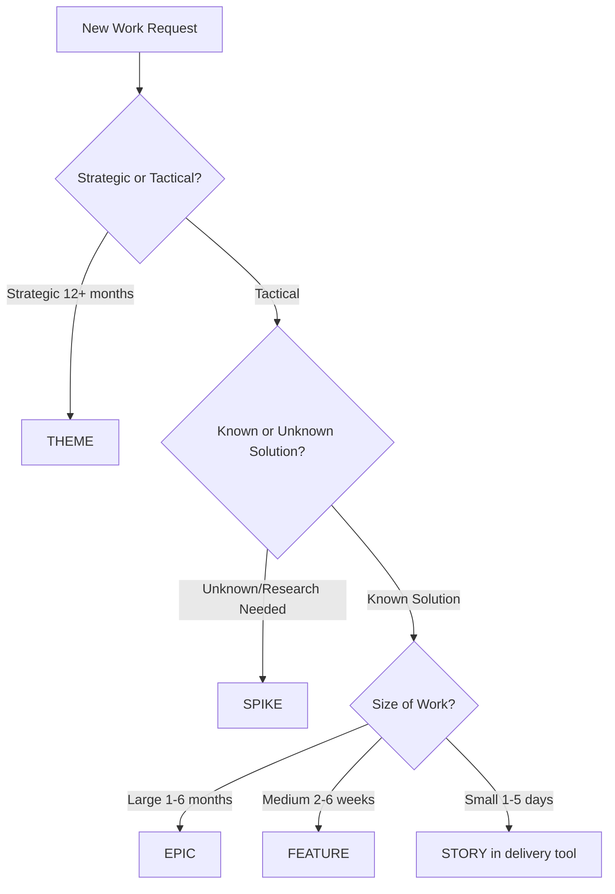

create # Roadmap & Work Request Organization

> This folder contains all delivery planning artifacts organized by the **Work Taxonomy Hierarchy**

---

## Contents

- [Work Taxonomy Overview](#work-taxonomy-overview)
- [How to Organize Architecture Work Requests](#how-to-organize-architecture-work-requests)
- [Work Request Lifecycle](#work-request-lifecycle)
- [Folder Structure](#folder-structure)
- [Templates](#templates)
- [Examples](#examples)

---

## Work Taxonomy Overview

Architecture work requests follow a hierarchical structure from strategic to tactical:

```
THEME (Strategic Investment Area)         12-24 months
  │
  ├── EPIC (Large Initiative)             1-6 months
  │     │
  │     ├── FEATURE (Distinct Capability) 2-6 weeks
  │     │     │
  │     │     └── STORY (Unit of Work)    1-5 days
  │     │           │
  │     │           └── TASK              Hours
  │     │
  │     └── SPIKE (Research/Exploration)  1-2 weeks
  │
  └── EPIC (Another Initiative)
        │
        └── ...
```

### Hierarchy Definitions

| Level | Definition | Duration | Managed In | Decision Level |
|-------|------------|----------|------------|----------------|
| **THEME** | Strategic investment area aligned to business outcomes | 12-24 months | `themes/` | Executive / Architecture Board |
| **EPIC** | Large initiative delivering significant business value | 1-6 months | `epics/` | Architecture Team |
| **FEATURE** | Distinct capability or functionality that can be delivered | 2-6 weeks | `features/` | Architecture Team |
| **SPIKE** | Time-boxed research/exploration to reduce uncertainty | 1-2 weeks | `spikes/` | Architecture Team |
| **STORY** | Implementable unit of work (tracked in delivery tools) | 1-5 days | Jira/ADO | Delivery Team |
| **TASK** | Granular work item (tracked in delivery tools) | Hours | Jira/ADO | Individual |

---

## How to Organize Architecture Work Requests

### Step 1: Classify the Request Type

Determine what type of work is being requested:

| Request Type | Goes Into | Examples |
|--------------|-----------|----------|
| **Strategic direction** | New THEME | "Establish enterprise AI governance", "Enable real-time decisioning" |
| **New capability** | New EPIC under existing THEME | "Implement feature store", "Deploy LLM gateway" |
| **Enhancement to existing** | New FEATURE under existing EPIC | "Add model versioning to registry", "Enable A/B testing" |
| **Research/uncertainty** | New SPIKE | "Evaluate vector databases", "Proof of concept for RAG" |
| **Implementation work** | STORY in delivery tool | "Create API endpoint for model inference" |
| **Small task** | TASK in delivery tool | "Update Terraform configuration for S3 bucket" |

### Step 2: Determine Placement in Hierarchy



### Step 3: Use the Correct Template

Each work type has a template in the respective folder:

```
07-roadmap/
  ├── themes/
  │     └── YYYY-theme-name.md                  (Use for strategic initiatives)
  │
  ├── epics/
  │     ├── templates/
  │     │     └── epic-template.md              (Copy this for new epics)
  │     └── EPIC-XXX-short-name.md
  │
  ├── features/
  │     ├── templates/
  │     │     └── feature-template.md           (Copy this for new features)
  │     └── FEATURE-XXX-short-name.md
  │
  └── spikes/
        ├── templates/
        │     └── spike-template.md             (Copy this for research work)
        └── SPIKE-XXX-short-name.md
```

### Step 4: Link to Architecture Artifacts

All work items should reference relevant architecture artifacts:

| Work Item Links To | Example |
|-------------------|---------|
| **Capabilities** | `02-capabilities/knowledge/semantic-layer.md` |
| **ABBs** | `03-building-blocks/architecture-building-blocks/data/feature-store.md` |
| **SBBs** | `03-building-blocks/solution-building-blocks/data/feast-kubernetes.md` |
| **Patterns** | `03-building-blocks/patterns/data/feature-serving-pattern.md` |
| **ADRs** | `05-governance/decisions/ADR-001-model-registry-selection.md` |
| **Standards** | `05-governance/standards/ml-model-governance.md` |

---

## Work Request Lifecycle

### 1. Request Intake

**Where:** New work requests start in `backlog/` folder

**Format:** Create a brief markdown file with:
```markdown
# [Request Title]

**Requestor:** [Name/Team]
**Date:** YYYY-MM-DD
**Priority:** High/Medium/Low

## Description
[What is being requested]

## Business Value
[Why this matters]

## Proposed Scope
[Initial thinking on scope]
```

**Filename:** `backlog/request-YYYY-MM-DD-short-description.md`

### 2. Triage & Classification

**Who:** Architecture team reviews weekly

**Actions:**
1. Classify into THEME/EPIC/FEATURE/SPIKE
2. Assess alignment to existing themes
3. Estimate size and complexity
4. Identify dependencies
5. Assign priority

### 3. Planning & Approval

**Governance:**
- **THEMEs:** Require Architecture Board approval
- **EPICs:** Require Architecture Team lead approval
- **FEATUREs:** Approved by Architecture Team
- **SPIKEs:** Approved by Architecture Team lead

### 4. Promotion to Active Work

Once approved, move from backlog:
```
backlog/request-2024-12-feature-store.md
  ↓ (becomes)
epics/EPIC-042-feature-store-implementation.md
```

### 5. Decomposition

Break down into smaller pieces:
```
EPIC-042: Feature Store Implementation
  ├── FEATURE-042-01: Online feature serving
  ├── FEATURE-042-02: Offline feature processing
  ├── FEATURE-042-03: Feature versioning
  └── SPIKE-042-01: Evaluate Feast vs Tecton
```

### 6. Delivery Tracking

- Stories and Tasks tracked in delivery tools (Jira/Azure DevOps)
- Architecture artifacts updated as work progresses
- Link delivery items back to EPICs/FEATUREs

### 7. Closure & Documentation

Upon completion:
1. Update capability maturity in `02-capabilities/`
2. Document ABBs/SBBs in `03-building-blocks/`
3. Create/update ADRs in `05-governance/decisions/`
4. Update reference architecture in `04-reference-architecture/`
5. Mark EPIC/FEATURE as completed with closure date

---

## Folder Structure

### `/themes/`
Strategic investment areas (12-24 months)

**Naming Convention:** `YYYY-theme-short-name.md`

**Example:**
- `2024-platform-foundation.md`
- `2025-enterprise-ai-governance.md`
- `2025-multi-region-scale.md`

### `/epics/`
Large initiatives delivering business value (1-6 months)

**Naming Convention:** `EPIC-XXX-short-name.md` where XXX is a sequential number

**Example:**
- `EPIC-001-infrastructure-foundation.md`
- `EPIC-042-feature-store-implementation.md`
- `EPIC-078-llm-gateway-deployment.md`

**Metadata Required:**
- Theme alignment
- Capabilities delivered
- ABBs/SBBs involved
- Dependencies
- Success criteria

### `/features/`
Distinct capabilities (2-6 weeks)

**Naming Convention:** `FEATURE-XXX-short-name.md` or `FEATURE-EPIC-SUB-short-name.md`

**Example:**
- `FEATURE-042-01-online-feature-serving.md`
- `FEATURE-078-02-prompt-caching.md`

**Metadata Required:**
- Parent epic
- Capability area
- Definition of done
- Acceptance criteria

### `/spikes/`
Research and exploration (1-2 weeks)

**Naming Convention:** `SPIKE-XXX-short-name.md` or `SPIKE-EPIC-SUB-topic.md`

**Example:**
- `SPIKE-001-vector-database-evaluation.md`
- `SPIKE-042-01-feast-vs-tecton-comparison.md`

**Metadata Required:**
- Research question
- Success criteria (what decision will be made)
- Time box
- Expected outputs (ADR, proof of concept, report)

### `/quarterly-objectives/`
Quarterly planning summaries

**Naming Convention:** `YYYYQX-objectives.md`

**Example:**
- `2024Q4-objectives.md`
- `2025Q1-objectives.md`

**Contents:**
- Epics targeted for the quarter
- Key milestones
- Resource allocation
- Risk mitigation

### `/backlog/`
Prioritized future work not yet scheduled

**Naming Convention:** `request-YYYY-MM-DD-short-description.md`

**Example:**
- `request-2024-12-03-multi-tenancy-support.md`
- `request-2024-11-15-cost-optimization-study.md`

**Contents:**
- Brief description
- Requestor
- Business justification
- Rough sizing
- Priority indication

---

## Templates

All work item templates are located in:
- `themes/` - Theme definition template (create manually)
- `epics/templates/epic-template.md` - Epic planning template
- `features/templates/feature-template.md` - Feature definition template
- `spikes/templates/spike-template.md` - Spike research template

Duplicate templates available in: `08-assets/templates/`

---

## Examples

### Example 1: New Capability Request

**Request:** "We need a feature store to enable real-time ML feature serving"

**Classification:**
- Type: New capability (large)
- Size: 1-6 months
- **Decision:** Create EPIC

**Structure:**
```
EPIC-042: Feature Store Implementation
  ├── SPIKE-042-01: Evaluate Feast vs Tecton vs Build
  │     └── Output: ADR-042 (Technology Selection)
  │
  ├── FEATURE-042-01: Online Feature Serving
  │     ├── Story: Design API interface
  │     ├── Story: Implement feature cache
  │     └── Story: Deploy to staging
  │
  ├── FEATURE-042-02: Offline Feature Processing
  │     ├── Story: Create batch pipeline
  │     └── Story: Integrate with data lake
  │
  └── FEATURE-042-03: Feature Registry & Versioning
        └── Stories: (in delivery tool)
```

**Files Created:**
```
07-roadmap/epics/EPIC-042-feature-store-implementation.md
07-roadmap/spikes/SPIKE-042-01-feature-store-evaluation.md
07-roadmap/features/FEATURE-042-01-online-feature-serving.md
07-roadmap/features/FEATURE-042-02-offline-feature-processing.md
07-roadmap/features/FEATURE-042-03-feature-registry.md
```

**Architecture Artifacts:**
```
02-capabilities/knowledge/feature-management.md (updated)
03-building-blocks/architecture-building-blocks/data/feature-store.md (new)
03-building-blocks/solution-building-blocks/data/feast-on-kubernetes.md (new)
05-governance/decisions/ADR-042-feature-store-technology.md (new)
```

### Example 2: Enhancement Request

**Request:** "Add A/B testing capability to model serving"

**Classification:**
- Type: Enhancement to existing capability
- Size: 2-4 weeks
- **Decision:** Create FEATURE under existing model serving EPIC

**Structure:**
```
EPIC-015: Model Serving Platform (existing)
  ├── FEATURE-015-03: A/B Testing for Models (new)
        ├── Story: Design traffic splitting mechanism
        ├── Story: Implement model version routing
        ├── Story: Add metrics collection
        └── Story: Create control plane API
```

**Files Created:**
```
07-roadmap/features/FEATURE-015-03-ab-testing-models.md
```

**Architecture Artifacts:**
```
03-building-blocks/patterns/operational/ab-testing-pattern.md (new)
03-building-blocks/solution-building-blocks/application/seldon-ab-testing.md (updated)
```

### Example 3: Research Request

**Request:** "Investigate best vector database for our RAG use cases"

**Classification:**
- Type: Research with unknown solution
- Size: 2 weeks
- **Decision:** Create SPIKE

**Structure:**
```
SPIKE-078: Vector Database Evaluation
  ├── Evaluation criteria definition
  ├── Candidate assessment (Pinecone, Weaviate, Milvus, pgvector)
  ├── Proof of concept
  └── Output: ADR-078 (Technology Recommendation)
```

**Files Created:**
```
07-roadmap/spikes/SPIKE-078-vector-database-evaluation.md
```

**Architecture Artifacts (after spike completion):**
```
05-governance/decisions/ADR-078-vector-database-selection.md (new)
06-technology/vendor-evaluations/vector-databases-2024.md (new)
03-building-blocks/solution-building-blocks/data/weaviate-vector-store.md (new)
```

---

## Governance & Review

### Weekly Intake Review
- Review new items in `backlog/`
- Classify and prioritize
- Assign to architecture team members

### Quarterly Planning
- Review theme progress
- Plan epics for upcoming quarter
- Update `quarterly-objectives/`
- Adjust priorities based on business needs

### Architecture Board Reviews
- New themes require board approval
- High-impact epics require review
- Technology selections (from spikes) require approval
- Quarterly progress reviews

---

## Best Practices

### 1. Start Small, Think Big
- Begin with clear, achievable features
- Link to broader epic and theme
- Allow for iteration and learning

### 2. Maintain Traceability
- Every work item links to capabilities
- Every technical decision links to business value
- Every implementation links to architecture artifacts

### 3. Use Spikes Wisely
- Time-box research (1-2 weeks max)
- Define clear success criteria upfront
- Always produce a decision artifact (ADR)
- Convert learning into actionable features

### 4. Keep Backlog Healthy
- Review and prune quarterly
- Merge duplicate requests
- Update priorities based on strategic changes
- Archive items that are no longer relevant

### 5. Document Decisions
- Create ADRs for significant choices
- Link ADRs to epics/spikes that drove them
- Update technology radar based on evaluations
- Keep architecture artifacts in sync

---

## FAQs

### Q: Where do ad-hoc requests go?
**A:** All requests start in `backlog/` regardless of size. Urgent items can be fast-tracked through triage.

### Q: What if a request doesn't fit the taxonomy?
**A:** Most work can be classified. If truly exceptional, document as a SPIKE to explore the right approach.

### Q: How do we handle dependencies between teams?
**A:** Document dependencies in epic metadata. Create a `dependencies.md` file in this folder for cross-cutting dependencies.

### Q: What about operational support work?
**A:** Operational work (incidents, maintenance) is tracked separately. Architecture changes resulting from ops work should flow through this process.

### Q: How do we prioritize competing requests?
**A:** Priority is based on:
1. Strategic theme alignment
2. Business value / impact
3. Risk reduction
4. Dependencies and sequencing
5. Resource availability

### Q: When do we create a new THEME vs. adding to existing?
**A:** Create a new theme when:
- It represents a distinct strategic direction (12+ months)
- It has dedicated budget and resources
- It aligns to a new business capability domain
- It requires executive-level governance

---

## Contacts

| Role | Responsibility | Contact |
|------|---------------|---------|
| **Architecture Team Lead** | Epic/Theme approval, resource allocation | [Name] |
| **Architecture Team** | Feature definition, spike execution | [Team alias] |
| **Product Owner** | Business prioritization | [Name] |
| **Engineering Leads** | Story/task delivery | [Names] |

---

## Related Documentation

- [README.md](../README.md) - Overall architecture repository guide
- [02-capabilities/](../02-capabilities/) - Business capabilities
- [03-building-blocks/](../03-building-blocks/) - Architecture components
- [05-governance/decisions/](../05-governance/decisions/) - Architecture decisions
- [CONTRIBUTING.md](../CONTRIBUTING.md) - Contribution guidelines

